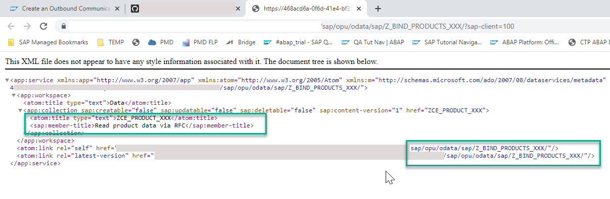

# Call a Remote Function Module (RFC) and Get Data Using a Custom Entity
<!-- description --> Get data from an on-Premise System Using RFC, by Implementing a Custom Entity in ABAP Environment

## Prerequisites
- You have done one of the following:
    - Created an instance of [SAP Business Technology Platform, ABAP Environment, Trial Version](https://blogs.sap.com/2019/09/28/its-trialtime-for-abap-in-sap-cloud-platform/)
    - Created an entitlement to [SAP Business Technology Platform, ABAP Environment](https://www.sapstore.com/solutions/40191/SAP-BTP-ABAP-Environment), customer licensed version
- **IMPORTANT**: If you are using the licensed version, then this tutorial is part of the mission [Connect Your On-Premise System with SAP BTP, ABAP Environment](mission.abap-env-connect-onpremise). Please work through the previous tutorials in the mission first; otherwise this tutorial may not work. If you are using the trial version, we have provided mock data inside the class.


## You will learn
  - How to create a suitable custom entity to get data from a remote system
  - How to implement a query provider class to get the data, using a BAPI (Business Application Programming Interface)
  - How to expose the custom entity as a **service definition**
  - How to display the data in a Fiori Elements Preview, using a **service binding**

## Intro
Note that, if you are using the trial version, currently you cannot access an on-premise system using RFC. In that case, you will test the class using mock data.

A BAPI is a standard interface to a business object model, implemented as a function module.

Custom entities are used for data models whose runtime is implemented manually. There is no SELECT statement on the data source. Rather, you define the elements and their types in the custom entity. Then you implement the data retrieval logic in an ABAP class, which is referenced in an entity annotation. Custom entities allow you to get data using an OData service or, as here, using RFC.


---

### Create a class

First, you create the class that implements the data retrieval logic.

1. In ADT, open your ABAP package and choose **New > Class**.

    

2. Enter the following, then choose **Next**:
    - Name: **`zcl_product_via_rfc_000`**
    - Description: Read product data via `RFC`
    - Interfaces: **`interfaces if_rap_query_provider`**

3. Choose the transport request, then choose **Finish**.

> The signature of the method `IF_RAP_QUERY_PROVIDER~SELECT` contains the import parameter `io_request`. This parameter represents the OData query options that are delegated from the UI and used as input for the SELECT method. Whenever the OData client requests data, the query implementation class must return the data that matches the request, or throw an exception if the request cannot be fulfilled. Later in this tutorial, you will implement the SELECT method of the interface.


### Create a custom entity (CDS View)

1. Now choose **New >  Other... > Core Data Services > Data Definition**.

2. Enter a name and description:
    - `zce_product_000`
    - Read product data via `RFC`

3. Choose the transport request, then choose **Next**. Do **not** choose **Finish**, yet!

4. Choose **Define Custom Entity with Parameters**, then choose **Finish**. Ignore the errors for now.

    


### Specify the class in the custom entity

Add the following annotation to the view (immediately after the '@EndUserText.label' annotation), pointing to the class you have just created - NOTE: Use upper case!

```CDS

@ObjectModel.query.implementedBy: 'ABAP:ZCL_PRODUCT_VIA_RFC_000'

```


### Define the CDS view

1. Remove the following lines from the view:

    ```CDS


    define root custom entity zce_product_000
    with parameters parameter_name : parameter_type {
     key key_element_name : key_element_type;
     element_name : element_type;

    }

    ```


2. Add the header information to the view, after the `@QueryImplementedBy` annotation.
For more information on the UI Annotations used here, see
[SAP Help Portal: SAP BTP: ABAP RESTful PM: Defining UI Annotations](https://help.sap.com/viewer/923180ddb98240829d935862025004d6/Cloud/en-US/fd95e7c9905e469bb176217f49e15e71.html)

    ```CDS

    @UI: {
      headerInfo: {
      typeName: 'Product',
      typeNamePlural: 'Products'
      }
    }

    ```

3. Add the fields and their associations.

    ```CDS

    define root custom entity zce_product_000
    {

          @UI.facet     : [
            {
              id        :       'Product',
              purpose   :  #STANDARD,
              type      :     #IDENTIFICATION_REFERENCE,
              label     :    'Product',
              position  : 10 }
          ]
          // DDL source code for custom entity for BAPI_EPM_PRODUCT_HEADER

          @UI           : {
          lineItem      : [{position: 10, importance: #HIGH}],
          identification: [{position: 10}],
          selectionField: [{position: 10}]
          }
      key ProductId     : abap.char( 10 );
          TypeCode      : abap.char( 2 );
          @UI           : {
          lineItem      : [{position: 20, importance: #HIGH}],
          identification: [{position: 20}],
          selectionField: [{position: 20}]
          }
          Category      : abap.char( 40 );
          @UI           : {
          lineItem      : [{position: 30, importance: #HIGH}],
          identification: [{position: 30}]
          }
          Name          : abap.char( 255 );
          @UI           : {
          identification: [{position: 40}]
          }
          Description   : abap.char( 255 );
          SupplierId    : abap.char( 10 );
          SupplierName  : abap.char( 80 );
          TaxTarifCode  : abap.int1;
          @Semantics.unitOfMeasure: true
          MeasureUnit   : abap.unit( 3 );
          @Semantics.quantity.unitOfMeasure: 'WeightUnit'
          WeightMeasure : abap.quan( 13, 3 );
          @Semantics.unitOfMeasure: true
          WeightUnit    : abap.unit( 3 );
          @UI           : {
          lineItem      : [{position: 50, importance: #HIGH}],
          identification: [{position: 50}]
          }
          Price         : abap.dec( 23, 4 );
          @Semantics.currencyCode: true
          CurrencyCode  : abap.cuky( 5 );
          @Semantics.quantity.unitOfMeasure: 'DimUnit'
          Width         : abap.quan( 13, 3 );
          @Semantics.quantity.unitOfMeasure: 'DimUnit'
          Depth         : abap.quan( 13, 3 );
          @Semantics.quantity.unitOfMeasure: 'DimUnit'
          Height        : abap.quan( 13, 3 );
          @Semantics.unitOfMeasure: true
          DimUnit       : abap.unit( 3 );
          ProductPicUrl : abap.char( 255 );

    }

    ```

You will now implement the data retrieval logic in the class.


### Define some variables in the class

Go back to the class.

1. You will start by defining an local internal table, which you will fill by retrieving the data from the back end. The type of the local variable is the CDS View that you just created. Add the following code to the `if_rap_query_provider~select` method.

    ```ABAP

    DATA lt_product TYPE STANDARD TABLE OF zce_product_000.

    ```

2. Create a variable, `lv_abap_trial`. **If** you are using the full version of SAP BTP, ABAP Environment, set it to **false**, otherwise **true**.

    ```ABAP

    DATA(lv_abap_trial) = abap_false.  

    ```


### Define the connection to the on-premise system

If you are working in the trial version, omit this step.

If you are working in the full version of ABAP Environment: Define the connection as follows, replacing `000` in both `i_name` and `i_service_instance_name` to your initials or group number. Ignore the warning for now. Wrap this in a `TRY. ...CATCH... ENDTRY.`

**IMPORTANT**: Always specify the authentication mode using the interface `if_a4c_cp_service`. Never hard-code your password in the class.

    ```ABAP

    IF lv_abap_trial = abap_false.

      TRY.
      DATA(lo_destination) = cl_rfc_destination_provider=>create_by_comm_arrangement(
                              comm_scenario          = Z_OUTBOUND_RFC_000_CS     " Communication scenario
                              service_id             = Z_OUTBOUND_HANA_000       " Outbound service
                              comm_system_id         = Z_OUTBOUND_HANA_CS_000    " Communication system

                             ).

        DATA(lv_destination) = lo_destination->get_destination_name( ).

      CATCH cx_rfc_dest_provider_error INTO DATA(lx_dest).
      ENDTRY.

    ENDIF.

    ```


### Call the remote BAPI or insert the mock data

1. Check whether data is being requested.

    ```ABAP

    IF io_request->is_data_requested( ).

    ENDIF.
    ```

2. Now add an `IF... ELSE. ... ENDIF.` block.

3. If you are using the trial version, fill the internal table `lt_product` with the mock data. If not, call the `BAPI`.

    ```ABAP

     DATA lv_maxrows TYPE int4.

     DATA(lv_skip) = io_request->get_paging( )->get_offset(  ).
     DATA(lv_top) = io_request->get_paging( )->get_page_size(  ).

     lv_maxrows = lv_skip + lv_top.

     IF lv_abap_trial = abap_true.
          lt_product = VALUE #( ( productid = 'HT-1000' name = 'Notebook' )
                                ( productid = 'HT-1001' name = 'Notebook' )
                                ( productid = 'HT-1002' name = 'Notebook' )
                                ( productid = 'HT-1003' name = 'Notebook' )
                                ( productid = 'HT-1004' name = 'Notebook' )
                                ( productid = 'HT-1005' name = 'Notebook' )
                          ).


    ELSE.                      
     CALL FUNCTION 'BAPI_EPM_PRODUCT_GET_LIST'
       DESTINATION lv_destination
       EXPORTING
         max_rows   = lv_maxrows
       TABLES
         headerdata = lt_product.

    ENDIF.

    ```


### Set the total number of records and return the data

1. Set the total number of records requested.

    ```ABAP

    IF io_request->is_total_numb_of_rec_requested( ).
    io_response->set_total_number_of_records( lines( lt_product ) ).
    ENDIF.

    ```

2. Output the data in the internal table.

    ```ABAP

    io_response->set_data( lt_product ).

    ```


### Catch the exception if raised

Wrap the whole data retrieval logic call in a second `TRY. ..CATCH...ENDTRY` block.

    ```ABAP

    TRY.
    ...
      CATCH cx_rfc_dest_provider_error INTO DATA(lx_dest).
    ENDTRY.

    ```


### Check the code for your class

```ABAP

CLASS `zcl_product_via_rfc_000` DEFINITION
  PUBLIC
  FINAL
  CREATE PUBLIC .

  PUBLIC SECTION.
    INTERFACES if_rap_query_provider.
  PROTECTED SECTION.
  PRIVATE SECTION.
ENDCLASS.

CLASS `zcl_product_via_rfc_000` IMPLEMENTATION.
  METHOD if_rap_query_provider~select.

    DATA lt_product TYPE STANDARD TABLE OF  ZCE_PRODUCT_000 .

    "In the trial version we cannot call RFC function module in backend systems
    DATA(lv_abap_trial) = abap_true.

    "Set RFC destination
    TRY.

      data(lo_destination) = cl_rfc_destination_provider=>create_by_cloud_destination(
            i_name = 'ES5_RFC_000'
            ).

      DATA(lv_destination) = lo_destination->get_destination_name(  ).


        "Check if data is requested
        IF io_request->is_data_requested(  ).

            DATA lv_maxrows TYPE int4.
            DATA(lv_skip) = io_request->get_paging( )->get_offset(  ).
            DATA(lv_top) = io_request->get_paging( )->get_page_size(  ).
            lv_maxrows = lv_skip + lv_top.

                IF lv_abap_trial = abap_true.
                    lt_product = VALUE #(
                              ( productid = 'HT-1000' name = 'Notebook' )
                              ( productid = 'HT-1001' name = 'Notebook' )
                              ( productid = 'HT-1002' name = 'Notebook' )
                              ( productid = 'HT-1003' name = 'Notebook' )
                              ( productid = 'HT-1004' name = 'Notebook' )
                              ( productid = 'HT-1005' name = 'Notebook' )
                              ).

                ELSE.
                  "Call BAPI
                  CALL FUNCTION 'BAPI_EPM_PRODUCT_GET_LIST'
                       DESTINATION lv_destination
                       EXPORTING
                         max_rows   = lv_maxrows
                       TABLES
                         headerdata = lt_product
                         .

                ENDIF.
                  "Set total no. of records
                  io_response->set_total_number_of_records( lines( lt_product ) ).
                  "Output data
                  io_response->set_data( lt_product ).

        ENDIF.

    CATCH  cx_rfc_dest_provider_error INTO DATA(lx_dest).
    ENDTRY.


  ENDMETHOD.
ENDCLASS.

```


### Create a service definition

Now that you have defined your view, and retrieved the data using the class, you can expose the view as a **Business Service**. A **Business Service** consists of a **Service Definition** and a **Service Binding**.

You use a **Service Definition** to define which data is to be exposed (with the required granularity) as a Business Service.

You then use the **Service Binding** to bind a service definition to a client-server communication protocol such as OData. This allows you to provide several bindings for the same definition, e.g. to expose the service to a UI, and to an `A2X` provider.

<!-- 
For more information, see:

- Business Service Definition in ADT Help.

- Business Service Binding in ADT Help.
 -->

Start with the Service Definition:

1. From your package, select your custom entity, **`zce_product_000`**, then choose **New > Service Definition** from the context menu, then choose **Next**.

    

2. Choose a name and description:
    - **`Z_EXPOSE_PRODUCTS_000`**
    - Expose product data via RFC

3. Choose the transport request; choose **Next**.

4. Use the selected template; choose **Finish**. The name of your custom entity is inserted automatically.

    

5. Save and activate ( **`Ctrl+S, Ctrl+F3`** ) the service definition.


### Create the service binding

1. Select your service definition, then choose **Service Binding** from the context menu, then choose **Next**.

2. Enter the following, then choose **Next**:
    - Name = **`Z_BIND_PRODUCTS_000`**
    - Description = Bind product data via RFC
    - Binding Type = ODATA V2 (UI...)
    - Service Definition = `ZSD_PRODUCT_000`

      

3. Choose the transport request; choose **Finish**.

The service binding automatically references the service definition and thus the exposed custom entity.


### Activate service binding

1. In the editor that appears, choose **Activate**.

    

2. Then choose **Publish**. You can now see the Service URL and Entity Set.

    

3. You can open the Service Document (`XML`) in your browser, by choosing **Service URL**.

    <!-- border -->

4. In the browser, you can also see the **Metadata Document** of the Business Service by adding $metadata to the URL: `sap/opu/odata/sap/Z_BIND_PRODUCT_TEST_001/$metadata`.

    <!-- border -->


### Display the Fiori Elements preview

1. Select the entity set and choose **Preview**.

    

2. Log in using your ABAP Environment user and password; the Fiori Elements preview appears.

3. Display the data by choosing **Go**.

    


### Test yourself


### Troubleshooting: Test data retrieval using the ABAP Console

If the data does not display (and you are using the licensed version), check that the BAPI is retrieving the data, as follows:

1. Open the class you created in [Test the Connection to the Remote System](abap-environment-test-rfc).

2. Replace the type `ty_bapi_epm_product_header`:

    ```ABAP

    DATA lt_product TYPE STANDARD TABLE OF  ty_bapi_epm_product_header.
    DATA ls_product TYPE ty_bapi_epm_product_header.

    ```

with the type of your custom entity:

    ```ABAP

    DATA lt_product TYPE STANDARD TABLE OF zce_product_via_rfc_000.
    DATA ls_product TYPE zce_product_via_rfc_000.

    ```

The console output should look like this:


## More Information

- [SAP Help Portal: BAPI](https://help.sap.com/viewer/166400f6be7b46e8adc6b90fd20f3516/1709%20002/en-US)

- [SAP Help Portal: Using a CDS Custom Entity to Define the Data Model for an OData Service](https://help.sap.com/viewer/c0d02c4330c34b3abca88bdd57eaccfc/Cloud/en-US/6a064c09c508435a81357898e8e65d06.html)

- [Implement a custom entity in the ABAP RESTful Programming Model using RFC](https://blogs.sap.com/2019/03/01/how-to-implement-a-custom-entity-in-the-abap-restful-programming-model-using-remote-function-modules/) - includes handling a single record, filtering, and ordering

- [Insert test data into tables in SAP BTP, ABAP Environment](https://blogs.sap.com/2019/09/30/how-to-insert-test-data-into-tables-in-sap-cloud-platform-abap-environment/)

- [Call a remote OData service from the trial version of SAP BTP ABAP environment](https://blogs.sap.com/2019/10/20/how-to-call-a-remote-odata-service-from-the-trial-version-of-sap-cloud-platform-abap-environment/)

- Find out more about SAP Business Technology Platform ABAP Environment on SAP Community: [SAP Business Technology Platform ABAP Environment](https://community.sap.com/topics/btp-abap-environment)

---
