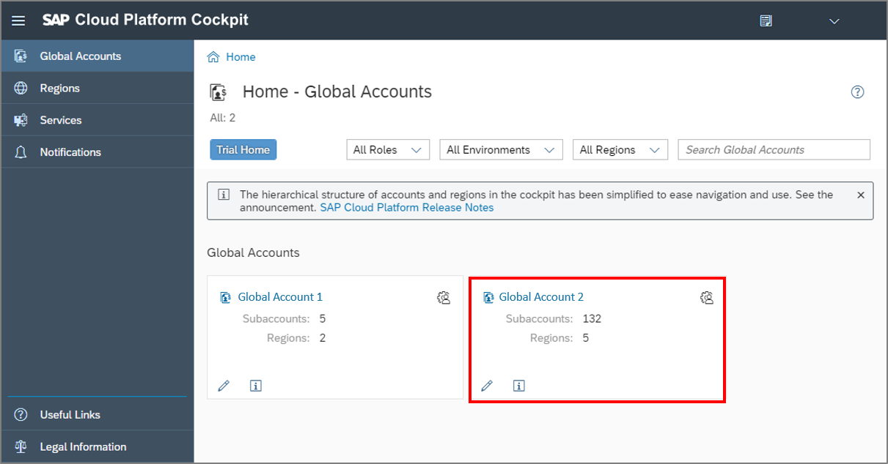
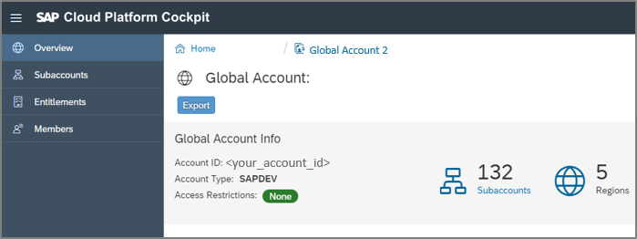
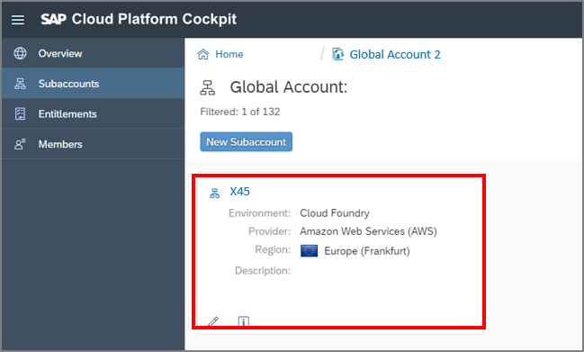
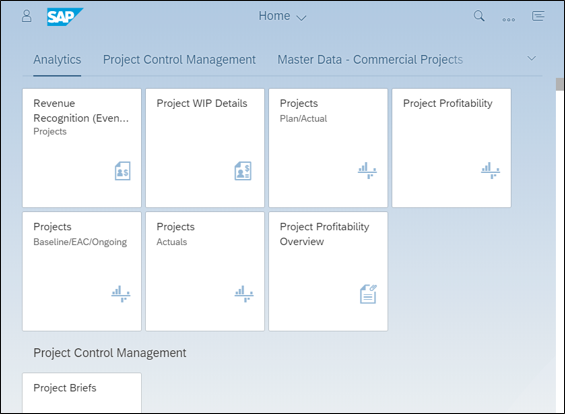
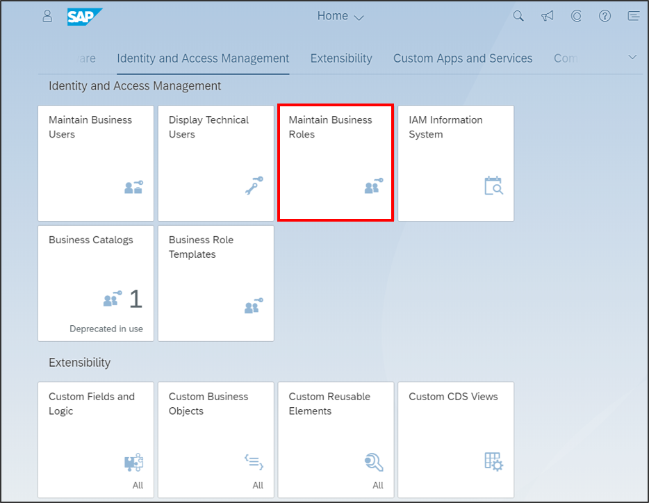
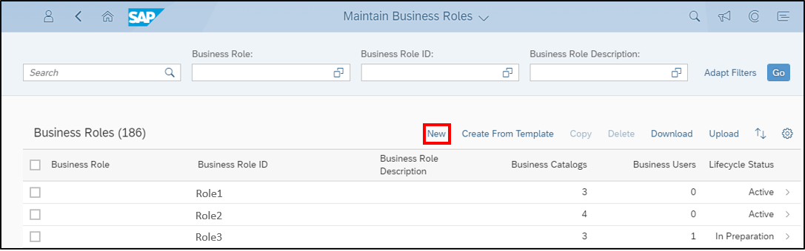
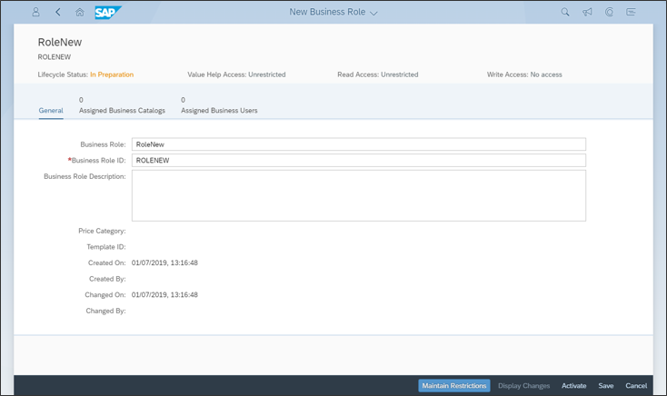
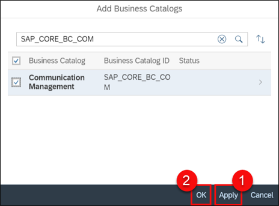

## Prerequisites  
  - SAP Cloud Platform ABAP Environment user
  - ADT version 2.96 or higher

## Details
### You will learn
  - How to download trust
  - How to create a role for communication management

In this tutorial, wherever `XXX` appears, use a number (e.g. `000`).

---

[ACCORDION-BEGIN [Step 1: ](Open SAP Cloud Platform Cockpit)]
Open SAP Cloud Platform Cockpit and select your global account.

[DONE]
[ACCORDION-END]

[ACCORDION-BEGIN [Step 2: ](Open Subaccounts)]
Click **Subaccounts**.

[DONE]
[ACCORDION-END]

[ACCORDION-BEGIN [Step 3: ](Select Subaccount)]
Select your Cloud Foundry subaccount.

[DONE]
[ACCORDION-END]

[ACCORDION-BEGIN [Step 4: ](Download Trust)]
Go to **Destinations** and click **Download Trust** to get the certification.

[DONE]
[ACCORDION-END]

[ACCORDION-BEGIN [Step 5: ](Open SAP S/4HANA Cloud system)]
Open SAP S/4HANA Cloud system as an administrator.

[DONE]
[ACCORDION-END]

[ACCORDION-BEGIN [Step 6: ](Select Maintain Business Roles)]
Go to Identity and Access Management and select the **Maintain Business Roles** tile.

[DONE]
[ACCORDION-END]

[ACCORDION-BEGIN [Step 7: ](Create new business role)]
Click **New** to create a new business role.

[DONE]
[ACCORDION-END]

[ACCORDION-BEGIN [Step 8: ](Define business role and business role ID)]

  1. Define your business role and your business role ID.

      

  2. Search `SAP_CORE_BC_COM`, select it, apply the change and click OK.

      

[DONE]
[ACCORDION-END]

[ACCORDION-BEGIN [Step 9: ](Test yourself)]

[VALIDATE_1]
[ACCORDION-END]
