## Prerequisites  
 - Create a developer user in a SAP BTP, ABAP Environment system.
 - Communication arrangement for scenario `SAP_COM_0027` is created in your SAP BTP, ABAP Environment system

## Details
### You will learn  
  - How to create a bonus plan scenario with S/4HANA Cloud and SAP BTP, ABAP Environment


---

[ACCORDION-BEGIN [Step 1: ](Create database table for bonus calculation)]
  1. Open Eclipse, select your package and click **File** > **New** > **Other…**

      

  2. Search for database table, select it and click **Next**.

      

  3. Create a database table.
     - Name: `ZBONUSCALCXXX`
     - Description: Database table for bonus calculation

     Click **Next**.

      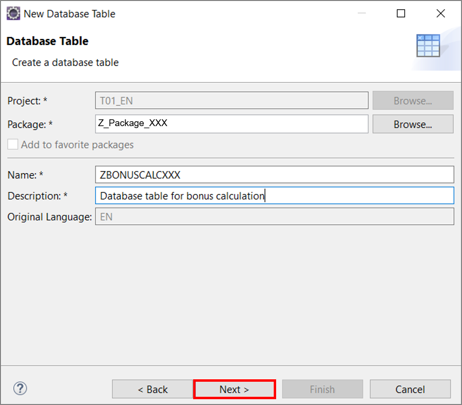

  4. Click **Finish**.

      

  5. Replace your code with following.

    ```ABAP  
      @EndUserText.label : 'Database table for bonus calculation'
      @AbapCatalog.enhancementCategory : #NOT_EXTENSIBLE
      @AbapCatalog.tableCategory : #TRANSPARENT
      @AbapCatalog.deliveryClass : #A
      @AbapCatalog.dataMaintenance : #LIMITED
      define table zbonuscalcxxx {
        key client              : abap.clnt not null;
        key id                  : abap.numc(10) not null;
        sap_createddatetime     : tzntstmpl;
        sap_createdbyuser       : syuname;
        sap_lastchangeddatetime : tzntstmpl;
        sap_lastchangedbyuser   : syuname;
        @EndUserText.label : 'Validity Start Date'
        validitystartdate       : abap.dats;
        @EndUserText.label : 'Validity End Date'
        validityenddate         : abap.dats;
        @EndUserText.label : 'Target Amount'
        @Semantics.amount.currencyCode : 'zbonuscalcxxx.targetamount_c'
        targetamount_v          : abap.curr(15,2);
        @EndUserText.label : 'Target Amount'
        targetamount_c          : abap.cuky;
        @EndUserText.label : 'Bonus Percentage'
        @Semantics.quantity.unitOfMeasure : 'zbonuscalcxxx.bonuspercentage_u'
        bonuspercentage_v       : abap.quan(15,1);
        @EndUserText.label : 'Low Percentage'
        bonuspercentage_u       : abap.unit(3);
        isconsistent            : abap_boolean;
        @EndUserText.label : 'Employee ID'
        employeeid              : abap.char(10);
        @EndUserText.label : 'Employee Name'
        employeename            : abap.sstring(81);
        @EndUserText.label : 'Release Status'
        releasestatus           : abap.char(1);
        @EndUserText.label : 'Actual Revenue Amount'
        @Semantics.amount.currencyCode : 'zbonuscalcxxx.actualrevenueamount_c'
        actualrevenueamount_v   : abap.curr(15,2);
        @EndUserText.label : 'Actual Revenue Amount'
        actualrevenueamount_c   : abap.cuky;
        @EndUserText.label : 'Calculated Bonus'
        @Semantics.amount.currencyCode : 'zbonuscalcxxx.bonusamount_c'
        bonusamount_v           : abap.curr(15,2);
        @EndUserText.label : 'Total Bonus Amount'
        bonusamount_c           : abap.cuky;

      }
    ```

[DONE]
[ACCORDION-END]

[ACCORDION-BEGIN [Step 2: ](Create database table for release status)]
  1. Select your package and click **File** > **New** > **Other…**

      

  2. Search for database table, select it and click **Next**.

      

  3. Create a database table.
     - Name: `ZREL_STAT_XXX`
     - Description: Database table for release status

     Click **Next**.

      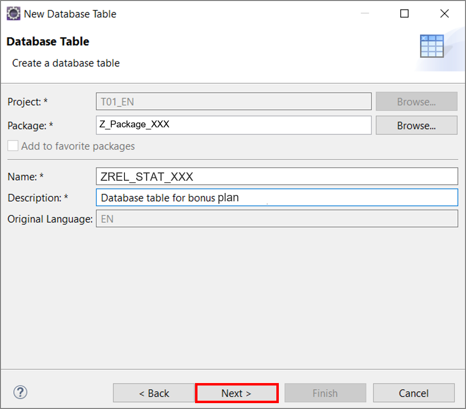

  4. Click **Finish**.

      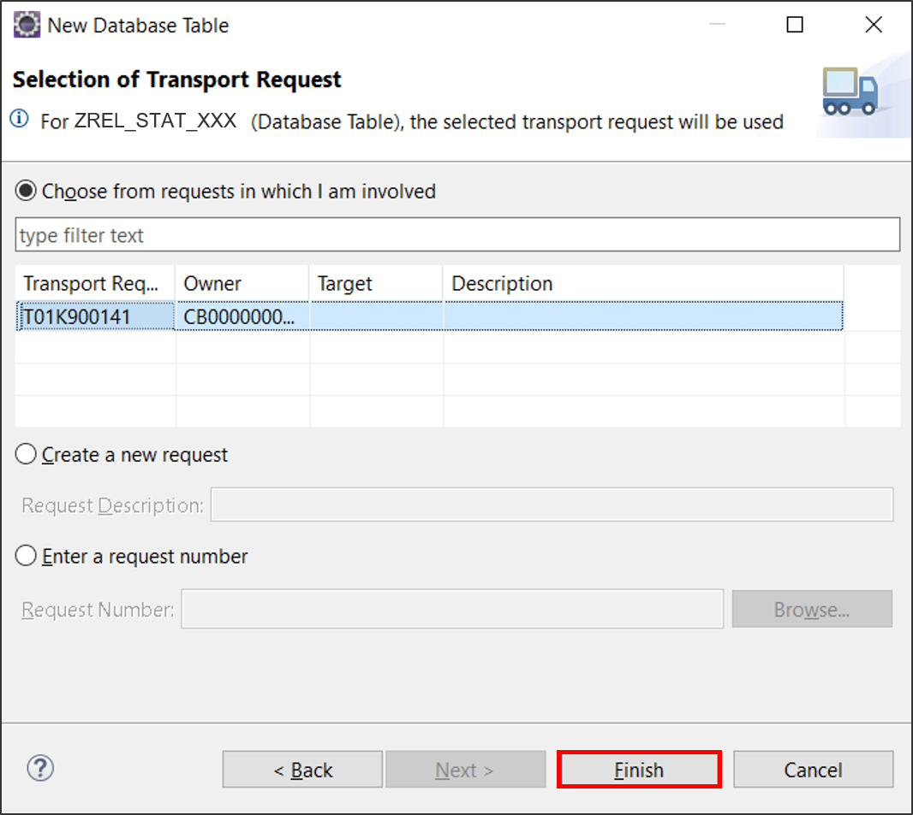

  5. Replace your code with following.

    ```ABAP  
      @EndUserText.label : 'Database table for release status'
      @AbapCatalog.enhancementCategory : #NOT_EXTENSIBLE
      @AbapCatalog.tableCategory : #TRANSPARENT
      @AbapCatalog.deliveryClass : #A
      @AbapCatalog.dataMaintenance : #LIMITED
      define table zrel_stat_xxx {
      key client  : abap.clnt not null;
      key code    : abap.char(1) not null;
      description : abap.sstring(60);

      }
    ```

[DONE]
[ACCORDION-END]

[ACCORDION-BEGIN [Step 3: ](Create data definition for employee service)]
  1. Select your package and click **File** > **New** > **Other…**

      

  2. Search for data definition, select it and click **Next**.

      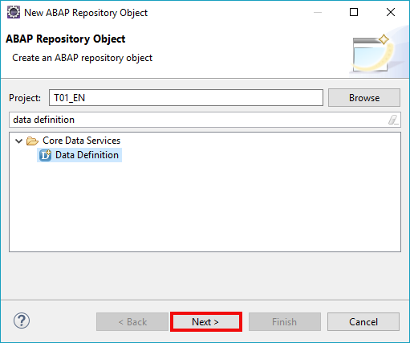

  3. Create a data definition.
     - Name: `ZI_CE_Employee_XXX`
     - Description: Data definition for employee entity

     Click **Next**.

      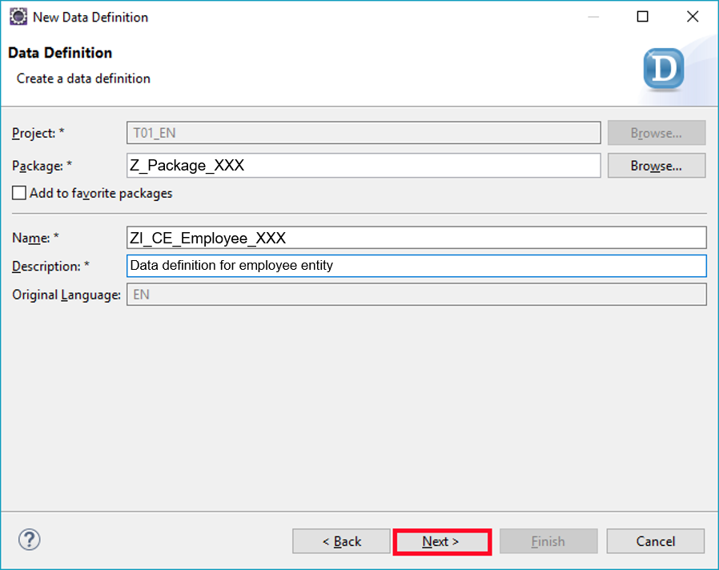

  4. Click **Finish**.

      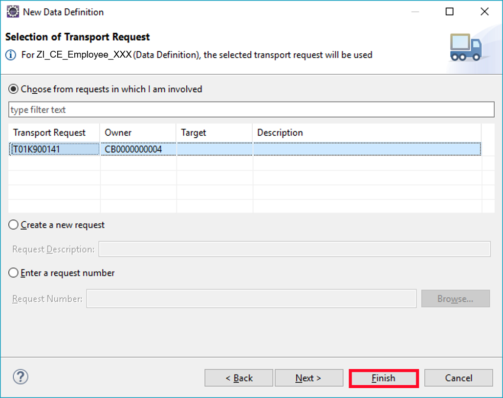

  5. Replace your code with following.

    ```ABAP
        @EndUserText.label: 'Employee custom entity XXX'
        @QueryImplementedBy: 'ZCL_CQ_EMPLOYEE_XXX'

        @UI: {
        headerInfo: {
          typeName: 'Employee',
          typeNamePlural: 'Employees',
          title: { type: #STANDARD, value: 'BusinessPartner' }
        },
        presentationVariant: [ { sortOrder: [ { by: 'BusinessPartner', direction: #DESC } ] } ]
        }

        define custom entity ZI_CE_Employee_XXX
        {
        @UI.facet: [
           {
             id:       'BusinessPartner',
             purpose:  #STANDARD,
             type:     #IDENTIFICATION_REFERENCE,
             label:    'Business Partner',
             position: 10 }
         ]

        @UI: {
          identification: [{ position: 10, label: 'Business Partner ID' }]
        }
        @OData.property.name: 'BusinessPartner'
        @EndUserText: { label: 'Business Partner', quickInfo: 'Business Partner' }
        key BusinessPartner : abap.char( 10 );

        @OData.property.name: 'FirstName'
        @UI: {
          lineItem: [ { position: 20, label: 'First Name' } ],
          identification: [{ position: 20, label: 'First Name' }]
        }
        @EndUserText: { label: 'First Name', quickInfo: 'First Name' }
        FirstName : abap.sstring( 20 );

        @Search.defaultSearchElement: true
        @OData.property.name: 'LastName'
        @UI: {
          lineItem: [ { position: 30, label: 'Last Name' } ],
          identification: [{ position: 30, label: 'Last Name' }]
        }
        @EndUserText: { label: 'Last Name', quickInfo: 'Last Name' }
        LastName : abap.sstring( 40 );

        }
    ```

      Save and activate.
      NOTE: First you will get an error message, but this will disappear later on.

[DONE]
[ACCORDION-END]

[ACCORDION-BEGIN [Step 4: ](Create data definition for bonus calculation)]
  1. Select your package and click **File** > **New** > **Other…**

      

  2. Search for data definition, select it and click **Next**.

      

  3. Create a data definition.
       - Name: `ZI_BONUS_CALC_XXX`
       - Description: Data definition for bonus calculation

     Click **Next**.

      

  4. Click **Finish**.

      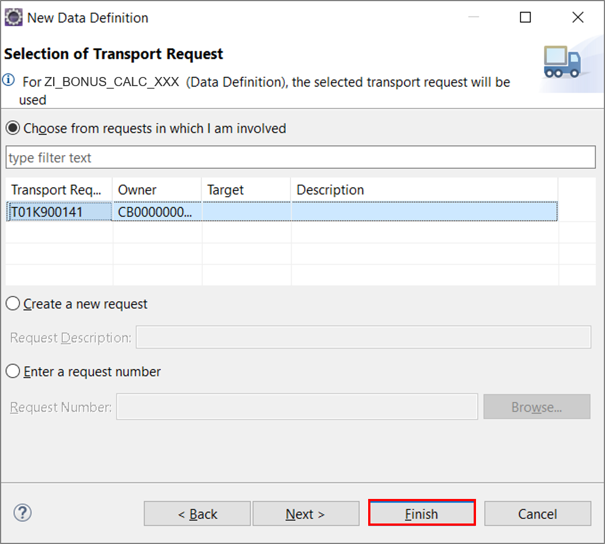

  5. Replace your code with following.

    ```ABAP
          @AbapCatalog: { sqlViewName: 'ZV_BONUSCALCXXX', compiler.compareFilter: true, preserveKey: true }
          @AccessControl.authorizationCheck: #NOT_REQUIRED
          @EndUserText.label: 'Interface View Bonus Calculations'
          @Search: { searchable: true }
          @UI: {
           headerInfo: { typeName: 'Bonus Calculation', typeNamePlural: 'Bonus Calculations', title : { value: 'EmployeeName', type: #STANDARD } },
           presentationVariant: [ { sortOrder: [ { by: 'ID', direction: #DESC } ] } ] }

          define root view ZI_BONUS_CALC_XXX
           as select from zbonuscalcxxx as Node

           association [0..*] to I_CurrencyText          as _TargetAmountText        on _TargetAmountText.Currency         = $projection.TargetAmount_C
           association [0..*] to I_UnitOfMeasureText     as _BonusPercentageText     on _BonusPercentageText.UnitOfMeasure = $projection.BonusPercentage_U
           association [0..1] to ZI_BONUS_RELEASE_STATUS_XXX as _ReleaseStatusText       on _ReleaseStatusText.code            = $projection.releasestatus
           association [0..1] to I_Currency              as _ActualRevenueAmount     on _ActualRevenueAmount.Currency      = $projection.ActualRevenueAmount_C
           association [0..*] to I_CurrencyText          as _ActualRevenueAmountText on _ActualRevenueAmountText.Currency  = $projection.ActualRevenueAmount_C
           association [0..1] to I_Currency              as _BonusAmount             on _BonusAmount.Currency              = $projection.BonusAmount_C
           association [0..*] to I_CurrencyText          as _BonusAmountText         on _BonusAmountText.Currency          = $projection.BonusAmount_C

          {
               @UI.facet: [
                 { type: #COLLECTION, position: 1, id: 'BONUSCALC', label: 'Details'  },
                 { type: #FIELDGROUP_REFERENCE, position: 1, id: 'Employee',  parentId: 'BONUSCALC', label: 'Employee', targetQualifier: 'Employee', exclude: false },
                 { type: #FIELDGROUP_REFERENCE, position: 2, id: 'Bonus',     parentId: 'BONUSCALC', label: 'Bonus', targetQualifier: 'Bonus', exclude: false },
                 { type: #FIELDGROUP_REFERENCE, position: 3, id: 'AdminData', parentId: 'BONUSCALC', label: 'Administrative Data', targetQualifier: 'AdminData', exclude: false } ]

               @EndUserText: { label: 'ID', quickInfo: 'ID' }
               @UI: {
                 lineItem: [{ exclude: true }, { type: #FOR_ACTION, dataAction: 'calculate_bonus', label: 'Calculate Bonus' } ],
                 identification: [{ position: 1, type: #FOR_ACTION, dataAction: 'calculate_bonus', label: 'Calculate Bonus' }],
                 fieldGroup: [{ position: 1, qualifier: 'AdminData' }] }
           key Node.id                        as ID,

               //Employee
               @EndUserText: { label: 'Employee Name', quickInfo: 'Employee Name' }
               @Search: { defaultSearchElement: true, fuzzinessThreshold: 0.8 }
               @UI: { selectionField: [ { position: 2 } ], lineItem: [{ position: 2 }], fieldGroup: [{ position: 2, qualifier: 'Employee' }] }
               Node.employeename              as EmployeeName,

               @EndUserText: { label: 'Employee ID', quickInfo: 'Employee ID' }
               @Search: { defaultSearchElement: true, fuzzinessThreshold: 0.8 }
               @Consumption.valueHelpDefinition: [{ entity: { name: 'ZI_CE_EMPLOYEE_XXX', element: 'BusinessPartner' }}]
               @UI: { fieldGroup: [{ position: 1, qualifier: 'Employee' }] }
               Node.employeeid                as EmployeeID,

               //Bonus Data
               @EndUserText: { label: 'Target Revenue', quickInfo: 'Target Revenue' }
               @UI: { lineItem: [{ position: 3 } ], fieldGroup: [{ position: 1, qualifier: 'Bonus' }] }
               @Semantics: { amount.currencyCode: 'TargetAmount_C' }
               Node.targetamount_v            as TargetAmount_V,

               @EndUserText: { label: 'Target Revenue' }
               @Consumption.valueHelpDefinition: [{ entity : { name: 'I_Currency', element: 'Currency'  } }]
               @Semantics: { currencyCode: true }
               @ObjectModel: { text.association: '_TargetAmountText' }
               Node.targetamount_c            as TargetAmount_C,

               @EndUserText: { label: 'Actual Revenue', quickInfo: 'Actual Revenue' }
               @UI: { lineItem: [{ position: 4, criticality: 'PerformanceIndicator' }], fieldGroup: [{ position: 2, qualifier: 'Bonus', criticality: 'PerformanceIndicator'  }] }
               @Semantics: { amount.currencyCode: 'ActualRevenueAmount_C' }
               Node.actualrevenueamount_v     as ActualRevenueAmount_V,

               @EndUserText: { label: 'Actual Revenue' }
               @Consumption.valueHelpDefinition: [{ entity : { name: 'I_Currency', element: 'Currency' } }]
               @Semantics: { currencyCode: true }
               @ObjectModel: { text.association: '_ActualRevenueAmountText' }
               Node.actualrevenueamount_c     as ActualRevenueAmount_C,

               case
                 when Node.actualrevenueamount_v is initial then 0
                 when Node.actualrevenueamount_v = Node.targetamount_v then 2
                 when Node.actualrevenueamount_v < Node.targetamount_v then 1
                 else 3
               end                            as PerformanceIndicator,

               @EndUserText: { label: 'Bonus Rate', quickInfo: 'Bonus Rate' }
               @UI: { lineItem: [{ position: 5 }], fieldGroup: [{ position: 3, qualifier: 'Bonus' }] }
               @Semantics: { quantity.unitOfMeasure: 'BonusPercentage_U' }
               Node.bonuspercentage_v         as BonusPercentage_V,

               @EndUserText: { label: 'Bonus Rate' }
               @Consumption.valueHelpDefinition: [{ entity : { name: 'I_UnitOfMeasure', element: 'UnitOfMeasure'  } }]
               @Semantics: { unitOfMeasure: true }
               @ObjectModel: { text.association: '_BonusPercentageText' }
               Node.bonuspercentage_u         as BonusPercentage_U,


               @EndUserText: { label: 'Bonus', quickInfo: 'Bonus' }
               @UI: { lineItem: [{ position: 6 }], fieldGroup: [{ position: 4, qualifier: 'Bonus' }] }
               @Semantics: { amount.currencyCode: 'BonusAmount_C' }
               Node.bonusamount_v             as BonusAmount_V,

               @EndUserText: { label: 'Currency', quickInfo: 'Currency' }
               @Consumption.valueHelpDefinition: [{ entity : { name: 'I_Currency', element: 'Currency'  } }]
               @Semantics: { currencyCode: true }
               @ObjectModel: { text.association: '_BonusAmountText' }
               Node.bonusamount_c             as BonusAmount_C,

               //Administrative Data
               @EndUserText: { label: 'Valid From', quickInfo: 'Valid From' }
               @UI: { fieldGroup: [{ position: 2, qualifier: 'AdminData' }] }
               Node.validitystartdate         as ValidityStartDate,

               @EndUserText: { label: 'Valid Until', quickInfo: 'Valid Until' }
               @UI: { fieldGroup: [{ position: 3, qualifier: 'AdminData' }] }
               Node.validityenddate           as ValidityEndDate,

               @EndUserText: { label: 'Is Consistent', quickInfo: 'Is Consistent' }
               @UI: { fieldGroup: [{ position: 4, qualifier: 'AdminData' }] }
               Node.isconsistent              as IsConsistent,

               @EndUserText: { label: 'Release Status', quickInfo: 'Release Status' }
               @Search: { defaultSearchElement: true, fuzzinessThreshold: 0.8 }
               @UI: { fieldGroup: [{ position: 4, qualifier: 'AdminData' }] }
               @Consumption.valueHelpDefinition: [{ entity : { name: 'ZI_BONUS_RELEASE_STATUS', element: 'Code' } }]
               @ObjectModel: { text.association:  '_ReleaseStatusText' }
               Node.releasestatus,

               @UI.hidden: true
               Node.sap_createddatetime       as SAP_CreatedDateTime,
               @UI.hidden: true
               Node.sap_createdbyuser         as SAP_CreatedByUser,
               @UI.hidden: true
               Node.sap_lastchangeddatetime   as SAP_LastChangedDateTime,
               @UI.hidden: true
               Node.sap_lastchangedbyuser     as SAP_LastChangedByUser,

               _TargetAmountText,
               _BonusPercentageText,
               _ReleaseStatusText,
               _ActualRevenueAmount,
               _ActualRevenueAmountText,
               _BonusAmount,
               _BonusAmountText
          }
    ```
      Save and activate.

[DONE]
[ACCORDION-END]

[ACCORDION-BEGIN [Step 5: ](Create data definition for release status)]
  1. Select your package and click **File** > **New** > **Other…**

      

  2. Search for data definition, select it and click **Next**.

      

  3. Create a data definition.
     - Name: `ZI_BONUS_RELEASE_STATUS_XXX`
     - Description: Data definition for release status

     Click **Next**.

      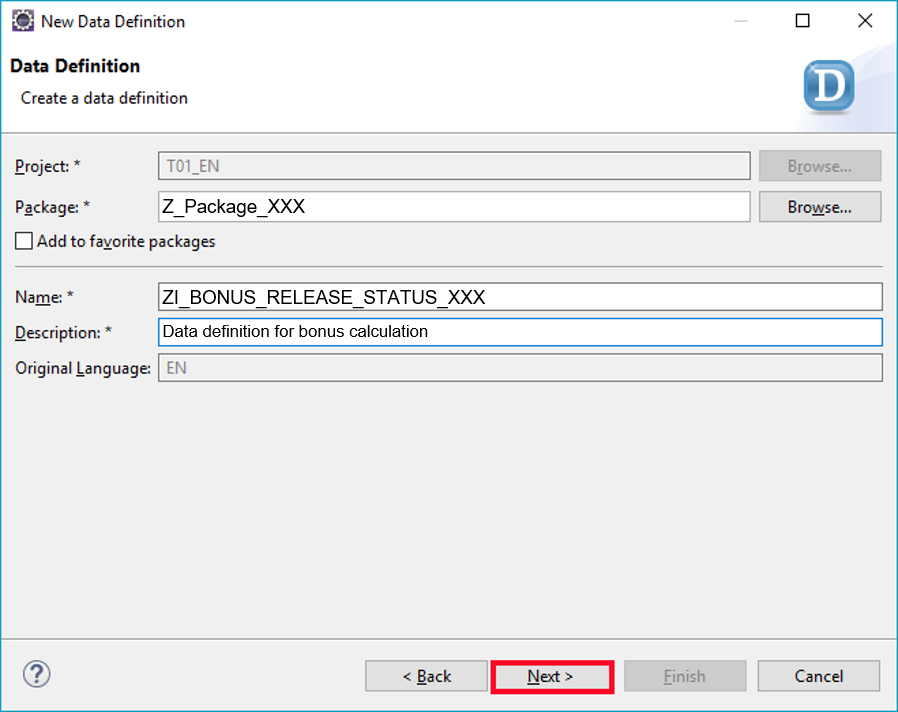

  4. Click **Finish**.

      

  5. Replace your code with following.

    ```ABAP
        @AbapCatalog.sqlViewName: 'ZI_REL_STAT_XXX'
        @AbapCatalog.compiler.compareFilter: true
        @AbapCatalog.preserveKey: true
        @AccessControl.authorizationCheck: #NOT_REQUIRED
        @EndUserText.label: 'Release Status - Value Help'
        @Search.searchable

        define view ZI_BONUS_RELEASE_STATUS_XXX
        as select from zrel_stat_xxx
        {
         @Search.defaultSearchElement: true
         @ObjectModel.text.element:['Description']
         @EndUserText.label: 'Code'
         @EndUserText.quickInfo: 'Code'
        key code,
         @Semantics.text: true
         @EndUserText.label: 'Description'
         @EndUserText.quickInfo: 'Description'
         description
        }
    ```

      Save and activate.

[DONE]
[ACCORDION-END]


[ACCORDION-BEGIN [Step 6: ](Create behavior definition for bonus calculation)]
  1. Select your package and click **File** > **New** > **Other…**

      

  2. Search for behavior definition, select it and click **Next**.

      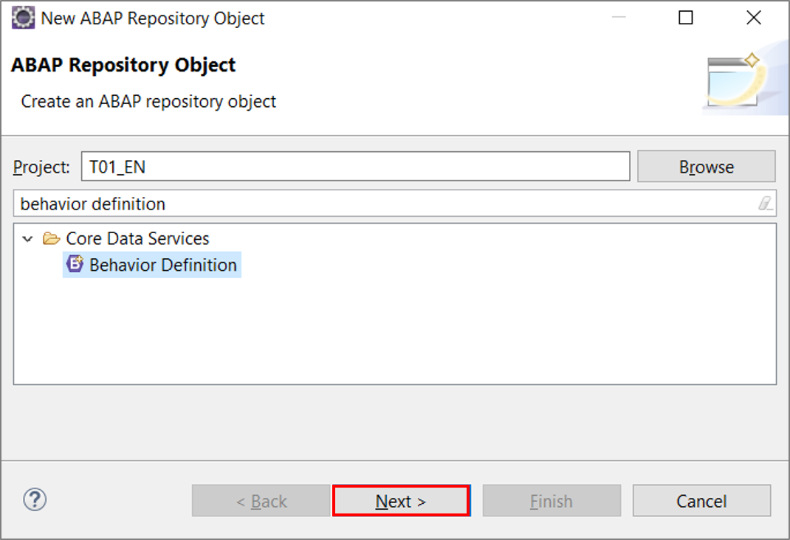

  3. Create a behavior definition.
     - Name: `ZI_BONUS_CALC_XXX`
     - Description: Data definition for bonus calculation

     Click **Next**.

      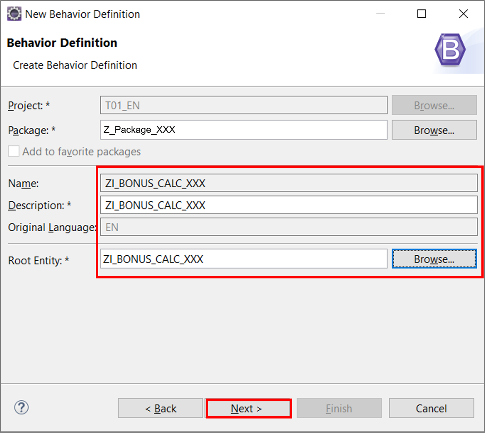

  4. Click **Finish**.

      

  5. Replace your code with following.

    ```ABAP
       implementation unmanaged;
        define behavior for ZI_BONUS_CALC_XXX  alias bonuscalculation
        etag SAP_LastChangedDateTime
        lock master {
        create;
        update;
        delete;
        action calculate_bonus result [1] $self;
        }
    ```
      Save and activate.

[DONE]
[ACCORDION-END]

[ACCORDION-BEGIN [Step 7: ](Create lock object for bonus calculation)]
  1. Select your package and click **File** > **New** > **Other…**

      

  2. Search for lock object, select it and click **Next**.

      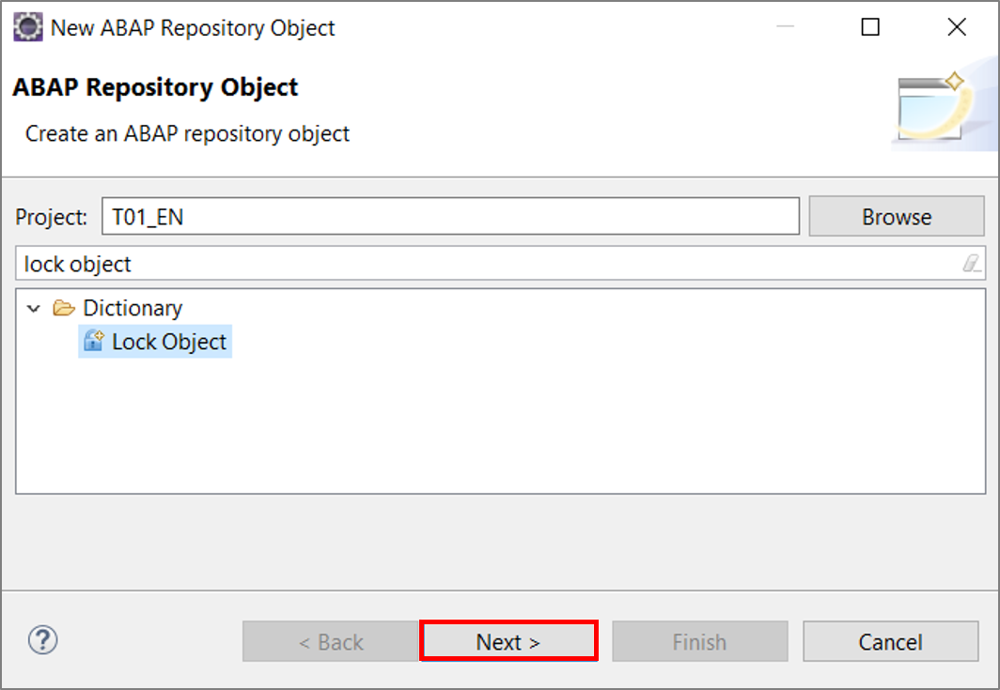

  3. Create a data definition.
     - Name: `EZ_BONUSCAL_XXX`
     - Description: Lock object for bonus calculation

     Click **Next**.

      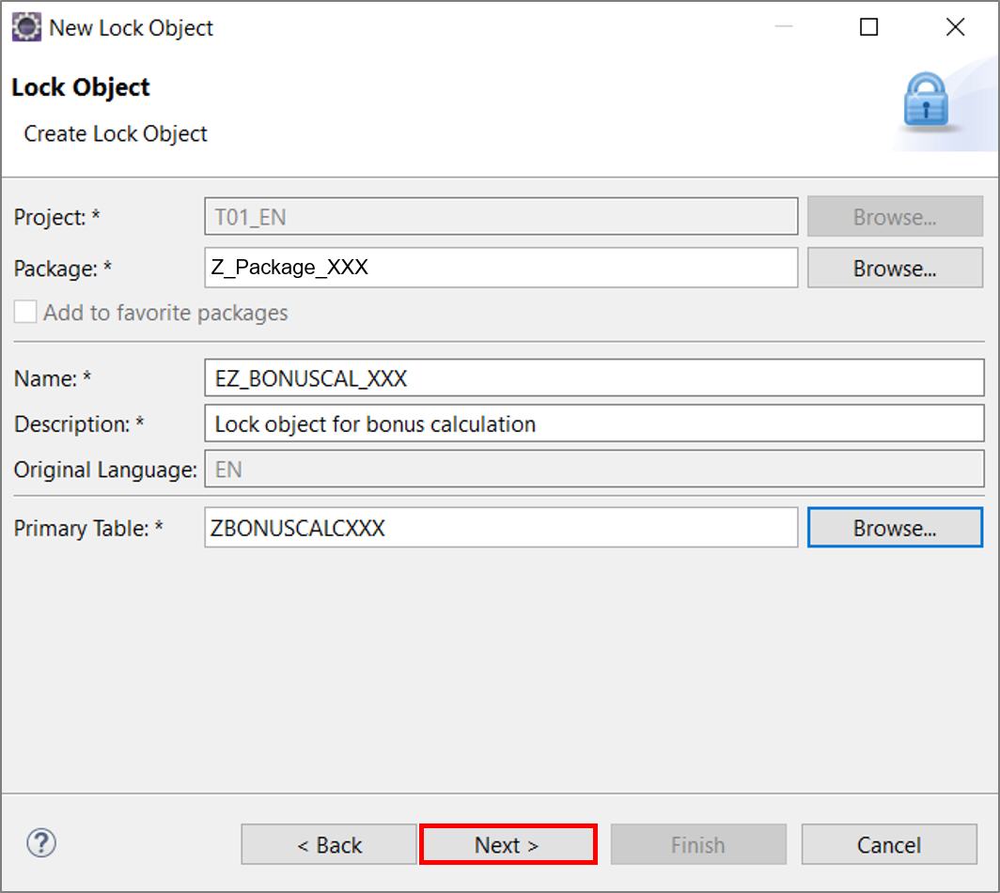

  4. Click **Finish**.

      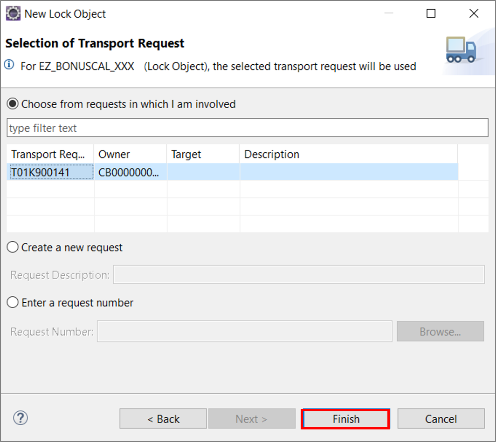

  5. Change your lock method to write. Save and activate.

      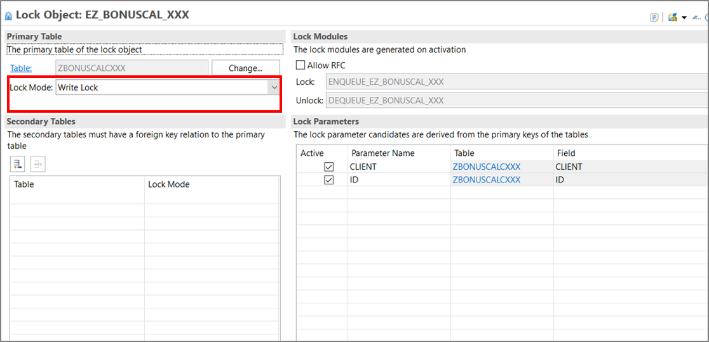

[DONE]
[ACCORDION-END]

[ACCORDION-BEGIN [Step 8: ](Create message class for bonus calculation)]
  1. Select your package and click **File** > **New** > **Other…**

      

  2. Search for message class, select it and click **Next**.

      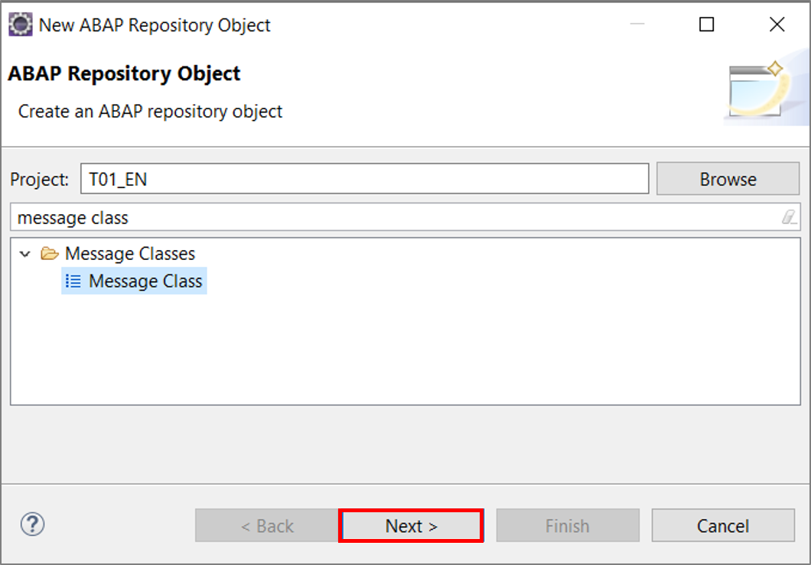

  3. Create a data definition.
     - Name: `ZCM_BONUS_CAL_XXX`
     - Description: Lock object for bonus calculation

     Click **Next**.

      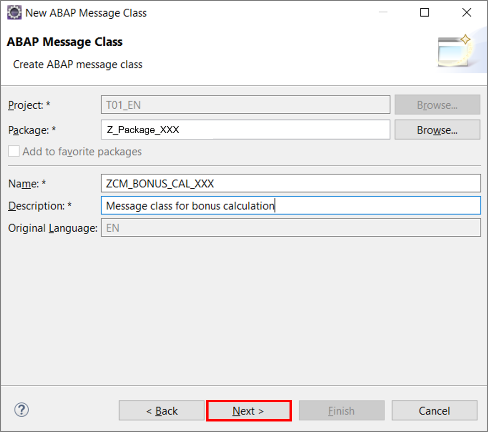

  4. Click **Finish**.

      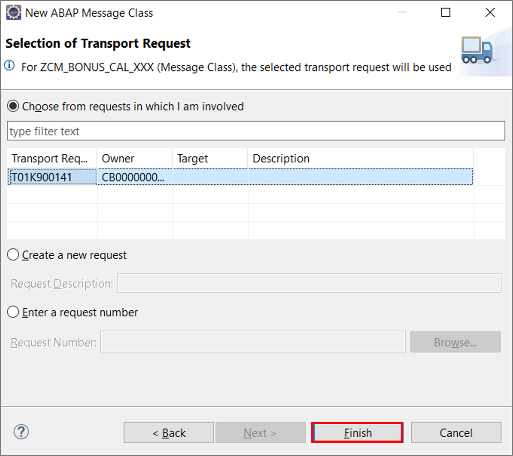

  5. Add following messages to your message class:

      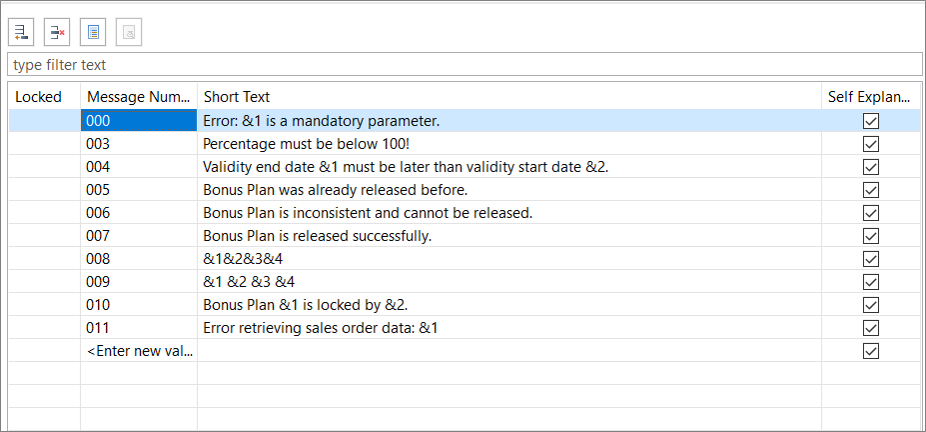
      Save and activate.

[DONE]
[ACCORDION-END]


[ACCORDION-BEGIN [Step 9: ](Create employee class)]
  1. Select your package and click **File** > **New** > **Other…**

      

  2. Search for ABAP class, select it and click **Next**.

      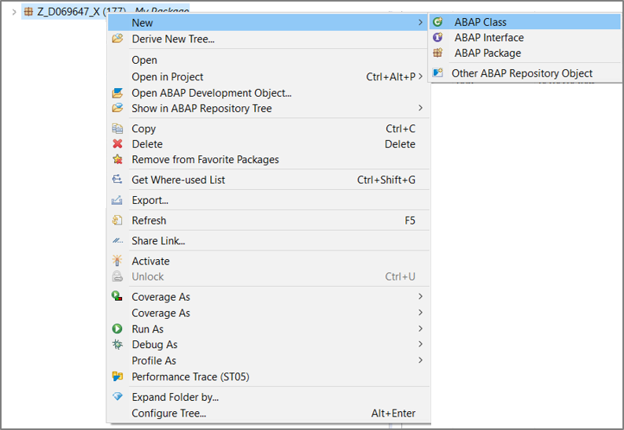

  3. Create an ABAP class
     - Name: `ZCL_CQ_EMPLOYEE_XXX`
     - Description: ABAP class for employee entity

     Click **Next**.

      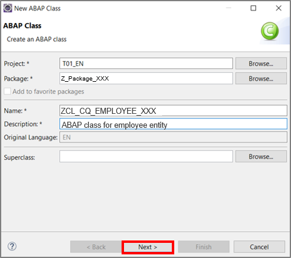

  4. Click **Finish**.

      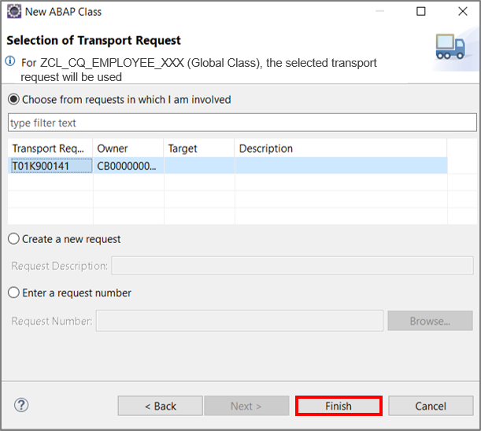

  5. Replace your code with following.

    ```ABAP
      class ZCL_CQ_EMPLOYEE_XXX definition
      PUBLIC
        FINAL
        CREATE PUBLIC .

        PUBLIC SECTION.
          INTERFACES if_a4c_rap_query_provider.
          METHODS constructor RAISING
                                /iwbep/cx_gateway
                                cx_a4c_cp_svc_inst_not_exist
                                cx_a4c_dest_svc_lookup_failure
                                cx_a4c_destination_not_found
                                cx_web_http_client_error
                                cx_http_dest_provider_error.
        PROTECTED SECTION.
        PRIVATE SECTION.
          DATA mo_client_proxy TYPE REF TO /iwbep/if_cp_client_proxy.
          METHODS create_client_proxy
            RETURNING
              VALUE(ro_client_proxy) TYPE REF TO /iwbep/if_cp_client_proxy
            RAISING
              /iwbep/cx_gateway
              cx_a4c_cp_svc_inst_not_exist
              cx_a4c_dest_svc_lookup_failure
              cx_a4c_destination_not_found
              cx_web_http_client_error
              cx_http_dest_provider_error.
      ENDCLASS.


      CLASS ZCL_CQ_EMPLOYEE_XXX IMPLEMENTATION.


        METHOD constructor.
          me->mo_client_proxy = me->create_client_proxy( ).
        ENDMETHOD.


        METHOD create_client_proxy.
          DATA(lo_destination) = cl_http_destination_provider=>create_by_cloud_destination(
              i_name                  = 'S4BusinessPartnerBasicXXX'
              i_service_instance_name = 'OutboundCommunicationXXX'
              i_authn_mode            = if_a4c_cp_service=>service_specific
          ).

          cl_web_http_client_manager=>create_by_http_destination(
              EXPORTING
                i_destination = lo_destination
              RECEIVING
                r_client = DATA(lo_http_client)
           ).

          lo_http_client->get_http_request( )->set_uri_path( '/sap/opu/odata/sap/API_BUSINESS_PARTNER' ).
          lo_http_client->set_csrf_token( ).

          ro_client_proxy  = cl_web_odata_client_factory=>create_v2_remote_proxy(
             iv_service_definition_name = 'Z_BUSINESSPARTNER_XXX'
             io_http_client           = lo_http_client
             iv_relative_service_root = '/sap/opu/odata/sap/API_BUSINESS_PARTNER'
          ).

        ENDMETHOD.


        METHOD if_a4c_rap_query_provider~select.
      *     ensure: in case of a single record is requested (e.g. data for a detail page),
      *             only one record is returned and SET_TOTAL_NUMBER_OF_RECORDS = 1
          DATA lt_employees     TYPE STANDARD TABLE OF zi_ce_employee_xxx WITH KEY businesspartner.
          DATA lt_firstname_range TYPE RANGE OF ZA_BUSINESSPARTNERB4711099F0-firstname.
          DATA lt_lastname_range TYPE RANGE OF ZA_BUSINESSPARTNERB4711099F0-lastname.
          DATA lt_bupa_range TYPE RANGE OF ZA_BUSINESSPARTNERB4711099F0-businesspartner.
          DATA lt_bupacat_range TYPE RANGE OF ZA_BUSINESSPARTNERB4711099F0-businesspartnercategory.
          DATA lt_select_properties TYPE /iwbep/if_cp_runtime_types=>ty_t_property_path.
          DATA lt_filter_node TYPE STANDARD TABLE OF REF TO /iwbep/if_cp_filter_node.
          DATA lo_filter_root TYPE REF TO /iwbep/if_cp_filter_node.
          DATA lx_exc TYPE REF TO cx_root.

          IF io_request->is_data_requested( ).
            DATA(ls_paging)      = io_request->get_paging( ).
            DATA(lt_filter_cond) = io_request->get_filter_conditions( ).
            DATA(lt_fields)      = io_request->get_requested_elements( ).
            DATA(lt_sort)        = io_request->get_sort_elements( ).

            TRY.
                DATA(lo_list_request) = mo_client_proxy->create_resource_for_entity_set( 'A_BUSINESSPARTNER' )->create_request_for_read( ).

      *           SET $FILTER
                LOOP AT lt_filter_cond INTO DATA(ls_filter_cond).
                  CASE ls_filter_cond-element.
                    WHEN 'FIRSTNAME'.
                      lt_firstname_range = CORRESPONDING #( ls_filter_cond-option ).
                    WHEN 'LASTNAME'.
                      lt_lastname_range = CORRESPONDING #( ls_filter_cond-option ).
                    WHEN 'BUSINESSPARTNER'.
                      lt_bupa_range = CORRESPONDING #( ls_filter_cond-option ).
                  ENDCASE.
                ENDLOOP.

                DATA(lo_filter_factory) = lo_list_request->create_filter_factory( ).

                IF lt_firstname_range IS NOT INITIAL.
                  DATA(lo_filter_node) = lo_filter_factory->create_by_range(
                    iv_property_path     = 'FIRSTNAME'
                    it_range             = lt_firstname_range
                  ).
                  APPEND lo_filter_node TO lt_filter_node.
                ENDIF.

                IF lt_lastname_range IS NOT INITIAL.
                  lo_filter_node = lo_filter_factory->create_by_range(
                    iv_property_path     = 'LASTNAME'
                    it_range             = lt_lastname_range
                  ).
                  APPEND lo_filter_node TO lt_filter_node.
                ENDIF.

                IF lt_bupa_range IS NOT INITIAL.
                  lo_filter_node = lo_filter_factory->create_by_range(
                    iv_property_path     = 'BUSINESSPARTNER'
                    it_range             = lt_bupa_range
                  ).
                  APPEND lo_filter_node TO lt_filter_node.
                ENDIF.

      *           BUSINESSPARTNERCATEGORY = 1
                lt_bupacat_range = VALUE #( ( low = '1' option = 'EQ' sign = 'I' ) ).
                lo_filter_node = lo_filter_factory->create_by_range(
                    iv_property_path     = 'BUSINESSPARTNERCATEGORY'
                    it_range             = lt_bupacat_range
                  ).
                APPEND lo_filter_node TO lt_filter_node.

                LOOP AT lt_filter_node INTO lo_filter_node.
                  IF lo_filter_root IS INITIAL.
                    lo_filter_root = lo_filter_node.
                  ELSE.
                    lo_filter_root = lo_filter_root->and( lo_filter_node ).
                  ENDIF.
                ENDLOOP.

                lo_list_request->set_filter( lo_filter_root ).

      *           SET $SELECT
                LOOP AT lt_fields INTO DATA(ls_field).
                  APPEND ls_field-element TO lt_select_properties.
                ENDLOOP.
                lo_list_request->set_select_properties( lt_select_properties ).

                DATA(lo_read_response_list) = lo_list_request->execute( ).

                lo_read_response_list->get_business_data(
                  IMPORTING
                    et_business_data = lt_employees
                ).

      *           return business partner(s)
      *            lt_employees = VALUE #( ( businesspartner = '4711' firstname = 'Kai' lastname = 'DEHMANN' ) ).
                io_response->set_data( lt_employees ).

              CATCH /iwbep/cx_cp_remote INTO lx_exc.
              CATCH /iwbep/cx_gateway INTO lx_exc.
                RAISE EXCEPTION TYPE cx_a4c_rap_query_provider
                  EXPORTING
                    previous = lx_exc.

            ENDTRY.
          ENDIF.

          IF io_request->is_total_rec_number_requested( ).
            io_response->set_total_number_of_records( lines( lt_employees ) ).
          ENDIF.

        ENDMETHOD.
      ENDCLASS.
    ```

[DONE]
[ACCORDION-END]

[ACCORDION-BEGIN [Step 10: ](Create bonus calculation class)]
  1. Select your package and click **File** > **New** > **Other…**

      

  2. Search for ABAP class, select it and click **Next**.

      

  3. Create an ABAP class
     - Name: `ZBI_BONUS_CALCULATION_XXX`
     - Description: ABAP class for bonus calculation

     Click **Next**.

      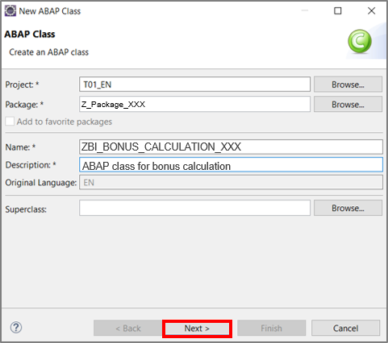

  4. Click **Finish**.

      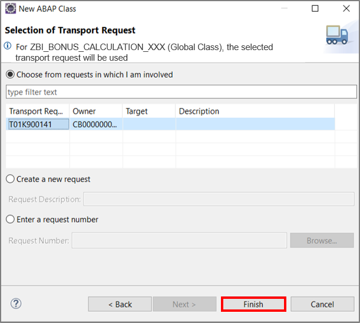

  5. Switch to **Local Types** and replace your code with following.

    ```ABAP

        CLASS lcl_handler DEFINITION INHERITING FROM cl_abap_behavior_handler ABSTRACT FINAL.
        PUBLIC SECTION.
        TYPES:
          tt_c_bonuscalc        TYPE TABLE FOR CREATE zi_bonus_calc_xxx,
          ts_c_bonuscalc        TYPE LINE OF tt_c_bonuscalc,
          tt_u_bonuscalc        TYPE TABLE FOR UPDATE zi_bonus_calc_xxx,
          ts_u_bonuscalc        TYPE LINE OF tt_u_bonuscalc,
          tt_d_bonuscalc        TYPE TABLE FOR DELETE zi_bonus_calc_xxx,
          tt_mapped_bonuscalc   TYPE TABLE FOR MAPPED zi_bonus_calc_xxx,
          tt_failed_bonuscalc   TYPE TABLE FOR FAILED zi_bonus_calc_xxx,
          tt_reported_bonuscalc TYPE TABLE FOR REPORTED zi_bonus_calc_xxx,
          ts_reported_bonuscalc TYPE LINE OF tt_reported_bonuscalc.

        CLASS-DATA:
          mt_create TYPE tt_c_bonuscalc,
          mt_update TYPE tt_u_bonuscalc,
          mt_delete TYPE tt_d_bonuscalc,
          mt_mapped TYPE tt_mapped_bonuscalc.

        METHODS:
          create_bonus_calculation
            IMPORTING
              it_create   TYPE tt_c_bonuscalc
            CHANGING
              ct_mapped   TYPE tt_mapped_bonuscalc
              ct_failed   TYPE tt_failed_bonuscalc
              ct_reported TYPE tt_reported_bonuscalc RAISING zcx_bonus_calculation_xxx,

          update_bonus_calculation
            IMPORTING
              it_update   TYPE tt_u_bonuscalc
            CHANGING
              ct_mapped   TYPE tt_mapped_bonuscalc
              ct_failed   TYPE tt_failed_bonuscalc
              ct_reported TYPE tt_reported_bonuscalc RAISING zcx_bonus_calculation_xxx,

          delete_bonus_calculation
            IMPORTING
              it_delete   TYPE tt_d_bonuscalc
            CHANGING
              ct_mapped   TYPE tt_mapped_bonuscalc
              ct_failed   TYPE tt_failed_bonuscalc
              ct_reported TYPE tt_reported_bonuscalc RAISING zcx_bonus_calculation_xxx,

          calculate_bonus
            IMPORTING
              it_calculate TYPE tt_u_bonuscalc
            CHANGING
              ct_mapped    TYPE tt_mapped_bonuscalc
              ct_failed    TYPE tt_failed_bonuscalc
              ct_reported  TYPE tt_reported_bonuscalc RAISING zcx_bonus_calculation_xxx.

        CLASS-METHODS: save.

        PRIVATE SECTION.

        METHODS:
          check_non_negative
            IMPORTING
              it_bonus_calculation TYPE tt_c_bonuscalc
            CHANGING
              ct_failed            TYPE tt_failed_bonuscalc
              ct_reported          TYPE tt_reported_bonuscalc RAISING zcx_bonus_calculation_xxx,

          check_mandatory
            IMPORTING
              it_bonus_calculation TYPE tt_c_bonuscalc
            CHANGING
              ct_failed            TYPE tt_failed_bonuscalc
              ct_reported          TYPE tt_reported_bonuscalc RAISING zcx_bonus_calculation_xxx,

          before_save
            IMPORTING
              it_bonus_calculation TYPE tt_c_bonuscalc
            CHANGING
              ct_failed            TYPE tt_failed_bonuscalc
              ct_reported          TYPE tt_reported_bonuscalc RAISING zcx_bonus_calculation_xxx,

          validate
            IMPORTING
              it_bonus_calculation TYPE tt_c_bonuscalc
              iv_is_create         TYPE abap_bool
            CHANGING
              ct_failed            TYPE tt_failed_bonuscalc
              ct_reported          TYPE tt_reported_bonuscalc RAISING zcx_bonus_calculation_xxx.

        METHODS after_modification
          IMPORTING
            it_bonus_calculation         TYPE tt_c_bonuscalc
           CHANGING
             ct_failed                   TYPE tt_failed_bonuscalc
             ct_reported                 TYPE tt_reported_bonuscalc
           RETURNING
             VALUE(rt_bonus_calculation) TYPE tt_c_bonuscalc RAISING zcx_bonus_calculation_xxx.

        METHODS lock FOR BEHAVIOR IMPORTING roots_to_lock FOR LOCK bonuscalculation.
        METHODS read FOR BEHAVIOR IMPORTING roots_to_read FOR READ bonuscalculation RESULT et_bonusplan.

        METHODS create_s4_client_proxy
          RETURNING
            VALUE(ro_client_proxy) TYPE REF TO /iwbep/if_cp_client_proxy
          RAISING
            cx_a4c_cp_svc_inst_not_exist
            cx_web_http_client_error
            cx_http_dest_provider_error
            /iwbep/cx_gateway.

        METHODS modify FOR BEHAVIOR IMPORTING
          it_create          FOR CREATE bonuscalculation
          it_update          FOR UPDATE bonuscalculation
          it_delete          FOR DELETE bonuscalculation
          it_calculate_bonus FOR ACTION bonuscalculation~calculate_bonus RESULT bonuscalculation.

        METHODS create_bupa_proxy
          RETURNING
            VALUE(ro_client_proxy) TYPE REF TO /iwbep/if_cp_client_proxy
          RAISING
            cx_a4c_cp_svc_inst_not_exist
            cx_web_http_client_error
            cx_http_dest_provider_error
            /iwbep/cx_gateway.

        ENDCLASS.

        CLASS lcl_handler IMPLEMENTATION.

        METHOD create_bupa_proxy.
        DATA(lo_destination) = cl_http_destination_provider=>create_by_cloud_destination(
              i_name                  = 'S4BusinessPartnerBasicXXX'
              i_service_instance_name = 'OutboundCommunicationXXX'
              i_authn_mode            = if_a4c_cp_service=>service_specific ).

        cl_web_http_client_manager=>create_by_http_destination(
            EXPORTING
              i_destination = lo_destination
            RECEIVING
              r_client = DATA(lo_http_client) ).

        lo_http_client->get_http_request( )->set_uri_path( '/sap/opu/odata/sap/API_BUSINESS_PARTNER' ).

        ro_client_proxy  = cl_web_odata_client_factory=>create_v2_remote_proxy(
           iv_service_definition_name = 'Z_BUSINESSPARTNER_XXX'
           io_http_client           = lo_http_client
           iv_relative_service_root = '/sap/opu/odata/sap/API_BUSINESS_PARTNER' ).

        ENDMETHOD.

        METHOD lock.
        LOOP AT roots_to_lock ASSIGNING FIELD-SYMBOL(<s_bonuspl_key>).
          TRY.
              DATA(lo_lock) = cl_abap_lock_object_factory=>get_instance( iv_name = 'EZ_BONUSCAL_XXX').
              lo_lock->enqueue(
                EXPORTING
                  it_table_mode = VALUE if_abap_lock_object=>tt_table_mode( ( table_name = 'ZBONUSCALCXXX' mode = 'E' ) )
                  it_parameter  = VALUE if_abap_lock_object=>tt_parameter( ( name = 'ID' value = REF #( <s_bonuspl_key>-id ) ) ) ).

            CATCH cx_abap_foreign_lock.
              DATA(lv_msg) = me->new_message(
                 id       = 'ZCM_BONUS_CALC_XXX'
                 number   = 010
                 severity = if_abap_behv_message=>severity-error
                 v1       = <s_bonuspl_key>-id
                 v2       = cl_abap_context_info=>get_user_technical_name( ) ).
              APPEND VALUE #( id = <s_bonuspl_key>-id %msg = lv_msg ) TO reported-bonuscalculation.
              APPEND VALUE #( id = <s_bonuspl_key>-id %fail = VALUE if_abap_behv=>t_failinfo( cause = if_abap_behv=>cause-locked ) ) TO failed-bonuscalculation.

            CATCH cx_abap_lock_failure.
              ASSERT 1 = 0.
          ENDTRY.
        ENDLOOP.
        ENDMETHOD.

        METHOD read.
        READ TABLE roots_to_read INTO DATA(ls_root_to_read) INDEX 1.
        SELECT SINGLE FROM zi_bonus_calc_xxx FIELDS sap_lastchangeddatetime WHERE id = @ls_root_to_read-id INTO @DATA(lv_changedatetime).
        et_bonusplan = VALUE #( ( id = ls_root_to_read-id sap_lastchangeddatetime = lv_changedatetime ) ).
        ENDMETHOD.

        METHOD save.
        DATA ls_update_bonuscalc TYPE LINE OF tt_u_bonuscalc.
        DATA lt_control_components TYPE string_table.

        "CREATE
        LOOP AT lcl_handler=>mt_create ASSIGNING FIELD-SYMBOL(<ls_create_bonuscalc>).
          DATA(ls_db_c_bonusplan) = CORRESPONDING ZBONUSCALCXXX( <ls_create_bonuscalc> ).
          INSERT INTO  ZBONUSCALCXXX VALUES @ls_db_c_bonusplan.
          ASSERT sy-subrc = 0.
        ENDLOOP.

        "UPDATE
        IF lcl_handler=>mt_update IS NOT INITIAL.
          SELECT * FROM zi_bonus_calc_xxx
          FOR ALL ENTRIES IN @lcl_handler=>mt_update
          WHERE id = @lcl_handler=>mt_update-id
          INTO TABLE @DATA(lt_old_bonuscalcs).
        ENDIF.

        lt_control_components = VALUE #(
            ( `sap_lastchangedbyuser` )
            ( `id` )
            ( `validitystartdate` )
            ( `validityenddate` )
            ( `targetamount_v` )
            ( `targetamount_c` )
            ( `bonuspercentage_v` )
            ( `bonuspercentage_u` )
            ( `isconsistent` )
            ( `employeeid` )
            ( `employeename` )
            ( `releasestatus` )
            ( `actualrevenueamount_v` )
            ( `actualrevenueamount_c` )
            ( `bonusamount_v` )
            ( `bonusamount_c` ) ).

        LOOP AT lcl_handler=>mt_update ASSIGNING FIELD-SYMBOL(<ls_update_bonuscalc>).
          READ TABLE lt_old_bonuscalcs WITH KEY id = <ls_update_bonuscalc>-id ASSIGNING FIELD-SYMBOL(<ls_old_bonuscalc>).

          LOOP AT lt_control_components INTO DATA(lv_component_name).
            ASSIGN COMPONENT lv_component_name OF STRUCTURE <ls_update_bonuscalc>-%control TO FIELD-SYMBOL(<lv_control_value>).
            CHECK <lv_control_value> = cl_abap_behavior_handler=>flag_changed.

            ASSIGN COMPONENT lv_component_name OF STRUCTURE <ls_update_bonuscalc> TO FIELD-SYMBOL(<lv_new_value>).
            ASSIGN COMPONENT lv_component_name OF STRUCTURE <ls_old_bonuscalc> TO FIELD-SYMBOL(<lv_old_value>).

            <lv_old_value> = <lv_new_value>.
          ENDLOOP.

          "Update Bonusplan table
          DATA(ls_db_u_bonuscalc) = CORRESPONDING ZBONUSCALCXXX( <ls_old_bonuscalc> ).
          UPDATE ZBONUSCALCXXX FROM @ls_db_u_bonuscalc.
        ENDLOOP.

        "DELETE
        IF lcl_handler=>mt_delete IS NOT INITIAL.
          " Delete bonusplan table
          DELETE FROM ZBONUSCALCXXX WHERE id IN ( SELECT id FROM @lcl_handler=>mt_delete AS itab ).
        ENDIF.

        ENDMETHOD.

        METHOD check_mandatory.
        DATA: lt_components_to_check TYPE string_table.
        FIELD-SYMBOLS:
          <lv_value>       TYPE any,
          <lv_change_flag> TYPE any.

        lt_components_to_check = VALUE #(
            ( `EmployeeID`)
            ( `TargetAmount_C`)
            ( `TargetAmount_V`)
            ( `BonusPercentage_V`)
            ( `ValidityStartDate` )
            ( `ValidityEndDate` ) ).

        LOOP AT it_bonus_calculation INTO DATA(ls_create_bonuscalc).
          LOOP AT lt_components_to_check INTO DATA(wa_comp_name).
            ASSIGN COMPONENT wa_comp_name OF STRUCTURE  ls_create_bonuscalc  TO <lv_value>.
            ASSIGN COMPONENT wa_comp_name OF STRUCTURE ls_create_bonuscalc-%control TO <lv_change_flag>.

            IF <lv_value> IS INITIAL AND <lv_change_flag> IS NOT INITIAL.
              APPEND CORRESPONDING ts_reported_bonuscalc( ls_create_bonuscalc MAPPING %element = %control ) TO ct_reported.
              RAISE EXCEPTION TYPE zcx_bonus_calculation_xxx MESSAGE e000(ZCM_BONUS_CALC_XXX) WITH wa_comp_name
               EXPORTING
                        severity          = 'E'.
            ENDIF.

            UNASSIGN <lv_value>.
            UNASSIGN <lv_change_flag>.
          ENDLOOP.
        ENDLOOP.
        ENDMETHOD.

        METHOD check_non_negative.
        DATA: lt_components_to_check TYPE string_table.
        FIELD-SYMBOLS <lv_value> TYPE any.

        lt_components_to_check = VALUE #(
          ( `TargetAmount_V`)
          ( `BonusPercentage_V` ) ).

        LOOP AT it_bonus_calculation INTO DATA(ls_create_bonuscalc).
          LOOP AT lt_components_to_check INTO DATA(wa_comp_name).
            ASSIGN COMPONENT wa_comp_name OF STRUCTURE  ls_create_bonuscalc TO <lv_value>.

            ASSERT sy-subrc = 0.

            IF <lv_value> IS NOT INITIAL AND <lv_value> LT 0.
              APPEND CORRESPONDING ts_reported_bonuscalc( ls_create_bonuscalc MAPPING %element = %control ) TO ct_reported.
              RAISE EXCEPTION TYPE zcx_bonus_calculation_xxx MESSAGE e001(ZCM_BONUS_CALC_XXX) WITH wa_comp_name
                 EXPORTING
                          severity          = 'E'.
            ENDIF.
          ENDLOOP.
        ENDLOOP.
        ENDMETHOD.

        METHOD create_bonus_calculation.
        validate(
          EXPORTING
            it_bonus_calculation = it_create
            iv_is_create         = abap_true
          CHANGING
            ct_failed            = ct_failed
            ct_reported          = ct_reported ).

        DATA(lt_create_bonuscalc) = after_modification(
          EXPORTING
            it_bonus_calculation = it_create
          CHANGING
            ct_failed            = ct_failed
            ct_reported          = ct_reported ).

        LOOP AT lt_create_bonuscalc INTO DATA(ls_create_bonuscalc).
          ls_create_bonuscalc-sap_createdbyuser = cl_abap_context_info=>get_user_alias( ).
          GET TIME STAMP FIELD ls_create_bonuscalc-sap_createddatetime.
          GET TIME STAMP FIELD ls_create_bonuscalc-sap_lastchangeddatetime. "etag handling

          "set ID
          IF ls_create_bonuscalc-id IS INITIAL.
            SELECT MAX( id ) FROM zi_bonus_calc_xxx INTO @DATA(current_max_id).
            ls_create_bonuscalc-id = current_max_id + 1.
          ENDIF.

          "set release status initially
          IF ls_create_bonuscalc-releasestatus IS INITIAL.
            ls_create_bonuscalc-releasestatus = '1'.
          ENDIF.

          ls_create_bonuscalc-bonuspercentage_u = 'P1'.

          IF ls_create_bonuscalc-%cid IS NOT INITIAL.
            INSERT CORRESPONDING #( ls_create_bonuscalc ) INTO TABLE mt_mapped.
            INSERT CORRESPONDING #( ls_create_bonuscalc ) INTO TABLE ct_mapped.
          ENDIF.
          IF NOT line_exists( ct_failed[ %cid = ls_create_bonuscalc-%cid ] ). "Do not insert malformed entries
            INSERT ls_create_bonuscalc INTO TABLE mt_create.
          ENDIF.
        ENDLOOP.

        ENDMETHOD.

        METHOD after_modification.
        DATA lx_exception TYPE REF TO cx_root.
        DATA lo_bupa_proxy TYPE REF TO /iwbep/if_cp_client_proxy.

        LOOP AT it_bonus_calculation INTO DATA(ls_bonuscalc).
          "set employee name
          IF ls_bonuscalc-employeeid IS NOT INITIAL.
            TRY.
                IF lo_bupa_proxy IS INITIAL.
                  lo_bupa_proxy = me->create_bupa_proxy( ).
                ENDIF.

                DATA(ls_bupa) = VALUE ZA_BUSINESSPARTNER59C3C91120( businesspartner = ls_bonuscalc-employeeid ).
                DATA(lo_read_resource) = lo_bupa_proxy->create_resource_for_entity_set( 'A_BUSINESSPARTNER' ).
                DATA(lo_read_request) = lo_read_resource->navigate_with_key( ls_bupa )->create_request_for_read( ).
                DATA(lo_read_response) = lo_read_request->execute( ).

                lo_read_response->get_business_data(
                  IMPORTING
                    es_business_data = ls_bupa ).

                ls_bonuscalc-employeename = ls_bupa-businesspartnerfullname.
                ls_bonuscalc-%control-employeename = cl_abap_behavior_handler=>flag_changed.

              CATCH cx_root INTO lx_exception.
                APPEND CORRESPONDING ts_reported_bonuscalc( ls_bonuscalc MAPPING %element = %control ) TO ct_reported.
                RAISE EXCEPTION TYPE zcx_bonus_calculation_xxx MESSAGE e008(ZCM_BONUS_CALC_XXX) WITH lx_exception->get_text( )
                EXPORTING previous = lx_exception
                          severity = 'E'.
            ENDTRY.
          ENDIF.

          "consistency check START
          IF ( ls_bonuscalc-%control-validitystartdate = cl_abap_behavior_handler=>flag_changed AND ls_bonuscalc-validitystartdate IS INITIAL )
           OR ( ls_bonuscalc-%control-validityenddate = cl_abap_behavior_handler=>flag_changed AND ls_bonuscalc-validityenddate IS INITIAL )
           OR ( ( ls_bonuscalc-%control-validitystartdate = cl_abap_behavior_handler=>flag_changed OR ls_bonuscalc-validityenddate  = cl_abap_behavior_handler=>flag_changed ) AND ls_bonuscalc-validitystartdate GE ls_bonuscalc-validityenddate )
           OR ( ls_bonuscalc-%control-bonuspercentage_v = cl_abap_behavior_handler=>flag_changed AND ls_bonuscalc-bonuspercentage_v IS INITIAL )
           OR ( ls_bonuscalc-%control-bonuspercentage_v = cl_abap_behavior_handler=>flag_changed AND ls_bonuscalc-bonuspercentage_v GE 100 )
           OR ( ls_bonuscalc-%control-employeeid = cl_abap_behavior_handler=>flag_changed AND ls_bonuscalc-employeeid IS INITIAL ).
            ls_bonuscalc-isconsistent = abap_false.
          ELSE.
            ls_bonuscalc-isconsistent = abap_true.
          ENDIF.
          ls_bonuscalc-%control-isconsistent = cl_abap_behavior_handler=>flag_changed.

          "decide about save rejection
          IF ls_bonuscalc-releasestatus EQ '2'.
            SELECT SINGLE *
            FROM zi_bonus_calc_xxx
            WHERE id = @ls_bonuscalc-id
            INTO @DATA(ls_bonuscalc_db).

            IF ls_bonuscalc_db-releasestatus NE '2' AND ls_bonuscalc_db-isconsistent EQ abap_true.
              DATA(ls_reported) = CORRESPONDING ts_reported_bonuscalc( ls_bonuscalc MAPPING %element = %control ).
              ls_reported-%msg = me->new_message(
                 id       = 'ZCM_BONUS_CALC_XXX'
                 number   = 007
                 severity = if_abap_behv_message=>severity-success ).
              APPEND ls_reported TO ct_reported.

            ELSEIF ls_bonuscalc_db-releasestatus NE '2' AND ls_bonuscalc_db-isconsistent EQ abap_false.
              APPEND CORRESPONDING ts_reported_bonuscalc( ls_bonuscalc MAPPING %element = %control ) TO ct_reported.
              RAISE EXCEPTION TYPE zcx_bonus_calculation_xxx MESSAGE e006(ZCM_BONUS_CALC_XXX)
                   EXPORTING severity          = 'E'.
            ELSEIF ls_bonuscalc_db-releasestatus EQ '2'.
              APPEND CORRESPONDING ts_reported_bonuscalc( ls_bonuscalc MAPPING %element = %control ) TO ct_reported.
              RAISE EXCEPTION TYPE zcx_bonus_calculation_xxx MESSAGE e005(ZCM_BONUS_CALC_XXX)
                   EXPORTING severity          = 'E'.
            ENDIF.
          ENDIF.

          APPEND ls_bonuscalc TO rt_bonus_calculation.
        ENDLOOP.
        ENDMETHOD.

        METHOD delete_bonus_calculation.
        DATA(lt_delete) = it_delete.

        LOOP AT lt_delete ASSIGNING FIELD-SYMBOL(<ls_delete>) WHERE id IS INITIAL."Initial key:  Determine key by Contend ID
          <ls_delete>-id = ct_mapped[ %cid = <ls_delete>-%cid_ref ]-id.
        ENDLOOP.

        LOOP AT lt_delete INTO DATA(ls_delete).
          INSERT ls_delete INTO TABLE mt_delete.
        ENDLOOP.

        ENDMETHOD.

        METHOD update_bonus_calculation.
        validate(
         EXPORTING
           it_bonus_calculation = it_update
           iv_is_create         = abap_false
         CHANGING
           ct_failed            = ct_failed
           ct_reported          = ct_reported ).

        DATA(lt_update) = it_update.

        LOOP AT lt_update ASSIGNING FIELD-SYMBOL(<ls_update>) WHERE id IS INITIAL."Initial key:  Determine key by Contend ID
          <ls_update>-id = ct_mapped[ %cid = <ls_update>-%cid_ref ]-id.
        ENDLOOP.

        lt_update = after_modification(
          EXPORTING
            it_bonus_calculation = lt_update
          CHANGING
            ct_failed            = ct_failed
            ct_reported          = ct_reported ).

        LOOP AT lt_update INTO DATA(ls_update).
          GET TIME STAMP FIELD ls_update-sap_lastchangeddatetime.
          ls_update-sap_lastchangedbyuser = cl_abap_context_info=>get_user_alias( ).
          ls_update-%control-sap_lastchangeddatetime = cl_abap_behavior_handler=>flag_changed.
          ls_update-%control-sap_lastchangedbyuser = cl_abap_behavior_handler=>flag_changed.

          IF NOT line_exists( ct_failed[ %cid = ls_update-%cid_ref ] ). "Do not insert malformed entries
            INSERT ls_update INTO TABLE mt_update.
          ENDIF.
        ENDLOOP.
        ENDMETHOD.

        METHOD create_s4_client_proxy.
        DATA(lo_destination) = cl_http_destination_provider=>create_by_cloud_destination(
            i_name                  = 'S4BusinessPartnerBasicXXX'
            i_service_instance_name = 'OutboundCommunicationXXX'
            i_authn_mode            = if_a4c_cp_service=>service_specific ).

        cl_web_http_client_manager=>create_by_http_destination(
            EXPORTING
              i_destination = lo_destination
            RECEIVING
              r_client = DATA(lo_http_client) ).

        lo_http_client->get_http_request( )->set_uri_path( '/sap/opu/odata/sap/YY1_SALESORDERITEMCUBEXXX_CDS' ).

        ro_client_proxy  = cl_web_odata_client_factory=>create_v2_remote_proxy(
           iv_service_definition_name = 'Z_SALESORDERITEMCUBEXXX'
           io_http_client           = lo_http_client
           iv_relative_service_root = '/sap/opu/odata/sap/YY1_SALESORDERITEMCUBEXXX_CDS' ).

        ENDMETHOD.

        METHOD calculate_bonus.

        DATA lt_employyeid_range TYPE RANGE OF ZYY1_SALESORDERITEMCB1169E2D67-businesspartner.
        DATA lt_sdprocessstatus_range TYPE RANGE OF ZYY1_SALESORDERITEMCB1169E2D67-overallsdprocessstatus.
        DATA lt_creationdate_range TYPE RANGE OF ZYY1_SALESORDERITEMCB1169E2D67-creationdate.
        DATA ls_salesorderitemcubres TYPE ZYY1_SALESORDERITEMCB1169E2D67.
        DATA lt_salesorderitemcubres TYPE STANDARD TABLE OF ZYY1_SALESORDERITEMCB1169E2D67 WITH DEFAULT KEY.
        DATA lt_salesorderitemcubres_fback TYPE STANDARD TABLE OF ZYY1_SALESORDERITEMCB1169E2D67 WITH DEFAULT KEY.
        DATA lx_exception TYPE REF TO cx_root.
        DATA lo_s4_client_proxy TYPE REF TO /iwbep/if_cp_client_proxy.

        LOOP AT it_calculate INTO DATA(ls_bonus_calculation).
          CLEAR lt_salesorderitemcubres.
          CLEAR ls_salesorderitemcubres.

          SELECT SINGLE *
           FROM zi_bonus_calc_xxx
           WHERE id EQ @ls_bonus_calculation-id INTO CORRESPONDING FIELDS OF @ls_bonus_calculation.

          TRY.
              lo_s4_client_proxy = me->create_s4_client_proxy( ).

              DATA(ls_salesorderitemcub) = VALUE ZYY1_SALESORDERITEMC6E74123419(
                p_exchangeratetype = 'M'
                p_displaycurrency = ls_bonus_calculation-targetamount_c ).

              " get completed Sales Orders for bonus plan's employee
              DATA(lo_list_resource) = lo_s4_client_proxy->create_resource_for_entity_set( 'YY1_SALESORDERITEMCUBEXXX' ).
              DATA(lo_list_request)  = lo_list_resource->navigate_with_key( ls_salesorderitemcub )->navigate_to_many( '_RESULTS' )->create_request_for_read( ).

              lt_employyeid_range = VALUE #( ( sign = 'I' option = 'EQ' low = ls_bonus_calculation-employeeid  ) ).

              DATA(lo_filter_node) = lo_list_request->create_filter_factory( )->create_by_range(
                iv_property_path     = 'BUSINESSPARTNER'
                it_range             = lt_employyeid_range ).

              lo_list_request->set_filter( lo_filter_node ).
              lo_list_request->set_select_properties( it_select_property = VALUE #( ( `NETAMOUNTINDISPLAYCURRENCY` ) ( `DISPLAYCURRENCY` ) ) ).

              DATA(lo_read_response_list) = lo_list_request->execute( ).

              lo_read_response_list->get_business_data(
                IMPORTING
                  et_business_data = lt_salesorderitemcubres ).

              READ TABLE lt_salesorderitemcubres INTO ls_salesorderitemcubres INDEX 1.

            CATCH cx_root INTO lx_exception.
              APPEND CORRESPONDING ts_reported_bonuscalc( ls_bonus_calculation MAPPING %element = %control ) TO ct_reported.
              RAISE EXCEPTION TYPE zcx_bonus_calculation_xxx MESSAGE e011(ZCM_BONUS_CALC_XXX) WITH lx_exception->get_text( )
                    EXPORTING severity  = 'E'.
          ENDTRY.

          ls_bonus_calculation-actualrevenueamount_v = ls_salesorderitemcubres-netamountindisplaycurrency.
          ls_bonus_calculation-actualrevenueamount_c = ls_salesorderitemcubres-displaycurrency.

          "calculate bonus
          IF ( ls_bonus_calculation-actualrevenueamount_v > ls_bonus_calculation-targetamount_v ).
            ls_bonus_calculation-bonusamount_v = ( ls_bonus_calculation-actualrevenueamount_v - ls_bonus_calculation-targetamount_v ) * ls_bonus_calculation-bonuspercentage_v / 100.
            ls_bonus_calculation-bonusamount_c = ls_bonus_calculation-targetamount_c.
          ELSE.
            ls_bonus_calculation-bonusamount_v = 0.
            ls_bonus_calculation-bonusamount_c = ls_bonus_calculation-targetamount_c.
          ENDIF.

          ls_bonus_calculation-%control-actualrevenueamount_v = cl_abap_behavior_handler=>flag_changed.
          ls_bonus_calculation-%control-actualrevenueamount_c = cl_abap_behavior_handler=>flag_changed.
          ls_bonus_calculation-%control-bonusamount_v = cl_abap_behavior_handler=>flag_changed.
          ls_bonus_calculation-%control-bonusamount_c = cl_abap_behavior_handler=>flag_changed.

          INSERT ls_bonus_calculation INTO TABLE mt_update.

          DATA(ls_reported) = CORRESPONDING ts_reported_bonuscalc( ls_bonus_calculation MAPPING %element = %control ).
          ls_reported-%msg = me->new_message_with_text(
            EXPORTING
              severity = cl_abap_behv=>ms-success
              text     = 'Bonus Calculated!' ).

          APPEND ls_reported TO ct_reported.
        ENDLOOP.
        ENDMETHOD.

        METHOD validate.
        check_non_negative(
           EXPORTING
             it_bonus_calculation = it_bonus_calculation
           CHANGING
             ct_failed            = ct_failed
             ct_reported          = ct_reported ).

        check_mandatory(
          EXPORTING
            it_bonus_calculation = it_bonus_calculation
          CHANGING
            ct_failed            = ct_failed
            ct_reported          = ct_reported ).

        before_save(
          EXPORTING
            it_bonus_calculation = it_bonus_calculation
          CHANGING
            ct_failed            = ct_failed
            ct_reported          = ct_reported ).
        ENDMETHOD.

        METHOD before_save.
        LOOP AT it_bonus_calculation INTO DATA(ls_bonus_calculation).
          IF ( ls_bonus_calculation-%control-validitystartdate = cl_abap_behavior_handler=>flag_changed OR
          ls_bonus_calculation-%control-validityenddate = cl_abap_behavior_handler=>flag_changed ) AND
          ( ls_bonus_calculation-validitystartdate GE ls_bonus_calculation-validityenddate ).
            APPEND CORRESPONDING ts_reported_bonuscalc( ls_bonus_calculation MAPPING %element = %control ) TO ct_reported.
            RAISE EXCEPTION TYPE zcx_bonus_calculation_xxx MESSAGE e004(ZCM_BONUS_CALC_XXX) WITH ls_bonus_calculation-validityenddate ls_bonus_calculation-validitystartdate
                     EXPORTING severity  = 'E'.
          ENDIF.

          IF ( ls_bonus_calculation-%control-bonuspercentage_v = cl_abap_behavior_handler=>flag_changed )
         AND ( ls_bonus_calculation-bonuspercentage_v GE 100 ).
            APPEND CORRESPONDING ts_reported_bonuscalc( ls_bonus_calculation MAPPING %element = %control ) TO ct_reported.
            RAISE EXCEPTION TYPE zcx_bonus_calculation_xxx MESSAGE e003(ZCM_BONUS_CALC_XXX)
                        EXPORTING severity  = 'E'.
          ENDIF.

        ENDLOOP.
        ENDMETHOD.

        METHOD modify.
        TRY.
            IF it_calculate_bonus IS NOT INITIAL.
              me->calculate_bonus(
                EXPORTING
                  it_calculate = CORRESPONDING tt_u_bonuscalc( it_calculate_bonus )
                CHANGING
                  ct_mapped = mapped-bonuscalculation
                  ct_failed = failed-bonuscalculation
                  ct_reported = reported-bonuscalculation ).
            ENDIF.


            IF it_create IS NOT INITIAL.
              me->create_bonus_calculation(
                EXPORTING
                  it_create  = it_create
                CHANGING
                  ct_mapped  = mapped-bonuscalculation
                  ct_failed  = failed-bonuscalculation
                  ct_reported = reported-bonuscalculation ).
            ENDIF.

            IF it_update IS NOT INITIAL.
              me->update_bonus_calculation(
                EXPORTING
                  it_update  = it_update
                CHANGING
                  ct_mapped  = mapped-bonuscalculation
                  ct_failed  = failed-bonuscalculation
                  ct_reported = reported-bonuscalculation ).
            ENDIF.

            IF it_delete IS NOT INITIAL.
              me->delete_bonus_calculation(
                EXPORTING
                  it_delete   = it_delete
                CHANGING
                  ct_mapped   = mapped-bonuscalculation
                  ct_failed   = failed-bonuscalculation
                  ct_reported = reported-bonuscalculation ).
            ENDIF.

          CATCH zcx_bonus_calculation_xxx INTO DATA(lx_exc).
        *      TODO: zcx_bonusplan --- ts_c_bonusplan TYPE STRUCTURE FOR CREATE zpp_bonusplan_test
            IF line_exists( reported-bonuscalculation[ 1 ] ).
              CASE lx_exc->severity.
                WHEN 'E'.
                  DATA(lv_severity) = cl_abap_behv=>ms-error.
                  APPEND VALUE #(  %cid = reported-bonuscalculation[ 1 ]-%cid id = reported-bonuscalculation[ 1 ]-id ) TO failed-bonuscalculation.

                WHEN 'I'.
                  lv_severity = cl_abap_behv=>ms-information.
                WHEN 'S'.
                  lv_severity = cl_abap_behv=>ms-success.
                WHEN 'W'.
                  lv_severity = cl_abap_behv=>ms-warning.
              ENDCASE.

              reported-bonuscalculation[ 1 ]-%msg = me->new_message_with_text(
                EXPORTING
                  text     = lx_exc->get_text( )
                  severity = lv_severity ).
            ENDIF.
        ENDTRY.
        ENDMETHOD.
        ENDCLASS.


        CLASS lcl_saver DEFINITION INHERITING FROM cl_abap_behavior_saver.
        PROTECTED SECTION.
        METHODS save              REDEFINITION.
        ENDCLASS.

        CLASS lcl_saver IMPLEMENTATION.
        METHOD save.
        lcl_handler=>save( ).
        ENDMETHOD.
        ENDCLASS.
    ```

      Save and activate.

[DONE]
[ACCORDION-END]

[ACCORDION-BEGIN [Step 11: ](Create bonus plan class)]
  1. Select your package and click **File** > **New** > **Other…**

      

  2. Search for ABAP class, select it and click **Next**.

      

  3. Create an ABAP class.
     - Name: `ZCX_BONUS_CALCULATION_XXX`
     - Description: ABAP class for bonus plan

     Click **Next**.

      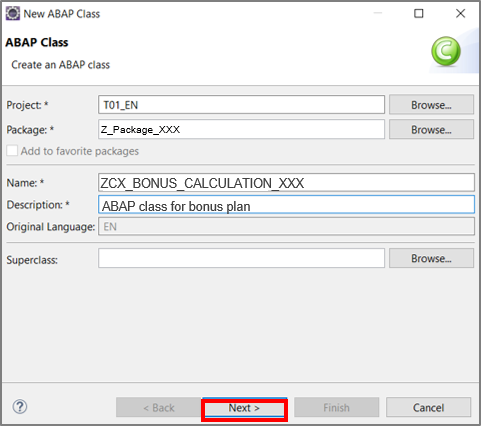

  4. Click **Finish**.

      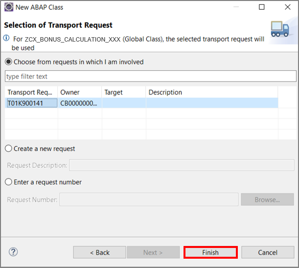

  5. Replace your code with following.

    ```ABAP
          CLASS ZCX_BONUS_CALCULATION_XXX DEFINITION
          PUBLIC
          INHERITING FROM cx_dynamic_check
          FINAL
          CREATE PUBLIC .

          PUBLIC SECTION.
           DATA severity TYPE c.
           INTERFACES if_t100_dyn_msg .
           INTERFACES if_t100_message .

           METHODS constructor
             IMPORTING
               !textid   LIKE if_t100_message=>t100key OPTIONAL
               !previous LIKE previous OPTIONAL
               !severity TYPE c OPTIONAL.

           CLASS-METHODS create_from_system_message RETURNING VALUE(rcx) TYPE REF TO zcx_bonus_calculation_xxx.

          PROTECTED SECTION.
          PRIVATE SECTION.
          ENDCLASS.


          CLASS ZCX_BONUS_CALCULATION_XXX IMPLEMENTATION.


          METHOD constructor ##ADT_SUPPRESS_GENERATION.
           CALL METHOD super->constructor
             EXPORTING
               previous = previous.

           me->severity = severity.
           CLEAR me->textid.

           IF textid IS INITIAL.
             if_t100_message~t100key = if_t100_message=>default_textid.
           ELSE.
             if_t100_message~t100key = textid.
           ENDIF.
          ENDMETHOD.


          METHOD create_from_system_message.
           TRY.
               RAISE EXCEPTION TYPE ZCX_BONUS_CALCULATION_XXX USING MESSAGE.
             CATCH ZCX_BONUS_CALCULATION_XXX INTO rcx ##no_handler.
           ENDTRY.
          ENDMETHOD.
          ENDCLASS.      
    ```

      Save and activate.

[DONE]
[ACCORDION-END]

[ACCORDION-BEGIN [Step 12: ](Create service definition for bonus calculation)]
  1. Select your package and click **File** > **New** > **Other…**

      

  2. Search for service definition, select it and click **Next**.

      

  3. Create a service definition.
     - Name: `Z_SD_BONUS_CALCULATION_XXX`
     - Description: service definition for bonus calculation

     Click **Next**.

      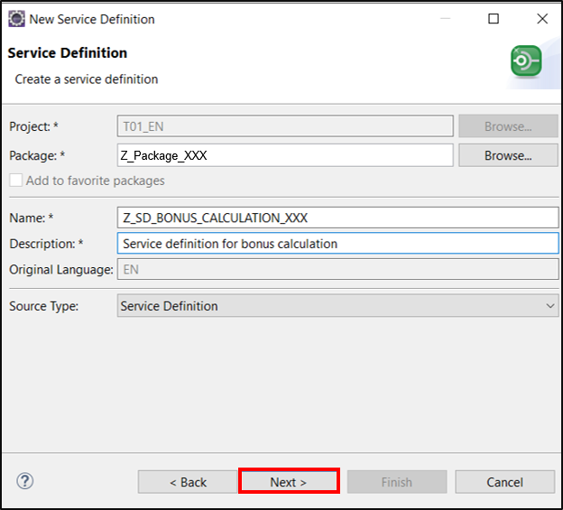

  4. Click **Finish**.

      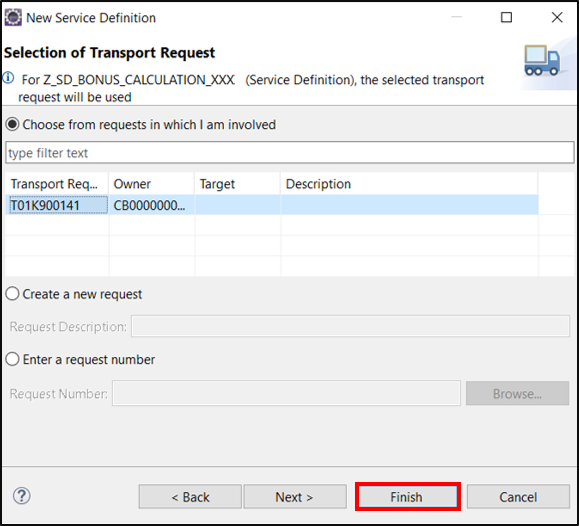

  5. Replace your code with following.

    ```ABAP
              @EndUserText.label: 'Bonus Calculation'
              define service Z_SD_BONUS_CALCULATION_XXX {
              expose ZI_BONUS_CALC_XXX as BonusCalculation;
              expose ZI_CE_Employee_XXX as Employee;
              expose ZI_BONUS_RELEASE_STATUS_XXX as ReleaseStatus;
              expose I_Currency as Currency;
              expose I_CurrencyText as CurrencyText;
              expose I_UnitOfMeasure as UnitOfMeasure;
              expose I_UnitOfMeasureText as UnitOfMeasureText;
              }
    ```

      Save and activate.

[DONE]
[ACCORDION-END]


[ACCORDION-BEGIN [Step 13: ](Create service binding for bonus calculation)]
  1. Select your package and click **File** > **New** > **Other…**

      

  2. Search for service binding, select it and click **Next**.

      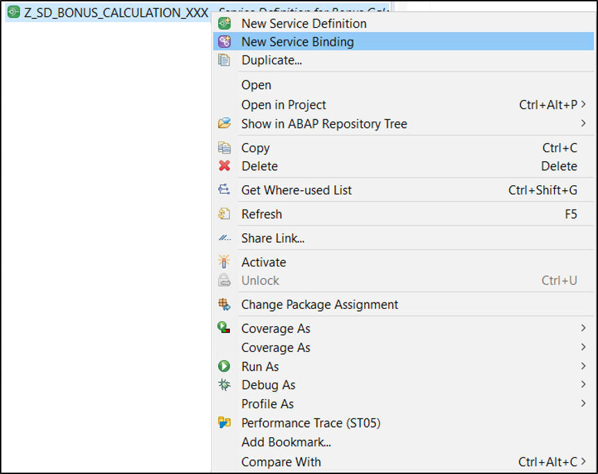

  3. Create a service binding.
     - Name: `Z_SB_BONUS_CALCULATION_XXX`
     - Description: service binding for bonus calculation
     - Version: `ODATA V2 (UI - User Interface: Consumed in SAPUI5 Apps)`
     - Service Definition: `Z_SD_BONUS_CALCULATION_XXX`

     Click **Next**.

      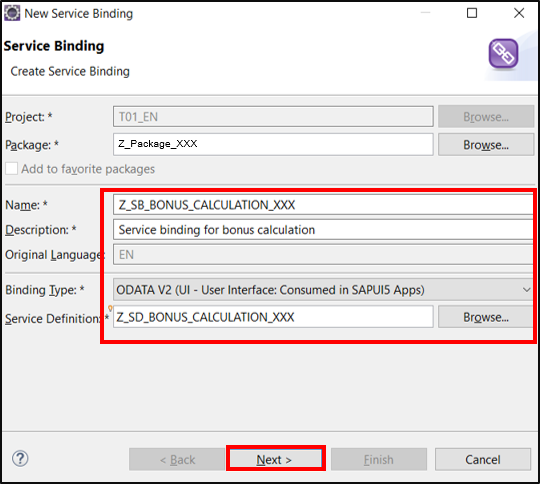

  4. Click **Finish**.

      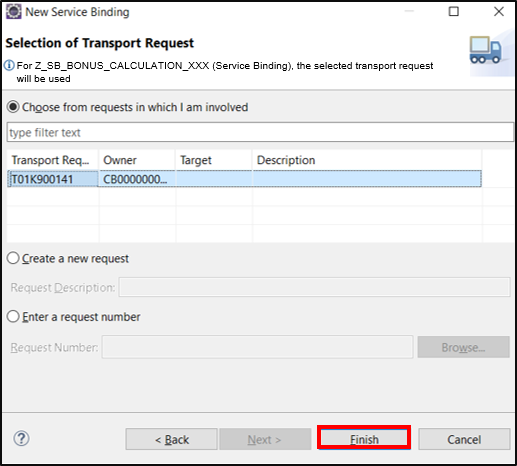

  5. Activate your service binding.

      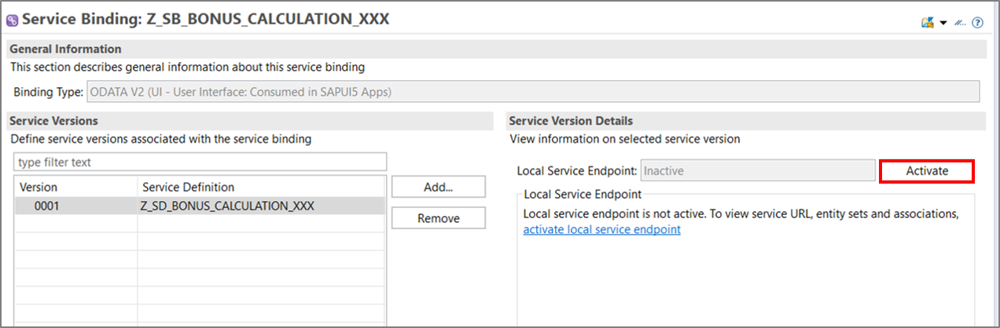

  6. Click on `BonusCalculation` and **Preview** to test your application.

      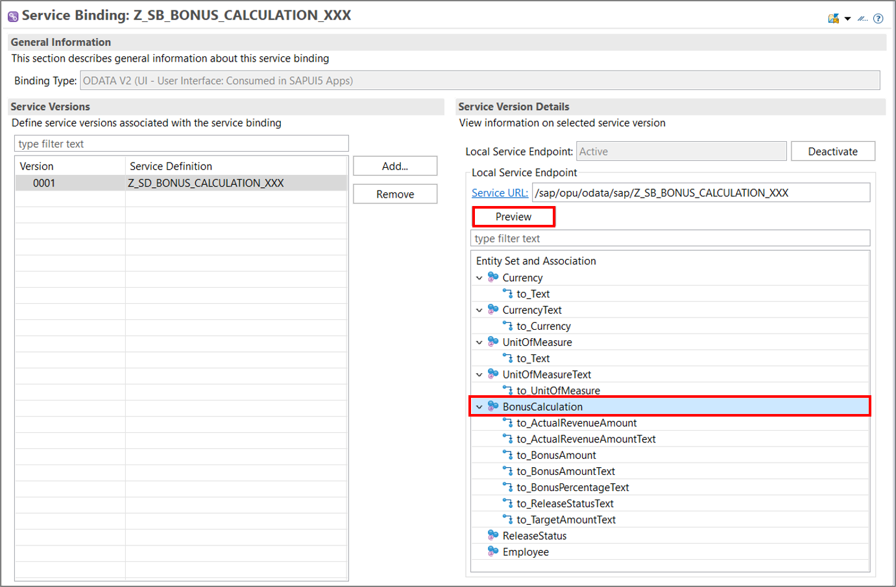

[DONE]
[ACCORDION-END]

[ACCORDION-BEGIN [Step 14: ](Test yourself)]

[VALIDATE_1]
[ACCORDION-END]
---
