## Prerequisites  
 - Create a developer user in a SAP Cloud Platform ABAP Environment system.
 - Download Eclipse Photon or Oxygen and install ABAP Development Tools (ADT). See <https://tools.hana.ondemand.com/#abap>.

## Details
### You will learn  
  - How to create destination
  - How to create service consumption model for business partner and sales order item cube

---

[ACCORDION-BEGIN [Step 1: ](Copying the inbound service URL)]
  1. Logon to SAP S/4HANA Cloud system as administrator.

      

  2. Go to **Communication Management** and select **Communication Arrangement**.

      

  3. Select the communication arrangement that you have created.

      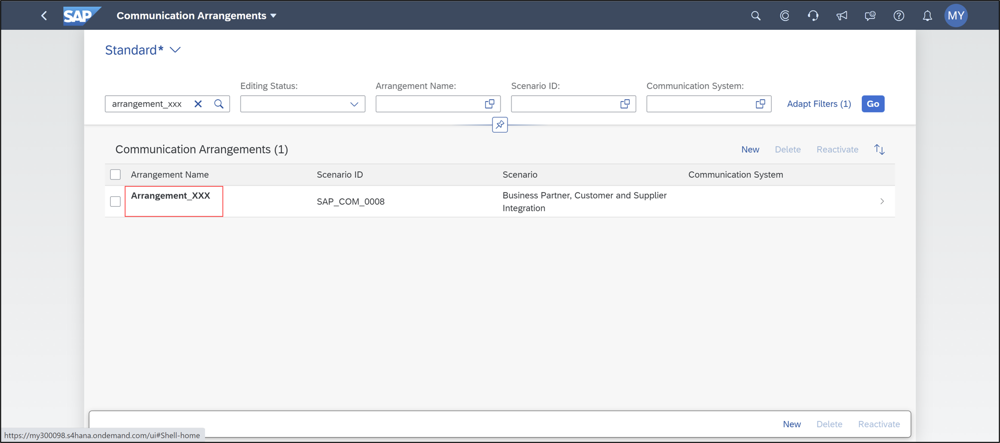

  4. Select **`OAuth 2.0` Details** in the inbound communication area.

      

  5. Copy the user name and SAML2 audience for later use.

      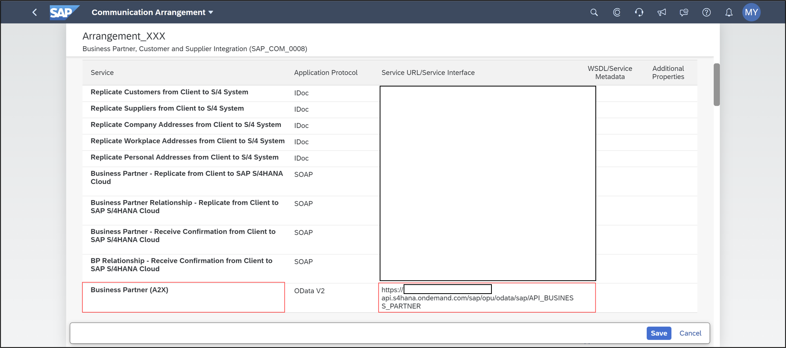

[DONE]
[ACCORDION-END]


[ACCORDION-BEGIN [Step 2: ](Create destination with basic authentication)]
  1. Log on to the SAP Cloud Platform cockpit as administrator.

      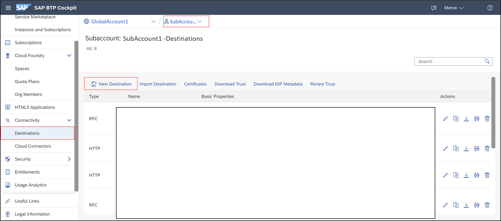

  2. Choose your global account.

      

  3. Select Subaccounts.

      

  4. Select your Cloud Foundry subaccount.

      

  5. Choose the space that you have created for your ABAP environment during the setup.

      

  6. Go to the service market place for the selected space, search for destination and select it.

      

  7. Click Instances.

      

  8. Choose your instance.

      

  9. Select Destinations.

      

  10. Click **New Destination**.

      

  11. Enter destination configuration:

      -  Name: your destination name
      -  Type: HTTP
      -  Description: your description
      -  URL: Service URL from communication arrangement (Inbound Services screen -> ODataV2 service Business Partner Integration)
      -  (without `/sap/opu/odata/sap/API_BUSINESS_PARTNER`)
      -  Proxy Type: Internet
      -  Authentication: `BasicAuthentication`
      -  User: <Communication user name from Oauth2.0 Details>
      -  Password: <Password of communication user>

      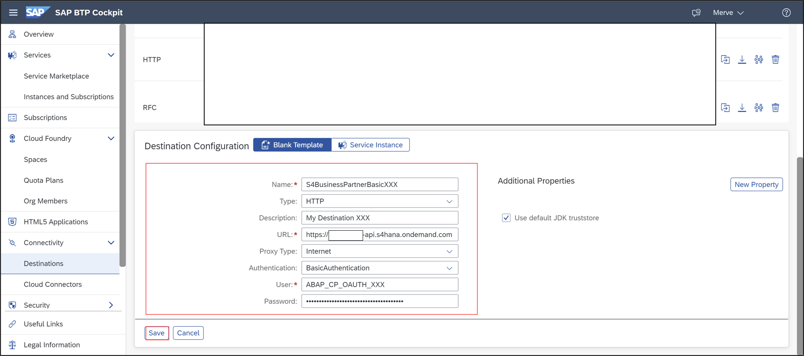

  12. Check connection.

      

[DONE]
[ACCORDION-END]

[ACCORDION-BEGIN [Step 3: ](Create Custom CDS View in SAP S/4HANA Cloud)]
  1. Logon to your S/4HANA Cloud system, navigate to Extensibility and open the Custom CDS Views tile.

      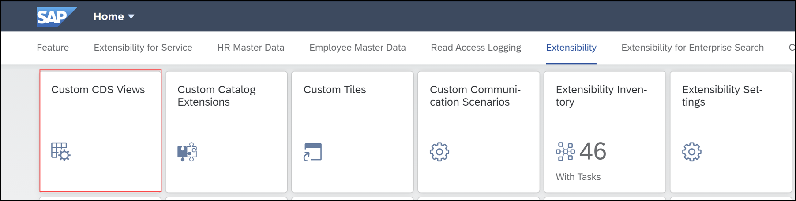

  2. Click Create to create your custom CDS view.

      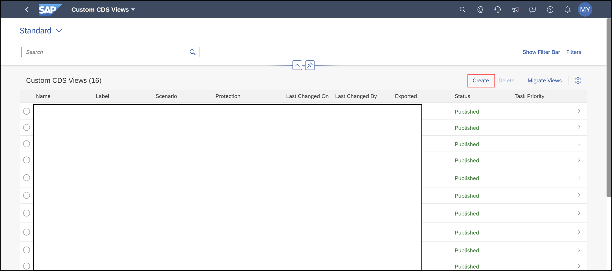

  3. Name your CDS view `YY1_SALESORDERITEMCUBEXXX` and click **Add** and select **Add Primary Data Source**.

      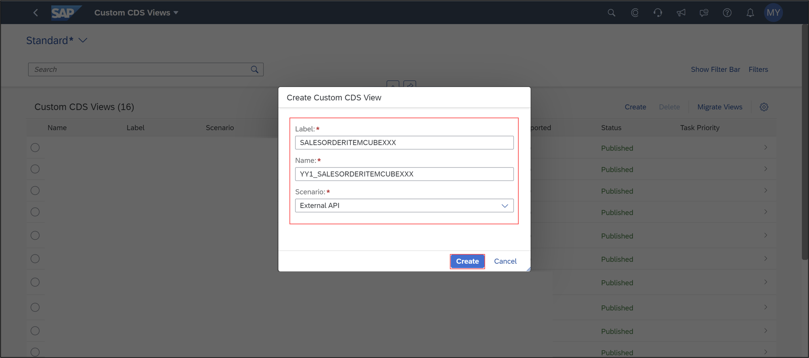

  4. Search for **`I_SalesOrderItemCube`**, select it and click **Add**.

      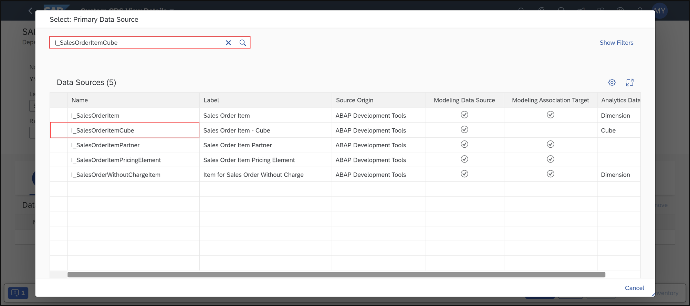

  5. Click **Add** and select **Add Associated Data Source**.

      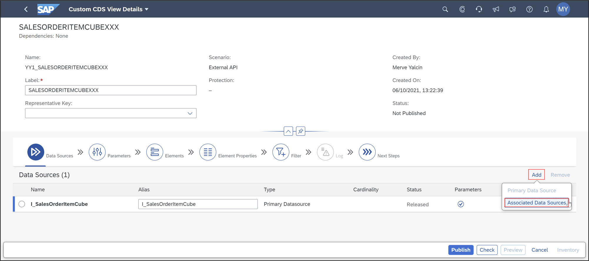

  6. Search for **`I_BusinessUser`**, select it and click **Add**.

      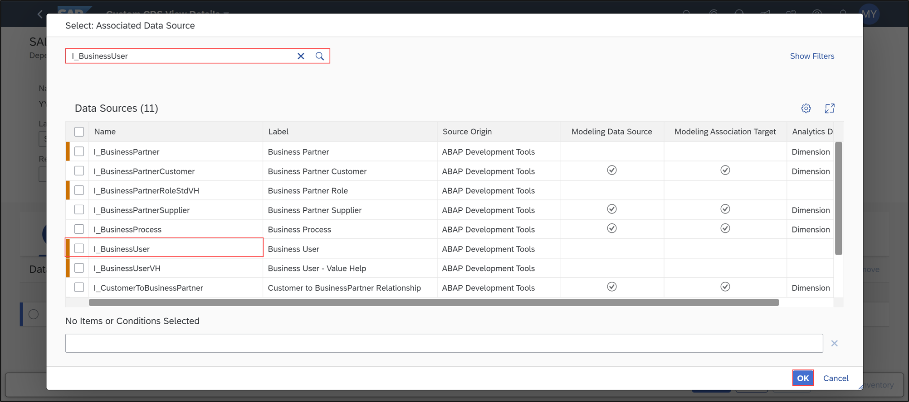

  7. Select **Yes** and move on.

      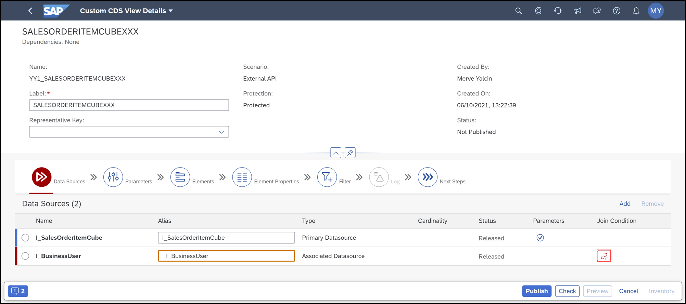

  8. Select **External API** and click on the butterfly symbol.

      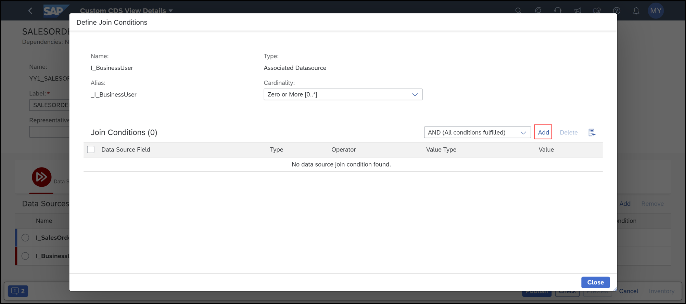

  9. In the field section search for following fields and add them to your CDS view.
     - `SalesOrder`
     - `SalesOrderItem`
     - `_CreatedBy.BusinessPartner`
     - `_SalesOrder.OverallSDProcessStatus`
     - `CreationDate`
     - `NetAmountInDisplayCurrency`
     - `DisplayCurrency`

      

  10. Go to properties and check your result.

      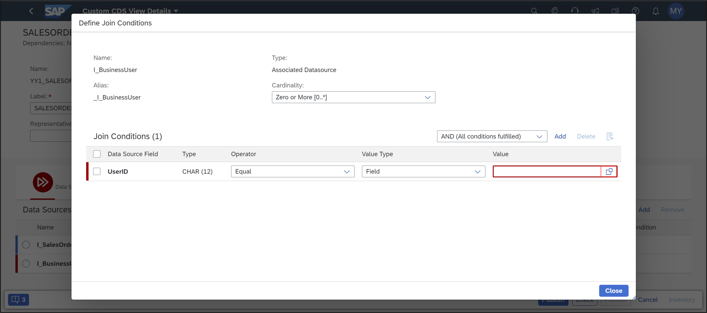

  11. Switch to Parameters and set following manual default values:
      - `P_ExchangeRateType`: EUR
      - `P_DisplayCurrency`: M

      Click **Publish**.

      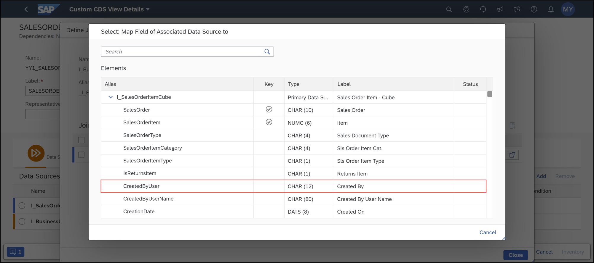


[DONE]
[ACCORDION-END]

[ACCORDION-BEGIN [Step 4: ](Create custom communication scenarios)]
  1. Navigate to **Extensibility** and select **Custom Communication Scenario**.

      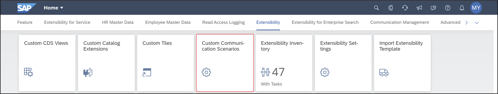

  2. Click **New**.

      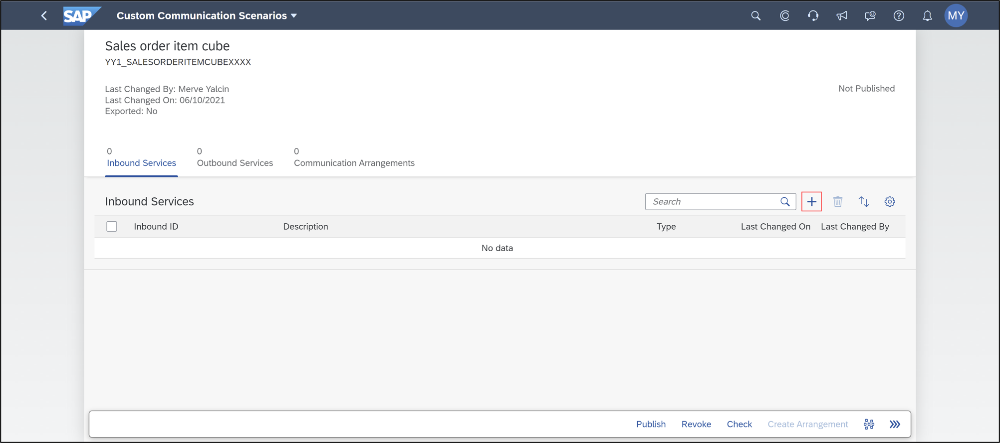

  3. Create a communication scenario:
     - Communication Scenario ID: `Salesorderitemcubexxx`
     - Description: Sales order item cube

     Click **New**.

      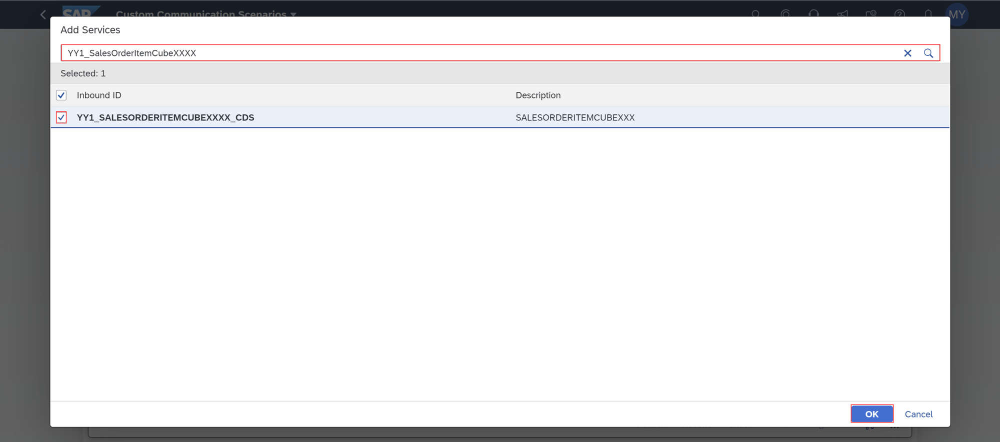

  4. Click `+` to add an inbound service.

      

  5. Search for `YY1_SalesOrderItemCubeXXX`, select it and click **OK**.

      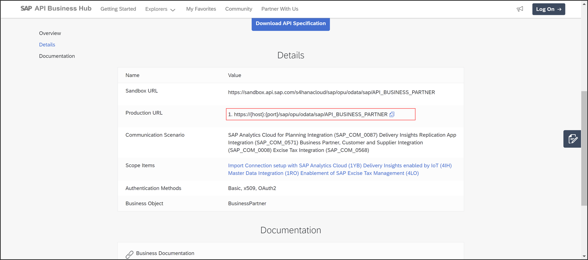

  6. Select your inbound service and click **Publish**.

      


[DONE]
[ACCORDION-END]

[ACCORDION-BEGIN [Step 5: ](Download metadata for business partner)]
  1. Go to the SAP API Business Hub and select the OData service for business partner: (https://api.sap.com/api/API_BUSINESS_PARTNER/overview).

     Copy the production URL.

      

  2. Now open a browser of your choice and past the production URL with your hostname and port.
     Add also `$metadata` at the end, like following:

     ```URL
       https://{host}:{port}/sap/opu/odata/sap/API_BUSINESS_PARTNER/$metadata
     ```

     Login with you communication user and password to see your metadata.

      

  3. You can see the metadata. Save your metadata as an `edmx` file.

      

  3. Use `bupa.edmx` and select all files as file type.

      

[DONE]
[ACCORDION-END]

[ACCORDION-BEGIN [Step 6: ](Create service consumption model for business partner)]
  1. Switch to Eclipse an create a package:
     - Name: `Z_Package_XXX`
     - Description: My Package

     Click **Next**.

      

  2. Click **Next**.

      

  3. Click **Finish**.

      

  4. Select **File** > **New** > **Other…**

      

  5. Search **Service Consumption Model**, select it and click **Next**.

      

  6. Create a service consumption model.
     - Name: `Z_BUSINESSPARTNER_XXX`
     - Description: Service Consumption Model for business partner

     Select your metadata `bupa.edmx` and click **Next**.

      

  7. Click **Next**.

      

  8. Click **Next**.

      

  9. Click **Finish**.

      

  10. Check your result.

      

[DONE]
[ACCORDION-END]

[ACCORDION-BEGIN [Step 7: ](Create service consumption model for sales order item)]
  1. Navigate to **Communication Management** and select **Communication Arrangement**.

      

  2. Search for your communication arrangement `yy1_salesorderitemcubexxx` and select it.

      

  3. Copy the service URL of your communication arrangement.

      

  4. Paste the copied service URL in your browser, add `/$metadata` at the end of your URL and login with you communication user and password to see your metadata.

      

  5. You can see the metadata. Save your metadata as an `edmx` file.
     Use `salesorder.edmx` and select all files as file type.

      

      

  6. Go to Eclipse and select **File** > **New** > **Other…**

      

  7. Search **Service Consumption Model**, select it and click **Next**.

      

  8. Create a service consumption model.
     - Name: `Z_SALESORDERITEMCUBE_XXX`
     - Description: `Service Consumption Model for SalesOrderItemCube`

     Select your metadata `salesorder.edmx` and click **Next**.

      

  9. Click **Next**.

      

  10. Click **Next**.

      

  11. Click **Finish**.

      

  12. Check your result.

      

[DONE]
[ACCORDION-END]

[ACCORDION-BEGIN [Step 8: ](Test yourself)]

[VALIDATE_1]
[ACCORDION-END]
---
