## Prerequisites  
 - Create a developer user in a SAP Cloud Platform ABAP Environment system.
 - Download Eclipse Photon or Oxygen and install ABAP Development Tools (ADT). See <https://tools.hana.ondemand.com/#abap>.

## Details
### You will learn  
  - How to download trust certificate for SAP S/4HANA Cloud connection
  - How to create business roles
  - How to create communication arrangement in SAP S/4HANA Cloud
  - How to create communication system in SAP S/4HANA Cloud
  - How to create inbound and outbound communication user
  - How to deactivate outbound services

---

[ACCORDION-BEGIN [Step 1: ](Download trust)]
  1. Open SAP Cloud Platform Cockpit and select your global account.

      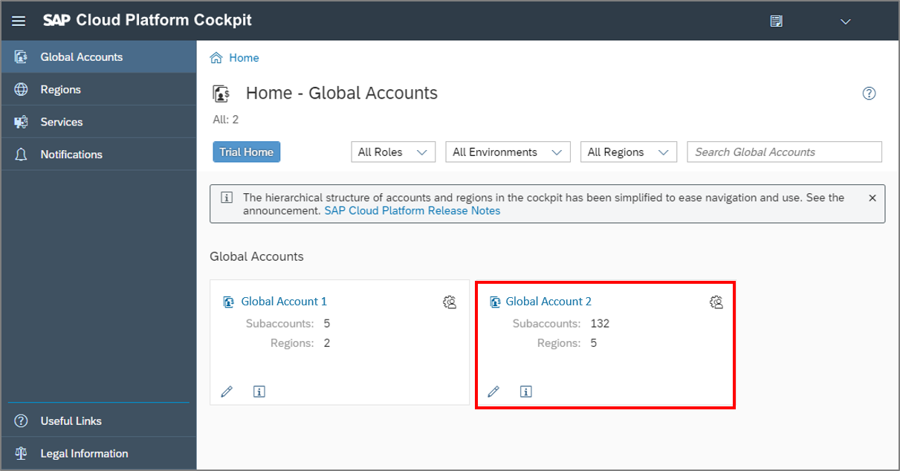

  2. Click **Subaccounts**.

      

  3. Select your Cloud Foundry subaccount.

      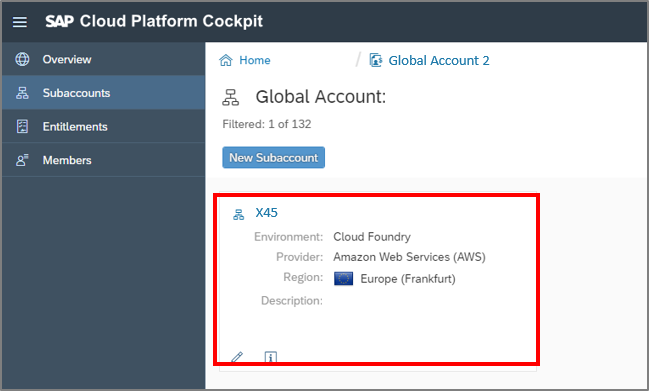

  4. Go to **Destinations** and click **Download Trust** to get the certification.

      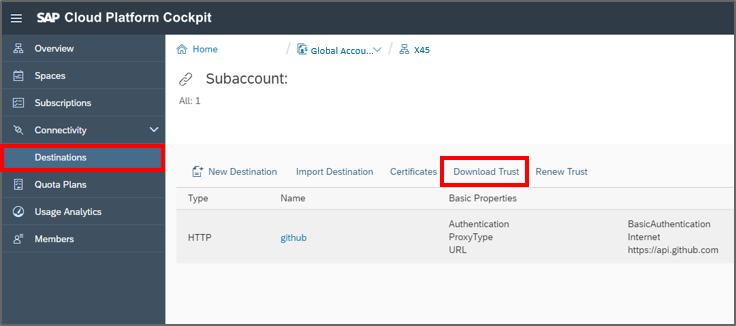

[DONE]
[ACCORDION-END]

[ACCORDION-BEGIN [Step 2: ](Create role for communication management in SAP S/4HANA Cloud)]

  1. Open SAP S/4HANA Cloud system as an administrator.

      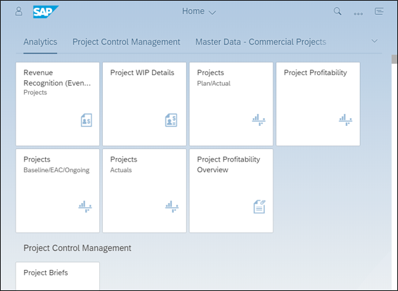

  2. Go to **Identity and Access Management** and select the **Maintain Business Roles** tile.

      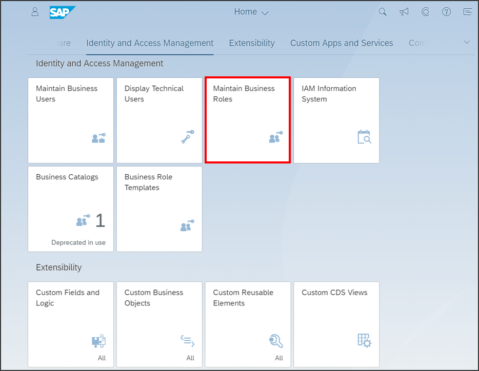

  3. Click **New** to create a new business role.

      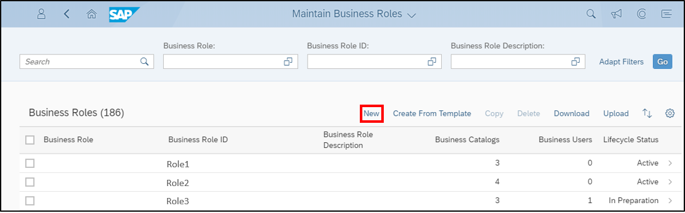

  4. Define your business role and your business role ID.

      

  5. Select **Assigned Business Catalogs** tab and click **Add**.

      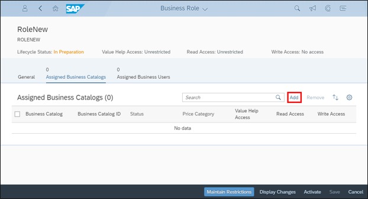

  6. Search `SAP_CORE_BC_COM`, select it, apply the change and click **OK**.

      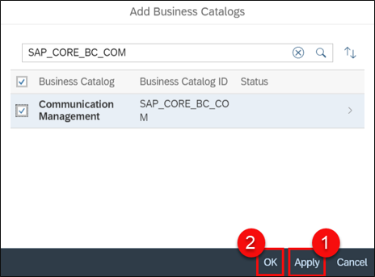

[DONE]
[ACCORDION-END]

[ACCORDION-BEGIN [Step 3: ](Create communication arrangement in SAP S/4HANA Cloud)]
  1. Open SAP S/4HANA Cloud system as administrator.

      

  2. Go to **Communication Management** and select the **Communication Arrangements** tile.

      

  3. Click **New** to add a new communication arrangement.

      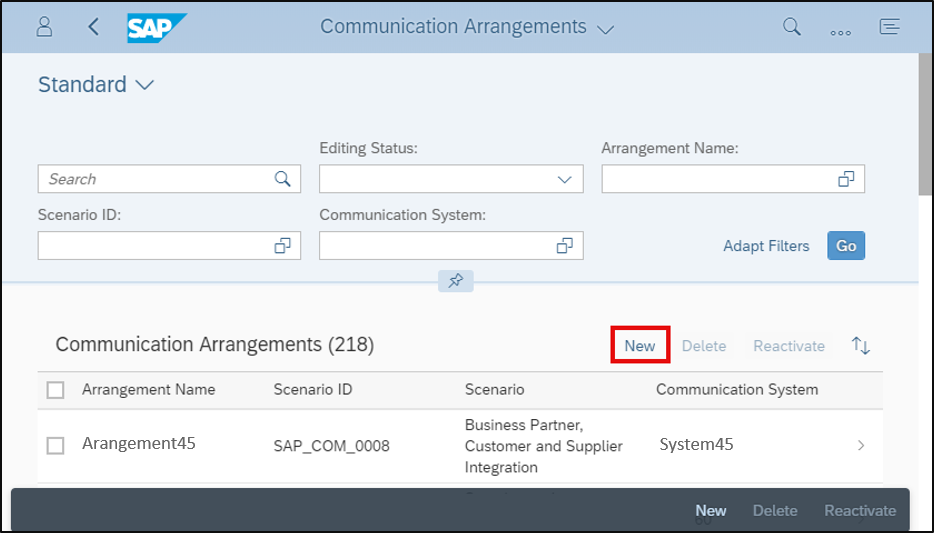

  4. Select **`SAP_COM_0008`** as scenario and give your arrangement a name.
     `SAP _COM_0008` as the communication scenario is needed to set up the communication with SAP Cloud Platform as business partner.
     Click **Create**.

      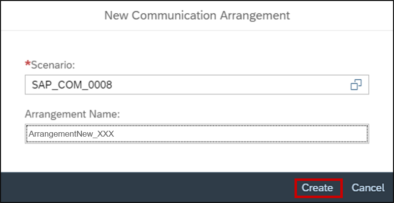

  5. As a result you get following display. Click **New** to create a new communication system.

      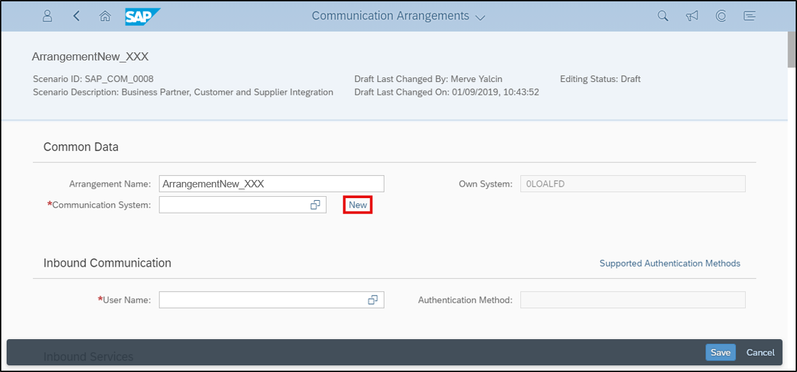

  6. Enter a system ID and system name.

      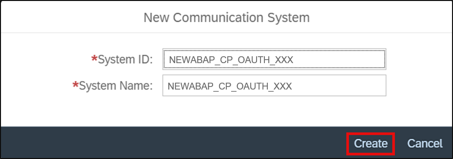

 7. You need to switch to your SAP Cloud Platform Cockpit to set your host name.

      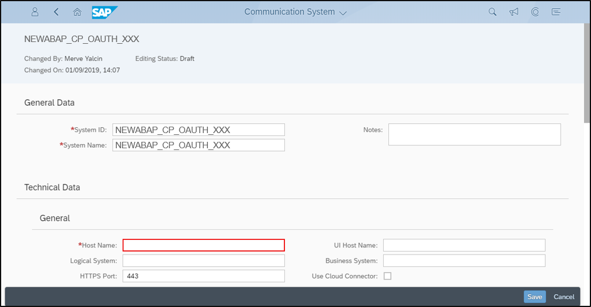

[DONE]
[ACCORDION-END]

[ACCORDION-BEGIN [Step 4: ](Select instance URL)]
  1. Open SAP Cloud Platform Cockpit and select your global account.

      

  2. Select **Subaccounts**.

      

  3. Select your Cloud Foundry subaccount.

      

  4. Switch to your space.

      

  5. Click **Service Instances** and select your own service instance.

      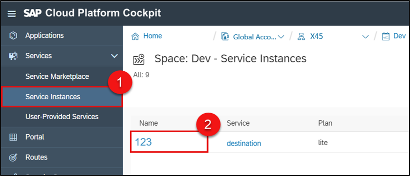

  6. Now you can see your service key. Inside your service key is your instance URL.
     Your instance URL is structured as following:

    `xxxxxxxx-xxxx-xxxx-xxxx-xxxxxxxxxxxx.abap.eu10.hana.ondemand.com`
     Copy your instance URL without `https://` to paste it as host name in your communication system.

      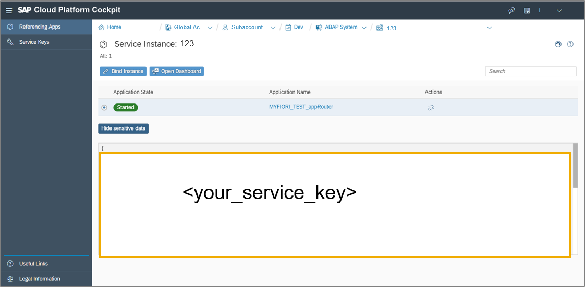

[DONE]
[ACCORDION-END]

[ACCORDION-BEGIN [Step 5: ](Create communication system)]
  1. Switch to your SAP S/4HANA Cloud system, open your communication system, paste your host name and click save.

      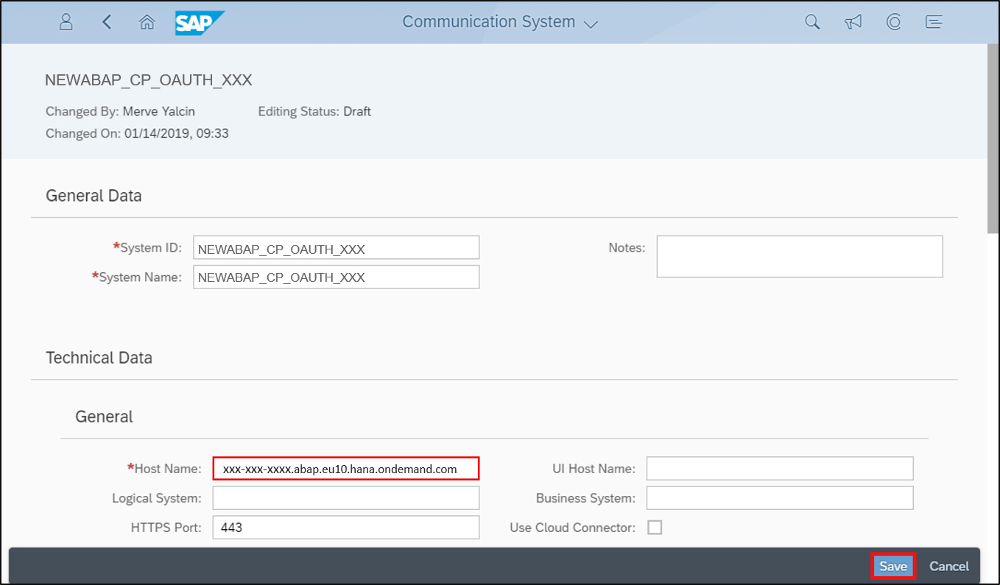

  2. Enter `DUMMY` as logical system and business system. Don' t click save yet.

      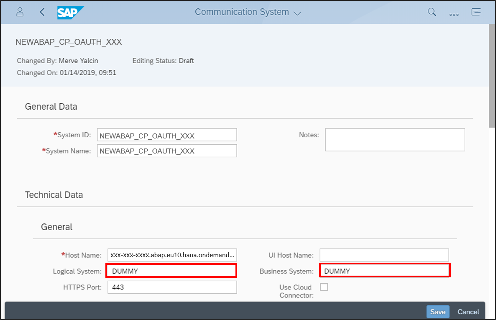

  3. Check enabled in the `OAuth 2.0 Identity Provider area`. Upload the certificate
     you downloaded in step `1.4` from your SAP Cloud Platform Cockpit.
     Copy the common name (the string after CN=) and paste it into the Provider Name field.

     Don't save yet.

      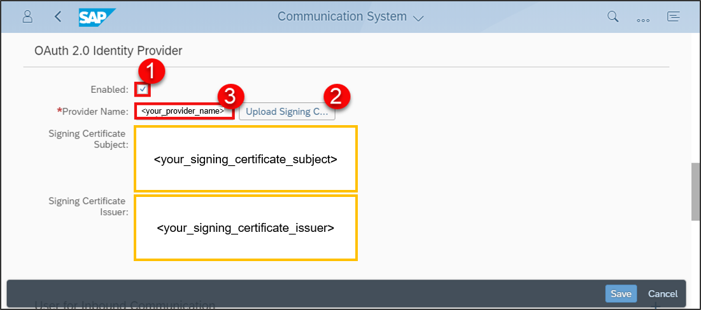

[DONE]
[ACCORDION-END]

[ACCORDION-BEGIN [Step 6: ](Create inbound and outbound communication user)]
  1. Choose **`+`** in the inbound communication area to add a new communication user for inbound communication in SAP S/4HANA Cloud.

      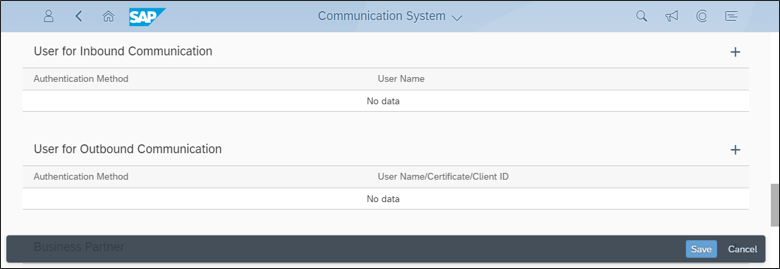

  2. Choose **New User**.

      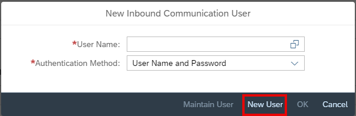

  3. Enter your communication system name as user name and description. Click **Propose Password** to generate a password and
     Click **Create**.

      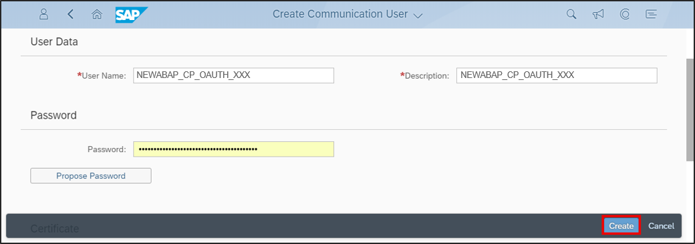

  4. Click **OK**.

      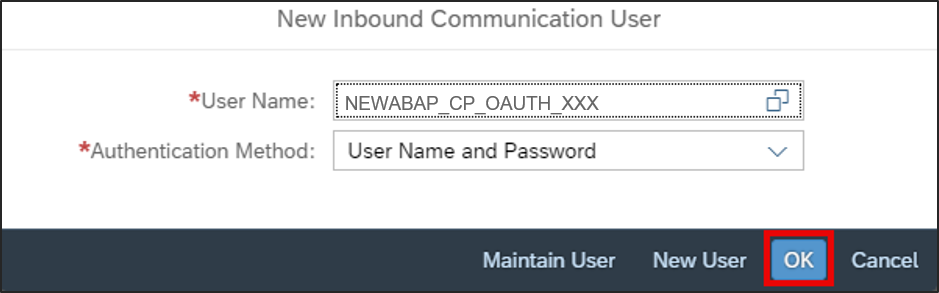

  5. Choose **`+`** in the outbound communication user area to create a outbound communication user.

      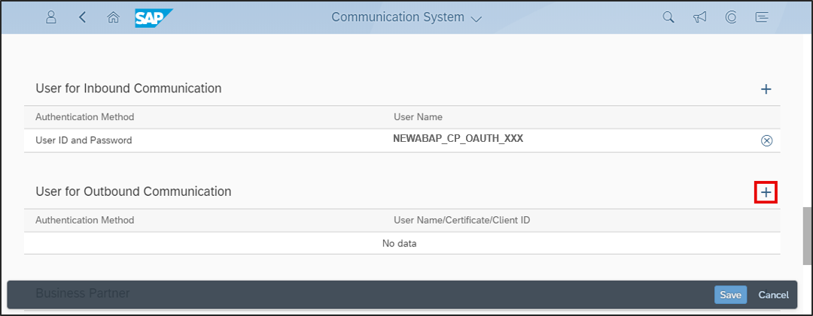

  6. Select **`SSL Client Certificate`** as authentication method and **Default Client Certificate** as certificate type.

      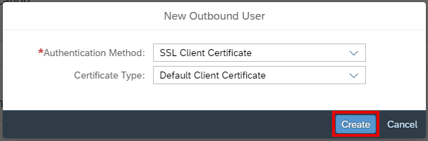

  7. Choose **Save** to save your communication system.

      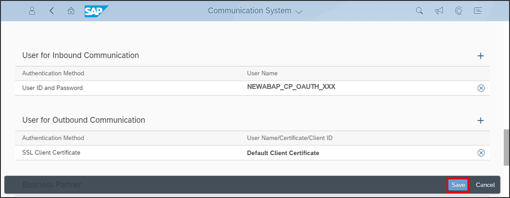

[DONE]
[ACCORDION-END]

[ACCORDION-BEGIN [Step 7: ](Deactivating outbound services)]
  1. Edit your communication system and select **`OAuth 2.0`** in the inbound communication area.

      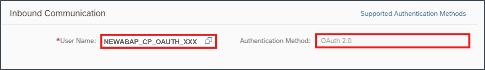

  2. Select **Default Client Certificate** in the outbound communication area.

      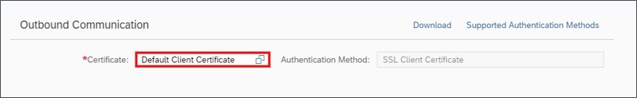

  3. Deactivate all outbound communication services. The outbound services aren't relevant
     for outbound communication from the SAP Cloud Platform ABAP environment to SAP S/4HANA Cloud
     Click **Save**.

      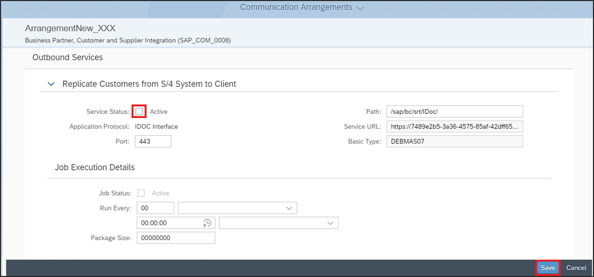

[DONE]
[ACCORDION-END]

[ACCORDION-BEGIN [Step 8: ](Test yourself)]

[VALIDATE_1]
[ACCORDION-END]
---
