## Prerequisites  
- You need an SAP BTP, ABAP environment [trial user](abap-environment-trial-onboarding) or a license.
- Install [ABAP Development Tools](https://tools.hana.ondemand.com/#abap)
- Inform yourself about the [Virtual Data Model (VDM) guidelines](https://help.sap.com/viewer/8308e6d301d54584a33cd04a9861bc52/1909.000/en-US/8573b810511948c8a99c0672abc159aa.html)
- Inform yourself about the [naming conventions for Development Objects](https://help.sap.com/viewer/923180ddb98240829d935862025004d6/Cloud/en-US/8b8f9d8f3cb948b2841d6045a255e503.html)

## Details
### You will learn  
- How to create packages
- How to create data element and domain
- How to create database table
- How to create enable log changes
- How to create CDS view
- How to create behavior definition
- How to create CDS view projection
- How to create behavior definition projection
- How to create service definition
- How to create service binding
- How to create metadata extensions

This tutorial shows you how to create **business configuration UIs** using the ABAP RESTful Application Programming Model (RAP). This tutorial is based on a simplified factory calendar data base model.


---
[ACCORDION-BEGIN [Step 1: ](Create package)]

  1. Open your **ABAP Development Tools**, logon to your **ABAP system** and right-click on **`ZLOCAL`**, select **New** > **ABAP Package**.

      

  2. Create a new package:
     - Name: **`Z_Calendar_XXX`**
     - Description: **`Calendar package XXX`**
     - `Superpackage`: `ZLOCAL`

      

      Click **Next >**.

  3. Enter a new transport request and click **Finish**.

      

[DONE]
[ACCORDION-END]

[ACCORDION-BEGIN [Step 2: ](Create data element and domain)]

  1. Right-click on **`Z_Calendar_XXX`**, select **New** > **Other ABAP Repository Object**.

      

  2. Search for **data element**, select it and click **Next >**.

      

  3. Create a data element:
     - Name: **`ZCAL_DAY_XXX`**
     - Description: **`Day`**

      

      Click **Next >**.

  4. Click **Finish**.

      

  5. Select `Predefined Type` as category, `NUMC` as data type, 2 as length and provide following field labels:

      

  6. Save and activate data element **`ZCAL_DAY_XXX`**.

  7. Create a new data element, therefore repeat **step 2.1. - 2.5**. Instead of using `Predefined Type` as category, use `Domain` instead.

    Create a new data element: **`ZCAL_HOLIDAY_ID_XXX:`**:

      -  Category: `Domain`
      -  Data Type: `ZCAL_HOLIDAY_ID_XXX`

      

      Now a new domain needs to be created. Don't save and activate yet.

  8. Right-click on **Data Elements**, select **New** > **Domain**.

      

  9. Create a new domain:
     - Name: **`ZCAL_HOLIDAY_ID_XXX`**
     - Description: Domain holiday

       

      Click **Next >**.

 10. Click **Finish**.

       

 11. Add your data type and length:
    - Data type: `CHAR`
    - Length: 30

       

 12. Save and activate your domain **`ZCAL_HOLIDAY_ID_XXX`** and data element **`ZCAL_HOLIDAY_ID_XXX`**.

 13. Repeat **step 2.1. - 2.5** to create further **data elements**:

    - **`ZCAL_MONTH_XXX:`**
      Category: `Predefined Type`,
      Data Type: `NUMC`,
      Length: 2,
      Field Labels: Month (for all)

    - **`ZCAL_DESCRIPTION_XXX:`**
      Category: `Predefined Type`,
      Data Type: `CHAR`,
      Length: 100

      **Create, save and activate** all data elements.

[DONE]
[ACCORDION-END]

[ACCORDION-BEGIN [Step 3: ](Create database table)]

  1. Right-click on **`Z_Calendar_XXX`**, select **New** > **Other ABAP Repository Object**.

      

  2. Search for **database table**, select it and click **Next >**.

      

  3. Create a database table:
     - Name: **`ZCAL_HOLIDAY_XXX`**
     - Description: **`Public Holiday Table`**

      

      Click **Next >**.

  4. Click **Finish**.

      

  5. Replace your code with following:

    ```ABAP    
    @EndUserText.label : 'Public Holiday Table'
    @AbapCatalog.enhancement.category : #NOT_EXTENSIBLE
    @AbapCatalog.tableCategory : #TRANSPARENT
    @AbapCatalog.deliveryClass : #C
    @AbapCatalog.dataMaintenance : #RESTRICTED
    define table zcal_holiday_xxx {
      key client            : mandt not null;
      key holiday_id        : zcal_holiday_id_xxx not null;
      month_of_holiday      : zcal_month_xxx;
      day_of_holiday        : zcal_day_xxx;
      last_changed_at       : timestampl;
      local_last_changed_at : timestampl;
    }
    ```

  6. Save and activate.

  7. Repeat step **3.1.- 3.4** and create a **database table**:

     - Name: **`ZCAL_HOLITXT_XXX`**
     - Description: **`Public Holiday Text Table`**

    ```ABAP
    @EndUserText.label : 'Public Holiday Text Table'
    @AbapCatalog.enhancementCategory : #NOT_EXTENSIBLE
    @AbapCatalog.tableCategory : #TRANSPARENT
    @AbapCatalog.deliveryClass : #C
    @AbapCatalog.dataMaintenance : #RESTRICTED
    define table zcal_holitxt_xxx {
      key client       : mandt not null;
      @AbapCatalog.textLanguage
      key spras        : spras not null;
      @AbapCatalog.foreignKey.screenCheck : false
      key holiday_id   : zcal_holiday_id_xxx not null
        with foreign key [0..*,1] zcal_holiday_xxx
          where client = zcal_holitxt_xxx.client
            and holiday_id = zcal_holitxt_xxx.holiday_id;
      fcal_description : zcal_description_xxx;

    }
    ```

  8. Save and activate.


    >**HINT:** For didactical reasons, we show the step-by-step [implementation of a RAP Managed Business Object](https://help.sap.com/viewer/923180ddb98240829d935862025004d6/Cloud/en-US/b5bba99612cf4637a8b72a3fc82c22d9.html) with BC specific features like transport integration and integration in the [Maintain Business Configuration](https://help.sap.com/viewer/65de2977205c403bbc107264b8eccf4b/Cloud/en-US/76384d8e68e646d6ae5ce8977412cbb4.html) app.

[DONE]
[ACCORDION-END]

[ACCORDION-BEGIN [Step 4: ](Enable log changes)]
To use the [**Business Configuration Change Logs**](https://help.sap.com/viewer/65de2977205c403bbc107264b8eccf4b/Cloud/en-US/5c6cf20499894f1083e80dba7c5963d4.html) app, activate the log changes function to keep track of configuration changes in your business configuration tables.

>**HINT:** For client dependent customizing tables, buffering is typically switched on by generic key with number of key fields equal to 1. For client dependent customizing text tables, buffering is typically switched on by generic key with number of key fields equal to 2 to include the language key field.

>Note that table buffering for CDS view entities as defined in this tutorial is not supported. Consider reading directly from the customizing table in your application code.

Select database table **`ZCAL_HOLIDAY_XXX`**, navigate to the technical table settings and open **`ZCAL_I_HOLIDAY_XXX`**. Enable log changes.


Save and activate.

[DONE]
[ACCORDION-END]


[ACCORDION-BEGIN [Step 5: ](Create CDS view)]

You want to [**create a RAP Managed Business Object**](https://help.sap.com/viewer/923180ddb98240829d935862025004d6/Cloud/en-US/b5bba99612cf4637a8b72a3fc82c22d9.html) for configuration of Public Holidays. Therefore, you have already created all database tables as shown in the step 3.

>**HINT:**  For the Data Definition wizard to use aliases, check the following settings in your ADT configuration.

>Navigate to **Window** > **Preferences**.

>

>Search code completion and select it for ABAP Development. Check the aliases box and apply your changes.

>

 ---

The creation of Core Data Services-View (CDS-View) takes place [here](https://help.sap.com/viewer/923180ddb98240829d935862025004d6/Cloud/en-US/3070e4fa2dba45efb600d5ca6c845b9f.html). CDS views are the foundation of each business object node.

>Hint: The data model must consist only of client dependent tables.

Additional information about RAP BO with multi-inline-edit capabilities can be found [here](https://help.sap.com/viewer/923180ddb98240829d935862025004d6/Cloud/en-US/f713ec52bcb8405ca9262918cffa5d25.html).

We want to create a business object with multi-inline-edit capabilities. As a first step, we need to define the singleton root entity. For the interface view the prefix `I_` is used. Our tutorial objects do not have a namespace so we are using the software component name `ZCAL` with an additional `_` instead.

  1. Right-click on **`Z_Calendar_XXX`**, select **New** > **Other ABAP Repository Object**.

      

  2. Search for **data definition**, select it and click **Next >**.

      

  3. Create a data definition:
     - Name: **`ZCAL_I_MCAL_ALL_XXX`**
     - Description: **`Singleton: Multi Edit Holiday Calendar`**

      

      Click **Next >**.

    >**Hint:** Follow the [naming conventions](https://help.sap.com/viewer/923180ddb98240829d935862025004d6/Cloud/en-US/8b8f9d8f3cb948b2841d6045a255e503.html). For the interface view the prefix `I_` is used.


  4. Select **Define Root View Entity** as a template and click **Finish**.

      

  5. Add the annotation `@Semantics.systemDateTime.lastChangedAt: true` to `field last_changed_at` and annotation `@Semantics.systemDateTime.localInstanceLastChangedAt: true` to field `local_last_changed_at`. Both fields will be used for optimistic concurrency locking. The field `Request` will be used to store the selected transport request, `HideTransport` to dynamically show the facet with the transport request information. Enter set `authorizationCheck` to `#NOT_REQUIRED`.

  6. Your code should look like this:

    ```ABAP
    @EndUserText.label: 'Singleton'
    @AccessControl.authorizationCheck: #NOT_REQUIRED
    define root view entity ZCAL_I_MCAL_ALL_XXX
      as select from    I_Language
        left outer join zcal_holiday_xxx on 0 = 0
      composition [0..*] of zcal_i_mcal_xxx as _Holiday
    {
      key 1                                          as HolidayAllID,
          @Semantics.systemDateTime.lastChangedAt: true
          max( zcal_holiday_xxx.last_changed_at )       as LastChangedAtMax,
          @Semantics.systemDateTime.localInstanceLastChangedAt: true
          max( zcal_holiday_xxx.local_last_changed_at ) as LocalLastChangedAtMax,
          cast( '' as sxco_transport)                as Request,
          cast( 'X' as abap_boolean)                 as HideTransport,
          _Holiday
    }
    where
      I_Language.Language = $session.system_language
    ```

  7. Save, activation is not possible yet.

  8. In the project explorer, right-click on **Data Definitions** and select **New Data Definition**.

    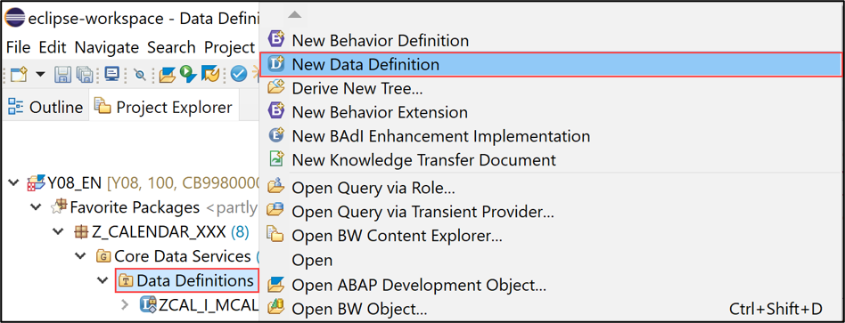

  9. Create a data definition:
     - Name: **`ZCAL_I_MCAL_XXX`**
     - Description: **`Public Holiday`**

      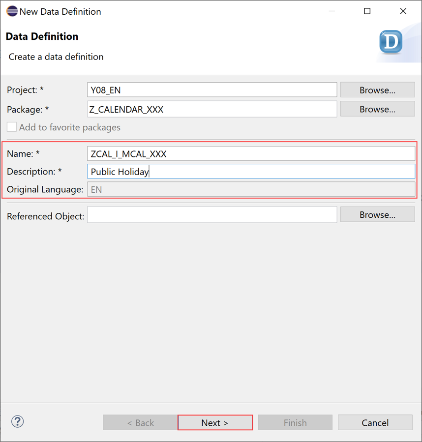

      Click **Next >**.

  10. Click **Next >**.

    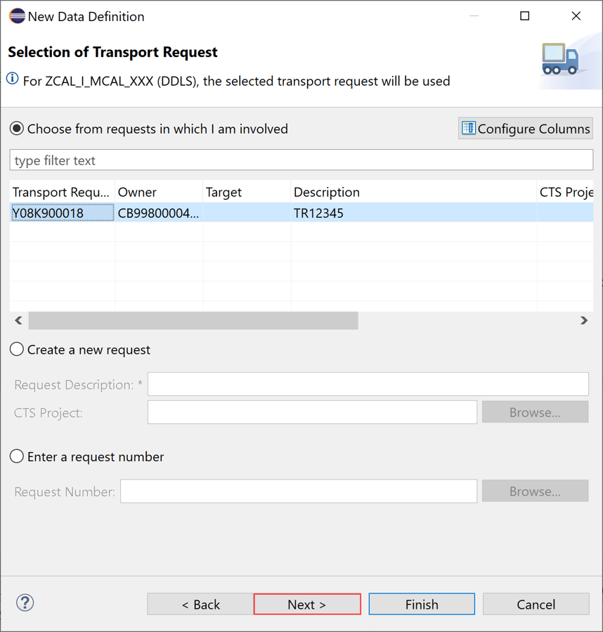

  11. Choose **Define View Entity** as a template and click **Finish**.

    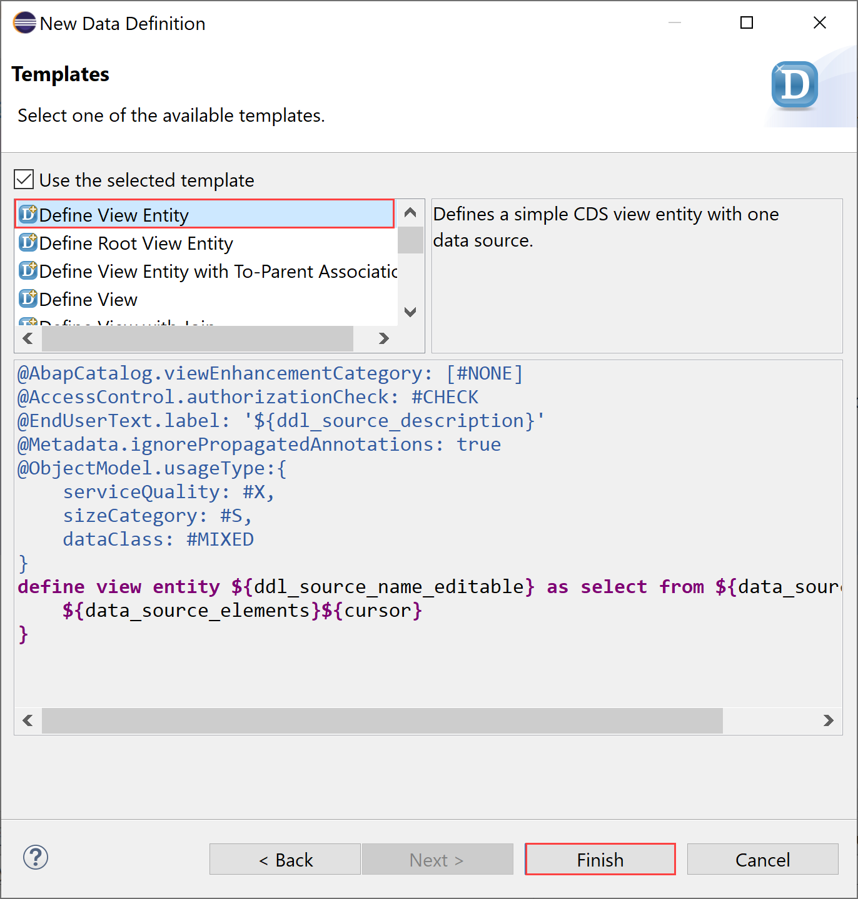

  12. Your code should look like this:

    ```ABAP
    @EndUserText.label: 'Public Holiday'
    @AccessControl.authorizationCheck: #NOT_REQUIRED
    @ObjectModel.semanticKey: ['Holiday']
    define view entity zcal_i_mcal_xxx
      as select from zcal_holiday_xxx
      composition [0..*] of zcal_i_mcal_txt_xxx as _HolidayTxt
      association to parent zcal_i_mcal_all_xxx as _HolidayAll on $projection.HolidayAllID = _HolidayAll.HolidayAllID
    {
      key holiday_id       as Holiday,
          1                as HolidayAllID,
          month_of_holiday as HolidayMonth,
          day_of_holiday   as HolidayDay,
          _HolidayTxt,
          _HolidayAll
    }
    ```

  12. Save, activation is not possible yet.


  13. In the project explorer, right-click on **Data Definitions** and select **New Data Definition**.

    

  14. Create a data definition:
     - Name: **`ZCAL_I_MCAL_TXT_XXX`**
     - Description: **`Holiday Text`**

      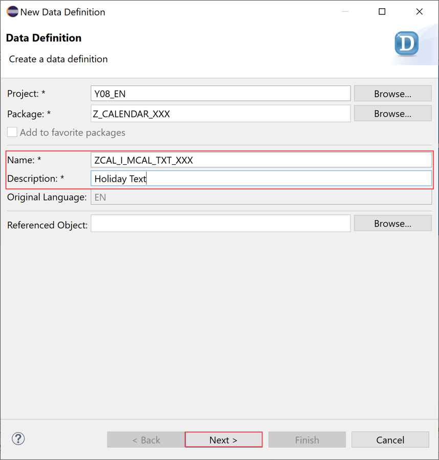

      Click **Next >**.

  15. Click **Next >**.

    

  15. Choose **Define View Entity** as a template and click **Finish**.

    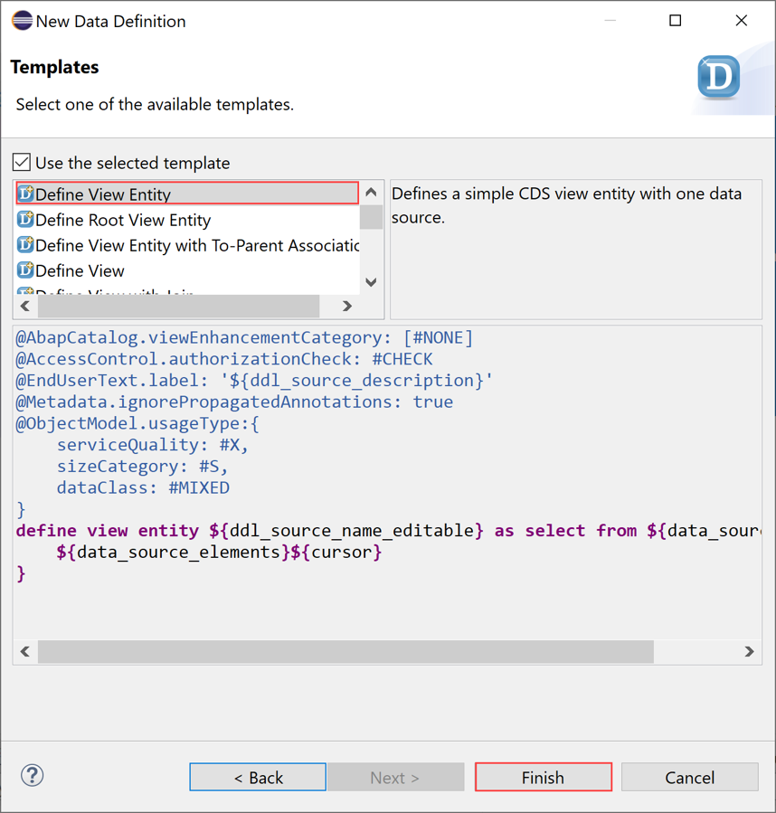

  16. Your code should look like this:

    ```ABAP
    @EndUserText.label: 'Holiday text'
    @AccessControl.authorizationCheck: #NOT_REQUIRED
    @ObjectModel.dataCategory: #TEXT
    define view entity zcal_i_mcal_txt_xxx
      as select from zcal_holitxt_xxx
      association        to parent zcal_i_mcal_xxx as _Public_Holiday on $projection.Holiday = _Public_Holiday.Holiday
      association [0..*] to I_LanguageText         as _LanguageText   on $projection.Language = _LanguageText.LanguageCode
      association [1]    to zcal_i_mcal_all_xxx    as _HolidayAll     on $projection.HolidayAllID = _HolidayAll.HolidayAllID
    {
          @Semantics.language: true
      key spras            as Language,
      key holiday_id       as Holiday,
          1                as HolidayAllID,
          @Semantics.text: true
          fcal_description as HolidayDescription,
          _Public_Holiday,
          _LanguageText,
          _HolidayAll
    }
    ```

  17. **Save** and **activate all 3 data definitions**.


[DONE]
[ACCORDION-END]

[ACCORDION-BEGIN [Step 6: ](Create behavior definition)]

The behavior definition defines the nodes of the business object and its properties. Here you can define which node-actions the business object supports. By default, this will be create, update and delete. Furthermore, lock objects, implementation classes and authorization checks can be defined.

>**HINT:** In order to use the Business Object in the [Maintain Business Configuration app](https://help.sap.com/viewer/65de2977205c403bbc107264b8eccf4b/Cloud/en-US/76384d8e68e646d6ae5ce8977412cbb4.html), the exposed service must be of type **OData V4**. One requirement is that the Business Object must be draft enabled. [Draft business objects](https://help.sap.com/viewer/923180ddb98240829d935862025004d6/Cloud/en-US/a81081f76c904b878443bcdaf7a4eb10.html) requires a total `ETag` field to ensure optimistic concurrency comparison.

>Please note that the Maintain Business Configurations API only supports one level of sub nodes, i.e. your root entity can have associations to an arbitrary amount of entities but these sub entities cannot have associations to further sub entities.

>Hint: The content of a text table can also be maintained using the **[Maintain translations](https://help.sap.com/viewer/65de2977205c403bbc107264b8eccf4b/Cloud/en-US/e2ca05c69dc94b98bf725396a0b13ace.html?q=maintain%20translations)** app.

>Part of the Business Logic is to [implement validations](https://help.sap.com/viewer/923180ddb98240829d935862025004d6/Cloud/en-US/abfbcd933c264fe4a4883d80d1e951d8.html) to check the values provided by the client. In this example, validations could be defined for fields `MonthOfHoliday` and `DayOfHoliday` to verify the validity of the date.

  1. Right-click on your data definition **`ZCAL_I_MCAL_ALL_XXX`**, select **New Behavior Definition**.

      

  2. Make sure, that your **implementation type is managed** and click **Next >**.

      

  3. Click **Finish**.

      

  4. Add [strict](https://help.sap.com/viewer/923180ddb98240829d935862025004d6/Cloud/en-US/cbb86e63a8464e63bbdd43b7bfa5fc4f.html) to your behavior definition. The **strict** annotation is a prerequisite for extensibility and enforces RAP best practices. Define the root entity as [lock master](https://help.sap.com/viewer/923180ddb98240829d935862025004d6/Cloud/en-US/99d8162b8d7d4a83ae65320d2a03b8ab.html). This defines the root node as the main locking object to avoid multiple persons editing the same object. Sub nodes will be defined as **lock dependent**. A draft enabled RAP business object requires a designated field to enable optimistic [concurrency checks during the transition from draft to active data](https://help.sap.com/viewer/923180ddb98240829d935862025004d6/Cloud/en-US/f5e8548c241b43ab82bceec030b5dc9a.html). This is mandatory. Define **`LastChangedAtMax`** as total `ETag`. For the recording of changes we must [implement an additional save method](https://help.sap.com/viewer/923180ddb98240829d935862025004d6/Cloud/en-US/a37b4f54bd8f4102adabc6e9b5fa53a4.html).

    ```ABAP
    managed with additional save implementation in class zbp_cal_i_mcal_all_xxx unique;
    strict;
    with draft;

    define behavior for zcal_i_mcal_all_xxx alias HolidayAll
    with unmanaged save
    lock master total etag LastChangedAtMax
    authorization master ( global )
    draft table zcal_x_cal_a_xxx
    {
      update;
      draft action Activate;
      draft action Discard;
      draft action Edit;
      draft action Resume;
      draft determine action Prepare;

      association _Holiday { create; with draft; }
    }

    define behavior for zcal_i_mcal_xxx alias HolidayRoot
    lock dependent by _HolidayAll
    authorization dependent by _HolidayAll
    persistent table zcal_holiday_xxx
    draft table zcal_d_cal_xxx
    {
      update;
      delete;
      field ( readonly ) HolidayAllID;
      field ( readonly : update ) Holiday;
      association _HolidayAll { with draft; }
      association _HolidayTxt { create; with draft; }

      mapping for ZCAL_HOLIDAY_XXX corresponding
      {
        Holiday = holiday_id;
        HolidayDay = day_of_holiday;
        HolidayMonth = month_of_holiday;
      }
    }

    define behavior for zcal_i_mcal_txt_xxx alias HolidayText
    lock dependent by _HolidayAll
    authorization dependent by _HolidayAll
    persistent table zcal_holitxt_xxx
    draft table zcal_d_txt_xxx

    {
      update;
      delete;
      field ( readonly : update ) Holiday;
      field ( readonly : update ) Language;

      field ( readonly ) HolidayAllID;

      association _HolidayAll { with draft; }
      association _Public_Holiday { with draft; }

      mapping for ZCAL_HOLITXT_XXX corresponding
      {
        Language = spras;
        Holiday = holiday_id;
        HolidayDescription = fcal_description;
      }
    }
    ```

  5. Save, activation is not possible yet.

  6. Place the cursor on draft table `ZCAL_X_CAL_A_XXX` and use the quick assist (CTRL+1) to create the table.

    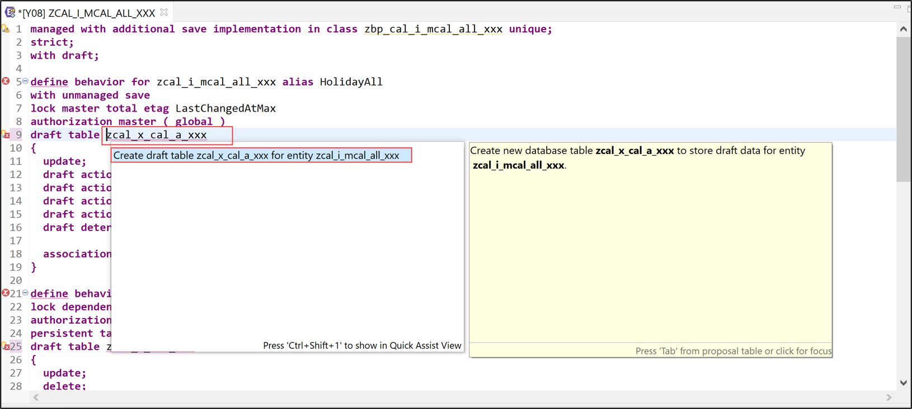

  7. Click **Next >**.

    

  8. Click **Finish**.

    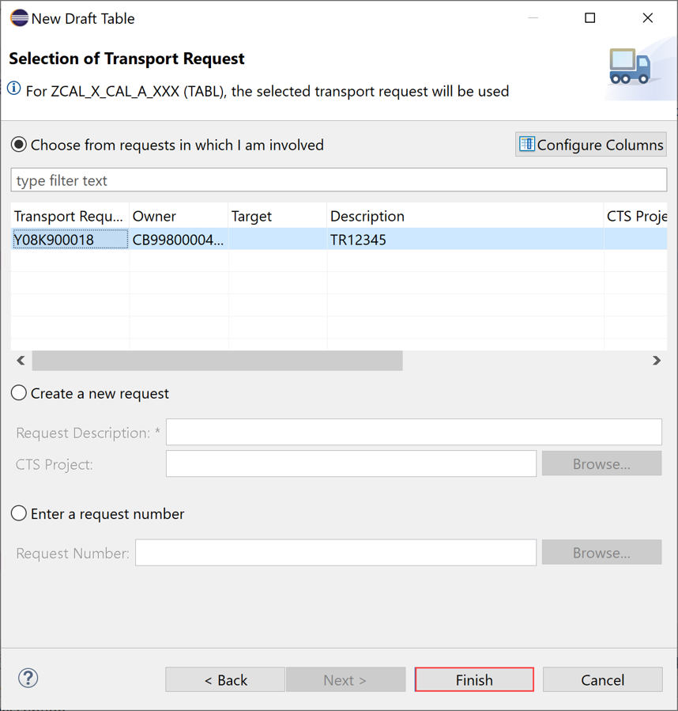

  9. Save and activate the table.

 10. **Repeat Step 6.6 - 6.8** for draft table `ZCAL_D_MCAL_XXX` and draft table `ZCAL_D_MCAL_TXT_XXX`.

 11. Activate the behavior definition.

 12. Place the cursor on `zbp_cal_i_mcal_all_xxx` and use the quick assist (CRTL+1) to create the behavior implementation class.

    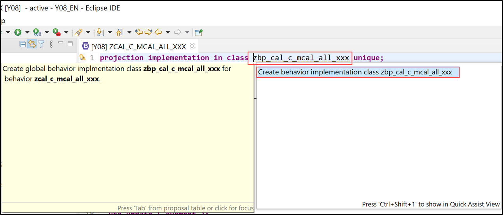

 13. Click **Next >.**

    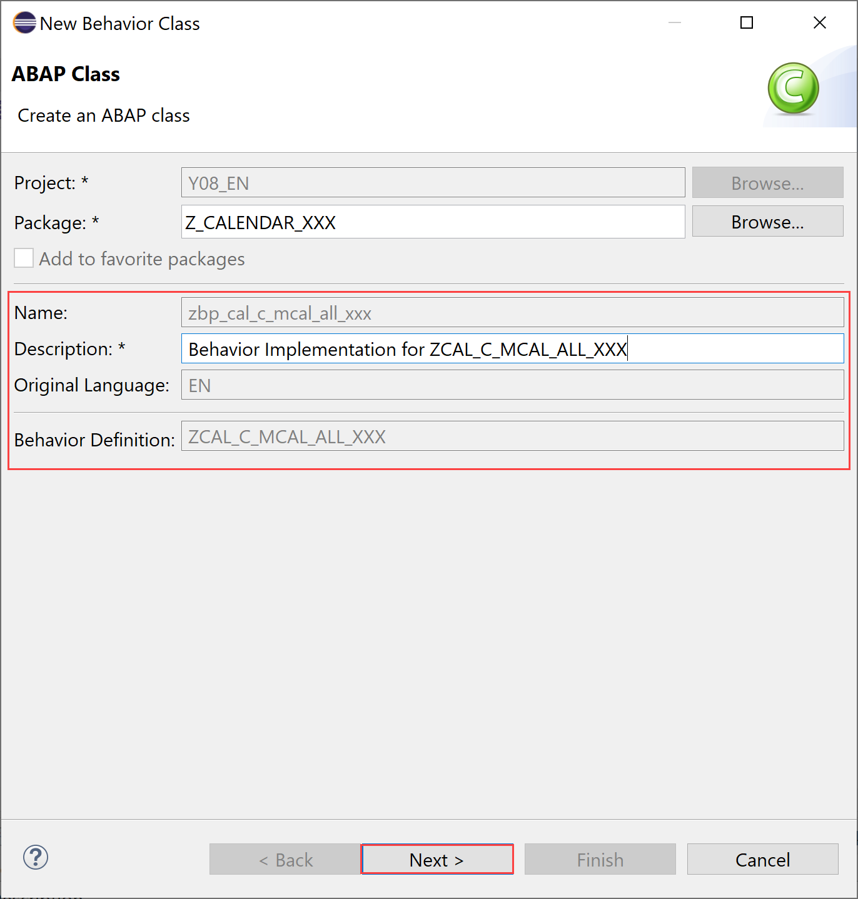

 14. Click **Finish**.

    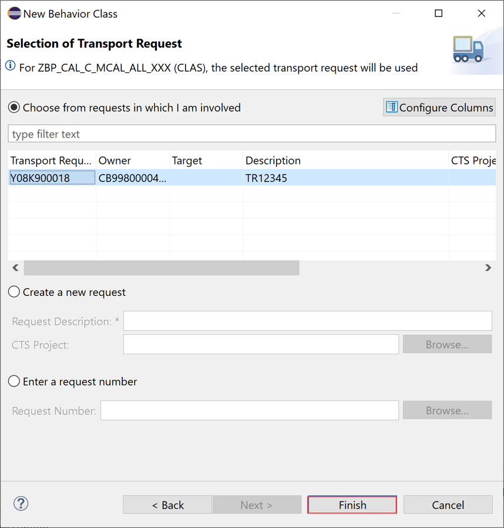

 15. Save and activate the class.


[DONE]
[ACCORDION-END]

[ACCORDION-BEGIN [Step 7: ](Create CDS view projection)]
By using projections, you can expose one business object in different business contexts by using different business object subsets. The general business logic is defined in the business object whereas the [business object projection](https://help.sap.com/viewer/923180ddb98240829d935862025004d6/Cloud/en-US/6e7a10d30b74412a9482a80b0b88e005.html) adopts a subset of the business logic.

1. In the project explorer, right-click on your data definition **`ZCAL_I_MCAL_ALL_XXX`**, select **New Data Definition**.

    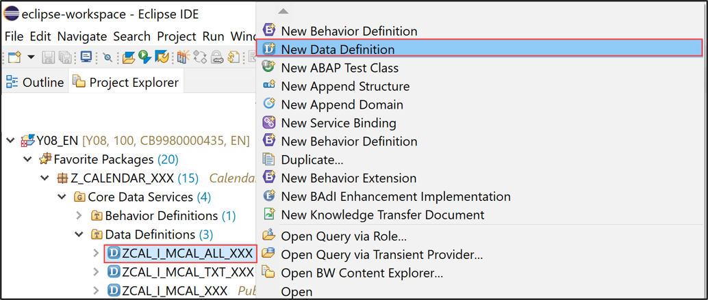

2. Create a projection view:
    - Name: `ZCAL_C_MCAL_ALL_XXX`
    - Description: Projection singleton

    

    Click **Next >**.

3. Click **Next >**.

    

4. Select **Define Projection View** as template.

    

    **Click Finish**.

5. Add annotation `@Metadata.allowExtensions: true` so we can create metadata extension for the UI annotations. Add semantic key definition. Your code should look like this:

    ```ABAP
    @EndUserText.label: 'Projection Singleton'
    @AccessControl.authorizationCheck: #NOT_REQUIRED
    @Metadata.allowExtensions: true
    @ObjectModel.semanticKey: ['HolidayAllID']
    define root view entity ZCAL_C_MCAL_ALL_XXX
      provider contract transactional_query
      as projection on zcal_i_mcal_all_xxx
    {
      key HolidayAllID,
          LastChangedAtMax,
          LocalLastChangedAtMax,
          Request,
          HideTransport,
          _Holiday : redirected to composition child ZCAL_C_MCAL_XXX
    }
    ```

6. Save, don't activate yet.

7. In the project explorer, right-click on the CDS View `ZCAL_I_MCAL_XXX` and select **New Data Definition**.

    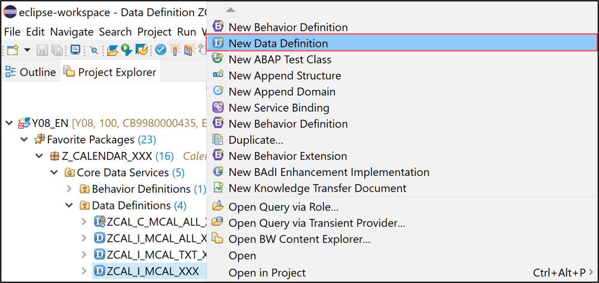

8. Create a projection view:
    - Name: `ZCAL_C_MCAL_XXX`
    - Description: Projection Holiday

    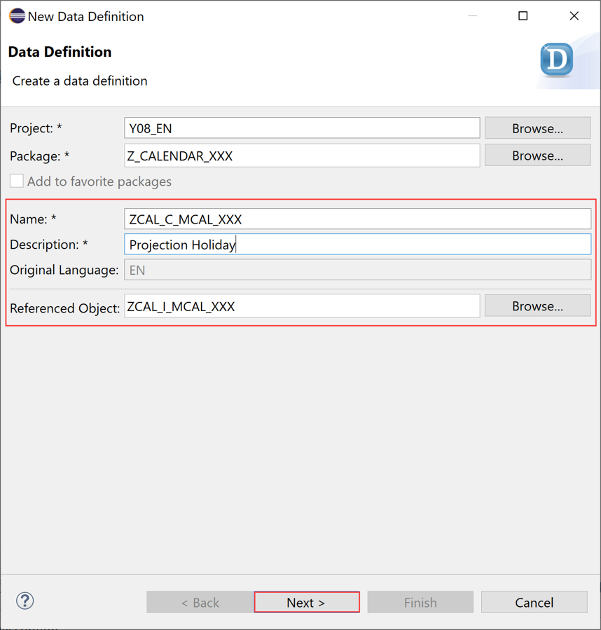

    Click **Next**.

9.  Click **Next**.

    

10. Select **Define Projection View** as Template.

    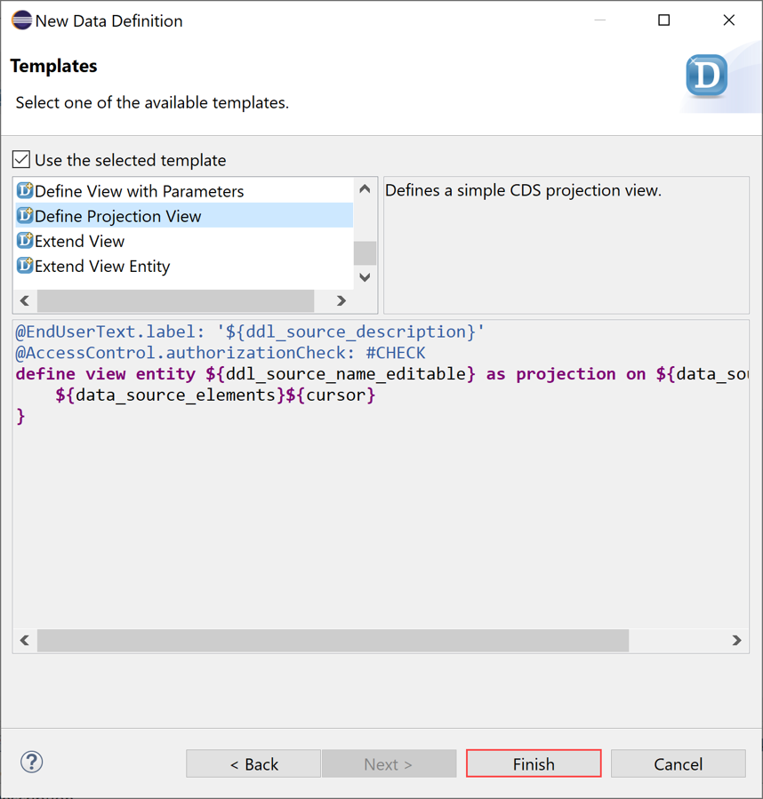

    Click **Finish**.

11.  The annotation `@Consumption.hidden` prevents fields from being exposed by OData. The `localized` annotation is used to `denormalize` language dependent text.

    ```ABAP
    @EndUserText.label: 'Projection Holiday'
    @AccessControl.authorizationCheck: #NOT_REQUIRED
    @Metadata.allowExtensions: true
    define view entity ZCAL_C_MCAL_XXX
      as projection on zcal_i_mcal_xxx
    {
      key Holiday,
          @Consumption.hidden: true
          HolidayAllID,
          HolidayMonth,
          HolidayDay,
          _HolidayTxt.HolidayDescription as HolidayDescription : localized,     
          _HolidayTxt : redirected to composition child ZCAL_c_MCAL_TXT_XXX,
          _HolidayAll : redirected to parent ZCAL_C_MCAL_ALL_XXX
    }
    ```

12. Save, don't activate yet.

13. In the project explorer, right-click on the CDS View `ZCAL_I_MCAL_TXT_XXX` and select **New Data Definition**.

    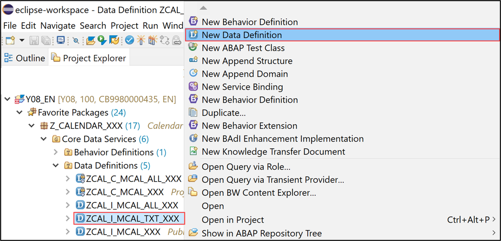

14. Create a projection view:
    - Name: `ZCAL_C_MCAL_TXT_XXX`
    - Description: Projection Holiday Text

    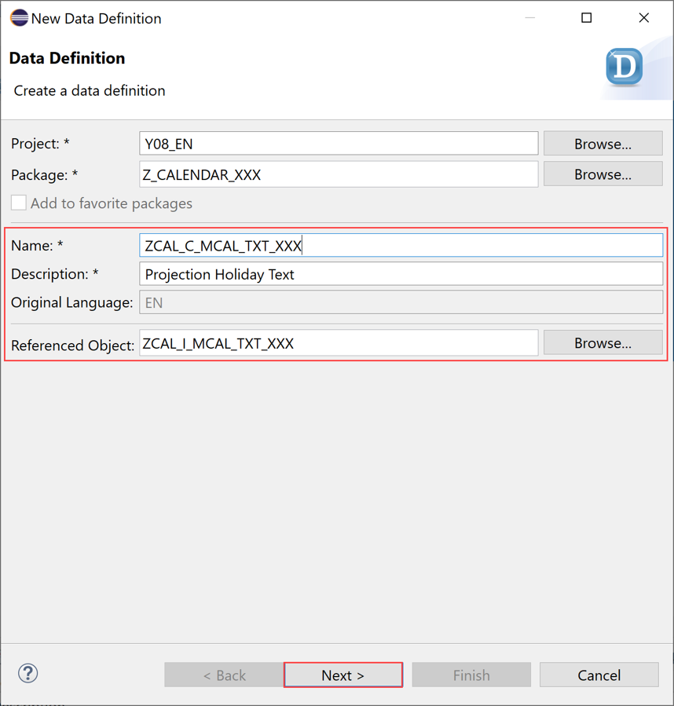

    Click **Next**.

15.  Click **Next**.

    

16. Select **Define Projection View** as Template.

    

    Click **Finish**.

17. Add input help and for field `Language`.

    ```ABAP
    @EndUserText.label: 'Holiday text'
    @AccessControl.authorizationCheck: #NOT_REQUIRED
    @Metadata.allowExtensions: true
    define view entity ZCAL_C_MCAL_TXT_XXX
      as projection on zcal_i_mcal_txt_xxx
    {
          @Consumption.valueHelpDefinition: [ {entity: {name: 'I_Language', element: 'Language' }} ]
          @ObjectModel.text.element:['LanguageDescription']
      key Language,
      key Holiday,
          @Consumption.hidden: true
          HolidayAllID,
          HolidayDescription,
          _LanguageText.LanguageName as LanguageDescription : localized,
          _Public_Holiday : redirected to parent ZCAL_c_MCAL_XXX,
          _HolidayAll     : redirected to ZCAL_C_MCAL_ALL_XXX
    }
    ```

 18. **Save** and **activate** all 3 projection views.

[DONE]
[ACCORDION-END]


[ACCORDION-BEGIN [Step 8: ](Create behavior projection)]

1. In the project explorer, right-click on your CDS view **`ZCAL_C_MCAL_ALL_XXX`**, select **New Behavior Definition**.

    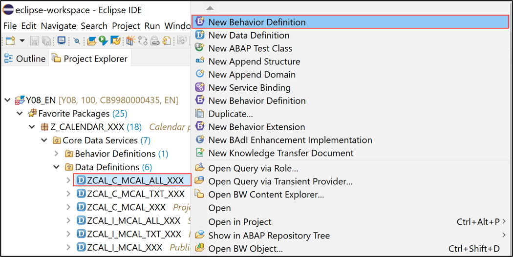

2. Create a projection view:
    - Implementation type: Projection

    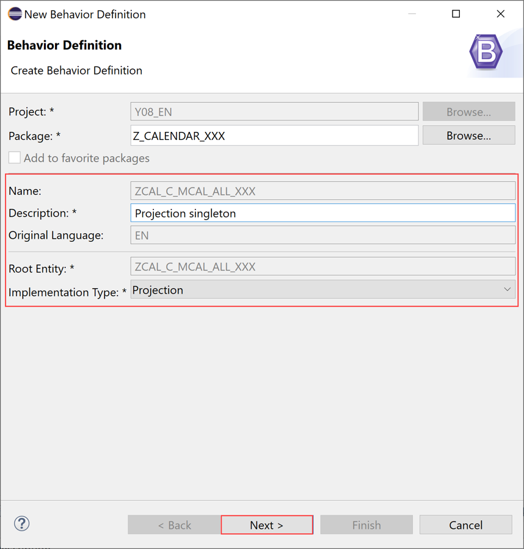

    Click **Next >**.

3.  Click **Finish**.

    

4. The **augment** statement is used to enable the end user to maintain language dependent texts in their logon language. Your code should look like this:

    ```ABAP
    projection implementation in class zbp_cal_c_mcal_all_xxx unique;
    strict;
    use draft;

    define behavior for ZCAL_C_MCAL_ALL_XXX alias HolidayAll
    {
      use action Activate;
      use action Discard;
      use action Edit;
      use action Prepare;
      use action Resume;

      use association _Holiday { create ( augment ); with draft; }
    }

    define behavior for ZCAL_c_MCAL_XXX alias HolidayRoot
    {
      use update ( augment );
      use delete;

      field ( modify ) HolidayDescription;

      use association _HolidayAll { with draft; }
      use association _HolidayTxt { create; with draft; }
    }

    define behavior for ZCAL_c_MCAL_TXT_XXX alias HolidayText
    {
      use update;
      use delete;

      use association _HolidayAll { with draft; }
      use association _Public_Holiday { with draft; }
    }
    ```

5. Save and activate.

6. Place the cursor on the class name `zbp_cal_c_mcal_all_xxx` and use the quick assist (CTRL+1) to create the behavior implementation class.

    

7. Click **Next >**.

    

8. Click **Finish**.

    

9. Enter the following in the **local types** section:

    ```ABAP
    CLASS lhc_holidayall DEFINITION INHERITING FROM cl_abap_behavior_handler.
      PRIVATE SECTION.

        METHODS augment_cba_holiday FOR MODIFY
          IMPORTING entities FOR CREATE holidayall\_holiday.

    ENDCLASS.

    CLASS lhc_holidayall IMPLEMENTATION.

      METHOD augment_cba_holiday.
        DATA cba TYPE TABLE FOR CREATE zcal_i_mcal_xxx\_holidaytxt.
        DATA myrelates TYPE abp_behv_relating_tab.
        READ TABLE entities INDEX 1 INTO DATA(entity).

        LOOP AT entity-%target ASSIGNING FIELD-SYMBOL(<target>).
          APPEND sy-tabix TO myrelates.
          INSERT VALUE #( %cid_ref  = <target>-%cid
                          %is_draft = <target>-%is_draft
                          holiday   = <target>-holiday
                          %target = VALUE #(
                          (
                            %cid = |CREATECID{ sy-tabix }|
                            %is_draft = <target>-%is_draft
                            holiday = <target>-holiday
                            language = sy-langu
                            holidaydescription = <target>-holidaydescription
                            %control-holiday = if_abap_behv=>mk-on
                            %control-language = if_abap_behv=>mk-on
                            %control-holidaydescription = if_abap_behv=>mk-on
                          )
                          ) ) INTO TABLE cba.
        ENDLOOP.
        MODIFY AUGMENTING ENTITIES OF zcal_i_mcal_all_xxx
          ENTITY holidayroot
          CREATE BY \_holidaytxt
          FROM cba.
      ENDMETHOD.

    ENDCLASS.

    CLASS lhc_holidayroot DEFINITION INHERITING FROM cl_abap_behavior_handler.
      PRIVATE SECTION.

        METHODS augment_update FOR MODIFY
          IMPORTING entities FOR UPDATE holidayroot.

    ENDCLASS.

    CLASS lhc_holidayroot IMPLEMENTATION.

      METHOD augment_update.
        DATA: text_update TYPE TABLE FOR UPDATE zcal_i_mcal_txt_xxx,
              text_cba   TYPE TABLE FOR CREATE zcal_i_mcal_xxx\_holidaytxt.
        DATA: myrelates_update TYPE abp_behv_relating_tab,
              myrelates_cba   TYPE abp_behv_relating_tab.

        READ ENTITIES OF zcal_i_mcal_all_xxx
          ENTITY holidayroot BY \_holidaytxt
            FROM VALUE #( FOR holiday_entity IN entities ( %tky = holiday_entity-%tky ) )
            LINK DATA(link).

        LOOP AT entities INTO DATA(entity) WHERE %control-holidaydescription = if_abap_behv=>mk-on.
          DATA(tabix) = sy-tabix.

          "If a Description with sy-langu already exists, perform an update. Else perform a create-by-association.
          IF line_exists( link[ KEY entity source-holiday  = entity-%key-holiday
                                           target-holiday  = entity-%key-holiday
                                           target-language = sy-langu ] ).
            APPEND tabix TO myrelates_update.

            APPEND VALUE #( %key-holiday       = entity-%key-holiday
                            %key-language      = sy-langu
                            %is_draft          = entity-%is_draft
                            holidaydescription = entity-holidaydescription
                            %control           = VALUE #( holidaydescription = entity-%control-holidaydescription ) )
             TO text_update.
          ELSE.

            APPEND tabix TO myrelates_cba.

            APPEND VALUE #( %tky         = entity-%tky
                            %target      = VALUE #( ( %cid               = |UPDATETEXTCID{ tabix }|
                                                      holiday            = entity-holiday
                                                      language           = sy-langu
                                                      %is_draft          = entity-%is_draft
                                                      holidaydescription = entity-holidaydescription
                                                      %control           = VALUE #( holiday            = if_abap_behv=>mk-on
                                                                                    language           = if_abap_behv=>mk-on
                                                                                    holidaydescription = entity-%control-holidaydescription ) ) ) )
              TO text_cba.
          ENDIF.
        ENDLOOP.

        MODIFY AUGMENTING ENTITIES OF zcal_i_mcal_all_xxx
          ENTITY holidaytext UPDATE FROM text_update RELATING TO entities BY myrelates_update
          ENTITY holidayroot CREATE BY \_holidaytxt FROM text_cba RELATING TO entities BY myrelates_cba.
      ENDMETHOD.

    ENDCLASS.
    ```

10. Save and activate the class.

[DONE]
[ACCORDION-END]


[ACCORDION-BEGIN [Step 9: ](Create service definition)]
[Service definitions](https://help.sap.com/viewer/923180ddb98240829d935862025004d6/Cloud/en-US/b09e4d53bfca4544a9f8910bcc2cd9d6.html) expose a set of business objects and their entities to a service URI. The service definition is created for the projection views.

1. In the Project Explorer, right-click on **Core Data Services** and select **New > Other ABAP Repository Object**.

    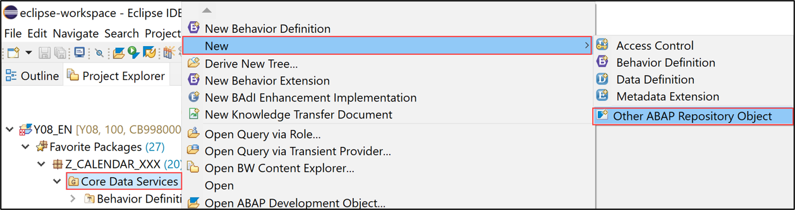

2. Search **service definition**, select it and click **Next >**.

    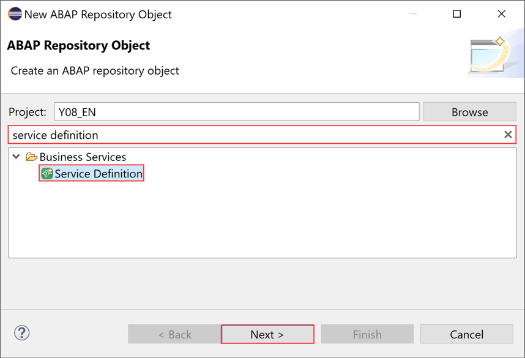

2. Create a service definition:
    - Name: `ZCAL_UI_MCAL_XXX`
    - Description: Service Definition for Public Holiday
    - Exposed Entity: `ZCAL_C_MCAL_ALL_XXX`

    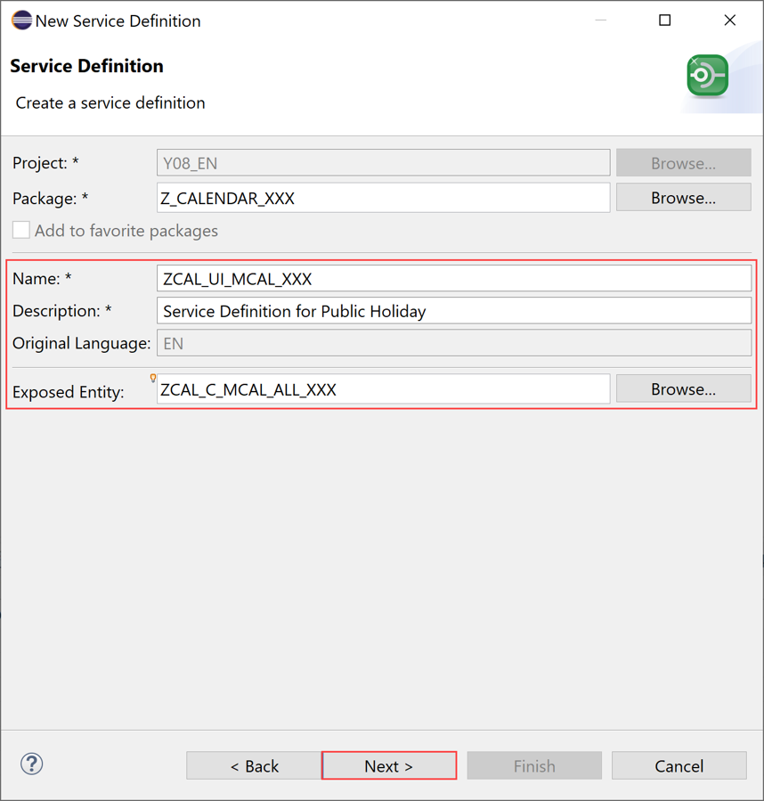

    Click **Next >**.

3.  Click **Finish**.

    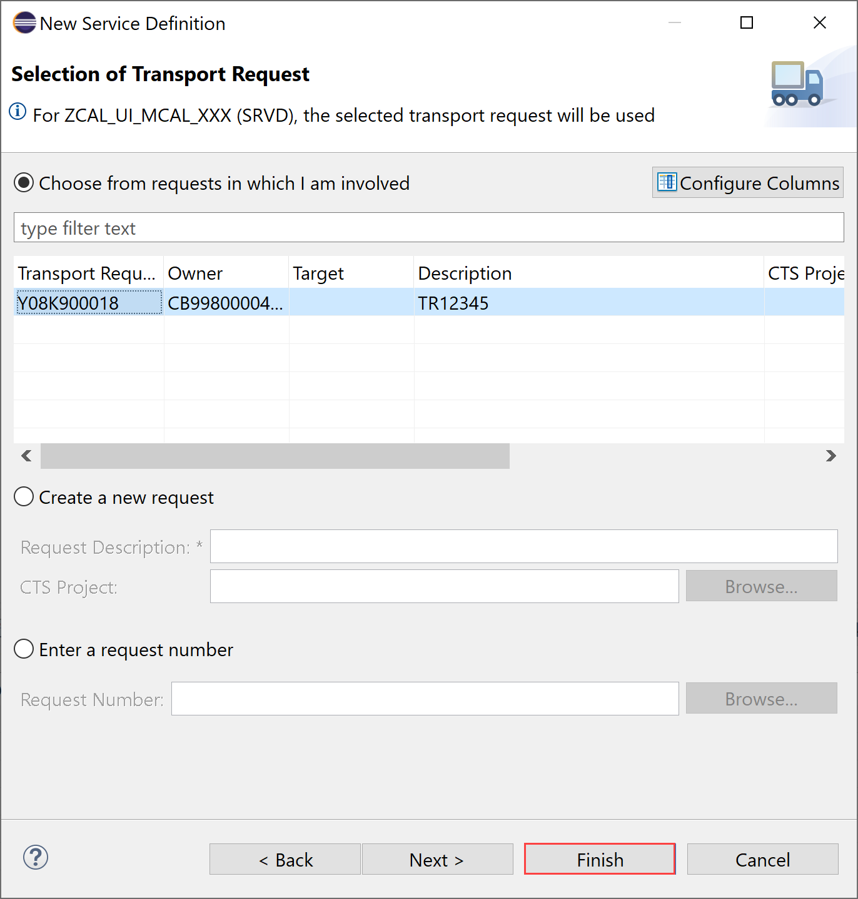

4. Add `as HolidayRoot` to the exposed entity. Check your result:

    ```ABAP
    @EndUserText.label: 'Service Definition for Public Holiday'
    define service ZCAL_UI_MCAL_XXX {
      expose ZCAL_C_MCAL_ALL_XXX as HolidayAll;
      expose ZCAL_C_MCAL_XXX as HolidayRoot;
      expose ZCAL_C_MCAL_TXT_XXX as HolidayText;
    }
    ```

5. Save and activate.

Now the service definition is done and the business object is almost ready for use.

[DONE]
[ACCORDION-END]


[ACCORDION-BEGIN [Step 10: ](Create service binding)]

The [business service binding](https://help.sap.com/viewer/923180ddb98240829d935862025004d6/Cloud/en-US/b58a3c27df4e406f9335d4b346f6be04.html) is an ABAP repository object used to bind a service definition to a client-server communication protocol such as OData.

  1. Right-click on your service definition **`ZCAL_UI_MCAL_XXX`** and select **New Service Binding**.

      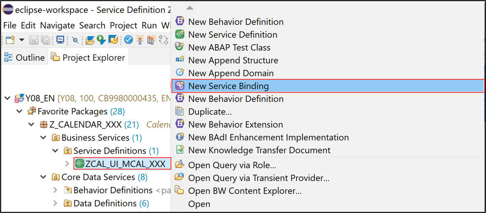

  2. Create a service binding:
     - Name: **`ZCAL_UI_MCAL_O4_XXX`**
     - Description: **`Service binding for holiday calendar`**

     Make sure, that **`ODATA V4 – UI`** is selected as binding type.

      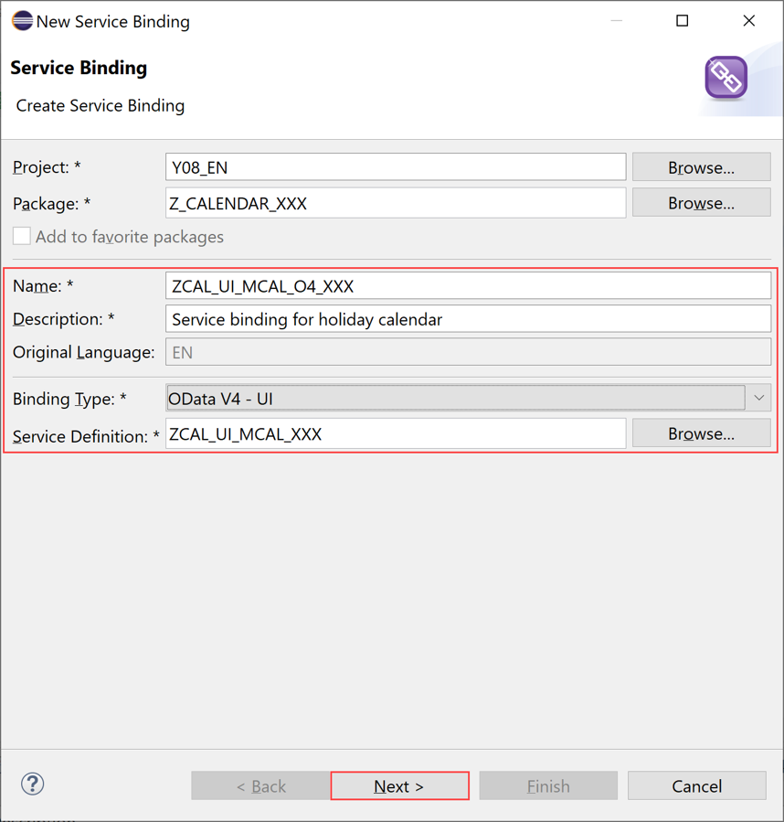

      Click **Next >**.

  3. Click **Finish**.

      

  4. **Activate** your service binding.

  5. Click **Publish**.

      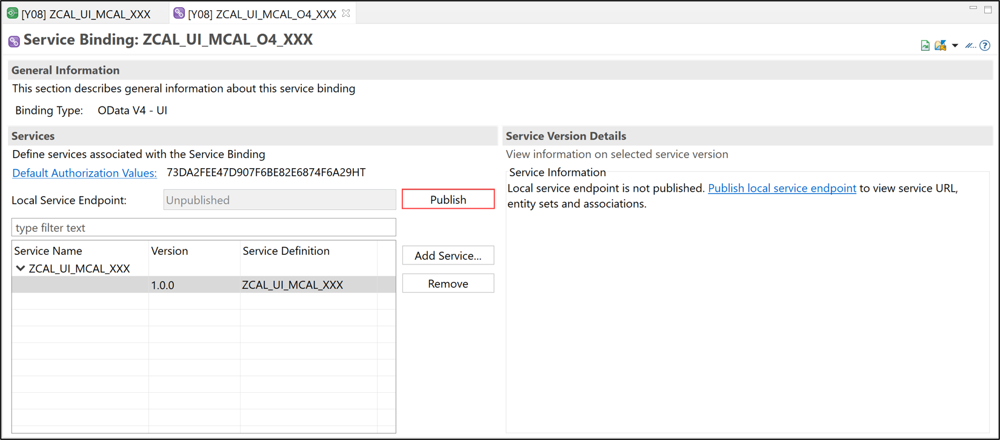

  6. Now you should able to test the application. Therefore, select the root application **`HolidayRoot`** and click **Preview**.

      

  7. Logon to your ABAP system.

      

  8. Click **Go** to see your result.

      

      The application is pretty empty as we first need to configure columns and the creations screen.
      Therefore test data should be created.

[DONE]
[ACCORDION-END]

[ACCORDION-BEGIN [Step 11: ](Add UI annotations)]

>HINT: Typically UI Annotations are maintained in a metadata extension object, however it is also possible to maintain them directly in the projection CDS View.
>More information about defining CDS annotations for metadata-driven UIs can be found [here](https://help.sap.com/viewer/923180ddb98240829d935862025004d6/Cloud/en-US/9b4aa865c1e84634b6e105173fc3a5e7.html).

  1. In the project explorer, right-click on **Core Data Services** and select **New > Other ABAP Repository Object**.

      

  2. Search for **metadata extension**, select it and click **Next >**.

      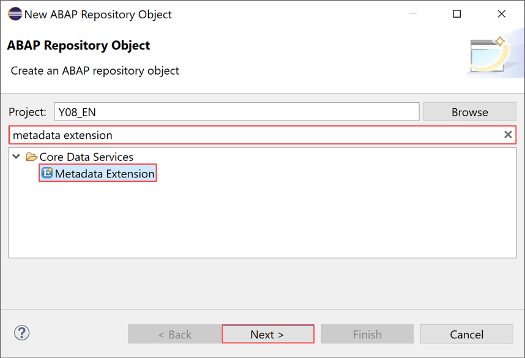

  2. Create a metadata extension:
     - Name: **`ZCAL_C_MCAL_ALL_XXX`**
     - Description: **`Metadata extension for projection singleton`**
     - Extended Entity: **`ZCAL_C_MCAL_ALL_XXX`**

      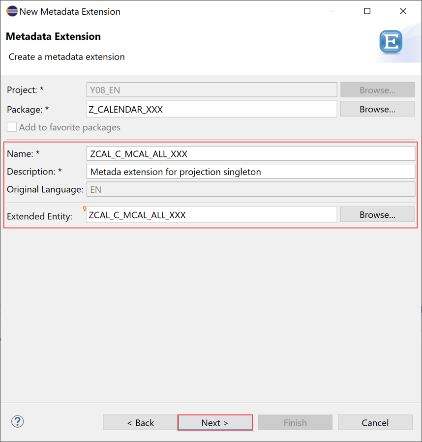

      Click **Next >**.

  3. Click **Finish**.

      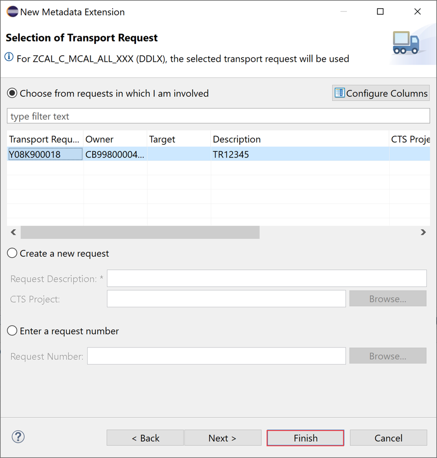

  4. Your code should look like this:

    ```ABAP
    @Metadata.layer: #CORE

    @UI: { headerInfo: { typeName: 'Holiday' } }
    annotate view ZCAL_C_MCAL_ALL_XXX with
    {
      @UI.facet: [
      {
      purpose:  #STANDARD,
      type:     #LINEITEM_REFERENCE,
      label:    'Holidays',
      position: 2,
      targetElement: '_Holiday'
      }
      ]

      @UI.lineItem: [{ position: 1 }]
      HolidayAllID;
    }
    ```

  5. Save and activate.

  6. In the project explorer, right-click on **Metadata Extensions** and select **New Metadata Extension**. As name you can use the extended entity name.

      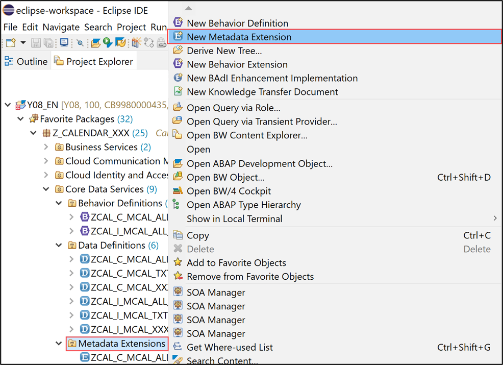

  7. Create a metadata extension:
     - Name: **`ZCAL_C_MCAL_XXX`**
     - Description: **`Metadata extension for projection holiday`**
     - Extended Entity: **`ZCAL_C_MCAL_XXX`**

      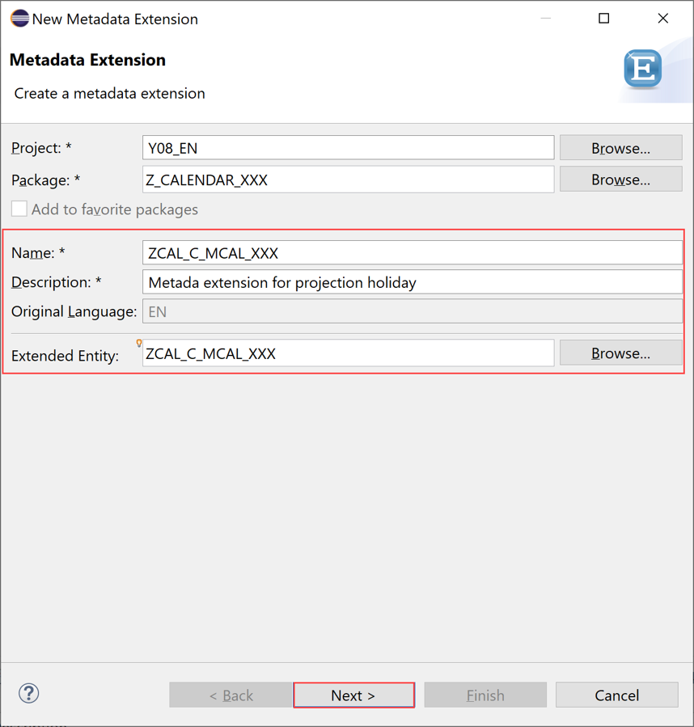

      Click **Next >**.

  8. Click **Finish**.

      

  9. Your code should look like this:

    ```ABAP
    @Metadata.layer: #CORE
    @Search.searchable: true
    @UI: {
      headerInfo: { typeName: 'Public Holiday',
                    typeNamePlural: 'Public Holidays',
                    title: { type: #STANDARD, label: 'Public Holiday', value: 'Holiday' } },
      presentationVariant: [{ sortOrder: [{ by: 'Holiday', direction:  #ASC }] }] }
    annotate view ZCAL_C_MCAL_XXX with
    {
      @UI.facet: [
        {
          id: 'PublicHoliday',
          purpose: #STANDARD,
          label: 'Public Holiday',
          type: #IDENTIFICATION_REFERENCE,
          position: 1
        },
        {
          id: 'Description',
          label: 'Description',
          type: #LINEITEM_REFERENCE,
          position: 2,
          targetElement: '_HolidayTxt'
         }
        ]

      @UI: {  identification: [ { position: 1 } ],
              lineItem:       [ { position: 1 } ] }
      @Search.defaultSearchElement: true
      Holiday;
      @UI: {  identification: [ { position: 3 } ],
              lineItem:       [ { position: 3 } ] }
      HolidayMonth;
      @UI: {  identification: [ { position: 4 } ],
              lineItem:       [ { position: 4 } ] }
      HolidayDay;
      @UI: {  identification: [ { position: 2, hidden: true } ],
              lineItem:       [ { position: 2 } ] }
      HolidayDescription;

    }
    ```

  10. Save and activate.

  11. In the project explorer, right-click on **Metadata Extensions** and select **New Metadata Extension**. As name you can use the extended entity name.

      

  12. Create a metadata extension:
     - Name: **`ZCAL_C_MCAL_TXT_XXX`**
     - Description: **`Metadata extension for projection holiday text`**
     - Extended Entity: **`ZCAL_C_MCAL_TXT_XXX`**

      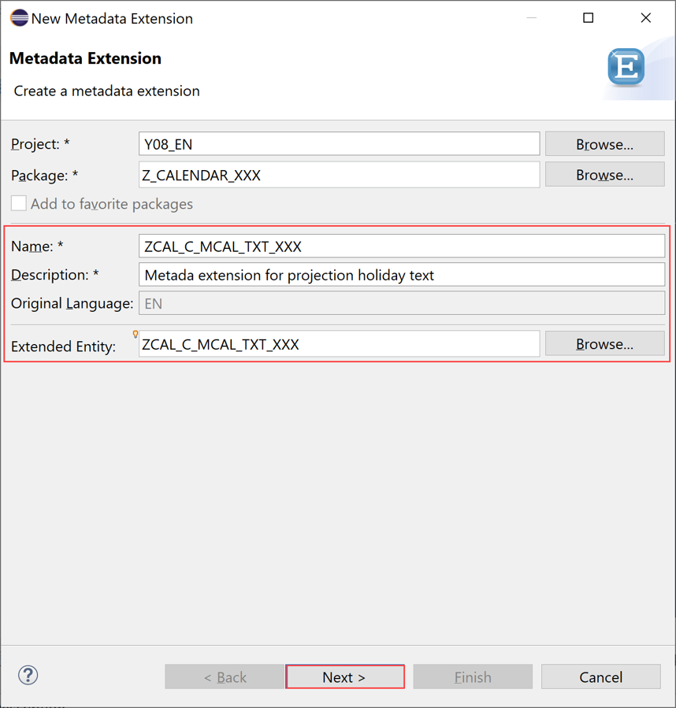

      Click **Next >**.

  13. Click **Finish**.

      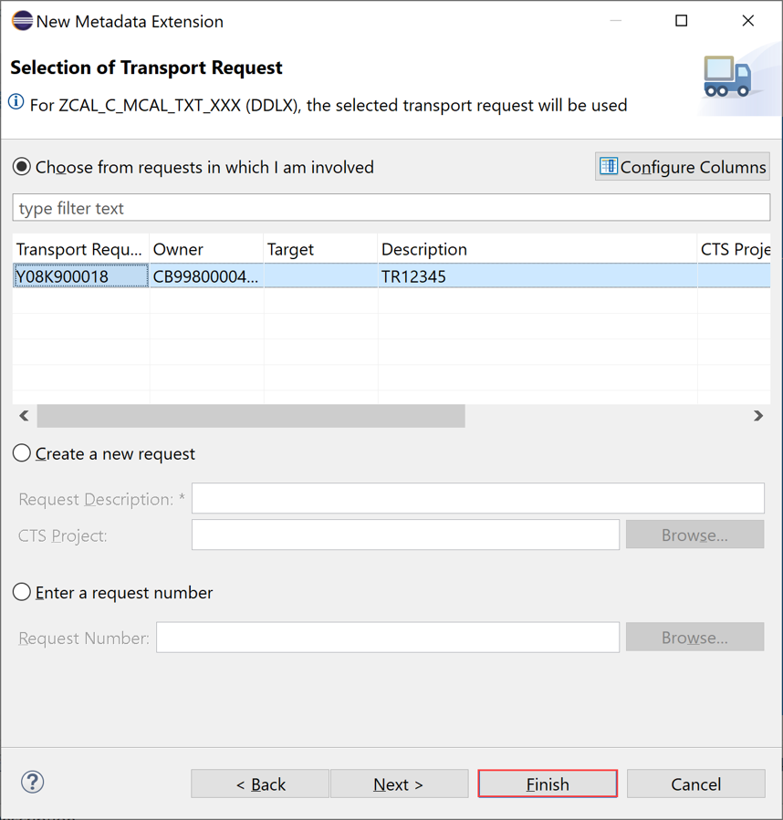

  14. Your code should look like this:

    ```ABAP
    @Metadata.layer: #CORE
    @UI: {
      headerInfo: { typeName: 'Description',
                    typeNamePlural: 'Descriptions',
                    title: { type: #STANDARD, value: 'Language' } } ,
      presentationVariant: [{ sortOrder: [{ by: 'Language', direction:  #ASC }] }] }
    annotate view ZCAL_C_MCAL_TXT_XXX with
    {
      @UI.facet: [
        {
          id: 'HolidayText',
          purpose: #STANDARD,
          type: #IDENTIFICATION_REFERENCE,
          label: 'Description',
          position: 1
        }
      ]

      @UI: { identification: [ { position: 1 } ],
             lineItem:   [ { position: 1 } ] }
      Language;
      @UI.hidden: true
      Holiday;
      @UI: { identification: [ { position: 2 } ],
             lineItem:   [ { position: 2, label: 'Description' } ] }
      HolidayDescription;
    }
    ```

  15. Save and activate.

[DONE]
[ACCORDION-END]

In the next tutorial the business configuration RAP business object is registered with the **[Maintain Business Configuration](https://help.sap.com/viewer/65de2977205c403bbc107264b8eccf4b/Cloud/en-US/76384d8e68e646d6ae5ce8977412cbb4.html)** app to generate a User Interface.

[ACCORDION-BEGIN [Step 12: ](Test yourself)]

[VALIDATE_1]
[ACCORDION-END]
---
