## Prerequisites  
- You need an SAP Cloud Platform ABAP Environment [trial user](abap-environment-trial-onboarding) or a license.

## Details
### You will learn  
- How to create packages
- How to create data elements
- How to create database table
- How to create CDS view
- How to create behavior definition
- How to create service definition
- How to create service binding

---
[ACCORDION-BEGIN [Step 1: ](Create package)]

  1. Open your **ABAP Development Tools**, logon to your **ABAP system** and right-click on **`ZLOCAL`**, select **New** > **ABAP Package**.

      

  2. Search for **package**, select **ABAP Package** and click **Next >**.

      

  3. Create a new package:
     - Name: **`Z_Calendar_XXX`**
     - Description: **`Calendar package XXX`**

      

      Click **Next >**.

  4. Click **Next >**.

      

  5. Click **Finish**.

      

[DONE]
[ACCORDION-END]

[ACCORDION-BEGIN [Step 2: ](Create data element)]

  1. Right-click on **`Z_Calendar_XXX`**, select **New** > **Other ABAP Repository Object**.

      

  2. Search for **data element**, select it and click **Next >**.

      

  3. Create a data element:
     - Name: **`ZCAL_DAY_XXX`**
     - Description: **`Day`**

      

      Click **Next >**.

  4. Click **Finish**.

      

  5. Select `Predefined Type` as category, `INT1` as data type and provide following field labels:

      

  6. Repeat **step 2.1. - 2.5** to create further **data elements**:

    - **`ZCAL_DESCRIPTION_XXX:`**
      Category: `Predefined Type`,
      Data Type: `CHAR`,
      Length: 50

    - **`ZCAL_HOLIDAY_ID_XXX:`**
      Category: `Predefined Type`,
      Data Type: `CHAR`,
      Length: 20,
      Field Labels: Holiday ID (for all)

    - **`ZCAL_ID_XXX:`**
      Category: `Predefined Type`,
      Data Type: `CHAR`,
      Length: 50,
      Field Labels: ID (for all)

    - **`ZCAL_MONTH_XXX:`**
      Category: `Predefined Type`,
      Data Type: `CHAR`,
      Length: 20,
      Field Labels: Month (for all)

    - **`ZCONFIG_DEPRECATION_CODE_XXX:`**
      Category: `Predefined Type`,
      Data Type: `CHAR`,
      Length: 1

      **Create, save and activate** all data elements.

      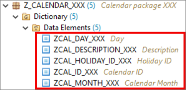

[DONE]
[ACCORDION-END]

[ACCORDION-BEGIN [Step 3: ](Create database table)]

  1. Right-click on **`Z_Calendar_XXX`**, select **New** > **Other ABAP Repository Object**.

      

  2. Search for **database table**, select it and click **Next >**.

      

  3. Create a database table:
     - Name: **`ZCAL_HOLIDAY_XXX`**
     - Description: **`Public Holiday Table`**

      

      Click **Next >**.

  4. Click **Finish**.

      

  5. Replace your code with following:

    ```ABAP
    @EndUserText.label : 'Public Holiday Table'
    @AbapCatalog.enhancementCategory : #NOT_EXTENSIBLE
    @AbapCatalog.tableCategory : #TRANSPARENT
    @AbapCatalog.deliveryClass : #C
    @AbapCatalog.dataMaintenance : #LIMITED
    define table zcal_holiday_xxx {
     key client       : mandt not null;
     key holiday_id   : zcal_holiday_id_xxx not null;
     month_of_holiday : zcal_month_xxx;
     day_of_holiday   : zcal_day_xxx;
     changedat        : timestampl;
     configdeprecationcode : zconfig_deprecation_code_xxx;
    }

    ```

  6. Save and activate.

  7. Repeat step **3.1.- 3.4** and create a **database table**:

     - Name: **`ZCAL_HOLITXT_XXX`**
     - Description: **`Public Holiday Text Table`**

    ```ABAP
    @EndUserText.label : 'Public Holiday Text Table'
    @AbapCatalog.enhancementCategory : #NOT_EXTENSIBLE
    @AbapCatalog.tableCategory : #TRANSPARENT
    @AbapCatalog.deliveryClass : #C
    @AbapCatalog.dataMaintenance : #LIMITED
    define table zcal_holitxt_xxx {
      key client       : mandt not null;
      @AbapCatalog.textLanguage
      key spras        : spras not null;
      @AbapCatalog.foreignKey.screenCheck : false
      key holiday_id   : zcal_holiday_id_xxx not null
        with foreign key [0..*,1] zcal_holiday_xxx
          where client = zcal_holitxt_xxx.client
            and holiday_id = zcal_holitxt_xxx.holiday_id;
      fcal_description : zcal_description_xxx;

    }
    ```
 8. Save and activate.

[DONE]
[ACCORDION-END]

[ACCORDION-BEGIN [Step 4: ](Create CDS view)]

The creation of Core Data Services-View (CDS-View) takes here place. CDS views are the foundation of each business object node.

  1. Right-click on **`Z_Calendar_XXX`**, select **New** > **Other ABAP Repository Object**.

      

  2. Search for **data definition**, select it and click **Next >**.

      

  3. Create a data definition:
     - Name: **`ZCAL_I_HOLIDAY_XXX`**
     - Description: **`CDS View for Public Holidays`**

      

      Click **Next >**.

  4. Click **Finish**.

      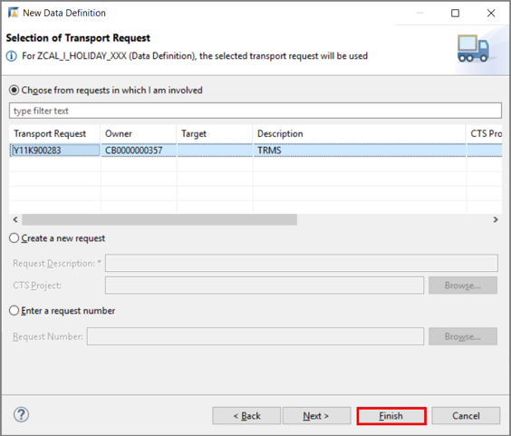

  5. Define SQL-View and database table:

     - SQL-View: **`ZCAL_I_HOLID_XXX`**
     - Database table: **`ZCAL_HOLIDAY_XXX`**

       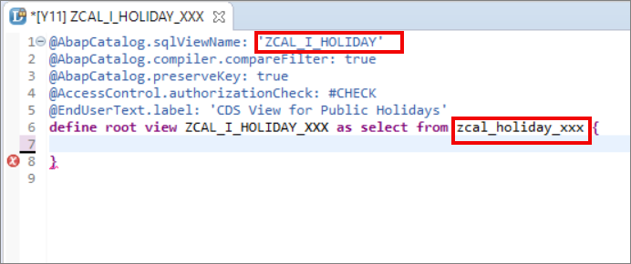

  6. Insert all CDS view elements. Therefore press **CTRL + Space** and select **Insert all elements (template)**.

      

  7. Define your root view by adding the root element.

      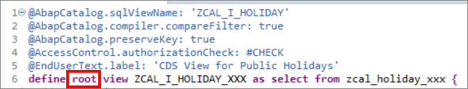

  8. Add annotations for administrative data. The annotation provide the business object semantic information about the purpose of the corresponding fields. By saving the business object the fields will be updated automatically. You can add the following annotations:

      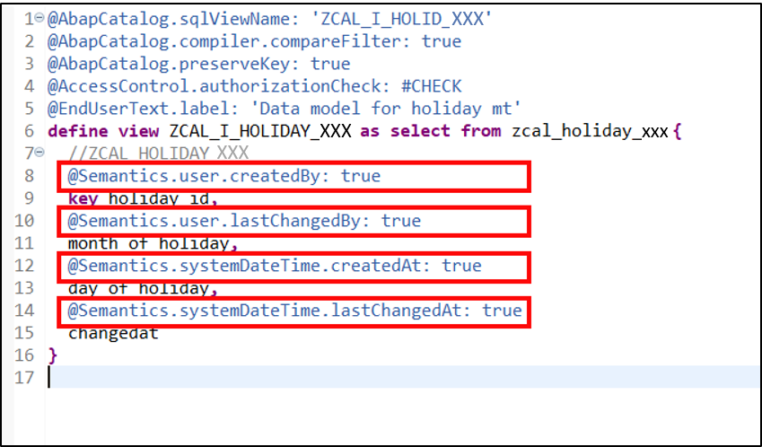


  9. Save and activate.

    Now the CDS view for the database table is created. Up to now the CDS view only repeats the database table field definition and adds some annotations to the table.

[DONE]
[ACCORDION-END]

[ACCORDION-BEGIN [Step 5: ](Create behavior definition)]

Now it is time to create behavior definition. The behavior definition defines the nodes of the business object and its properties. Here you can define which node-actions the business object supports. By default, this will be create, update and delete. Furthermore, lock objects, implementation classes and authorization checks can be defined.

  1. Right-click on your data definition **`ZCAL_I_HOLIDAY_XXX`**, select **New Behavior Definition**.

      

  2. Make sure, that your implementation type is managed and click **Next >**.

      

  3. Click **Finish**.

      

  4. Add your alias, for example **`HolidayRoot`** to your behavior definition and uncomment lock master in line 5.

      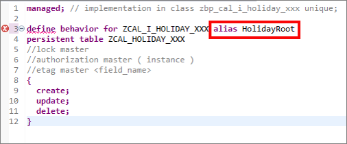

      This defines the root node as main locking object to avoid multiple persons editing the same object.
      Sub nodes have to be defined as lock dependent later on.

  5. Save and activate.

     In line 1 you see that you defined a managed business object.
     If required, you can extend the business object by an optional implementation class.
     As of now we haven't defined any authorization check and **`etag`** yet.

[DONE]
[ACCORDION-END]

[ACCORDION-BEGIN [Step 6: ](Create service definition)]

Service definitions expose a set of business objects and their entities to a service-URL.

  1. Right-click on your package **`Z_Calendar_XXX`** and select **New**> **Other ABAP Repository Object**.

      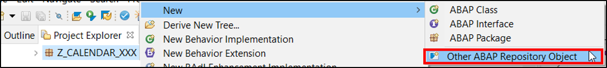

  2. Search for **Service Definition** and select it.


  3. Create a service definition:
     - Name: **`ZCAL_I_HOLIDAY_SD_XXX`**
     - Description: **`Service definition for holiday calendar`**

      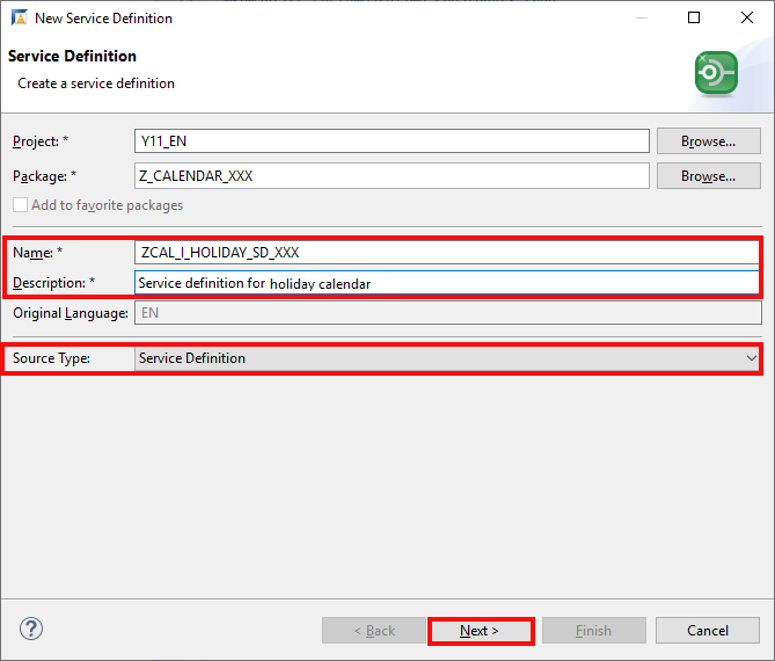

      Make sure, that your **source type** is **service definition** and click **Next >**.

  4. Click **Next >**.

      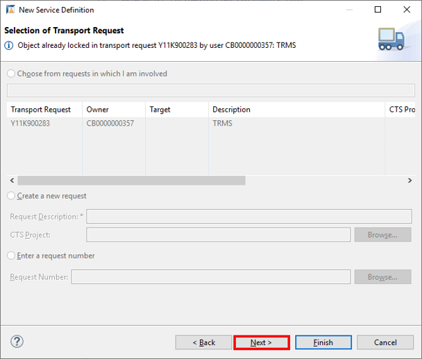

  5. Select the default service definition template and click **Finish**.

      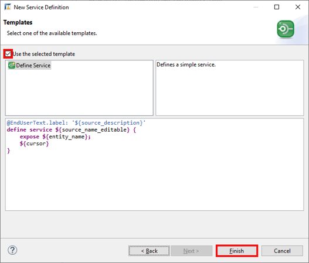

  6. Expose the CDS view in the service definition. Therefore, add **`HolidayRoot`** as alias to the service definition.

      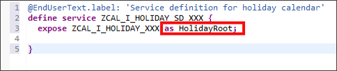

  7. Save and activate.

  8. Now the service definition is done, and the business object is almost ready for use.

      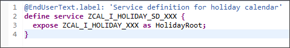


[DONE]
[ACCORDION-END]

[ACCORDION-BEGIN [Step 7: ](Create service binding)]

Service bindings expose service definitions to the Web browser.

  1. Right-click on your service definition **`ZCAL_I_HOLIDAY_SD_XXX`** and select **New Service Binding**.

      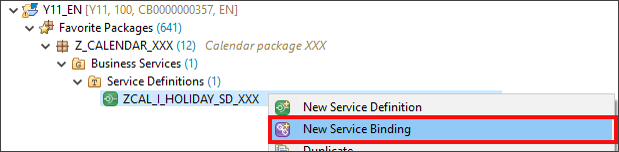

  2. Create a service binding:
     - Name: **`ZCAL_HOLIDAY_SB_XXX`**
     - Description: **`Service binding for holiday calendar`**

     Make sure, that **`ODATA V2 – UI`** is selected as binding type.

      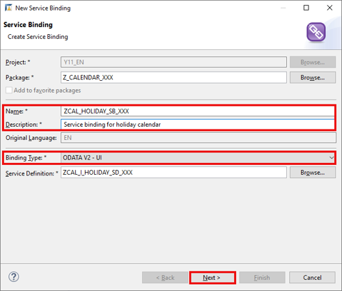

      Click **Next >**.

  3. Click **Finish**.

      

  4. Activate your service binding.

      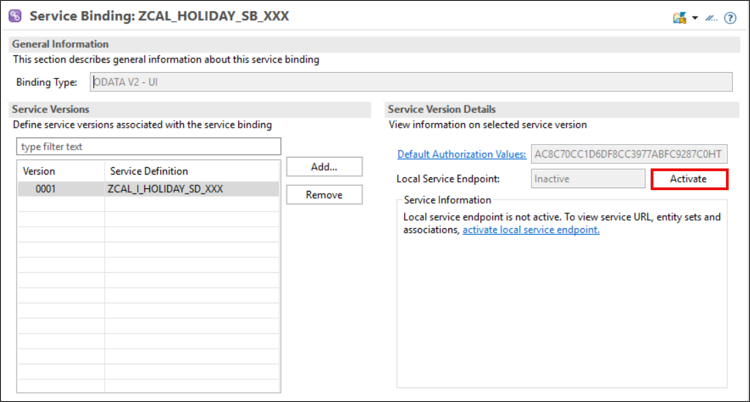

  5. Now you should able to test the application. Therefore, select the root application **`HolidayRoot`** and click **Preview**.

      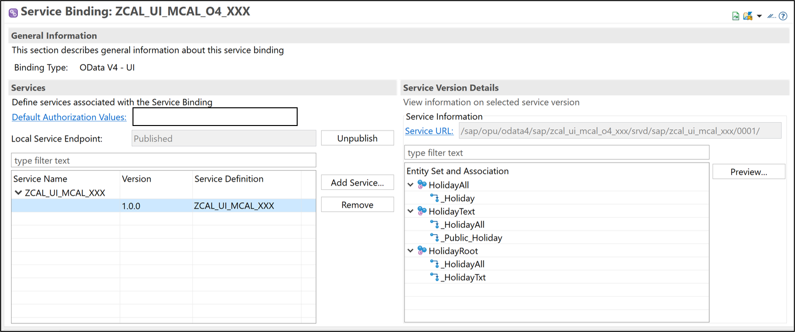

  6. Logon to your ABAP system to see your UI.

      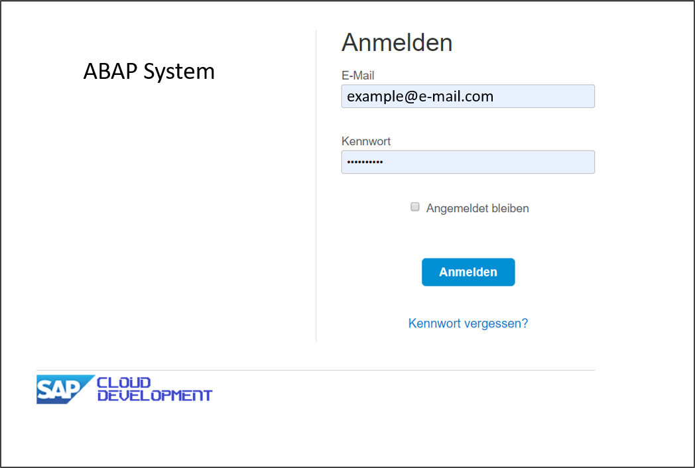

  7. Click **Go** to see your result.

      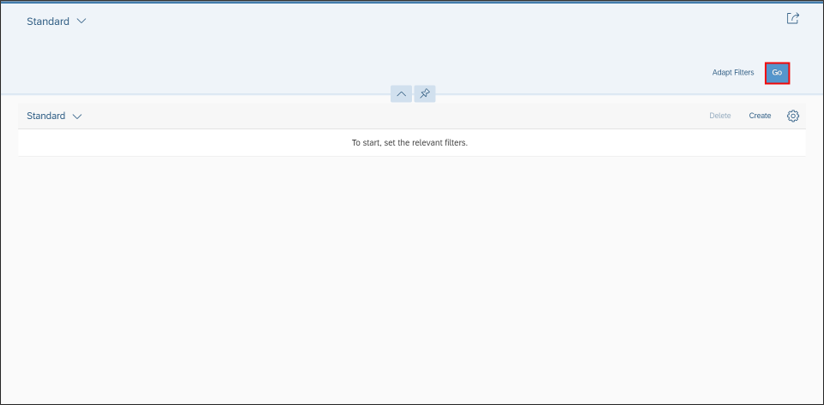

      The application is pretty empty as we first need to configure columns and the creations screen.
      Therefore test data should be created.

[DONE]
[ACCORDION-END]

[ACCORDION-BEGIN [Step 8: ](Test yourself)]

[VALIDATE_1]
[ACCORDION-END]
---
