## Prerequisites  
- You need an SAP BTP, ABAP environment [trial user](abap-environment-trial-onboarding) or a license.
- Install ABAP Development Tools or Eclipse
- Inform yourself about the [Virtual Data Model (VDM) guidelines](https://help.sap.com/viewer/8308e6d301d54584a33cd04a9861bc52/1909.000/en-US/8573b810511948c8a99c0672abc159aa.html)
- Inform yourself about the [naming conventions for Development Objects](https://help.sap.com/viewer/923180ddb98240829d935862025004d6/Cloud/en-US/8b8f9d8f3cb948b2841d6045a255e503.html)

## Details
### You will learn  
- How to create packages
- How to create data element and domain
- How to create database table
- How to create enable log changes
- How to create CDS view
- How to create behavior definition
- How to create CDS view projection
- How to create behavior definition projection
- How to create service definition
- How to create service binding

---
[ACCORDION-BEGIN [Step 1: ](Create package)]

  1. Open your **ABAP Development Tools**, logon to your **ABAP system** and right-click on **`ZLOCAL`**, select **New** > **ABAP Package**.

      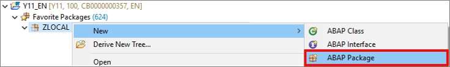

  2. Create a new package:
     - Name: **`Z_Calendar_XXX`**
     - Description: **`Calendar package XXX`**

      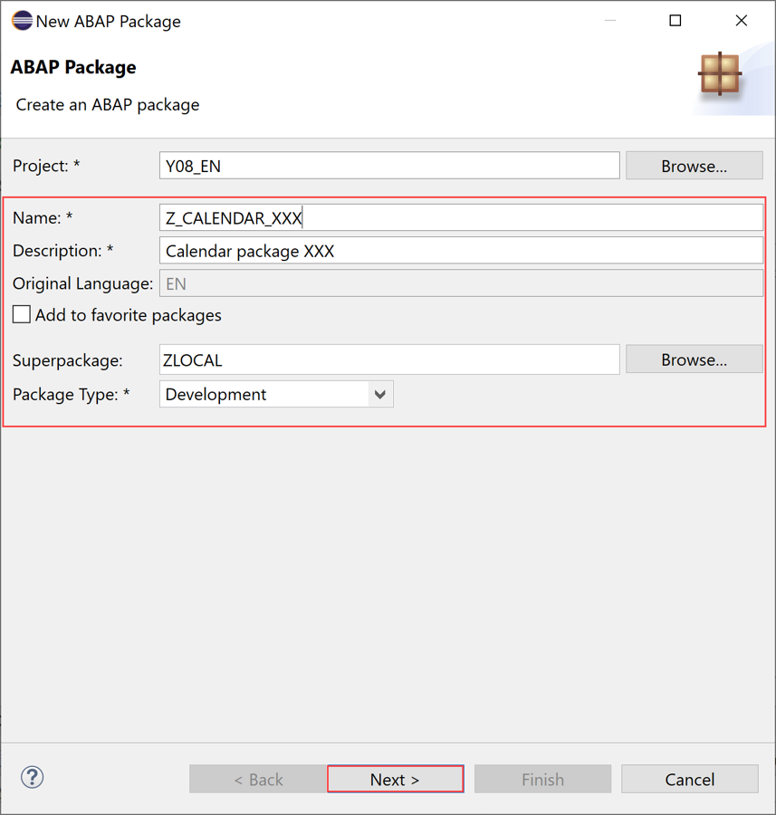

      Click **Next >**.

  3. Click **Next >**.

      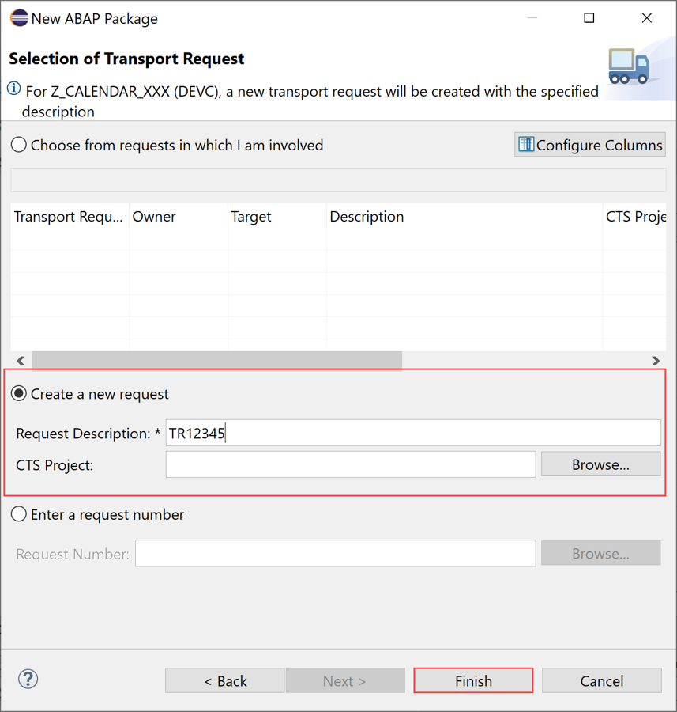

  4. Click **Finish**.

      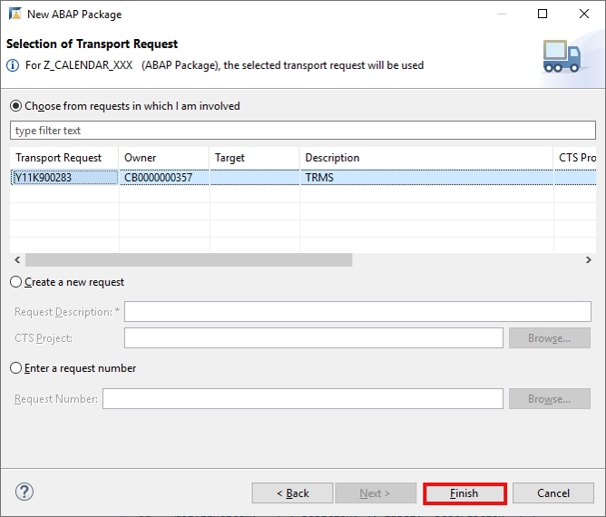

[DONE]
[ACCORDION-END]

[ACCORDION-BEGIN [Step 2: ](Create data element and domain)]

  1. Right-click on **`Z_Calendar_XXX`**, select **New** > **Other ABAP Repository Object**.

      

  2. Search for **data element**, select it and click **Next >**.

      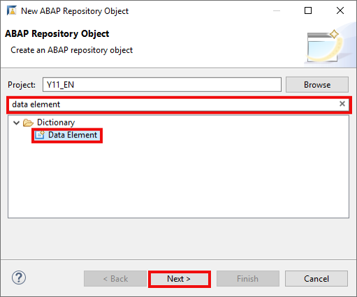

  3. Create a data element:
     - Name: **`ZCAL_DAY_XXX`**
     - Description: **`Day`**

      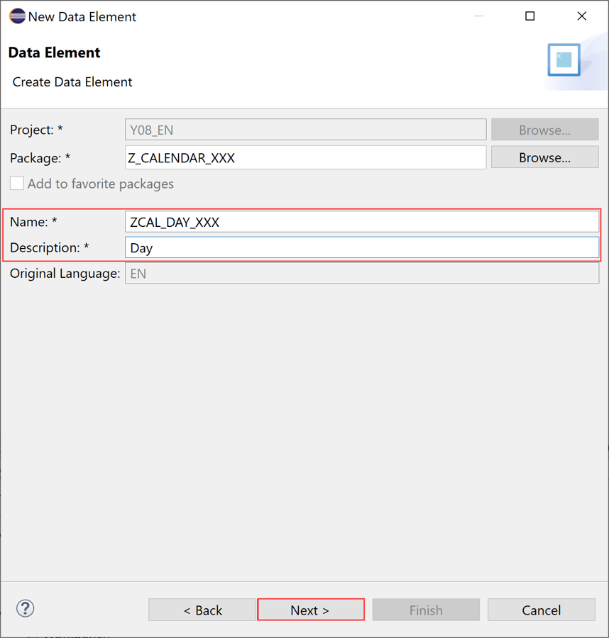

      Click **Next >**.

  4. Click **Finish**.

      

  5. Select `Predefined Type` as category, `NUMC` as data type, 2 as length and provide following field labels:

      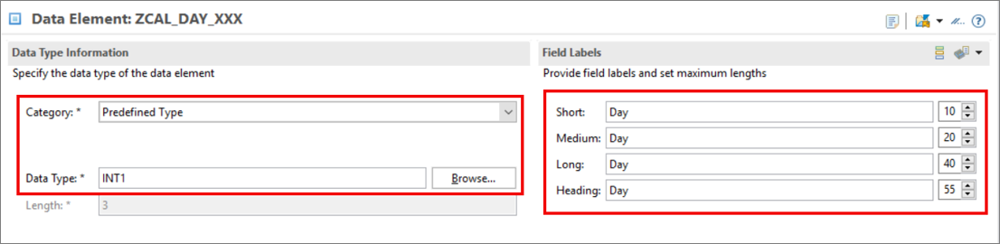

  6. Save and activate data element **`ZCAL_DAY_XXX`**.

  7. Create a new data element, therefore repeat **step 2.1. - 2.5**. Instead of using `Predefined Type` as category, use `Domain` instead.

    Create a new data element: **`ZCAL_HOLIDAY_ID_XXX:`**:

      -  Category: `Domain`
      -  Data Type: `ZCAL_HOLIDAY_ID_XXX`

      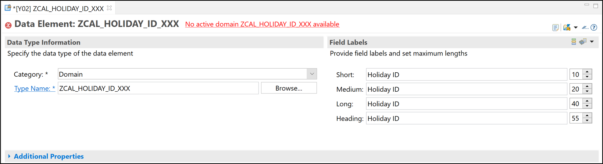

      Now a new domain needs to be created. Don't save and activate yet.

  8. Right-click on **Data Elements**, select **New** > **Domain**.

      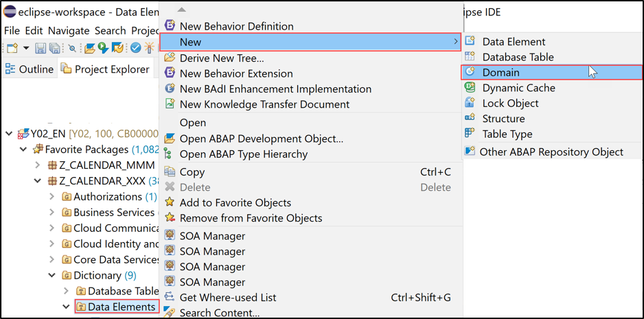

  9. Create a new domain:
     - Name: **`ZCAL_HOLIDAY_ID_XXX`**
     - Description: Domain holiday

       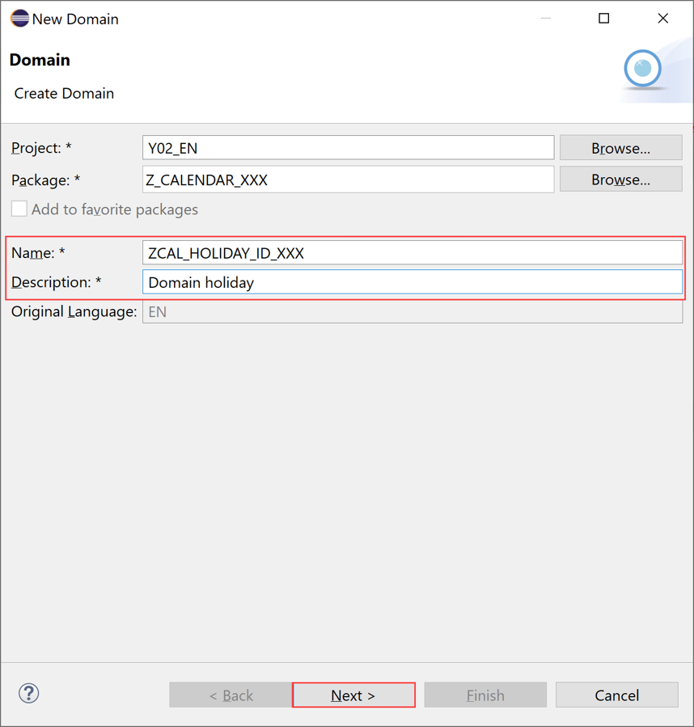

      Click **Next >**.

 10. Click **Finish**.

       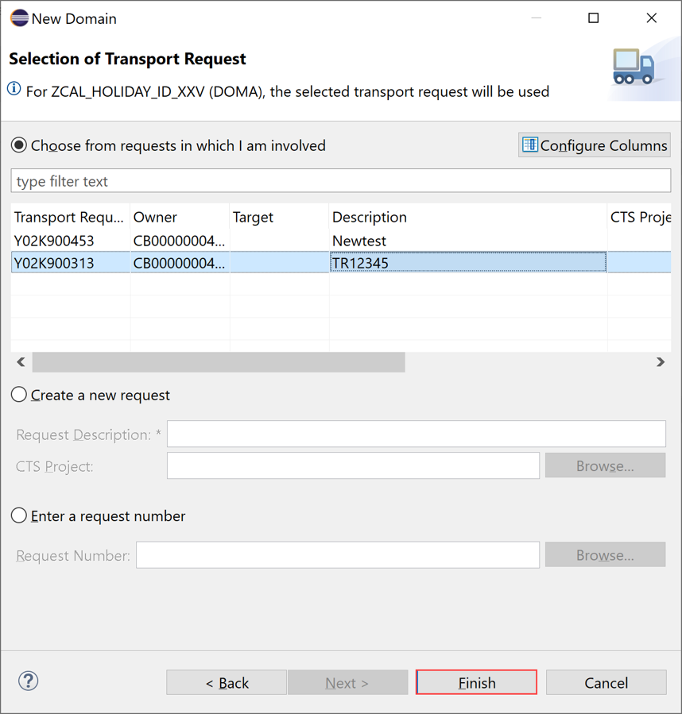

 11. Add your data type and length:
    - Data type: `CHAR`
    - Length: 30

       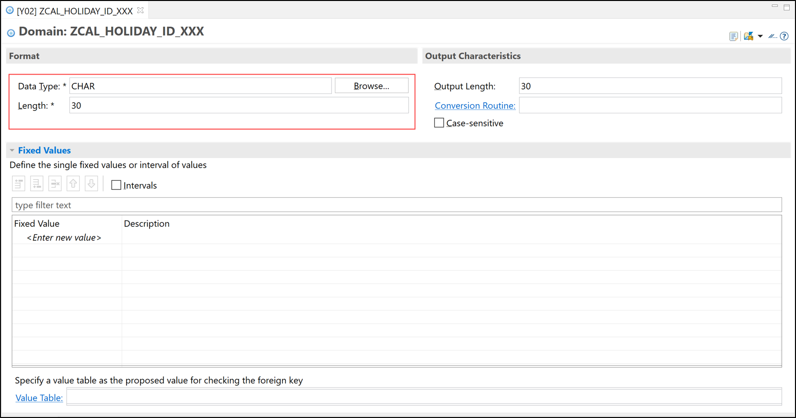

 12. Save and activate your domain **`ZCAL_HOLIDAY_ID_XXX`** and data element **`ZCAL_HOLIDAY_ID_XXX`**.

 13. Repeat **step 2.1. - 2.5** to create further **data elements**:

    - **`ZCAL_MONTH_XXX:`**
      Category: `Predefined Type`,
      Data Type: `NUMC`,
      Length: 2,
      Field Labels: Month (for all)

    - **`ZCAL_DESCRIPTION_XXX:`**
      Category: `Predefined Type`,
      Data Type: `CHAR`,
      Length: 100

      **Create, save and activate** all data elements.

[DONE]
[ACCORDION-END]

[ACCORDION-BEGIN [Step 3: ](Create database table)]

  1. Right-click on **`Z_Calendar_XXX`**, select **New** > **Other ABAP Repository Object**.

      

  2. Search for **database table**, select it and click **Next >**.

      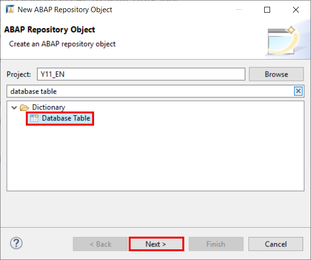

  3. Create a database table:
     - Name: **`ZCAL_HOLIDAY_XXX`**
     - Description: **`Public Holiday Table`**

      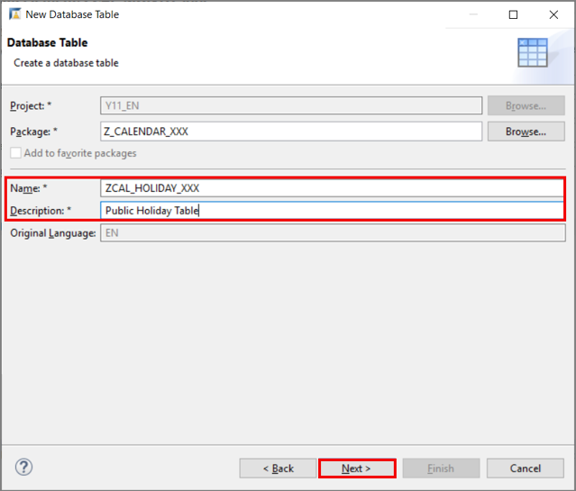

      Click **Next >**.

  4. Click **Finish**.

      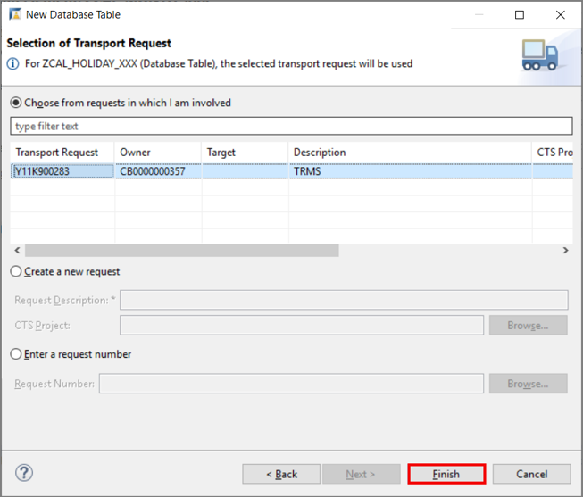

  5. Replace your code with following:

    ```ABAP    
    @EndUserText.label : 'Public Holiday Table'
    @AbapCatalog.enhancement.category : #NOT_EXTENSIBLE
    @AbapCatalog.tableCategory : #TRANSPARENT
    @AbapCatalog.deliveryClass : #C
    @AbapCatalog.dataMaintenance : #RESTRICTED
    define table zcal_holiday_xxx {
      key client            : mandt not null;
      key holiday_id        : zcal_holiday_id_xxx not null;
      month_of_holiday      : zcal_month_xxx;
      day_of_holiday        : zcal_day_xxx;
      last_changed_at       : timestampl;
      local_last_changed_at : timestampl;
    }
    ```

  6. Save and activate.

  7. Repeat step **3.1.- 3.4** and create a **database table**:

     - Name: **`ZCAL_HOLITXT_XXX`**
     - Description: **`Public Holiday Text Table`**

    ```ABAP
    @EndUserText.label : 'Public Holiday Text Table'
    @AbapCatalog.enhancementCategory : #NOT_EXTENSIBLE
    @AbapCatalog.tableCategory : #TRANSPARENT
    @AbapCatalog.deliveryClass : #C
    @AbapCatalog.dataMaintenance : #RESTRICTED
    define table zcal_holitxt_xxx {
      key client       : mandt not null;
      @AbapCatalog.textLanguage
      key spras        : spras not null;
      @AbapCatalog.foreignKey.screenCheck : false
      key holiday_id   : zcal_holiday_id_xxx not null
        with foreign key [0..*,1] zcal_holiday_xxx
          where client = zcal_holitxt_xxx.client
            and holiday_id = zcal_holitxt_xxx.holiday_id;
      fcal_description : zcal_description_xxx;

    }
    ```

  8. Save and activate.

[DONE]
[ACCORDION-END]

[ACCORDION-BEGIN [Step 4: ](Enable log changes)]
To use the [**Business Configuration Change Logs**](https://help.sap.com/viewer/DRAFT/60f1b283f0fd4d0aa7b3f8cea4d73d1d/Internal/en-US/5c6cf20499894f1083e80dba7c5963d4.html) app, activate the log changes function to keep track of configuration changes in your business configuration tables.

Select database table **`ZCAL_HOLIDAY_XXX`**, navigate to the technical table settings and open **`ZCAL_I_HOLIDAY_XXX`**. Enable log changes.
 
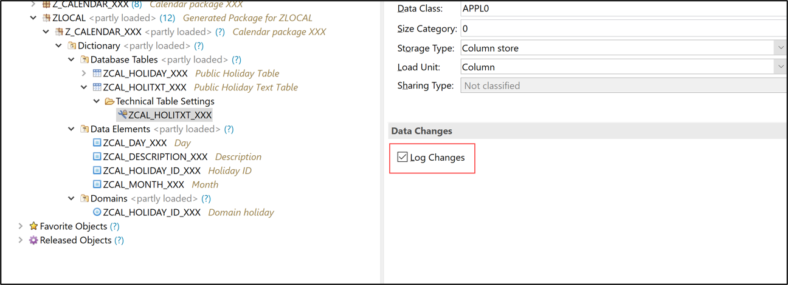

Save and activate.

[DONE]
[ACCORDION-END]


[ACCORDION-BEGIN [Step 5: ](Create CDS view)]

You want to [**create a RAP Managed Business Object**](https://help.sap.com/viewer/923180ddb98240829d935862025004d6/Cloud/en-US/b5bba99612cf4637a8b72a3fc82c22d9.html) for configuration of Public Holidays. Therefore, you have already created all database tables as shown in the step 3.

>**HINT:**  For the Data Definition wizard to use aliases, check the following settings in your ADT configuration.

>Navigate to **Window** > **Preferences**.

>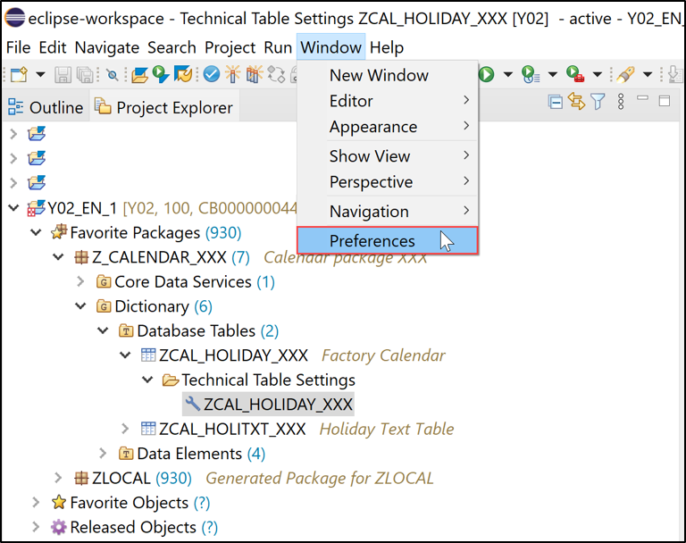

>Search code completion and select it for ABAP Development. Check the aliases box and apply your changes.

>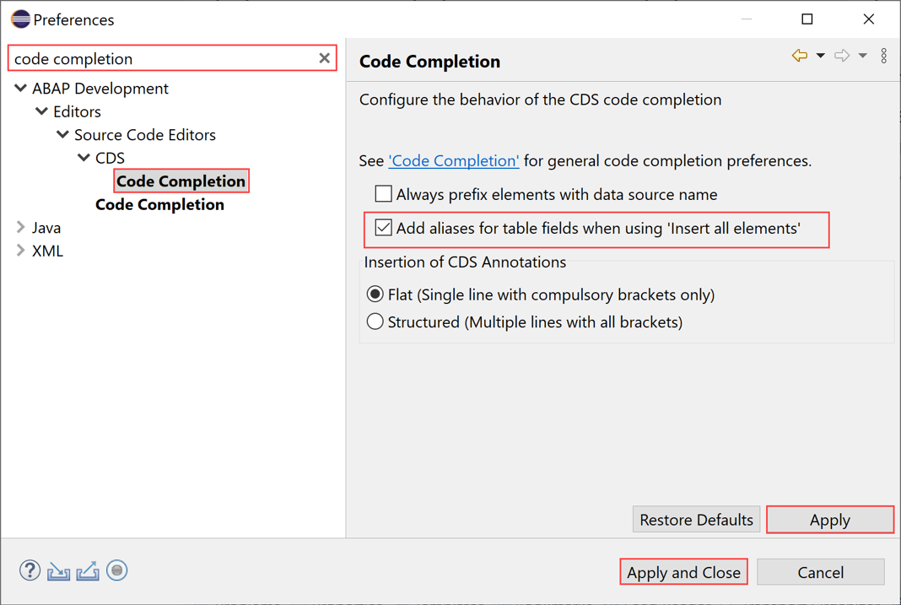

 ---

The creation of Core Data Services-View (CDS-View) takes place [here](https://help.sap.com/viewer/923180ddb98240829d935862025004d6/Cloud/en-US/3070e4fa2dba45efb600d5ca6c845b9f.html). CDS views are the foundation of each business object node.

>Hint: The data model must consist only of client dependent tables.

  1. Right-click on **`Z_Calendar_XXX`**, select **New** > **Other ABAP Repository Object**.

      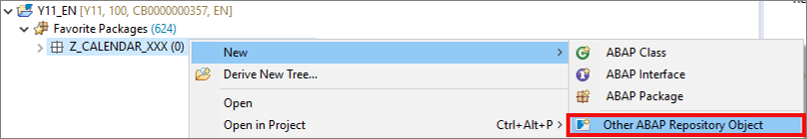

  2. Search for **data definition**, select it and click **Next >**.

      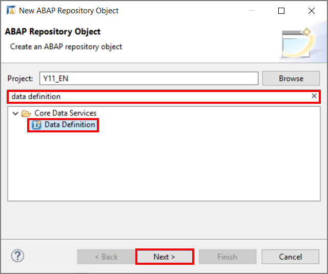

  3. Create a data definition:
     - Name: **`ZCAL_I_HOLIDAY_XXX`**
     - Description: **`CDS View for Public Holidays`**

      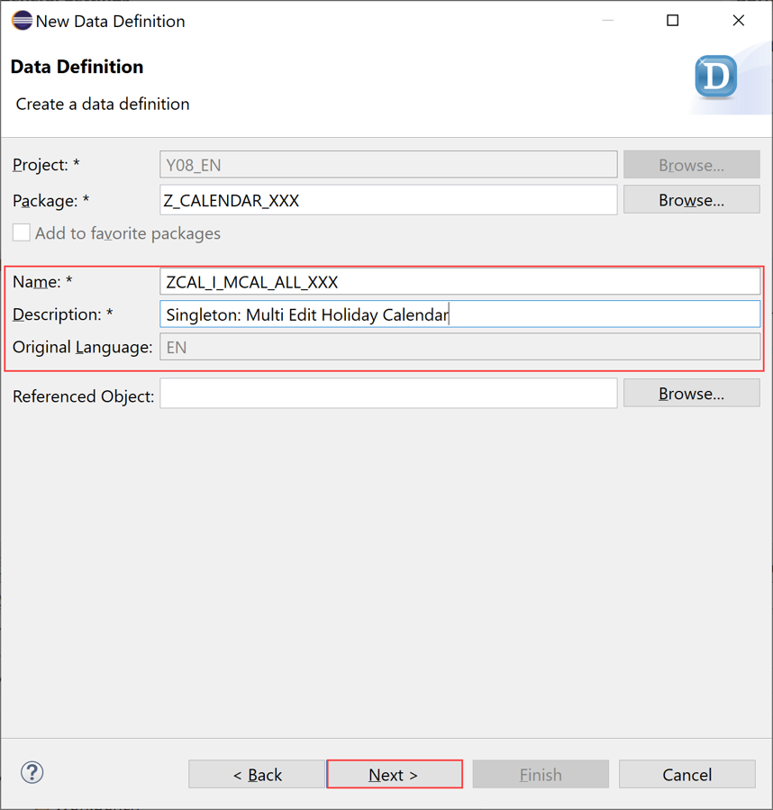

      Click **Next >**.

      Hint: Follow the [naming conventions](https://help.sap.com/viewer/923180ddb98240829d935862025004d6/Cloud/en-US/8b8f9d8f3cb948b2841d6045a255e503.html). For the interface view the prefix `I_` is used.


  4. Select **Define Root View Entity** as a template and click **Finish**.

      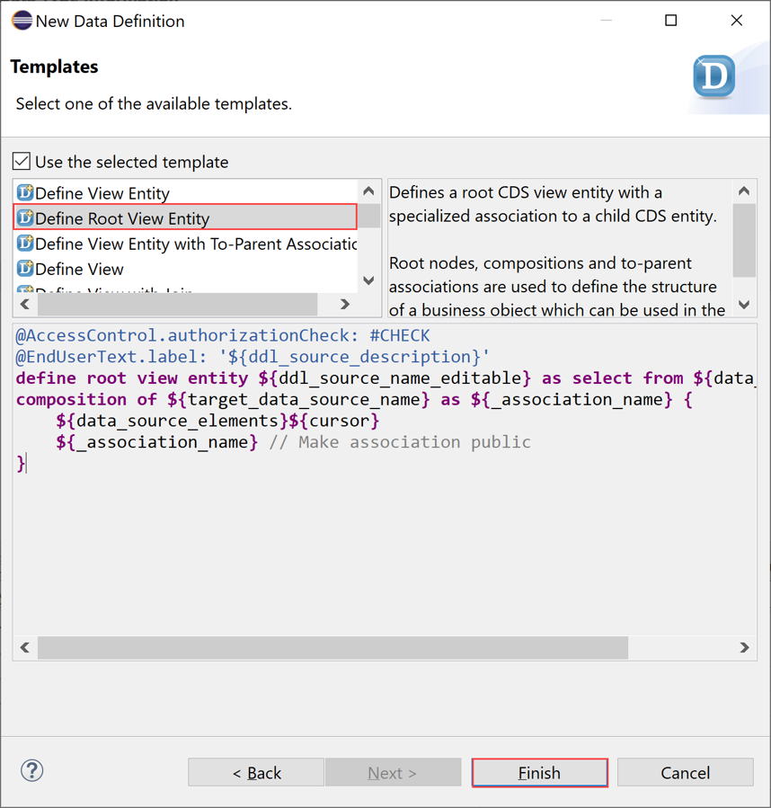

  5. Edit the data source name to **`ZCAL_HOLIDAY_XXX`** and insert all CDS view elements. Therefore press **CTRL + Space** and select **Insert all elements (template)**.

      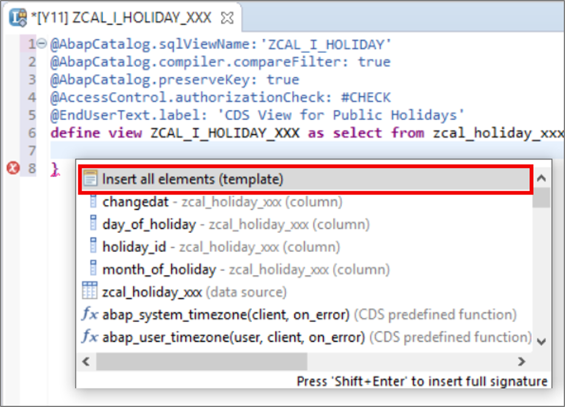

  6. Add the annotation `"@Semantics.systemDateTime.lastChangedAt: true" to field "last_changed_at" and annotation "@Semantics.systemDateTime.localInstanceLastChangedAt: true" to field "local_last_changed_at"`. Both fields will be used for optimistic concurrency locking.

  7. Your code should look like this:

    ```ABAP
    @AccessControl.authorizationCheck: #CHECK
    @EndUserText.label: 'CDS View for Public Holidays'
    define root view entity ZCAL_I_HOLIDAY_XXX
      as select from zcal_holiday_xxx
    {
      key holiday_id       as HolidayId,
          @Semantics.calendar.month: true
          month_of_holiday as MonthOfHoliday,
          @Semantics.calendar.dayOfMonth: true
          day_of_holiday   as DayOfHoliday,
          @Semantics.systemDateTime.lastChangedAt: true
          last_changed_at,
          @Semantics.systemDateTime.localInstanceLastChangedAt: true
          local_last_changed_at
    }
    ```

  8. Save and activate.

    Now we created a CDS view for the database table. Up to now the CDS view only exposes the database table fields and adds some annotations to the table. Later in this tutorial we will extend the CDS view to define the relationships between the database tables.


[DONE]
[ACCORDION-END]

[ACCORDION-BEGIN [Step 6: ](Create behavior definition)]

Now it is time to create behavior definition. The behavior definition defines the nodes of the business object and its properties. Here you can define which node-actions the business object supports. By default, this will be create, update and delete. Furthermore, lock objects, implementation classes and authorization checks can be defined.

>**HINT:** In order to use the Business Object in the [Maintain Business Configuration app](https://help.sap.com/viewer/DRAFT/60f1b283f0fd4d0aa7b3f8cea4d73d1d/Internal/en-US/76384d8e68e646d6ae5ce8977412cbb4.html), the exposed service must be of type **OData V4**. One requirement is that the Business Object must be draft enabled. [Draft business objects](https://help.sap.com/viewer/923180ddb98240829d935862025004d6/Cloud/en-US/a81081f76c904b878443bcdaf7a4eb10.html) requires a total `ETag` field to ensure optimistic concurrency comparison.

>Part of the Business Logic is to [implement validations](https://help.sap.com/viewer/923180ddb98240829d935862025004d6/Cloud/en-US/abfbcd933c264fe4a4883d80d1e951d8.html) to check the values provided by the client. In this example, validations could be defined for fields `MonthOfHoliday` and `DayOfHoliday` to verify the validity of the date.

  1. Right-click on your data definition **`ZCAL_I_HOLIDAY_XXX`**, select **New Behavior Definition**.

      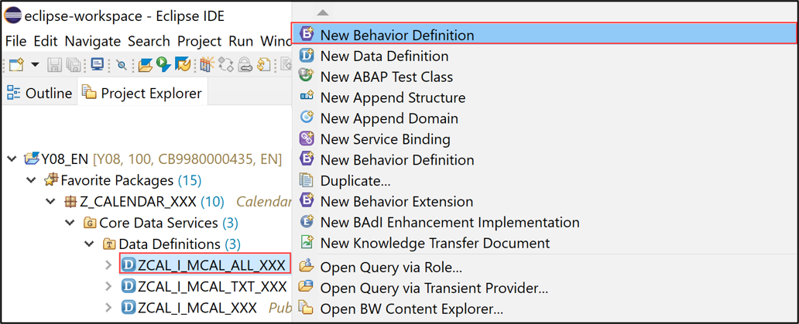

  2. Make sure, that your implementation type is managed and click **Next >**.

      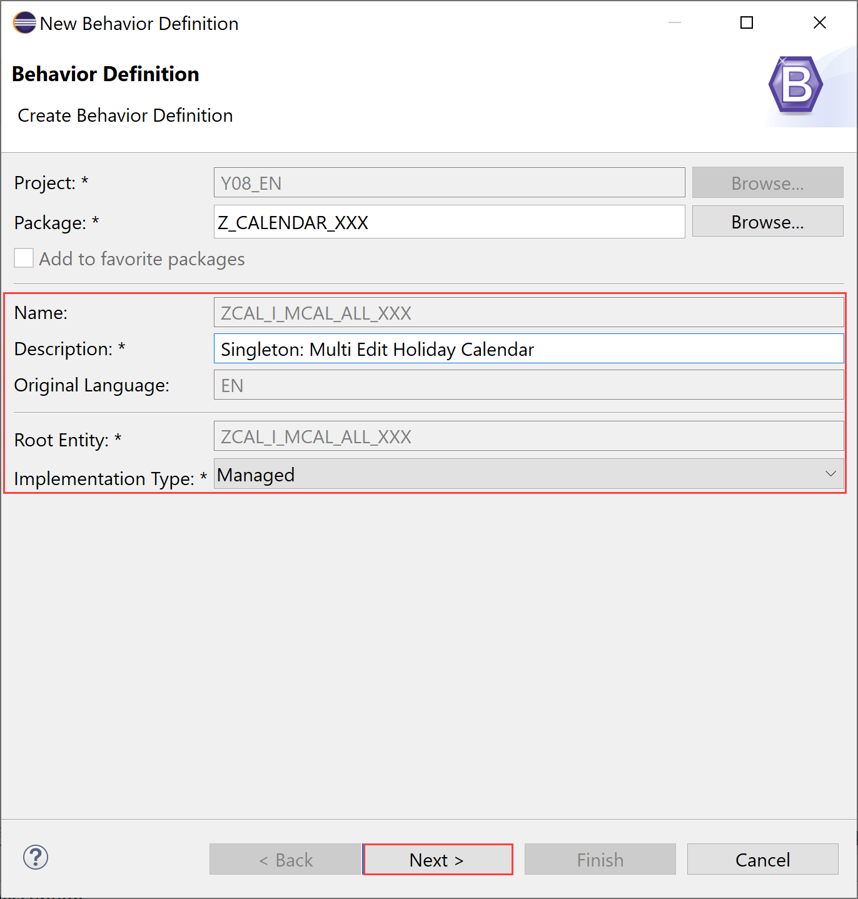

  3. Click **Finish**.

      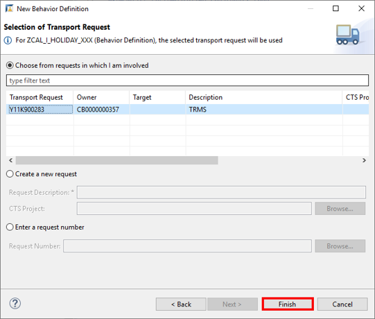

  4. Uncomment the addition `implementation in class zbp_cal_i_holiday_xxx unique;` and add `with draft;` after the `managed;` statement.

    ```ABAP
    managed implementation in class zbp_cal_i_holiday_xxx unique;
    with draft;
    ```

  5. Uncomment the alias in line 4 and choose as alias name `HolidayRoot`.

    ```ABAP
    define behavior for ZCAL_I_HOLIDAY_XXX alias HolidayRoot
    ```

  6. Define the root entity as [Lock master](https://help.sap.com/viewer/923180ddb98240829d935862025004d6/Cloud/en-US/99d8162b8d7d4a83ae65320d2a03b8ab.html) and field `last_changed_at` as total `ETag`. This defines the root node as the main locking object to avoid multiple persons editing the same object. Sub nodes will be defined as lock dependent.

    ```ABAP
    lock master total etag last_changed_at
    ```

    This defines the root node as main locking object to avoid multiple persons editing the same object.
    Sub nodes have to be defined as lock dependent later on.

  7. Add draft table `zcal_d_holi_xxx`

    ```ABAP
    managed implementation in class zbp_cal_i_holiday_xxx unique;
    with draft;

    define behavior for ZCAL_I_HOLIDAY_XXX alias HolidayRoot
    lock master total etag last_changed_at
    persistent table zcal_holiday_xxx
    draft table zcal_d_holi_xxx
    ```
  8. Place the cursor on `zcal_d_holi_xxx` and use the quick assist **CTRL+1** to create the draft table.

    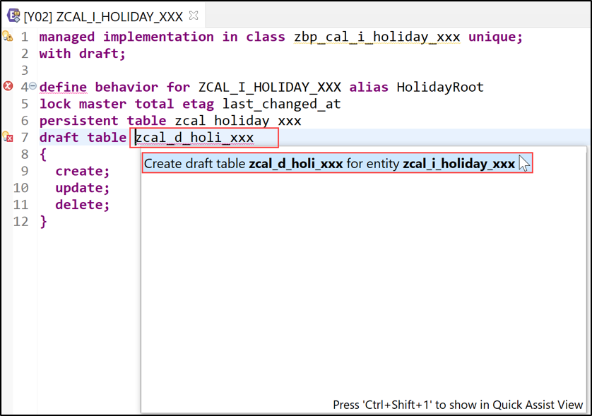

  9. Create a new database table:
     - Name: `ZCAL_D_HOLI_XXX`
     - Description: Draft table for entity `ZCAL_I_HOLIDAY_XXX`

    Click **Next >**.

      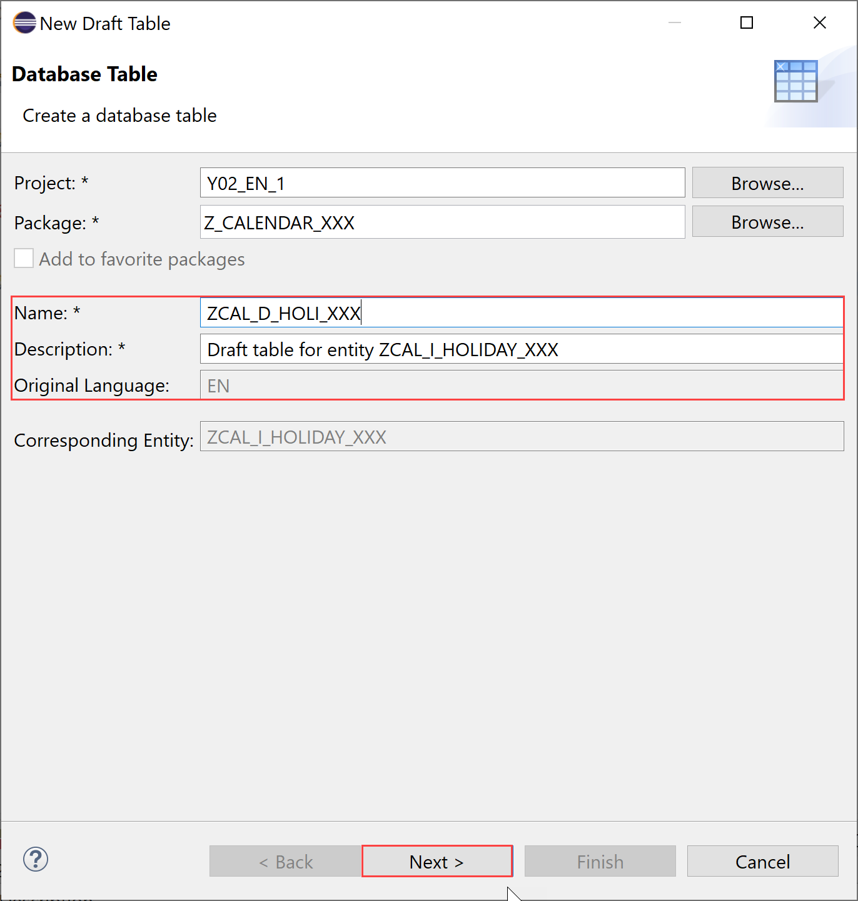

  10. Click **Finish**.

      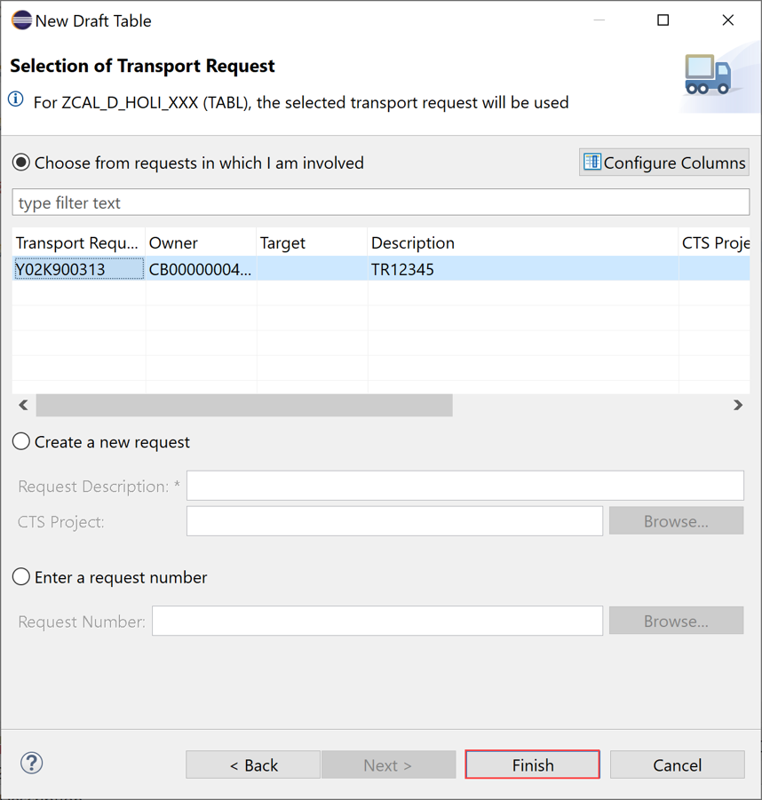

  11. Save and activate your draft table.

  12. In your behavior definition `ZCAL_I_HOLIDAY_XXX` add mapping for the table fields and the CDS view fields. Set field `HolidayId` to read only in case of updates.

    ```ABAP
    managed implementation in class zbp_cal_i_holiday_xxx unique;
    with draft;

    define behavior for ZCAL_I_HOLIDAY_xxx alias HolidayRoot
    lock master total etag last_changed_at
    persistent table zcal_holiday_xxx
    draft table zcal_d_holi_xxx
    {
      create;
      update;
      delete;

      field ( readonly : update ) HolidayId;

      mapping for zcal_holiday_xxx corresponding
      {
        HolidayId = holiday_id;
        MonthOfHoliday = month_of_holiday;
        DayOfHoliday = day_of_holiday;
      }
    }
    ```

  13. Save and activate.

  14. Place the cursor on `zbp_cal_i_holiday_xxx` and use the quick assist to create the behavior implementation class.

    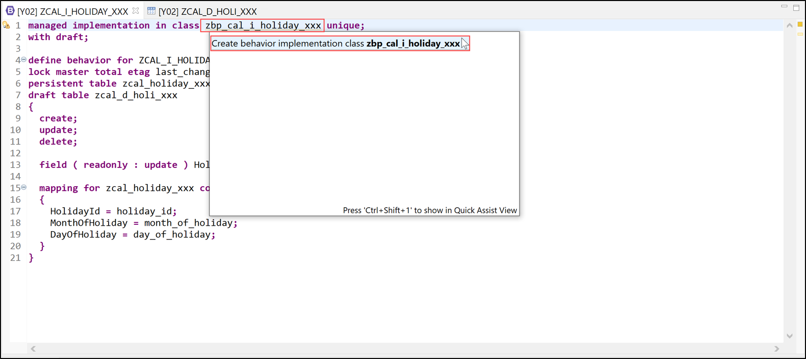

  15. Click **Next >**.

    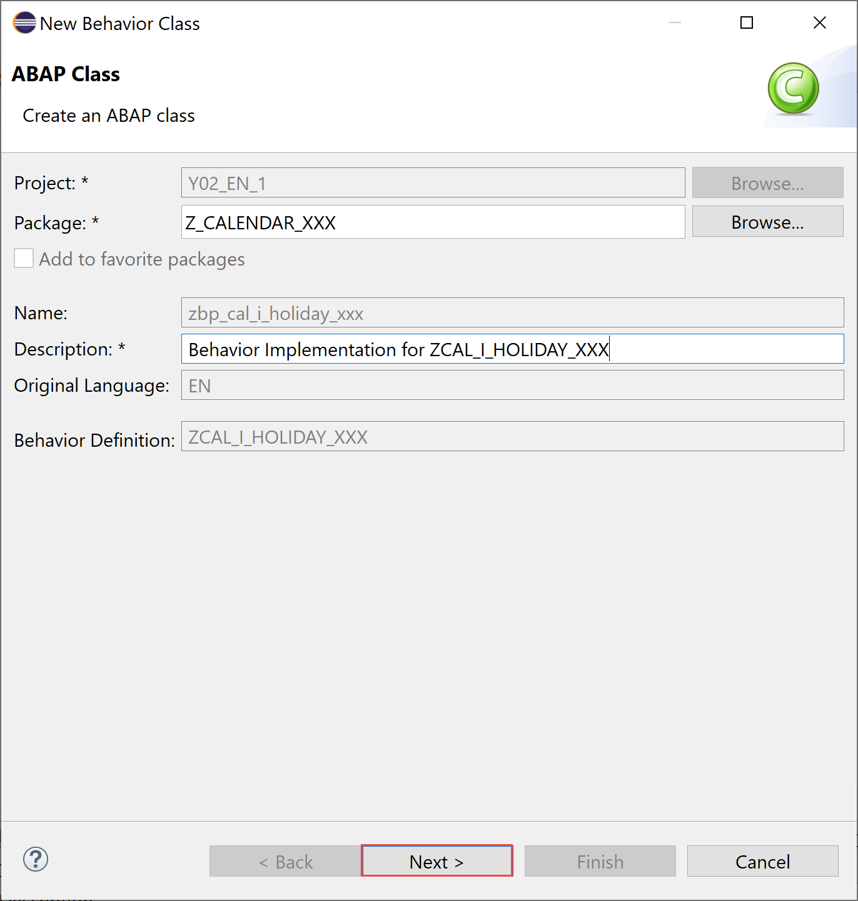

  16. Click **Finish**.

    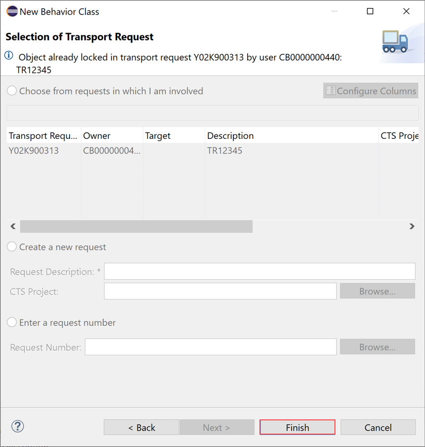

  17. Save and activate class **`ZBP_CAL_I_HOLIDAY_XXX`** behavior definition **`ZCAL_I_HOLIDAY_XXX`** and data definition **`ZCAL_I_HOLIDAY_XXX`**.

[DONE]
[ACCORDION-END]

[ACCORDION-BEGIN [Step 7: ](Create CDS view projection)]
By using projections, you can expose one business object in different business contexts by using different business object subsets. The general business logic is defined in the business object whereas the [business object projection](https://help.sap.com/viewer/923180ddb98240829d935862025004d6/Cloud/en-US/6e7a10d30b74412a9482a80b0b88e005.html) adopts a subset of the business logic.

1. In the project explorer, right-click on your data definition **`ZCAL_I_HOLIDAY_XXX`**, select **New Data Definition**.

    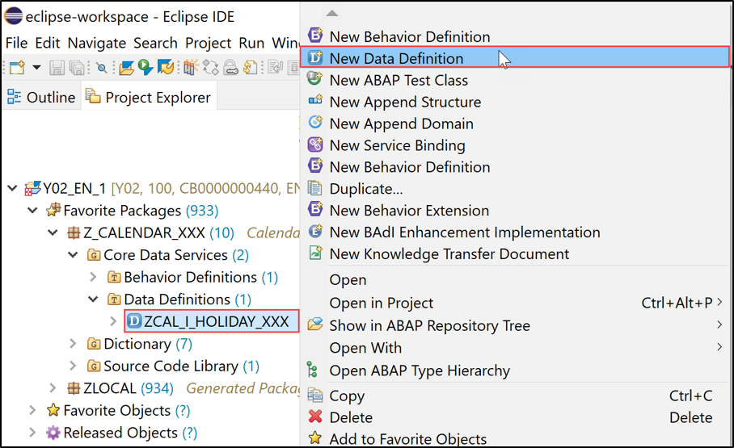

2. Create a projection view:
    - Name: `ZCAL_C_HOLIDAY_XXX`
    - Description: Projection view for public holidays

    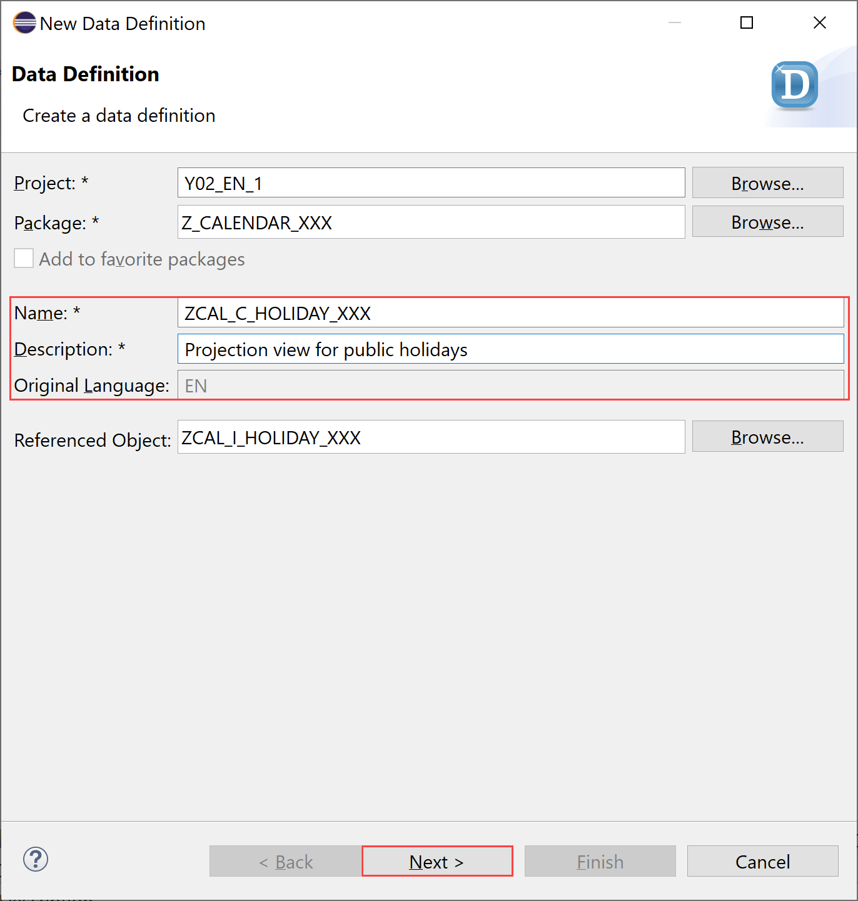

    Click **Next >**.

3. Click on **Next >**.

    

4. Select **Define Projection View** as template.

    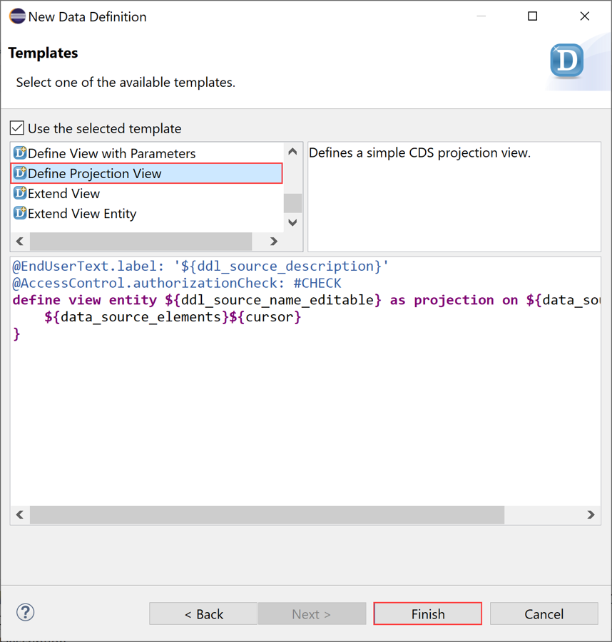

    **Click Finish**.

5. Add **root** to the define view entity statement.

    ```ABAP
    define root view entity ZCAL_C_HOLIDAY_XXX as projection on ZCAL_I_HOLIDAY_XXX
    ```

6. Add the annotation `@Metadata.allowExtensions: true` so the metadata extension for the UI annotations get created.

    ```ABAP
    @Metadata.allowExtensions: true
    ```

7. Add the annotation `provider contract transactional_query`.

    ```ABAP
    define root view entity ZCAL_C_HOLIDAY_XXX provider contract transactional_query
    as projection on ZCAL_I_HOLIDAY_XXX
    ```

8. Check your result:

    ```ABAP
    @EndUserText.label: 'Projection view for public holidays'
    @AccessControl.authorizationCheck: #CHECK
    @Metadata.allowExtensions: true
    define root view entity ZCAL_C_HOLIDAY_XXX
      provider contract transactional_query
      as projection on ZCAL_I_HOLIDAY_XXX
    {
      key HolidayId,
          MonthOfHoliday,
          DayOfHoliday,
          last_changed_at,
          local_last_changed_at
    }
    ```

9. Save and activate.

[DONE]
[ACCORDION-END]


[ACCORDION-BEGIN [Step 8: ](Create behavior definition projection)]

1. In the project explorer, right-click on your CDS view **`ZCAL_C_HOLIDAY_XXX`**, select **New Behavior Definition**.

    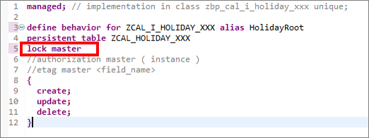

2. Create a projection view:
    - Implementation type: Projection

    

    Click **Next >**.

3.  Click **Finish**.

    

4. Add `use draft;` and uncomment the alias in line 3. Enter `HolidayRoot` as alias name. Check your result:

    ```ABAP
    projection;
    use draft;

    define behavior for ZCAL_C_HOLIDAY_XXX alias HolidayRoot
    {
     use create;
     use update;
     use delete;
    }
    ```

5. Save and activate.


[DONE]
[ACCORDION-END]


[ACCORDION-BEGIN [Step 9: ](Create service definition)]
[Service definitions](https://help.sap.com/viewer/923180ddb98240829d935862025004d6/Cloud/en-US/b09e4d53bfca4544a9f8910bcc2cd9d6.html) expose a set of business objects and their entities to a service URI. The service definition is created for the projection views.

1. In the Project Explorer, right-click on the data definition **`ZCAL_C_HOLIDAY_XXX`** and select **New Service Definition**.

    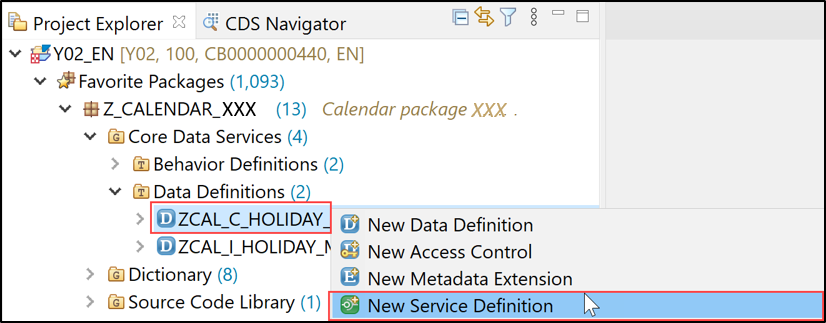


2. Create a service definition:
    - Name: `ZCAL_UI_HOLIDAY_XXX`
    - Description: Service definition for public holiday
    - Exposed Entity: `ZCAL_C_HOLIDAY_XXX`

    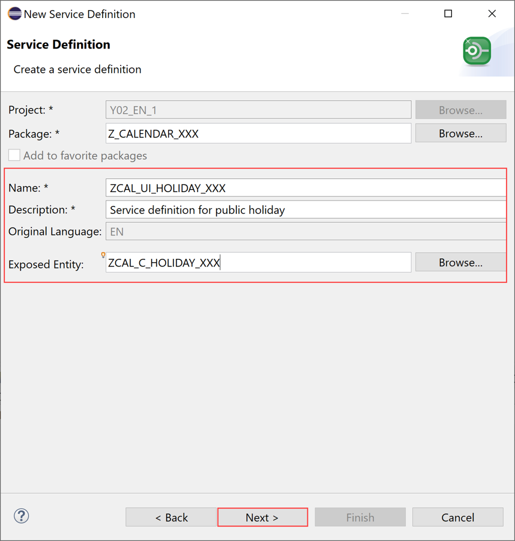

    Click **Next >**.

3.  Click **Finish**.

    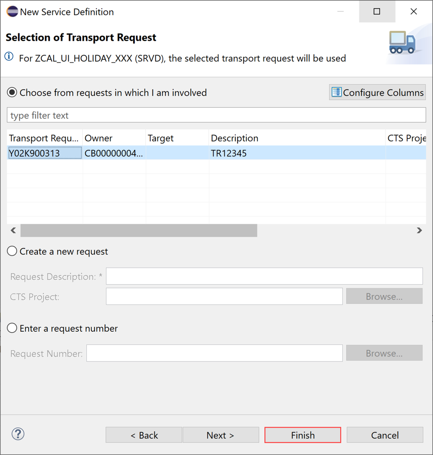

4. Add `as HolidayRoot` to the exposed entity. Check your result:

    ```ABAP
    @EndUserText.label: 'Service Definition for Public Holiday'
    define service ZCAL_UI_HOLIDAY_XXX {
      expose ZCAL_C_HOLIDAY_XXX as HolidayRoot;
    }
    ```

5. Save and activate.

Now the service definition is done and the business object is almost ready for use.

[DONE]
[ACCORDION-END]


[ACCORDION-BEGIN [Step 10: ](Create service binding)]

The [business service binding](https://help.sap.com/viewer/923180ddb98240829d935862025004d6/Cloud/en-US/b58a3c27df4e406f9335d4b346f6be04.html) is an ABAP repository object used to bind a service definition to a client-server communication protocol such as OData.

  1. Right-click on your service definition **`ZCAL_UI_HOLIDAY_XXX`** and select **New Service Binding**.

      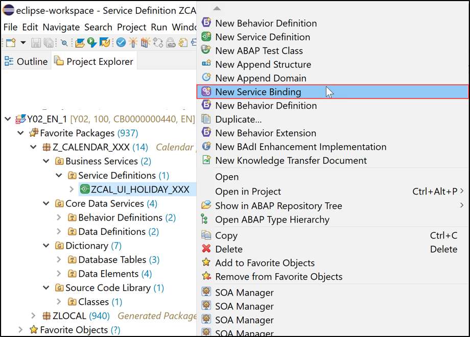

  2. Create a service binding:
     - Name: **`ZCAL_UI_HOLIDAY_XXX`**
     - Description: **`Service binding for holiday calendar`**

     Make sure, that **`ODATA V4 – UI`** is selected as binding type.

      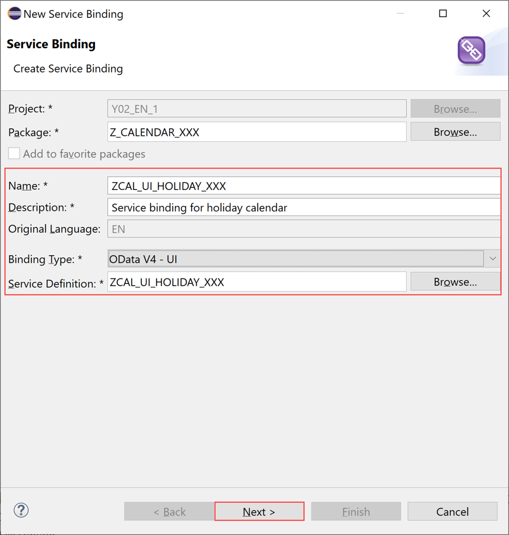

      Click **Next >**.

  3. Click **Finish**.

      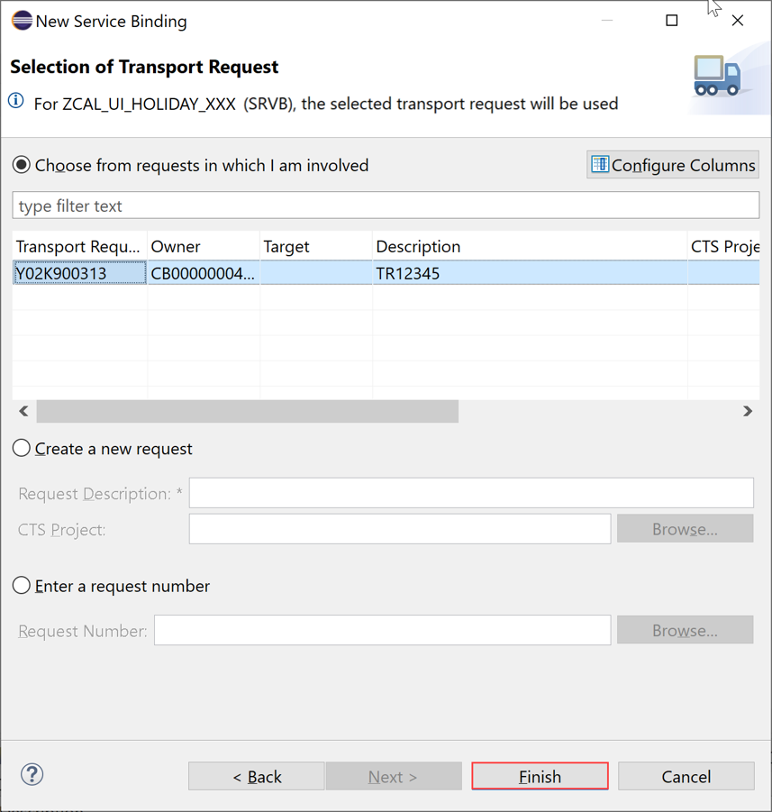

  4. Activate your service binding.

      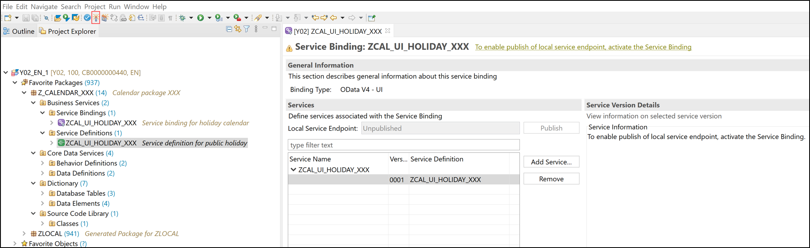

  5. Click **Publish**.

      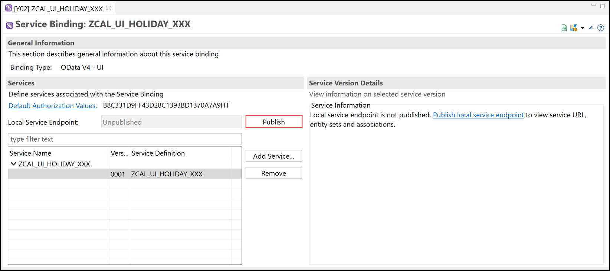

  6. Now you should able to test the application. Therefore, select the root application **`HolidayRoot`** and click **Preview**.

      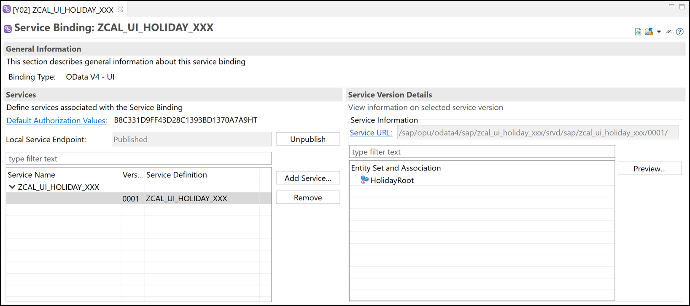

  7. Logon to your ABAP system.

      

  8. Click **Go** to see your result.

      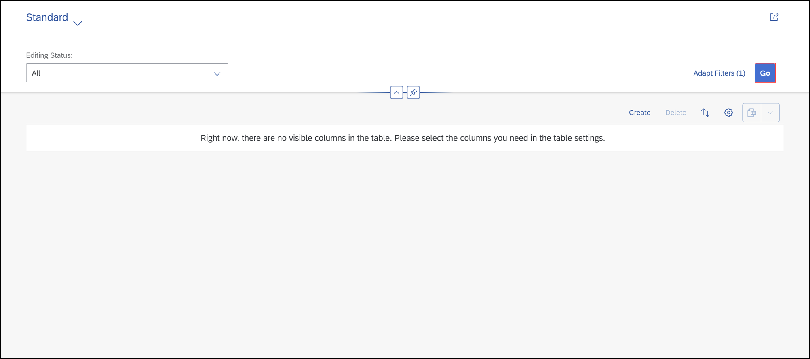

      The application is pretty empty as we first need to configure columns and the creations screen.
      Therefore test data should be created.

[DONE]
[ACCORDION-END]

[ACCORDION-BEGIN [Step 11: ](Test yourself)]

[VALIDATE_1]
[ACCORDION-END]
---
