## Prerequisites
 - You have successfully completed the tutorial [Implement Custom Shell Plug-in in the SAP BTP ABAP Environment](abap-environment-shell-plugin)

>This tutorial was written for SAP BTP ABAP Environment. However, you should be able to use it in SAP S/4HANA Cloud Environment in the same way.

## You will learn
  - How to create an OData Service to expose user-related information using the ABAP Developer Tool in Eclipse.
  - How to add the OData Service to your SAPUI5 project in Business Application Studio.
  - How to adjust your SAPUI5 project so that the user-related data is displayed when accessing the application.

### Create a Business User Role Data Definition
In this tutorial you will continue working on the shell plug-in you created in the pervious tutorial in this series. You will learn how to enrich it using OData Services to expose user-related information. To do this, you will first need to create a Data Definition to expose the User ID of the current user and the corresponding Business Role information.
>Throughout this tutorial, you will create various development objects and UI components. Wherever the suffix `XXX` is used, you can substitute it with a nomenclature of your choice. If you do so, make sure to keep the names consistent throughout the whole tutorial.

1. Access ABAP Developer Tool in Eclipse, connect to your SAP BTP ABAP Environment, and open the package you created as part of the previous tutorial.

2. Right click on the package and select **New** > **Other ABAP Repository Object**:

    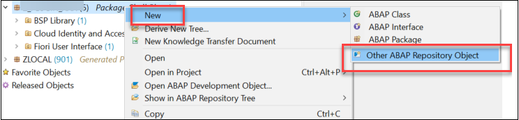  

3. In the search bar, search for **Data Definition** and click on it.

    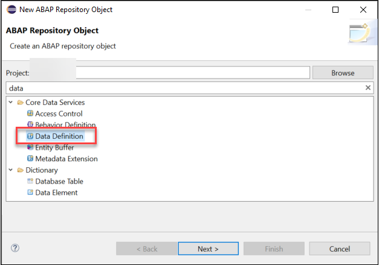

4. Enter a **Name** and a **Description**. Click on **Next**.

    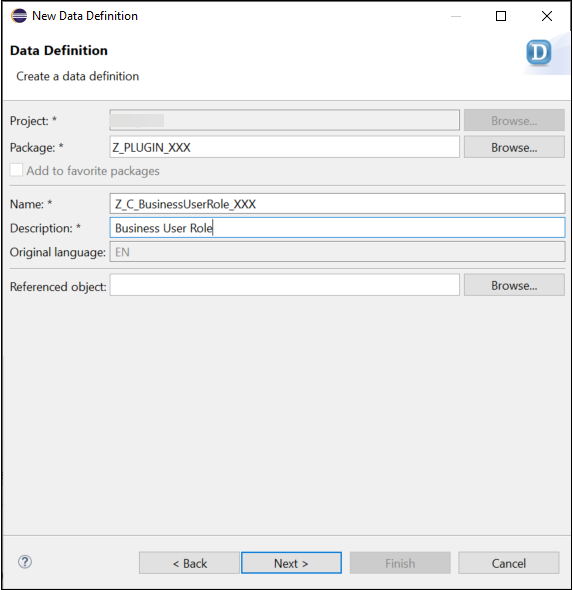

5. Select the transport request you created in the previous tutorial, and click on **Next**.

    

6. Mark the option **Use the selected template** and select the template **Define Root View Entity** then click on **Finish**.

    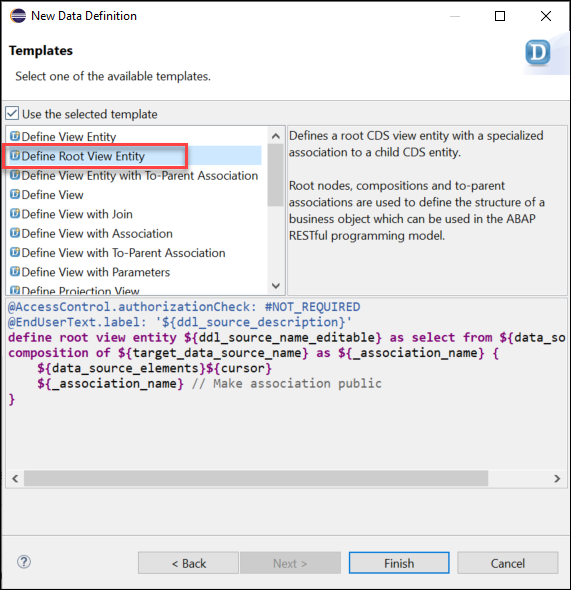

7. The Data Definition is initialized with a pre-filled code based on your chosen template. Adjust it as follows:
``` ABAP
@AccessControl.authorizationCheck: #NOT_REQUIRED
@EndUserText.label: 'Business User Role'
define root view entity Z_C_BusinessUserRole_XXX as select from I_IAMBusinessUserBusinessRole as _BusinessUserRole
  association [0..*] to I_IAMBusinessRoleText as _BusinessRoleText on $projection.BusinessRoleUUID = _BusinessRoleText.BusinessRoleUUID
{
  key abap.char'Me' as ID,
  key _BusinessUserRole.BusinessRoleUUID as BusinessRoleUUID,
  _BusinessUserRole.BusinessRole as BusinessRole,
  _BusinessRoleText.Name as Name,
  /* Associations */
  _BusinessRoleText
  }
where _BusinessUserRole.UserID = $session.user
```

8. Save your Data Definition and activate it using the **Activate** icon.

    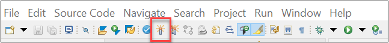

### Create a Business User Data Definition
Now you need to create a second Data Definition, which will take the User ID exposed by the Data Definition you created in the previous step, and will expose the data related to that User ID, such as name and email address.

1. As in the previous step, right click on the package and select **New** > **Other ABAP Repository Object**. In the search bar, search for **Data Definition** and click on it. Enter a **Name** and a **Description**. Click on **Next**.

    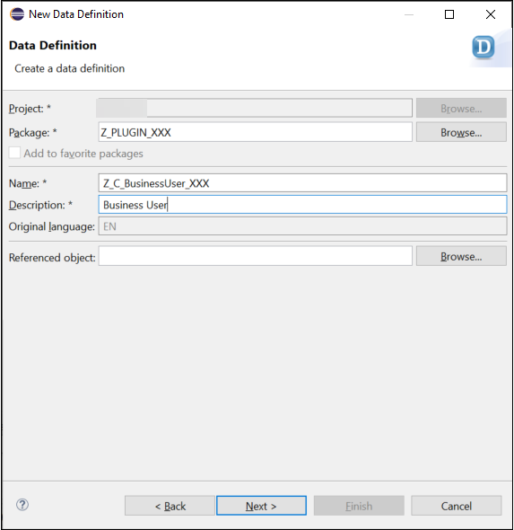

2. Select your transport request and click on **Next**. Mark the option **Use the selected template** and select the template **Define Root View Entity** then click on **Finish**.

3. The Data Definition is initialized with a pre-filled code based on your chosen template. Adjust it as follows:
``` ABAP
@AccessControl.authorizationCheck: #NOT_REQUIRED
@EndUserText.label: 'Business User'
define root view entity Z_C_BusinessUser_XXX as select from I_BusinessUserBasic
      association [0..*] to Z_C_BusinessUserRole_XXX as _BusinessUserRole on $projection.ID = _BusinessUserRole.ID
    {      
      key abap.char'Me' as ID,
      BusinessPartner,
      BusinessPartnerUUID,
      PersonFullName,
      UserID,
      _WorkplaceAddress.PhoneNumber,
      _WorkplaceAddress.DefaultEmailAddress,
      _WorkplaceAddress.Building,
      _WorkplaceAddress.RoomNumber,
      /* Associations */
      _BusinessUserRole
    }
where UserID = $session.user
```

4. Save your Data Definition and activate it using the **Activate** icon.

    

### Create a Service Definition
In order to expose the data from the two previous Data Definitions you need to create a Service Definition.

1. Right click on the package and select **New** > **Other ABAP Repository Object**. In the search bar, search for **Service Definition** and click on it. Enter a **Name** and a **Description**. Click on **Next**.

    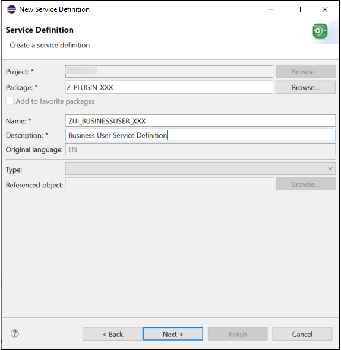

2. Select your transport request and click on **Next**. Mark the option **Use the selected template** and select the template **Define Service** then click on **Finish**.

3. Add your Projection Views to your Service Definition as follows:
``` ABAP
@EndUserText.label: 'Business User Service Definition'
define service ZUI_BUSINESSUSER_XXX {
    expose Z_C_BusinessUser_XXX as BusinessUser;
    expose Z_C_BusinessUserRole_XXX as BusinessUserRole;     
}
```

4. Save your Service Definition and activate it using the **Activate** icon.

    

### Create a Service Binding
Your Service Definition will be consumed by your SAP Fiori Application via the use of a Service Binding.

1. In your project explorer, right click on your Service Definition and select **New Service Binding**.

    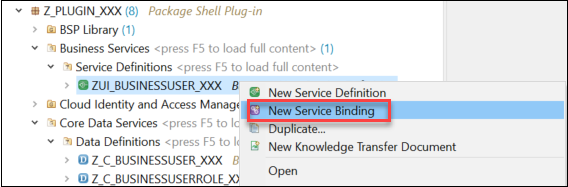

2. Enter a **Name** and a **Description**. In the **Binding Type** dropdown menu, select the option **OData V4 - UI** and click on **Next**.

    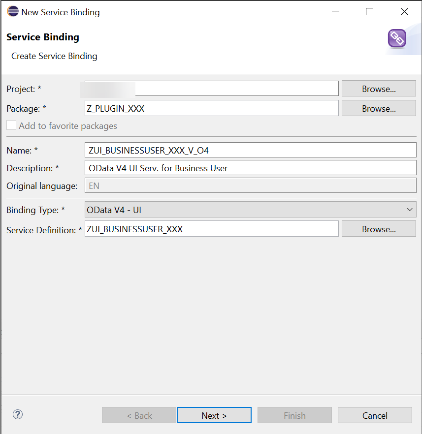
>It is good practice to include the type of Service Binding in the Service Binding name, e.g.: adding the suffix `V_O4` to the name of Service Bindings of type OData Service V4.

3. Select your transport request and click on **Finish**.

4. Save your Service Binding and activate it using the **Activate** icon.

    

5. In the newly created Service Binding, click on the **Publish** button.

    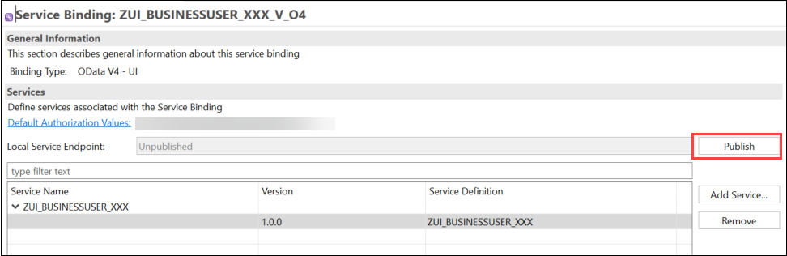
>Publishing a Service Binding can take up to a few minutes. Once the Service Binding is successfully published, the **Local Service Endpoint** parameter will change to **Published**.

6. You can now preview your Service Binding: click on the Service URL link.

    

7. A new window will open up in your browser. In the URL of the browser window, Replace the last part `?sap-client=100` with `BusinessUser('Me')` and press Enter. Your personal user information will be displayed.

    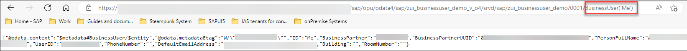

### Add the OData Service to your SAPUI5 Project
Now that you have created an OData Service which exposes user-related information, you need to add it to your SAPUI5 project in Business Application Studio, to enhance your shell plug-in.

1. In Business Application Studio, open the folder of your project and navigate to the **`webapp`** folder. Right click on the **`manifest.json`** file and select **Open Service Manager**.

    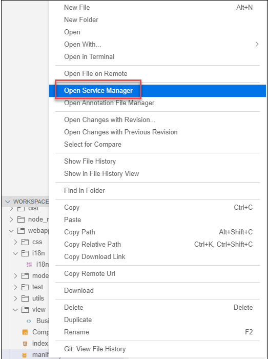

2. This will open an overview of the services used in your project. Click on the bin icon to delete the previous service.

    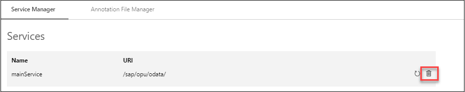

3. To add a new OData Service, click on **Add Service**.

    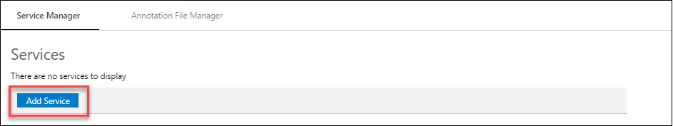

4. Select the **Destination** option. In the **Destination** dropdown menu, select the destination pointing to your SAP BTP ABAP Environment. In the **Provide Service** section, select **Fetch** and from the **Select a service** dropdown menu, select your Service Binding. Click on **Add**.

    

5. Open the **`manifest.json`** file: you can see that the OData Service has been added automatically under `"dataSources"` configuration.

    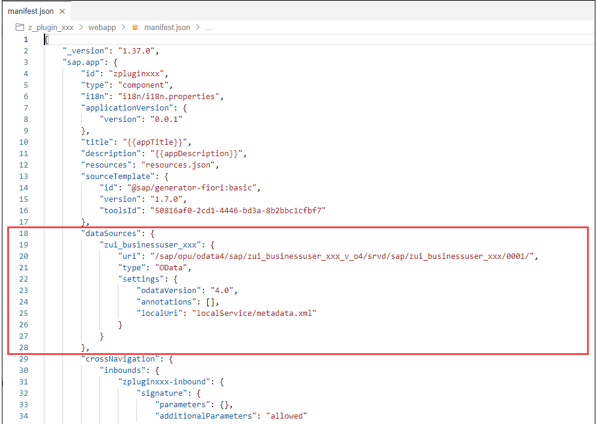

6. Open the **`manifest.json`** file. In the configuration `sap.ui5` > `dependencies` > `libs`, remove the following parameters:  `"sap.f": {}`, `"sap.suite.ui.generic.template": {}`, `"sap.ui.comp": {}`, `"sap.ui.generic.app": {}` and `"sap.ui.table": {}`. Add the parameter `"sap.ui.layout": {}` after `"sap.ushell": {}`. The configuration should look like this:

    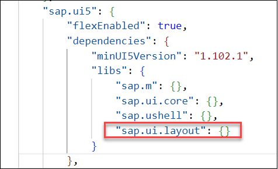

7. In your workspace, go to your project folder and make a right click. Select **Open in Integrated Terminal**. This will open a new terminal window. Input the command `npx @sap-ux/create add mockserver-config` and press enter.

    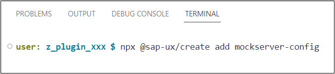

8. A new dependency will be added in the **`package.json`** file, in the configuration `"ui5"` > `"dependencies"`:

    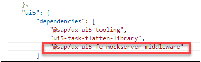

### Adjust your SAPUI5 Project
Your SAPUI5 Application can now consume user-related information via the OData Service you created. You now need to specify how you want this information to be consumed and displayed in your application. You will first modify the **`i18n.properties`** file, which defines which text is displayed for each of your user-related data. You will then create a View of type Fragment in your project, to define the layout with which the user-related information will be displayed. And finally, you will add this Fragment View to the content of your application.

1. In the **`webapp`** > **`i18n`** folder, open the **`i18n.properties`** file. Substitute the file content with the following code:  
``` HTML
#This is the resource bundle for zpluginxxx
#Texts for manifest.json
#XTIT: Application name
appTitle=Shell Plug-in
#YDES: Application description
appDescription=Shell Plug-in
#XTIT: Main view title
title=Shell Plug-in
flpTitle=Shell Plug-in
flpSubtitle=
#Title and Subtitle of the Plug-in
titleTab=Personalized shell plug-in
subtitleTab=Plug-in example
#Fragment Labels
labelUserID=System User ID
tooltipUserID=Steampunk System User ID
labelMail=E-Mail Address
tooltipMail=User-Specific E-Mail Address
labelPhone=Phone Number
tooltipPhone=User-Specific Phone Number
labelLocation=Location
tooltipLocation=User-Specific Location
titleTable=Assigned Business Roles
noContentTable=No Assigned Business Roles
labelBusinessRole=Business Role
labelBusinessRoleName=Name
```

2. Via the OData Service you created in a previous step, you can consume Business User details associated with the current Business User. You now need to define how these data will be displayed. To do this, you need to create a form, and specify its layout and contents. In your project, go to the empty folder **`webapp`** > **`view`**. Right click on the folder and select **New File**.

    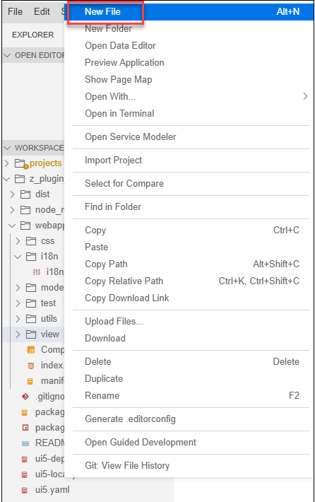

3. Input a **Name** for your new View file, and make sure it ends with `.fragment.xml` to create a View of type Fragment . Click on **OK**.

    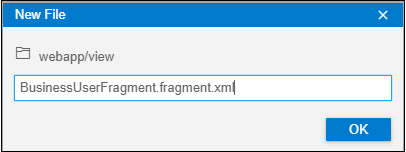

4. Open the newly created Fragment View file, and input the following code:
``` XML
<core:FragmentDefinition
    xmlns="sap.m" xmlns:core="sap.ui.core"
    xmlns:form="sap.ui.layout.form"
    xmlns:layout="sap.ui.layout"
    xmlns:grid="sap.ui.layout.cssgrid"
    id="businessUserFragment">
<Page id="PersonInfoPage" title="{PersonFullName}" binding="{path:'/BusinessUser(%27Me%27)'}">
     <content>
    <VBox id="_IDGenVBox1" class="sapUiSmallMargin">
  <form:Form editable="false" id="form0">
            <form:layout>
                <form:ResponsiveGridLayout id="_IDGenResponsiveGridLayout1" labelSpanXL="5" labelSpanL="5" labelSpanM="5" labelSpanS="5" adjustLabelSpan="false" emptySpanXL="0" emptySpanL="0" emptySpanM="0" emptySpanS="0" columnsXL="5" columnsL="5" columnsM="5" singleContainerFullSize="false"/>
            </form:layout>
      <form:formContainers>
          <form:FormContainer title="" id="PersonInfoContainer">
              <form:formElements><form:FormElement label="{i18n>labelUserID}" id="LabelUserID" tooltip="{i18n>tooltipUserID}">
                      <form:fields><Text id="UserID" text="{UserID}" wrappingType="Normal" textAlign="Begin" tooltip="{i18n>tooltipUserID}"/>
                      </form:fields>
                </form:FormElement>
                <form:FormElement label="{i18n>labelMail}" id="LabelEMail">
                      <form:fields>
                        <Text id="EMail" text="{DefaultEmailAddress}" wrappingType="Normal" textAlign="Begin" tooltip="{i18n>tooltipMail}"/>
                      </form:fields>
                </form:FormElement>
                <form:FormElement label="{i18n>labelPhone}" id="LabelPhone">
                      <form:fields>
                        <Text id="Phone" text="{PhoneNumber}" wrappingType="Normal" textAlign="Begin" tooltip="{i18n>tooltipPhone}"/>
                      </form:fields>
                </form:FormElement>
                <form:FormElement label="{i18n>labelLocation}" id="LabelLocation">
                      <form:fields>
                        <Text id="Location" text="{Building} / {RoomNumber}" wrappingType="Normal" textAlign="Begin" tooltip="{i18n>tooltipLocation}"/>
                      </form:fields>
                </form:FormElement>
              </form:formElements>
          </form:FormContainer>
      </form:formContainers>
      </form:Form>
    </VBox>
    <Title id="TableTitleID" text="{i18n>titleTable}" textAlign="Center" titleStyle="H4"/>
    <Table noDataText="{i18n>noContentTable}" id="TableBusinessRoles" items="{path:'_BusinessUserRole'}">
    <items>
        <ColumnListItem type="Active" id="ColumnItem">
            <cells>
                <Text text="{BusinessRole}" id="BusinessRole"/>
                <Text text="{Name}" id="BusinessRoleName"/>
            </cells>
        </ColumnListItem>
    </items>
    <columns>
        <Column id="ColumnBusinessRole">
            <header>
                <Label text="{i18n>labelBusinessRole}" id="LabelBusinessRole"/>
            </header>
        </Column>
        <Column id="ColumnBusinessRoleName">
            <header>
                <Label text="{i18n>labelBusinessRoleName}" id="LabelBusinessRoleName"/>
            </header>
        </Column>
        </columns>
        </Table>
        </content>
    </Page>
</core:FragmentDefinition>
```

5. Your Fragment View defines how you want the data to be displayed. You now need to load the Fragment View into the content of your SAPUI5 Application, so that the form containing the user-related information will actually be displayed in your application. In the **`webapp`** folder, open the **`Component.js`** file. Replace the content of the file with the following code:

``` JavaScript
sap.ui.define([
        "sap/ui/core/UIComponent",
        "sap/ui/model/resource/ResourceModel",
        "sap/ui/core/Fragment"
    ],
        function (UIComponent, ResourceModel, Fragment) {
            "use strict";

        return UIComponent.extend("zpluginxxx.Component", {
            metadata: {
                manifest: "json"
            },

            /**
             * The component is initialized by UI5 automatically during the startup of the app and calls the init method once.
             * @public
             * @override
             */
            init: function () {
                // call the base component's init function
                UIComponent.prototype.init.apply(this, arguments);

                var businessUserModel = this.getModel();

                var vtitleTab = new ResourceModel({
                    bundleName: "zpluginxxx.i18n.i18n"
                }).getResourceBundle().getText("titleTab");

                var vsubtitleTab = new ResourceModel({
                    bundleName: "zpluginxxx.i18n.i18n"
                }).getResourceBundle().getText("subtitleTab");

                var oRenderer = sap.ushell.Container.getRenderer();
                var oEntry = {
                    title: vtitleTab,
                    icon: "sap-icon://role",
                    value: function () {
                        return jQuery.Deferred().resolve(vsubtitleTab);
                    },
                    content: function () {
                        if (!this.oFragment) {
                            this.oFragment = Fragment.load({
                                type: "XML",
                                id: "BusinessUserFragment",
                                name: "zpluginxxx.view.BusinessUserFragment"
                            }).then(function (fragment) {
                                var i18nModel = new ResourceModel({
                                    bundleName: "zpluginxxx.i18n.i18n"
                                });
                                fragment.setModel(i18nModel, "i18n");
                                fragment.setModel(businessUserModel);

                                return fragment;
                            });
                        }
                        return this.oFragment;
                    },
                    onSave: function () {
                        return jQuery.Deferred().resolve();
                    }
                };
                var i18nModel = new ResourceModel({
                    bundleName: "zpluginxxx.i18n.i18n"
                });
                oRenderer.setModel(i18nModel, "i18n");
                oRenderer.addUserPreferencesEntry(oEntry);
            }
        });
      }
    );
```
> If you have chosen different names for your project and for your Fragment View in the previous steps, you will need to adjust the code above: replace any instance of `zpluginxxx` with the id of your project, and replace `BusinessUserFragment` with the name of your View.

### Preview your SAPUI5 Application
Your enhanced SAPUI5 Application can be previewed before it is deployed. Using the preview functionality is good practice before deploying an application, to make sure that the UI looks as intended and the application's functionalities work as desired.

1. Right click on your project folder and select **Preview Application**.

    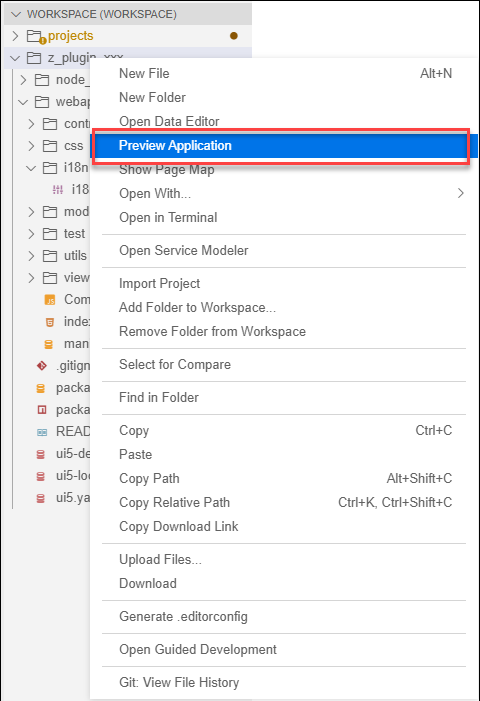

2. Select **start fiori-run**. This will prompt a new terminal window which will run the **start fiori-run** command. This can take up to a few seconds. Once it is done, a preview of your application will open up in a new browser window.

    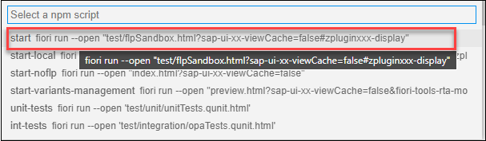

3. In the preview of your application, click on the user icon in the top-right corner and open the **Settings**. Your shell plug-in is listed in the user's settings dialog. User-related information is displayed according to the layout you defined using the Fragment View.

    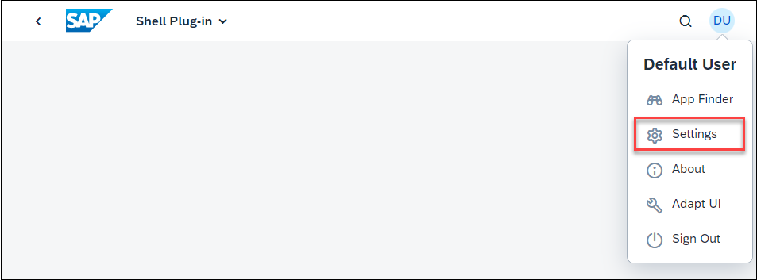
    
    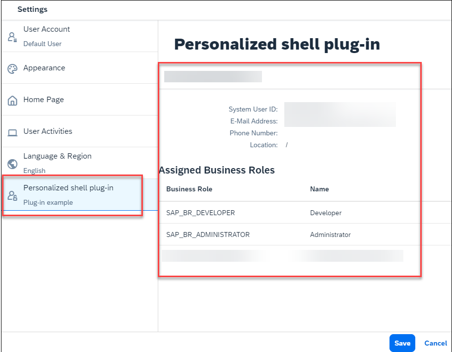

### Deploy your Enhanced Shell Plug-in
You can now re-deploy your SAPUI5 Application with an enhanced shell plug-in to your SAP BTP ABAP Environment.

1. In Business Application Studio, right click on the project folder and select **Open in Integrated Terminal**. This will open a new terminal window.

    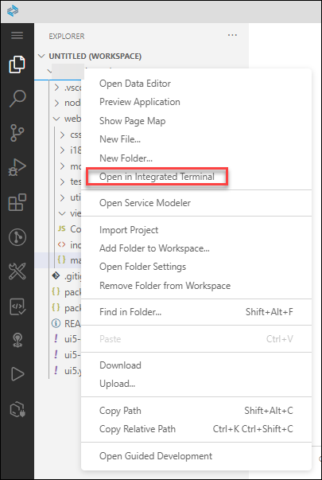

2. In the terminal window, run the command: `npm run deploy`. The deployment process will begin. You will be prompted to confirm the deployment by typing `Y`. Once the SAPUI5 Application is successfully deployed to your SAP BTP ABAP Environment, the terminal will return the status:
`Deployment Successful`.
>The deployment process can take up to a few minutes.

### Test your Shell Plug-in
After a successful deployment, your shell plug-in will be updated in the system. Login to your SAP BTP ABAP Environment with a Business User with the necessary Business Role (see previous tutorial in this series). Open your application by clicking on the application tile. The plug-in can be accessed via the user settings dialog. The plug-in returns data related to your Business User and a list of Business Roles that are assigned to your Business User.

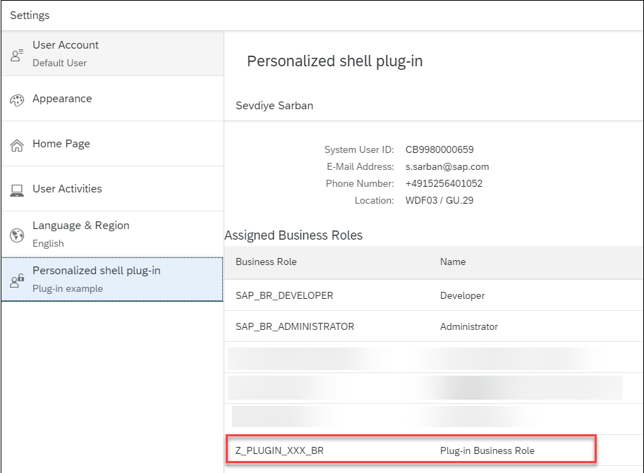

### Test Yourself
