## Prerequisites
 - You have access to a SAP BTP Subaccount with a SAP Business Application Studio subscription.
 - You have access to a SAP BTP ABAP Environment in a Cloud Foundry space in the subaccount.
 - You have connected SAP Business Application Studio to your SAP BTP ABAP Environment via destination.
 - You have a user in the subaccount, with `Business_Application_Studio_Developer` role collection.
 - You are a member of the Cloud Foundry space where your SAP BTP ABAP Environment resides, and you have **Space Developer** role.
 - You have a user in your SAP BTP ABAP Environment with the following roles: `SAP_BR_ADMINISTRATOR` and `SAP_BR_DEVELOPER`.
 - You are connected to your SAP BTP ABAP Environment in the ABAP Development Tool (ADT) in Eclipse.

>This tutorial was written for SAP BTP ABAP Environment. However, you should be able to use it in SAP S/4HANA Cloud Environment in the same way.

## You will learn
- How to create a custom shell plug-in.
- How to deploy the shell plug-in to your SAP BTP ABAP Environment as part of a SAP Fiori Application.
- How to create a Business Catalog and Business Role to regulate access to the SAP Fiori Application.

---

### Create a Package in ABAP Developer Tool in Eclipse

The shell plug-in will be deployed to the local `ZLOCAL` software component in your SAP BTP ABAP Environment. For this reason, you need to create in ADT a local package and a transport request for the software component.
>Throughout this tutorial, you will create various development objects and UI components. Wherever the suffix `XXX` is used, you can substitute it with a nomenclature of your choosing. If you do so, please make sure to keep the names consistent throughout the whole tutorial.

1. Access ABAP Developer Tool in Eclipse and connect to your SAP BTP ABAP Environment.

2. Right click on your SAP BTP ABAP Environment and click on **New** > **ABAP Package**:

    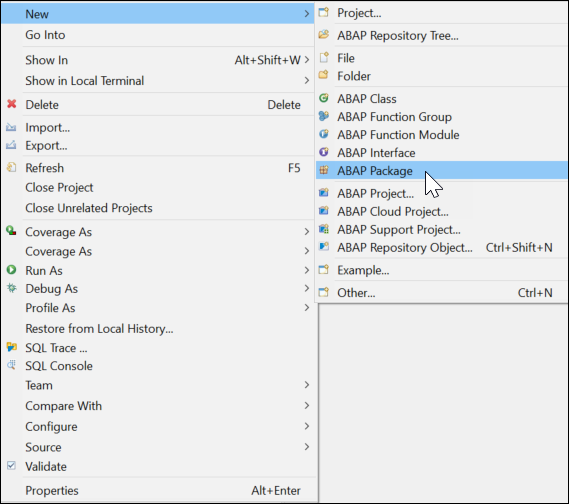

3. Input a name and a description for your package. Make sure that the **Package Type** is **Development**. Click on **Next**.

    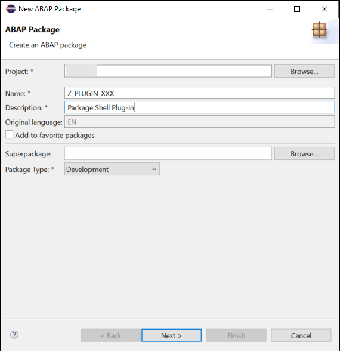
>For the scope of this tutorial, the package name is `Z_PLUGIN_XXX`. You can use this name or choose your own package name. But make sure that your package name starts with `Z`. Take note of the name of the package you just created, you will need it in a later step. You can also mark the **Add to favorite package** option, so the package will be automatically added to your favorites and it will be easier to find later on.

4. In the **Software Component** field input `ZLOCAL`. Click on **Next**.

    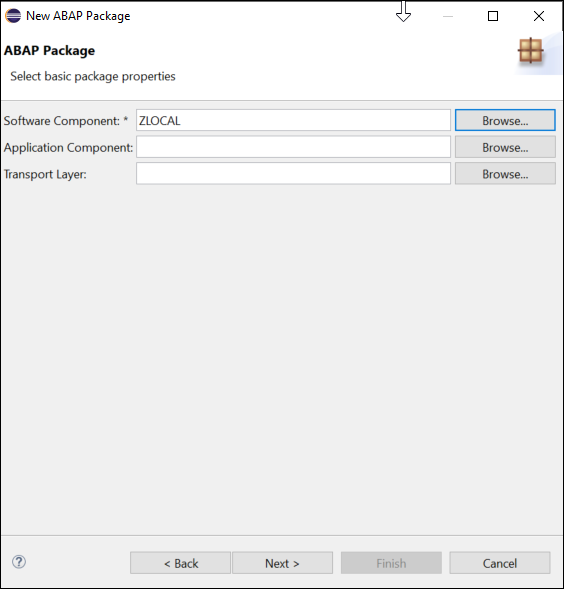

5. Select the **Create a new request** option and input a description for your transport request. Click on **Finish**. The package will be created.

    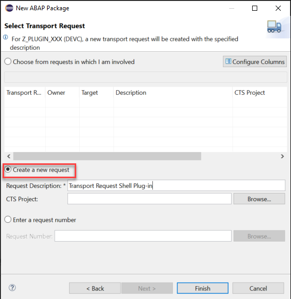

6. Open the **Transport Organizer** and select your SAP BTP ABAP Environment. Navigate to **Workbench** > **Local Change Requests** > **Modifiable**. Here you can see the transport request you just created. Take note of the transport request number, you will need it in a later step.

    

### Create a SAPUI5 Project in Business Application Studio

The shell plug-in will be deployed to your SAP BTP ABAP Environment as part of a SAP Fiori Application. For this reason, you need to create an empty SAP Fiori Application of type SAPUI5 in Business Application Studio.

1. In your SAP BTP Subaccount, navigate to the **Instances and Subscriptions** tab in the left panel. In the **Subscriptions** tab, click on the **SAP Business Application Studio** link to access your instance of the SAP Business Application Studio.

    

2. Click on **Create Dev Space** button in the top right corner, input a Dev Space name and select the **SAP Fiori** option. Click on **Create Dev Space**. This might take a couple of minutes. Once the developer workspace is running, click on it to access it.

    

3. Click on **Start from template**.

4. Select the **SAP Fiori Application** option and click on **Start**.

    

5. In the **Application Type** dropdown menu, select  **SAPUI5 freestyle**. Select the **SAPUI5 Application** `floorplan` and click on **Next**.

    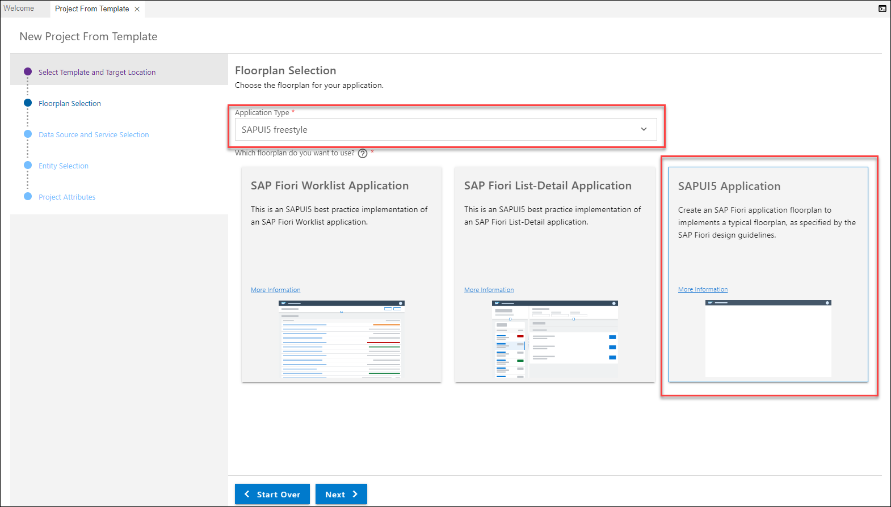

6. In the **Data source** dropdown menu, select **None** and click on **Next**.

    

7. In the **View name** field, choose a view name and click on **Next**.

    
>For the scope of this tutorial the view name is `plugin_view`. You can use this name or choose a different name. If you choose a different view name, make sure to keep it consistent throughout the rest of the tutorial. While developing a SAP Fiori Application it is good practice to add the suffix `_view` to the name of your view.

8. Input a **Module name**, an **Application title** and a **Description** of your choice. Select the **Add deployment configuration** option and the **Add FLP configuration** option. Click on **Next**.

    

9. In the **Please choose the target** dropdown menu, select **ABAP**. In the **Destinations** dropdown menu, select the destination that points towards your SAP BTP ABAP Environment. Input a name for the **SAPUI5 ABAP Repository** and a  **Deployment description**. In the **Package** field, input the name of the package that you created in ABAP Development Tool in Eclipse in the previous step. Select **Enter manually** and Input the **Transport Request** number you created in the previous step. Click on **Next**.

    

10. In the **Semantic Object** field input `Shell` and in the **Action** field input `plugin`. Input a **Title** of your choice. Click on **Finish**. The project folder will be generated.

    
>Make sure to input the fields with the correct cases: `Shell` must start with an upper case and `plugin` must start with a lower case.

### Adjust your SAPUI5 Project

SAP Fiori Application projects created via the SAP Fiori template are automatically initialized with several basic folders, files and configurations. To create a shell plug-in and deploy it as part of your SAP Fiori Application, you need to change some of these initial configurations.

1. In Business Application Studio, open the folder of the project you just created and navigate to the **`webapp`** folder. Double click on the **`manifest.json`** file to open it.

    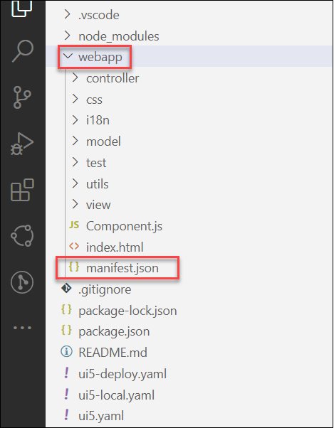

2. In the **`manifest.json`** file, modify the following configurations: <ul><li>Under the `"sap.app"` configuration adjust the `"type"` parameter to `"component"`.</li><li>Under the `"crossNavigation"` configuration remove the `"title"`, `"subTitle"` and `"icon"`. And add the parameter `"hideLauncher": true`.</li><li>Remove the `"routing"` and the `"rootView"` configurations.</li><li>At the end of the file, insert the following code snippet:
  `"sap.flp": {"type": "plugin"}`.</li> At the end your **`mainfest.json`** file should look like the following:
``` JSON
{
    "_version": "1.42.0",
    "sap.app": {
        "id": "zpluginxxx",
        "type": "component",
        "i18n": "i18n/i18n.properties",
        "applicationVersion": {
            "version": "0.0.1"
        },
        "title": "{{appTitle}}",
        "description": "{{appDescription}}",
        "resources": "resources.json",
        "sourceTemplate": {
            "id": "@sap/generator-fiori:basic",
            "version": "1.8.0",
            "toolsId": "b503f28f-ee0b-467a-9b29-cfa8d61bc583"
        },
        "dataSources": {
            "mainService": {
                "uri": "/sap/opu/odata/",
                "type": "OData",
                "settings": {
                    "annotations": [],
                    "localUri": "localService/metadata.xml",
                    "odataVersion": "2.0"
                }
            }
        },
        "crossNavigation": {
            "inbounds": {
                "zpluginxxx-inbound": {
                    "signature": {
                        "parameters": {},
                        "additionalParameters": "allowed"
                    },
                    "hideLauncher": true,
                    "semanticObject": "Shell",
                    "action": "plugin"
                }
            }
        }
    },
    "sap.ui": {
        "technology": "UI5",
        "icons": {
            "icon": "",
            "favIcon": "",
            "phone": "",
            "phone@2": "",
            "tablet": "",
            "tablet@2": ""
        },
        "deviceTypes": {
            "desktop": true,
            "tablet": true,
            "phone": true
        }
    },
    "sap.ui5": {
        "flexEnabled": true,
        "dependencies": {
            "minUI5Version": "1.102.1",
            "libs": {
                "sap.m": {},
                "sap.ui.core": {},
                "sap.f": {},
                "sap.suite.ui.generic.template": {},
                "sap.ui.comp": {},
                "sap.ui.generic.app": {},
                "sap.ui.table": {},
                "sap.ushell": {}
            }
        },
        "contentDensities": {
            "compact": true,
            "cozy": true
        },
        "models": {
            "i18n": {
                "type": "sap.ui.model.resource.ResourceModel",
                "settings": {
                    "bundleName": "zpluginxxx.i18n.i18n"
                }
            },
            "": {
                "dataSource": "mainService",
                "preload": true,
                "settings": {}
            }
        },
        "resources": {
            "css": [
                {
                    "uri": "css/style.css"
                }
            ]
        }
    },
    "sap.flp":{
        "type": "plugin"
    }
}
```
>In the above code snippet, certain parameters are project-dependent and might therefore have different values for you. For this reason, you should use this code snippet as a guide, and manually adjust your **`mainfest.json`** file (rather than simply copy and paste this code snippet).

3. Delete all the content in your **`controller`** folder (This is a sub-folder of the **`webapp`** folder). Then delete the **`controller`** folder itself.

    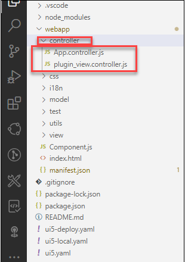

4.  Delete all the content in your **`view`** folder (This is a sub-folder of the **`webapp`** folder). Do not delete the **`view`** folder itself, you will need it in a later step.

    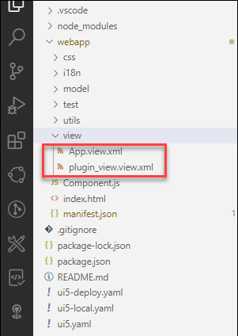

5. Open the **`Component.js`** file in the **`webapp`** folder. Delete the entire content of the file, and replace it with the following code:

``` JavaScript
sap.ui.define([
        "sap/ui/core/UIComponent"
    ],
    function (UIComponent) {
        "use strict";

        return UIComponent.extend("zpluginxxx.Component", {
            metadata: {
                manifest: "json"
            },

            /**
             * The component is initialized by UI5 automatically during the startup of the app and calls the init method once.
             * @public
             * @override
             */
            init: function () {
                // call the base component's init function
                UIComponent.prototype.init.apply(this, arguments);

                var oRenderer = sap.ushell.Container.getRenderer();
                var oEntry = {
                    title: "Personalized shell plug-in",
                    icon: "sap-icon://role",
                    value: function () {
                        return jQuery.Deferred().resolve("Plug-in example");
                    },
                    content: function () {
                        return jQuery.Deferred().resolve(new sap.m.Text("plugin-text", {text: ""}));
                    },
                    onSave: function () {
                        return jQuery.Deferred().resolve();
                    }
                };
                oRenderer.addUserPreferencesEntry(oEntry);
            }
        });
    }
);
```

>In line 7, the `"zpluginxxx.Component"` is taken from the name of your project. If you chose a different project name in the previous step, make sure to substitute the `zpluginxxx` with the correct project name. The name of your project can be found in the **`manifest.json`** file under the `"sap.app"`>`"id"` parameter.

### Preview your SAPUI5 Application

Your basic SAPUI5 Application can be previewed before it is deployed. Using the preview functionality is good practice before deploying an application, to make sure that the UI looks as intended and the application's functionalities work as desired.

1. In Business Application Studio, right click on the project folder and select **Preview Application**.

    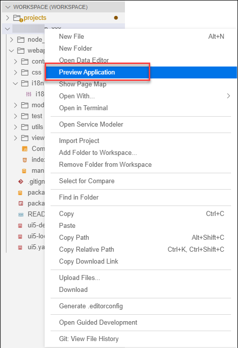

2. Select **start fiori-run**. This will prompt a new terminal window which will run the **start fiori-run** command. This can take up to a few seconds. Once it is done, a preview of your application will open up in a new browser window.

    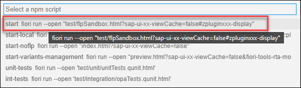

3. In the preview of your application, click on the user icon in the top-right corner and open the **settings**. Your shell plug-in is listed in the user's settings dialog.

    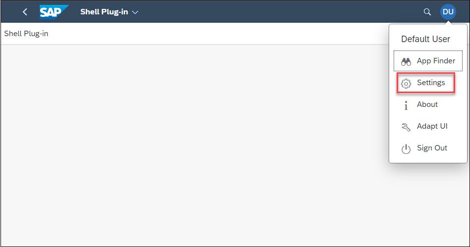
    
    
>The shell plug-in is currently empty. You will implement it in a later tutorial.

### Deploy your SAPUI5 Application

You can now deploy your SAPUI5 Application with a basic (empty) shell plug-in to your SAP BTP ABAP Environment.

1. In Business Application Studio, right click on the project folder and select **Open in Integrated Terminal**. This will open a new terminal window.

    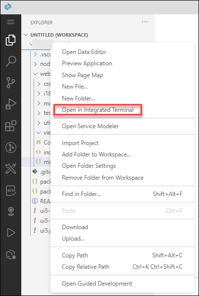

2. In the terminal window, run the command:
`npm run deploy`. The deployment process will begin. You will be prompted to confirm the deployment by typing `Y`. Once the SAPUI5 Application is successfully deployed to your SAP BTP ABAP Environment, the terminal will return the status:
`Deployment Successful`. You can now close the terminal window.
>The deployment process can take up to a few minutes.

3. After a successful deployment, your software package in ABAP Developer Tool in Eclipse will be automatically enhanced by a BSP Application and a Launchpad App Descriptor Item.

    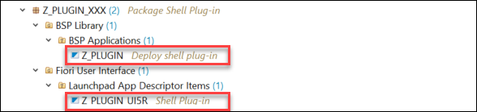

### Create an IAM App

Now that your basic shell plug-in has been successfully deployed to your SAP BTP ABAP Environment as part of a SAPUI5 Application, you need to assign the application to a Business Catalog. To do this, you first need to create an IAM App, which points to your deployed SAPUI5 Application. (You will assign the IAM App to a Business Catalog in a later step).

1. Access ABAP Developer Tool in Eclipse and connect to your SAP BTP ABAP Environment.

2. Right click on your package and select **New** > **Other ABAP repository object**.

    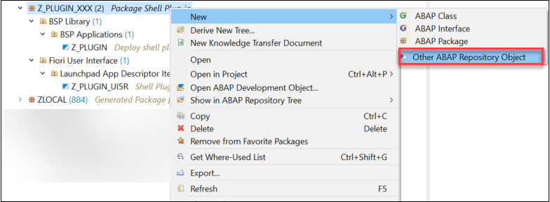

3. In the search bar, search for **IAM App** and click on it.

    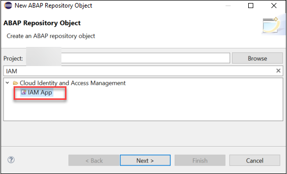

4. Enter a name and a description for the IAM app. Keep **External App** as the **App Type**.

    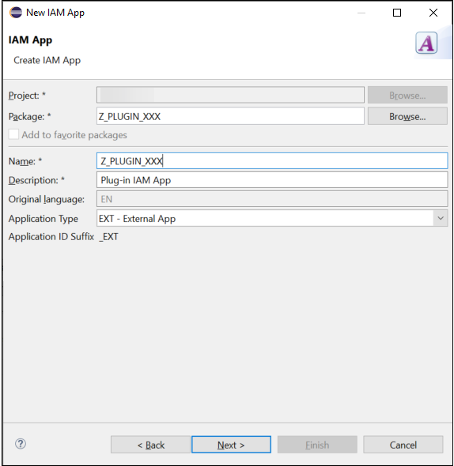

5. Click on next and select the transport request you created in a previous step. Click on **Finish**.

6. In the newly created **IAM App**, enter the name of your **Launchpad App Descriptor Item** in the corresponding field and save ( **File** > **Save**). Then click on **Publish Locally**.

    
>Publishing the IAM App can take up to a couple of minutes. You can keep track of the process in the lower right corner of the ABAP Developer Tool in Eclipse.

### Create a Business Catalog
Now that you have created the IAM App, you can create a Business Catalog and assign the IAM App to it.

1. In the **IAM App**, click on the link **Create a new Business Catalog and assign the App to it**.

    

2. Enter a name and description.

    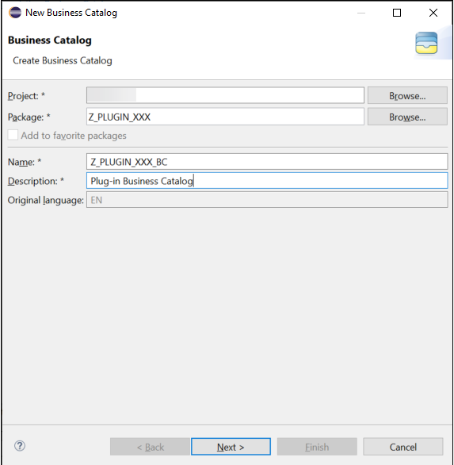

3. Click next and select your transport request. Click on **Finish**.

4. A new window will automatically pop up prompting you to create the Business Catalog App Assignment. Click on **Next**.

    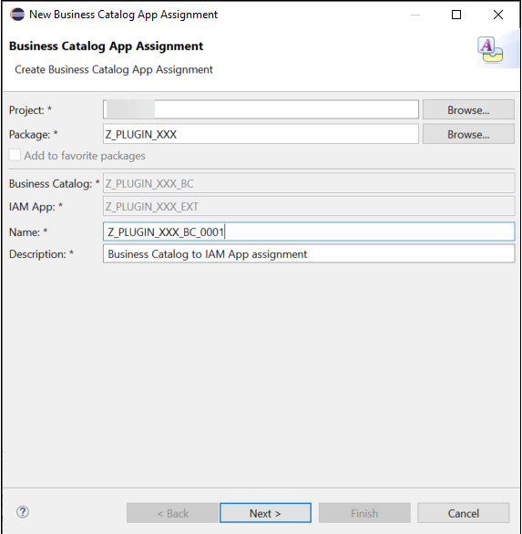

5. Select the transport request you used previously. Click on **Finish**.

6. The generated IAM App, IAM App to Catalog Assignment and IAM Business Catalog will appear in your project folder.  

7. Double click on the IAM Business Catalog file to open it. Click on **Publish Locally**.

    
>Publishing the Business Catalog can take up to a minute. You can keep track of the process in the lower right corner of the ABAP Developer Tool in Eclipse.
>Make note of your Business Catalog ID, you will need it in a later step.

### Create a Business Role

Now you need to create a Business Role in your SAP BTP ABAP Environment and then assign the Business Catalog to it. Any user in your SAP BTP ABAP Environment with this Business Role will have access to the shell plug-in.

1. Access the Fiori Launchpad of your SAP BTP ABAP Environment.

2. Search for the **Maintain Business Roles** application and open it.

    

3. In the lower right corner, click on **New**. Enter a **Business Role ID** and a description. Click on **Create**. The Business Role will be created and will open automatically.

    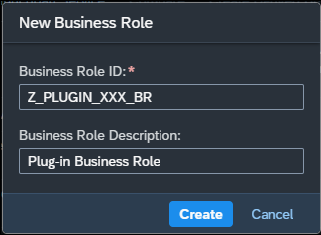

4. In the **Assigned Business Catalogs** tab, click on 'Add' to add your Business Catalog.

    
    
    Search for your Business Catalog, select it and click on **OK**.

    

5. In the **Assigned Business Users** tab, click on **Add**.

    
    
    Search for your user name, select it and click **OK**.

6. In the **General Role Details** tab, change the value for the **Write, Read, Value Help** parameter to **Unrestricted**. Then click on **Save**. <br/> 

### Test your Shell Plug-in

You have successfully created an empty shell plug-in and deployed it to your SAP BTP ABAP Environment as part of a SAPUI5 Application. You have setup the IAM App, the Business Catalog and the Business Role. Any user with this Business Role will now see the shell plug-in in the user settings dialog: click on the user icon in the top right corner, and click on **Settings**.

    
>You might have to refresh the webpage for the shell plug-in to appear in the **Settings**.

In the next tutorial, you will learn how to enrich your shell plug-in making use of OData Services.

### Test Yourself
