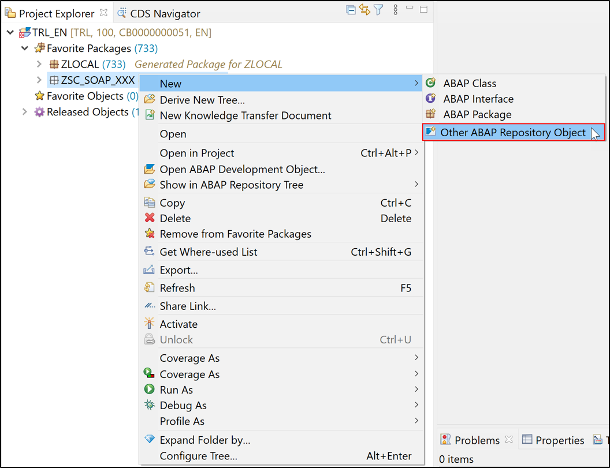
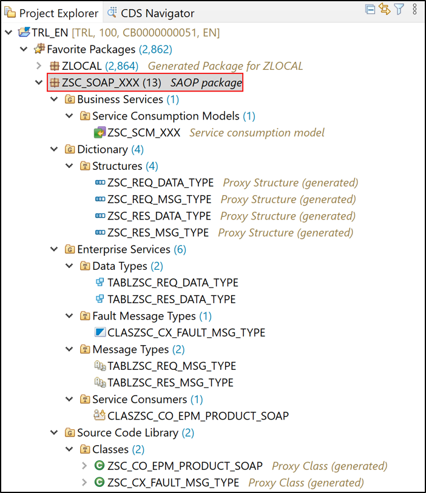
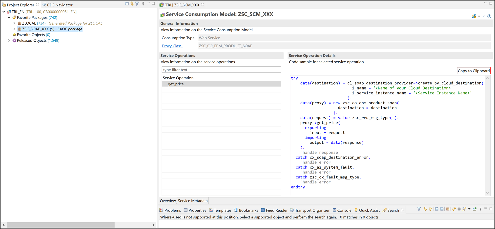

## Prerequisites  
- You need an SAP BTP, ABAP Environment [trial user](abap-environment-trial-onboarding) or a license.

## Details
### You will learn  
- How to save WSDL files
- How to create ABAP package
- How to create service consumption models
- How to create ABAP classes
- How to consume SOAP based web services

---
[ACCORDION-BEGIN [Step 1: ](Save WSDL file)]

  1. Save following code snippet as `EPM_Product_SOAP.WSDL`. This WSDL file will be used in the next steps.

    ```WSDL

    <wsdl:definitions xmlns:wsdl="http://schemas.xmlsoap.org/wsdl/" xmlns:xsd="http://www.w3.org/2001/XMLSchema" xmlns:soap="http://schemas.xmlsoap.org/wsdl/soap/" xmlns:wsoap12="http://schemas.xmlsoap.org/wsdl/soap12/" xmlns:http="http://schemas.xmlsoap.org/wsdl/http/" xmlns:mime="http://schemas.xmlsoap.org/wsdl/mime/" xmlns:tns="http://sap.com/EPM_PRODUCT_SOAP" xmlns:wsp="http://schemas.xmlsoap.org/ws/2004/09/policy" xmlns:wsu="http://docs.oasis-open.org/wss/2004/01/oasis-200401-wss-wssecurity-utility-1.0.xsd" targetNamespace="http://sap.com/EPM_PRODUCT_SOAP">
    <wsdl:documentation>
    <sidl:sidl xmlns:sidl="http://www.sap.com/2007/03/sidl"/>
    </wsdl:documentation>
    <wsp:UsingPolicy wsdl:required="true"/>
    <wsp:Policy wsu:Id="BN__EPM_Product_SOAP">
    <wsp:ExactlyOne>
    <wsp:All>
    <sapattahnd:Enabled xmlns:sapattahnd="http://www.sap.com/710/features/attachment/">false</sapattahnd:Enabled>
    <saptrnbnd:OptimizedMimeSerialization xmlns:saptrnbnd="http://schemas.xmlsoap.org/ws/2004/09/policy/optimizedmimeserialization" wsp:Optional="true"/>
    <wsaw:UsingAddressing xmlns:wsaw="http://www.w3.org/2006/05/addressing/wsdl" wsp:Optional="true"/>
    </wsp:All>
    <wsp:All>
    <sapattahnd:Enabled xmlns:sapattahnd="http://www.sap.com/710/features/attachment/">false</sapattahnd:Enabled>
    <saptrnbnd:OptimizedXMLTransfer xmlns:saptrnbnd="http://www.sap.com/webas/710/soap/features/transportbinding/" uri="http://xml.sap.com/2006/11/esi/esp/binxml" wsp:Optional="true"/>
    <wsaw:UsingAddressing xmlns:wsaw="http://www.w3.org/2006/05/addressing/wsdl" wsp:Optional="true"/>
    </wsp:All>
    </wsp:ExactlyOne>
    </wsp:Policy>
    <wsp:Policy wsu:Id="BN__EPM_Product_SOAP_soap12">
    <wsp:ExactlyOne>
    <wsp:All>
    <sapattahnd:Enabled xmlns:sapattahnd="http://www.sap.com/710/features/attachment/">false</sapattahnd:Enabled>
    <saptrnbnd:OptimizedMimeSerialization xmlns:saptrnbnd="http://schemas.xmlsoap.org/ws/2004/09/policy/optimizedmimeserialization" wsp:Optional="true"/>
    <wsaw:UsingAddressing xmlns:wsaw="http://www.w3.org/2006/05/addressing/wsdl" wsp:Optional="true"/>
    </wsp:All>
    <wsp:All>
    <sapattahnd:Enabled xmlns:sapattahnd="http://www.sap.com/710/features/attachment/">false</sapattahnd:Enabled>
    <saptrnbnd:OptimizedXMLTransfer xmlns:saptrnbnd="http://www.sap.com/webas/710/soap/features/transportbinding/" uri="http://xml.sap.com/2006/11/esi/esp/binxml" wsp:Optional="true"/>
    <wsaw:UsingAddressing xmlns:wsaw="http://www.w3.org/2006/05/addressing/wsdl" wsp:Optional="true"/>
    </wsp:All>
    </wsp:ExactlyOne>
    </wsp:Policy>
    <wsp:Policy wsu:Id="IF__EPM_Product_SOAP">
    <wsp:ExactlyOne>
    <wsp:All>
    <sapsession:Session xmlns:sapsession="http://www.sap.com/webas/630/soap/features/session/">
    <sapsession:enableSession>false</sapsession:enableSession>
    </sapsession:Session>
    <sapcentraladmin:CentralAdministration xmlns:sapcentraladmin="http://www.sap.com/webas/700/soap/features/CentralAdministration/" wsp:Optional="true">
    <sapcentraladmin:BusinessApplicationID>0050568C901D1ED79182D1F2706880F5</sapcentraladmin:BusinessApplicationID>
    </sapcentraladmin:CentralAdministration>
    </wsp:All>
    </wsp:ExactlyOne>
    </wsp:Policy>
    <wsp:Policy wsu:Id="OP__get_price">
    <wsp:ExactlyOne>
    <wsp:All>
    <saptrhnw05:required xmlns:saptrhnw05="http://www.sap.com/NW05/soap/features/transaction/">no</saptrhnw05:required>
    <sapcomhnd:enableCommit xmlns:sapcomhnd="http://www.sap.com/NW05/soap/features/commit/">false</sapcomhnd:enableCommit>
    <sapblock:enableBlocking xmlns:sapblock="http://www.sap.com/NW05/soap/features/blocking/">true</sapblock:enableBlocking>
    <saprmnw05:enableWSRM xmlns:saprmnw05="http://www.sap.com/NW05/soap/features/wsrm/">false</saprmnw05:enableWSRM>
    </wsp:All>
    </wsp:ExactlyOne>
    </wsp:Policy>
    <wsdl:types>
    <xsd:schema xmlns="http://sap.com/EPM_PRODUCT_SOAP" targetNamespace="http://sap.com/EPM_PRODUCT_SOAP">
    <xsd:element name="fault_msg_type">
    <xsd:complexType>
    <xsd:sequence>
    <xsd:element name="error_text" type="xsd:string"/>
    </xsd:sequence>
    </xsd:complexType>
    </xsd:element>
    <xsd:element name="req_msg_type" type="req_data_type"/>
    <xsd:element name="res_msg_type" type="res_data_type"/>
    <xsd:complexType name="req_data_type">
    <xsd:sequence>
    <xsd:element name="product">
    <xsd:simpleType>
    <xsd:restriction base="xsd:string">
    <xsd:length value="10"/>
    </xsd:restriction>
    </xsd:simpleType>
    </xsd:element>
    </xsd:sequence>
    </xsd:complexType>
    <xsd:complexType name="res_data_type">
    <xsd:sequence>
    <xsd:element name="price">
    <xsd:simpleType>
    <xsd:restriction base="xsd:decimal">
    <xsd:totalDigits value="15"/>
    <xsd:fractionDigits value="2"/>
    <xsd:maxInclusive value="9999999999999.99"/>
    <xsd:minInclusive value="0"/>
    </xsd:restriction>
    </xsd:simpleType>
    </xsd:element>
    <xsd:element name="currency">
    <xsd:simpleType>
    <xsd:restriction base="xsd:string">
    <xsd:length value="5"/>
    </xsd:restriction>
    </xsd:simpleType>
    </xsd:element>
    </xsd:sequence>
    </xsd:complexType>
    </xsd:schema>
    </wsdl:types>
    <wsdl:message name="req_msg_type">
    <wsdl:part name="req_msg_type" element="tns:req_msg_type"/>
    </wsdl:message>
    <wsdl:message name="res_msg_type">
    <wsdl:part name="res_msg_type" element="tns:res_msg_type"/>
    </wsdl:message>
    <wsdl:message name="fault_msg_type">
    <wsdl:part name="fault_msg_type" element="tns:fault_msg_type"/>
    </wsdl:message>
    <wsdl:portType name="EPM_Product_SOAP">
    <wsp:Policy>
    <wsp:PolicyReference URI="#IF__EPM_Product_SOAP"/>
    </wsp:Policy>
    <wsdl:operation name="get_price">
    <wsp:Policy>
    <wsp:PolicyReference URI="#OP__get_price"/>
    </wsp:Policy>
    <wsdl:input message="tns:req_msg_type"/>
    <wsdl:output message="tns:res_msg_type"/>
    <wsdl:fault name="fault_msg_type" message="tns:fault_msg_type"/>
    </wsdl:operation>
    </wsdl:portType>
    <wsdl:binding name="EPM_Product_SOAP" type="tns:EPM_Product_SOAP">
    <wsp:Policy>
    <wsp:PolicyReference URI="#BN__EPM_Product_SOAP"/>
    </wsp:Policy>
    <soap:binding transport="http://schemas.xmlsoap.org/soap/http" style="document"/>
    <wsdl:operation name="get_price">
    <soap:operation soapAction="http://sap.com/EPM_PRODUCT_SOAP/EPM_Product_SOAP/get_priceRequest" style="document"/>
    <wsdl:input>
    <soap:body use="literal"/>
    </wsdl:input>
    <wsdl:output>
    <soap:body use="literal"/>
    </wsdl:output>
    <wsdl:fault name="fault_msg_type">
    <soap:fault name="fault_msg_type" use="literal"/>
    </wsdl:fault>
    </wsdl:operation>
    </wsdl:binding>
    <wsdl:binding name="EPM_Product_SOAP_soap12" type="tns:EPM_Product_SOAP">
    <wsp:Policy>
    <wsp:PolicyReference URI="#BN__EPM_Product_SOAP_soap12"/>
    </wsp:Policy>
    <wsoap12:binding transport="http://schemas.xmlsoap.org/soap/http" style="document"/>
    <wsdl:operation name="get_price">
    <wsoap12:operation soapAction="http://sap.com/EPM_PRODUCT_SOAP/EPM_Product_SOAP/get_priceRequest" style="document"/>
    <wsdl:input>
    <wsoap12:body use="literal"/>
    </wsdl:input>
    <wsdl:output>
    <wsoap12:body use="literal"/>
    </wsdl:output>
    <wsdl:fault name="fault_msg_type">
    <wsoap12:fault name="fault_msg_type" use="literal"/>
    </wsdl:fault>
    </wsdl:operation>
    </wsdl:binding>
    <wsdl:service name="EPM_Product_SOAP">
    <wsdl:port name="EPM_Product_SOAP" binding="tns:EPM_Product_SOAP">
    <soap:address location="https://sapes5.sapdevcenter.com/sap/bc/srt/xip/sap/zepm_product_soap/002/epm_product_soap/epm_product_soap"/>
    </wsdl:port>
    <wsdl:port name="EPM_Product_SOAP_soap12" binding="tns:EPM_Product_SOAP_soap12">
    <wsoap12:address location="https://sapes5.sapdevcenter.com/sap/bc/srt/xip/sap/zepm_product_soap/002/epm_product_soap/epm_product_soap"/>
    </wsdl:port>
    </wsdl:service>
    </wsdl:definitions>
    ```     

[DONE]
[ACCORDION-END]

[ACCORDION-BEGIN [Step 2: ](Create ABAP package)]

  1.  Open Eclipse, logon to your trial account and right-click **`ZLOCAL`**, select **New** > **ABAP Package**.

      

  2. Create a new ABAP package:
       - Name: **`ZSC_SOAP_XXX`**
       - Description: **SOAP package**
       - `Superpackage`: `ZLOCAL`

     

      Click **Next >**.

  3. Click **Finish**.

      

      HINT: Everything should be created in the same package.

[DONE]
[ACCORDION-END]

[ACCORDION-BEGIN [Step 3: ](Create service consumption model)]

  1. Add your package `ZSC_SOAP_XXX` to **Favorite Packages** .

      

  2. Select your package `ZSC_SOAP_XXX` and right-click **New** > **Other ABAP Repository Object**.

      

  3. Select **Service Consumption Model**.

      

     Click **Next >**.


  4. Create a new service consumption model:
      - Name: **`ZSC_SCM_XXX`**
      - Description: **Service consumption model**
      - Remote Consumption Mode: **`Web Service`**


      

      Click **Next >**.

  5. Select `EPM_Product_SOAP.WSDL` as service metadata file and `ZSC_` as prefix. The prefix makes it easier to obtain unique ABAP names in the system, for all objects that are created.

      

      Click **Next >**.

  6. Click **Finish**.

      

  7. Open your service consumption model `ZSC_SCM_XXX` and **activate** it.

    

  8. In the Project Explorer you see all the dependent objects generated along with the Service Consumption Model. Your project explorer should look like following. If you don't see the changes yet, select your package `ZSC_SOAP_XXX` press `F5` to refresh.

      

  9. The web service has a single operation, for which a code snippet is presented. Click **Copy to Clipboard**.  

      


[DONE]
[ACCORDION-END]

[ACCORDION-BEGIN [Step 4: ](Consume web service)]

This step shows a simple example of a web service consumption.

  1. Right-click **Source Code Library** and select **New ABAP Class**.

    

  2. Create a new ABAP class:
      - Name: **`ZSC_CALL_SERVICE_XXX`**
      - Description: **Class to call service**

      

       Click **Next >**.

  3. Click **Finish**.

    

  4. Implement the interface `if_oo_adt_classrun`:

    ```ABAP
    CLASS zsc_call_service_xxx DEFINITION
      PUBLIC
      FINAL
      CREATE PUBLIC .

      PUBLIC SECTION.
        interfaces if_oo_adt_classrun.
      PROTECTED SECTION.
      PRIVATE SECTION.
    ENDCLASS.


    CLASS zsc_call_service_xxx IMPLEMENTATION.

     METHOD if_oo_adt_classrun~main.

     ENDMETHOD.
    ENDCLASS.
    ```   

  5. Paste the copied code snippet inside the main method.


  6. Adjust your code, change your `DATA(destination)` to:

      `DATA(destination) = cl_soap_destination_provider=>create_by_url( i_url = ).`

      The code snippet intends to use a destination from the destination service. In ABAP trial no destination service is available. Alternatively endpoint URL can be passed directly in coding.

  7. Open `EPM_Product_SOAP.WSDL`  and copy the endpoint URL.

      

      Add the endpoint URL to your destination:

      `data(destination) = cl_soap_destination_provider=>create_by_url( i_url = 'https://sapes5.sapdevcenter.com/sap/bc/srt/xip/sap/zepm_product_soap/002/epm_product_soap/epm_product_soap').`

      

  8. So far the request payload is empty. Provide a valid product to retrieve the price for, e.g. `HT-1000`:

    ```ABAP
    DATA(request) = VALUE zsc_req_msg_type( req_msg_type-product = 'HT-1000' ).
    ```

  9. Add the following line to output the response:

    ```ABAP
    out->write( |{ response-res_msg_type-price } { response-res_msg_type-currency }| ).
    ```   

     Save and activate.

 10. This should be your end result. Your code should look like this:

    ```ABAP
    CLASS zsc_call_service_xxx DEFINITION
      PUBLIC
      FINAL
      CREATE PUBLIC .

      PUBLIC SECTION.
        INTERFACES if_oo_adt_classrun.
      PROTECTED SECTION.
      PRIVATE SECTION.
    ENDCLASS.


    CLASS zsc_call_service_xxx IMPLEMENTATION.

      METHOD if_oo_adt_classrun~main.
        TRY.
            DATA(destination) = cl_soap_destination_provider=>create_by_url( i_url = 'https://sapes5.sapdevcenter.com/sap/bc/srt/xip/sap/zepm_product_soap/002/epm_product_soap/epm_product_soap').
            DATA(proxy) = NEW zsc_co_epm_product_soap(
                            destination = destination
                          ).
            DATA(request) = VALUE zsc_req_msg_type( req_msg_type-product = 'HT-1000' ).
            proxy->get_price(
              EXPORTING
                input = request
              IMPORTING
                output = DATA(response)
            ).
            out->write( |{ response-res_msg_type-price } { response-res_msg_type-currency }| ).

            "handle response
          CATCH cx_soap_destination_error.
            "handle error
          CATCH cx_ai_system_fault.
            "handle error
          CATCH zsc_cx_fault_msg_type.
            "handle error
        ENDTRY.

      ENDMETHOD.
    ENDCLASS.
    ```   

11. Save and activate your coding. Press `F9` to run your console application. The price should come back as a result.

    

[DONE]
[ACCORDION-END]


[ACCORDION-BEGIN [Step 5: ](Test yourself)]

[VALIDATE_1]
[ACCORDION-END]

## More Information
- [SAP Help Portal: Consuming a Web Service](https://help.sap.com/viewer/65de2977205c403bbc107264b8eccf4b/Cloud/en-US/8b6723b265d54c13866fbade4a7a087b.html)

---

<p style="text-align: center;">Give us 55 seconds of your time to help us improve</p>

<p style="text-align: center;"><a href="https://sapinsights.eu.qualtrics.com/jfe/form/SV_0im30RgTkbEEHMV?TutorialID=abap-environment-deploy-cf-production" target="_blank"></a></p>
