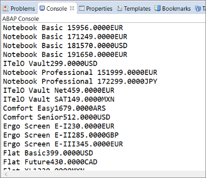

## Prerequisites
- **IMPORTANT**: This tutorial cannot be completed on a trial account
- **IMPORTANT**: This tutorial is part of the mission [Connect Your On-Premise System with SAP BTP, ABAP Environment](mission.abap-env-connect-onpremise). Please work through the previous tutorials in the mission first; otherwise this tutorial may not work

## Details
### You will learn
  - How to call a BAPI using RFC in an ABAP class
  - How to test this class by outputting the data to the ABAP Console

The class:

1. Connects to the backend system, here an ERP System.
2. Calls the BAPI remotely via RFC.
3. Reads the data from the back end into a local table.
4. Outputs that local table to the ABAP Console.

In future, we hope to provide a helper class that generates the appropriate DDL source code for a custom entity and associated type definition - for any BAPI in your backend system. In the meantime, I have provided all the necessary code to use with `BAPI_EPM_PRODUCT_GET_LIST` and `BAPI_EPM_PRODUCT_GET_DETAIL`.

---

[ACCORDION-BEGIN [Step 1: ](Create an ABAP class)]
1. As before, in the Package Explorer, select your package and choose **New > ABAP Class** from the context menu.

2. Enter a name and description for your class, e.g. `ZCL_OUTPUT_TEST_XXX` and choose Next. **Remember to change `XXX` to your group number**.

3. Choose or create a transport request, then choose Finish.

The class is displayed in a new editor.

[DONE]
[ACCORDION-END]

[ACCORDION-BEGIN [Step 2: ](Add an INTERFACES statement)]
Add the following `interfaces` statement to the public section:

```ABAP
PUBLIC SECTION.
  INTERFACES if_oo_adt_classrun.
PRIVATE SECTION.
```
This enables you to run the class in the console.


[DONE]
[ACCORDION-END]


[ACCORDION-BEGIN [Step 3: ](Define the type for the local table variable)]
First you need to define the table type for the local table that will be filled with the data:

```ABAP

TYPES : BEGIN OF ty_bapi_epm_product_header,
          productid     TYPE c LENGTH 10,
          typecode      TYPE c LENGTH 2,
          category      TYPE c LENGTH 40,
          name          TYPE c LENGTH 255,
          description   TYPE c LENGTH 255,
          supplierid    TYPE c LENGTH 10,
          suppliername  TYPE c LENGTH 80,
          taxtarifcode  TYPE int1,
          measureunit   TYPE c LENGTH 3,
          weightmeasure TYPE p LENGTH 7 DECIMALS 3,
          weightunit    TYPE c LENGTH 3,
          price         TYPE p LENGTH 12 DECIMALS 4,
          currencycode  TYPE c LENGTH 5,
          width         TYPE p LENGTH 7 DECIMALS 3,
          depth         TYPE p LENGTH 7 DECIMALS 3,
          height        TYPE p LENGTH 7 DECIMALS 3,
          dimunit       TYPE c LENGTH 3,
          productpicurl TYPE c LENGTH 255,
        END OF ty_bapi_epm_product_header.

```

[DONE]
[ACCORDION-END]

[ACCORDION-BEGIN [Step 4: ](Create a TRY...CATCH block)]
Since you are trying to connect to a remote system, you need to catch any exceptions that occur.


```ABAP

TRY.

CATCH cx_root INTO DATA(lx_root).
  out->write(  lx_root->get_longtext( ) ).

ENDTRY.


```


[DONE]
[ACCORDION-END]

[ACCORDION-BEGIN [Step 5: ](Set up the connection)]
Define the connection, replacing `XXX` in both `i_name` and `i_service_instance_name`.

```ABAP

DATA(lo_rfc_dest) = cl_rfc_destination_provider=>create_by_cloud_destination(
                    i_name = |ES5_RFC_XXX|

                       ).

DATA(lv_rfc_dest_name) = lo_rfc_dest->get_destination_name( ).

```

[DONE]
[ACCORDION-END]

[ACCORDION-BEGIN [Step 6: ](Define some variables)]
Define the variables for the local internal table and structure for the data; and a character-type variable for messages:

```ABAP

DATA lt_product TYPE STANDARD TABLE OF  ty_bapi_epm_product_header.
DATA ls_product TYPE ty_bapi_epm_product_header.
DATA msg TYPE c LENGTH 255.

```


[DONE]
[ACCORDION-END]

[ACCORDION-BEGIN [Step 7: ](Call the BAPI)]
Finally, call the remote BAPI. The exception handling is mandatory to avoid serious system errors:

```ABAP

CALL FUNCTION 'BAPI_EPM_PRODUCT_GET_LIST'
  DESTINATION lv_rfc_dest_name
*   EXPORTING
*     max_rows              = 25
    TABLES
      headerdata            = lt_product
    EXCEPTIONS
      system_failure        = 1 MESSAGE msg
      communication_failure = 2 MESSAGE msg
      OTHERS                = 3.

```


[DONE]
[ACCORDION-END]

[ACCORDION-BEGIN [Step 8: ](Add the exception handling statements)]
Handle any exceptions that occur using a CASE statement.

```ABAP

CASE sy-subrc.
  WHEN 0.
    LOOP AT lt_product INTO ls_product.
      out->write( ls_product-name && ls_product-price && ls_product-currencycode ).
    ENDLOOP.
  WHEN 1.
    out->write( |EXCEPTION SYSTEM_FAILURE | && msg ).
  WHEN 2.
    out->write( |EXCEPTION COMMUNICATION_FAILURE | && msg ).
  WHEN 3.
    out->write( |EXCEPTION OTHERS| ).
ENDCASE.

```

[DONE]
[ACCORDION-END]

[ACCORDION-BEGIN [Step 9: ](Save and activate the class)]


[DONE]
[ACCORDION-END]

[ACCORDION-BEGIN [Step 10: ](Check your code)]

```ABAP

CLASS zjp_out_test DEFINITION
  PUBLIC
  FINAL
  CREATE PUBLIC .

  PUBLIC SECTION.
     INTERFACES if_oo_adt_classrun.
  PROTECTED SECTION.
  PRIVATE SECTION.
ENDCLASS.


CLASS zjp_out_test IMPLEMENTATION.

  METHOD if_oo_adt_classrun~main.


    " ABAP source code for type definition for BAPI_EPM_PRODUCT_HEADER
    " generated on: ...

    TYPES : BEGIN OF ty_bapi_epm_product_header,
              productid     TYPE c LENGTH 10,
              typecode      TYPE c LENGTH 2,
              category      TYPE c LENGTH 40,
              name          TYPE c LENGTH 255,
              description   TYPE c LENGTH 255,
              supplierid    TYPE c LENGTH 10,
              suppliername  TYPE c LENGTH 80,
              taxtarifcode  TYPE int1,
              measureunit   TYPE c LENGTH 3,
              weightmeasure TYPE p LENGTH 7 DECIMALS 3,
              weightunit    TYPE c LENGTH 3,
              price         TYPE p LENGTH 12 DECIMALS 4,
              currencycode  TYPE c LENGTH 5,
              width         TYPE p LENGTH 7 DECIMALS 3,
              depth         TYPE p LENGTH 7 DECIMALS 3,
              height        TYPE p LENGTH 7 DECIMALS 3,
              dimunit       TYPE c LENGTH 3,
              productpicurl TYPE c LENGTH 255,
            END OF ty_bapi_epm_product_header.

    TRY.

        DATA(lo_rfc_dest) = cl_rfc_destination_provider=>create_by_cloud_destination(
          i_name = |ES5_RFC_XXX|
          ).
        DATA(lv_rfc_dest_name) = lo_rfc_dest->get_destination_name( ).


        "variables needed to call BAPI

        DATA lt_product TYPE STANDARD TABLE OF  ty_bapi_epm_product_header.
        DATA ls_product TYPE ty_bapi_epm_product_header.
        DATA msg TYPE c LENGTH 255.

        "Exception handling is mandatory to avoid dumps
        CALL FUNCTION 'BAPI_EPM_PRODUCT_GET_LIST'
          DESTINATION lv_rfc_dest_name
          EXPORTING
             max_rows              = 25
          TABLES
            headerdata            = lt_product
          EXCEPTIONS
            system_failure        = 1 MESSAGE msg
            communication_failure = 2 MESSAGE msg
            OTHERS                = 3.

        CASE sy-subrc.
          WHEN 0.
            LOOP AT lt_product INTO ls_product.
              out->write( ls_product-name && ls_product-price && ls_product-currencycode ).
            ENDLOOP.
          WHEN 1.
            out->write( |EXCEPTION SYSTEM_FAILURE | && msg ).
          WHEN 2.
            out->write( |EXCEPTION COMMUNICATION_FAILURE | && msg ).
          WHEN 3.
            out->write( |EXCEPTION OTHERS| ).
        ENDCASE.

      CATCH cx_root INTO DATA(lx_root).
        out->write(  lx_root->get_longtext( ) ).

    ENDTRY.
  ENDMETHOD.
ENDCLASS.

```


[DONE]
[ACCORDION-END]

[ACCORDION-BEGIN [Step 11: ](Test the class in the ABAP Console)]
Test the class in the ABAP Console by choosing **`F9`**.
Your output should look like this:



[DONE]
[ACCORDION-END]

[ACCORDION-BEGIN [Step 12: ](Test yourself)]

[VALIDATE_1]
[ACCORDION-END]

[ACCORDION-BEGIN [Step 13: ](Troubleshooting the SAP Cloud Connector)]
Note: If your on-premise system is down, or you have made an error configuring the connectivity, you will get a misleading message

```
EXCEPTION COMMUNICATION_FAILURE
Error when opening an RFC connection
(User is locked; notify the person responsible).

```

Check the following :

- Audits in the Cloud Connector (after a simulated RFC call): Should be empty
- Trace in the Cloud Connector (after a simulated RFC call): Should be empty
- Function Module is listed as an accessible resource in Cloud Connector
- Internal Host is reachable in Cloud Connector
- Correct NEO Subaccount is configured in Cloud Connector
- Destination Service Communication Arrangement `SAP_COM_0276` is configured
- Communication Arrangement `SAP_COM_0200` is configured

[DONE]
[ACCORDION-END]


---
