## Prerequisites  
- You need an SAP Cloud Platform ABAP Environment [trial user](abap-environment-trial-onboarding) or a license.

## Details
### You will learn  
- How to add UI annotation for detail screen
- How to add UI annotation for list screen
- How to connect to text tables
- How to add separate text tables

The last tutorial showed how to create a very simple maintenance business object using a single database table. As seen the application the UI was still empty not showing any table columns or input fields.

This tutorial is going to explain how to extend the BO with UI annotations. By adding UI annotations the UI will be defined.

You'll learn how to define the annotations for the detail screen. This screen is used for creating new objects and showing the full details of the underlying records. Furthermore you'll learn how you can define the columns in the search result list. After completing both sections, you should have a running application for maintaining the database table.


---
[ACCORDION-BEGIN [Step 1: ](Add UI annotation for detail screen)]

  1. Open CDS view **`ZCAL_I_HOLIDAY_XXX`** and create the facet-hierarchy. Add the annotation **`@UI.facet: []`** at the beginning of the body. Define the type hierarchy as follows:  

    ```ABAP
     @UI.facet: [
             {
               id: 'PublicHoliday',
               label: 'Public Holiday',
               type: #COLLECTION,
               position: 1
             },
             {
               id: 'General',
               parentId: 'PublicHoliday',
               label: 'General Data',
               type: #FIELDGROUP_REFERENCE,
               targetQualifier: 'General',
               position: 1
             }]
    ```

    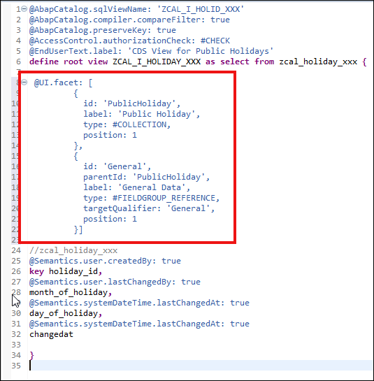

      Save and activate.

      The UI will still be empty as no fields have been added to any facet.  

  2. Now add following annotations to your CDS view:

    ```ABAP
      @UI.fieldGroup: [ { qualifier: 'General', position: 1 } ]
      @UI.lineItem:   [ { position: 1 } ]
    ```

    Your complete code should look like following:

    ```ABAP
    @AbapCatalog.sqlViewName: 'ZCAL_I_HOLID_XXX'
    @AbapCatalog.compiler.compareFilter: true
    @AbapCatalog.preserveKey: true
    @AccessControl.authorizationCheck: #CHECK
    @EndUserText.label: 'CDS View for Public Holidays'
    define root view ZCAL_I_HOLIDAY_XXX as select from zcal_holiday_xxx {

      @UI.facet: [
            {
              id: 'PublicHoliday',
              label: 'Public Holiday',
              type: #COLLECTION,
              position: 1
            },
            {
              id: 'General',
              parentId: 'PublicHoliday',
              label: 'General Data',
              type: #FIELDGROUP_REFERENCE,
              targetQualifier: 'General',
              position: 1
            }]


        @UI.fieldGroup: [ { qualifier: 'General', position: 1 } ]
        @UI.lineItem:   [ { position: 1 } ]
        key holiday_id,

        @UI.fieldGroup: [ { qualifier: 'General', position: 2 } ]
        @UI.lineItem:   [ { position: 2 } ]
        month_of_holiday,

        @UI.fieldGroup: [ { qualifier: 'General', position: 3 } ]
        @UI.lineItem:   [ { position: 3 } ]
        day_of_holiday,
        changedat,
        configdeprecationcode
    }

    ```

  3. Switch to your service binding and open the preview.
     Now you're able to see the columns.

      

  4. Click **Create**.
     Now you see following:

      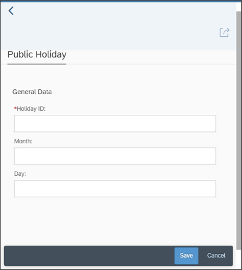

     As you can see on the screenshot, the UI is already usable. If you want, you can already create your first test data now. The data can already be saved and searched, but the search result list does not yet contain any columns.

 5. Add following data to create your first entry:

      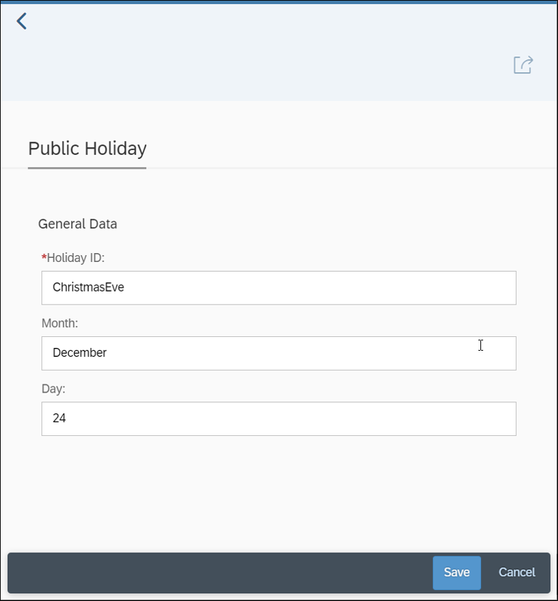

      Click **Save**.

[DONE]
[ACCORDION-END]

[ACCORDION-BEGIN [Step 2: ](Add UI annotation for list screen)]

Now we want to add the column definition. Therefore we need to add the  **`@UI.lineItem`** annotation before each column. For each column you can define the position and the label.

  1. Open your CDS View **`ZCAL_I_HOLIDAY_XXX`**. Add the **`@UI.lineItem`** annotation for all fields you want to display in the overview/search result table. Finally the annotations will look as following:

    ```ABAP
     @UI.fieldGroup: [ { qualifier: 'General', position: 1 } ]
     @UI.lineItem:   [ { position: 1 } ]
      key holiday_id,
      
     @UI.fieldGroup: [ { qualifier: 'General', position: 2 } ]
     @UI.lineItem:   [ { position: 2 } ]
      month_of_holiday,
      
     @UI.fieldGroup: [ { qualifier: 'General', position: 3 } ]
     @UI.lineItem:   [ { position: 3 } ]
      day_of_holiday,

    ```

  2. Save, activate and test your business object.

  3. Add header information to **`ZCAL_I_HOLIDAY_XXX`**

    ```ABAP
    @UI: {
    headerInfo: {
      typeName: 'Holiday',
      typeNamePlural: 'Holidays',
      title: {
        type: #STANDARD,
        value: 'holiday_id'
        }
      }
    }

    ```

    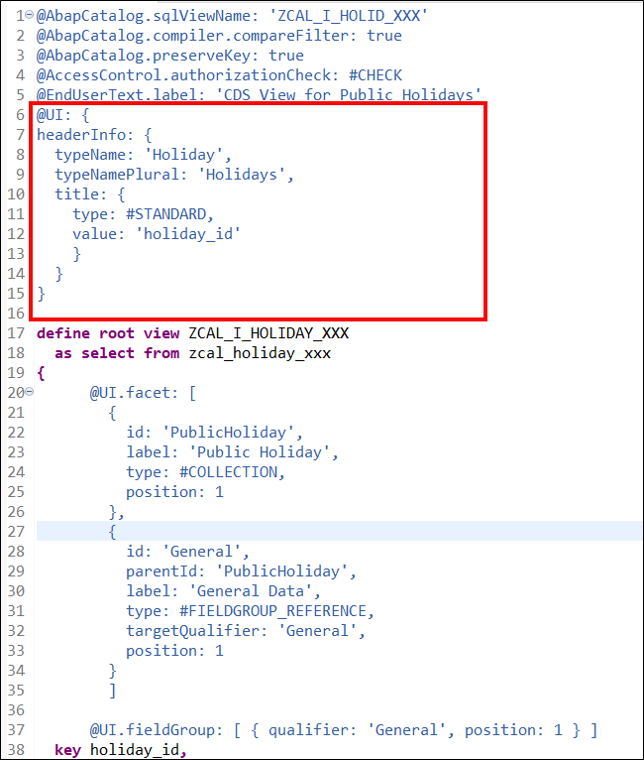

[DONE]
[ACCORDION-END]

[ACCORDION-BEGIN [Step 3: ](Connect to text tables)]

Many business configuration objects use text tables for providing translatable applications. Texts are maintained in the user-logon language and in secondary languages. In business configuration apps texts are maintained with the root entity and stored in text tables. Texts in other languages are maintained separately in a table.

  1. Right-click on your data definition **`ZCAL_I_HOLIDAY_XXX`** and select **New Data Definition**.

      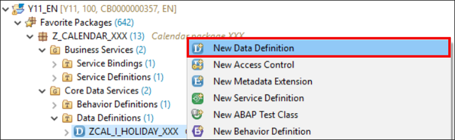

  2. Create a data definition:
     - Name: **`ZCAL_I_HOLITXT_XXX `**
     - Description: **`CDS View for Holiday Text Table`**

      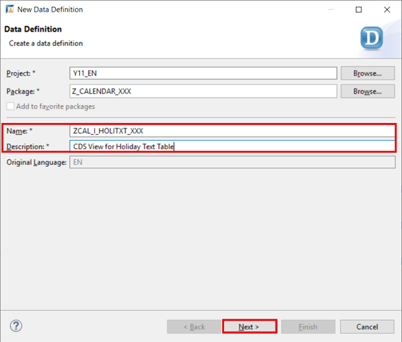

      Click **Next >**.

  3. Select **Define View with To-Parent Association** and click **Finish**.

      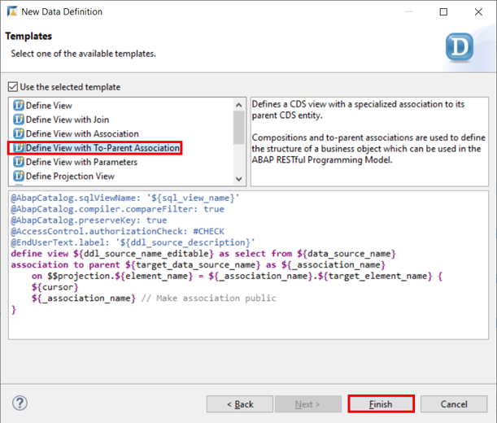

  4. Replace your code with following:

    ```ABAP
    @AbapCatalog.sqlViewName: 'ZI_HOLITXTXXX'
    @AbapCatalog.compiler.compareFilter: true
    @AbapCatalog.preserveKey: true
    @AccessControl.authorizationCheck: #CHECK
    @EndUserText.label: 'CDS View for Public Holidays Text Table'
    @UI: {
    headerInfo: {
      typeName: 'Translation',
      typeNamePlural: 'Translations',
      title: {
        type: #STANDARD,
        value: 'spras'
        }
      }
    }

    define view ZCAL_I_HOLITXT_XXX
      as select from zcal_holitxt_xxx
      association to parent ZCAL_I_HOLIDAY_XXX as _PublicHoliday on $projection.holiday_id = _PublicHoliday.holiday_id
    {
          //zcal_holitxt_xxx
      key spras,
      key holiday_id,
          fcal_description,
          _PublicHoliday
    }

    ```

  5. Save and activate.

  6. Switch to your CDS view **`ZCAL_I_HOLIDAY_XXX`** and add the composition to the text node.
     Enter `composition [0..*] of ZCAL_I_HOLITXT_XXX as _HolidayTxt` after the select clause.

      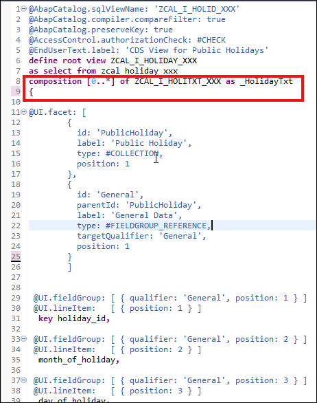

  7. Add a comma after **`configdeprecationcode`** and add **`_HolidayTxt`** underneath.

      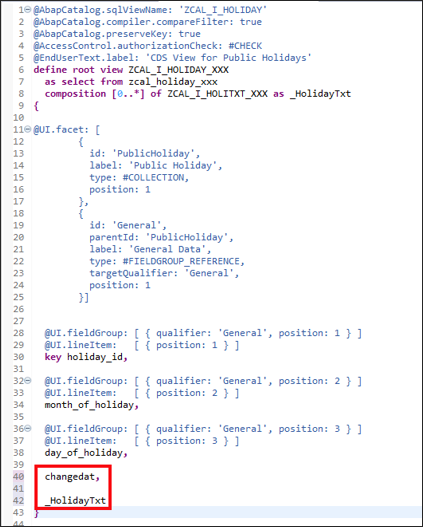

  8. Save and activate.

  9. Open your behavior definition **`ZCAL_I_HOLIDAY_XXX`** and add following behavior definition:

      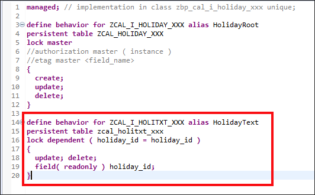

  10. Save and activate.

  11. Check your result. Your code should look like following:

    ```ABAP
    managed; // implementation in class zbp_cal_i_holiday_xxx unique;

    define behavior for ZCAL_I_HOLIDAY_XXX alias HolidayRoot
    persistent table ZCAL_HOLIDAY_XXX
    lock master
    //authorization master ( instance )
    //etag master <field_name>
    {
      create;
      update;
      delete;
    }

    define behavior for ZCAL_I_HOLITXT_XXX alias HolidayText
    persistent table zcal_holitxt_xxx
    lock dependent by _PublicHoliday
    {
      update; delete;
      field( readonly ) holiday_id;
    }

    ```

  12. Open your service definition **`ZCAL_I_HOLIDAY_SD_XXX`** and add following:

    ```ABAP
    expose ZCAL_I_HOLITXT_XXX as HolidayText;
    ```

      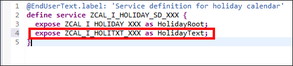

  13. Save and activate.

  14. Check your result. Your code should look like following:

    ```ABAP
    @EndUserText.label: 'Service definition for holiday calendar'
    define service ZCAL_I_HOLIDAY_SD_XXX {
      expose ZCAL_I_HOLIDAY_XXX as HolidayRoot;
      expose ZCAL_I_HOLITXT_XXX as HolidayText;
    }

    ```

[DONE]
[ACCORDION-END]

[ACCORDION-BEGIN [Step 4: ](Add separate text tables)]

  1. Open your root view **`ZCAL_I_HOLIDAY_XXX`**. Add a comma and following code into the corresponding place:

    ```ABAP
    {
            id: 'Translation',
            label: 'Translation',
            type: #LINEITEM_REFERENCE,
            position: 3,
            targetElement: '_HolidayTxt'
          }
    ```

      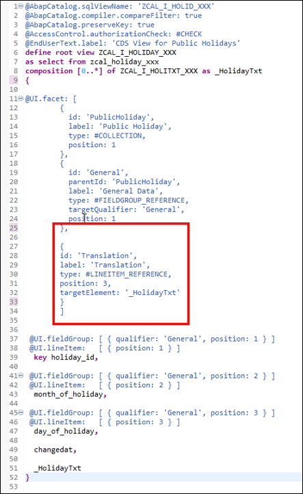

  2. Save and activate.

  3.  Open **`ZCAL_I_HOLITXT_XXX`** and add line items

    ```ABAP
     @UI.lineItem: [{ position: 1 }]
     @UI.lineItem: [{ position: 2, label: 'Translation' }]
    ```

      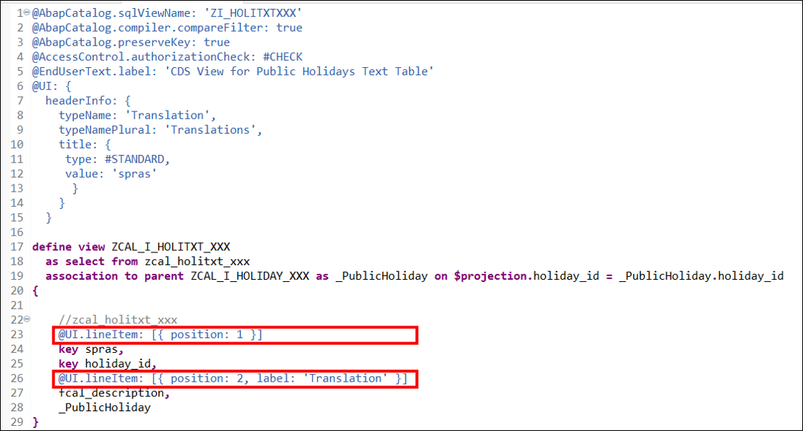

    Save and activate.

  4. Open your service binding **`ZCAL_I_HOLIDAY_XXX`**. Select **`to_HolidayRoot`** and open the preview. In your preview open one entry. Your overview should look like following:

      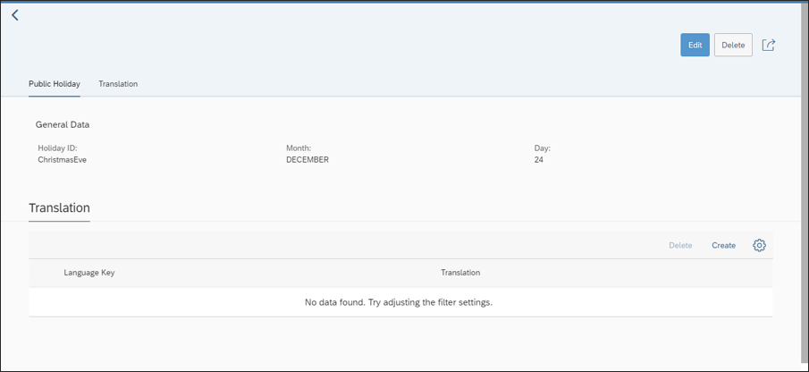


  5. Add the UI facet to **`ZCAL_I_HOLITXT_XXX`**.

    ```ABAP
     @UI.facet: [
          {
            id: 'HolidayText',
            label: 'Translation',
            targetQualifier: 'Translation',
            type: #FIELDGROUP_REFERENCE,
            position: 1
          }
        ]

    ```

    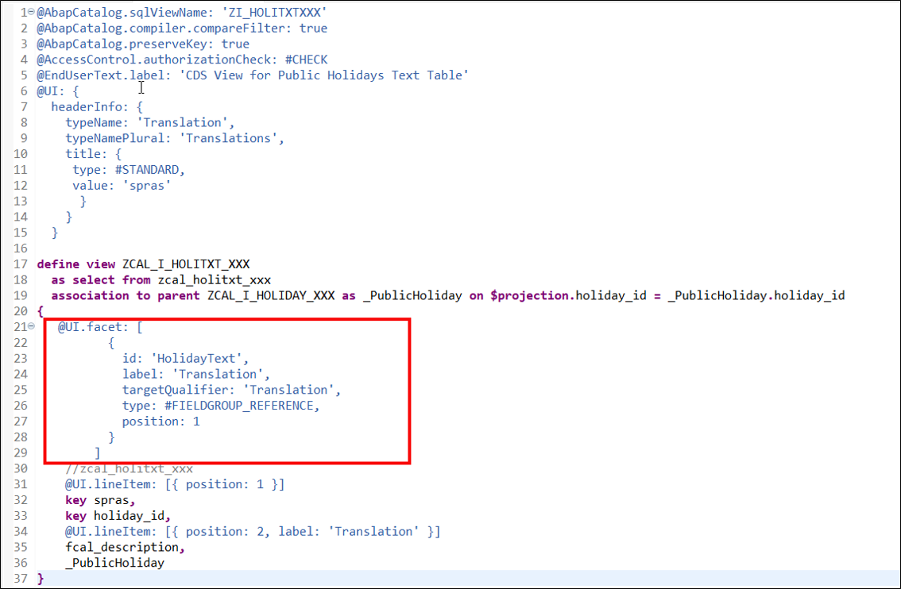

  6. Let's now continue and directly add the annotations for table display. Open your text table CDS view **`ZCAL_I_HOLITXT_XXX`**.

    ```ABAP
    @UI.fieldGroup: [{ position: 1,
                        qualifier: 'Translation',
                        label: 'Language Key'}]
    @UI.lineItem: [{ position: 1 }]
    key spras,
    key holiday_id,
    @UI.fieldGroup: [{ position: 2,
                        qualifier: 'Translation',
                        label: 'Translated Text' }]
    @UI.lineItem: [{ position: 2, label: 'Translation' }]
    fcal_description,
    _PublicHoliday  
    ```

      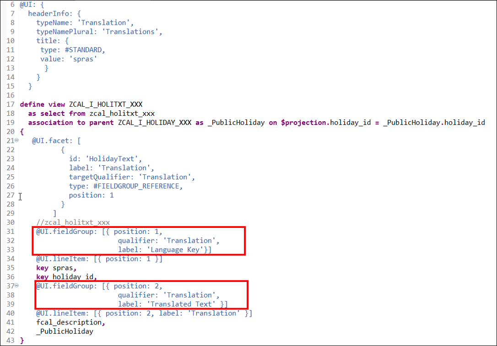

  7. Save and activate.

  8. Open your service binding **`ZCAL_I_HOLIDAY_XXX`**, deactivate and activate your service again. Open your preview again by selecting **`to_HolidayTxt`** in your service binding. Open one entry and add a new translation by selecting **Create**. Now you can add the Italian translation and click **Save**.

      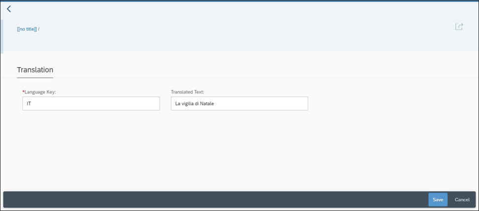


 11. Open view **`ZCAL_I_HOLITXT_XXX`**. Add annotation **`@Consumption.valueHelpDefinition`** to field **`SPRAS`**. Use search help `I_Language`.

    ```ABAP
     @Consumption.valueHelpDefinition: [
      {entity: {name: 'I_Language', element: 'Language' }}
     ]
       key spras,
    ```
      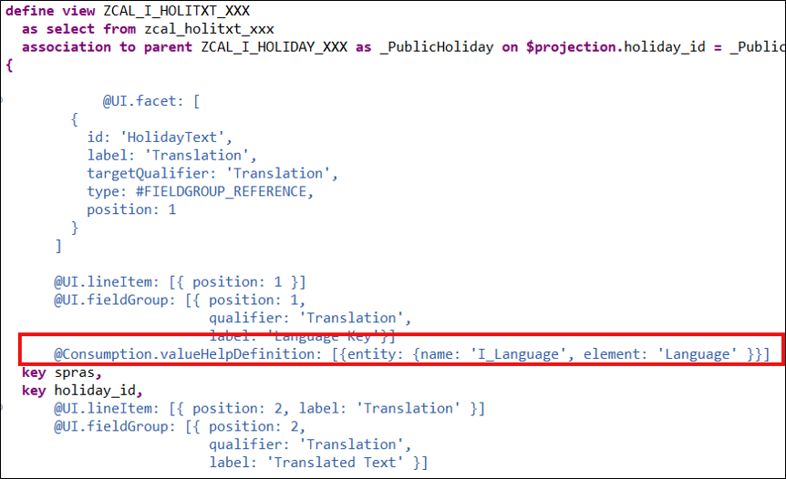

 11. Save and activate.

 12. Check your result. Your code should look like this:

    ```ABAP
    @AbapCatalog.sqlViewName: 'ZI_HOLITXTXXX'
    @AbapCatalog.compiler.compareFilter: true
    @AbapCatalog.preserveKey: true
    @AccessControl.authorizationCheck: #CHECK
    @EndUserText.label: 'CDS View for Public Holidays Text Table'
    @UI: {
      headerInfo: {
        typeName: 'Translation',
        typeNamePlural: 'Translations',
        title: {
         type: #STANDARD,
         value: 'spras'
          }
        }
      }

    define view ZCAL_I_HOLITXT_XXX
      as select from zcal_holitxt_xxx
      association to parent ZCAL_I_HOLIDAY_XXX as _PublicHoliday on $projection.holiday_id = _PublicHoliday.holiday_id
    {
       @UI.facet: [
              {
                id: 'HolidayText',
                label: 'Translation',
                targetQualifier: 'Translation',
                type: #FIELDGROUP_REFERENCE,
                position: 1
              }
            ]
        //zcal_holitxt_xxx
        @UI.fieldGroup: [{ position: 1,
                            qualifier: 'Translation',
                            label: 'Language Key'}]
        @UI.lineItem: [{ position: 1 }]
        @Consumption.valueHelpDefinition: [{entity: {name: 'I_Language', element: 'Language' }}]            
        key spras,
        key holiday_id,
        @UI.fieldGroup: [{ position: 2,
                            qualifier: 'Translation',
                            label: 'Translated Text' }]
        @UI.lineItem: [{ position: 2, label: 'Translation' }]
        fcal_description,
        _PublicHoliday  
    }
    ```

[DONE]
[ACCORDION-END]

[ACCORDION-BEGIN [Step 5: ](Test yourself)]

[VALIDATE_1]
[ACCORDION-END]
---
