## Prerequisites  
- You need an SAP BTP, ABAP environment [trial user](abap-environment-trial-onboarding) or a license.

## Details
### You will learn  
- How to create detail page
- How to add additional UI annotations
- How to create CDS views for text table
- How to create behavior definition for text table
- How to add UI annotation for text table
- How to link the default description to the root entity


The last tutorial showed how to create a very simple maintenance business object using a single database table. As seen the application the UI was still empty not showing any table columns or input fields.

This tutorial is going to explain how to extend the BO with UI annotations. By adding UI annotations the UI will be defined.

You'll learn how to define the annotations for the detail screen. This screen is used for creating new objects and showing the full details of the underlying records. Furthermore you'll learn how you can define the columns in the search result list. After completing both sections, you should have a running application for maintaining the database table.

>Hint: Typically UI annotations are maintained in a metadata extension object, however it is also possible to maintain them directly in the projection CDS View.
More information about defining CDS annotations for metadata-driven UIs can be found [here](https://help.sap.com/viewer/923180ddb98240829d935862025004d6/Cloud/en-US/9b4aa865c1e84634b6e105173fc3a5e7.html)

---


[ACCORDION-BEGIN [Step 1: ](Create detail page)]

  1. Right-click on the data definition folder in your project explorer, select **New** > **New Metadata Extension**.  

    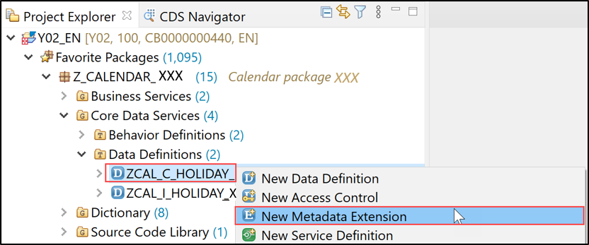

  2. Create a new metadata extension:
      - Name: **`ZCAL_C_HOLIDAY_XXX`**
      - Description: Public Holiday UI extension

      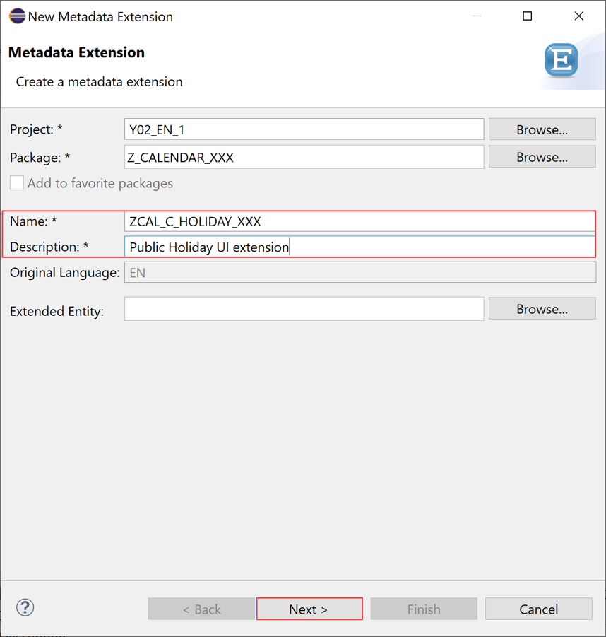

     Click **Next >**.

  3. Click **Next >**.

      

  4. Select **Annotate View** and click **Finish**.

      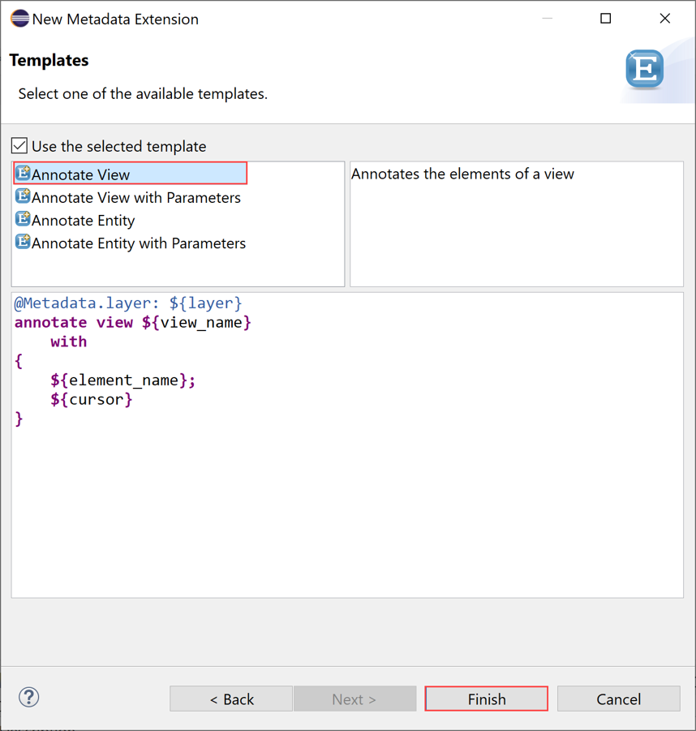

  5. Enter **`#CORE`** for **`@Metadata.layer`**, **`ZCAL_C_HOLIDAY_XXX`** for annotate view and insert all element with **`CTRL` + Space**.

      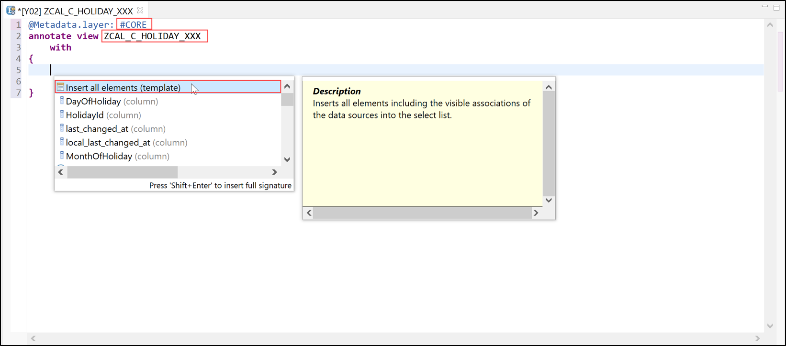

  6. Create the facet hierarchy and annotate the fields in the element list:

    ```ABAP
    @Metadata.layer: #CORE
    annotate view ZCAL_C_HOLIDAY_XXX
       with
    {
     @UI.facet: [
       {
         id: 'PublicHoliday',
         purpose: #STANDARD,
         label: 'Public Holiday',
         type: #IDENTIFICATION_REFERENCE,
         position: 1
       }]

     @UI: {  identification: [ { position: 1 } ],
             lineItem:       [ { position: 1 } ] }
     HolidayId;
     @UI: {  identification: [ { position: 2 } ],
             lineItem:       [ { position: 2 } ] }
     MonthOfHoliday;
     @UI: {  identification: [ { position: 3 } ],
             lineItem:       [ { position: 3 } ] }
     DayOfHoliday;
     @UI.hidden: true
     last_changed_at;
     @UI.hidden: true
     local_last_changed_at;

    }
    ```

  7. Save and activate. Restart your application, now you can see a list of your configuration entries. Therefore open `HolidayRoot` in your service binding.

  8. Click **Create**.

    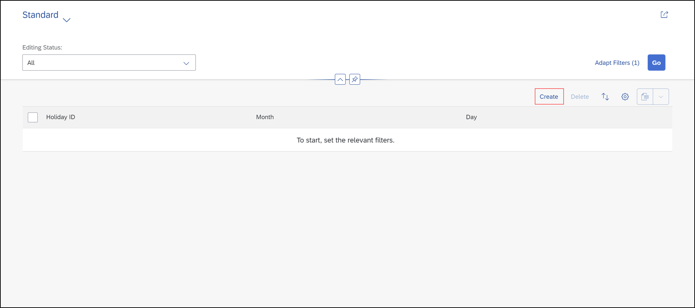

  9. Create a new entry:
     - Name: Christmas

      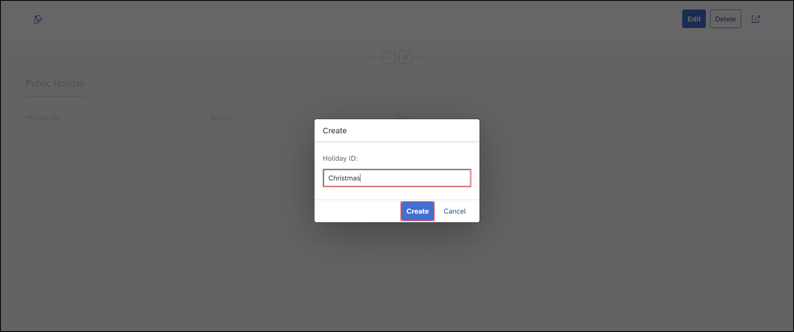

      Click **Create**.

  10. Fill out the other fields and click on **Save**.

    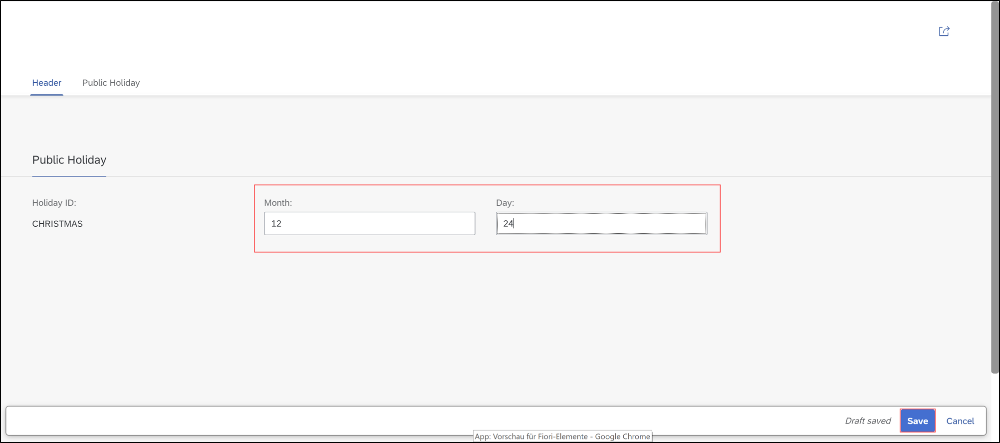

[DONE]
[ACCORDION-END]

[ACCORDION-BEGIN [Step 2: ](Add additional UI annotations)]

  1. Open the metadata extension **`ZCAL_C_HOLIDAY_XXX`** to edit it.  

  2. To enable column `HolidayId` as a search field, add the annotation `@Search.searchable: true` to the Metadata extension object and `@Search.defaultSearchElement: true` to the field `HolidayId`.

    ```ABAP
    @Search.searchable: true
    ```

    ```ABAP
    @Search.defaultSearchElement: true
    HolidayId;
    ```

  3. Add header information to display a proper page title
  Sorting the list result can be done by using the annotation `presentationVariant` in the header.

    ```ABAP
    presentationVariant: [{ sortOrder: [{ by: 'HolidayId', direction:  #ASC }] }] }
    ```

  4. Your code should look like this:

    ```ABAP
    @Metadata.layer: #CORE
    @Search.searchable: true
    @UI: {
      headerInfo: { typeName: 'Public Holiday',
                    typeNamePlural: 'Public Holidays',
                    title: { type: #STANDARD, label: 'Public Holiday', value: 'HolidayId' } },
      presentationVariant: [{ sortOrder: [{ by: 'HolidayId', direction:  #ASC }] }] }
    annotate view ZCAL_C_HOLIDAY_XXX with
    {
      @UI.facet: [
        {
          id: 'PublicHoliday',
          purpose: #STANDARD,
          label: 'Public Holiday',
          type: #IDENTIFICATION_REFERENCE,
          position: 1
        }]

      @UI: {  identification: [ { position: 1 } ],
              lineItem:       [ { position: 1 } ] }
      @Search.defaultSearchElement: true
      HolidayId;
      @UI: {  identification: [ { position: 2 } ],
              lineItem:       [ { position: 2 } ] }
      MonthOfHoliday;
      @UI: {  identification: [ { position: 3 } ],
              lineItem:       [ { position: 3 } ] }
      DayOfHoliday;
      @UI.hidden: true
      last_changed_at;
      @UI.hidden: true
      local_last_changed_at;

    }
    ```

  5. Save and activate.

  6. Restart your application to see the changes in the UI. If you are getting a dump in the preview, make sure that all objects have been activated.

  7. Check your result.

    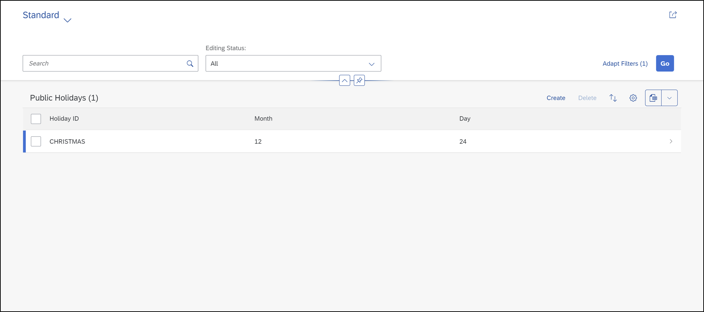

[DONE]
[ACCORDION-END]

[ACCORDION-BEGIN [Step 3: ](Create CDS views for text table)]

  1. In the project explorer, right-click on **Data Definitions** and select **New** > **Data Definition**.   

    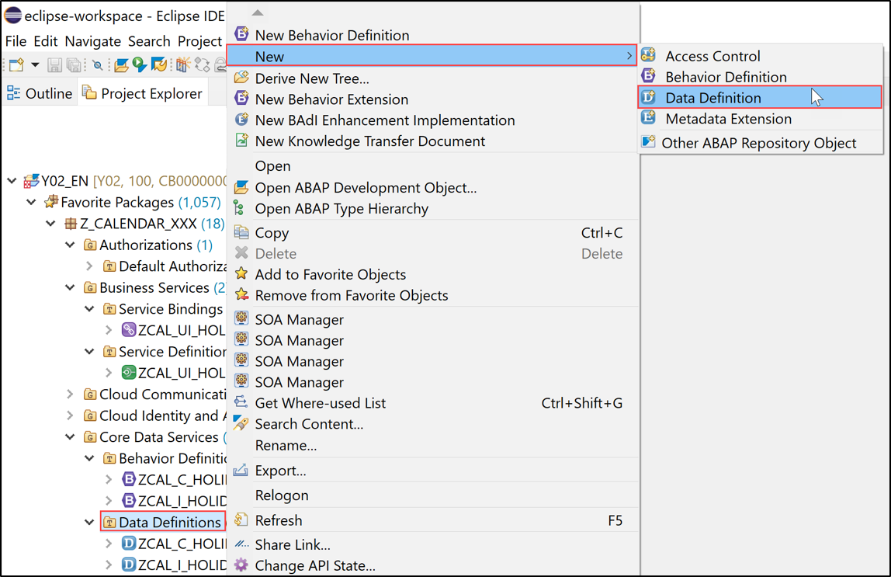

  2. Create a new data definition:
    - Name: **`ZCAL_I_HOLIDAYTXT_XXX`**
    - Description: CDS View for holiday text

      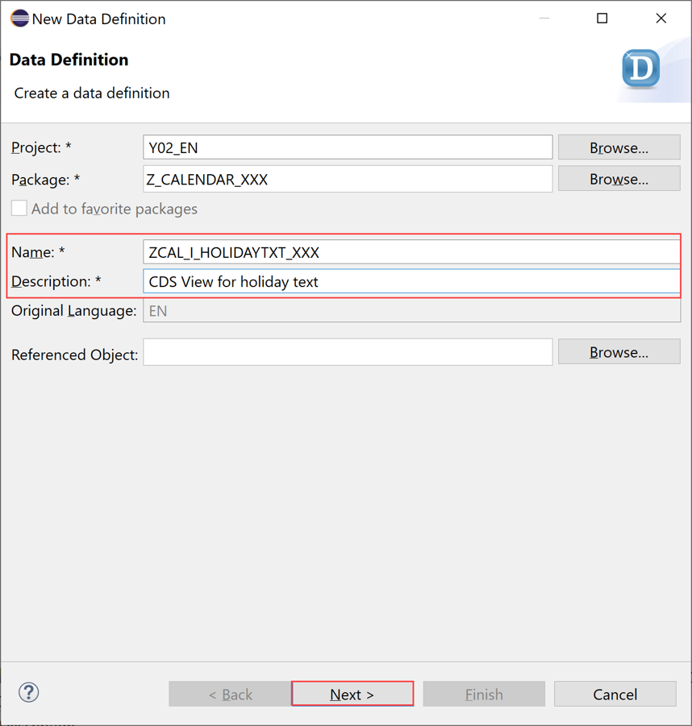

     Click **Next >**.

  3. Select **Define View Entity with To-Parent Association** as template and click **Finish**.

      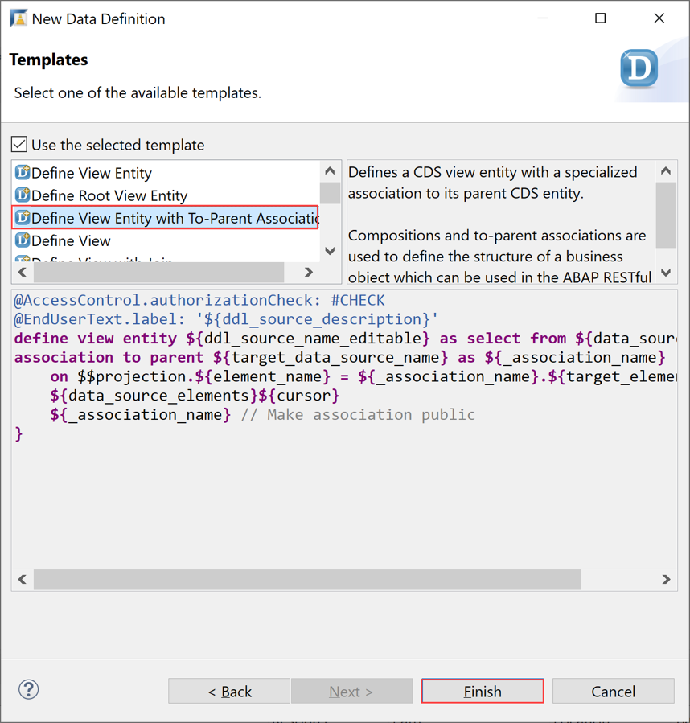

  4. Now define the association to the root node. Enter your root CDS view as target data source name. Name the association `_Public_Holiday` and the key field `HolidayId` as association attribute. Categorize the CDS view as Text view.

    ```ABAP
    @AccessControl.authorizationCheck: #CHECK
    @EndUserText.label: 'Public Holiday Text'
    @ObjectModel.dataCategory: #TEXT
    define view entity ZCAL_I_HOLIDAYTXT_XXX
      as select from zcal_holitxt_xxx
      association to parent ZCAL_I_HOLIDAY_XXX as _Public_Holiday on $projection.HolidayId = _Public_Holiday.HolidayId
    {
          @Semantics.language: true
      key spras            as Language,
      key holiday_id       as HolidayId,
          @Semantics.text: true
          fcal_description as HolidayDescription,
          _Public_Holiday
    }
    ```

 5. Save and activate.

 6. Open CDS view **`ZCAL_I_HOLIDAY_XXX`** by holding `CTRL` and left clicking on the name. Add the composition to the text view:

    ```ABAP
    @AccessControl.authorizationCheck: #CHECK
    @EndUserText.label: '<span class="sapedia-acronym" data-template="sapediaAdCDS" aria-expanded="false">CDS</span> View for public holidays'
    define root view entity ZCAL_I_HOLIDAY_XXX
      as select from zcal_holiday_xxx
      composition [0..*] of ZCAL_I_HOLIDAYTXT_XXX           as _HolidayTxt
    {
      key holiday_id       as HolidayId,
          @Semantics.calendar.month: true
          month_of_holiday as MonthOfHoliday,
          @Semantics.calendar.dayOfMonth: true
          day_of_holiday   as DayOfHoliday,
          @Semantics.systemDateTime.lastChangedAt: true
          last_changed_at,
          @Semantics.systemDateTime.localInstanceLastChangedAt: true
          local_last_changed_at,
          _HolidayTxt
    }

    ```

 7. Save and activate.

 8. Right-click on the data definition `ZCAL_I_HOLIDAYTXT_XXX`and select **New Data Definition**.

      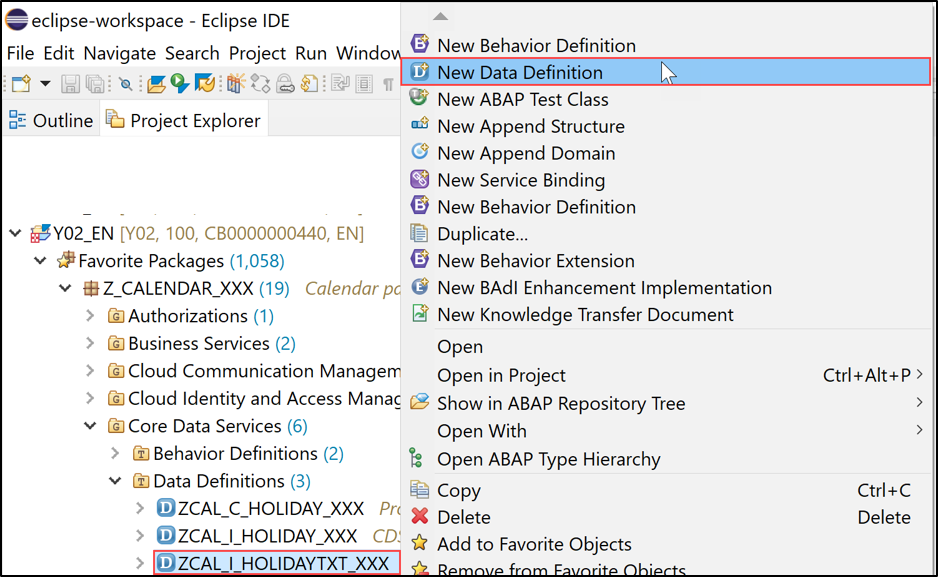

 9. Create a new projection view:
     - Name: **`ZCAL_C_HOLIDAYTXT_XXX`**
     - Description: Projection view for holiday text

      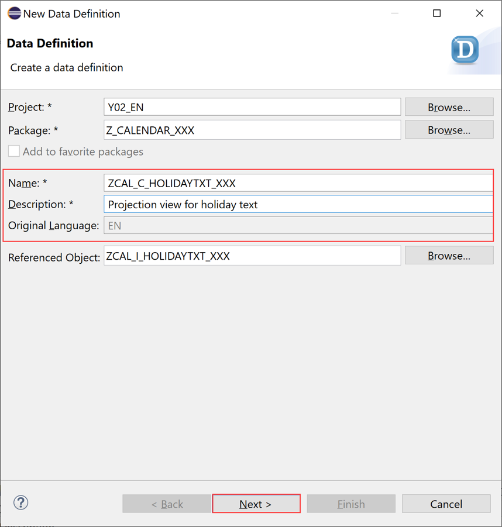

    Click **Next >**.

 10. Click **Next >**.

      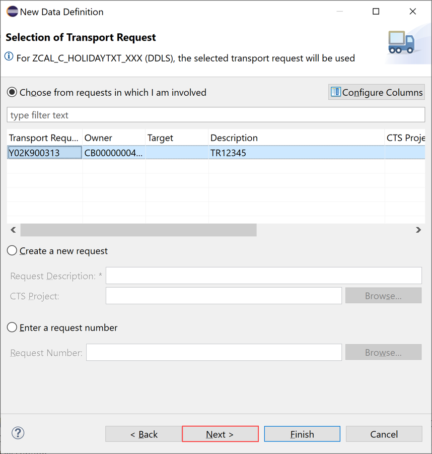

 11. Select **Define Projection View** as template and click **Finish**.

      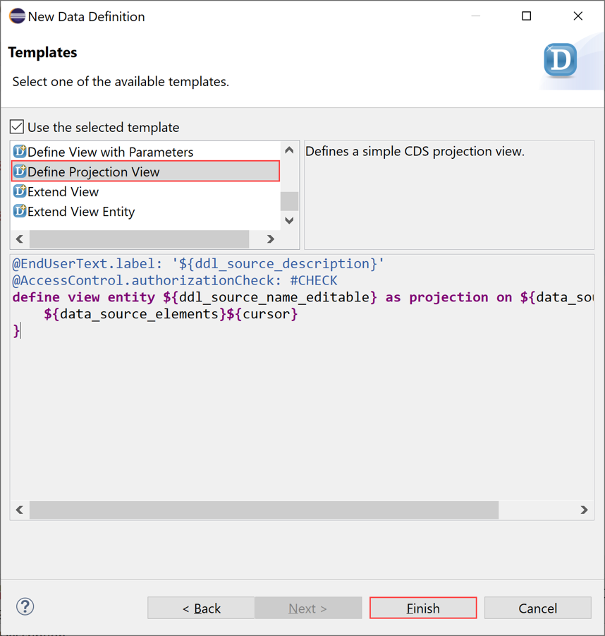

 12. Add the annotation `: redirected to parent ZCAL_C_HOLIDAY_XXX` to the association `_Public_Holiday`. Add the annotation `@Metadata.allowExtensions: true`.  

    ```ABAP
    @EndUserText.label: 'Projection view for public holiday text'
    @AccessControl.authorizationCheck: #CHECK
    @Metadata.allowExtensions: true
    define view entity ZCAL_C_HOLIDAYTXT_XXX
      as projection on ZCAL_I_HOLIDAYTXT_XXX
    {
      key Language,
      key HolidayId,
          HolidayDescription,
          _Public_Holiday : redirected to parent ZCAL_C_HOLIDAY_XXX
    }
    ```

 13. Save and activate.

 14. Open the CDS view **`ZCAL_C_HOLIDAY_XXX`**. Add the association `_HolidayTxt : redirected to composition child ZCAL_C_HOLIDAYTXT_XXX`


    ```ABAP
    @EndUserText.label: 'Projection view for public holidays'
    @AccessControl.authorizationCheck: #CHECK
    @Metadata.allowExtensions: true
    define root view entity ZCAL_C_HOLIDAY_XXX
      provider contract transactional_query
      as projection on ZCAL_I_HOLIDAY_XXX
    {
      key HolidayId,
          MonthOfHoliday,
          DayOfHoliday,
          last_changed_at,
          local_last_changed_at,
          _HolidayTxt : redirected to composition child ZCAL_C_HOLIDAYTXT_XXX
    }
    ```

 15. Save and activate.

[DONE]
[ACCORDION-END]

[ACCORDION-BEGIN [Step 4: ](Create behavior definition for text table)]

>**Hint:** Please note that the Maintain Business Configurations API only supports one level of sub nodes, i.e. your root entity can have associations to an arbitrary amount of entities but these sub entities cannot have associations to further sub entities.

  1. Open behavior definition **`ZCAL_I_HOLIDAY_XXX`**. Add the behavior definition for the text projection view. As the text node is a sub node of the root-entity you must define it as lock dependent. Enable the node for updates and deletions. Create is not possible here as this is defined on the composition leading to the sub node. Set fields `HolidayId` and `Language` as `readonly:update` to make it read only in the case of updates. Also add an association to the text node in the root node.

    ```ABAP
    managed implementation in class zbp_cal_i_holiday_xxx unique;
    with draft;

    define behavior for ZCAL_I_HOLIDAY_xxx alias HolidayRoot
    lock master total etag last_changed_at
    persistent table zcal_holiday_xxx
    draft table zcal_d_holi_xxx
    {
      create;
      update;
      delete;

      field ( readonly : update ) HolidayId;

      association _HolidayTxt { create; with draft; }

      mapping for zcal_holiday_xxx corresponding
      {
        HolidayId = holiday_id;
        MonthOfHoliday = month_of_holiday;
        DayOfHoliday = day_of_holiday;
      }
    }

    define behavior for ZCAL_I_HOLIDAYTXT_XXX alias HolidayText
    persistent table zcal_holitxt_xxx
    draft table zcal_d_holit_xxx
    lock dependent by _Public_Holiday
    {
      update;
      delete;
      field ( readonly : update ) HolidayId;
      field ( readonly : update ) Language;

      association _Public_Holiday { with draft; }

      mapping for zcal_holitxt_xxx corresponding
      {
        Language = spras;
        HolidayId = holiday_id;
        HolidayDescription = fcal_description;
      }
    }
    ```

  2. Place the cursor on **`zcal_d_holit_xxx`** and use the quick assist **(CTRL+1)** to create the draft table.

      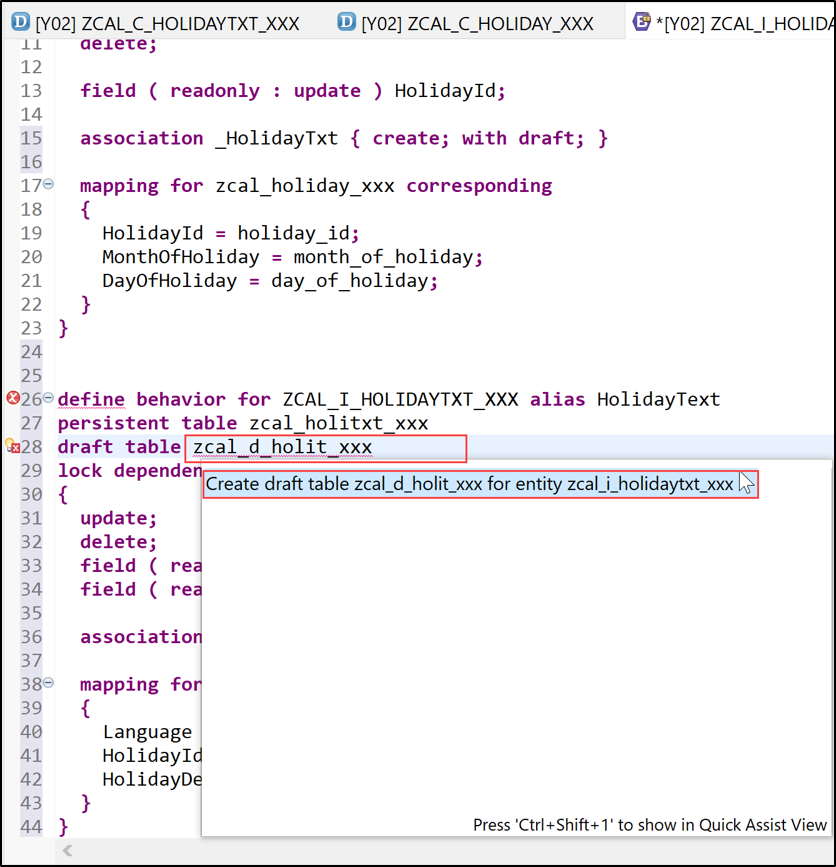

  3. Create a new draft table:
    - Name: **`ZCAL_D_HOLIT_XXX`**
    - Description: Draft table for entity **`ZCAL_I_HOLIDAYTXT_XXX`**

      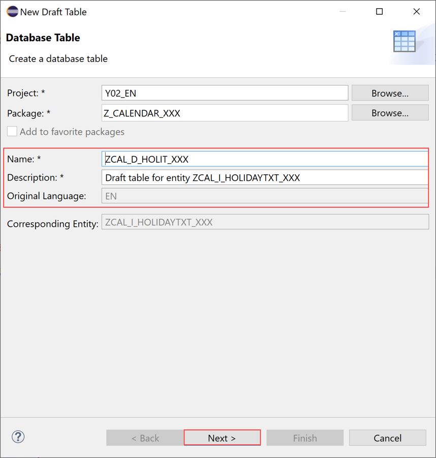

       Click **Next >**.

  4. Click **Finish**.

      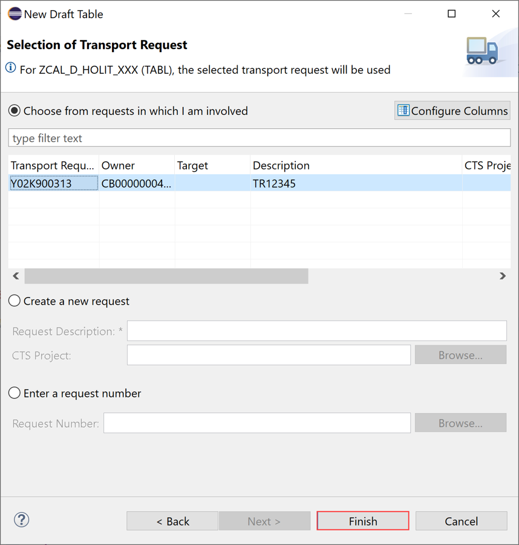

  5. Save and activate the draft table **`ZCAL_D_HOLIT_XXX`**.

  6. Save and activate the behavior definition **`ZCAL_I_HOLIDAY_XXX`**.  

  7. Open the behavior definition **`ZCAL_C_HOLIDAY_XXX`**. Add the following behavior projection and the association in the existing behavior projection.

    ```ABAP
    projection;
    use draft;

    define behavior for ZCAL_C_HOLIDAY_XXX alias HolidayRoot
    {
      use create;
      use update;
      use delete;

      use association _HolidayTxt { create; with draft; }
    }

    define behavior for ZCAL_C_HOLIDAYTXT_XXX alias HolidayText
    {
      use update;
      use delete;

      use association _Public_Holiday { with draft; }
    }
    ```

  8. Save and activate.

  9. Open service definition **`ZCAL_UI_HOLIDAY_XXX`** and add `expose ZCAL_C_HOLIDAYTXT_XXX as HolidayText;`.

    ```ABAP
    @EndUserText.label: 'Service Definition for Public Holiday'
    define service ZCAL_UI_HOLIDAY_XXX {
      expose ZCAL_C_HOLIDAY_XXX as HolidayRoot;
      expose ZCAL_C_HOLIDAYTXT_XXX as HolidayText;
    }
    ```

 10. Save and activate.     

[DONE]
[ACCORDION-END]

[ACCORDION-BEGIN [Step 5: ](Add UI annotation for text table)]

  1. Open the metadata extension **`ZCAL_C_HOLIDAY_XXX`**, add a new facet section. Use type `#LINEITEM_REFERENCE`.

    ```ABAP
    @Metadata.layer: #CORE
    @Search.searchable: true
    @UI: {
      headerInfo: { typeName: 'Public Holiday',
                    typeNamePlural: 'Public Holidays',
                    title: { type: #STANDARD, label: 'Public Holiday', value: 'HolidayId' } },
      presentationVariant: [{ sortOrder: [{ by: 'HolidayId', direction:  #ASC }] }] }
    annotate view ZCAL_C_HOLIDAY_XXX with
    {
      @UI.facet: [
        {
          id: 'PublicHoliday',
          purpose: #STANDARD,
          label: 'Public Holiday',
          type: #IDENTIFICATION_REFERENCE,
          position: 1
        },
        {
          id: 'Description',
          label: 'Description',
          type: #LINEITEM_REFERENCE,
          position: 2,
          targetElement: '_HolidayTxt'
         }
        ]

      @UI: {  identification: [ { position: 1 } ],
              lineItem:       [ { position: 1 } ] }
      @Search.defaultSearchElement: true
      HolidayId;
      @UI: {  identification: [ { position: 2 } ],
              lineItem:       [ { position: 2 } ] }
      MonthOfHoliday;
      @UI: {  identification: [ { position: 3 } ],
              lineItem:       [ { position: 3 } ] }
      DayOfHoliday;
      @UI.hidden: true
      last_changed_at;
      @UI.hidden: true
      local_last_changed_at;
    }
    ```

  2. Save and activate.

  3. Right-click on **Metadata Extensions**, select **New** > **Metadata Extension**.

      

  4. Create a new metadata extension:
    - Name: **`ZCAL_C_HOLIDAYTXT_XXX`**
    - Description: Holiday Text metadata extension

      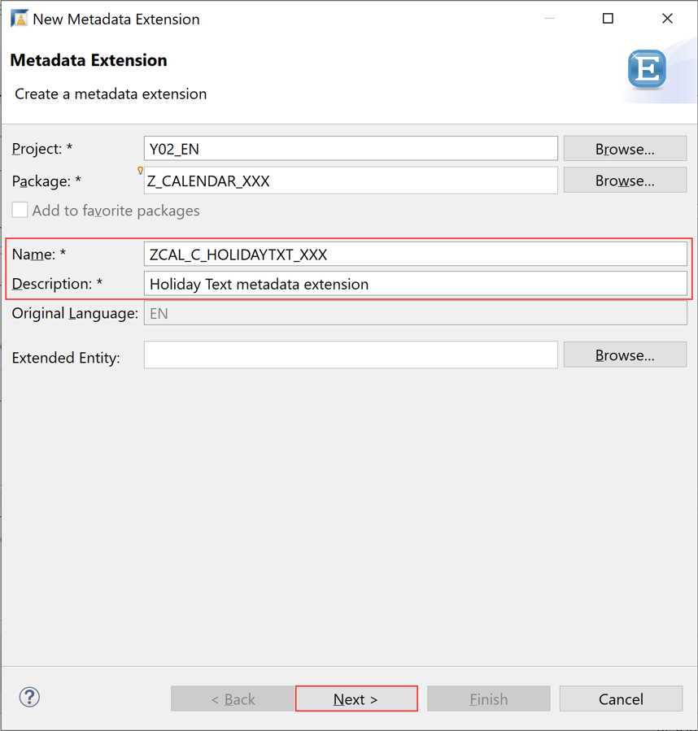

       Click **Next >**.

  5. Click **Finish**.

      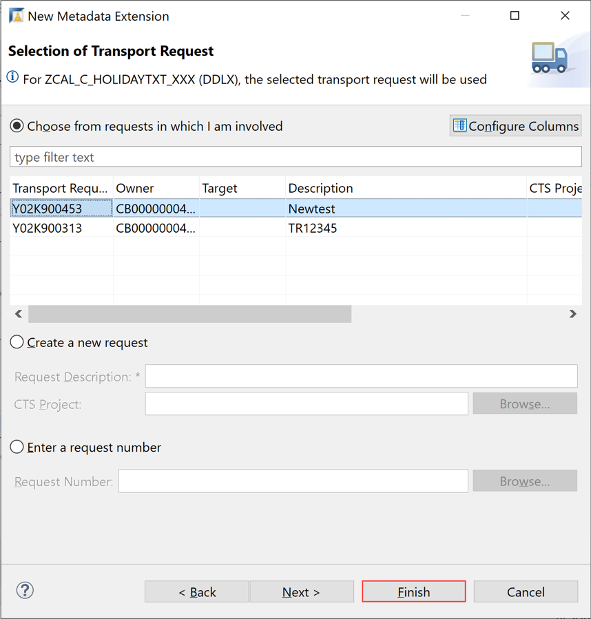

  6. Edit your metadata extension:

    ```ABAP
    @Metadata.layer: #CORE
    @UI: {
      headerInfo: { typeName: 'Description',
                    typeNamePlural: 'Descriptions',
                    title: { type: #STANDARD, value: 'Language' } } ,
      presentationVariant: [{ sortOrder: [{ by: 'Language', direction:  #ASC }] }] }
    annotate view ZCAL_C_HOLIDAYTXT_XXX with
    {
      @UI.facet: [
        {
          id: 'HolidayText',
          purpose: #STANDARD,
          type: #IDENTIFICATION_REFERENCE,
          label: 'Description',
          position: 1
        }
      ]

      @UI: { identification: [ { position: 1 } ],
             lineItem:   [ { position: 1 } ] }
      Language;
      @UI.hidden: true
      HolidayId;
      @UI: { identification: [ { position: 2 } ],
             lineItem:   [ { position: 2, label: 'Description' } ] }
      HolidayDescription;
    }
    ```

  7. Save and activate.

  8. Restart your application and open the details for a holiday. You can now see a new facet description which shows all available translated texts.

    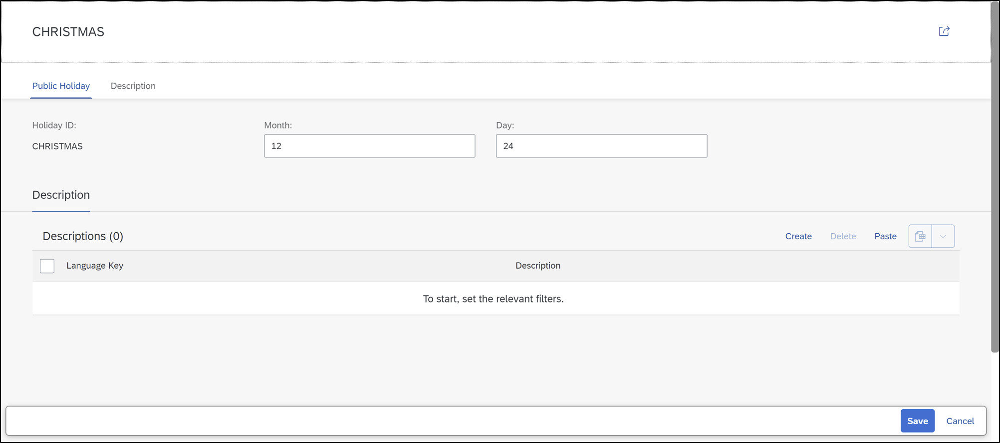

    In case there are no translated texts, create one with the create button after clicking on the edit button.

  9. Edit CDS View **`ZCAL_I_HOLIDAYTXT_XXX`**. Add an association to the language text view.

    ```ABAP
    @AccessControl.authorizationCheck: #CHECK
    @EndUserText.label: 'Public Holiday Text'
    @ObjectModel.dataCategory: #TEXT
    define view entity ZCAL_I_HOLIDAYTXT_XXX
      as select from zcal_holitxt_xxx
      association        to parent ZCAL_I_HOLIDAY_XXX as _Public_Holiday on $projection.HolidayId = _Public_Holiday.HolidayId
      association [0..*] to I_LanguageText            as _LanguageText   on $projection.Language  = _LanguageText.LanguageCode
    {
          @Semantics.language: true
      key spras            as Language,
      key holiday_id       as HolidayId,
          @Semantics.text: true
          fcal_description as HolidayDescription,
          _Public_Holiday,
          _LanguageText
    }
    ```

 10. Save and activate.

 11. Open projection view **`ZCAL_C_HOLIDAYTXT_XXX`**.


 12. Add the annotation `@Consumption.valueHelpDefinition: [ {entity: {name: 'I_Language', element: 'Language' }} ]` to field language and the annotation `@ObjectModel.text.element:['LanguageDescription']`. Add a new field `LanguageDescription` using the `localized` syntax:

    ```ABAP
    @EndUserText.label: 'Projection view for public holiday texts'
    @AccessControl.authorizationCheck: #CHECK
    @Metadata.allowExtensions: true
    define view entity ZCAL_C_HOLIDAYTXT_XXX
      as projection on ZCAL_I_HOLIDAYTXT_XXX
    {
          @Consumption.valueHelpDefinition: [ {entity: {name: 'I_Language', element: 'Language' }} ]
          @ObjectModel.text.element:['LanguageDescription']
      key Language,
      key HolidayId,
          HolidayDescription,
          _LanguageText.LanguageName as LanguageDescription : localized,
          _Public_Holiday : redirected to parent ZCAL_C_HOLIDAY_XXX
    }
    ```

 13. Save and activate. Upon restarting your app, the description of the language key is shown and an input help is available for the language key when creating a new description.

[DONE]
[ACCORDION-END]

[ACCORDION-BEGIN [Step 6: ](Link the default description to the root entity)]

The list of existing configuration entries must show the description in the logon language, if maintained. Additionally, when creating a new configuration entry a description in the logon language must be automatically created and can be edited directly.

  1. Open projection view **`ZCAL_C_HOLIDAY_XXX`** and add the field `HolidayDescription` from the composition to the Text view using the `localized syntax`  

    ```ABAP
    @EndUserText.label: 'Projection view for public holidays'
    @AccessControl.authorizationCheck: #CHECK
    @Metadata.allowExtensions: true
    define root view entity ZCAL_C_HOLIDAY_XXX
     provider contract transactional_query
     as projection on ZCAL_I_HOLIDAY_XXX
    {
     key HolidayId,
         MonthOfHoliday,
         DayOfHoliday,
         _HolidayTxt.HolidayDescription as HolidayDescription : localized,
         last_changed_at,
         local_last_changed_at,
         _HolidayTxt : redirected to composition child ZCAL_C_HOLIDAYTXT_XXX
    }
    ```

  2. Save and activate.

  3. Add the new field to the facet in the metadata extension **`ZCAL_C_HOLIDAY_XXX`**. The field must be hidden in object page because it is editable in the description facet.

    ```ABAP
    @Metadata.layer: #CORE
    @Search.searchable: true
    @UI: {
      headerInfo: { typeName: 'Public Holiday',
                    typeNamePlural: 'Public Holidays',
                    title: { type: #STANDARD, label: 'Public Holiday', value: 'HolidayId' } },
      presentationVariant: [{ sortOrder: [{ by: 'HolidayId', direction:  #ASC }] }] }
    annotate view ZCAL_C_HOLIDAY_XXX with
    {
      @UI.facet: [
        {
          id: 'PublicHoliday',
          purpose: #STANDARD,
          label: 'Public Holiday',
          type: #IDENTIFICATION_REFERENCE,
          position: 1
        },
        {
          id: 'Description',
          label: 'Description',
          type: #LINEITEM_REFERENCE,
          position: 2,
          targetElement: '_HolidayTxt'
         }
        ]

      @UI: {  identification: [ { position: 1 } ],
              lineItem:       [ { position: 1 } ] }
      @Search.defaultSearchElement: true
      HolidayId;
      @UI: {  identification: [ { position: 2, hidden: true } ],
              lineItem:       [ { position: 2 } ] }
      HolidayDescription;
      @UI: {  identification: [ { position: 3 } ],
              lineItem:       [ { position: 3 } ] }
      MonthOfHoliday;
      @UI: {  identification: [ { position: 4 } ],
              lineItem:       [ { position: 4 } ] }
      DayOfHoliday;
      @UI.hidden: true
      last_changed_at;
      @UI.hidden: true
      local_last_changed_at;

    }
    ```

  4. Save and activate.

  5. If you now start your application, you will have a new column for the description. In case you haven't maintained any description in the logon language the field will be empty even in case a text for another language exists.

      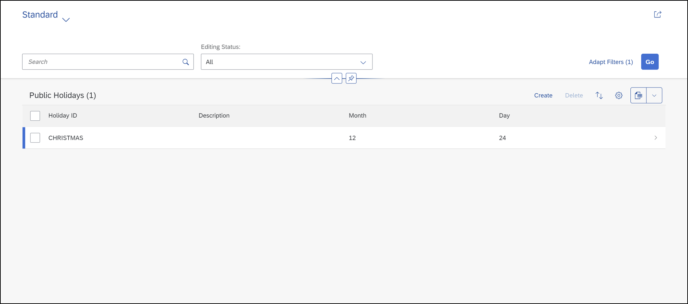

  6. Edit the behavior projection **`ZCAL_C_HOLIDAY_XXX`**. Add the `augment` annotation to the create and update action of `HolidayRoot`.

    ```ABAP
    use create(augment);
    use update(augment);
    ```

  7. Add the annotation `implementation in class zbp_cal_c_holiday_xxx unique;` to `projection`. Add `field ( modify ) HolidayDescription;` to the root entity.

    ```ABAP
    projection implementation in class zbp_cal_c_holiday_XXX unique;
    use draft;

    define behavior for ZCAL_C_HOLIDAY_XXX alias HolidayRoot
    {
      use create(augment);
      use update(augment);
      use delete;

      use association _HolidayTxt { create; with draft; }

      field ( modify ) HolidayDescription;
    }

    define behavior for ZCAL_C_HOLIDAYTXT_XXX alias HolidayText
    {
      use update;
      use delete;

      use association _Public_Holiday { with draft; }
    }
    ```

  8. Save and activate.

  9. Please the cursor on the class name **`ZBP_CAL_C_HOLIDAY_XXX`** and press **`CTRl+1`** to use the quick fix to create the behavior implementation class.

    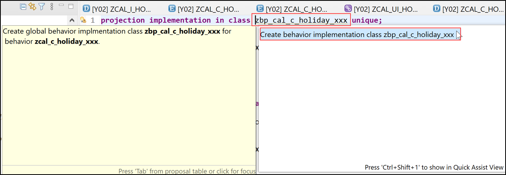

    

    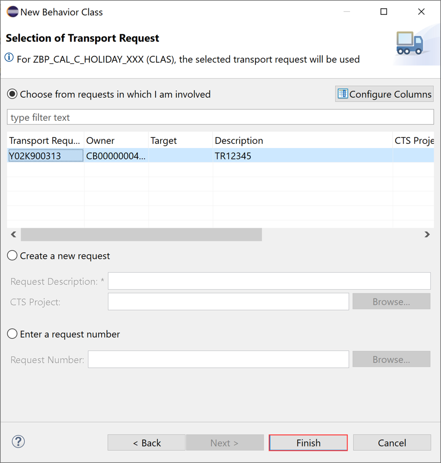

 10. Replace your code with following.

    ```ABAP
    CLASS lhc_holidayroot DEFINITION INHERITING FROM cl_abap_behavior_handler.
      PRIVATE SECTION.

        METHODS augment_create FOR MODIFY
          IMPORTING entities FOR CREATE holidayroot.

        METHODS augment_update FOR MODIFY
          IMPORTING entities FOR UPDATE holidayroot.

    ENDCLASS.

    CLASS lhc_holidayroot IMPLEMENTATION.

      METHOD augment_create.
        DATA: text_cba TYPE TABLE FOR CREATE zcal_i_holiday_xxx\_holidaytxt,
              myrelates         TYPE abp_behv_relating_tab.

        LOOP AT entities INTO DATA(entity).
          APPEND sy-tabix TO myrelates.
          APPEND VALUE #( %cid_ref           = entity-%cid
                          %key-holidayid     = entity-%key-holidayid
                          %is_draft          = entity-%is_draft
                          %target            = VALUE #( ( %cid               = |CREATETEXTCID{ sy-tabix }|
                                                          %is_draft          = entity-%is_draft
                                                          language           = sy-langu
                                                          holidayid          = entity-holidayid
                                                          holidaydescription = entity-holidaydescription
                                                          %control           = VALUE #( holidayid          = if_abap_behv=>mk-on
                                                                                        language           = if_abap_behv=>mk-on
                                                                                        holidaydescription = entity-%control-holidaydescription ) ) ) )
            TO text_cba.
        ENDLOOP.

        MODIFY AUGMENTING ENTITIES OF zcal_i_holiday_xxx ENTITY holidayroot CREATE BY \_holidaytxt
        FROM text_cba
        RELATING TO entities BY myrelates.
      ENDMETHOD.

      METHOD augment_update.
        DATA: text_update TYPE TABLE FOR UPDATE zcal_i_holidaytxt_xxx,
              text_cba   TYPE TABLE FOR CREATE zcal_i_holiday_xxx\_holidaytxt.
        DATA: myrelates_update TYPE abp_behv_relating_tab,
              myrelates_cba   TYPE abp_behv_relating_tab.

        READ ENTITIES OF zcal_i_holiday_xxx
          ENTITY holidayroot BY \_holidaytxt
            FROM VALUE #( FOR holiday_entity IN entities ( %tky = holiday_entity-%tky ) )
            LINK DATA(link).

        LOOP AT entities INTO DATA(entity) WHERE %control-holidaydescription = if_abap_behv=>mk-on.
          DATA(tabix) = sy-tabix.

          "If a Description with sy-langu already exists, perform an update. Else perform a create-by-association.
          IF line_exists( link[ KEY entity source-holidayid  = entity-%key-holidayid
                                           target-holidayid  = entity-%key-holidayid
                                           target-language = sy-langu ] ).
            APPEND tabix TO myrelates_update.

            APPEND VALUE #( %key-holidayid     = entity-%key-holidayid
                            %key-language      = sy-langu
                            %is_draft          = entity-%is_draft
                            holidaydescription = entity-holidaydescription
                            %control           = VALUE #( holidaydescription = entity-%control-holidaydescription ) )
             TO text_update.
          ELSE.

            APPEND tabix TO myrelates_cba.

            APPEND VALUE #( %tky         = entity-%tky
                            %target      = VALUE #( ( %cid               = |UPDATETEXTCID{ tabix }|
                                                      holidayid          = entity-holidayid
                                                      language           = sy-langu
                                                      %is_draft          = entity-%is_draft
                                                      holidaydescription = entity-holidaydescription
                                                      %control           = VALUE #( holidayid          = if_abap_behv=>mk-on
                                                                                    language           = if_abap_behv=>mk-on
                                                                                    holidaydescription = entity-%control-holidaydescription ) ) ) )
              TO text_cba.
          ENDIF.
        ENDLOOP.

        MODIFY AUGMENTING ENTITIES OF zcal_i_holiday_xxx
          ENTITY holidaytext UPDATE FROM text_update RELATING TO entities BY myrelates_update
          ENTITY holidayroot CREATE BY \_holidaytxt FROM text_cba RELATING TO entities BY myrelates_cba.
      ENDMETHOD.

    ENDCLASS.   
    ```

 11. Save and activate.

 12. If you now create a new entry, you can directly define the description in the logon language.

    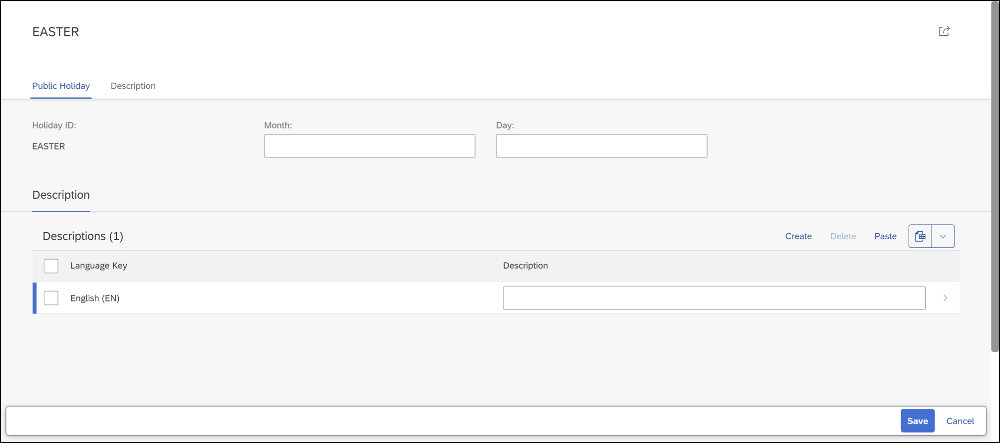

[DONE]
[ACCORDION-END]

[ACCORDION-BEGIN [Step 7: ](Test yourself)]

[VALIDATE_1]
[ACCORDION-END]
---
