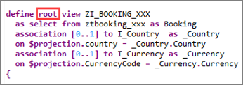
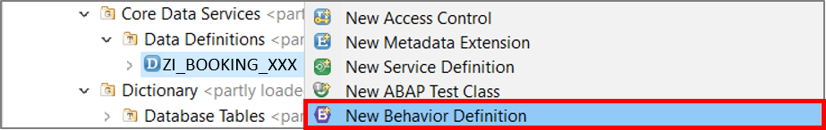
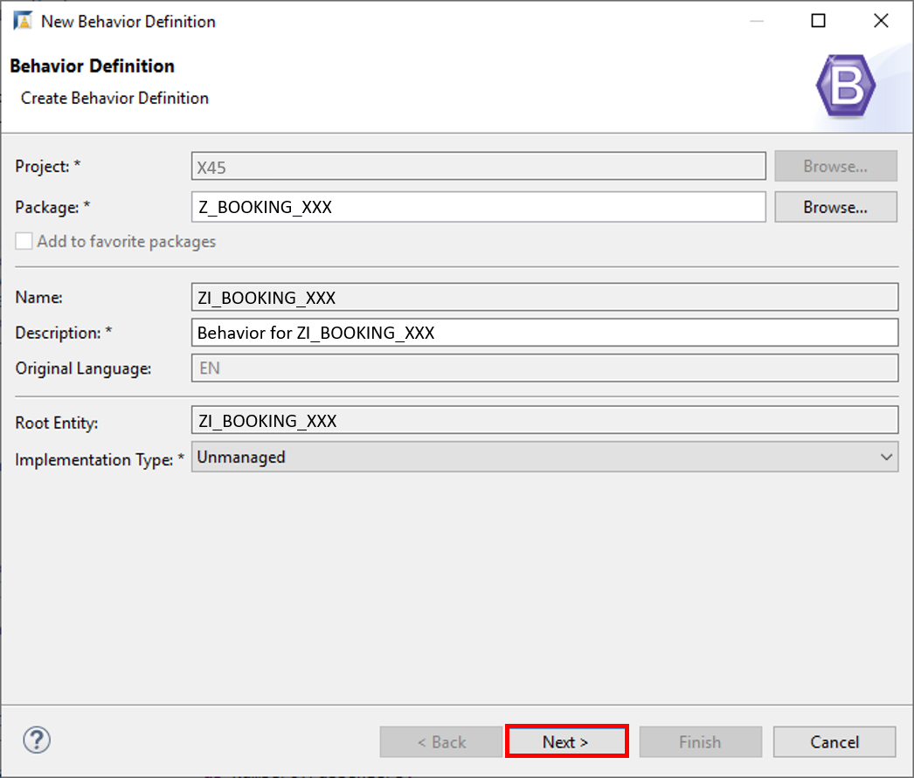
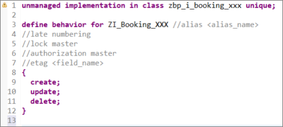
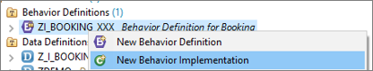
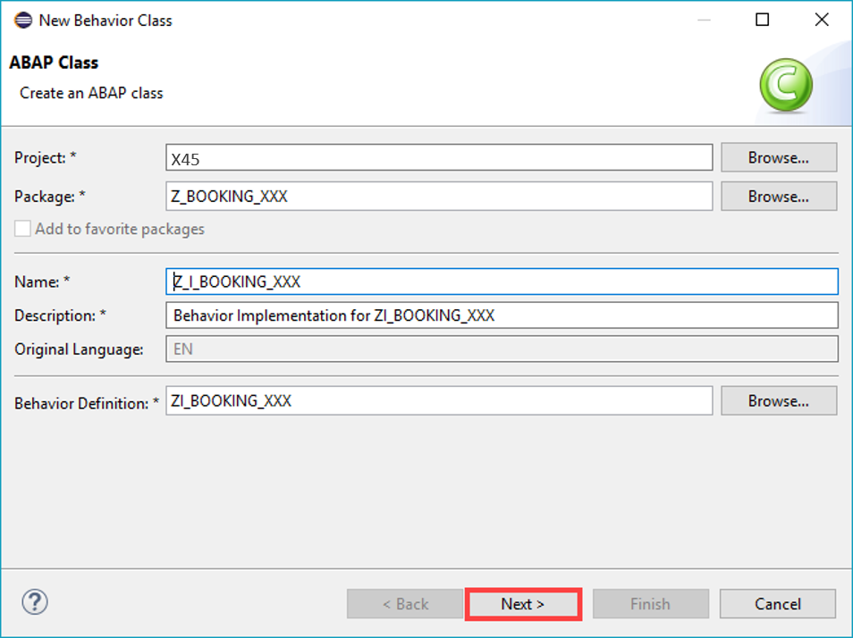

## Prerequisites  
- You need an SAP BTP, ABAP Environment [trial user](abap-environment-trial-onboarding) or a license.
- Business Catalog `SAP_CORE_BC_EXT_TST` assigned to your business user
- Initial development setup

## Details
### You will learn
- How to define a behavior implementation


In this tutorial, wherever `XXX` appears, use a number (e.g. `000`).

>For the **unmanaged implementation** type, the application developer must implement essential components of the REST contract manually. For the **managed scenario**, all required standard operations (create, update, delete) must only be specified in the behavior definition to obtain a ready-to-run business object.

---

[ACCORDION-BEGIN [Step 1: ](Open Eclipse)]
  1. Go to your ABAP package created in [Create and Expose a Core Data Services Based on a Database Table](https://developers.sap.com/tutorials/abap-environment-create-cds-view.html) and open your data definition `ZI_BOOKING_XXX` to add following statement:
  `root`.

      

      The **root entity** is of particular importance, since it defines the top node in a business object's structure and serves as a representation of the business object.

  2. Save and activate.

      

[DONE]
[ACCORDION-END]

[ACCORDION-BEGIN [Step 2: ](Create behavior definition)]
  1. Right-click on your data definition `ZI_BOOKING_XXX` and select **New Behavior Definition**.

      

  2. Provide a description, make sure, that your implementation type is unmanaged and click **Next >**.

      

  3. Click **Finish** to complete your transport request.

      

  4. Check result. An empty behavior definition for unmanaged implementation is created.

      

[DONE]
[ACCORDION-END]

[ACCORDION-BEGIN [Step 3: ](Implement behavior definition)]
  1. Provide an alias (`booking`) and specify the lock master. Define the table field **`LastChangedAt`** for the `ETag` handling. Replace the following coding:

    ```ABAP
    unmanaged implementation in class z_i_booking_xxx unique;

    define behavior for ZI_Booking_xxx alias booking
    lock master
    etag master LastChangedAt
    {
      create;
      update;
      delete;
    }

    ```
  2. Save and activate.

      

[DONE]
[ACCORDION-END]

[ACCORDION-BEGIN [Step 4: ](Create behavior implementation)]
  1. Right-click on your behavior definition and select **New Behavior Implementation**.

      

  2. Provide the name **`Z_I_BOOKING_XXX`** and a description and click **Next**.

      

  3. Provide a transport request if required and click **Finish**.

      

[DONE]
[ACCORDION-END]

[ACCORDION-BEGIN [Step 5: ](Implement behavior class)]

  1. Replace your code in local types with following:

    ```ABAP
    CLASS lcl_buffer DEFINITION.
    * 1) define the data buffer
      PUBLIC SECTION.

        TYPES: BEGIN OF ty_buffer.
            INCLUDE TYPE   ztbooking_xxx AS data.
        TYPES: flag TYPE c LENGTH 1,
               END OF ty_buffer.

        TYPES tt_bookings TYPE SORTED TABLE OF ty_buffer WITH UNIQUE KEY booking.

        CLASS-DATA mt_buffer TYPE tt_bookings.
    ENDCLASS.

    CLASS lcl_handler DEFINITION final INHERITING FROM cl_abap_behavior_handler.
      PRIVATE SECTION.
        METHODS modify FOR BEHAVIOR IMPORTING
          roots_to_create    FOR CREATE booking
          roots_to_update    FOR UPDATE booking
          roots_to_delete    FOR DELETE booking.

        METHODS read FOR BEHAVIOR
          IMPORTING it_booking_key FOR READ booking RESULT et_booking.

        METHODS lock FOR BEHAVIOR
          IMPORTING it_booking_key FOR LOCK booking.
    ENDCLASS.

    CLASS lcl_handler implementation.
      METHOD modify.

        " %cid = control field

        LOOP AT roots_to_delete INTO DATA(ls_delete).
          IF ls_delete-booking IS INITIAL.
            ls_delete-booking = mapped-booking[ %cid = ls_delete-%cid_ref ]-booking.
          ENDIF.

          READ TABLE lcl_buffer=>mt_buffer WITH KEY booking = ls_delete-booking ASSIGNING field-symbol(<ls_buffer>).
          IF sy-subrc = 0.
            IF <ls_buffer>-flag = 'C'.
              DELETE TABLE lcl_buffer=>mt_buffer WITH TABLE KEY booking = ls_delete-booking.
            ELSE.
              <ls_buffer>-flag = 'D'.
            ENDIF.
          ELSE.
            INSERT VALUE #( flag = 'D' booking = ls_delete-booking ) INTO TABLE lcl_buffer=>mt_buffer.
          ENDIF.
        ENDLOOP.

        " handle create
        IF roots_to_create IS NOT INITIAL.

          SELECT SINGLE MAX( booking ) FROM ztbooking_xxx INTO @DATA(lv_max_booking).
        ENDIF.

        LOOP AT roots_to_create INTO DATA(ls_create).
          ADD 1 TO lv_max_booking.
          ls_create-%data-booking = lv_max_booking.
          GET TIME STAMP FIELD DATA(zv_tsl).
          ls_create-%data-lastchangedat = zv_tsl.
          INSERT VALUE #( flag = 'C' data = CORRESPONDING #( ls_create-%data ) ) INTO TABLE lcl_buffer=>mt_buffer.

          IF ls_create-%cid IS NOT INITIAL.
            INSERT VALUE #( %cid = ls_create-%cid  booking = ls_create-booking ) INTO TABLE mapped-booking.
          ENDIF.
        ENDLOOP.

        " handle update
        IF roots_to_update IS NOT INITIAL.
          LOOP AT roots_to_update INTO DATA(ls_update).
            IF ls_update-booking IS INITIAL.
              ls_update-booking = mapped-booking[ %cid = ls_update-%cid_ref ]-booking.
            ENDIF.

            READ TABLE lcl_buffer=>mt_buffer WITH KEY booking = ls_update-booking ASSIGNING <ls_buffer>.
            IF sy-subrc <> 0.

              SELECT SINGLE * FROM ztbooking_xxx WHERE booking = @ls_update-booking INTO @DATA(ls_db).
              INSERT VALUE #( flag = 'U' data = ls_db ) INTO TABLE lcl_buffer=>mt_buffer ASSIGNING <ls_buffer>.
            ENDIF.

            IF ls_update-%control-customername IS NOT INITIAL..
              <ls_buffer>-customername = ls_update-customername.
            ENDIF.
            IF ls_update-%control-cost  IS NOT INITIAL..
              <ls_buffer>-cost = ls_update-cost.
            ENDIF.
            IF ls_update-%control-dateoftravel   IS NOT INITIAL..
              <ls_buffer>-dateoftravel  = ls_update-dateoftravel .
            ENDIF.
            IF ls_update-%control-currencycode  IS NOT INITIAL..
              <ls_buffer>-currencycode = ls_update-currencycode.
            ENDIF.
            GET TIME STAMP FIELD DATA(zv_tsl2).
            <ls_buffer>-lastchangedat = zv_tsl2.
          ENDLOOP.
        ENDIF.
      ENDMETHOD.

      METHOD read.
        LOOP AT it_booking_key INTO DATA(ls_booking_key).
          " check if it is in buffer (and not deleted).
          READ TABLE lcl_buffer=>mt_buffer WITH KEY booking = ls_booking_key-booking INTO DATA(ls_booking).
          IF sy-subrc = 0 AND ls_booking-flag <> 'U'.
            INSERT CORRESPONDING #( ls_booking-data ) INTO TABLE et_booking.
          ELSE.
            SELECT SINGLE * FROM ztbooking_xxx WHERE booking = @ls_booking_key-booking INTO @DATA(ls_db).
            IF sy-subrc = 0.
              INSERT CORRESPONDING #( ls_db ) INTO TABLE et_booking.
            ELSE.
              INSERT VALUE #( booking = ls_booking_key-booking ) INTO TABLE failed-booking.
            ENDIF.
          ENDIF.
        ENDLOOP.
      ENDMETHOD.

      METHOD lock.
       "provide the appropriate lock handling if required
      ENDMETHOD.
    ENDCLASS.


    CLASS lcl_saver DEFINITION INHERITING FROM cl_abap_behavior_saver.
      PROTECTED SECTION.
        METHODS finalize          REDEFINITION.
        METHODS check_before_save REDEFINITION.
        METHODS save              REDEFINITION.
    ENDCLASS.

    CLASS lcl_saver IMPLEMENTATION.

      METHOD save.
        DATA lt_data TYPE STANDARD TABLE OF ztbooking_xxx.

        lt_data = VALUE #(  FOR row IN lcl_buffer=>mt_buffer WHERE  ( flag = 'C' ) (  row-data ) ).
        IF lt_data IS NOT INITIAL.
          INSERT ztbooking_xxx FROM TABLE @lt_data.
        ENDIF.
        lt_data = VALUE #(  FOR row IN lcl_buffer=>mt_buffer WHERE  ( flag = 'U' ) (  row-data ) ).
        IF lt_data IS NOT INITIAL.
          UPDATE ztbooking_xxx FROM TABLE @lt_data.
        ENDIF.
        lt_data = VALUE #(  FOR row IN lcl_buffer=>mt_buffer WHERE  ( flag = 'D' ) (  row-data ) ).
        IF lt_data IS NOT INITIAL.
          DELETE ztbooking_xxx FROM TABLE @lt_data.
        ENDIF.
      ENDMETHOD.

      METHOD finalize.
      ENDMETHOD.

      METHOD check_before_save.
      ENDMETHOD.
    ENDCLASS.
    ```


  2. Save and activate.

      

  3. Go back to your service binding **`Z_I_BOOKING_XXX`** and open the preview for SAP Fiori elements app on the right side.

      

  4. Refresh and test your application in the browser. Now you are able to delete, add and edit objects in your application.

      

[DONE]
[ACCORDION-END]

[ACCORDION-BEGIN [Step 6: ](Test yourself)]

[VALIDATE_1]
[ACCORDION-END]
