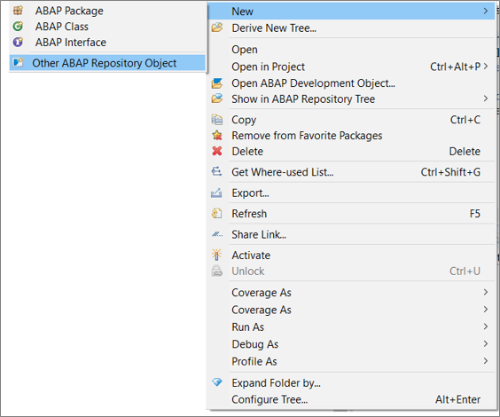
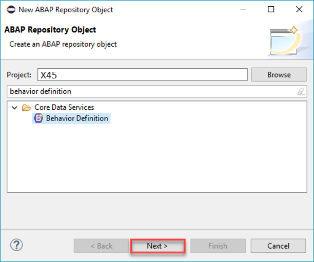
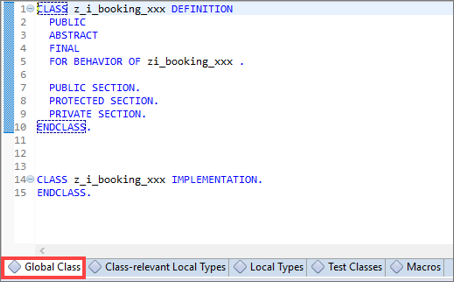
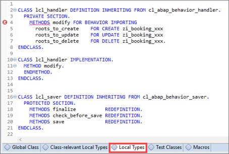
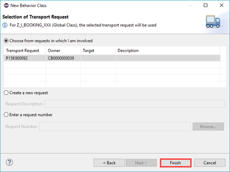
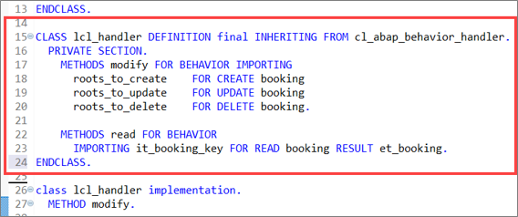

## Prerequisites  
- SAP Cloud Platform ABAP Environment User
- Business Catalog `SAP_CORE_BC_EXT_TST` assigned to your business user
- Initial development setup

## Details
### You will learn
- How to define a behavior implementation


In this tutorial, wherever `XXX` appears, use a number (e.g. `000`).


---

[ACCORDION-BEGIN [Step 1: ](Open Eclipse)]
  1. Go to your ABAP package created in [Create and Expose a Core Data Services Based on a Database Table](https://www.sap.com/developer/tutorials/abap-environment-create-cds-view.html)and open your data definition `ZI_BOOKING_XXX` to add following statement:
  `root`

      

  2. Save and activate.

      

[DONE]
[ACCORDION-END]

[ACCORDION-BEGIN [Step 2: ](Open other repository object)]
Right-click on your package and navigate to **New** > **Other ABAP Repository Object** from the appearing context menu.



[DONE]
[ACCORDION-END]

[ACCORDION-BEGIN [Step 3: ](Create behavior definition)]
  1. Navigate to **Core Data Services**, select **data definition** and press **Next**.

      

  2. Create a behavior definition for booking node/entities.

      

  3. Click **Finish** to complete your transport request.

      

  4. Check result. An empty behavior definition for unmanaged implementation is created.

      

[DONE]
[ACCORDION-END]

[ACCORDION-BEGIN [Step 4: ](Implement behavior definition)]
  1. Provide an alias (`booking`) and specify the lock master. Define the table field **`LastChangedAt`** for the `etag` handling. Replace the following coding:

    ```swift
        implementation unmanaged;
        define behavior for ZI_BOOKING_XXX alias booking
        lock master
        etag LastChangedAt
        {
          create;
          update;
          delete;
        }
    ```
  2. Save and activate.

      

[DONE]
[ACCORDION-END]

[ACCORDION-BEGIN [Step 5: ](Create behavior implementation)]
  1. Right-click on your behavior definition and select **New Behavior Implementation**.

      

  2. Provide a name and click **Next**.

      

  3. Provide a transport request if required and click **Finish**.

      

[DONE]
[ACCORDION-END]

[ACCORDION-BEGIN [Step 6: ](Enhance local class)]
  1. Go to the bottom of the class editor and click on the **Global Class** tab

      

  2. Go to the bottom of the class editor and click on the **Local Types** tab. This is the place the proper implementation of the behavior definition shall be implemented. In the unmanaged approach, you as developer are responsible for the complete transactional handling.

      

  3. Define a data buffer at the top of the editor by defining the local class **`lcl_buffer`** as shown on the screenshot. You can use the source code provided below:

      

    ```swift
    CLASS lcl_buffer DEFINITION.
    * 1) define the data buffer  
      PUBLIC SECTION.

        TYPES: BEGIN OF ty_buffer.
            INCLUDE TYPE   ztbooking_xxx AS data.
        TYPES: flag TYPE c LENGTH 1,
               END OF ty_buffer.

        TYPES tt_bookings TYPE SORTED TABLE OF ty_buffer WITH UNIQUE KEY booking.

        CLASS-DATA mt_buffer TYPE tt_bookings.
    ENDCLASS.
    ```

    Add also the final statement to your **`lcl_handler`** class.

  4. Enhance the definition of the local class **`lcl_handler`**. Enhance the parameter interface of the method modify with importing parameters **`roots_to_create`**, **`roots_to_update`** and **`roots_to_delete`** for the different operations. Add the read method.

      

[DONE]
[ACCORDION-END]

[ACCORDION-BEGIN [Step 7: ](Implement methods in handler class)]
  1. Implement the modify method in your **`lcl_handler`** implementation class.

    ```swift
    " handle delete
        LOOP AT roots_to_delete INTO DATA(ls_delete).
          " check for content id (%cid) handling
          IF ls_delete-booking IS INITIAL.
            ls_delete-booking = mapped-booking[ %cid = ls_delete-%cid_ref ]-booking.
          ENDIF.

          READ TABLE lcl_buffer=>mt_buffer WITH KEY booking = ls_delete-booking ASSIGNING field-symbol(<ls_buffer>).
          IF sy-subrc = 0.
            " already in buffer, check why
            IF <ls_buffer>-flag = 'C'.
              "delete after create => just remove from buffer
              DELETE TABLE lcl_buffer=>mt_buffer WITH TABLE KEY booking = ls_delete-booking.
            ELSE.
              <ls_buffer>-flag = 'D'.
            ENDIF.
          ELSE.
            " not yet in buffer.
            INSERT VALUE #( flag = 'D' booking = ls_delete-booking ) INTO TABLE lcl_buffer=>mt_buffer.
          ENDIF.
        ENDLOOP.
    ```

  2. Add also following code to your **`lcl_handler`** implementation class (modify method).

    ```swift
    " handle create
    IF roots_to_create IS NOT INITIAL.
      " if there are creates, then we need to know the maximum booking number.
      SELECT SINGLE MAX( booking ) FROM ztbooking_xxx INTO @DATA(lv_max_booking).
    ENDIF.

    LOOP AT roots_to_create INTO DATA(ls_create).
      " next booking number
      ADD 1 TO lv_max_booking.
      ls_create-%data-booking = lv_max_booking.
      GET TIME STAMP FIELD DATA(zv_tsl).
      ls_create-%data-lastchangedat = zv_tsl.  
      "Handle field LastChangedAt

      " insert as created into buffer
      INSERT VALUE #( flag = 'C' data = CORRESPONDING #( ls_create-%data ) ) INTO TABLE lcl_buffer=>mt_buffer.

      " tell framework about new key if a content id (%cid) is used.:
      IF ls_create-%cid IS NOT INITIAL.
        INSERT VALUE #( %cid = ls_create-%cid  booking = ls_create-booking ) INTO TABLE mapped-booking.
      ENDIF.
    ENDLOOP.
    ```

  3. Create a handle update by adding following coding:

    ```swift
    " handle update
    IF roots_to_update IS NOT INITIAL.
      LOOP AT roots_to_update INTO DATA(ls_update).
        " check for content id (%cid) handling
        IF ls_update-booking IS INITIAL.
          ls_update-booking = mapped-booking[ %cid = ls_update-%cid_ref ]-booking.
        ENDIF.

        " search in buffer
        READ TABLE lcl_buffer=>mt_buffer WITH KEY booking = ls_update-booking ASSIGNING <ls_buffer>.
        IF sy-subrc <> 0.
          " not yet in buffer, read from table

          SELECT SINGLE * FROM ztbooking_xxx WHERE booking = @ls_update-booking INTO @DATA(ls_db).

          INSERT VALUE #( flag = 'U' data = ls_db ) INTO TABLE lcl_buffer=>mt_buffer ASSIGNING <ls_buffer>.
        ENDIF.

        IF ls_update-%control-customername IS NOT INITIAL..
          <ls_buffer>-customername = ls_update-customername.
        ENDIF.
        IF ls_update-%control-cost  IS NOT INITIAL..
          <ls_buffer>-cost = ls_update-cost.
        ENDIF.
        IF ls_update-%control-dateoftravel   IS NOT INITIAL..
          <ls_buffer>-dateoftravel  = ls_update-dateoftravel .
        ENDIF.
        IF ls_update-%control-currencycode  IS NOT INITIAL..
          <ls_buffer>-currencycode = ls_update-currencycode.
        ENDIF.      
        GET TIME STAMP FIELD DATA(zv_tsl2).
        <ls_buffer>-lastchangedat = zv_tsl2. "handling for field LastChangedAt (for eTag)
      ENDLOOP.
    ENDIF.

    ```
  4. Implement the method read in your **`lcl_handler`** implementation class. Save your changes.

    ```swift
    METHOD read.
      LOOP AT it_booking_key INTO DATA(ls_booking_key).
        " check if it is in buffer (and not deleted).
        READ TABLE lcl_buffer=>mt_buffer WITH KEY booking = ls_booking_key-booking INTO DATA(ls_booking).
        IF sy-subrc = 0 AND ls_booking-flag <> 'U'.
          INSERT CORRESPONDING #( ls_booking-data ) INTO TABLE et_booking.
        ELSE.
          SELECT SINGLE * FROM ztbooking_xxx WHERE booking = @ls_booking_key-booking INTO @DATA(ls_db).
          IF sy-subrc = 0.
            INSERT CORRESPONDING #( ls_db ) INTO TABLE et_booking.
          ELSE.
            INSERT VALUE #( booking = ls_booking_key-booking ) INTO TABLE failed-booking.
          ENDIF.
        ENDIF.
      ENDLOOP.
    ENDMETHOD.
    ENDCLASS.
    ```

[DONE]
[ACCORDION-END]

[ACCORDION-BEGIN [Step 8: ](Implement method in saver class)]
  1. Implement the method save of the local class **`lcl_saver`**.

    ```swift
    METHOD save.  
        DATA lt_data TYPE STANDARD TABLE OF ztbooking_xxx.

        " find all rows in buffer with flag = created
        lt_data = VALUE #(  FOR row IN lcl_buffer=>mt_buffer WHERE  ( flag = 'C' ) (  row-data ) ).
        IF lt_data IS NOT INITIAL.
          INSERT ztbooking_xxx FROM TABLE @lt_data.
        ENDIF.

        " find all rows in buffer with flag = updated
        lt_data = VALUE #(  FOR row IN lcl_buffer=>mt_buffer WHERE  ( flag = 'U' ) (  row-data ) ).
        IF lt_data IS NOT INITIAL.
          UPDATE ztbooking_xxx FROM TABLE @lt_data.
        ENDIF.

        " find all rows in buffer with flag = deleted
        lt_data = VALUE #(  FOR row IN lcl_buffer=>mt_buffer WHERE  ( flag = 'D' ) (  row-data ) ).
        IF lt_data IS NOT INITIAL.
          DELETE ztbooking_xxx FROM TABLE @lt_data.
        ENDIF.
      ENDMETHOD.
    ```

  2. Save and activate your code.

      

[DONE]
[ACCORDION-END]

[ACCORDION-BEGIN [Step 9: ](Check result)]

  1. This is how your complete source code should look like (local types):

    ```swift
    CLASS lcl_buffer DEFINITION.
    * 1) define the data buffer
      PUBLIC SECTION.

        TYPES: BEGIN OF ty_buffer.
            INCLUDE TYPE   ztbooking_xxx AS data.
        TYPES: flag TYPE c LENGTH 1,
               END OF ty_buffer.

        TYPES tt_bookings TYPE SORTED TABLE OF ty_buffer WITH UNIQUE KEY booking.

        CLASS-DATA mt_buffer TYPE tt_bookings.
    ENDCLASS.

    CLASS lcl_handler DEFINITION final INHERITING FROM cl_abap_behavior_handler.
      PRIVATE SECTION.
        METHODS modify FOR BEHAVIOR IMPORTING
          roots_to_create    FOR CREATE booking
          roots_to_update    FOR UPDATE booking
          roots_to_delete    FOR DELETE booking.

        METHODS read FOR BEHAVIOR
          IMPORTING it_booking_key FOR READ booking RESULT et_booking.
    ENDCLASS.

    class lcl_handler implementation.
      METHOD modify.

        LOOP AT roots_to_delete INTO DATA(ls_delete).
          IF ls_delete-booking IS INITIAL.
            ls_delete-booking = mapped-booking[ %cid = ls_delete-%cid_ref ]-booking.
          ENDIF.

          READ TABLE lcl_buffer=>mt_buffer WITH KEY booking = ls_delete-booking ASSIGNING field-symbol(<ls_buffer>).
          IF sy-subrc = 0.
            IF <ls_buffer>-flag = 'C'.
              DELETE TABLE lcl_buffer=>mt_buffer WITH TABLE KEY booking = ls_delete-booking.
            ELSE.
              <ls_buffer>-flag = 'D'.
            ENDIF.
          ELSE.
            INSERT VALUE #( flag = 'D' booking = ls_delete-booking ) INTO TABLE lcl_buffer=>mt_buffer.
          ENDIF.
        ENDLOOP.

        " handle create
        IF roots_to_create IS NOT INITIAL.

          SELECT SINGLE MAX( booking ) FROM ztbooking_xxx INTO @DATA(lv_max_booking).
        ENDIF.

        LOOP AT roots_to_create INTO DATA(ls_create).
          ADD 1 TO lv_max_booking.
          ls_create-%data-booking = lv_max_booking.
          GET TIME STAMP FIELD DATA(zv_tsl).
          ls_create-%data-lastchangedat = zv_tsl.
          INSERT VALUE #( flag = 'C' data = CORRESPONDING #( ls_create-%data ) ) INTO TABLE lcl_buffer=>mt_buffer.

          IF ls_create-%cid IS NOT INITIAL.
            INSERT VALUE #( %cid = ls_create-%cid  booking = ls_create-booking ) INTO TABLE mapped-booking.
          ENDIF.
        ENDLOOP.

        " handle update
        IF roots_to_update IS NOT INITIAL.
          LOOP AT roots_to_update INTO DATA(ls_update).
            IF ls_update-booking IS INITIAL.
              ls_update-booking = mapped-booking[ %cid = ls_update-%cid_ref ]-booking.
            ENDIF.

            READ TABLE lcl_buffer=>mt_buffer WITH KEY booking = ls_update-booking ASSIGNING <ls_buffer>.
            IF sy-subrc <> 0.

              SELECT SINGLE * FROM ztbooking_xxx WHERE booking = @ls_update-booking INTO @DATA(ls_db).
              INSERT VALUE #( flag = 'U' data = ls_db ) INTO TABLE lcl_buffer=>mt_buffer ASSIGNING <ls_buffer>.
            ENDIF.

            IF ls_update-%control-customername IS NOT INITIAL..
              <ls_buffer>-customername = ls_update-customername.
            ENDIF.
            IF ls_update-%control-cost  IS NOT INITIAL..
              <ls_buffer>-cost = ls_update-cost.
            ENDIF.
            IF ls_update-%control-dateoftravel   IS NOT INITIAL..
              <ls_buffer>-dateoftravel  = ls_update-dateoftravel .
            ENDIF.
            IF ls_update-%control-currencycode  IS NOT INITIAL..
              <ls_buffer>-currencycode = ls_update-currencycode.
            ENDIF.
            GET TIME STAMP FIELD DATA(zv_tsl2).
            <ls_buffer>-lastchangedat = zv_tsl2.
          ENDLOOP.
        ENDIF.
      endmethod.

      METHOD read.
        LOOP AT it_booking_key INTO DATA(ls_booking_key).
          " check if it is in buffer (and not deleted).
          READ TABLE lcl_buffer=>mt_buffer WITH KEY booking = ls_booking_key-booking INTO DATA(ls_booking).
          IF sy-subrc = 0 AND ls_booking-flag <> 'U'.
            INSERT CORRESPONDING #( ls_booking-data ) INTO TABLE et_booking.
          ELSE.
            SELECT SINGLE * FROM ztbooking_xxx WHERE booking = @ls_booking_key-booking INTO @DATA(ls_db).
            IF sy-subrc = 0.
              INSERT CORRESPONDING #( ls_db ) INTO TABLE et_booking.
            ELSE.
              INSERT VALUE #( booking = ls_booking_key-booking ) INTO TABLE failed-booking.
            ENDIF.
          ENDIF.
        ENDLOOP.
      ENDMETHOD.
    ENDCLASS.


    CLASS lcl_saver DEFINITION INHERITING FROM cl_abap_behavior_saver.
      PROTECTED SECTION.
        METHODS finalize          REDEFINITION.
        METHODS check_before_save REDEFINITION.
        METHODS save              REDEFINITION.
    ENDCLASS.

    CLASS lcl_saver IMPLEMENTATION.

      METHOD save.
        DATA lt_data TYPE STANDARD TABLE OF ztbooking_xxx.

        lt_data = VALUE #(  FOR row IN lcl_buffer=>mt_buffer WHERE  ( flag = 'C' ) (  row-data ) ).
        IF lt_data IS NOT INITIAL.
          INSERT ztbooking_xxx FROM TABLE @lt_data.
        ENDIF.
        lt_data = VALUE #(  FOR row IN lcl_buffer=>mt_buffer WHERE  ( flag = 'U' ) (  row-data ) ).
        IF lt_data IS NOT INITIAL.
          UPDATE ztbooking_xxx FROM TABLE @lt_data.
        ENDIF.
        lt_data = VALUE #(  FOR row IN lcl_buffer=>mt_buffer WHERE  ( flag = 'D' ) (  row-data ) ).
        IF lt_data IS NOT INITIAL.
          DELETE ztbooking_xxx FROM TABLE @lt_data.
        ENDIF.
      ENDMETHOD.

      METHOD finalize.
      ENDMETHOD.

      METHOD check_before_save.
      ENDMETHOD.
    ENDCLASS.
    ```

  2. Go back to your service binding **`Z_I_BOOKING_XXX`**
   Open the preview for SAP Fiori elements app on the right side.

      

  3. Refresh and test your application in the browser. Now you are able to delete, add and edit objects in your application.

      

[DONE]
[ACCORDION-END]

[ACCORDION-BEGIN [Step 10: ](Test yourself)]
Define an unmanaged implementation of a behavior definition for following in the right order (without the lock master statement and `etag` handling):

 - `ZI_TEST` alias `test`
 - Methods:
  - create
  - update
  - delete

[VALIDATE_1]
[ACCORDION-END]
