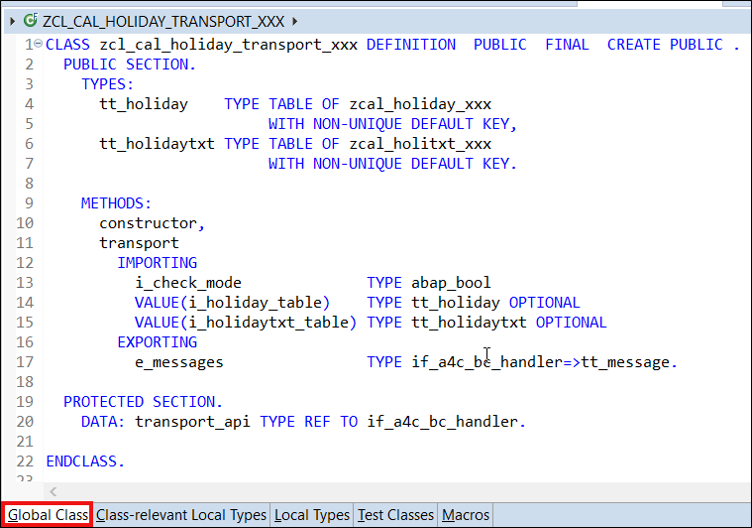
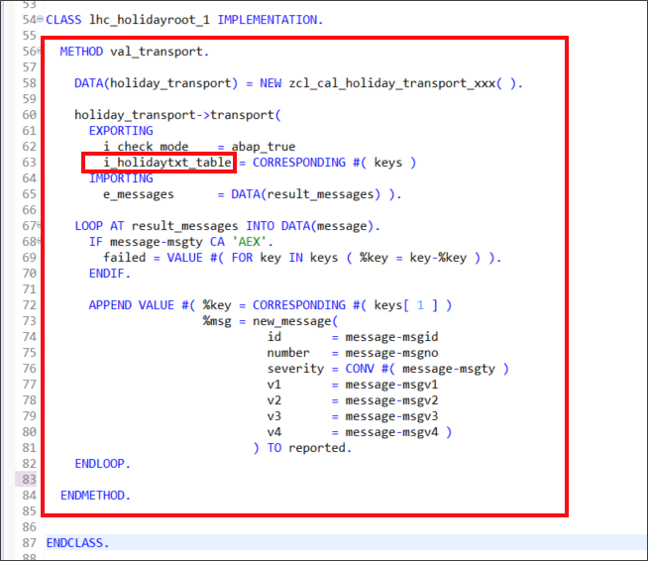
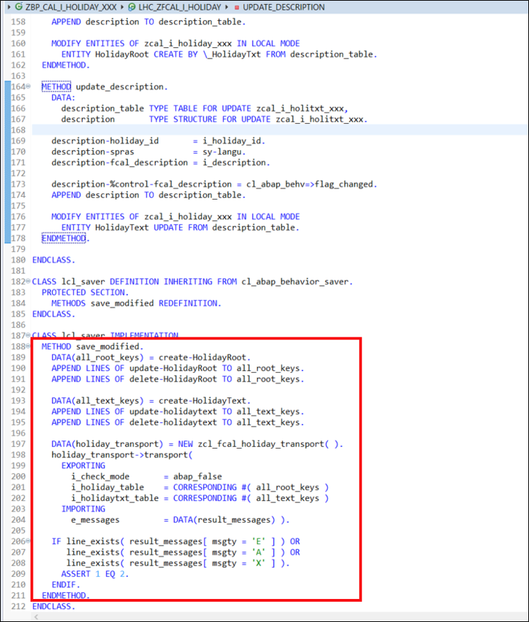

## Prerequisites  
- You need an SAP Cloud Platform ABAP Environment [trial user](abap-environment-trial-onboarding) or a license.
- You need to configure a software component of type **business configuration**: [Transport a Software Component Between Two ABAP Instances](abap-environment-gcts).
- You have to assign the **Configuration Expert - Business Process Configuration** role to the respective users.


## Details
### You will learn  
- How to create transport class
- How to implement save validation


To assign role **Configuration Expert – Business Process Configuration** to the respective user please follow the following steps:

  1.	Logon as administrator to your ABAP system (SAP Fiori launchpad).
  2.	Go to Fiori app **Business Role Templates**, find the **Configuration Expert - Business Process Configuration** template and create a business role based on this template.

  3.	With the authorizations contained in this business role, users can create customizing requests. You can create customizing requests in two ways:
    - Create them directly in the Transport Organizer in the Eclipse-based ABAP development tools (ADT).
    - Create them implicitly using the method `add_to_transport_request()`. If no request and/or task exists for a user, the API will create one, if the user has the authorization. If the user has no authorization and no request and/or task exists, the API will raise an exception.

  4.	With the authorizations contained in this business role, users can release customizing requests in the Transport Organizer in the Eclipse-based ABAP development tools (ADT). When releasing the request, the business configuration content is written to the Git repository and can be pulled into the target systems.


---

[ACCORDION-BEGIN [Step 1: ](Create transport class)]
The first step is to create a central class, which offers some transport change recording to the save validation and the save method for recording of the final changes. The class will reuse the SAP Cloud Platform ABAP environment Transport `API IF_A4C_BC_HANDLER`. So it will be used to wrap the generic transport API with a factory calendar specific transport API-method to offer a transport API for the Public Holiday business object. Furthermore, the class is being used to consolidate the returned success-fields, exceptions and messages of the generic API in a single output channel.

  1. Right-click on **`Classes`** and select **New ABAP Class**.

      

  2. Create a new class:
     - Name: **`ZCL_CAL_HOLIDAY_TRANSPORT_XXX`**
     - Description: **`Class for transport`**

      

      Click **Next >**.

  3. Click **Finish**.

      

  4. In your **global class** of your class **`ZCL_CAL_HOLIDAY_TRANSPORT_XXX`** replace your code with following:

    ```ABAP
    CLASS zcl_cal_holiday_transport_xxx DEFINITION  PUBLIC  FINAL  CREATE PUBLIC .
      PUBLIC SECTION.
        TYPES:
          tt_holiday    TYPE TABLE OF zcal_holiday_xxx
                             WITH NON-UNIQUE DEFAULT KEY,
          tt_holidaytxt TYPE TABLE OF zcal_holitxt_xxx
                             WITH NON-UNIQUE DEFAULT KEY.

        METHODS:
          constructor,
          transport
            IMPORTING
              i_check_mode              TYPE abap_bool
              VALUE(i_holiday_table)    TYPE tt_holiday OPTIONAL
              VALUE(i_holidaytxt_table) TYPE tt_holidaytxt OPTIONAL
            EXPORTING
              e_messages                TYPE if_a4c_bc_handler=>tt_message.

      PROTECTED SECTION.
        DATA: transport_api TYPE REF TO if_a4c_bc_handler.

    ENDCLASS.

    CLASS zcl_cal_holiday_transport_xxx IMPLEMENTATION.

      METHOD constructor.
        me->transport_api = cl_a4c_bc_factory=>get_handler( ).
      ENDMETHOD.


      METHOD transport.

        DATA: object_keys TYPE if_a4c_bc_handler=>tt_object_tables,
              object_key  TYPE if_a4c_bc_handler=>ts_object_list.

        CHECK i_holiday_table IS NOT INITIAL.

        IF i_holiday_table IS NOT INITIAL.
          object_key-objname = 'ZCAL_HOLIDAY_XXX'.
          object_key-tabkeys = REF #( i_holiday_table ).
          APPEND object_key TO object_keys.
        ENDIF.

        IF i_holidaytxt_table IS NOT INITIAL.
          object_key-objname = 'ZCAL_HOLITXT_XXX'.
          object_key-tabkeys = REF #( i_holidaytxt_table ).
          APPEND object_key TO object_keys.
        ENDIF.

        TRY.
            transport_api->add_to_transport_request(
              EXPORTING
                iv_check_mode         = i_check_mode
                it_object_tables      = object_keys
                iv_mandant_field_name = 'CLIENT'
              IMPORTING
                rt_messages           = e_messages
                rv_success            = DATA(success_flag) ).

            IF success_flag NE 'S'.
              RAISE EXCEPTION TYPE cx_a4c_bc_exception.
            ENDIF.
          CATCH cx_a4c_bc_exception INTO DATA(bc_exception).
            APPEND
              VALUE #( msgty = 'E'
                       msgid = 'SY'
                       msgno = '002'
                       msgv1 = bc_exception->get_text( ) )
              TO e_messages.
        ENDTRY.
      ENDMETHOD.

    ENDCLASS.

    ```

    

  5. Save and activate.

[DONE]
[ACCORDION-END]

[ACCORDION-BEGIN [Step 2: ](Implement save validation)]
After you have created the global transport class for your business object you can integrate it into your UI. First, the creation of a validation is needed. This validation will check whether all prerequisites are fulfilled, and if the changes can be recorded on the transport request.

  1. Open the behavior definition **`ZCAL_I_HOLIDAY_XXX`** and add following to the **root node**:

    ```ABAP
    validation val_transport on save
    { field holiday_id, HolidayDescription, day_of_holiday, month_of_holiday;}
    ```

    Add following to the **text node**:

    ```ABAP
     validation val_transport on save
      { field holiday_id, fcal_description, spras; }
    ```

      

  2. Save and activate.

  3. Set the cursor to the validation name **`val_transport`** of your **root node** and press **CTRL + 1**. Select **`Add missing method for validation val_transport in new local handler class`**.

      

  4. Repeat step **4.3** to add the missing method for validation **`val_transport`** of your **text node**.

      

  5. Save and activate your class **`ZBP_CAL_I_HOLIDAY_XXX`**.

  6. Open **`ZBP_CAL_I_HOLIDAY_XXX`** and implement the validation on the **root node** of your **`val_transport`** method:

    ```ABAP
    METHOD val_transport.

     DATA(holiday_transport) = NEW zcl_cal_holiday_transport_xxx( ).

     holiday_transport->transport(
       EXPORTING
         i_check_mode    = abap_true
         i_holiday_table = CORRESPONDING #( keys )
       IMPORTING
         e_messages      = DATA(result_messages) ).

     LOOP AT result_messages INTO DATA(message).
       IF message-msgty CA 'AEX'.
         failed = VALUE #( FOR key IN keys ( %key = key-%key ) ).
       ENDIF.

       APPEND VALUE #( %key = CORRESPONDING #( keys[ 1 ] )
                       %msg = new_message(
                                id       = message-msgid
                                number   = message-msgno
                                severity = CONV #( message-msgty )
                                v1       = message-msgv1
                                v2       = message-msgv2
                                v3       = message-msgv3
                                v4       = message-msgv4 )
                              ) TO reported.
     ENDLOOP.

    ENDMETHOD.

    ```
      

  7. Implement the validation on the **text node** of your **`val_transport`** method:

    ```ABAP
    METHOD val_transport.

      DATA(holiday_transport) = NEW zcl_cal_holiday_transport_xxx( ).

      holiday_transport->transport(
        EXPORTING
          i_check_mode    = abap_true
          i_holidaytxt_table = CORRESPONDING #( keys )
        IMPORTING
          e_messages      = DATA(result_messages) ).

      LOOP AT result_messages INTO DATA(message).
        IF message-msgty CA 'AEX'.
          failed = VALUE #( FOR key IN keys ( %key = key-%key ) ).
        ENDIF.

        APPEND VALUE #( %key = CORRESPONDING #( keys[ 1 ] )
                        %msg = new_message(
                                 id       = message-msgid
                                 number   = message-msgno
                                 severity = CONV #( message-msgty )
                                 v1       = message-msgv1
                                 v2       = message-msgv2
                                 v3       = message-msgv3
                                 v4       = message-msgv4 )
                               ) TO reported.
      ENDLOOP.

    ENDMETHOD.

    ```

      

  8. Save and activate.

      The validation is finished. If you test the factory calendar and save some changes, the validation will be executed. In case the changes cannot be recorded on the transport request, the validation will output some error messages and the save action will be cancelled.

  9. For the final recording of the changes on save, we have to implement an additional save method. The previously created coding can be reused.

    Open your behavior definition **`ZCAL_I_HOLIDAY_XXX`** and add the **with additional save** statement to your **root node** and **text node**.

    ```ABAP
    with additional save
    ```

      

 10. Save and activate.

 11. Open the **local types** in your behavior implementation class **`zbp_cal_i_holiday_xxx`** and add a new class **`lcl_saver`**:  

    ```ABAP
    CLASS lcl_saver DEFINITION INHERITING FROM cl_abap_behavior_saver.
      PROTECTED SECTION.
        METHODS save_modified REDEFINITION.
    ENDCLASS.

    CLASS lcl_saver IMPLEMENTATION.
      METHOD save_modified.
        " Importing CREATE-subEntityName
        " Table of instance data of all instances that have been created
        " and afterwards have been updated but not deleted
        " Use %Control to get information what attributes have been set
        " Importing UPDATE-subEntityName
        " Table of keys of all instances that have been updated,
        " but not deleted.
        " Use %Control to get information what attributes have been updated
        " Importing DELETE-subEntityName
        " Table of keys of all instances, that are deleted
      ENDMETHOD.
    ENDCLASS.

    ```

      

 12. In your **local types** add a new method **`save_modified`**:  

    ```ABAP
    METHOD save_modified.
      DATA(all_root_keys) = create-HolidayRoot.
      APPEND LINES OF update-HolidayRoot TO all_root_keys.
      APPEND LINES OF delete-HolidayRoot TO all_root_keys.

      DATA(all_text_keys) = create-HolidayText.
      APPEND LINES OF update-holidaytext TO all_text_keys.
      APPEND LINES OF delete-holidaytext TO all_text_keys.

      DATA(holiday_transport) = NEW zcl_fcal_holiday_transport( ).
      holiday_transport->transport(
        EXPORTING
          i_check_mode       = abap_false
          i_holiday_table    = CORRESPONDING #( all_root_keys )
          i_holidaytxt_table = CORRESPONDING #( all_text_keys )
        IMPORTING
          e_messages         = DATA(result_messages) ).

      IF line_exists( result_messages[ msgty = 'E' ] ) OR
         line_exists( result_messages[ msgty = 'A' ] ) OR
         line_exists( result_messages[ msgty = 'X' ] ).
        ASSERT 1 EQ 2.
      ENDIF.
    ENDMETHOD.

    ```

      

 13. Save and activate.

 14. Check your result. Your implementation should look like following:

    ```ABAP
    CLASS lhc_holidaytext DEFINITION INHERITING FROM cl_abap_behavior_handler.

      PRIVATE SECTION.

        METHODS val_transport FOR VALIDATION HolidayText~val_transport
          IMPORTING keys FOR HolidayText.

    ENDCLASS.

    CLASS lhc_holidaytext IMPLEMENTATION.

      METHOD val_transport.


        DATA(holiday_transport) = NEW zcl_cal_holiday_transport_xxx( ).

        holiday_transport->transport(
          EXPORTING
            i_check_mode    = abap_true
            i_holiday_table = CORRESPONDING #( keys )
          IMPORTING
            e_messages      = DATA(result_messages) ).

        LOOP AT result_messages INTO DATA(message).
          IF message-msgty CA 'AEX'.
            failed = VALUE #( FOR key IN keys ( %key = key-%key ) ).
          ENDIF.

          APPEND VALUE #( %key = CORRESPONDING #( keys[ 1 ] )
                          %msg = new_message(
                                   id       = message-msgid
                                   number   = message-msgno
                                   severity = CONV #( message-msgty )
                                   v1       = message-msgv1
                                   v2       = message-msgv2
                                   v3       = message-msgv3
                                   v4       = message-msgv4 )
                                 ) TO reported.
        ENDLOOP.

      ENDMETHOD.

    ENDCLASS.

    CLASS lhc_holidayroot DEFINITION INHERITING FROM cl_abap_behavior_handler.

      PRIVATE SECTION.

        METHODS val_transport FOR VALIDATION HolidayRoot~val_transport
          IMPORTING keys FOR HolidayRoot.

    ENDCLASS.

    CLASS lhc_holidayroot IMPLEMENTATION.

      METHOD val_transport.

        DATA(holiday_transport) = NEW zcl_cal_holiday_transport_xxx( ).

        holiday_transport->transport(
          EXPORTING
            i_check_mode    = abap_true
            i_holidaytxt_table = CORRESPONDING #( keys )
          IMPORTING
            e_messages      = DATA(result_messages) ).

        LOOP AT result_messages INTO DATA(message).
          IF message-msgty CA 'AEX'.
            failed = VALUE #( FOR key IN keys ( %key = key-%key ) ).
          ENDIF.

          APPEND VALUE #( %key = CORRESPONDING #( keys[ 1 ] )
                          %msg = new_message(
                                   id       = message-msgid
                                   number   = message-msgno
                                   severity = CONV #( message-msgty )
                                   v1       = message-msgv1
                                   v2       = message-msgv2
                                   v3       = message-msgv3
                                   v4       = message-msgv4 )
                                 ) TO reported.
        ENDLOOP.

      ENDMETHOD.


    ENDCLASS.

    CLASS lhc_ZFCAL_I_HOLIDAY DEFINITION INHERITING
      FROM cl_abap_behavior_handler.
      PRIVATE SECTION.
        METHODS det_create_and_change_texts
          FOR DETERMINATION HolidayRoot~det_create_and_change_texts
          IMPORTING keys FOR HolidayRoot.

        METHODS create_description
          IMPORTING
            i_holiday_id  TYPE zfcal_holiday_id
            i_description TYPE zfcal_description.

        METHODS update_description
          IMPORTING
            i_holiday_id  TYPE zfcal_holiday_id
            i_description TYPE zfcal_description.

    ENDCLASS.

    CLASS lhc_ZFCAL_I_HOLIDAY IMPLEMENTATION.

      METHOD det_create_and_change_texts.

        READ ENTITIES OF zcal_i_holiday_xxx
          ENTITY HolidayRoot
          FROM VALUE #( FOR <root_key> IN keys ( %key = <root_key> ) )
          RESULT DATA(public_holidays_table).


        LOOP AT public_holidays_table INTO DATA(public_holiday).
          READ ENTITIES OF zcal_i_holiday_xxx
            ENTITY HolidayRoot BY \_HolidayTxt
            FROM VALUE #( ( %key = public_holiday-%key ) )
            RESULT DATA(description_table).
          IF line_exists( description_table[
                            spras      = sy-langu
                            holiday_id = public_holiday-holiday_id ] ).
            update_description(
              i_holiday_id  = public_holiday-holiday_id
              i_description = public_holiday-HolidayDescription ).

          ELSE.
            create_description(
              i_holiday_id  = public_holiday-holiday_id
              i_description = public_holiday-HolidayDescription ).
          ENDIF.
        ENDLOOP.

      ENDMETHOD.

      METHOD create_description.
        DATA:
          description_table TYPE TABLE FOR CREATE zcal_i_holiday_xxx\_HolidayTxt,
          description       TYPE STRUCTURE FOR CREATE zcal_i_holiday_xxx\_HolidayTxt.

        description-%key    = i_holiday_id.
        description-%target =
          VALUE #(
                   ( holiday_id       = i_holiday_id
                     spras            = sy-langu
                     fcal_description = i_description
                     %control = VALUE
                                #( holiday_id       = cl_abap_behv=>flag_changed
                                   spras            = cl_abap_behv=>flag_changed
                                   fcal_description = cl_abap_behv=>flag_changed
                                 )
                   )
                 ).

        APPEND description TO description_table.

        MODIFY ENTITIES OF zcal_i_holiday_xxx IN LOCAL MODE
          ENTITY HolidayRoot CREATE BY \_HolidayTxt FROM description_table.
      ENDMETHOD.

      METHOD update_description.
        DATA:
          description_table TYPE TABLE FOR UPDATE zcal_i_holitxt_xxx,
          description       TYPE STRUCTURE FOR UPDATE zcal_i_holitxt_xxx.

        description-holiday_id       = i_holiday_id.
        description-spras            = sy-langu.
        description-fcal_description = i_description.

        description-%control-fcal_description = cl_abap_behv=>flag_changed.
        APPEND description TO description_table.

        MODIFY ENTITIES OF zcal_i_holiday_xxx IN LOCAL MODE
          ENTITY HolidayText UPDATE FROM description_table.
      ENDMETHOD.

    ENDCLASS.

    CLASS lcl_saver DEFINITION INHERITING FROM cl_abap_behavior_saver.
      PROTECTED SECTION.
        METHODS save_modified REDEFINITION.
    ENDCLASS.

    CLASS lcl_saver IMPLEMENTATION.
      METHOD save_modified.
        DATA(all_root_keys) = create-HolidayRoot.
        APPEND LINES OF update-HolidayRoot TO all_root_keys.
        APPEND LINES OF delete-HolidayRoot TO all_root_keys.

        DATA(all_text_keys) = create-HolidayText.
        APPEND LINES OF update-holidaytext TO all_text_keys.
        APPEND LINES OF delete-holidaytext TO all_text_keys.

        DATA(holiday_transport) = NEW zcl_fcal_holiday_transport( ).
        holiday_transport->transport(
          EXPORTING
            i_check_mode       = abap_false
            i_holiday_table    = CORRESPONDING #( all_root_keys )
            i_holidaytxt_table = CORRESPONDING #( all_text_keys )
          IMPORTING
            e_messages         = DATA(result_messages) ).

        IF line_exists( result_messages[ msgty = 'E' ] ) OR
           line_exists( result_messages[ msgty = 'A' ] ) OR
           line_exists( result_messages[ msgty = 'X' ] ).
          ASSERT 1 EQ 2.
        ENDIF.
      ENDMETHOD.
    ENDCLASS.

    ```

    Now your whole transport functionality is ready for testing. Whenever you now save an object all keys will be written to a transport request. In case of problems, please consider checking the prerequisites section again.

[DONE]
[ACCORDION-END]

[ACCORDION-BEGIN [Step 3: ](Add ETAG to factory calendar business object)]

The ABAP RESTful Programming Model supports optimistic locking using entity tags. The timestamp (last changed on) is used as ETAG-field. On save, the value of the ETAG field kept in the user interface is compared with the value of the ETAG field in the database. If the value no longer matches, another process must have changed the entity. The outdated version is detected by RAP and the saving process is aborted with an error message.

  1. Open your database table **`ZCAL_HOLIDAY_XXX`** and ensure that you added field **`changedat`** of type **`timestampl`**.

    

  2. Open behavior definition **`ZCAL_I_HOLIDAY_XXX`** and add **`etag master changedat`** to the behavior definition of entity **`ZCAL_I_HOLIDAY_XXX`**.

     

     Save and activate.

  4. Your code should look like following:

    ```ABAP
    managed implementation in class zbp_cal_i_holiday_xxx unique;

    define behavior for ZCAL_I_HOLIDAY_XXX alias HolidayRoot
    persistent table ZCAL_HOLIDAY_XXX
    lock master
    with additional save
    //authorization master ( instance )
    etag master changedat
    {
      create;
      update;
      delete;

      determination det_create_and_change_texts on save
      { field HolidayDescription; }

      validation val_transport on save
    { field holiday_id, HolidayDescription, day_of_holiday, month_of_holiday;}

    }

    define behavior for ZCAL_I_HOLITXT_XXX alias HolidayText
    persistent table zcal_holitxt_xxx
    with additional save
    lock dependent ( holiday_id = holiday_id )
    {
      update; delete;
      field( readonly ) holiday_id;

       validation val_transport on save
      { field holiday_id, fcal_description, spras; }
    }
    ```

  5. Open your service binding to start your SAP Fiori Elements preview.

     If one entity of the factory calendar is edited from two users at the same time, an error message appears:

      

[DONE]
[ACCORDION-END]


[ACCORDION-BEGIN [Step 4: ](Test yourself)]

[VALIDATE_1]
[ACCORDION-END]
---
