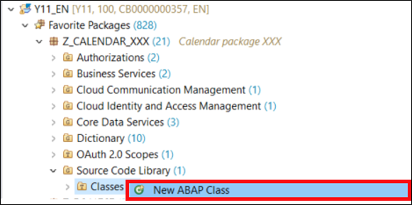
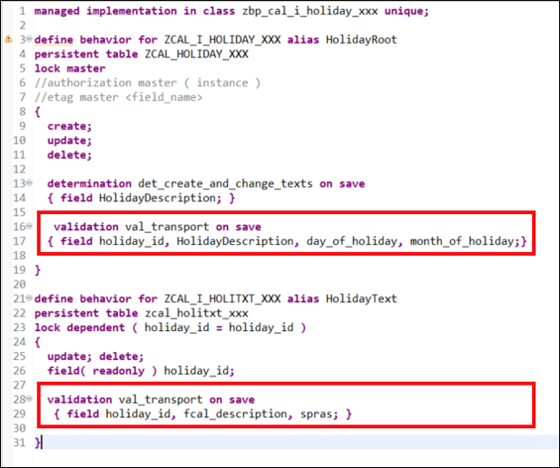
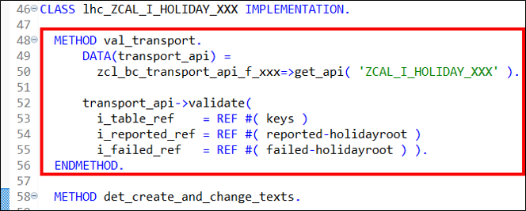
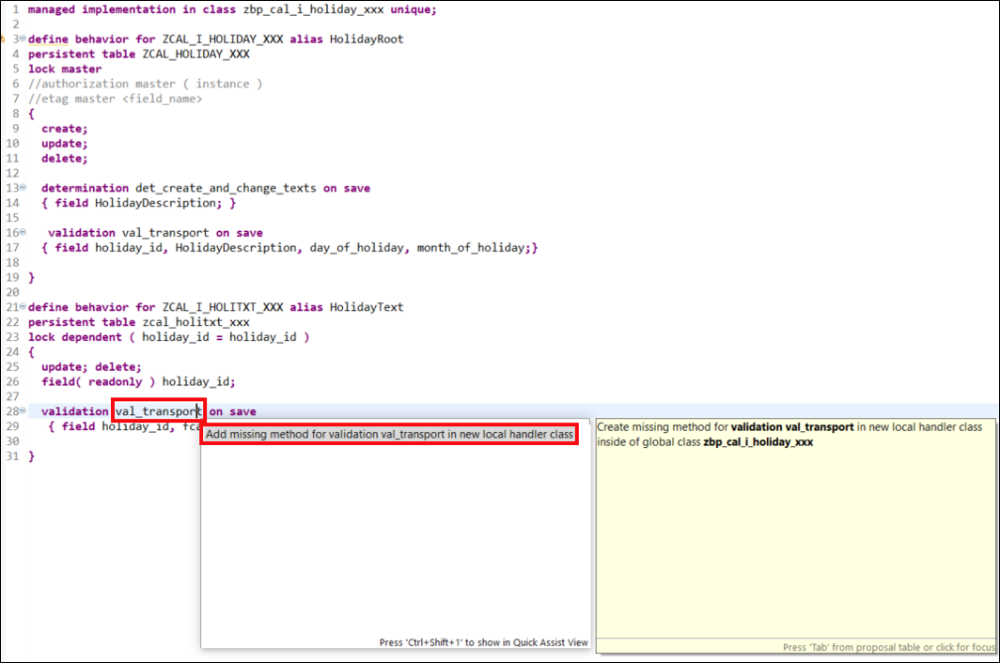
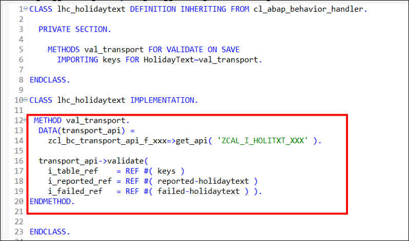
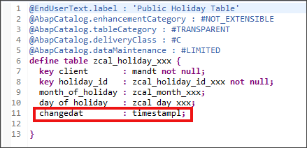
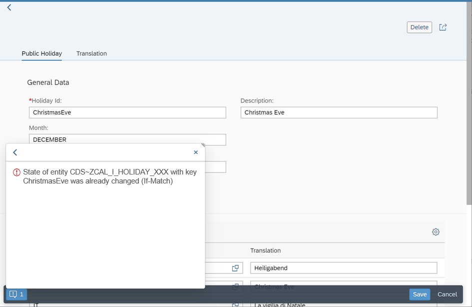

## Prerequisites  
- You need an SAP Cloud Platform ABAP Environment [trial user](abap-environment-trial-onboarding) or a license.
- You need to configure a software component of type **business configuration**: [Transport a Software Component Between Two ABAP Instances](abap-environment-gcts).
- You have to assign the **Configuration Expert - Business Process Configuration** role to the respective users.


## Details
### You will learn  
- How to create transport class
- How to implement save validation


To assign role **Configuration Expert – Business Process Configuration** to the respective user please follow the following steps:

  1.	Logon as administrator to your ABAP system (SAP Fiori launchpad).
  2.	Go to Fiori app **Business Role Templates**, find the **Configuration Expert - Business Process Configuration** template and create a business role based on this template.

  3.	With the authorizations contained in this business role, users can create customizing requests. You can create customizing requests in two ways:
    - Create them directly in the Transport Organizer in the Eclipse-based ABAP development tools (ADT).
    - Create them implicitly using the method `add_to_transport_request()`. If no request and/or task exists for a user, the API will create one, if the user has the authorization. If the user has no authorization and no request and/or task exists, the API will raise an exception.

  4.	With the authorizations contained in this business role, users can release customizing requests in the Transport Organizer in the Eclipse-based ABAP development tools (ADT). When releasing the request, the business configuration content is written to the Git repository and can be pulled into the target systems.


---
[ACCORDION-BEGIN [Step 1: ](Create ABAP interface)]

  1. Right-click on your class **`Z_CALENDAR_XXX`** and select **New** > **Other ABAP Repository Object**.

      

  2. Search for **ABAP Interface**, select it and click **Next**.

      

  3. Create a new ABAP interface:
      - Name: **`ZIF_BC_TRANSPORT_API_XXX`**
      - Description: **`Transport interface`**

      

      Click **Next >**.

  4. Click **Finish**.

      

  5. Insert following code:

    ```ABAP
    INTERFACE zif_bc_transport_api_xxx PUBLIC.

      METHODS transport
        IMPORTING
          i_create_ref TYPE REF TO data
          i_update_ref TYPE REF TO data
          i_delete_ref TYPE REF TO data.

      METHODS validate
        IMPORTING
          i_table_ref    TYPE REF TO data
          i_reported_ref TYPE REF TO data
          i_failed_ref   TYPE REF TO data.

    ENDINTERFACE.
    ```

  6. Save and activate.

[DONE]
[ACCORDION-END]

[ACCORDION-BEGIN [Step 2: ](Create transport class)]
The first step is to create a central class, which offers some transport change recording to the save validation and the save method for recording of the final changes. The class will reuse the SAP Cloud Platform ABAP environment Transport `API IF_A4C_BC_HANDLER`. So it will be used to wrap the generic transport API with a factory calendar specific transport API-method to offer a transport API for the Public Holiday business object. Furthermore, the class is being used to consolidate the returned success-fields, exceptions and messages of the generic API in a single output channel.

  1. Right-click on **`Classes`** and select **New ABAP Class**.

      

  2.  Create a new class:
      - Name: **`ZCL_BC_TRANSPORT_API_XXX`**
      - Description: **`Transport class`**

      

      Click **Next**.

  3. Click **Finish**.

      

  4. In your **global class** replace your code with following:

    ```ABAP
      CLASS zcl_bc_transport_api_xxx DEFINITION  PUBLIC  FINAL  CREATE PROTECTED  GLOBAL FRIENDS zcl_bc_transport_api_f_xxx.
        PUBLIC SECTION.
          INTERFACES zif_bc_transport_api_xxx.

          TYPES zfieldname TYPE c LENGTH 30.

          METHODS:
            constructor
              IMPORTING
                i_tabname TYPE tabname.

        PROTECTED SECTION.
          DATA: transport_api TYPE REF TO if_a4c_bc_handler,
                tabname       TYPE tabname,
                client_field  TYPE zfieldname.
          METHODS transport
            IMPORTING
              i_check_mode      TYPE abap_bool
              i_table_ref       TYPE REF TO data
            RETURNING
              VALUE(r_messages) TYPE if_a4c_bc_handler=>tt_message.
      ENDCLASS.


      CLASS zcl_bc_transport_api_xxx IMPLEMENTATION.


        METHOD constructor.
          transport_api = cl_a4c_bc_factory=>get_handler( ).
          tabname       = i_tabname.
          client_field  = 'CLIENT'.
        ENDMETHOD.


        METHOD transport.
          DATA: object_keys TYPE if_a4c_bc_handler=>tt_object_tables,
                object_key  TYPE if_a4c_bc_handler=>ts_object_list,
                table_ref   TYPE REF TO data.

          FIELD-SYMBOLS:
            <import_table>   TYPE ANY TABLE,
            <original_table> TYPE ANY TABLE.

          ASSIGN i_table_ref->* TO <import_table>.

          CREATE DATA table_ref TYPE TABLE OF (tabname).
          ASSIGN table_ref->* TO <original_table>.
          <original_table> = CORRESPONDING #( <import_table> ).

          object_key-objname = tabname.
          object_key-tabkeys = table_ref.
          APPEND object_key TO object_keys.

          TRY.
              transport_api->add_to_transport_request(
                EXPORTING
                  iv_check_mode         = i_check_mode
                  it_object_tables      = object_keys
                  iv_mandant_field_name = CONV #( client_field )
                IMPORTING
                  rt_messages           = r_messages
                  rv_success            = DATA(success_flag) ).

              IF success_flag NE 'S'.
                RAISE EXCEPTION TYPE cx_a4c_bc_exception.
              ENDIF.
            CATCH cx_a4c_bc_exception INTO DATA(bc_exception).
              APPEND
                VALUE #( msgty = bc_exception->if_t100_dyn_msg~msgty
                         msgid = bc_exception->if_t100_message~t100key-msgid
                         msgno = bc_exception->if_t100_message~t100key-msgno
                         msgv1 = bc_exception->if_t100_dyn_msg~msgv1
                         msgv2 = bc_exception->if_t100_dyn_msg~msgv2
                         msgv3 = bc_exception->if_t100_dyn_msg~msgv3
                         msgv4 = bc_exception->if_t100_dyn_msg~msgv4 )
                TO r_messages.
          ENDTRY.
        ENDMETHOD.


        METHOD zif_bc_transport_api_xxx~transport.
          FIELD-SYMBOLS:
            <all_records> TYPE INDEX TABLE,
            <insert>      TYPE INDEX TABLE,
            <update>      TYPE INDEX TABLE,
            <delete>      TYPE INDEX TABLE,
            <row>         TYPE any.

          ASSIGN i_create_ref->* TO <insert>.
          ASSIGN i_update_ref->* TO <update>.
          ASSIGN i_delete_ref->* TO <delete>.

          DATA: table_ref TYPE REF TO data,
                row_ref   TYPE REF TO data.
          CREATE DATA table_ref LIKE <insert>.
          CREATE DATA row_ref LIKE LINE OF <insert>.

          ASSIGN table_ref->* TO <all_records>.
          ASSIGN row_ref->* TO <row>.

          APPEND LINES OF <insert> TO <all_records>.
          APPEND LINES OF <update> TO <all_records>.
          LOOP AT <delete> ASSIGNING FIELD-SYMBOL(<delete_row>).
            <row> = CORRESPONDING #( <delete_row> ).
            APPEND <row> TO <all_records>.
          ENDLOOP.

          SORT <all_records>.
          DELETE ADJACENT DUPLICATES FROM <all_records> COMPARING ALL FIELDS.

          DATA(messages) =
            transport(
              i_check_mode = abap_false
              i_table_ref  = table_ref ).

          IF line_exists( messages[ msgty = 'E' ] ) OR
             line_exists( messages[ msgty = 'A' ] ) OR
             line_exists( messages[ msgty = 'X' ] ).
            ASSERT 1 EQ 2.
          ENDIF.
        ENDMETHOD.


        METHOD zif_bc_transport_api_xxx~validate.
          DATA reported_row_ref TYPE REF TO data.
          FIELD-SYMBOLS:
            <keys>           TYPE INDEX TABLE,
            <failed_table>   TYPE INDEX TABLE,
            <key_fields>     TYPE any,
            <reported_table> TYPE INDEX TABLE,
            <reported_row>   TYPE any,
            <reported_key>   TYPE any,
            <reported_msg>   TYPE REF TO if_abap_behv_message.

          DATA(messages) =
            transport(
              i_check_mode = abap_true
              i_table_ref  = i_table_ref ).

          ASSIGN i_table_ref->*  TO <keys>.
          ASSIGN i_reported_ref->* TO <reported_table>.
          CREATE DATA reported_row_ref LIKE LINE OF <reported_table>.
          ASSIGN reported_row_ref->* TO <reported_row>.
          ASSIGN COMPONENT '%KEY' OF STRUCTURE <reported_row> TO <reported_key>.
          ASSIGN COMPONENT '%MSG' OF STRUCTURE <reported_row> TO <reported_msg>.

          LOOP AT messages INTO DATA(message).
            IF message-msgty CA 'AEX'.
              DATA(failed) = abap_true.
            ENDIF.

            ASSIGN COMPONENT '%KEY' OF STRUCTURE <keys>[ 1 ] TO <key_fields>.
            <reported_key> = <key_fields>.
            <reported_msg> = NEW lcl_abap_behv_msg(
                                   i_severity = if_abap_behv_message=>severity-error
                                   i_msgid    = message-msgid
                                   i_msgno    = message-msgno
                                   i_msgv1    = message-msgv1
                                   i_msgv2    = message-msgv2
                                   i_msgv3    = message-msgv3
                                   i_msgv4    = message-msgv4 ).
            APPEND <reported_row> TO <reported_table>.
          ENDLOOP.

          IF failed EQ abap_true.
            " Set all keys to failed
            ASSIGN i_failed_ref->* TO <failed_table>.
            LOOP AT <keys> ASSIGNING FIELD-SYMBOL(<key>).
              ASSIGN COMPONENT '%KEY' OF STRUCTURE <key> TO <key_fields>.
              APPEND <key_fields> TO <failed_table>.
            ENDLOOP.
          ENDIF.

        ENDMETHOD.
      ENDCLASS.
    ```

  5. Don't save and activate yet.


  6. In your **local types** replace your code with following:

    ```ABAP
      CLASS lcl_abap_behv_msg DEFINITION CREATE PUBLIC INHERITING FROM cx_no_check.
        PUBLIC SECTION.
          INTERFACES if_abap_behv_message .

          METHODS constructor
            IMPORTING
              i_severity type if_abap_behv_message=>t_severity
              i_msgid    type sy-msgid
              i_msgno    type sy-msgno
              i_msgv1    TYPE sy-msgv1
              i_msgv2    TYPE sy-msgv2
              i_msgv3    TYPE sy-msgv3
              i_msgv4    TYPE sy-msgv4.
      ENDCLASS.
      CLASS lcl_abap_behv_msg IMPLEMENTATION.

        METHOD constructor.
          CALL METHOD super->constructor
            EXPORTING
              previous = previous.

          if_t100_dyn_msg~msgty = CONV #( i_severity ).
          if_t100_dyn_msg~msgv1 = if_t100_message~t100key-attr1 = i_msgv1.
          if_t100_dyn_msg~msgv2 = if_t100_message~t100key-attr2 = i_msgv2.
          if_t100_dyn_msg~msgv3 = if_t100_message~t100key-attr3 = i_msgv3.
          if_t100_dyn_msg~msgv4 = if_t100_message~t100key-attr4 = i_msgv4.

          if_t100_message~t100key-msgno = i_msgno.
          if_t100_message~t100key-msgid = i_msgid.

          if_abap_behv_message~m_severity = i_severity.
        ENDMETHOD.

      ENDCLASS.

    ```

  5. Don't save and activate yet.   

  6. Right-click on **`Classes`** and select **New ABAP Class**.

      

  7.  Create a new class:
      - Name: **`ZCL_BC_TRANSPORT_API_F_XXX`**
      - Description: **`Transport API Factory Class`**

      

      Click **Next**.

  8. Click **Finish**.

      

  9. Replace your code with following:

    ```ABAP
    CLASS zcl_bc_transport_api_f_xxx DEFINITION  PUBLIC  FINAL  CREATE PUBLIC.
    PUBLIC SECTION.
      CLASS-METHODS get_api
        IMPORTING
          i_tabname     TYPE tabname
        RETURNING
          VALUE(result) TYPE REF TO zif_bc_transport_api_xxx.
    ENDCLASS.


    CLASS zcl_bc_transport_api_f_xxx IMPLEMENTATION.
    METHOD get_api.
      result = NEW zcl_bc_transport_api_xxx( i_tabname ).
    ENDMETHOD.
    ENDCLASS.
    ```

  10. **Save** and **activate** all classes.

[DONE]
[ACCORDION-END]

[ACCORDION-BEGIN [Step 3: ](Implement save validation)]
After you have created the global transport class for your business object you can integrate it into your UI. First, the creation of a validation is needed. This validation will check whether all prerequisites are fulfilled, and if the changes can be recorded on the transport request.

  1. Open the behavior definition **`ZCAL_I_HOLIDAY_XXX`** and add following to the **root node**:

    ```ABAP
    validation val_transport on save
    { field holiday_id, HolidayDescription, day_of_holiday, month_of_holiday;}
    ```

    Add following to the **text node**:

    ```ABAP
     validation val_transport on save
      { field holiday_id, fcal_description, spras; }
    ```

      

  2. Save and activate your behavior definition. Set the cursor to the validation name **`val_transport`** of your **root node** and press **CTRL + 1**. Select **`Add missing method for validation val_transport in new local handler class`**.

      

  3. Implement the validation on the **root node** of your **`val_transport`**.

    ```ABAP
    METHOD val_transport.
        DATA(transport_api) =
          zcl_bc_transport_api_f_xxx=>get_api( 'ZCAL_I_HOLIDAY_XXX' ).

        transport_api->validate(
          i_table_ref    = REF #( keys )
          i_reported_ref = REF #( reported-holidayroot )
          i_failed_ref   = REF #( failed-holidayroot ) ).
    ENDMETHOD.
    ```

      

  4. Repeat step **4.2** to add the missing method for validation **`val_transport`** of your **text node**.

      

  5. Implement the validation on the **text node** of your **`val_transport`**.

    ```ABAP
    METHOD val_transport.
     DATA(transport_api) =
       zcl_bc_transport_api_f_xxx=>get_api( 'ZCAL_I_HOLITXT_XXX' ).

     transport_api->validate(
       i_table_ref    = REF #( keys )
       i_reported_ref = REF #( reported-holidaytext )
       i_failed_ref   = REF #( failed-holidaytext ) ).
    ENDMETHOD.
    ```

      

  6. Save and activate your class **`ZBP_CAL_I_HOLIDAY_XXX`**.

      The validation is finished. If you test the factory calendar and save some changes, the validation will be executed. In case the changes cannot be recorded on the transport request, the validation will output some error messages and the save action will be cancelled.

  7. For the final recording of the changes on save, we have to implement an additional save method. The previously created coding can be reused.

    Open your behavior definition **`ZCAL_I_HOLIDAY_XXX`** and add the **with additional save** statement to your **root node** and **text node**.

    ```ABAP
    with additional save
    ```

      

 8. Save and activate.

 9. Set the cursor to **`save`** of your **root node** and press **CTRL + 1**.
    Select **`Add missing method for validation save_modified in new local saver class`**.

    ```ABAP
    METHOD save_modified.
    DATA(transport_api_root) =
      zcl_bc_transport_api_f_xxx=>get_api( 'ZCAL_I_HOLIDAY_XXX' ).
    DATA(transport_api_text) =
      zcl_bc_transport_api_f_xxx=>get_api( 'ZCAL_I_HOLITXT_XXX' ).

    transport_api_root->transport(
      i_create_ref = REF #( create-holidayroot )
      i_update_ref = REF #( update-holidayroot )
      i_delete_ref = REF #( delete-holidayroot ) ).

    transport_api_text->transport(
      i_create_ref = REF #( create-holidaytext )
      i_update_ref = REF #( update-holidaytext )
      i_delete_ref = REF #( delete-holidaytext ) ).
    ENDMETHOD.

    ```

    

 11. Save and activate.

 12. Check your result. Your implementation should look like following:

    ```ABAP
    CLASS lsc_zcal_i_holiday_xxx DEFINITION INHERITING FROM cl_abap_behavior_saver.

      PROTECTED SECTION.

        METHODS save_modified REDEFINITION.


    ENDCLASS.

    CLASS lsc_zcal_i_holiday_xxx IMPLEMENTATION.

     METHOD save_modified.
      DATA(transport_api_root) =
        zcl_bc_transport_api_f_xxx=>get_api( 'ZCAL_I_HOLIDAY_XX' ).
      DATA(transport_api_text) =
        zcl_bc_transport_api_f_xxx=>get_api( 'ZCAL_I_HOLITXT_XXX' ).

      transport_api_root->transport(
        i_create_ref = REF #( create-holidayroot )
        i_update_ref = REF #( update-holidayroot )
        i_delete_ref = REF #( delete-holidayroot ) ).

      transport_api_text->transport(
        i_create_ref = REF #( create-holidaytext )
        i_update_ref = REF #( update-holidaytext )
        i_delete_ref = REF #( delete-holidaytext ) ).
    ENDMETHOD.


    ENDCLASS.

    CLASS lhc_holidaytext DEFINITION INHERITING FROM cl_abap_behavior_handler.

      PRIVATE SECTION.

        METHODS val_transport FOR VALIDATE ON SAVE
          IMPORTING keys FOR HolidayText~val_transport.

    ENDCLASS.

    CLASS lhc_holidaytext IMPLEMENTATION.

     METHOD val_transport.
      DATA(transport_api) =
        zcl_bc_transport_api_f_xxx=>get_api( 'ZCAL_I_HOLITXT_XXX' ).

      transport_api->validate(
        i_table_ref    = REF #( keys )
        i_reported_ref = REF #( reported-holidaytext )
        i_failed_ref   = REF #( failed-holidaytext ) ).
    ENDMETHOD.


    ENDCLASS.

    CLASS lhc_ZCAL_I_HOLIDAY_XXX   DEFINITION INHERITING
      FROM cl_abap_behavior_handler.
      PRIVATE SECTION.

       METHODS det_create_and_change_texts FOR DETERMINE ON SAVE
          IMPORTING
            keys FOR HolidayRoot~det_create_and_change_texts.
       METHODS val_transport FOR VALIDATE ON SAVE
         IMPORTING keys FOR HolidayRoot~val_transport.
       METHODS delete FOR MODIFY
         IMPORTING keys FOR ACTION HolidayRoot~delete.

       METHODS create_description
          IMPORTING
            i_holiday_id  TYPE zcal_holiday_id_xxx
            i_description TYPE zcal_description_xxx.

        METHODS update_description
          IMPORTING
            i_holiday_id  TYPE zcal_holiday_id_xxx
            i_description TYPE zcal_description_xxx.

    ENDCLASS.

    CLASS lhc_ZCAL_I_HOLIDAY_XXX IMPLEMENTATION.

      METHOD val_transport.
          DATA(transport_api) =
            zcl_bc_transport_api_f_xxx=>get_api( 'ZCAL_I_HOLIDAY_XXX' ).

          transport_api->validate(
            i_table_ref    = REF #( keys )
            i_reported_ref = REF #( reported-holidayroot )
            i_failed_ref   = REF #( failed-holidayroot ) ).
      ENDMETHOD.

      METHOD det_create_and_change_texts.

        READ ENTITIES OF zcal_i_holiday_xxx
          ENTITY HolidayRoot
          FROM VALUE #( FOR <root_key> IN keys ( %key = <root_key> ) )
          RESULT DATA(public_holidays_table).


        LOOP AT public_holidays_table INTO DATA(public_holiday).
          READ ENTITIES OF zcal_i_holiday_xxx
            ENTITY HolidayRoot BY \_HolidayTxt
            FROM VALUE #( ( %key = public_holiday-%key ) )
            RESULT DATA(description_table).
          IF line_exists( description_table[
                            spras      = sy-langu
                            holiday_id = public_holiday-holiday_id ] ).
            update_description(
              i_holiday_id  = public_holiday-holiday_id
              i_description = public_holiday-HolidayDescription ).

          ELSE.
            create_description(
              i_holiday_id  = public_holiday-holiday_id
              i_description = public_holiday-HolidayDescription ).
          ENDIF.
        ENDLOOP.

      ENDMETHOD.

      METHOD create_description.
        DATA:
          description_table TYPE TABLE FOR CREATE zcal_i_holiday_xxx\_HolidayTxt,
          description       TYPE STRUCTURE FOR CREATE zcal_i_holiday_xxx\_HolidayTxt.

        description-%key    = i_holiday_id.
        description-%target =
          VALUE #(
                   ( holiday_id       = i_holiday_id
                     spras            = sy-langu
                     fcal_description = i_description
                     %control = VALUE
                                #( holiday_id       = cl_abap_behv=>flag_changed
                                   spras            = cl_abap_behv=>flag_changed
                                   fcal_description = cl_abap_behv=>flag_changed
                                 )
                   )
                 ).

        APPEND description TO description_table.

        MODIFY ENTITIES OF zcal_i_holiday_xxx IN LOCAL MODE
          ENTITY HolidayRoot CREATE BY \_HolidayTxt FROM description_table.
      ENDMETHOD.

      METHOD update_description.
        DATA:
          description_table TYPE TABLE FOR UPDATE zcal_i_holitxt_xxx,
          description       TYPE STRUCTURE FOR UPDATE zcal_i_holitxt_xxx.

        description-holiday_id       = i_holiday_id.
        description-spras            = sy-langu.
        description-fcal_description = i_description.

        description-%control-fcal_description = cl_abap_behv=>flag_changed.
        APPEND description TO description_table.

        MODIFY ENTITIES OF zcal_i_holiday_xxx IN LOCAL MODE
          ENTITY HolidayText UPDATE FROM description_table.
      ENDMETHOD.

      METHOD delete.
        CONSTANTS no_longer_valid TYPE zconfig_deprecation_code_xxx VALUE 'E'.
        DATA holidayroot_table TYPE TABLE FOR UPDATE zcal_i_holiday_xxx.

        LOOP AT keys ASSIGNING FIELD-SYMBOL(<key>).
          APPEND
            VALUE #( holiday_id            = <key>-holiday_id
                     configdeprecationcode = no_longer_valid
                     %control              = VALUE #( configdeprecationcode = cl_abap_behv=>flag_changed ) )
               TO holidayroot_table.
        ENDLOOP.

        MODIFY ENTITIES OF zcal_i_holiday_xxx IN LOCAL MODE
          ENTITY HolidayRoot UPDATE FROM holidayroot_table
              MAPPED   DATA(ls_mapped)
              FAILED   DATA(ls_failed)
              REPORTED DATA(ls_reported).
      ENDMETHOD.


    ENDCLASS.

    ```

    Now your whole transport functionality is ready for testing. Whenever you now save an object all keys will be written to a transport request. In case of problems, please consider checking the prerequisites section again.

[DONE]
[ACCORDION-END]

[ACCORDION-BEGIN [Step 4: ](Add ETAG to factory calendar business object)]

The ABAP RESTful Programming Model supports optimistic locking using entity tags. The timestamp (last changed on) is used as ETAG-field. On save, the value of the ETAG field kept in the user interface is compared with the value of the ETAG field in the database. If the value no longer matches, another process must have changed the entity. The outdated version is detected by RAP and the saving process is aborted with an error message.

>Ensure that the annotation of the ETAG field **`changedat`** in your data definition **`ZCAL_I_HOLIDAY_XXX`** is **`@Semantics.systemDateTime.lastChangedAt: true`**.

  1. Open your database table **`ZCAL_HOLIDAY_XXX`** and ensure that you added field **`changedat`** of type **`timestampl`**.

    

  2. Open behavior definition **`ZCAL_I_HOLIDAY_XXX`** and add **`etag master changedat`** to the behavior definition of entity **`ZCAL_I_HOLIDAY_XXX`**.

     

     Save and activate.

  4. Your code should look like following:

    ```ABAP
    managed implementation in class zbp_cal_i_holiday_xxx unique;

    define behavior for ZCAL_I_HOLIDAY_XXX alias HolidayRoot
    persistent table ZCAL_HOLIDAY_XXX
    lock master
    with additional save
    //authorization master ( instance )
    etag master changedat
    {
      create;
      update;
      delete;

      determination det_create_and_change_texts on save
      { field HolidayDescription; }

      validation val_transport on save
     { field holiday_id, HolidayDescription, day_of_holiday, month_of_holiday;}

    }

    define behavior for ZCAL_I_HOLITXT_XXX alias HolidayText
    persistent table zcal_holitxt_xxx
    lock dependent by _PublicHoliday
    with additional save
    {
      update; delete;
      field( readonly ) holiday_id;

       validation val_transport on save
      { field holiday_id, fcal_description, spras; }

    }
    ```

  5. Open your service binding to start your SAP Fiori Elements preview.

     If one entity of the factory calendar is edited from two users at the same time, an error message appears:

      

[DONE]
[ACCORDION-END]


[ACCORDION-BEGIN [Step 5: ](Test yourself)]

[VALIDATE_1]
[ACCORDION-END]
---
