## Prerequisites  
- You need a SAP BTP, ABAP environment license.
- You have to assign the **Configuration Expert - Business Process Configuration** role to the respective users.

## Details
### You will learn  
- How to maintain business configuration
- How to create transport class
- How to implement save validation

Business configuration content can be recorded on both software components of type **Business Configuration** or **Development**. The former is recommended, see also [Business Configuration for SAP BTP, ABAP Environment | SAP Blogs](https://blogs.sap.com/2019/12/20/business-configuration-for-sap-cloud-platform-abap-environment/)

The necessary transport request can be created in the Transport Organizer Tab in ADT or in the [Export Customizing Transports](https://help.sap.com/viewer/65de2977205c403bbc107264b8eccf4b/Cloud/en-US/fa7366c3888848bd94566104ac52e627.html) app.

The transport request must have the attribute `SAP_ATO_TRANSPORT_TYPE` set to **Business Configuration** and the attribute `SAP_CUS_TRANSPORT_CATEGORY` set to `DEFAULT_CUST` or `MANUAL_CUST`

>**HINT:** You can manage your customizing transports with the [Export Customizing Transports](https://help.sap.com/viewer/65de2977205c403bbc107264b8eccf4b/Cloud/en-US/fa7366c3888848bd94566104ac52e627.html) app.
>To access this app and to be able to create a transport request the role **Configuration Expert - Business Process Configuration** can be assigned to the user.
>For this role the access category **Write, Read, Value Help** must be set to **Unrestricted** to be able to create a transport request.

The RAP business object is enhanced with the following steps by a transport selection action and the recording of the business configuration changes during the save operation.

---

[ACCORDION-BEGIN [Step 1: ](Maintain business configuration)]

>**HINT: This tutorial needs to be done in a licensed system.**


  1. Open behavior definition `ZCAL_I_MCAL_ALL_XXX` and edit it. Add the action `selectTransportRequest` to entity `HolidayAll`. The abstract entity `D_SelectCustomizingTransptReqP` returns all modifiable customizing transport requests where the user is the owner of the request or at least one task of the request.  

    ```ABAP
    managed with additional save implementation in class zbp_cal_i_mcal_all_xxx unique;
    strict;
    with draft;

    define behavior for zcal_i_mcal_all_xxx alias HolidayAll
    with unmanaged save
    lock master total etag LastChangedAtMax
    authorization master ( global )
    draft table zcal_x_cal_a_xxx
    {
      update;
      draft action Activate;
      draft action Discard;
      draft action Edit;
      draft action Resume;
      draft determine action Prepare;

      action ( features : instance ) selectTransportRequest parameter D_SelectCustomizingTransptReqP result [1] $self;

      association _Holiday { create; with draft; }
    }
    define behavior for zcal_i_mcal_xxx alias HolidayRoot
    lock dependent by _HolidayAll
    authorization dependent by _HolidayAll
    persistent table zcal_holiday_xxx
    draft table zcal_d_cal_xxx
    {
      update;
      delete;
      field ( readonly ) HolidayAllID;
      field ( readonly : update ) Holiday;
      association _HolidayAll { with draft; }
      association _HolidayTxt { create; with draft; }

      mapping for ZCAL_HOLIDAY_XXX corresponding
      {
        Holiday = holiday_id;
        HolidayDay = day_of_holiday;
        HolidayMonth = month_of_holiday;
      }
    }

    define behavior for zcal_i_mcal_txt_xxx alias HolidayText
    lock dependent by _HolidayAll
    authorization dependent by _HolidayAll
    persistent table zcal_holitxt_xxx
    draft table zcal_d_txt_xxx

    {
      update;
      delete;
      field ( readonly : update ) Holiday;
      field ( readonly : update ) Language;

      field ( readonly ) HolidayAllID;

      association _HolidayAll { with draft; }
      association _Public_Holiday { with draft; }

      mapping for ZCAL_HOLITXT_XXX corresponding
      {
        Language = spras;
        Holiday = holiday_id;
        HolidayDescription = fcal_description;
      }
    }
    ```

  2. Save and activate.

  3. Place the cursor on action `selectTransportRequest` and use the quick assist (CTRL+1) to create the missing methods.

      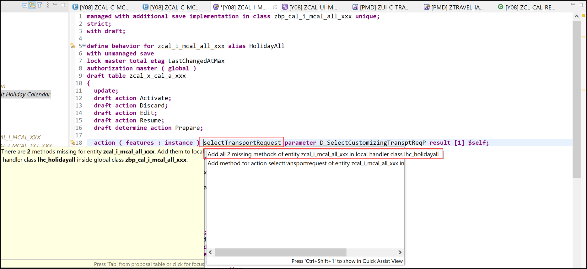

  4. Implement the following methods in class `ZBP_CAL_I_MCAL_ALL_XXX`. The `selectTransportRequest` action must only be active if the Business Configuration is in edit mode. The result of the selection is stored in the draft version of the singleton entity.

    Insert following code:

    ```ABAP
    CLASS lhc_HolidayAll DEFINITION INHERITING FROM cl_abap_behavior_handler.
      PRIVATE SECTION.

        METHODS get_global_authorizations FOR GLOBAL AUTHORIZATION
          IMPORTING REQUEST requested_authorizations FOR HolidayAll RESULT result.
        METHODS get_instance_features FOR INSTANCE FEATURES
          IMPORTING keys REQUEST requested_features FOR HolidayAll RESULT result.

        METHODS selectTransportRequest FOR MODIFY
          IMPORTING keys FOR ACTION HolidayAll~selectTransportRequest RESULT result.

    ENDCLASS.

    CLASS lhc_HolidayAll IMPLEMENTATION.

      METHOD get_global_authorizations.
      ENDMETHOD.

      METHOD get_instance_features.
        READ ENTITIES OF zcal_i_mcal_all_xxx IN LOCAL MODE
           ENTITY holidayall
           ALL FIELDS WITH CORRESPONDING #( keys )
           RESULT DATA(all).

      result = VALUE #( ( %tky = all[ 1 ]-%tky
                     %action-selecttransportrequest = COND #( WHEN all[ 1 ]-%is_draft = if_abap_behv=>mk-on THEN if_abap_behv=>fc-o-enabled
                                                              ELSE if_abap_behv=>fc-o-disabled  )   ) ).


      ENDMETHOD.

      METHOD selectTransportRequest.
       MODIFY ENTITIES OF zcal_i_mcal_all_xxx IN LOCAL MODE
      ENTITY holidayall
      UPDATE FIELDS ( request hidetransport )
      WITH VALUE #( FOR key IN keys
                   ( %tky         = key-%tky
                     request = key-%param-transportrequestid
                     hidetransport = abap_false ) ).
      READ ENTITIES OF zcal_i_mcal_all_xxx IN LOCAL MODE
        ENTITY holidayall
          ALL FIELDS WITH CORRESPONDING #( keys )
        RESULT DATA(holidays).
      result = VALUE #( FOR holiday IN holidays
                          ( %tky   = holiday-%tky
                            %param = holiday ) ).
      ENDMETHOD.

    ENDCLASS.


    CLASS lsc_ZCAL_I_MCAL_ALL_XXX DEFINITION INHERITING FROM cl_abap_behavior_saver.
      PROTECTED SECTION.

        METHODS save_modified REDEFINITION.

        METHODS cleanup_finalize REDEFINITION.

    ENDCLASS.

    CLASS lsc_ZCAL_I_MCAL_ALL_XXX IMPLEMENTATION.

      METHOD save_modified.
      ENDMETHOD.

      METHOD cleanup_finalize.
      ENDMETHOD.

    ENDCLASS.
    ```

  6. Save and activate.

  7. Edit Behavior Projection `ZCAL_C_MCAL_ALL_XXX`. Add the action `selectTransportRequest` to entity `HolidayAll`.

    ```ABAP
    projection implementation in class zbp_cal_c_mcal_all_xxx unique;
    strict;
    use draft;

    define behavior for ZCAL_C_MCAL_ALL_XXX alias HolidayAll
    {
      use action Activate;
      use action Discard;
      use action Edit;
      use action Prepare;
      use action Resume;

      use action selectTransportRequest;

      use association _Holiday { create ( augment ); with draft; }
    }
    define behavior for ZCAL_c_MCAL_XXX alias HolidayRoot
    {
      use update ( augment );
      use delete;

      field ( modify ) HolidayDescription;

      use association _HolidayAll { with draft; }
      use association _HolidayTxt { create; with draft; }
    }

    define behavior for ZCAL_c_MCAL_TXT_XXX alias HolidayText
    {
      use update;
      use delete;

      use association _HolidayAll { with draft; }
      use association _Public_Holiday { with draft; }
    }
    ```

  8. Save and activate.

  9. Edit Metadata Extension `ZCAL_C_MCAL_ALL_XXX`. The `Transport` facet is only shown when a transport request was selected.

    ```ABAP
    @Metadata.layer: #CORE

    @UI: { headerInfo: { typeName: 'Holiday' } }
    annotate view ZCAL_C_MCAL_ALL_XXX with
    {
      @UI.facet: [
                {
            id: 'Transport',
            purpose: #STANDARD,
            label: 'Transport',
            type: #IDENTIFICATION_REFERENCE,
            position: 1,
            hidden: #(HideTransport)
          },
      {
      purpose:  #STANDARD,
      type:     #LINEITEM_REFERENCE,
      label:    'Holidays',
      position: 2,
      targetElement: '_Holiday'
      }
      ]

      @UI.lineItem: [{ position: 1 }]
      HolidayAllID;
      @UI.identification: [{position: 2, importance: #HIGH },{ type: #FOR_ACTION, dataAction: 'selectTransportRequest', label: 'Select Transport Request' }]
      Request;
      @UI.hidden
      HideTransport;
    }
    ```

 10. Save and activate.

 11. Start the Maintain Business Configuration app and select your business configuration.

      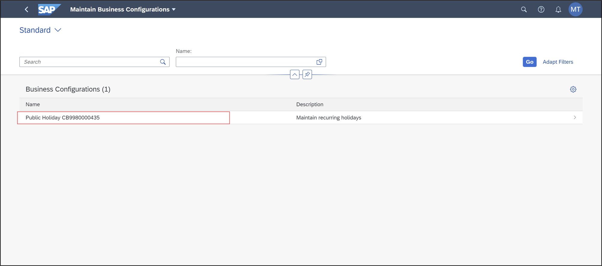

 12.  A new action **Select Transport Request** is available in top right corner. The action is only active in edit mode.

      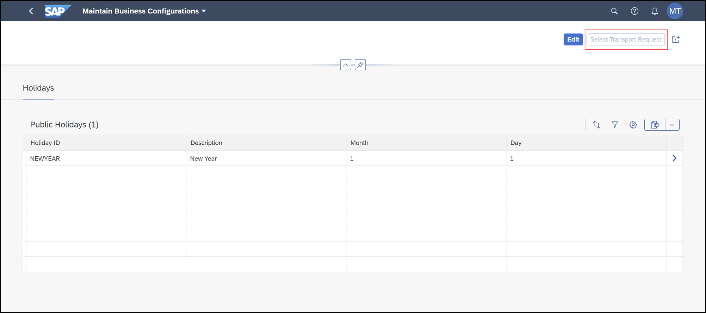

 13. Click **Edit**.

      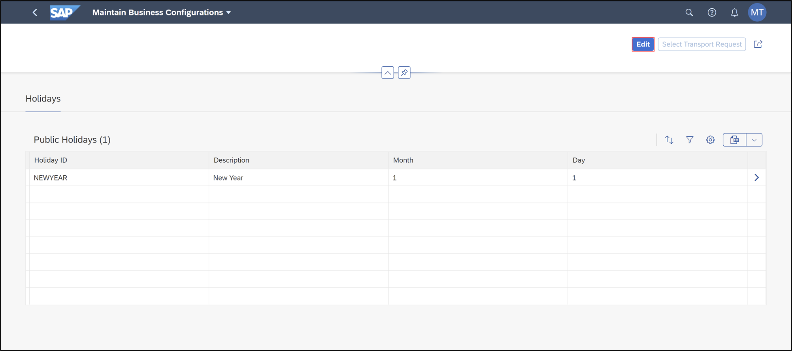

 14. Click **Select Transport Request** and select an transport request.

      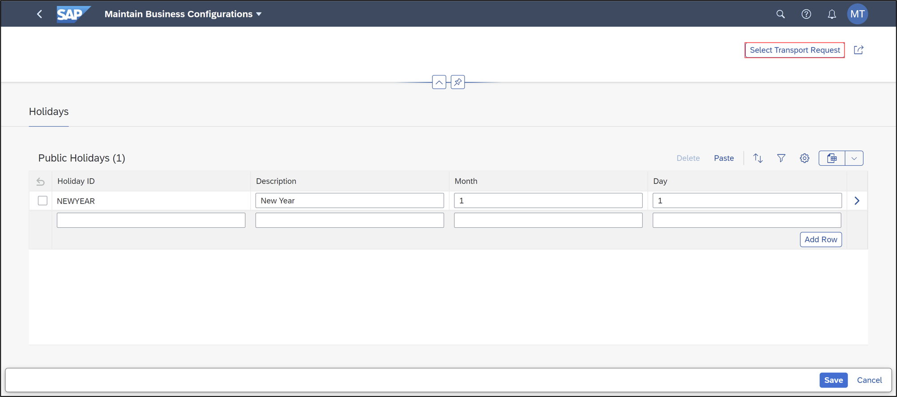

 15. If no transport request is available, use the **[Export Customizing Transport](https://help.sap.com/viewer/65de2977205c403bbc107264b8eccf4b/Cloud/en-US/fa7366c3888848bd94566104ac52e627.html)** to create one. Enter your transport request from the transport organizer tab in ADT.

      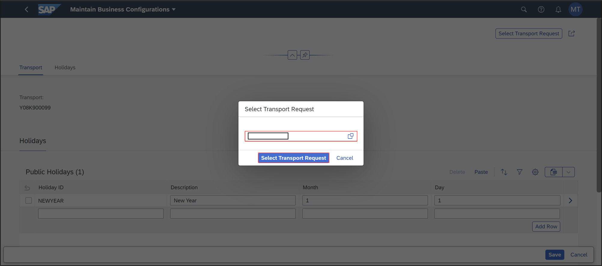

 16. After selecting a transport request, the facet **Transport** is visible.

      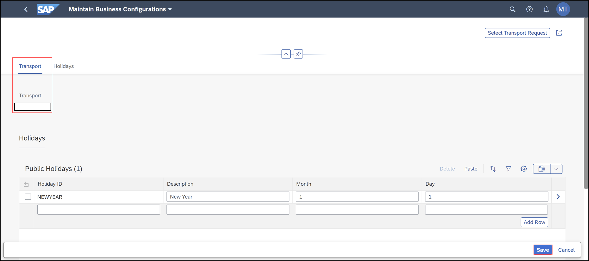


[DONE]
[ACCORDION-END]


[ACCORDION-BEGIN [Step 2: ](Recording changes in transport request for software component of type development)]


1. Edit Behavior Definition `ZCAL_I_MCAL_ALL_XXX`. Add [validation](https://help.sap.com/viewer/923180ddb98240829d935862025004d6/Cloud/en-US/171e26c36cca42699976887b4c8a83bf.html) `validateChanges` to both entity `HolidayRoot` and `HolidayText`.

    ```ABAP
    managed with additional save implementation in class zbp_cal_i_mcal_all_xxx unique;
    strict;
    with draft;

    define behavior for zcal_i_mcal_all_xxx alias HolidayAll
    with unmanaged save
    lock master total etag LastChangedAtMax
    authorization master ( global )
    draft table zcal_x_cal_a_xxx
    {
      update;
      draft action Activate;
      draft action Discard;
      draft action Edit;
      draft action Resume;
      draft determine action Prepare;

      action ( features : instance ) selectTransportRequest parameter D_SelectCustomizingTransptReqP result [1] $self;

      association _Holiday { create; with draft; }
    }
    define behavior for zcal_i_mcal_xxx alias HolidayRoot
    lock dependent by _HolidayAll
    authorization dependent by _HolidayAll
    persistent table zcal_holiday_xxx
    draft table zcal_d_cal_xxx
    {
      update;
      delete;
      field ( readonly ) HolidayAllID;
      field ( readonly : update ) Holiday;
      association _HolidayAll { with draft; }
      association _HolidayTxt { create; with draft; }

      mapping for ZCAL_HOLIDAY_XXX corresponding
      {
        Holiday = holiday_id;
        HolidayDay = day_of_holiday;
        HolidayMonth = month_of_holiday;
      }

      validation validateChanges on save ##NOT_ASSIGNED_TO_DETACT { create; update; delete; }
    }

    define behavior for zcal_i_mcal_txt_xxx alias HolidayText
    lock dependent by _HolidayAll
    authorization dependent by _HolidayAll
    persistent table zcal_holitxt_xxx
    draft table zcal_d_txt_xxx

    {
      update;
      delete;
      field ( readonly : update ) Holiday;
      field ( readonly : update ) Language;

      field ( readonly ) HolidayAllID;

      association _HolidayAll { with draft; }
      association _Public_Holiday { with draft; }


      mapping for ZCAL_HOLITXT_XXX corresponding
      {
        Language = spras;
        Holiday = holiday_id;
        HolidayDescription = fcal_description;
      }


      validation validateChanges on save ##NOT_ASSIGNED_TO_DETACT { create; update; delete; }
    }
    ```

2. Save and activate.

3. One after another place the cursor on the both validations and use the quick assist (CTRL+1)to create the missing methods.

    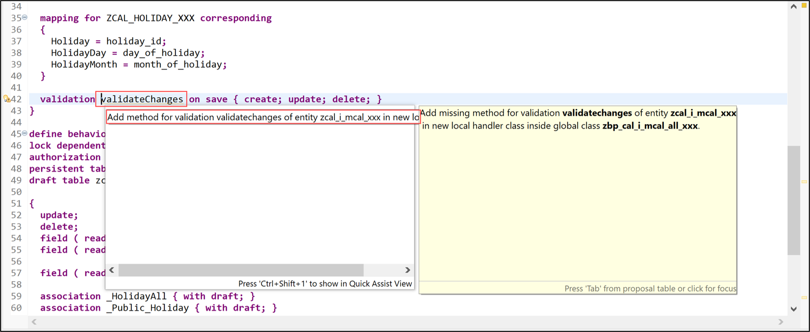


    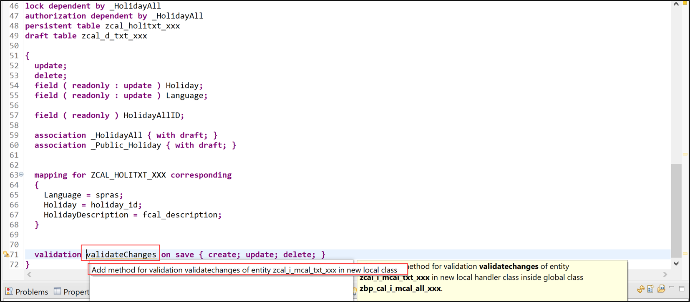

4. Edit Class `ZBP_CAL_I_MCAL_ALL_XXX`. Implement the validation methods, the save method and add a new helper class.

    ```ABAP
    CLASS lhc_mbc_cts DEFINITION.
      PUBLIC SECTION.
        METHODS get_mbc_cts RETURNING VALUE(result) TYPE REF TO if_mbc_cp_rap_table_cts.
    ENDCLASS.

    CLASS lhc_mbc_cts IMPLEMENTATION.
      METHOD get_mbc_cts.
        result = mbc_cp_api=>rap_table_cts( table_entity_relations = VALUE #( ( entity = 'HolidayRoot' table = 'ZCAL_HOLIDAY_XXX' )
                                                                              ( entity = 'HolidayText' table = 'ZCAL_HOLITXT_XXX' ) ) ).
      ENDMETHOD.
    ENDCLASS.

    CLASS lhc_holidayroot DEFINITION INHERITING FROM cl_abap_behavior_handler.
      PRIVATE SECTION.
        METHODS validateChanges FOR VALIDATE ON SAVE
          IMPORTING keys FOR HolidayRoot~validateChanges.
    ENDCLASS.

    CLASS lhc_holidayroot IMPLEMENTATION.
      METHOD validateChanges.
        DATA change TYPE REQUEST FOR CHANGE zcal_i_mcal_all_xxx.
        SELECT SINGLE request FROM zcal_x_cal_a_xxx INTO @DATA(request).
        NEW lhc_mbc_cts( )->get_mbc_cts( )->validate_changes(
            transport_request = request
            table             = 'ZCAL_HOLIDAY_XXX'
            keys              = REF #( keys )
            reported          = REF #( reported )
            failed            = REF #( failed )
            change            = REF #( change-holidayroot ) ).
      ENDMETHOD.
    ENDCLASS.

    CLASS lhc_holidaytext DEFINITION INHERITING FROM cl_abap_behavior_handler.
      PRIVATE SECTION.
        METHODS validateChanges FOR VALIDATE ON SAVE
          IMPORTING keys FOR HolidayText~validateChanges.
    ENDCLASS.

    CLASS lhc_holidaytext IMPLEMENTATION.
      METHOD validatechanges.
        DATA change TYPE REQUEST FOR CHANGE zcal_i_mcal_all_xxx.
        SELECT SINGLE request FROM zcal_x_cal_a_xxx INTO @DATA(request).
        NEW lhc_mbc_cts( )->get_mbc_cts( )->validate_changes(
            transport_request = request
            table             = 'ZCAL_HOLITXT_XXX'
            keys              = REF #( keys )
            reported          = REF #( reported )
            failed            = REF #( failed )
            change            = REF #( change-holidaytext ) ).
      ENDMETHOD.
    ENDCLASS.

    CLASS lhc_holidayall DEFINITION INHERITING FROM cl_abap_behavior_handler.
      PRIVATE SECTION.
        METHODS get_global_authorizations FOR GLOBAL AUTHORIZATION
          IMPORTING REQUEST requested_authorizations FOR holidayall RESULT result.
        METHODS get_instance_features FOR INSTANCE FEATURES
          IMPORTING keys REQUEST requested_features FOR holidayall RESULT result.
        METHODS selecttransportrequest FOR MODIFY
          IMPORTING keys FOR ACTION holidayall~selecttransportrequest RESULT result.
    ENDCLASS.

    CLASS lhc_holidayall IMPLEMENTATION.
      METHOD get_global_authorizations.
      ENDMETHOD.

      METHOD get_instance_features.
        READ ENTITIES OF zcal_i_mcal_all_xxx IN LOCAL MODE
             ENTITY holidayall
             ALL FIELDS WITH CORRESPONDING #( keys )
             RESULT DATA(all).

        result = VALUE #( ( %tky = all[ 1 ]-%tky
                      %action-selecttransportrequest = COND #( WHEN all[ 1 ]-%is_draft = if_abap_behv=>mk-on THEN if_abap_behv=>fc-o-enabled
                                                               ELSE if_abap_behv=>fc-o-disabled  )   ) ).
      ENDMETHOD.

      METHOD selecttransportrequest.
        MODIFY ENTITIES OF zcal_i_mcal_all_xxx IN LOCAL MODE
        ENTITY holidayall
        UPDATE FIELDS ( request hidetransport )
        WITH VALUE #( FOR key IN keys
                     ( %tky         = key-%tky
                       request = key-%param-transportrequestid
                       hidetransport = abap_false ) ).
        READ ENTITIES OF zcal_i_mcal_all_xxx IN LOCAL MODE
          ENTITY holidayall
            ALL FIELDS WITH CORRESPONDING #( keys )
          RESULT DATA(holidays).
        result = VALUE #( FOR holiday IN holidays
                            ( %tky   = holiday-%tky
                              %param = holiday ) ).
      ENDMETHOD.

    ENDCLASS.

    CLASS lsc_zcal_i_mcal_all_xxx DEFINITION INHERITING FROM cl_abap_behavior_saver.
      PROTECTED SECTION.
        METHODS save_modified REDEFINITION.
        METHODS cleanup_finalize REDEFINITION.
    ENDCLASS.

    CLASS lsc_zcal_i_mcal_all_xxx IMPLEMENTATION.
      METHOD save_modified.
        READ TABLE update-holidayall INDEX 1 INTO DATA(all).
        IF all-request IS NOT INITIAL.
          NEW lhc_mbc_cts( )->get_mbc_cts( )->record_changes(
            EXPORTING
              transport_request = all-request
              create            = REF #( create )
              update            = REF #( update )
              delete            = REF #( delete ) ).
        ENDIF.
      ENDMETHOD.

      METHOD cleanup_finalize.
      ENDMETHOD.
    ENDCLASS.
    ```

5. Save and activate.

6. Start the **Maintain Business Configuration** app and select your business configuration.

    

7. If a draft version is available, discard it by clicking **Cancel**. Click **Edit**, perform some changes on the business configuration entries.

    

8. Use  **Select Transport Request** to select a transport request.

    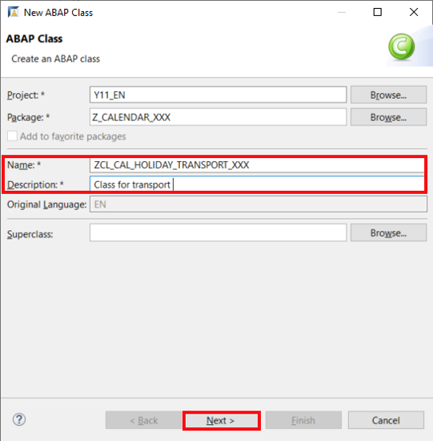

9. Enter your transport request.

    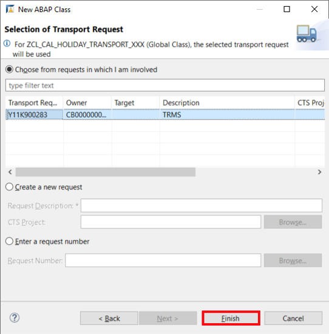

10. Click **Save**. Now you can see your transport request.

    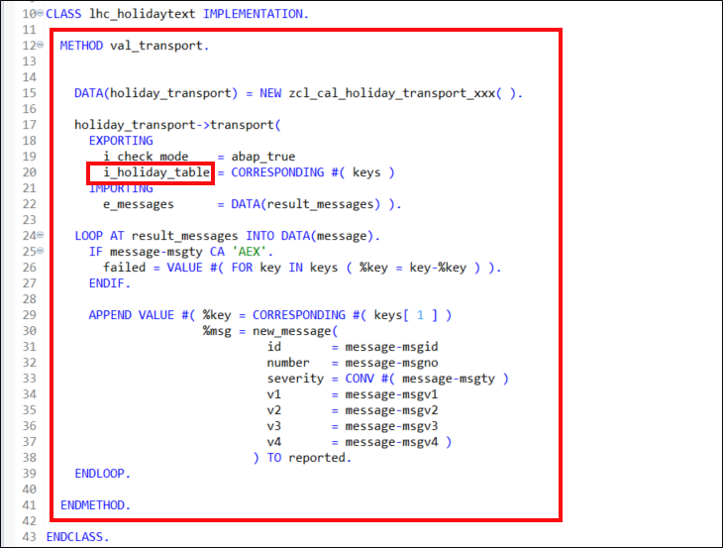

12. Start the **Export Customizing Transport** app.

    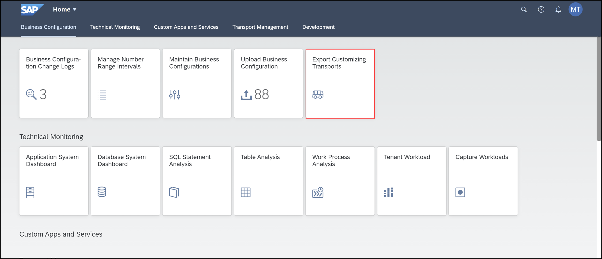

13. Check if the table content was recorded on the selected transport request.

    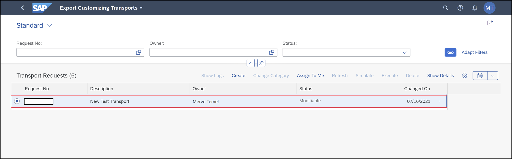

    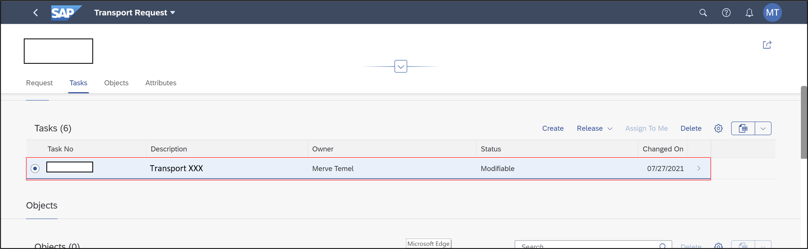


[DONE]
[ACCORDION-END]


[ACCORDION-BEGIN [Step 5: ](Test yourself)]

[VALIDATE_1]
[ACCORDION-END]
---
