## Prerequisites  
 - You have created a trial account on SAP Cloud Platform:  [Get a Free Trial Account on SAP Cloud Platform](hcp-create-trial-account).
 - You have created a cloud foundry trial account: [Create a Cloud Foundry Account](cp-cf-create-account).

## Details 
### You will learn  
  - How to create an trial user
  - How to create an ABAP Cloud project

---
[ACCORDION-BEGIN [Step 1: ](Configure SAP Cloud Platform Entitlements)]
  1. Open SAP Cloud Platform Trial Cockpit to logon to your existing Cloud Foundry trial account
     <https://cockpit.hanatrial.ondemand.com/>.

      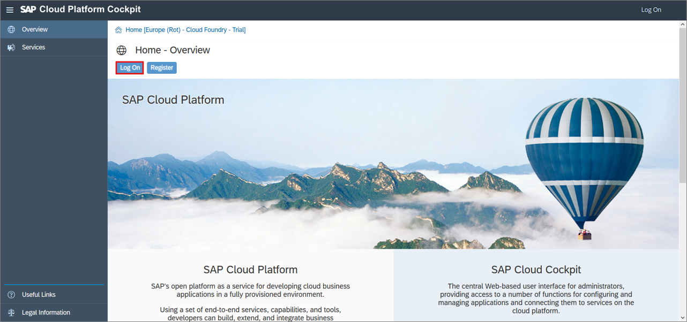

  2. Select **Cloud Foundry Trial**.

      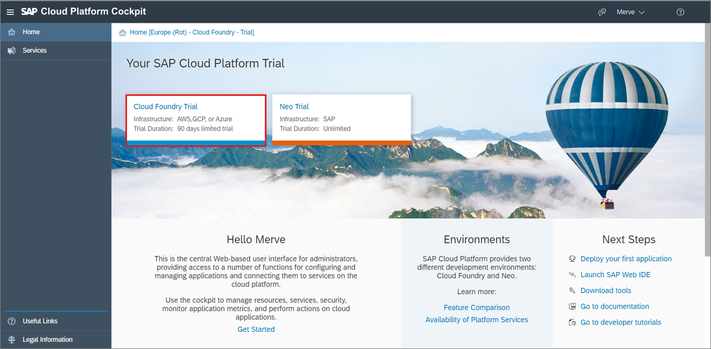

  3. Set **Europe (Frankfurt)** as your region and click **OK**, if you haven't done yet. Otherwise move on with step **1.6**.

      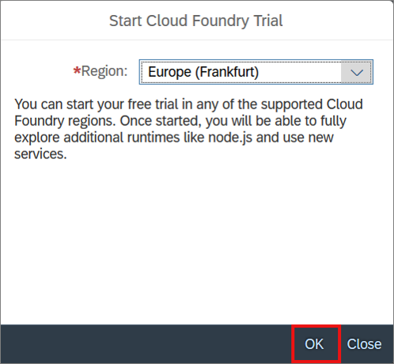

  4. Now your Cloud Foundry Trial is ready to use. Click **Go to Space**.

      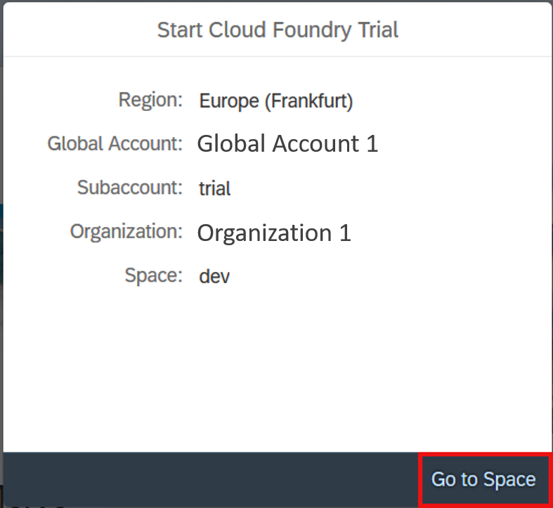

  5. Result: You can see your dev space.

      

  6. Switch to your global account and select **Entitlements**.

      

  7. Select **Subaccount Assignments**.

      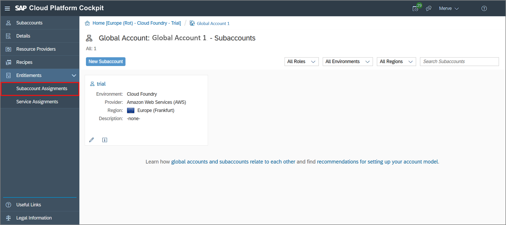

  8. Select **trial** as subaccount and click **Go**.

      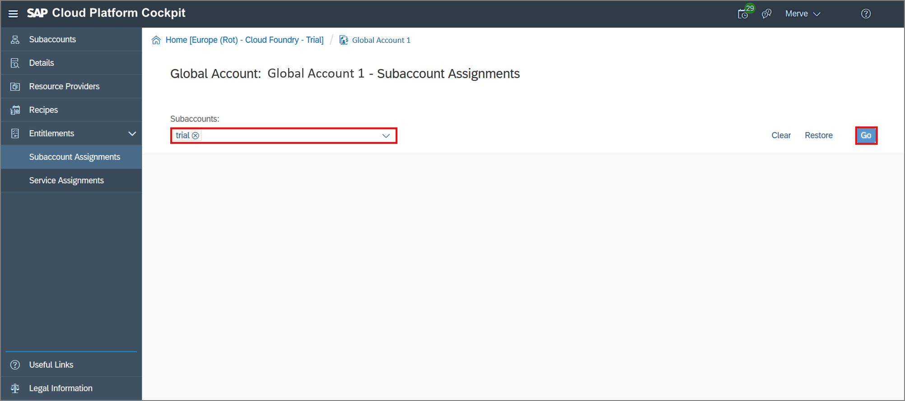

  9. If you see all trial services, move on with step **2.1**.
     If you don't see any trial services, then click **Configure Entitlements**.

      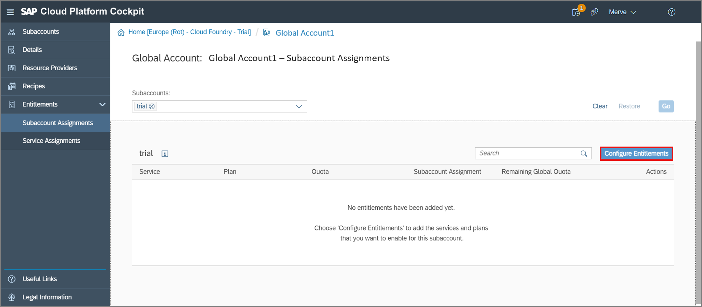

     Click **Add Service Plans**.

      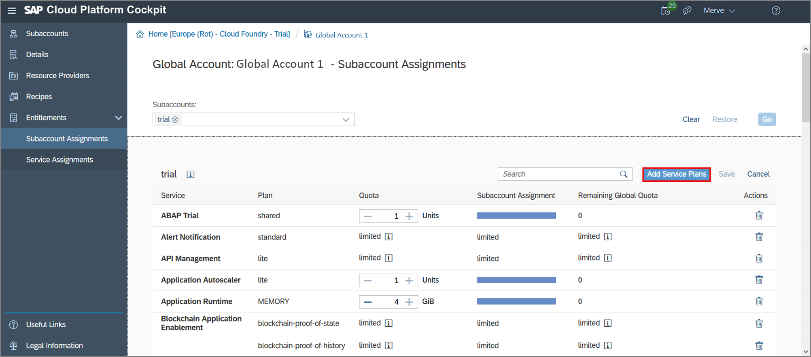

     Select **ABAP Trial**, check **shared** and click **Add 1 Service Plan**.

      

[DONE]
[ACCORDION-END]

[ACCORDION-BEGIN [Step 2: ](Select ABAP Trial)]

  1. Go to your space **dev**.

      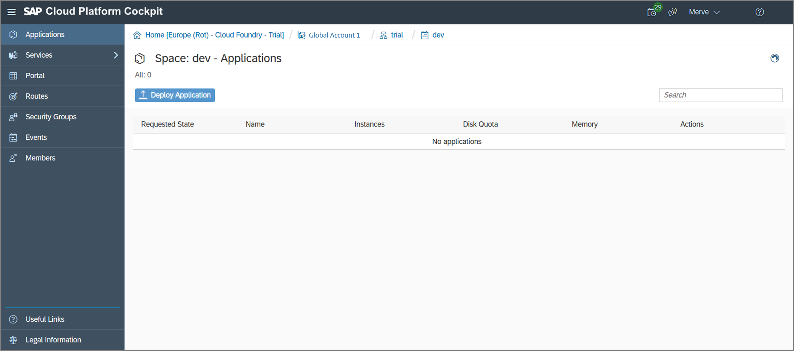

  2. Click **Services**.

      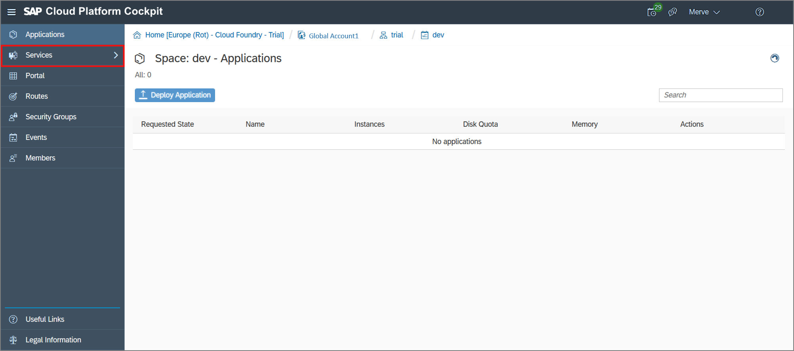

  3. Click **Service Marketplace**.

      

  4. Search for **ABAP Trial** and select it.

      

[DONE]
[ACCORDION-END]

[ACCORDION-BEGIN [Step 3: ](Create instance)]
  1. You can create a new instance on the SAP Cloud Platform ABAP Environment Trial. Therefore select **Instances**.

      

  2. Click **New Instance**.

      

  3. Click **Next**.

      

  4. Add your e-mail address:

      - "email": "example@email.com"

     Click **Next**.

      

  5. Click **Next**.

      

  6. Create an instance:

     - Instance Name: `<your_name>`

     Click **Finish**.

      

  7. Now your instance appears on the instance overview.

      

[DONE]
[ACCORDION-END]

[ACCORDION-BEGIN [Step 4: ](Create service key)]
  1. Click on your instance.

      

  2. Select **Service Keys**.

      

  3. Click **Create Service Key**.

      

  3. Create a service key:

     - Name: ADT

     Click **Save**.

      

  4. Now your service key appears. Copy your service key for later use.

      

[DONE]
[ACCORDION-END]

[ACCORDION-BEGIN [Step 5: ](Open ABAP Development Tools )]
For TechEd users:

Click **>>** on your windows taskbar and select **SAP Development Tools** > **ABAP in Eclipse - `CAA361`**.  

For other users:

Open your local ABAP Development Tools (ADT). You can download the latest version from <https://tools.hana.ondemand.com/#abap>.

[DONE]
[ACCORDION-END]

[ACCORDION-BEGIN [Step 6: ](Create ABAP cloud project)]
  1. Select **File** > **New** > **ABAP Cloud Project**.

      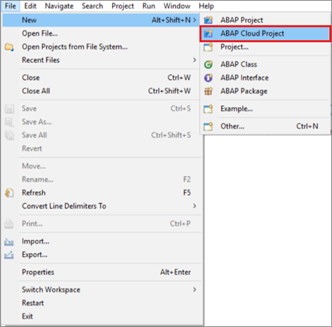

  2. Select **Service Key** and click **Next >**.

      

  3. Paste your service key and click **Next >**.

      

  4. Logon to your ABAP trial account with your e-mail address and password.

      

  5. Click Finish.

      

  6. Your trial system appears on the project explorer.

      

[DONE]
[ACCORDION-END]

[ACCORDION-BEGIN [Step 7: ](Test yourself)]

[VALIDATE_1]
[ACCORDION-END]
---
