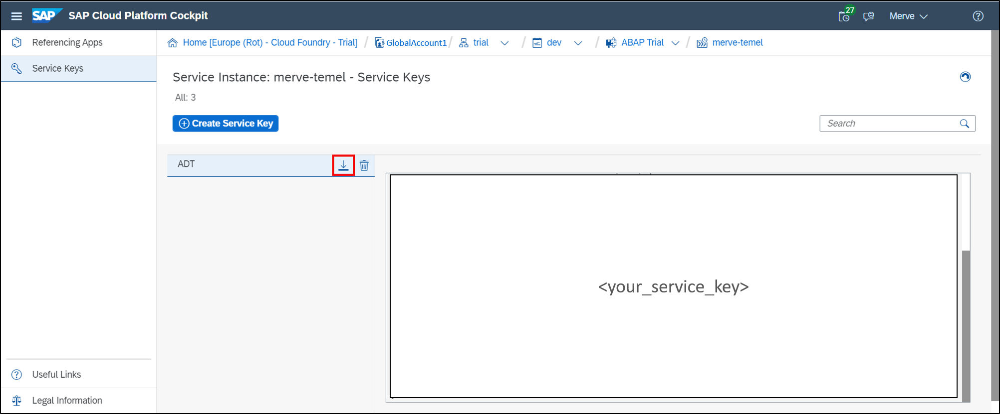
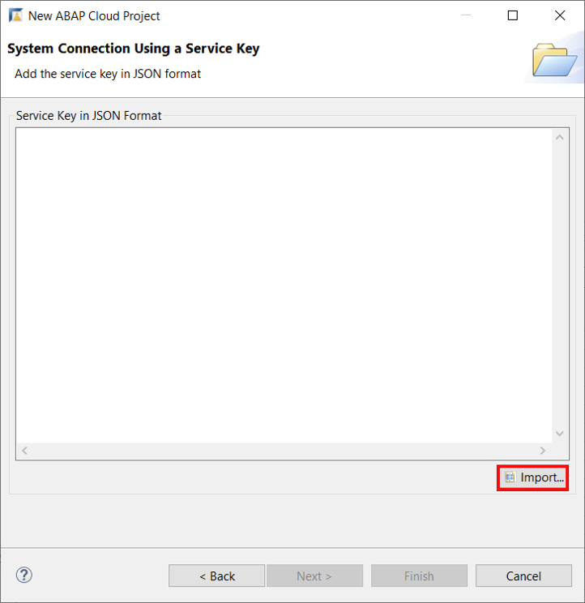
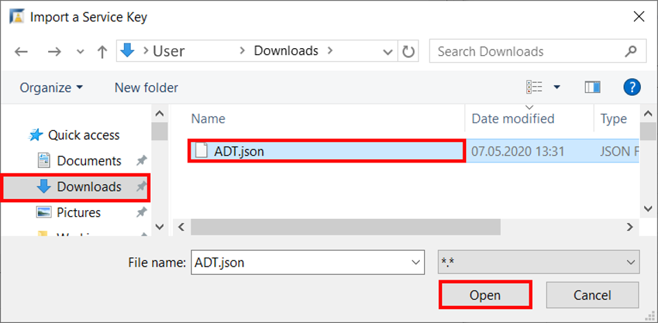

## Prerequisites  
 - You have created a **trial account on SAP Cloud Platform**:  [Get a Free Trial Account on SAP Cloud Platform](hcp-create-trial-account).
 - You have a **subaccount and dev space with Europe (Frankfurt) or US East (VA) as region**.

## Details
### You will learn  
  - How to create a trial user
  - How to create an ABAP Cloud project

>You should have a subaccount on Cloud Foundry Trial with **Europe (Frankfurt)** or **US East (VA)** as Region.

---

[ACCORDION-BEGIN [Step 1: ](Enter your trial account)]

1. In your web browser, open the [SAP Cloud Platform trial cockpit](https://cockpit.hanatrial.ondemand.com/).

2. Navigate to the trial global account by clicking **Enter Your Trial Account**.

    !

    >If this is your first time accessing your trial account, you'll have to configure your account by choosing a region (select the region closest to you). Your user profile will be set up for you automatically.  

    >Wait till your account is set up and ready to go. Your global account, your subaccount, your organization, and your space are launched. This may take a couple of minutes.

    >Choose **Continue**.

    >

3. From your global account page, choose the **`trial`** tile to access your subaccount. The region is either **Europe (Frankfurt)** or **US East (VA)**.

    

4. As we use Cloud Foundry every app and service is scoped to a space.
   Therefore choose in your trial subaccount your space **dev** to navigate to it.

    

5. Click **Service Marketplace** to get to the service overview, where you can select ABAP Trial as a service.

    

6. Select **ABAP Trial** tile.

    

[DONE]
[ACCORDION-END]

[ACCORDION-BEGIN [Step 2: ](Create instance)]
  1. Create a new instance in your SAP Cloud Platform ABAP environment trial, therefore select **Instances**.

      

  2. Click **New Instance** to create a new instance.

      

  3. Your service plan is shared, therefore click **Next**.

      

  4. Add your registration e-mail address.

      - "email": "example@email.com"

     Click **Next**.

      

  5.  You don't need to bind an application for your instance, therefore click **Next**.

      

  6. Create an instance:

     - Instance Name: `<your_name>`

     Click **Finish**.

      

  7. Now your instance appears on the instance overview.

      

[DONE]
[ACCORDION-END]

[ACCORDION-BEGIN [Step 3: ](Create service key)]
  1. Click on your instance.

      

  2. Select **Service Keys**. The service key is needed for the connection to the SAP Cloud Platform ABAP environment system in ADT.

      

  3. Click **Create Service Key** to create your service key.

      

  4. Create a service key:

     For example:

     - Name: ADT

     Click **Save**.

      

  5. Now your service key appears. Download your service key for later use.
     The service key enables the connection to the SAP Cloud Platform ABAP environment system in ADT.

     

[DONE]
[ACCORDION-END]

[ACCORDION-BEGIN [Step 4: ](Open ABAP Development Tools )]

Open your local ABAP Development Tools (ADT). You can download the latest version from <https://tools.hana.ondemand.com/#abap>.

For TechEd users:

Click **>>** on your windows taskbar and select **SAP Development Tools** > **ABAP in Eclipse - `CAA361`**.  

[DONE]
[ACCORDION-END]

[ACCORDION-BEGIN [Step 5: ](Create ABAP cloud project)]
  1. Select **File** > **New** > **Other** > **ABAP Cloud Project** and click **Next >**.

      

  2. Select **Service Key** and click **Next >**.

      

  3. Select **Import** to import your downloaded service key.

      

  4. You can find your service key in your default download folder. Search for **`ADT.json`**, select it and click **Open**.

      

  5. Now your service key is pasted. Click **Next**.

      

  6. Logon to your ABAP trial account with your e-mail address and password.

      

  7. Click Finish.

      

  8. Your trial system appears on the project explorer.

      

[DONE]
[ACCORDION-END]

[ACCORDION-BEGIN [Step 6: ](Test yourself)]

[VALIDATE_1]
[ACCORDION-END]

Give us 55 seconds of your time to help us improve

