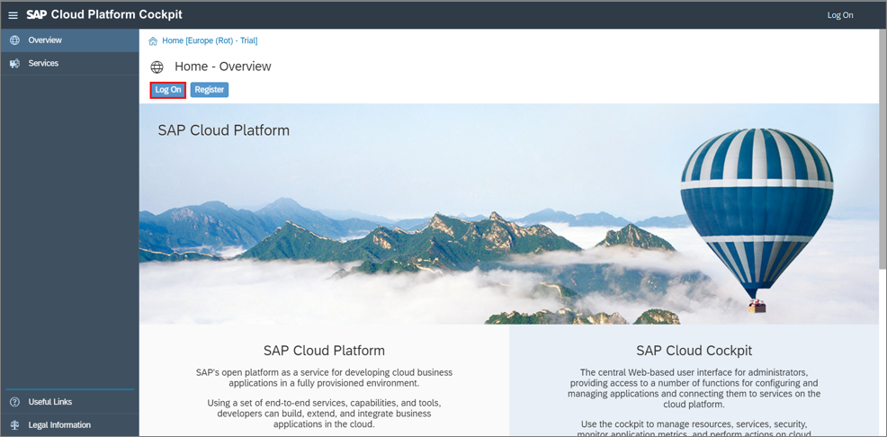

## Prerequisites  
 - You have created a trial account on SAP Cloud Platform (https://developers.sap.com/tutorials/hcp-create-trial-account.html).
 - You have created a cloud foundry trial account (https://developers.sap.com/tutorials/cp-cf-create-account.html).

## Details
### You will learn  
  - How to create an trial user
  - How to create an ABAP Cloud project

---
[ACCORDION-BEGIN [Step 1: ](Select ABAP Trial)]
  1. Open SAP Cloud Platform Trial Cockpit to logon to your existing Cloud Foundry trial account.
     (https://account.hanatrial.ondemand.com/#/home/welcome)

     

  2. Go to your space dev.

      

  3. Click **Services**.

      

  4. Click **Service Marketplace**.

      
 
  5. Search for **ABAP Trial** and select it.

      

[DONE]
[ACCORDION-END]

[ACCORDION-BEGIN [Step 2: ](Create instance)]
  1. You can create a new instance on the SAP Cloud Platform ABAP Environment Trial. Therefore select **Instances**.

      

  2. Click **New Instance**.

      

  3. Click **Next**.

      

  4. Add your e-mail address and click **Next**.

      

  5. Click **Next**.

      

  6. Create an instance:

     - Instance Name: `<your_name>`

     Click **Finish**.

      

  7. Now your instance appears on the instance overview.

      

[DONE]
[ACCORDION-END]

[ACCORDION-BEGIN [Step 3: ](Create service key)]
  1. Click on your instance.

      

  2. Click **Create Service Key**.

      

  3. Create a service key:

     - Name: ADT

     Click **Save**.

      

  4. Now your service key appears. Copy your service key for later use.

      

[DONE]
[ACCORDION-END]

[ACCORDION-BEGIN [Step 4: ](Open ABAP Development Tools )]
For TechEd users:

Click **>>** on your windows taskbar and select **SAP Development Tools** > **ABAP in Eclipse - `CAA361`**.  

For other users:

Open your local ABAP Development Tools (ADT). You can download the latest version from (https://tools.hana.ondemand.com/#abap).

[DONE]
[ACCORDION-END]

[ACCORDION-BEGIN [Step 5: ](Create ABAP cloud project)]
  1. Select **File** > **New** > **ABAP Cloud Project**.

      

  2. Select **Service Key** and click **Next >**.

      

  3. Paste your service key and click **Next >**.

      

  4. Logon to your ABAP trial account with your e-mail address and password.

      

  5. Click Finish.

      

  6. Your trial system appears on the project explorer.

      

[DONE]
[ACCORDION-END]

[ACCORDION-BEGIN [Step 6: ](Test yourself)]

[VALIDATE_1]
[ACCORDION-END]
---
