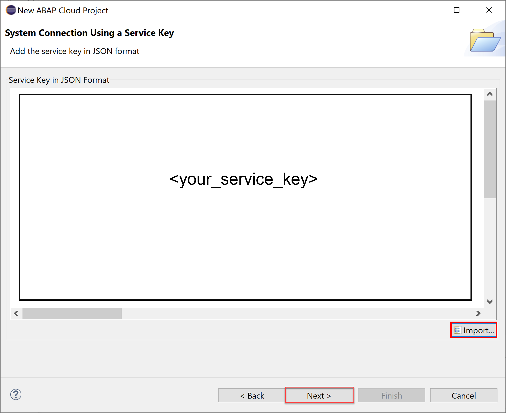
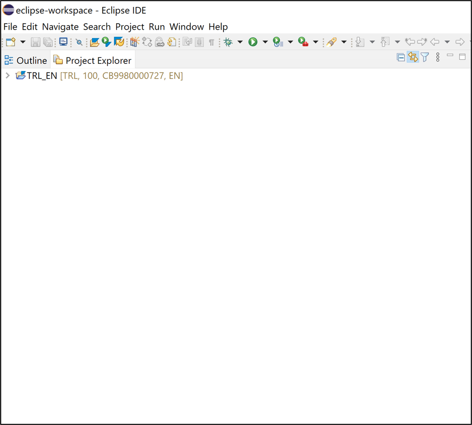

# Create an SAP BTP ABAP Environment Trial User
<!-- description --> Create a trial user and ABAP cloud project with SAP BTP ABAP environment.

## Prerequisites
- You have read the blog post [It's Trial Time for ABAP in SAP Business Technology Platform](https://blogs.sap.com/2019/09/28/its-trialtime-for-abap-in-sap-cloud-platform/), including the section "Rules of the Game"
- You have created a **trial account on SAP BTP**:  [Get a Free Account on SAP BTP Trial](hcp-create-trial-account)
- You have a **subaccount and dev space US East (VA) as region**
- You have downloaded and installed the [latest ABAP Development Tools (ADT)] (https://tools.hana.ondemand.com/#abap).

## You will learn  
  - How to create a trial user
  - How to create an ABAP Cloud project

## Intro
You should have a subaccount on Cloud Foundry Trial with **US East (VA) -  AWS** as region. The ABAP environment service is currently **not available** for **Singapore - Azure**.

This tutorial is part of a 3-part series of SAP BTP, ABAP Environment tutorials, each of which will earn you a badge:

- [Create an SAP BTP ABAP Environment Trial User](mission.abap-env-trial-user)

- [Create and Expose a CDS-Based Data Model With SAP BTP ABAP Environment](mission.cp-starter-extensions-abap)

- [Level Up with SAP BTP, ABAP Environment](mission.abap-env-level-up)

---

### Start boosters

1. In your web browser, open the [SAP BTP trial cockpit](https://cockpit.hanatrial.ondemand.com/).
 
2. Navigate to the trial global account by clicking **Go To Your Trial Account**.

    <!-- border -->

    >If this is your first time accessing your trial account, you'll have to configure your account by choosing a region. Please select **US East (VA) as a region**. Your user profile will be set up for you automatically.  

    >Wait till your account is set up and ready to go. Your global account, your subaccount, your organization, and your space are launched. This may take a couple of minutes.

    >Choose **Continue**.

    >

3. From your global account page, choose **Boosters** on the left side.

    

4. Search the **Prepare an Account for ABAP Trial** tile and press **Start** to start your booster.
  If you already created a service instance and service key, then please skip this step and move on with Step 2.
  Only one service instance can be created at a time.

    

5. Now the service instance and service key will be created for the ABAP trial user. The service key can be found inside the service instance.

    

6. The booster is now executed successfully. Download your service key for later use.

    

### Open ABAP Development Tools

Open Eclipse. Make sure you have installed ADT in your Eclipse. Find [here](abap-install-adt) the Eclipse installation instruction.

### Create ABAP cloud project

  1. Select **File** > **New** > **Other** > **ABAP Cloud Project** and click **Next >**.

      

  2. Select **SAP BTP ABAP Environment** > **Use a Service Key** and click **Next >**.

      

  3. Import your service key and click **Next >**.

      

  4. Click **Open Logon Page in Browser**.

      

    >**Hint:** If you are already logged on in the default browser with a user which you do not want to use for this project, then use the **Copy Logon URL to Clipboard** option and paste the URL in a browser started in private or incognito mode or a non defaulted browser.

  5. Now you've been authenticated automatically. Provide your credentials if requested. The credentials are the same you used to create your trial account on SAP BTP.

     Go back to ADT.

      

      Click **Finish**.

  6. Your trial system appears on the project explorer.

      

### Test yourself

---

After completing this mission, you might be interested in the next in the series: [Create and Expose a CDS-Based Data Model With SAP BTP ABAP Environment](mission.cp-starter-extensions-abap)

---
