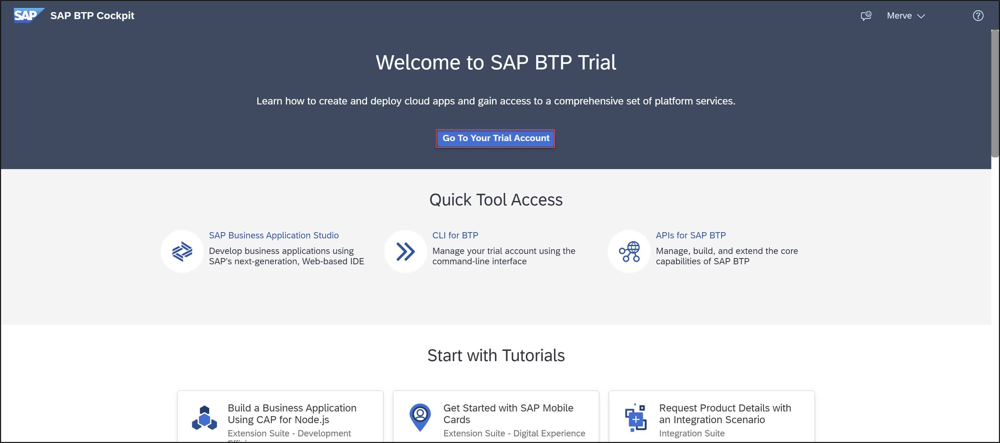
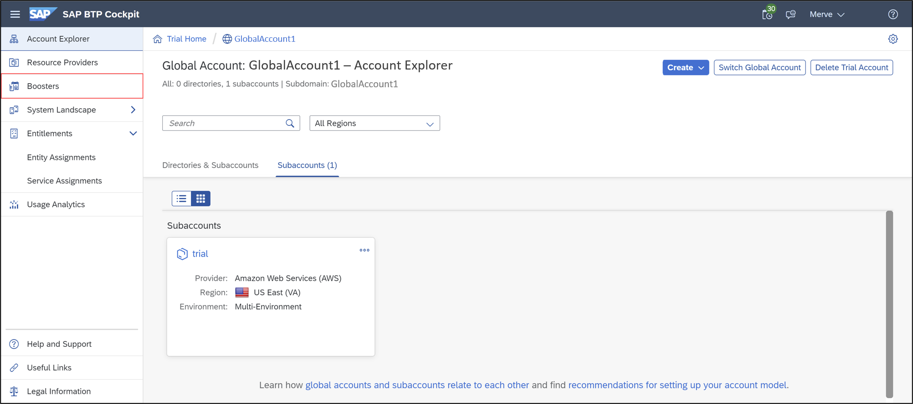
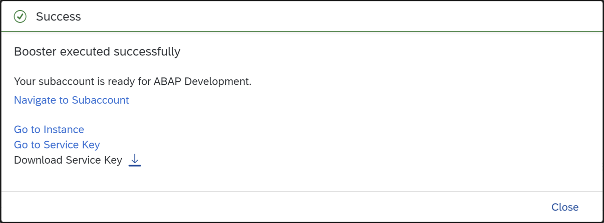
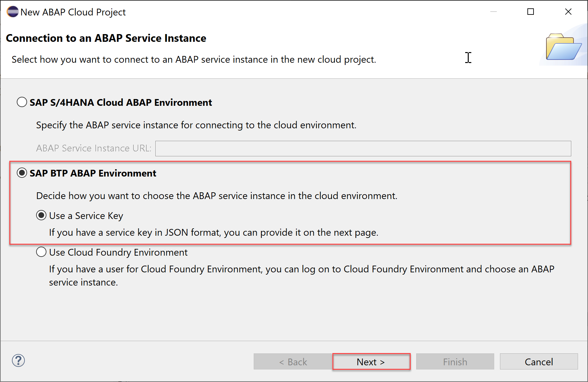
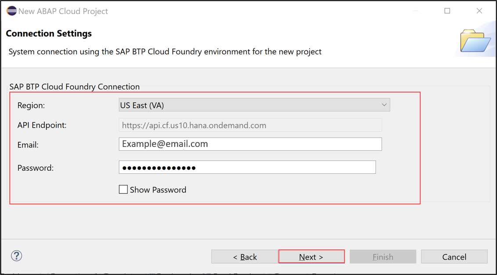
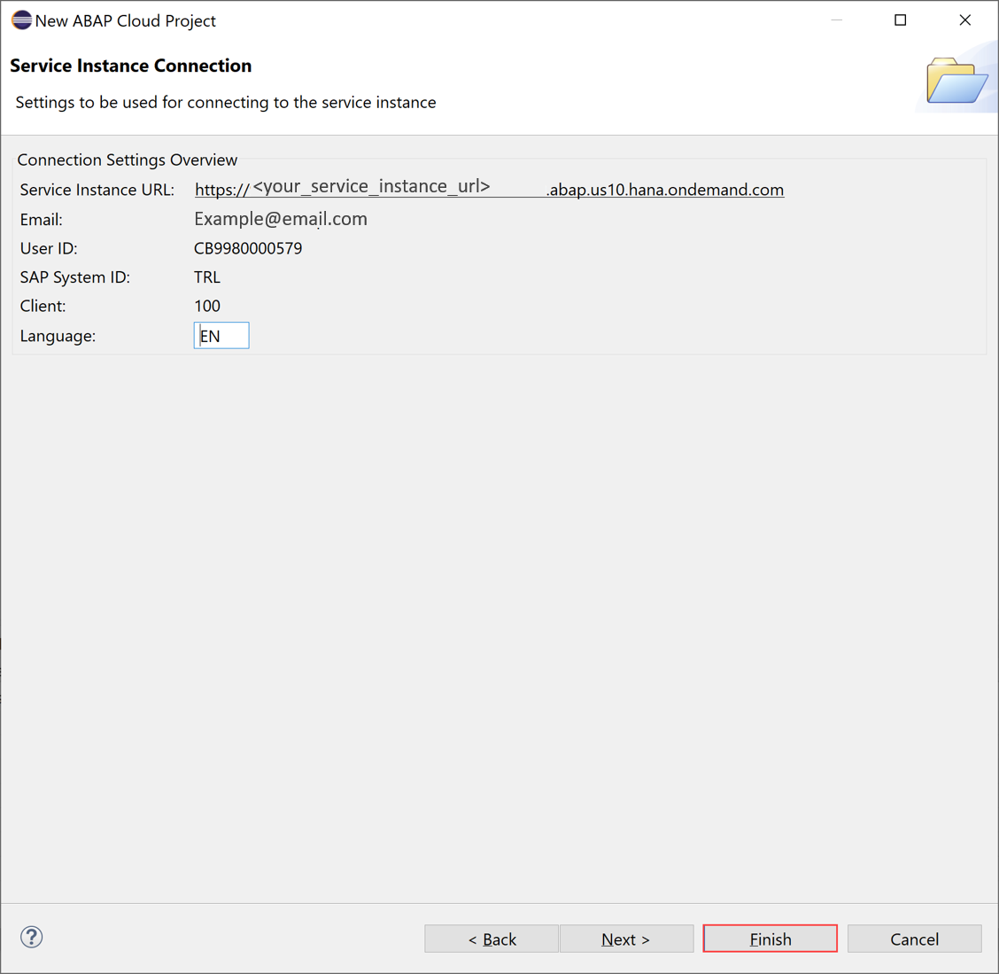

## Prerequisites
- You have read the blog post [It's Trial Time for ABAP in SAP Cloud Platform](https://blogs.sap.com/2019/09/28/its-trialtime-for-abap-in-sap-cloud-platform/), including the section "Rules of the Game"
- You have created a **trial account on SAP BTP**:  [Get a Free Account on SAP BTP Trial](hcp-create-trial-account)
- You have a **subaccount and dev space with Europe (Frankfurt) or US East (VA) as region**
- You have downloaded and installed the [latest ABAP Development Tools (ADT)] (https://tools.hana.ondemand.com/#abap).

## Details
### You will learn  
  - How to create a trial user
  - How to create an ABAP Cloud project

You should have a subaccount on Cloud Foundry Trial with **Europe (Frankfurt) - AWS or US East (VA) -  AWS** as region. The ABAP environment service is currently **not available** for **Singapore - Azure**.

This tutorial is part of a 3-part series of SAP BTP, ABAP Environment tutorials, each of which will earn you a badge:

- [Create an SAP BTP ABAP Environment Trial User](mission.abap-env-trial-user)

- [Create and Expose a CDS-Based Data Model With SAP BTP ABAP Environment](mission.cp-starter-extensions-abap)

- [Level Up with SAP BTP, ABAP Environment](mission.abap-env-level-up)

---

[ACCORDION-BEGIN [Step 1: ](Start boosters)]

1. In your web browser, open the [SAP BTP trial cockpit](https://cockpit.hanatrial.ondemand.com/).

2. Navigate to the trial global account by clicking **Enter Your Trial Account**.

    !

    >If this is your first time accessing your trial account, you'll have to configure your account by choosing a region. Please select **Europe (Frankfurt) or US (VA) as a region**. Your user profile will be set up for you automatically.  

    >Wait till your account is set up and ready to go. Your global account, your subaccount, your organization, and your space are launched. This may take a couple of minutes.

    >Choose **Continue**.

    >

3. From your global account page, choose **Boosters** on the left side.

    

4. Search the **Prepare an Account for ABAP Trial** tile and press **Start** to start your booster.
  If you already created a service instance and service key, then please skip this step and move on with Step 2.
  Only one service instance can be created at a time.

    

5. Now the service instance and service key will be created for the ABAP trial user. The service key can be found inside the service instance.

    

6. The booster is now executed successfully.
   **Download** the service key for later use. The service key is needed to setup the connection in ABAP Development Tools (ADT).

    

[DONE]
[ACCORDION-END]

[ACCORDION-BEGIN [Step 2: ](Open ABAP Development Tools )]

Open your local ABAP Development Tools (ADT). You can download the latest version from <https://tools.hana.ondemand.com/#abap>.

[DONE]
[ACCORDION-END]

[ACCORDION-BEGIN [Step 3: ](Create ABAP cloud project)]
  1. Select **File** > **New** > **Other** > **ABAP Cloud Project** and click **Next >**.

      

  2. Select **SAP BTP Cloud Foundry Environment** and click **Next >**.

      

  3. Enter your **connection settings**:
     - Region: choose your SAP BTP Cloud Foundry Environment region, for e.g. Europe (Frankfurt)
     - Email: your email address
     - Password: your password    

      

      Click **Next >**.

  4. Set your **service instance details**:                                                                                             
     - Organization: your organization
     - Space: dev
     - Service instance: `default_abap-trial`

      

      Click **Next >**.

    >**HINT:** Your service instance is **`default_abap-trial`** when you use the **ABAP trial booster** on SAP BTP. If you create a manual instance, use your own instance name.

  5. Click **Open Logon Page in Browser**.

      

  6. Now you've been authenticated automatically. Provide your credentials if requested. The credentials are the same you used to create your trial account on SAP BTP.

     Go back to ADT.

      

      Click **Finish**.

  7. Your trial system appears on the project explorer.

      

[DONE]
[ACCORDION-END]

[ACCORDION-BEGIN [Step 4: ](Test yourself)]

[VALIDATE_1]
[ACCORDION-END]

---

After completing this mission, you might be interested in the next in the series: [Create and Expose a CDS-Based Data Model With SAP BTP ABAP Environment](mission.cp-starter-extensions-abap)

---

Give us 55 seconds of your time to help us improve

