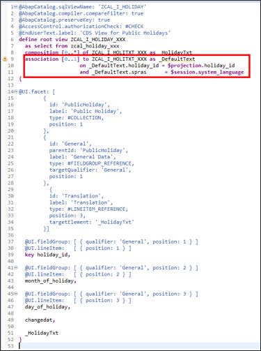
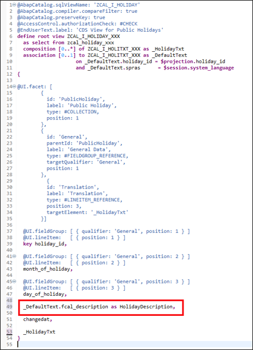
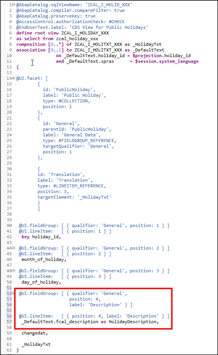
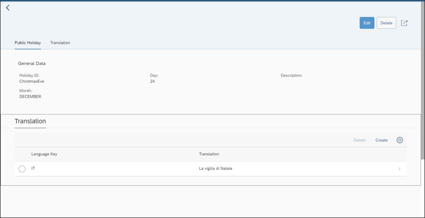
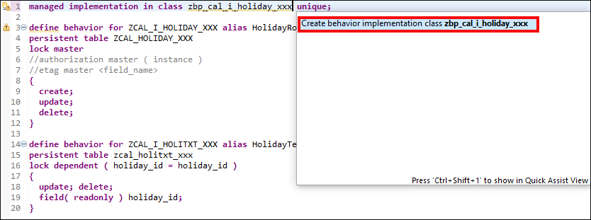
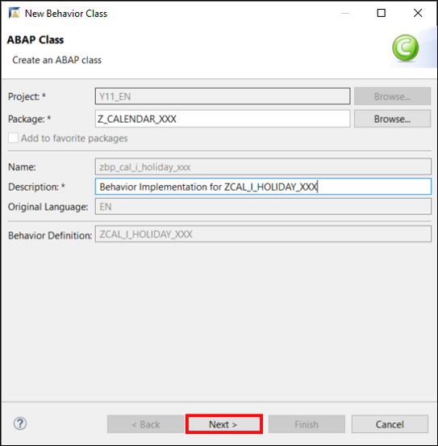
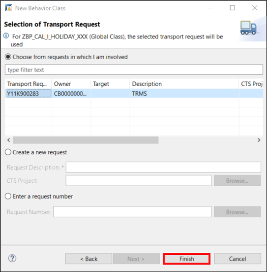
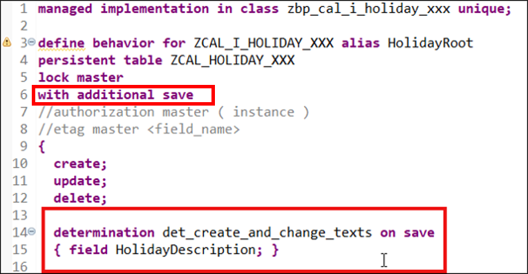

## Prerequisites  
- You need an SAP Cloud Platform ABAP Environment [trial user](abap-environment-trial-onboarding) or a license.

## Details
### You will learn  
- How to define read-only association from the root node
- How to add determination to root node


In the last tutorial you learned how to add a separate translation table to your business object. In most situations, this is too time-consuming, therefore, it makes sense to provide a separate input field on the root node for the maintenance of the description.

To provide the input field for the description on the root entity you have to perform the following actions:

  - 	Define a read-only association from the root node to the text node for displaying the description
  - 	Define a determination for saving the changes on the text entity.
Let's start adding the read-only association from the root entity to the text node:

---
[ACCORDION-BEGIN [Step 1: ](Define read-only association from the root node)]

  1. Open CDS view **`ZCAL_I_HOLIDAY_XXX`** and add following association to it.

    ```ABAP
    association [0..1] to ZCAL_I_HOLITXT_XXX as _DefaultText
                   on _DefaultText.holiday_id = $projection.holiday_id
                   and _DefaultText.spras      = $session.system_language
    ```

      

  2. Add the description field **`_DefaultText.fcal_description`** to the body of the root view. Use alias **`HolidayDescription`**.

      

  3. Add UI annotations for the list view and the detail screen to the root entity. Do not forget to adjust the position of the other fields if necessary.

    ```ABAP
    @UI.fieldGroup: [ { qualifier: 'General',
                        position: 4,
                        label: 'Description' } ]
    @UI.lineItem:   [ { position: 4, label: 'Description' } ]
    _DefaultText.fcal_description as HolidayDescription,
    ```
      

  4. Save and activate. If you now start your application, you'll have a new column for showing the description on the root entity. In case you haven't maintained any description in the system language the field will be empty even in case a text for another language exists.

      

    Unfortunately, it is not yet possible to maintain texts on the root entity directly. Therefore, you have to create a determination which updates the text entity whenever you change the text on the root level.

[DONE]
[ACCORDION-END]

[ACCORDION-BEGIN [Step 2: ](Add determination to root node)]

  1. Open the behavior definition **`ZCAL_I_HOLIDAY_XXX`**  and uncomment your first line to add your behavior implementation. Save and activate it. Position the cursor in the first line on **`zbp_cal_i_holiday_xxx`** and press **`CRTL + 1`**. Select **`Create behavior implementation zbp_cal_i_holiday_xxx`**.

    

  2. Provide a description:
     - Description: `Behavior Implementation for ZCAL_I_HOLIDAY_XXX`

     

     Click **Next >**.

  3. Click **Finish**.

      

  4. In your behavior definition **`ZCAL_I_HOLIDAY_XXX`** add following:

    ```ABAP
    determination det_create_and_change_texts on save
      { field HolidayDescription; }
    ```

      

  5. Save and activate.

  6. In your **local types** of your behavior implementation **`zbp_cal_i_holiday_xxx`** replace your code with following:

    ```ABAP
    CLASS lhc_ZCAL_I_HOLIDAY_XXX   DEFINITION INHERITING
    FROM cl_abap_behavior_handler.
    PRIVATE SECTION.
     METHODS det_create_and_change_texts FOR DETERMINE ON SAVE
        IMPORTING
          keys FOR HolidayRoot~det_create_and_change_texts.

     METHODS create_description
        IMPORTING
          i_holiday_id  TYPE zcal_holiday_id_xxx
          i_description TYPE zcal_description_xxx.

      METHODS update_description
        IMPORTING
          i_holiday_id  TYPE zcal_holiday_id_xxx
          i_description TYPE zcal_description_xxx.

    ENDCLASS.

    CLASS lhc_ZCAL_I_HOLIDAY_XXX IMPLEMENTATION.

      METHOD det_create_and_change_texts.

        READ ENTITIES OF zcal_i_holiday_xxx
          ENTITY HolidayRoot
          FROM VALUE #( FOR <root_key> IN keys ( %key = <root_key> ) )
          RESULT DATA(public_holidays_table).


        LOOP AT public_holidays_table INTO DATA(public_holiday).
          READ ENTITIES OF zcal_i_holiday_xxx
            ENTITY HolidayRoot BY \_HolidayTxt
            FROM VALUE #( ( %key = public_holiday-%key ) )
            RESULT DATA(description_table).
          IF line_exists( description_table[
                            spras      = sy-langu
                            holiday_id = public_holiday-holiday_id ] ).
            update_description(
              i_holiday_id  = public_holiday-holiday_id
              i_description = public_holiday-HolidayDescription ).

          ELSE.
            create_description(
              i_holiday_id  = public_holiday-holiday_id
              i_description = public_holiday-HolidayDescription ).
          ENDIF.
        ENDLOOP.

      ENDMETHOD.

      METHOD create_description.
        DATA:
          description_table TYPE TABLE FOR CREATE zcal_i_holiday_xxx\_HolidayTxt,
          description       TYPE STRUCTURE FOR CREATE zcal_i_holiday_xxx\_HolidayTxt.

        description-%key    = i_holiday_id.
        description-%target =
          VALUE #(
                   ( holiday_id       = i_holiday_id
                     spras            = sy-langu
                     fcal_description = i_description
                     %control = VALUE
                                #( holiday_id       = cl_abap_behv=>flag_changed
                                   spras            = cl_abap_behv=>flag_changed
                                   fcal_description = cl_abap_behv=>flag_changed
                                 )
                   )
                 ).

        APPEND description TO description_table.

        MODIFY ENTITIES OF zcal_i_holiday_xxx IN LOCAL MODE
          ENTITY HolidayRoot CREATE BY \_HolidayTxt FROM description_table.
      ENDMETHOD.

      METHOD update_description.
        DATA:
          description_table TYPE TABLE FOR UPDATE zcal_i_holitxt_xxx,
          description       TYPE STRUCTURE FOR UPDATE zcal_i_holitxt_xxx.

        description-holiday_id       = i_holiday_id.
        description-spras            = sy-langu.
        description-fcal_description = i_description.

        description-%control-fcal_description = cl_abap_behv=>flag_changed.
        APPEND description TO description_table.

        MODIFY ENTITIES OF zcal_i_holiday_xxx IN LOCAL MODE
          ENTITY HolidayText UPDATE FROM description_table.
      ENDMETHOD.

    ENDCLASS.

    ```

      

  7. Save and activate.

[DONE]
[ACCORDION-END]


[ACCORDION-BEGIN [Step 3: ](Test yourself)]

[VALIDATE_1]
[ACCORDION-END]
---
