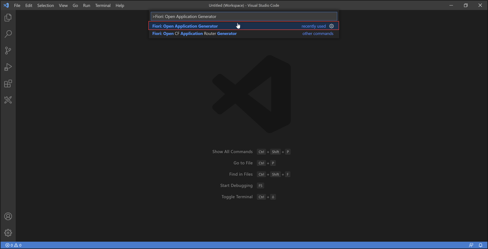
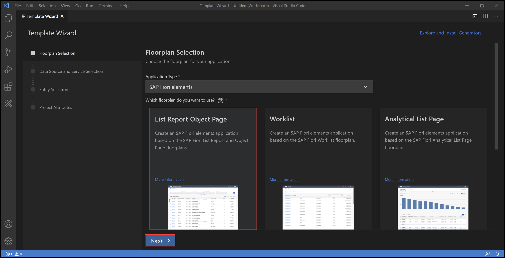
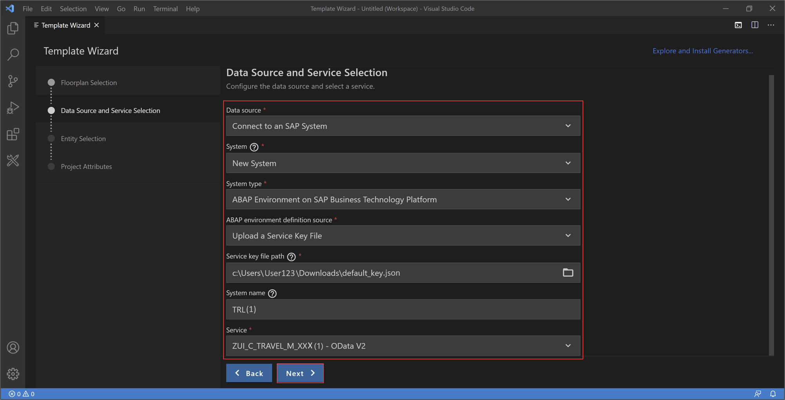
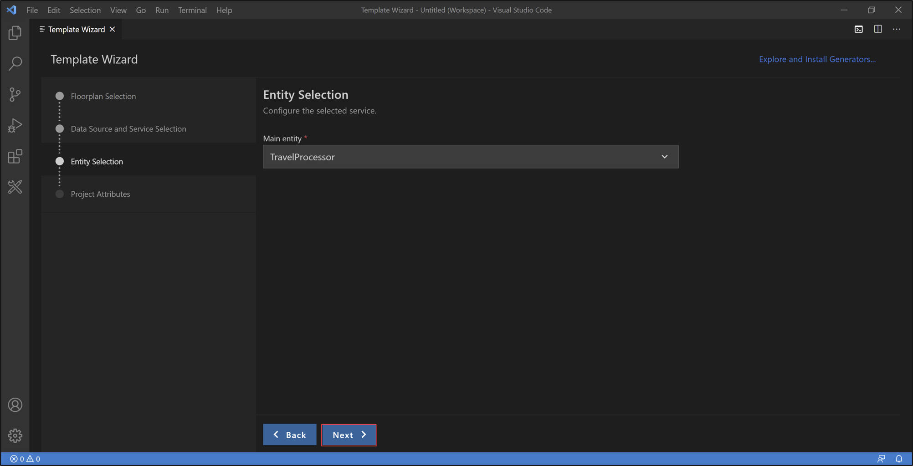
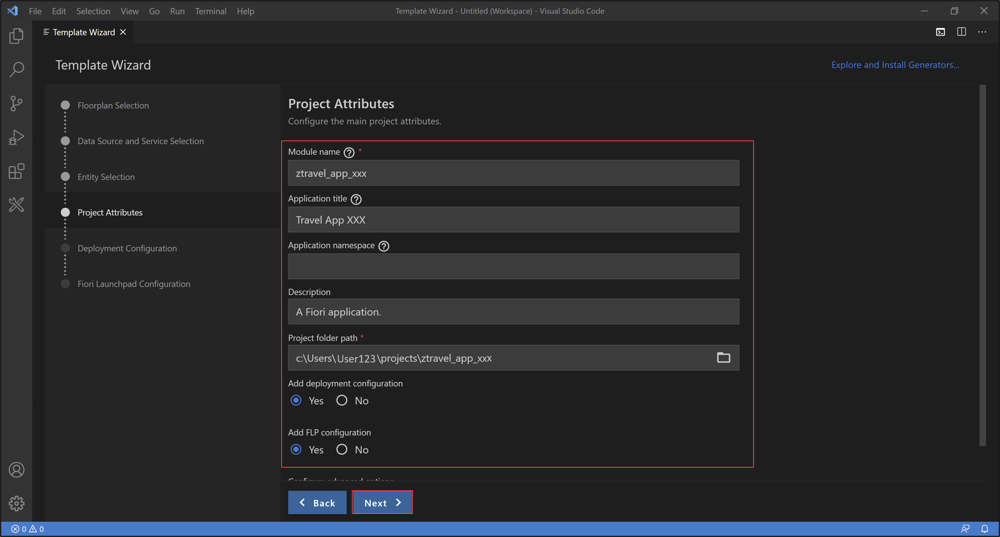
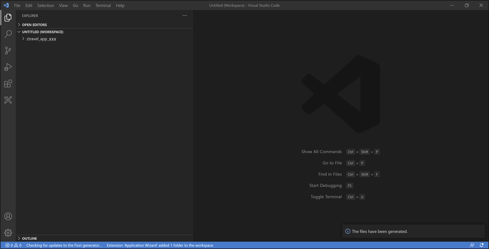
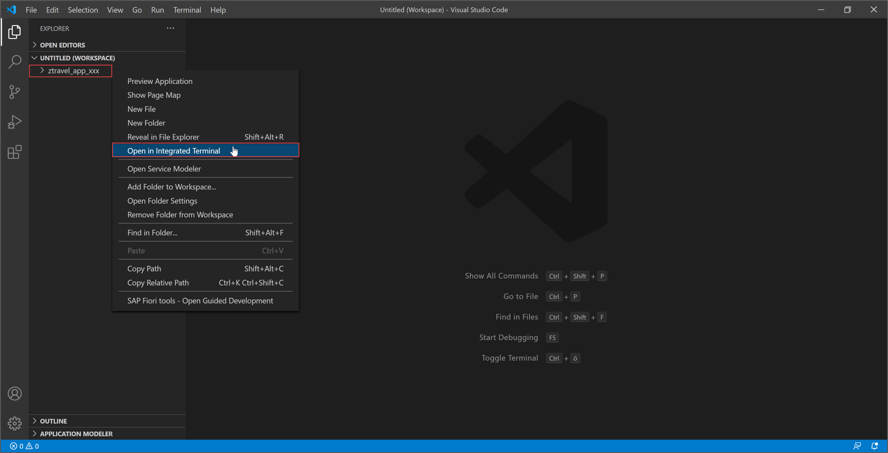
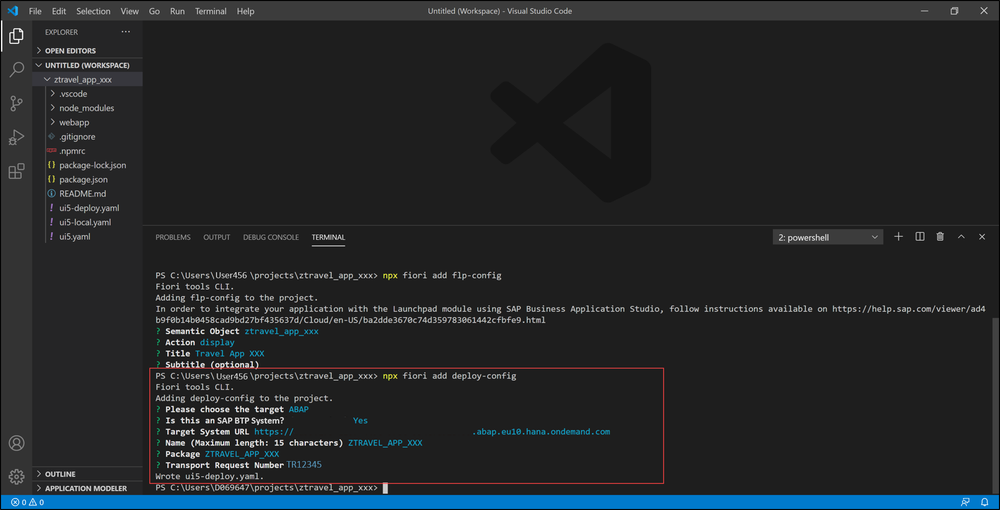

## Prerequisites
  - You need an SAP BTP, ABAP environment [trial user](abap-environment-trial-onboarding) or a license.
  - You have completed [Develop a Fiori App Using the ABAP RESTful Application Programming Model (Managed Scenario)](group.abap-env-restful-managed).
  - Installation of:
    - [Git](https://git-scm.com/downloads)
    - [Node.js and VS Code](https://help.sap.com/viewer/454b7fb9aacd4e369e5be8f7e909d3ec/Latest/en-US/61383cac9de24b75a4e2b8c9d11e8af0.html)
  - You also need to install [Python](https://www.python.org/downloads/) for **Windows**.
  - Installation of [Extensions](https://help.sap.com/viewer/454b7fb9aacd4e369e5be8f7e909d3ec/Latest/en-US/61383cac9de24b75a4e2b8c9d11e8af0.html)

## Details
### You will learn  
  - How to create an SAP Fiori application
  - How to run an SAP Fiori application
  - How to deploy an SAP Fiori application

>**HINT**: If you are not able to see the **Fiori Application Generator**, please install the generator again by opening the terminal and adding following: npm `install -g yo`.

---

[ACCORDION-BEGIN [Step 1: ](Create SAP Fiori application)]

1. Open Visual Studio Code and select **View** > **Command Palette**.

    !

2. Search **Fiori: Open Application Generator** and select it.

    !

3. Select **SAP Fiori elements** as application type, **List Report Object Page** as `floorplan` and click **Next >**.

    !

4. Select **Data Source** and **Service**:

    - Data source: Connect to an SAP System
    - System: New System
    - System type: ABAP Environment on SAP Business Technology Platform
    - ABAP environment definition source: Upload a Service Key File
    - Service key file path: `<your_service_key>`
    - System name: `<your_system_name>`
    - Service: `<your_service_definition>`

    !

      Click **Next >**.

      You have downloaded the service key earlier in the SAP BTP Trial Cockpit.

5. Select **`TravelProcessor`** and click **Next >**.

    !

6. Add project attributes:

    - Module name: `ztravel_app_xxx`
    - Application title: Travel App XXX
    - Project folder path: `C:\Users\<your_user>\projects`
    - Add deployment configuration: Yes
    - Add FLP configuration: Yes

    !

    Click **Next >**.

7. Configure deployment:

     - Target: ABAP
     - Is this an SAP Business Technology Platform system? Yes
     - Target System URL: `<your_abap_system_url>`
     - Name: `ztravel_app_xxx`
     - Package: `ztravel_app_xxx`
     - Transport Request: `<your_transport_request>`
     - Deployment description: deployment xxx

    !

    Click **Next >**.

    >**HINT: If you want to copy your transport request, please do following:**  Open Eclipse, search your package **`ZTRAVEL_APP_XXX`** and open it. Open your transport organizer to see your transport request. Copy your transport request for later use. You can find your **transport request** underneath the **Modifiable** folder.
    >      

8. Configure Fiori Launchpad:

     - Semantic Object: `ztravel_app_xxx`
     - Action: display
     - Title: Travel App XXX

    !

    Click **Finish**.

9. Now all files have been generated.

    !

[DONE]
[ACCORDION-END]

[ACCORDION-BEGIN [Step 2: ](Start SAP Fiori application)]

1. Right-click **`ztravel_app_xxx`** and select **Open in Integrated Terminal**.

    

2. Start your application with `npm start` and press enter.

    

3. Press **Go** and check your result.

    

[DONE]
[ACCORDION-END]

[ACCORDION-BEGIN [Step 3: ](Deploy SAP Fiori application)]

1. Open your terminal and enter `npm run deploy`. When prompted, check deployment configuration and press **y**.

     

2. Now your application is deployed.

     

>**HINT: If you want to update your SAP Fiori Launchpad configuration, then you can do following steps:**

>  1. Open your terminal, enter `npx fiori add flp-config` and press enter.
>     

>  2. Enter following:
     - Semantic object: `ztravel_app_xxx`
     - Action: display
     - Title: Travel App XXX
     - Subtitle: (press enter)  

>      

>  3. Open `manifest.json` in your `webapp` folder.

>      

>  4. Check your semantic object. It should be **`ztravel_app_xxx`**.

>      

>  5.  Open Eclipse, search your package **`ZTRAVEL_APP_XXX`** and open it. Open your transport organizer to see your transport request. Copy your transport request for later use. You can find your **transport request** underneath the **Modifiable** folder.

>      

>  6. Open your terminal, enter `npx fiori add deploy-config` and press enter.   
     Enter following:
     - Target: ABAP
     - SAP BTP System: Y
     - Target System URL: `<your_target_system_url>`
     - Name: (press enter)
     - Package: `ztravel_app_xxx`
     - Transport Number: `<your_transport_number>`

>    

>    Your `yaml` file should be written after entering all information.

[DONE]
[ACCORDION-END]

[ACCORDION-BEGIN [Step 4: ](Check BSP library and SAP Fiori Launchpad app descriptor item in Eclipse)]

  1. Open Eclipse and check the **BSP library** and **SAP Fiori Launchpad app descriptor item folder** in your package **`ZTRAVEL_APP_XXX`**. If you are not able to see BSP applications and SAP Fiori Launchpad app description items, refresh your package `ZTRAVEL_APP_XXX` by pressing `F5`.

    

[DONE]
[ACCORDION-END]

[ACCORDION-BEGIN [Step 5: ](Create IAM App and business catalog)]

  1. In Eclipse right-click your package **`ZTRAVEL_APP_XXX`** and select **New** > **Other Repository Object**.

      

  2. Search for **IAM App**, select it and click **Next >**.

      

  3. Create a new IAM App:
     - Name: **`ZTRAVEL_IAM_XXX`**
     - Description: IAM App

      

      Click **Next >**.

  4. Click **Finish**.

      

  5. Select **Services** and add a new one.

      

  6. Select following:
      - Service Type: `OData V2`
      - Service Name: `ZUI_C_TRAVEL_M_XXX_0001`    

      

      Click **OK**.

      **Save** and **activate** your IAM app.

  7. Right-click your package **`ZTRAVEL_APP_XXX`** and select  **New** > **Other Repository Object**.

      

  8. Search for **Business Catalog**, select it and click **Next >**.

      

  9. Create a new business catalog:
     - Name: **`ZTRAVEL_BC_XXX`**
     - Description: Business catalog

      

      Click **Next >**.

 10. Click **Finish**.

      

 11. Select **Apps** and add a new one.

      

 12. Create a new business catalog:
     - IAM App: `ZTRAVEL_IAM_XXX_EXT`
     - Name: `ZTRAVEL_BC_XXX_0001`

      

      Click **Next >**.

 13. Click **Finish**.

       

 14. Click **Publish Locally** to publish your business catalog.

       

[DONE]
[ACCORDION-END]

[ACCORDION-BEGIN [Step 6: ](Run SAP Fiori application)]

 1. Switch to Visual Studio Code and open the integrated terminal. Enter `npm run deploy`. When prompted, check deployment configuration and press **y**.

     

 2. Press **CTRL** and click the following link to open the URL in a browser.

      

 3. Log in to your system and press go to see your result.

      

[DONE]
[ACCORDION-END]

[ACCORDION-BEGIN [Step 7: ](Test yourself)]

[VALIDATE_1]
[ACCORDION-END]

## More Information
- [SAP Help Portal: Introduction](https://help.sap.com/viewer/454b7fb9aacd4e369e5be8f7e909d3ec/Latest/en-US/fd9e32d52c9e46e4ba77aba343656610.html)
---

Give us 55 seconds of your time to help us improve

