## Details
### You will learn  
  - How to create a destination
  - How to create a UI with SAP Web IDE Full-Stack

In this tutorial, wherever `XXX` appears, use a number (e.g. `000`).

---

[ACCORDION-BEGIN [Step 1: ](Overview)]
You have an exposed ABAP service and you prepared a communication arrangement for creating Fiori Application via Web IDE Full-Stack.

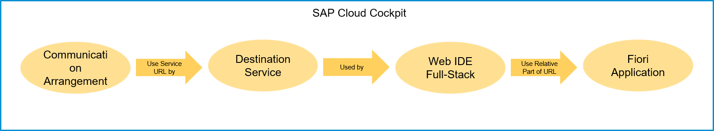

[DONE]
[ACCORDION-END]

[ACCORDION-BEGIN [Step 2: ](Log into SAP Cloud Platform)]
  1. Use the link `https://account.hanatrial.ondemand.com` to log on to cockpit.

      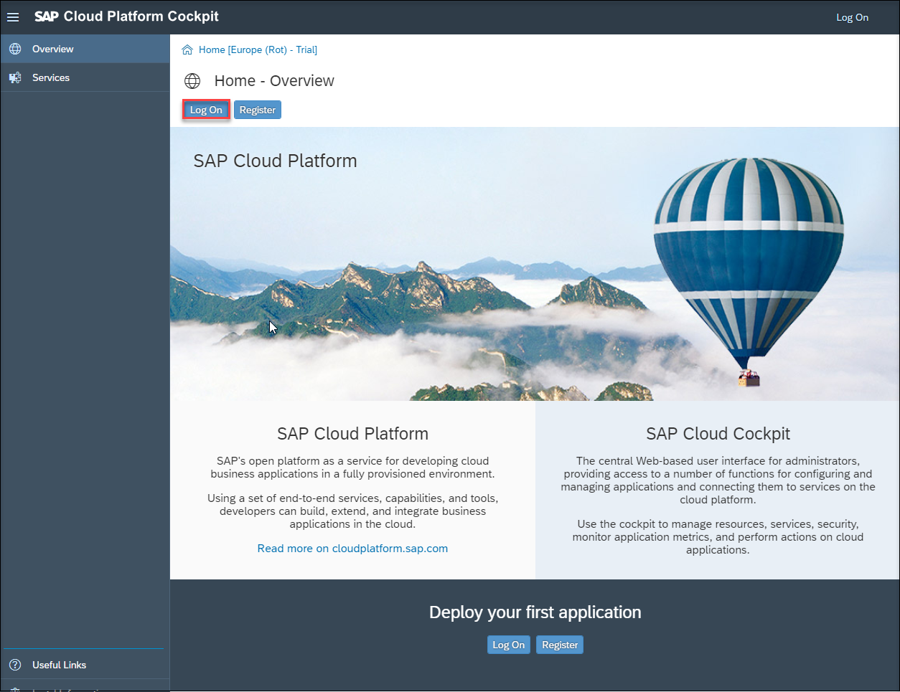

  2. Login with the user `exp013-0##@teched.cloud.sap` provided on your handout.

      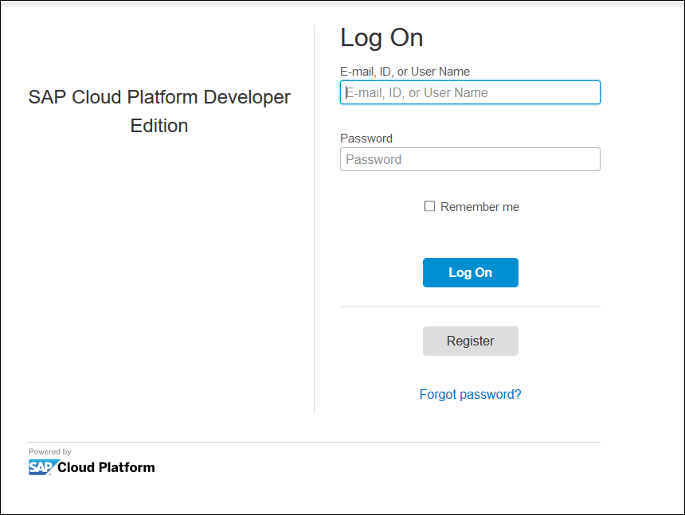

  3. Navigate to **Neo Trial**.

      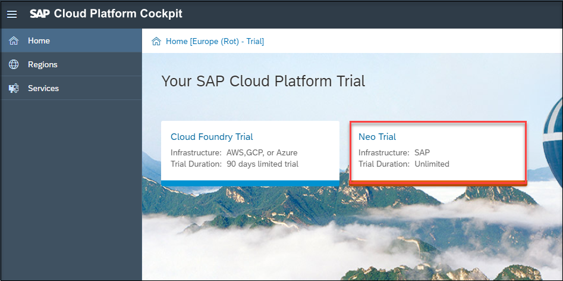

  4. Navigate to **Connectivity** and then to **Destination**.

      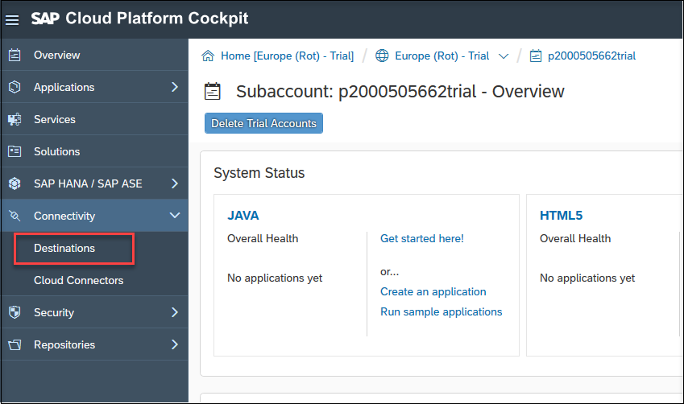

[DONE]
[ACCORDION-END]

[ACCORDION-BEGIN [Step 3: ](Create destination)]
Switch to destinations and click **New Destination**.

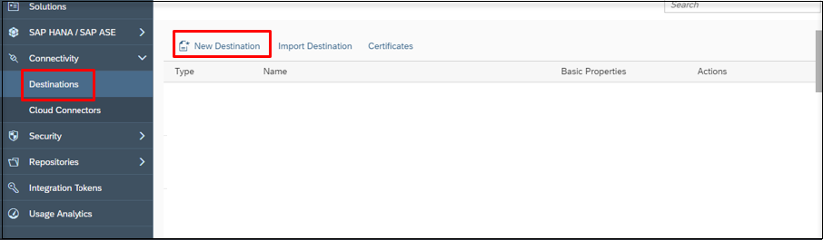

[DONE]
[ACCORDION-END]

[ACCORDION-BEGIN [Step 4: ](Add destination data)]

Enter following data to your destination.

| ---------------------------- | --------------------------------------------------------------- |
|          **Name**            |                   Name of your destination                      |
|          **Type**            |                           `HTTP`                                |
|      **Description**         |               Description of your destination                   |
|           **URL**            |        Service URL from communication arrangement without `-api`|
|       **Proxy Type**         |                          `Internet`                             |
|     **Authentication**       |                   `BasicAuthentication`                         |
|    **User**                  |                 Equals your communication user                  |
| **Password**                 |              Password of your communication user                |

> - Use `DEST_XXX` (where `XXX` is your group number) as name of your destination.
> - Remove `-api` from the URL.

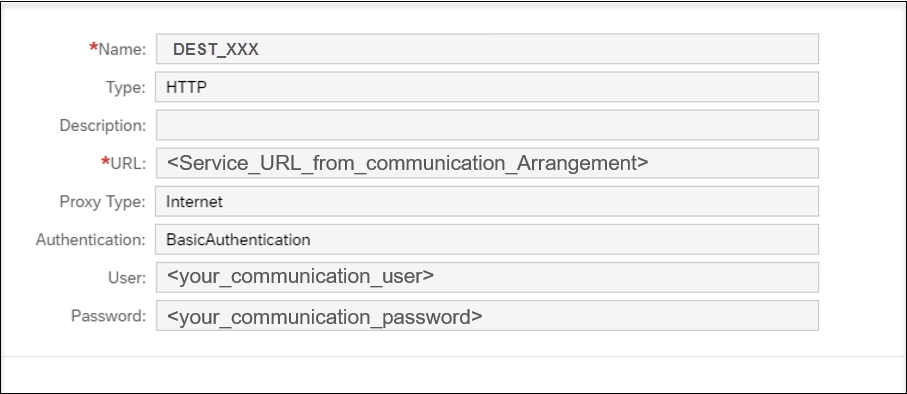

[DONE]
[ACCORDION-END]

[ACCORDION-BEGIN [Step 5: ](Add additional properties)]
1. Enter additional properties by clicking on **New Property**.

    | -------------------------- | -------------------------------|
    |      `WebIDEEnabled`       |            `true`              |
    |       `WebIDEUsage`        |     `odata_gen,odata_abap`     |

2. Click on **Save**.

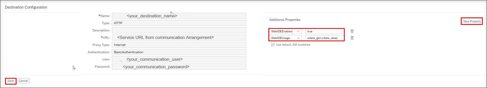

[DONE]
[ACCORDION-END]

[ACCORDION-BEGIN [Step 6: ](Check connection)]

Click on **Check Connection**.

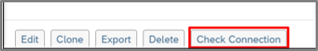

You can be sure if you get a successful connection.

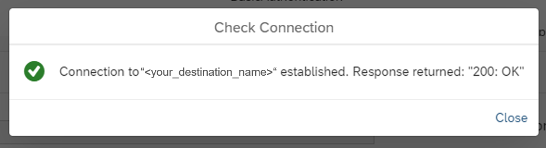

[DONE]
[ACCORDION-END]

[ACCORDION-BEGIN [Step 7: ](Search SAP Web IDE Full-Stack)]
Navigate to **Services**, search for SAP Web IDE Full-stack and select it.

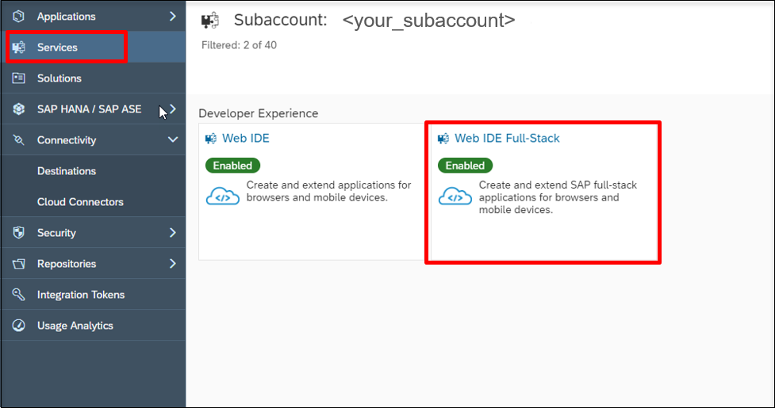

[DONE]
[ACCORDION-END]

[ACCORDION-BEGIN [Step 8: ](Go to service)]
Open **Go to Service**.
You will be navigated to SAP Web IDE.

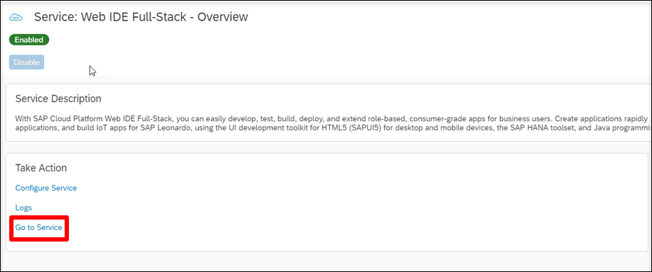

[DONE]
[ACCORDION-END]

[ACCORDION-BEGIN [Step 9: ](Create a new project from template)]
Select  **New Project from Template** to generate one.

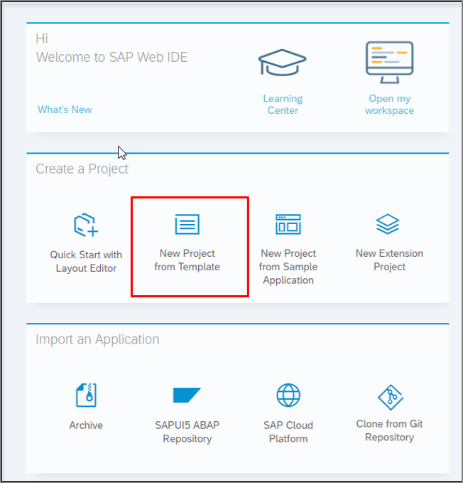

If you don´t see this welcome page then follow the alternative way: **File** > **New** > **Project from Template**.

[DONE]
[ACCORDION-END]

[ACCORDION-BEGIN [Step 10: ](Choose list report application)]
  1. Choose  **List Report Application**.

  2. Click  **Next** to create a new UI.

      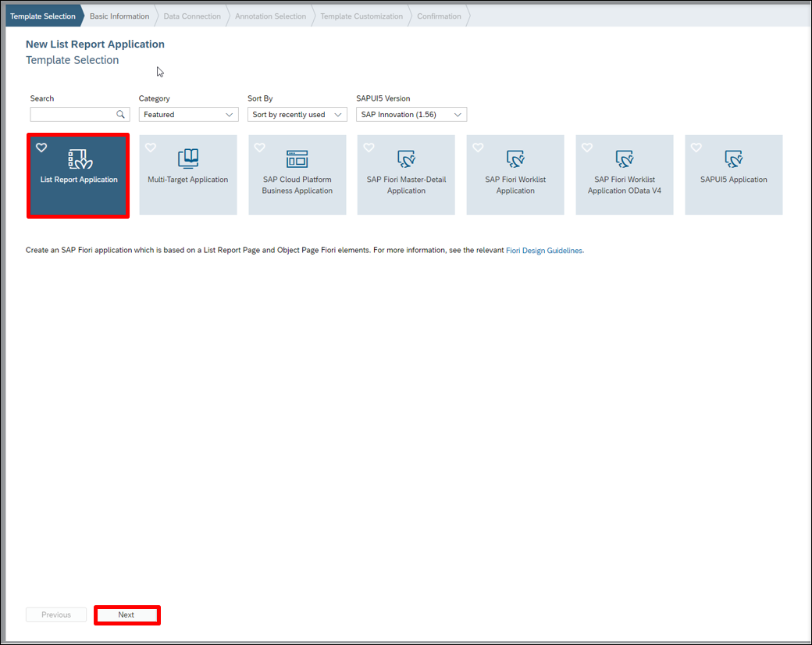

[DONE]
[ACCORDION-END]

[ACCORDION-BEGIN [Step 11: ](Enter basic information)]
  1. Enter a name for your project, a title and the application component hierarchy, if needed.
      - Project Name: `MYDEMOAPP_XXX`
      - Title: `MYDEMOAPP_XXX`

  2. Click **Next**.

      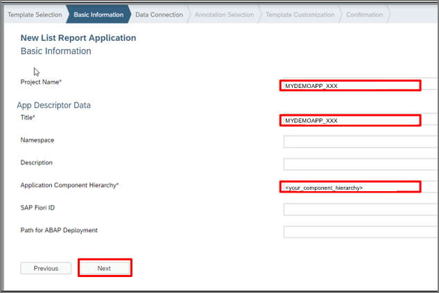

[DONE]
[ACCORDION-END]

[ACCORDION-BEGIN [Step 12: ](Choose a system to connect to the required service)]
  1. Navigate to **Service URL**:

  2. Choose your created destination as a service.

  3. Then you must enter a relative URL of the service you want to explore. It is just a part of the URL that you entered in the destination for this service. The relevant part is `/sap/opu/odata/… `.

  4. Now the status of the service can be tested by clicking **Test** button.

  5. Click on **Next**.

      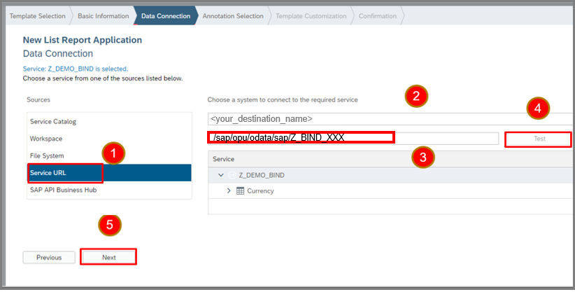

If you don´t see your created destination, you should restart your browser and log in again.

[DONE]
[ACCORDION-END]

[ACCORDION-BEGIN [Step 13: ](Run the webapp)]
  1. Run your application by clicking the **Run** button.

      

  2. Choose a file to run.

      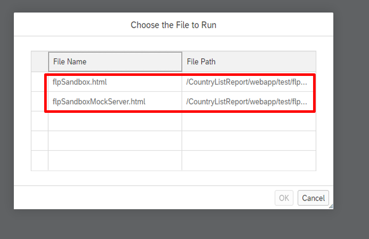

[DONE]
[ACCORDION-END]

[ACCORDION-BEGIN [Step 14: ](Open your application)]
Navigate to your application.

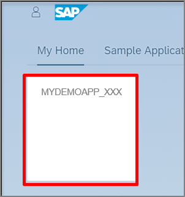

[DONE]
[ACCORDION-END]

[ACCORDION-BEGIN [Step 15: ](Select fields to be displayed on UI)]
  1. To set some filters click on settings icon.

      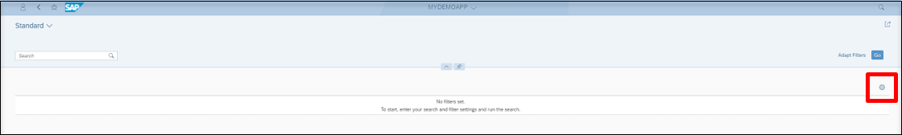

  2. Select fields that shall be displayed or select all and click **OK**.

      

[DONE]
[ACCORDION-END]

[ACCORDION-BEGIN [Step 16: ](Test your UI)]
Click on **GO**.

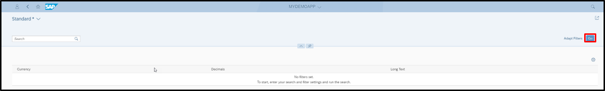

You can see the filtered data on UI.

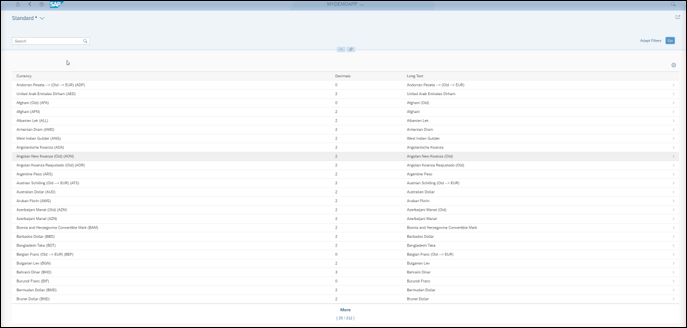

[DONE]
[ACCORDION-END]

[ACCORDION-BEGIN [Step 17: ](Test yourself)]

[VALIDATE_1]
[ACCORDION-END]
---
