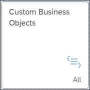
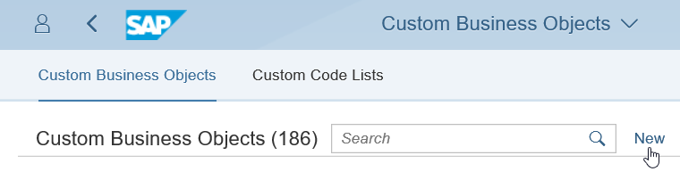
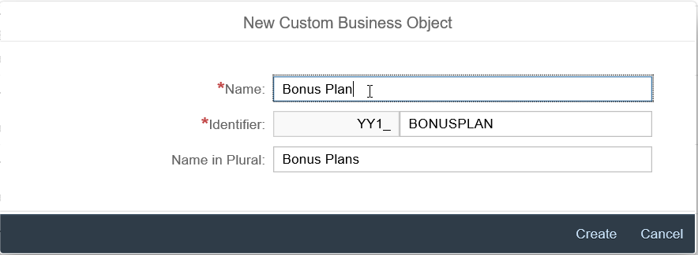
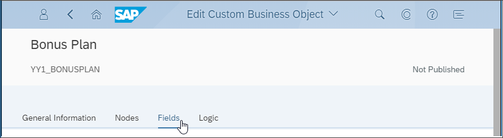
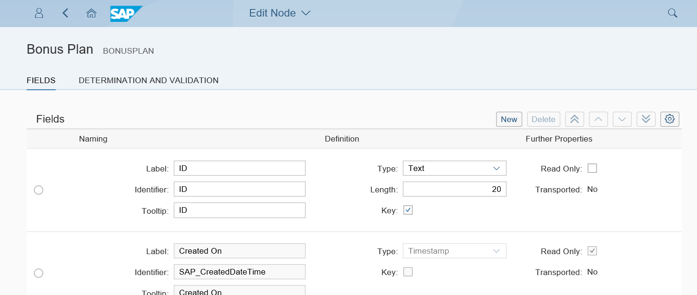
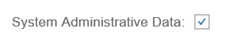
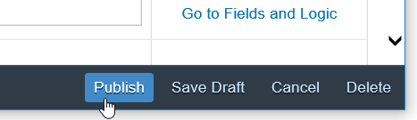

## Prerequisites  
 - **Authorizations:** Your user needs a business role with business catalog **Extensibility** (ID: `SAP_CORE_BC_EXT`) in your **S/4HANA Cloud** system

## Details
### You will learn

- Define a custom business object and its a simple data structure
- Create the database table for the custom business object

**Our Example**

A several tutorials spanning example will show extensibility along custom Bonus Management applications.

As applications are based on business objects, it all starts with custom business object creation.

In the first parts a manager wants to define business objects "Bonus Plan" for employees. A Bonus Plan is there to save employee specific rules for bonus entitlement.

### Additional Information
- **SAP S/4HANA Cloud Release** (tutorial's last update): 1808

---

[ACCORDION-BEGIN [Step 1: ](Start Custom Business Objects application)]

1. Enter your SAP S/4HANA system's Fiori Launchpad.

2. Open application **Custom Business Objects** from **Extensibility** Launchpad group.

    

[DONE]
[ACCORDION-END]

[ACCORDION-BEGIN [Step 2: ](Create a custom business object)]

1. Press **New** to start creation of a custom business object

    
    A pop up opens.

2. Enter the **Name** **`Bonus Plan`**. The other editable fields will get proposals automatically but can be changed.

    

3. Press **Create**.

    The details view of the custom business object opens.

[DONE]
[ACCORDION-END]

[ACCORDION-BEGIN [Step 3: ](Define the data structure)]

1. In the details view for editing the custom business object switch to **Fields** Section.

    

2. Create following fields by pressing **New**

    | Field Label | Field Identifier | Field Type | Key Field | Field Properties |
| :---------- | :--------------- | :----------| :---------|:-------|
| **`ID`** | **`ID`** | **`Numeric Identifier`** | **`X`** | Length: **`10`** field |  
| **`Validity Start Date`** | **`ValidityStartDate`** | **`Date`** | | |
| **`Validity End Date`** | **`ValidityEndDate`** | **`Date`** | | |  
| **`Target Amount`** | **`TargetAmount`** | **`Amount with Currency`**| | |   
| **`Low Bonus Assignment Factor`** | **`LowBonusAssignmentFactor`** | **`Number`** | | Length: **`4`**, Decimals: **`2`**, Tooltip: **`Actual revenue must meet target more than that many times`** |
| **`High Bonus Assignment Factor`** | **`HighBonusAssignmentFactor`** | **`Number`** | | Length: **`4`**, Decimals: **`2`**, Tooltip: **`Actual revenue must meet target more than that many times`** |
| **`Low Bonus Percentage`** | **`LowBonusPercentage`** | **`Quantity with Unit`** | | |  
| **`High Bonus Percentage`** | **`HighBonusPercentage`** | **`Quantity with Unit`** | | |
| **`Is Consistent`** | **`IsConsistent`** | **`Checkbox`** | | Read Only: **`X`**  |
| **`Employee ID`** | **`EmployeeID`** | **`Text`** | | Length: **`12`** |
| **`Employee Name`** | **`EmployeeName`** | **`Text`** | | Length **`40`**, Read Only: **`X`** |

    The UI for maintaining fields looks as follows.

    

[DONE]
[ACCORDION-END]

[ACCORDION-BEGIN [Step 4: ](Add standard data to the structure)]

1. In the details view for editing the custom business object switch to  **General Information** Section.

2. Check the **System Administrative Data** box to add standardized fields for `Created On`, `Created By`, `Last Changed On` and `Last Changed By`.

    
    >By checking this box the four fields also appear in the field list. The fields are not editable and will be filled and updated automatically, so that you do not need to implement logic for them. Logic implementations for these fields are even ignored.

[DONE]
[ACCORDION-END]

[ACCORDION-BEGIN [Step 5: ](Create database persistence)]
**Publish** the business object `Bonus Plan`.

This creates the database persistence of the business object.

[DONE]
[ACCORDION-END]

[ACCORDION-BEGIN [Step 6: ](Test yourself)]

[VALIDATE_1]
[ACCORDION-END]
---
