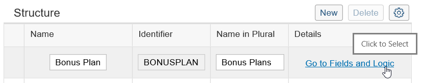

## Prerequisites  
 - **Proficiency:** Beginner
 - **Authorizations:** Your user needs a business role with business catalog **Extensibility** (ID: `SAP_CORE_BC_EXT`)

## Next Steps
 - [Creating a UI for a Custom Business Object](https://www.sap.com/developer/tutorials/abap-extensibility-cbo-ui-generation.html)

## Details
### You will learn  

Create a custom business object that has a simple data structure and publish it.
At the end there will exist a database table for the business object.

### Example

A several tutorials spanning example will show extensibility along custom Bonus Management applications.
As applications are based on business objects, it all starts with custom business object creation.

In the first parts a Manager wants to define business objects "Bonus Plan" for employees. A Bonus Plan is there to save employee specific rules for bonus entitlement.

### Time to Complete
**10 Min**

---

[ACCORDION-BEGIN [Step 1: ](Starting "Custom Business Objects" application)]

**Start** the Custom Business Object's application by clicking its tile

[ACCORDION-END]

[ACCORDION-BEGIN [Step 2: ](Creating a new Custom Business Object)]

Press the **New** action to start creation of a Custom Business Object

In the opening Pop Up **fill** in the Name "Bonus Plan". The other editable fields will get proposals automatically but can be changed.

Execute the **Create** action.

[ACCORDION-END]

[ACCORDION-BEGIN [Step 3: ](Defining the data structure)]

In the following view for editing the custom business object **Go to Fields and Logic** of the root node "Bonus Plan"

**Create** following fields

| Field Name     | Field Properties             | Tooltip     |
| :------------- | :--------------------------- | :-----------|
| ID             | Text of length 20, key field |             |   
| Validity Start Date | Date    | |
| Validity End Date | Date | |   
| Target Amount | Amount with Currency| |   
| Low Bonus Assignment Factor | Number of length 4, decimals 2 | Actual revenue must meet target more than that many times |
| High Bonus Assignment Factor | Number of length 4, decimals 2 | Actual revenue must meet target more than that many times |
| Low Bonus Percentage | Quantity with Unit | |   
| High Bonus Percentage | Quantity with Unit  | |
| Is Consistent | Checkbox, Read Only  | |
| Employee ID | Text of length 12  | |
| Employee Name | Text of length 40, Read Only   | |

The UI for maintaining fields looks as follows.

Go back via the application's **Back** button.

[ACCORDION-END]

[ACCORDION-BEGIN [Step 4: ](Adding standard data to the structure)]
Back in the business Object's definition overview, **check** the System Administrative Data box to add standardized fields for `Created On`, `Created By`, `Last Changed On` and `Last Changed By`.

By checking this box the four fields also appear as not editable in the field list.
These fields will be filled and updated automatically, so that you do not need to implement logic for this. Logic implementations for these fields even would be ignored.

[ACCORDION-END]

[ACCORDION-BEGIN [Step 5: ](Creating the database persistence)]
**Publish** the Business Object `Bonus Plan`.

This creates the database persistence of the Business Object.

[ACCORDION-END]

---
