## Prerequisites  
**Authorizations:** Your user needs
- (a) business role(s) with business catalogs **Extensibility** (ID: `SAP_CORE_BC_EXT`) and **Communication Management** (ID: `SAP_CORE_BC_COM`) in your **S/4HANA Cloud** system
- access to **[SAP API Business Hub](https://api.sap.com)**.
**Example Objects:** Existence of custom business object `Bonus Entitlement` as described in this [tutorial](https://blogs.sap.com/2017/02/20/part-iv-associated-business-objects-bonus-entitlement-with-plan-sales-order/) (Blog)
**Knowledge:** (optional) [Tutorial: Getting started with the SAP API Business Hub](https://developers.sap.com/tutorials/hcp-abh-getting-started.html)

## Details
### You will learn
- How to get needed service data from SAP API Business Hub Sandbox
- How to configure outbound service connection in SAP S/4HANA Cloud system
- How to call and process an outbound service in custom business object logic

The example application of `Bonus Entitlement` will be enhanced by a feedback functionality. The manager's feedback will be translated automatically into English by calling the externally available service **Machine Translation API** of SAP.
> Be aware that the example is done with SAP API Business Hub Sandbox system only. This shall only give an idea on how it works and cannot be used productively.

### Additional Information
- **SAP S/4HANA Cloud Release** (tutorial's last update): 1805
---
[ACCORDION-BEGIN [Step 1: ](Excursus: Try out the service in SAP API Business Hub)]
To get to know the Machine Translation API service first, you can try it out in SAP API Business Hub.

1. Go to [Machine Translation API on SAP API Business Hub](https://api.sap.com/api/translation_api/resource)

2. Below **API References** click the Link to **try out** the service.

    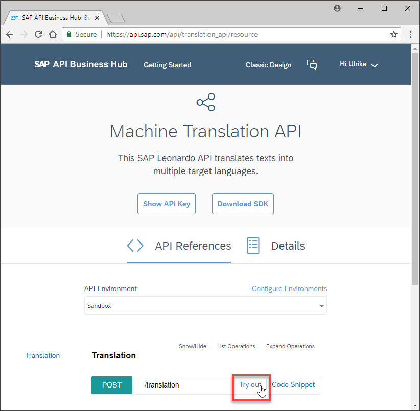

3. If you are not logged in yet, a pop appears to do so. Press **Log On**

4. Copy to clipboard this example code for a request body of the machine translation service

    ```json
    {
      "sourceLanguage": "en",
      "targetLanguages": [
        "es"
      ],
      "units": [
        {
          "value": "Your text to be translated"
        }
      ]
    }
    ```

5. Scroll down to **Parameters** and paste the code into the **Value** input field of **Parameter** **`body`**

    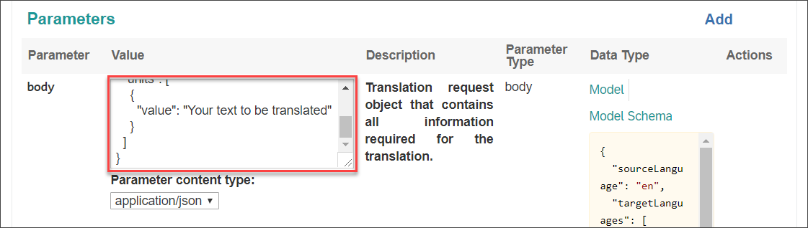

6. Scroll down to the **Try Out** button and press it

    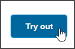

    The response to the service call will appear below.

[DONE]
[ACCORDION-END]

[ACCORDION-BEGIN [Step 2: ](Get service end point and API Key)]
To configure the connection to the system and the outbound scenario you
will need the service's end point.

After having tried out the service in SAP API Business Hub, the response had appeared.
Copy the Request URL - which is the end point - from the response section and paste it into a text editor for later usage


In order to authenticate during service call later you'll need an API Key of SAP API Business Hub.

1. Still in SAP API Business Hub, scroll to top and press **Show API Key**

    
    A pop up opens.

2. Press **Copy Key and Close** to save the key to your clipboard.

    

3. Paste the application key into a text editor for later usage.

[DONE]
[ACCORDION-END]

[ACCORDION-BEGIN [Step 3: ](Create Communication System for Sandbox)]
In order to allow communication with the SAP API Business Hub Sandbox you have to create a communication system for it in your SAP S/4HANA System.

1. Enter your SAP S/4HANA system's Fiori Launchpad.

2. Open application **Communication Systems** from **Communication Management** Launchpad group.

3. Execute the action to create a **New** Communication System.

4. Enter following Data into the input fields.

    | Field Label | Field Value |
    | :------------- | :--------------------------- |
    | System ID | **`SANDBOX_API_SAP_COM`** |
    | System Name | **`SANDBOX_API_SAP_COM`** |

    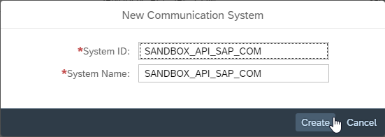

5. Press **Create**

    The Details screen of the new Communication System opens.

6. Enter `sandbox.api.sap.com` which is the domain specific part of the before gotten service's end point as **Host Name**

7. Scroll down to the **Outbound Users** section and  press the **+** button to add an outbound user.

    Select the **Authentication Method** option **`None`** as authentication will be done via the API Key.

    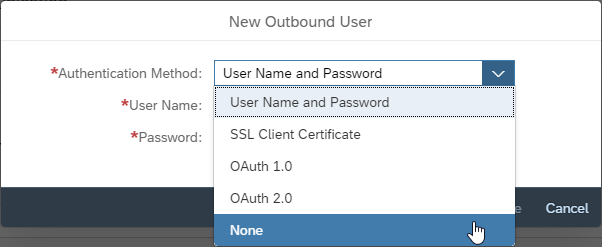

8. Press **Create** to finish the outbound user creation. The pop up closes.

9. Press **Save** to finish the communication system creation.

[DONE]
[ACCORDION-END]

[ACCORDION-BEGIN [Step 4: ](Create custom communication scenario for external service)]
Define the external service as an available Communication Scenario.

1. Go to **Home** of your SAP S/4HANA system's Fiori Launchpad.

    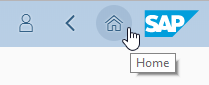

2. Open application **Custom Communication Scenario** from **Extensibility** Launchpad group

3. Execute the action to create a **New** Custom Communication Scenario.

    A pop up opens.

4. Enter following data into the input fields and press the **New** button

    | Field Label | Field Value |
    | :------------- | :--------------------------- |
    | Communication Scenario ID | **`MACHINE_TRANSLATION_API`** (prefix `YY1_` is added automatically) |
    | Description | **`Scenario for SAP Machine Translation API`** |

    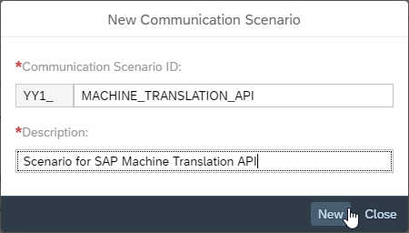

    The details UI for the scenario opens.

[DONE]
[ACCORDION-END]

[ACCORDION-BEGIN [Step 5: ](Create outbound service in scenario)]
Set the service path as outbound service.

1. Being in the object page of the custom communication scenario, switch to the **Outbound Service** section

    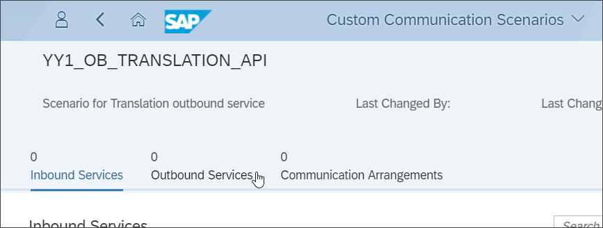

2. Press **+** to start outbound service creation
A pop up opens

    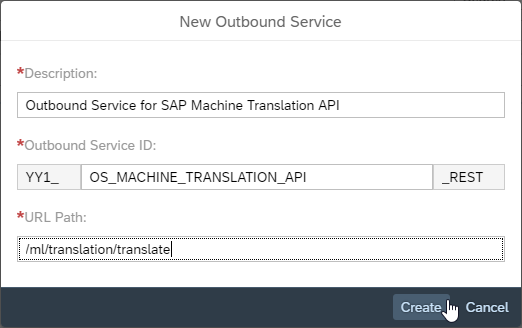

    Enter following data into the input fields

    | Field Label | Field Value |
    | :------------- | :--------------------------- |
    | Description | **`Outbound Service for SAP Machine Translation API`** |
    | Outbound Service ID | **`OS_MACHINE_TRANSLATION_API`** (prefix `YY1_` and suffix `_REST` are added automatically)|
    | URL Path | **`/ml/translation/translation`** (service specific part of before gotten service's end point)|

3. Press **Create** to finish the outbound service creation.

    The pop up closes.

4. Press **Publish** to finish the custom communication scenario creation.

[DONE]
[ACCORDION-END]

[ACCORDION-BEGIN [Step 6: ](Create communication arrangement for external service)]
Create a Communication Arrangement to link the scenario with the communication system.

1. Go to **Home** of your SAP S/4HANA system's Fiori Launchpad.

    

2. Open application **Custom Communication Arrangements** from **Communication Management** Launchpad group.

3. Execute the action to create a **New** Custom Communication Arrangement.

    A pop up opens.

4. **Select** or **Enter** following data.

    | Field Label | Field Value |
    | :------------- | :--------------------------- |
    | Scenario | **`YY1_MACHINE_TRANSLATION_API`** |
    | Arrangement Name | **`YY1_MACHINE_TRANSLATION_API_SANDBOX_SAP_COM`** |

5. Press **Create**.

    

    The pop up closes and the Arrangement's Detail Page opens.

6. Select Communication System `SANDBOX_API_SAP_COM`

    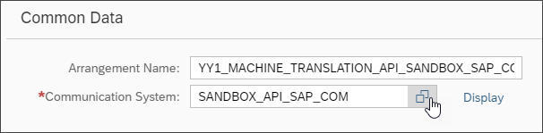

5. **Save** the Arrangement.

[DONE]
[ACCORDION-END]

[ACCORDION-BEGIN [Step 7: ](Extend custom business object with feedback fields)]
Add fields to persists feedback at the custom business object `Bonus Entitlement`.

1. Go to **Home** of your SAP S/4HANA system's Fiori Launchpad.

    

2. Open **Custom Business Objects** application in **Extensibility** launchpad group.

    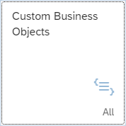

3. Open the business object `Bonus Entitlement`.

4. Start Edit Mode by executing the **Edit Draft** action.

5. Switch to **Fields** section.

6. Add following **New** fields

    | Field Label | Field Identifier | Field Type | Field Properties |
    | :---------- | :--------------- | :----------| :----------------|
    | **`Feedback`**| **`Feedback`** | **`Text`** | Length: **`255`** |
    | **`Feedback's language`** | **`FeedbacksLanguage`** | **`Text`** | Length: **`2`** |
    | **`Feedback in english`** | **`FeedbackInEnglish`** | **`Text`** | Length: **`255`** |

7. **Publish** the business object.

[DONE]
[ACCORDION-END]

[ACCORDION-BEGIN [Step 8: ](Open custom business object logic)]
Now as the business object has just been published, the logic can be enhanced by the translation functionality. ABAP for key users was enhanced by the classes `CL_BLE_HTTP_CLIENT`, `CL_BLE_HTTP_REQUEST` and `CX_BLE_HTTP_EXCEPTION` to enable you to work with HTTP requests.

1. Switch to **Logic** section.

    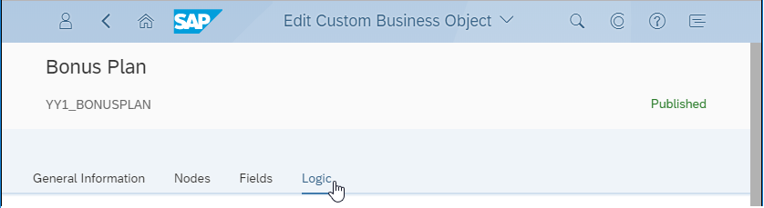

2. Enter the **After Modification** Event Logic.

    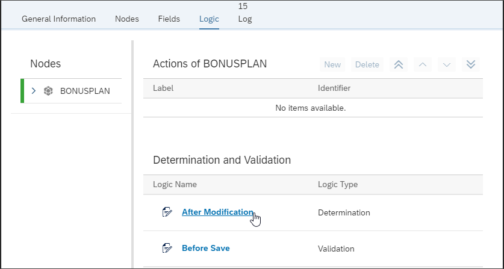

[DONE]
[ACCORDION-END]

[ACCORDION-BEGIN [Step 9: ](Code HTTP client creation)]

1. In the already existing coding go to the end but before this snippet

    ```abap
        ELSE.
            RETURN.
        ENDIF.
    ENDIF.
    ```
2. Implement a check if the outbound service is available

    ```abap
    * Check if the outbound service is available
    CHECK cl_ble_http_client=>is_service_available(
        communication_scenario = 'YY1_MACHINE_TRANSLATION_API'
        outbound_service       = 'YY1_OS_MACHINE_TRANSLATION_API_REST'
    ) = abap_true.
    ```
3. Implement creation of HTTP client

    ```abap
    * Create HTTP client to access the outbound service
    DATA(lo_client) = cl_ble_http_client=>create(
        communication_scenario = 'YY1_MACHINE_TRANSLATION_API'
        outbound_service       = 'YY1_OS_MACHINE_TRANSLATION_API_REST'
    ).
    ```

[DONE]
[ACCORDION-END]

[ACCORDION-BEGIN [Step 10: ](Code request body string)]
Implement the creation of the Request Body.
As the aim is to translate every other language than english into english, the target language is set to english. The source language and the to be translated feedback are gotten from the corresponding fields of the custom business object.
The request body in JSON format looks this way.

```json
{
  "sourceLanguage": "es",
  "targetLanguages": [
    "en"
  ],
  "units": [
    {
      "value": "Su texto a traducir"
    }
  ]
}
```

In the custom business object logic you have to supply this request as string. The `sourceLanguage` and `value` values have to be replaced with variables by string concatenation.


```abap
DATA lv_request_body TYPE string.
CONCATENATE '{"sourceLanguage": "' bonus_entitlement-feedbackslanguage '","targetLanguages": ["en"],"units": [{"value": "' bonus_entitlement-feedback '"}]}' INTO lv_request_body.
```

[DONE]
[ACCORDION-END]

[ACCORDION-BEGIN [Step 11: ](Code service request creation)]
Create the service request and set several properties

```abap
* Creation of the service request
DATA(request) = cl_ble_http_request=>create(
* method that is used for the service call
)->set_method(
    if_ble_http_request=>co_method-post
)->set_body( lv_request_body
)->set_header_parameter(
EXPORTING
    name  = 'apikey'
    value = '<YOUR API KEY>' "the key you got with Step 1
)->set_header_parameter(
EXPORTING
    name  = 'Content-Type' "Content type the bodies of request and response are formatted as
    value = 'application/json'
    ).
```

[DONE]
[ACCORDION-END]

[ACCORDION-BEGIN [Step 12: ](Code request sending and response processing)]

1. Implement sending the request by the use of the before created HTTP client and receive the response.

    ```abap
    * Send a request and receive a response.
	    DATA(response) = lo_client->send( request ).
    ```

2. Implement getting the response body from the response.

    ```abap
    * Get the body of the response.
    	DATA(lv_body) = response->get_body( ).
    ```
    The response body in JSON format will look like this

    ```json
    {
        "units": [
            {
                "value": "Su texto a traducir",
                "translations": [
                    {
                        "language": "en",
                        "value": "Your text to be translated"
                    }
                ]
            }
        ]
    }
    ```

3. Implement getting the translation part from the JSON string by the help of string operations.

    ```abap  
    * Get translation from response
        DATA(lv_translation) = substring_before( val = substring_after( val = lv_body sub = '"en","value":"') sub = '"}]}]}' ).

        bonus_calculation-feedbackinenglish = lv_translation.
    ```
4. Implement error handling

    ```abap
    TRY .
    " CODING PARTS OF THIS STEP FROM BEFORE TO BE PLACED HERE
    	CATCH cx_ble_http_exception INTO DATA(lx).
    * The http status code can be checked.
    	CASE lx->status_code.
    	WHEN 404.
    * Error handling
    	WHEN OTHERS.
    * Error handling
    	ENDCASE.
    ENDTRY.
```
5. Publish the After Modification logic.

[DONE]
[ACCORDION-END]

[ACCORDION-BEGIN [Step 13: ](Test the application)]
1. Go to **Home** of your SAP S/4HANA system's Fiori Launchpad.

    

2. Open the **Bonus Entitlement** application from **Extensibility** Launchpad group.

3. Open a `Bonus Entitlement`.

4. Enter following data

    | Field Label | Field Value |
    | :------------- | :--------------------------- |
    | Feedback | **`Su texto a traducir`** |
    | Feedback's Language | **`es`** |

5. **Save** the Bonus Entitlement. The translation will get filled.

[DONE]
[ACCORDION-END]

[ACCORDION-BEGIN [Step 14: ](Test yourself)]

[VALIDATE_1]
[ACCORDION-END]


---
