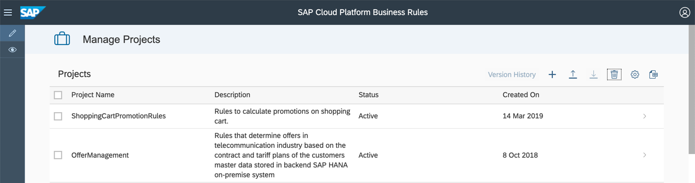
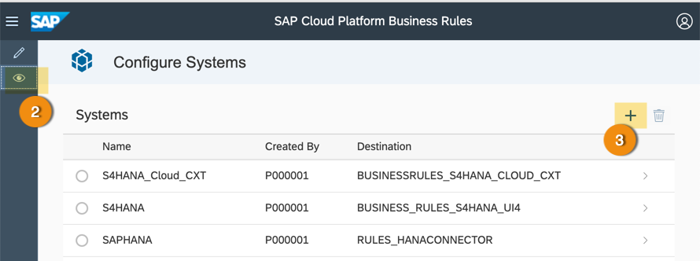
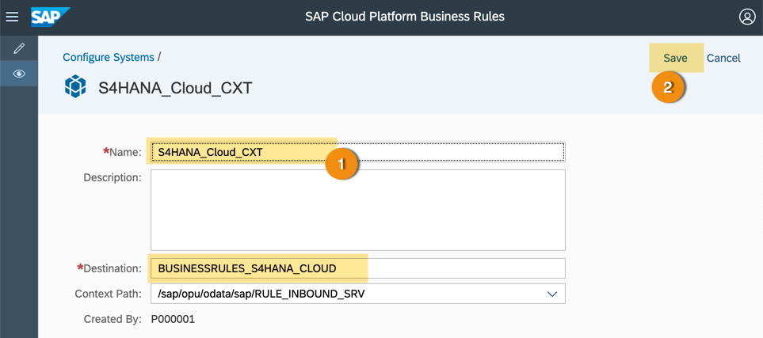

## Prerequisites
  - User must have enabled Business Rules service in SAP Cloud Platform account.
  - User must have **`RuleSuperUser`** role assigned to repository and runtime configurations.

## Details
### You will learn
  - How to configure system in SAP Cloud Platform Business Rules

SAP Cloud Platform Business Rules is a platform re-use service that encapsulates high change decision logic from application logic. Integrating business rules with S/4HANA is one of the extensibility capability to facilitate customisation opportunities and business process adaptations. With **S/4HANA Cloud 1811** release, you can author, manage and deploy your rules directly to S/4HANA system from SAP Cloud Platform.  

---

[ACCORDION-BEGIN [Step 1: ](Add system)]

1. Open **Manage Business Rules** application of your SAP Cloud Platform Business Rules.

    

2. Click the **Configure Systems** view icon ().

3. Click **+** button to configure S/4HANA cloud system.

    

[DONE]
[ACCORDION-END]

[ACCORDION-BEGIN [Step 2: ](Configure system)]

1. Enter the following configuration details:

    - **Name** of your choice

    - **Description** is optional

    - **Destination** is the name of the destination created in previous tutorial

2. **Save** the system configuration details.

    

3. Click the pencil icon ( ) on the vertical toolbar to switch back to **Manage Rules Application**.

[DONE]
[ACCORDION-END]

[ACCORDION-BEGIN [Step 3: ](Test yourself)]

[VALIDATE_1]
[ACCORDION-END]
