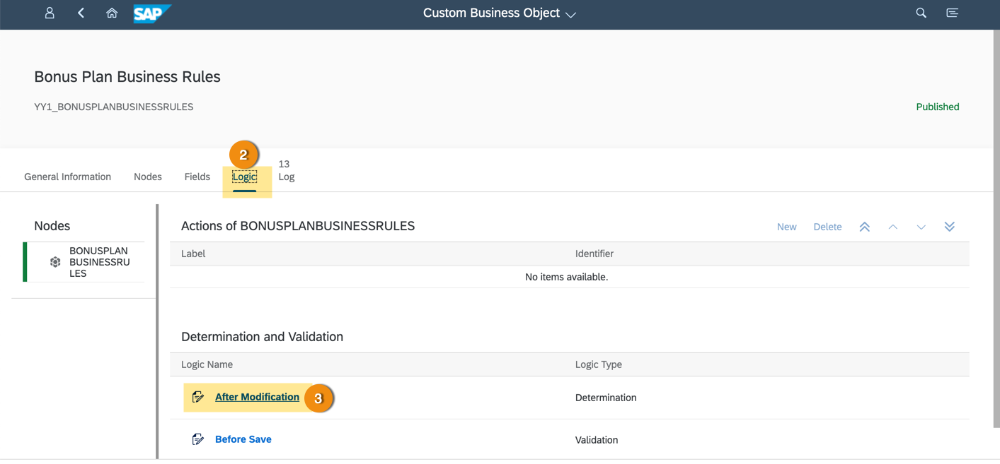
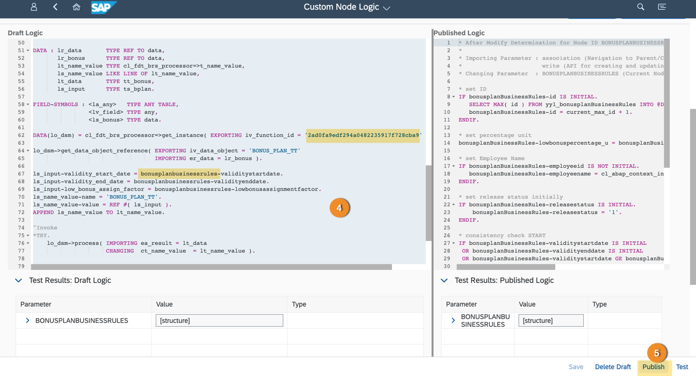
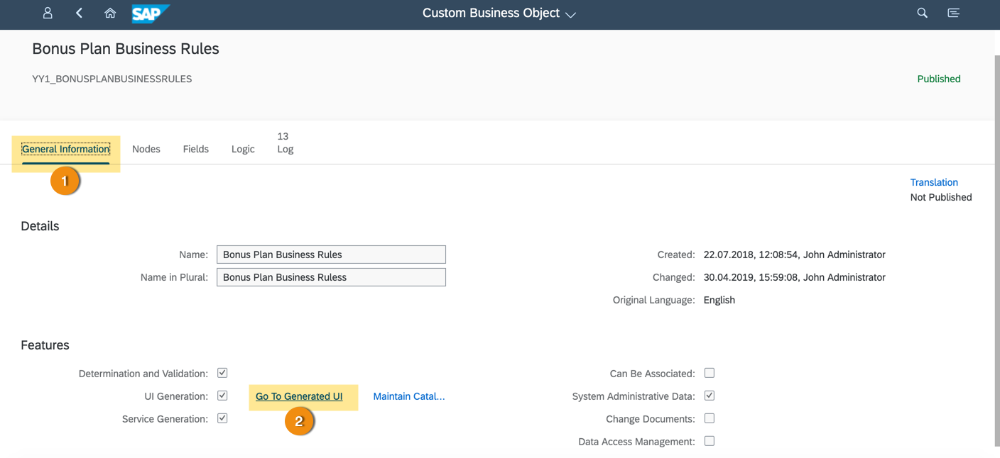
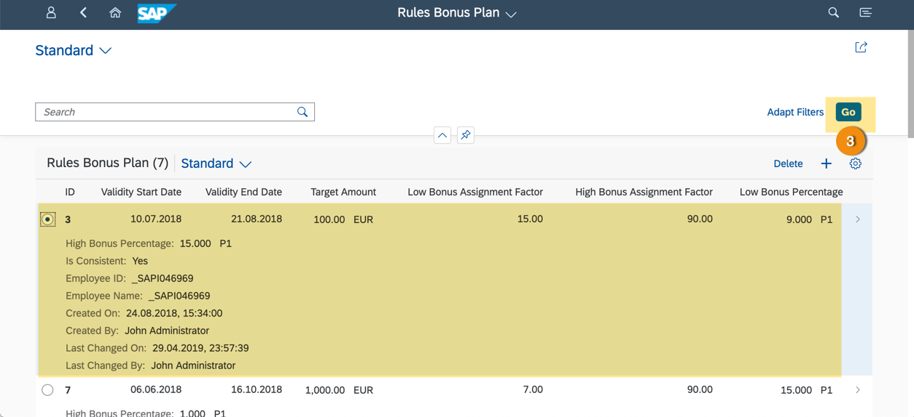
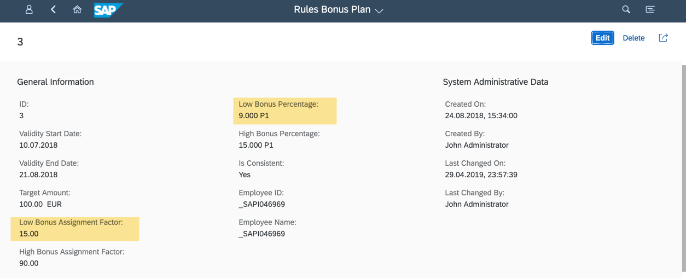

## Prerequisites
  - S/4HANA Cloud system must be of release 1811 or higher.
  - Custom Business Object must already be created in S/4HANA Cloud.
  - Business rules must be created in SAP Cloud Platform and deployed in S/4HANA cloud.

## Details
### You will learn
  - How to extend custom business object to integrate business rules logic
  - Run the custom business object to see the change in the values based on business rules execution

---

[ACCORDION-BEGIN [Step 1: ](Open custom business object)]

1. Open the `Bonus Plan` custom business object in S/4HANA cloud system.

2. Switch to **Logic** tab.

3. Click the **After Modification** link.

    

[VALIDATE_1]
[ACCORDION-END]

[ACCORDION-BEGIN [Step 2: ](Integrate rules logic in custom business object)]

4. Copy this code appropriately after `consistency check` block.

    > In the code do not forget to replace:        `bonusplanbusinessrules` with your custom business object name and rule service ID in ABAP function call `cl_fdt_brs_processor`  

    ```ABAP
    TYPES : BEGIN OF ts_bonus,
            percentage_value TYPE c LENGTH 3,
          END OF ts_bonus,
          tt_bonus TYPE TABLE OF ts_bonus.

    TYPES : BEGIN OF ts_bplan,
            high_bonus_assign_factor TYPE int4,
            low_bonus_assign_factor  TYPE int4,
            validity_end_date        TYPE d,
            validity_start_date      TYPE d,
          END OF ts_bplan.

    DATA : lr_data       TYPE REF TO data,
         lr_bonus      TYPE REF TO data,
         lt_name_value TYPE cl_fdt_brs_processor=>t_name_value,
         ls_name_value LIKE LINE OF lt_name_value,
         lt_data       TYPE tt_bonus,
         ls_input      TYPE ts_bplan.

    FIELD-SYMBOLS : <la_any>   TYPE ANY TABLE,
                  <lv_field> TYPE any,
                  <ls_bonus> TYPE data.

    DATA(lo_dsm) = cl_fdt_brs_processor=>get_instance( EXPORTING iv_function_id = '2ad0fa9edf294a0482235917f728cba9' ).

    lo_dsm->get_data_object_reference( EXPORTING iv_data_object = 'BONUS_PLAN_TT'
                                     IMPORTING er_data = lr_bonus ).

    ls_input-validity_start_date = bonusplanbusinessrules-validitystartdate.
    ls_input-validity_end_date = bonusplanbusinessrules-validityenddate.
    ls_input-low_bonus_assign_factor = bonusplanbusinessrules-lowbonusassignmentfactor.
    ls_name_value-name = 'BONUS_PLAN_TT'.
    ls_name_value-value = REF #( ls_input ).
    APPEND ls_name_value TO lt_name_value.

    "Invoke
    *TRY.
      lo_dsm->process( IMPORTING ea_result = lt_data
                       CHANGING  ct_name_value  = lt_name_value ).

    *ENDTRY.

    READ TABLE lt_data INTO DATA(ls_data) INDEX 1.
    bonusplanbusinessrules-lowbonuspercentage_v = ls_data-percentage_value.

    IF bonusplanbusinessrules-id IS INITIAL.
    bonusplanbusinessrules-isconsistent = abap_false.
    ENDIF.
    ```

5. Click **Publish** to save and publish the changes.

    

[DONE]
[ACCORDION-END]

[ACCORDION-BEGIN [Step 3: ](Test business rules logic)]

1. Switch back to the **General Information** tab of custom business object.

2. Click the **Go To Generated UI** link.

    

3. Click **Go** if you have bonus plan data created, or click **+** to create a new one.

    

    > You can edit the `Low Bonus Assignment Factor` and save it to see the change in `Low Bonus Percentage`

    

[VALIDATE_2]
[ACCORDION-END]

---
