## Details
### You will learn
  - How to create decision table based business rules

---
**Rule** entity is the technical representation of a simple business rule to be applied to a business case. It defines a business logic that, once evaluated against live data, leads to a decision. A rule includes one or more conditions, and outputs that triggered upon satisfaction of the condition or conditions. Rules can be adapted to the increasing complexity of business cases by combining any number of rules to a rule set.Rule can be of different type like decision table rule or text rule.

**Rule Expression Language** is an expression language which enables to define condition and result values in decision table and text rule.

---
For more information, you can read the help documentation:

[Rule](https://help.sap.com/viewer/9d7cfeaba766433eaea8a29fdb8a688c/Cloud/en-US/175ecee7ffcd4b8f831df11f74d8c130.html)

[Rule Expression Language](https://help.sap.com/viewer/9d7cfeaba766433eaea8a29fdb8a688c/Cloud/en-US/0f73cd85e5f04e0ea77486109ee97964.html)

[ACCORDION-BEGIN [Step 1: ](Create decision table)]

1.	Switch to **Rules** tab.

2.  Click **+** to add rule.

    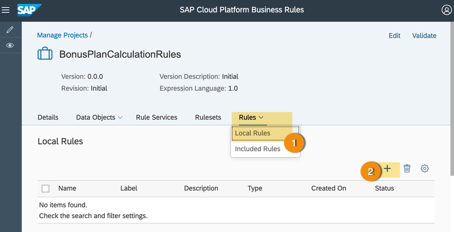

3. In the **New Rule** popup, enter the following:

    - **Name**: `ELIGIBLE_BONUS_PERCENTAGE` or any name of your choice

    - **Type**: Decision Table

4. Click **Create**.

    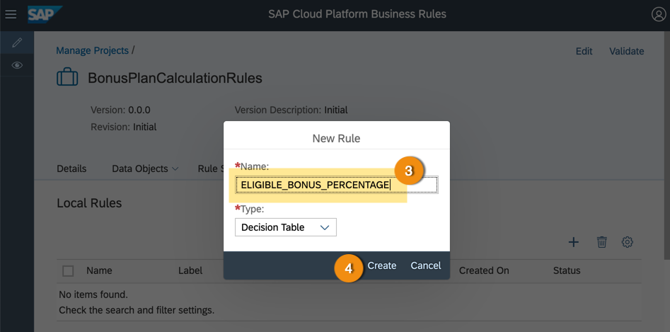

5. In the **Details** tab, enter the following values:

    - **Label**: `Bonus Percentage Eligibility Rule` or any label of your choice

    - **Description**: `Calculate minimum bonus percentage based on custom business object of S/4HANA (which is: bonus plan)` or any description of your choice

    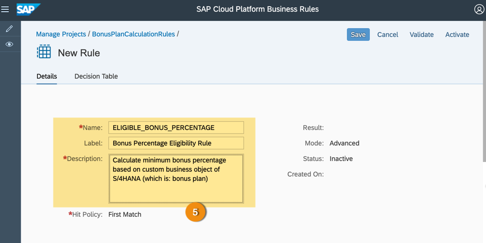

[DONE]
[ACCORDION-END]

[ACCORDION-BEGIN [Step 2: ](Configure decision table settings)]

1.	Switch to **Decision Table** tab.

2.	Click **Settings**.

    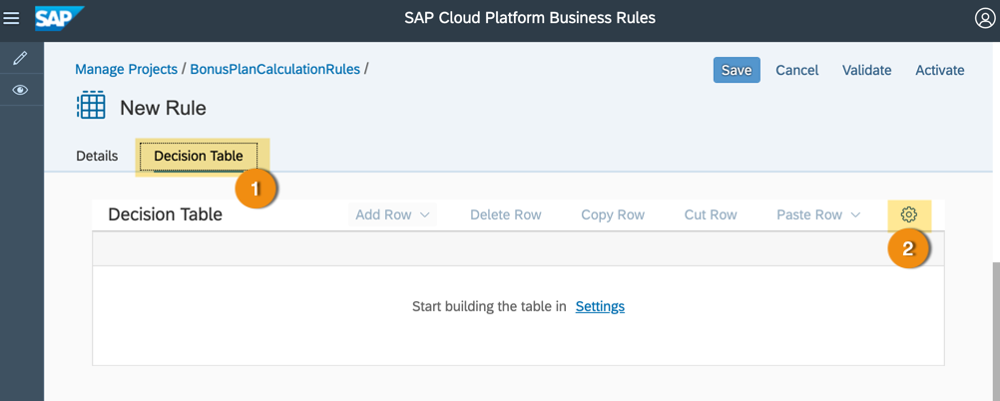

3.	In the **Decision Table Settings** popup, enter the following values and expressions:

    - To add **Condition expression**, go to the condition expression cell and press **Ctrl + SPACE** and then choose the value from the context help as given in the table below.

    - To add **Fixed Operator**, select the given operator from the drop down list.

    - To add a `new row`, click **+** at end of each row.

    | Condition Expressions                  | Fixed Operator   |
    | ---------------------------------------|:----------------:|
    | `BONUS_PLAN_TT.VALIDITY_START_DATE`      |      >           |
    | `BONUS_PLAN_TT.VALIDITY_END_DATE`        |      <           |
    | `BONUS_PLAN_TT.LOW_BONUS_ASSIGN_FACTOR`  |      IN          |

    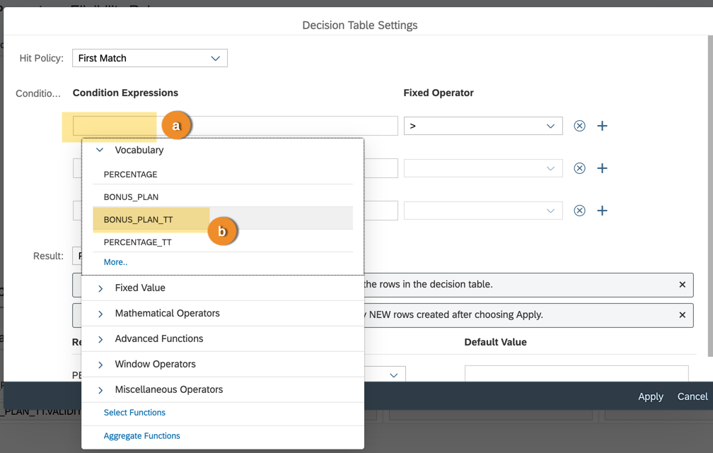

    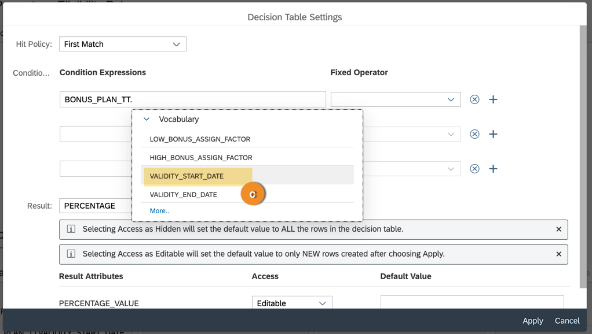

4. In the **Result** type, click  to add the output columns to the decision table.

5.	Click **Apply**.

    

6. Decision table gets created with the selected condition columns and result column.

    > There will also be one additional empty row added to the decision table.

    > You can also **Save** the decision table. Then you need to click **Edit** to continue editing the decision table.  

      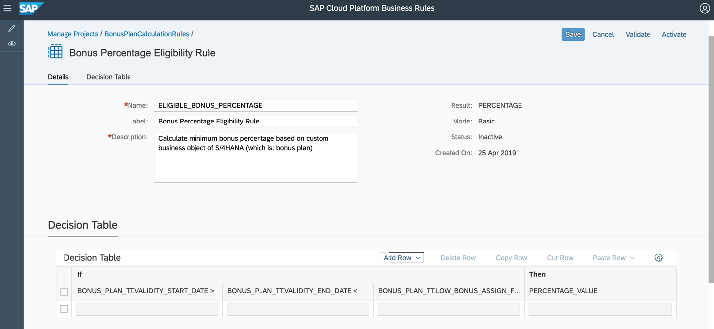

[DONE]
[ACCORDION-END]

[ACCORDION-BEGIN [Step 3: ](Define conditions and result expressions)]

1. In the row, select the cell for each condition and use in-place rule authoring to enter the given values.

    - To enter the expression do the following:

        - Select the cell.

        - Press **CTRL + SPACE**.

        - From the options, select **Fixed Value > Select date**.

        - Choose a date from date picker.

        - Click **OK**.

        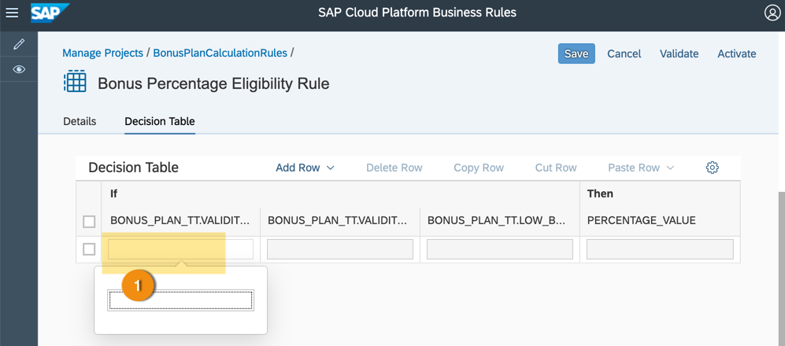

        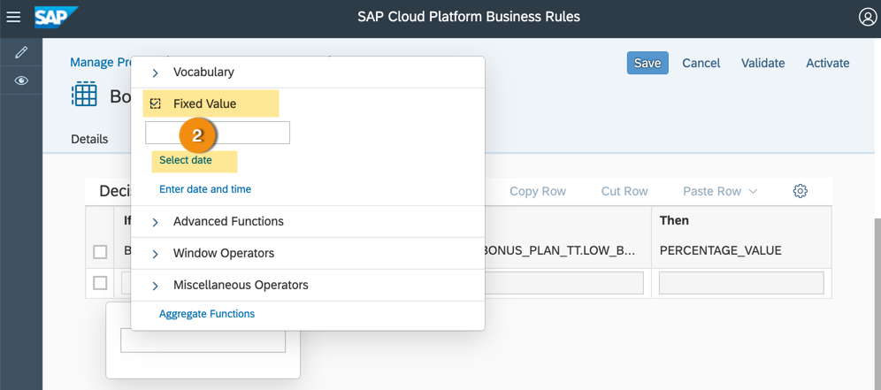

        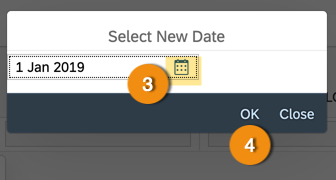

    > Depending upon the condition or result data type and operator, the options for rule authoring would change. For example, if the fixed operator is IN then you get options like [, ], .., fixed value, and so forth.

    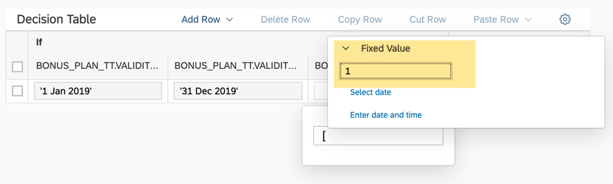

    | Condition Expression           | Values   |
    | ---------------------------------------|:----------------:|
    | BONUS_PLAN_TT.VALIDITY_START_DATE      |  '2019-01-01'    |
    | BONUS_PLAN_TT.VALIDITY_END_DATE        |  '2019-12-31'    |
    | BONUS_PLAN_TT.LOW_BONUS_ASSIGN_FACTOR  |  [1 .. 10]       |
    | PERCENTAGE_VALUE                       |   15             |

    - Filled decision table row looks like this:

    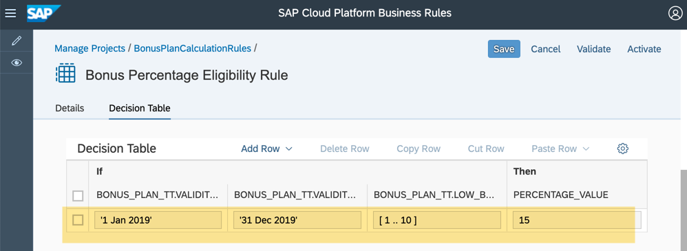

2. Select the row and click **Copy Row**.

    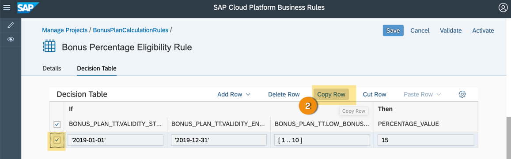

3. Select the row and click **Paste Row**.

    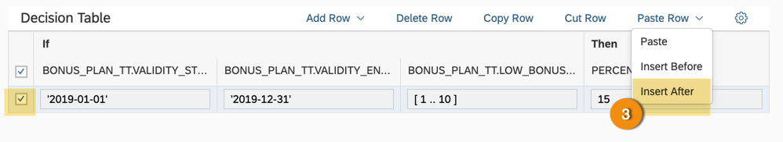

4. Repeat copy & paste row and enter condition & result expression values so that the decision table look as shown in the screenshot.

    > Creating 4-5 rows is not mandatory. You can just create one single row. This is to give you an experience with different modelling options with decision table.

    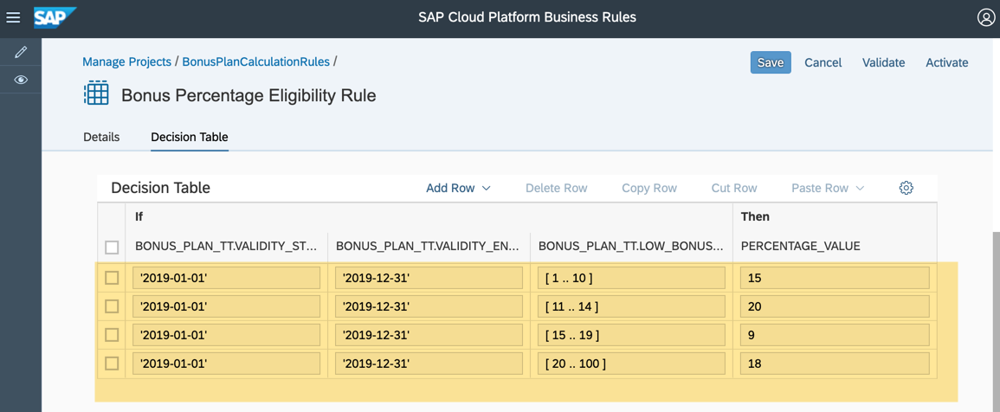

[VALIDATE_2]
[ACCORDION-END]

[ACCORDION-BEGIN [Step 3: ](Activate decision table)]

Once you are done editing, click **Activate** to save and activate the decision table.

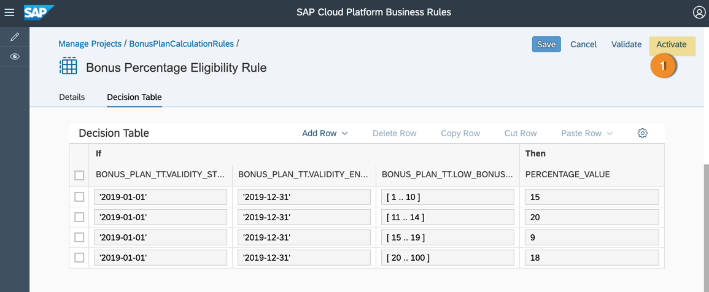

> If the decision table activation is successful, then the status will change to **Active**.

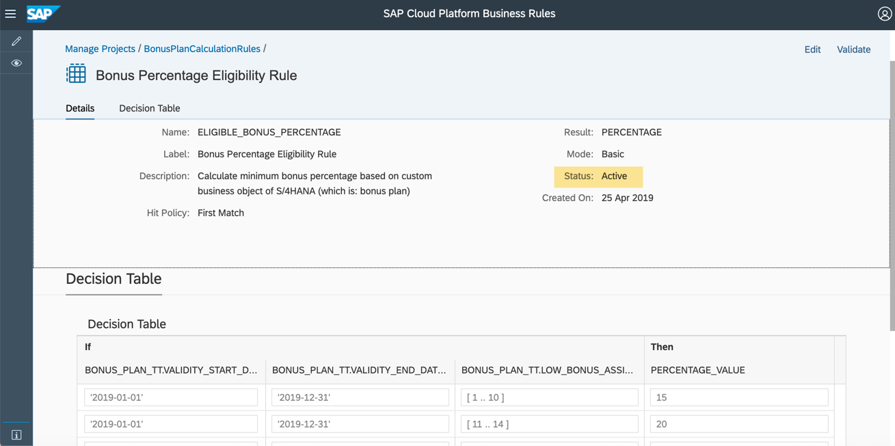

[DONE]
[ACCORDION-END]

---
