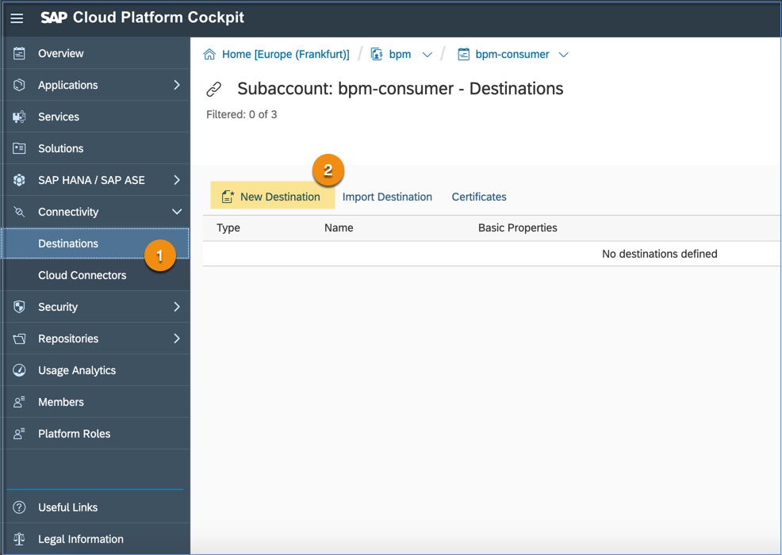
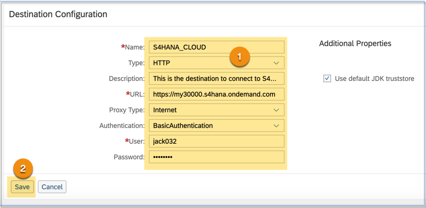
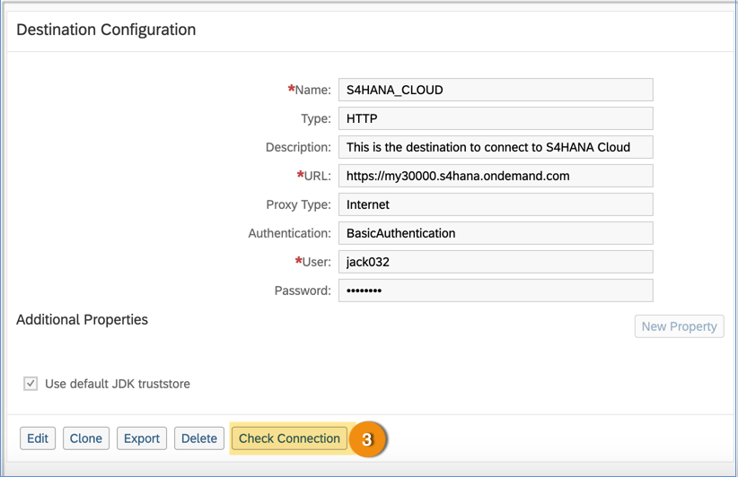

## Prerequisites
  - Custom Business Object must have been created. If not, then follow the tutorials [Create Custom Business Objects in S/4HANA Cloud](https://developers.sap.com/group.abap-extensibiliy-cbo-cce-ccl.html).
  - You must have SAP Cloud Platform account.

## Details
### You will learn
  - How to create destination in SAP Cloud Platform to connect to the S/4HANA cloud system

[ACCORDION-BEGIN [Step 1: ](Create destination)]

1.	Open SAP Cloud Platform Cockpit and go to **Connectivity > Destinations** option.

2.	Click **New Destination**.

    

[DONE]
[ACCORDION-END]

[ACCORDION-BEGIN [Step 2: ](Configure destination)]

1.  In **Destination Configuration**, enter the following:

      -  **Name** of your choice.

      -  **Type** as HTTP.

      -  **Description** of your choice.

      -  **URL** of the S/4HANA cloud system.

      -  **Proxy Type** as Internet.

      -  **Authentication** based on your S/4HANA system security policy.

2.	**Save** the configuration.

    

3.  Check if the configuration is done correctly by clicking on the **Check Connection** button.

    

    - If the connection is successful then you will see a green checked icon.

      

[DONE]
[ACCORDION-END]

[ACCORDION-BEGIN [Step 3: ](Test yourself)]

[VALIDATE_1]
[ACCORDION-END]

[ACCORDION-BEGIN [Step 4: ](Test yourself)]

[VALIDATE_2]
[ACCORDION-END]

---
