## Details
### You will learn
  - How to create `rule service` which is the deployable entity of business rules
  - How to create `ruleset` to bundle rules with same output

**`Rule Service`** is an interface or an end point that enables an application to invoke a decision logic. In an online transaction or workflow, rule service is invoked by passing any relevant input from an application to the rule service in a stateless manner.

**`Ruleset`** is a logical collection of rules that helps you group business rules that govern a specific function. A `ruleset` links a rule or group of rules to a rule service.

---
For more information, you can read the help documentation:

[`Rule service`](https://help.sap.com/viewer/9d7cfeaba766433eaea8a29fdb8a688c/Cloud/en-US/f9343c0da1be4f60b70771f71354106f.html)

[`Ruleset`](https://help.sap.com/viewer/9d7cfeaba766433eaea8a29fdb8a688c/Cloud/en-US/06e5b6b31a04499d9fc11717fada03e6.html)

[ACCORDION-BEGIN [Step 1: ](Create rule service)]

1.	Switch to **Rule Services** tab in **Manage Rules Application**.

2.	Click **+** to create the rule service.

    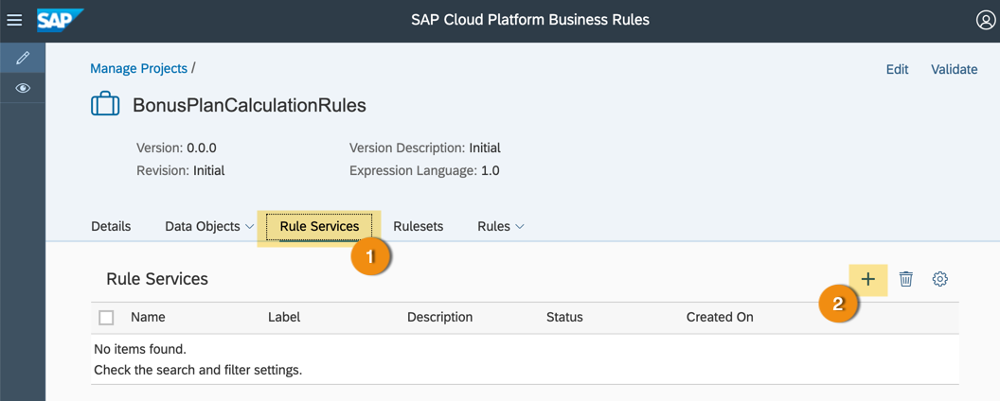

3. In the **Details** tab, enter the following rule service details:

    - **Name** as `BONUS_PERCENTAGE_S4H` or any name of your choice.

    - **Label**: `Bonus Percentage Rule Service` or any label of your choice.

    - **Description**: `Calculates minimum bonus percentage for Custom Business Object of S/4HANA` or any description of you choice.

    > **Label** and **Description** are optional fields.

    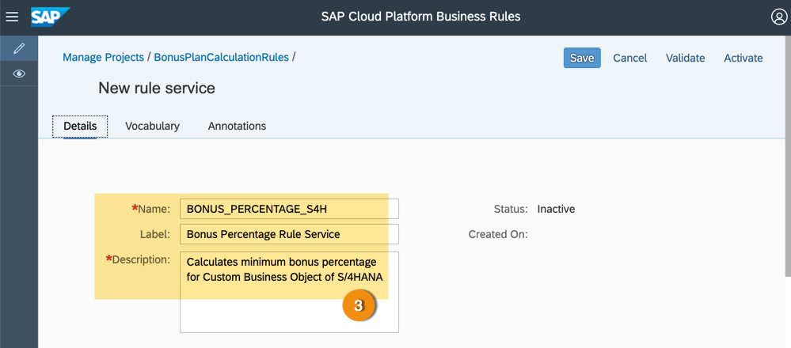

4. Switch to **Vocabulary** tab.

5. Click **+** and add the following rows one after the other.

6. Select the following values from the drop down:

    | Name            | Usage   |
    | --------------  |:-------:|
    | `BONUS_PLAN_TT` | Input   |
    | `PERCENTAGE`    | Result  |

    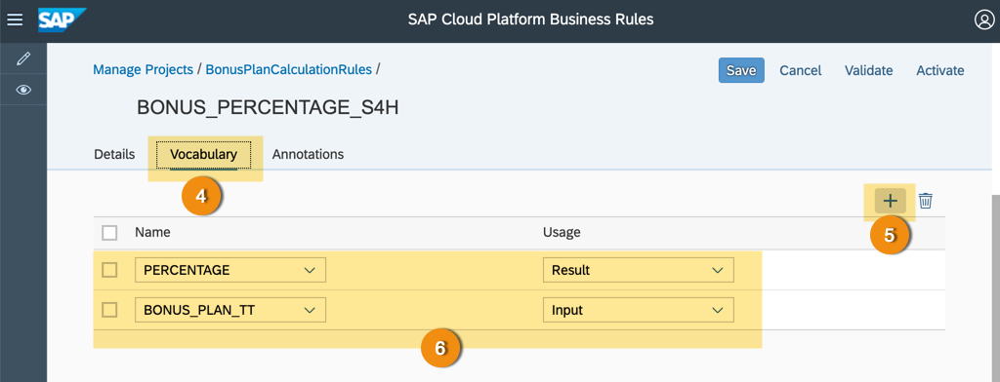

7. Switch to **Annotations** tab.

8. Click **+** to add annotation to rule service.

9. From the options, choose **ABAP on HANA**.

    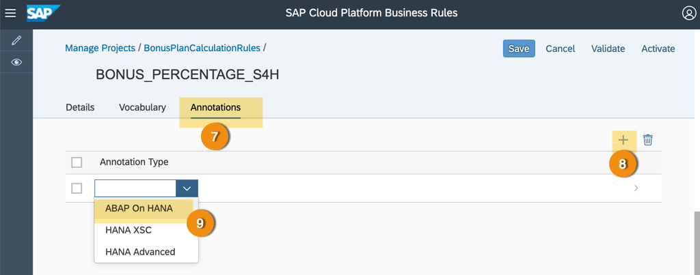

10.	Click **Activate** button to save and activate the changes.

    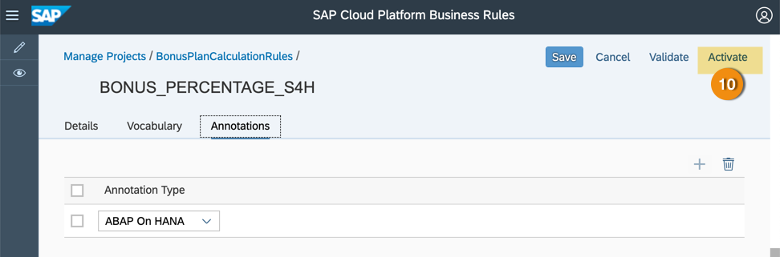

    > If activation is successful, then you will see the status of the rule service as **Active**.

      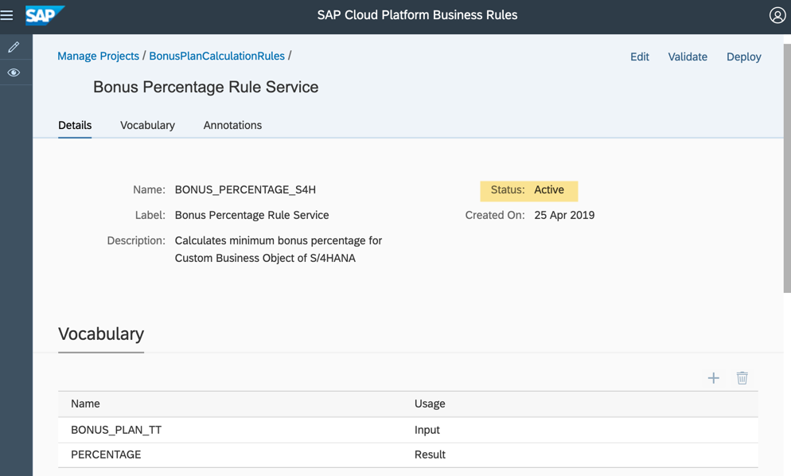

11. Click the rules project breadcrumb link to return to the project page.

    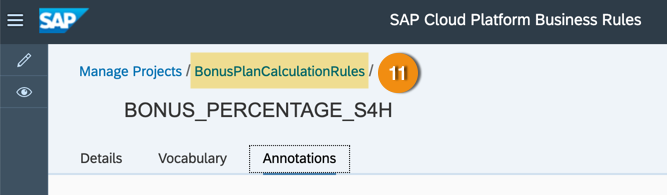

[DONE]
[ACCORDION-END]

[ACCORDION-BEGIN [Step 2: ](Create ruleset)]

1.  Switch to **`Rulesets`** tab.

2.	Click **+** to add `ruleset`.

    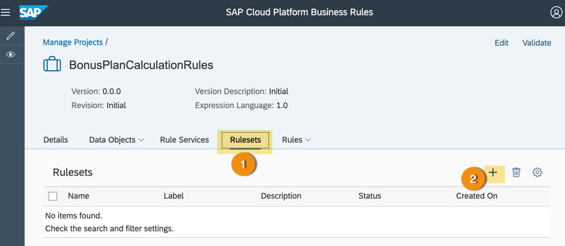

3.  In the **Details** tab, enter the following values for the `ruleset` properties:

    - **Name**: `BONUS_PERCENTAGE_COLLECTION` or any name of your choice.

    - **Label**: `Bonus Percentage Collection Ruleset` or any label of your choice.

    - **Description**: `Executes all business rules to compute the Maximum Bonus Percentage allowed based on Custom Business Object of S/4HANA` or any description of your choice.

4.  In **Rule Service** field, choose a rule service from already defined rule services.

      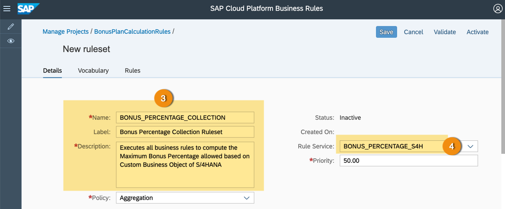

5.  Switch to **Rules** tab.

6.  Click **+** to add the rule to `ruleset`.

7.  Select the rule from the list.

    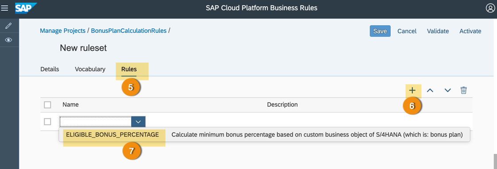

8.  Once you complete editing, click **Activate** to save and activate `ruleset`.

    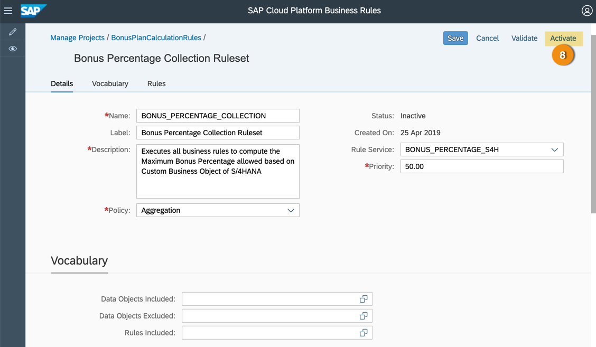

    > If activation is successful, then you will see the status of the rule service as `Active`.

      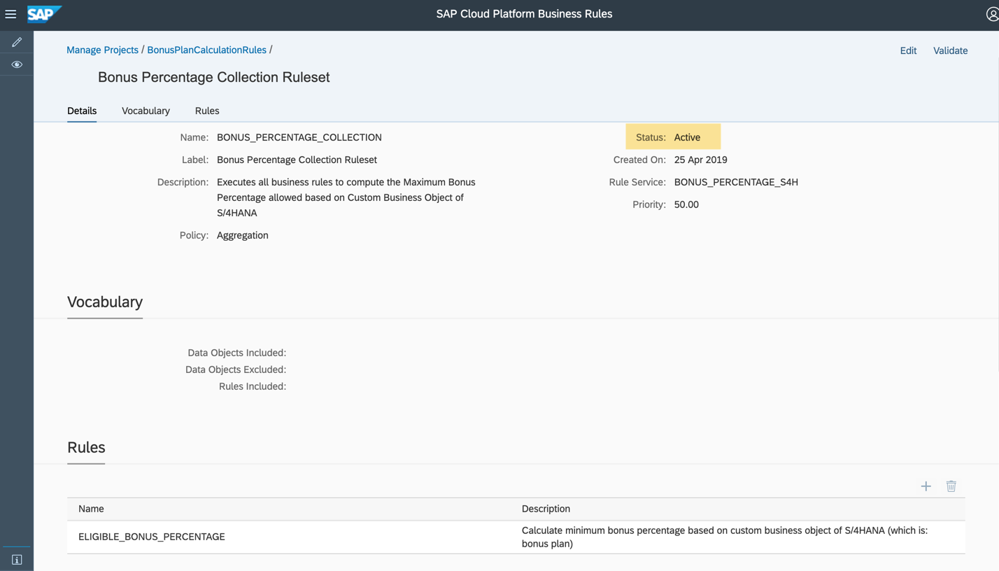

[DONE]
[ACCORDION-END]

[ACCORDION-BEGIN [Step 3: ](Test yourself)]

[VALIDATE_1]
[ACCORDION-END]

[ACCORDION-BEGIN [Step 4: ](Test yourself)]

[VALIDATE_2]
[ACCORDION-END]

[ACCORDION-BEGIN [Step 5: ](Test yourself)]

[VALIDATE_3]
[ACCORDION-END]
---
