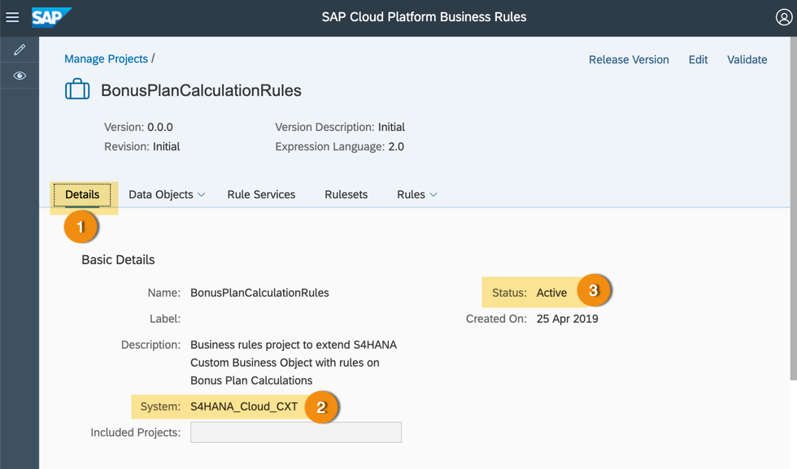
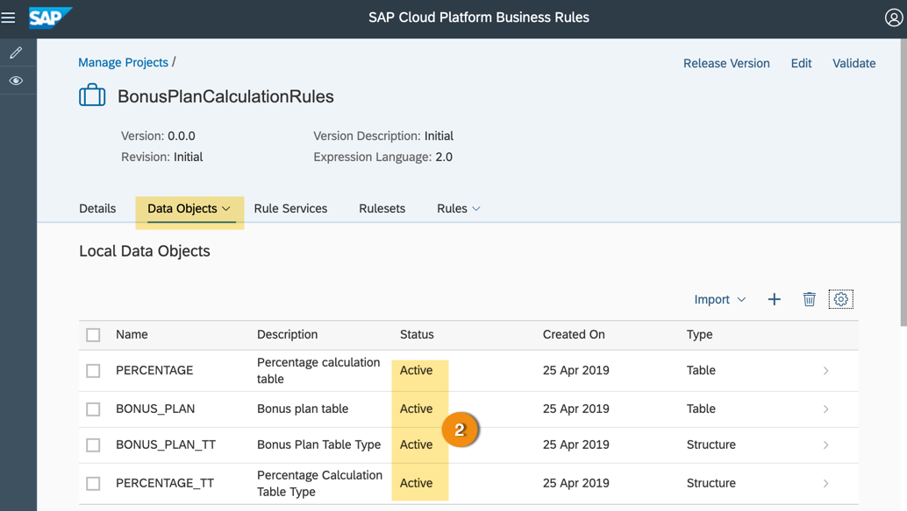
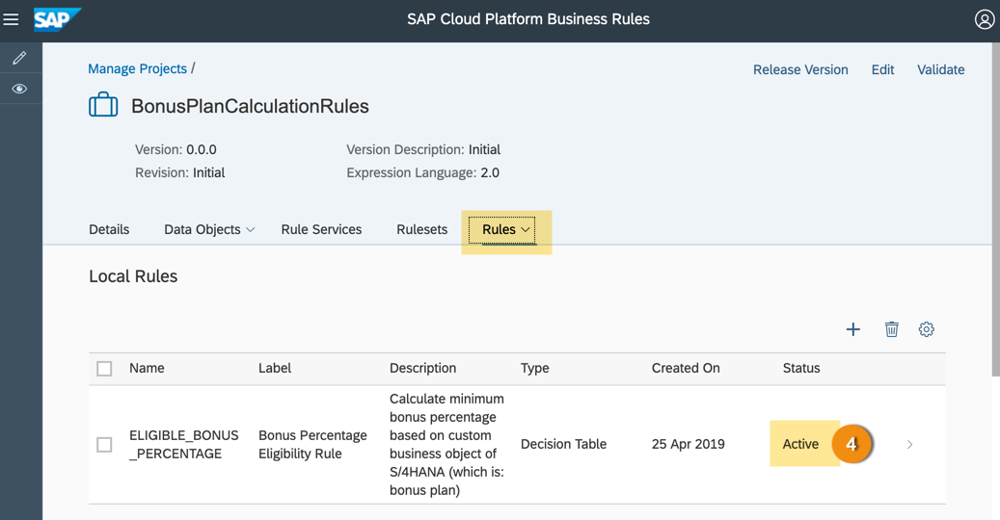
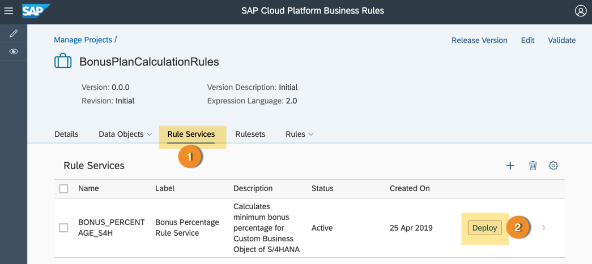
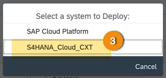

## Prerequisites
  - You must have S/4HANA Cloud account with 1811 or higher release.
  - You must have defined the destination in SAP Cloud Platform account.
  - You must have configured the system in SAP Cloud Platform Business Rules.
  - User must have **`RuleSuperUser`** role assigned to SAP Cloud Platform Business Rules Runtime.

## Details
### You will learn
  - How to manage and deploy business rules in S/4HANA

**SAP Cloud Platform Business Rules** encapsulates high change decision logic from application logic. It enables centralised decision management across the Intelligent Enterprise Suite with central authoring, repository, governance and life cycle management capabilities. The idea is to centrally author and manage business rules and directly deploy them to different systems like SAP S/4HANA, SAP HANA etc.

In this tutorial, you will learn how to deploy the business rules directly in S/4HANA cloud system.

---
For more information, you can read the help documentation:

[Deploy Rules](https://help.sap.com/viewer/9d7cfeaba766433eaea8a29fdb8a688c/Cloud/en-US/0d449b981aad4e19b978d59acaf3f3af.html)

[ACCORDION-BEGIN [Step 1: ](Check system property)]

1. Go to the **Details** tab of the business rules project.

2. Check if you have assigned the right `S/4HANA Cloud` system.

3. Check if the project is **Active**.

    

[DONE]
[ACCORDION-END]

[ACCORDION-BEGIN [Step 2: ](Check active status of rule models)]

1. All business rule models i.e. rule services, rules, rule sets and data objects, must be in `Active` state.

2. Click the **Data Objects** tab, and see if all the data objects are active. If not, then activate all the data objects.

    

3. Click the **Rule Services** tab, and see if all the rule services are active. If not, then activate all the rule services.

    

4. Click the **Rules** tab, and see if all the rules are active. If not, then activate all the rules.

    

5. Click the **`Rulesets`** tab, and see if all the `rulesets` are active. If not, then activate all the `rulesets`.

        

[DONE]
[ACCORDION-END]

[ACCORDION-BEGIN [Step 2: ](Deploy rule service)]

1. Once all the rule models are activated, switch to **Rule Services** tab.

2. Click **Deploy** of the rule service.

    > You will find the Deploy button for the rule service in the same row

    

3. In the **Deploy** dialog, click the system you want to deploy.

    > In this case, you will deploy to S/4HANA Cloud system that was configured before.

    

    > You will see a successful deployment message, one the deployment is triggered in the backend S/4HANA Cloud system.

    

[DONE]
[ACCORDION-END]

[ACCORDION-BEGIN [Step 3: ](Test yourself)]

[VALIDATE_1]
[ACCORDION-END]

[ACCORDION-BEGIN [Step 4: ](Test yourself)]

[VALIDATE_2]
[ACCORDION-END]
---
