## Details
### You will learn
  - How to import template business rules project
  - How to import CDS views from backend S/4HANA cloud system

**Data object** is the reusable entity of Enterprise Rules Model which is the vocabulary on which business rules are modelled.

In this tutorial, a template business rules project is made available in GitHub. This project has the result data object already created. You will import the CDS view based on custom business object **Bonus Plan** from the S/4HANA cloud system.

---
For more information, you can read the help documentation:

[Import Project](https://help.sap.com/viewer/9d7cfeaba766433eaea8a29fdb8a688c/Cloud/en-US/aab7501ef811440c8b419cff02dea43a.html)

[Data Objects](https://help.sap.com/viewer/9d7cfeaba766433eaea8a29fdb8a688c/Cloud/en-US/579af46aa0aa42cea90207323959d3a7.html)

[ACCORDION-BEGIN [Step 1: ](Download template)]

1. **Download** the template business rules project zip from the [GitHub](https://github.com/SAP/cloud-businessrules-templates/blob/master/rulesprojects/BonusPlanCalculationRulesTemplate.zip).

    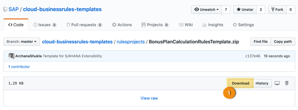

[DONE]
[ACCORDION-END]

[ACCORDION-BEGIN [Step 2: ](Import project)]

1.  In **Manage Rules Application**, click the **Import** icon and select **Upload Project from File System option**.

    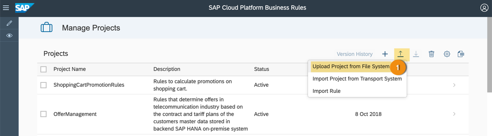

2.  **Browse** to the file location to select the downloaded business rules project zip.

3.  Click **Import** to import the project in business rules application.

    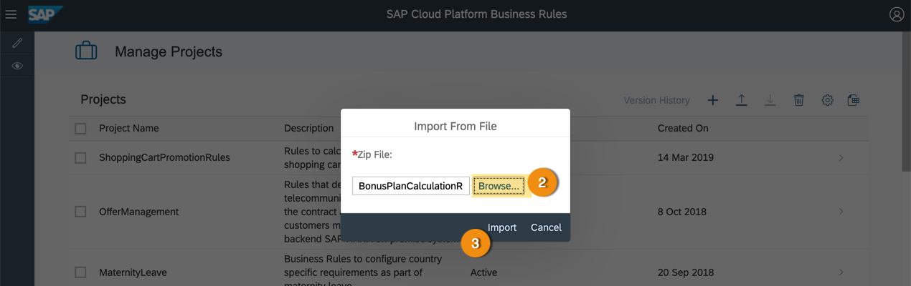

4.  Business rules project template will be imported and seen in Manage Rules Application.

    > The project will be in `Inactive` status.

    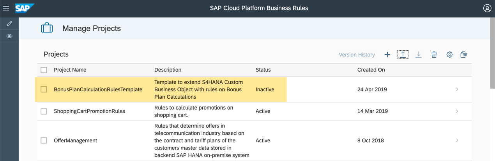

5.	Click the project to navigate into the details.

[DONE]
[ACCORDION-END]

[ACCORDION-BEGIN [Step 3: ](Modify project properties)]

1.	Click **Edit** to make changes to the default system.

    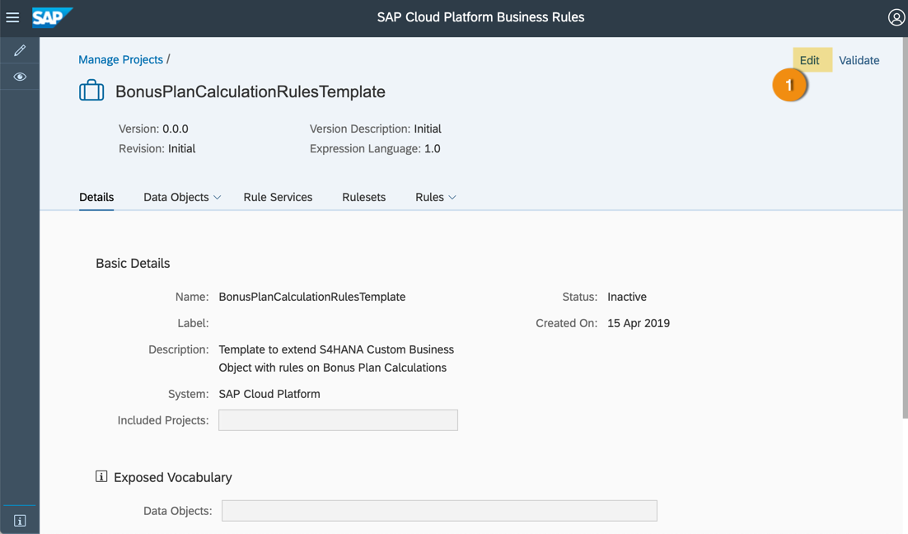

2.	Modify the project **Name** and **Description**.

3.  Click the drop down of **System** property.

4.	Select the system added in **Configure System**.

5.	**Save** the changes.

    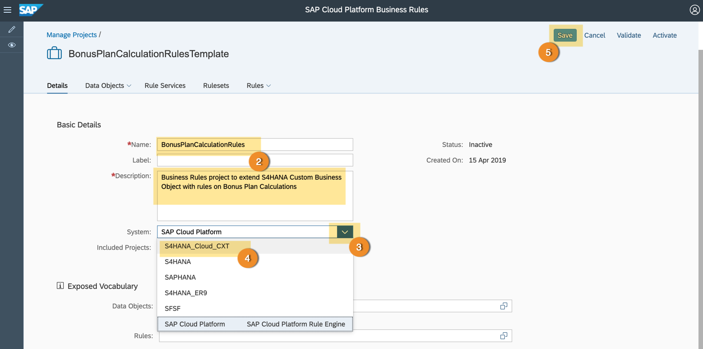

[DONE]
[ACCORDION-END]

[ACCORDION-BEGIN [Step 3: ](Activate data objects)]

1.	Switch to **Data Objects** tab for **Local Data Objects**.

    > You can see the result data object already created.

2.	Click the `PERCENTAGE_TT` data object.

    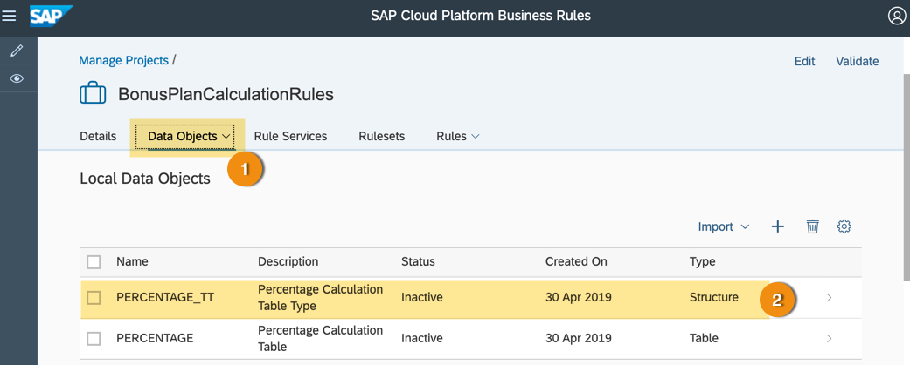

3.	See the **Type** field and the **Attributes**.

4.  Click **Edit** and then **Activate** the data object.

    >After you click edit button, the options to validate and activate will appear in top-right corner of the screen.

    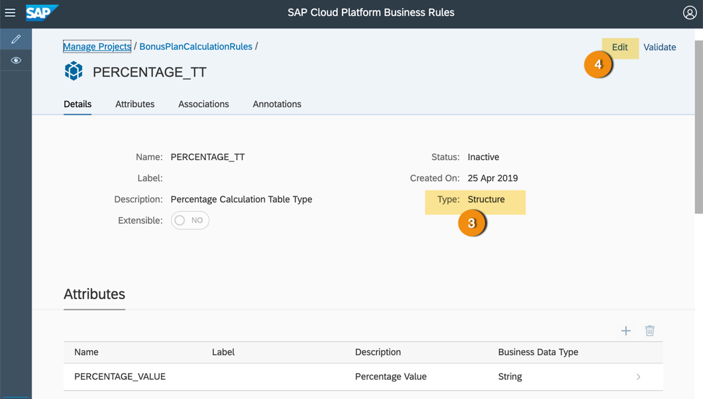

5.  Repeat the steps above to activate `PERCENTAGE` data object as well.

    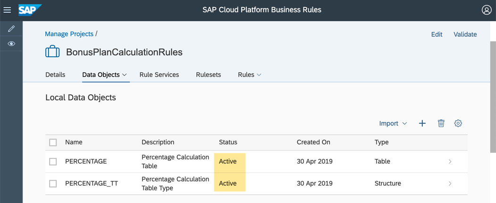

[DONE]
[ACCORDION-END]

[ACCORDION-BEGIN [Step 3: ](Import CDS view)]

1. Click **Import > Managed System** to import the CDS views from S/4HANA cloud system.

    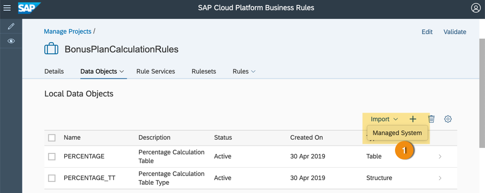

2. In the **Import Dialog**, select the S/4HANA System from the drop-down.

3. Enter the **Name** of the CDS view corresponding to Custom Data Object based on the Bonus Plan.

4. Click **Go**.
    > This will search all the CDS view with the given name in the S/4HANA cloud system.

5.  From the options, select your CDS view and click **Import**.

    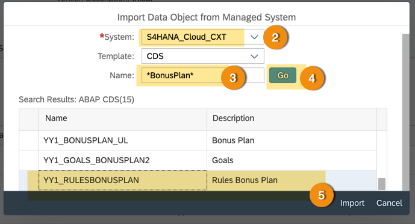

6.  You will see the data objects imported.

    > You can change the name, label and description of the data object, if needed.

    > Go to the **Annotation** of the data object and its attributes to see how it is mapped to the backend S/4HANA system view.

    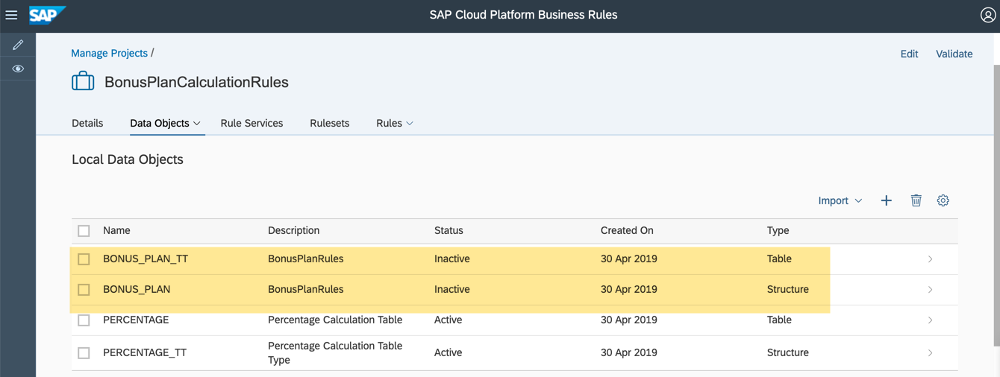

    > Each CDS view is imported into 2 data objects. One is of type structure (name ends with `TT`) and other is of type table. Table data object refers to the structure data object.

7. Click the data object with name ending with `TT` (structure type).

8. In the data object page, click **Edit** (on top-right corner) and then click **Activate** to save and activate data object.

    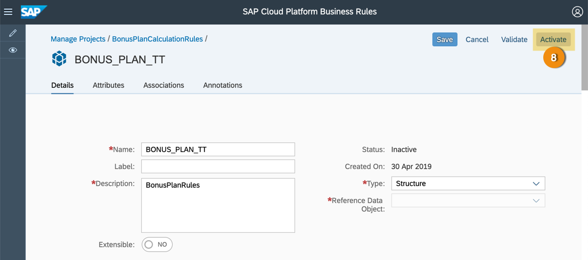

8. Repeat the same to **Activate** all the data objects.

    

[DONE]
[ACCORDION-END]

[ACCORDION-BEGIN [Step 4: ](Test yourself)]

[VALIDATE_1]

[ACCORDION-END]

[ACCORDION-BEGIN [Step 5: ](Test yourself)]

[VALIDATE_2]
[ACCORDION-END]

---
