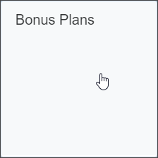
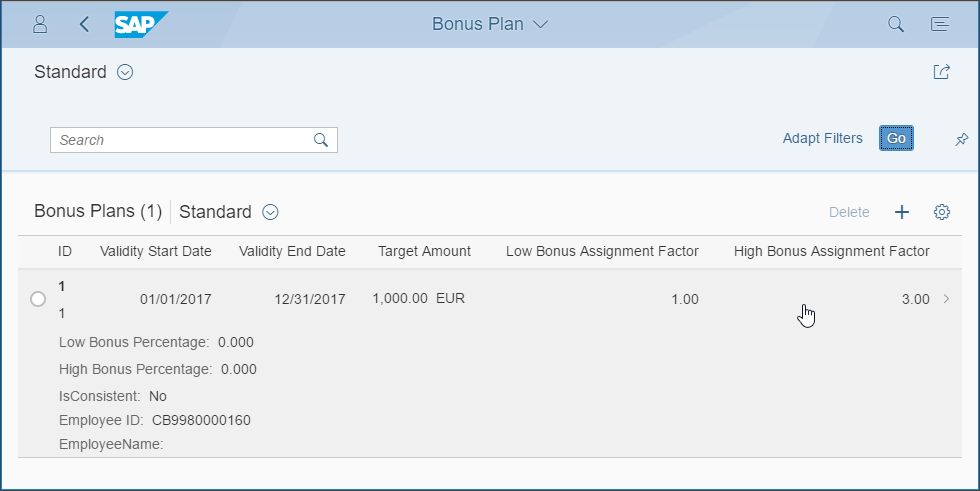
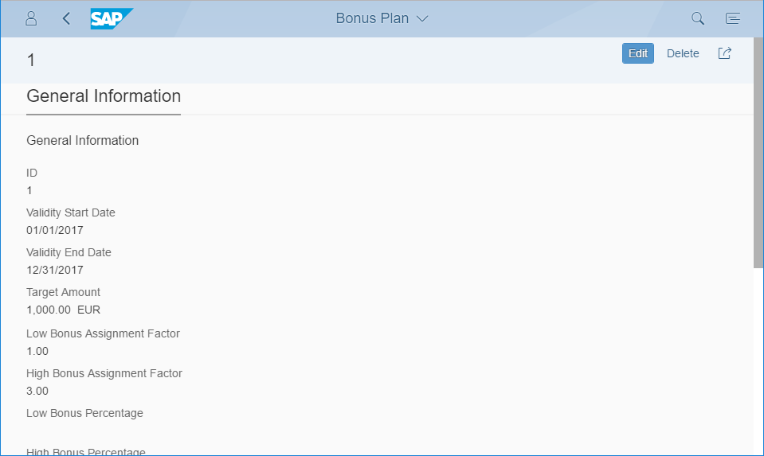
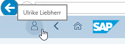
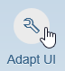
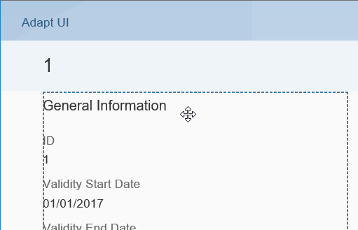
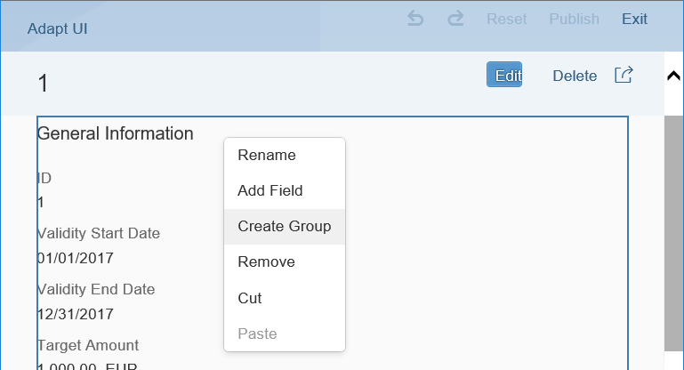
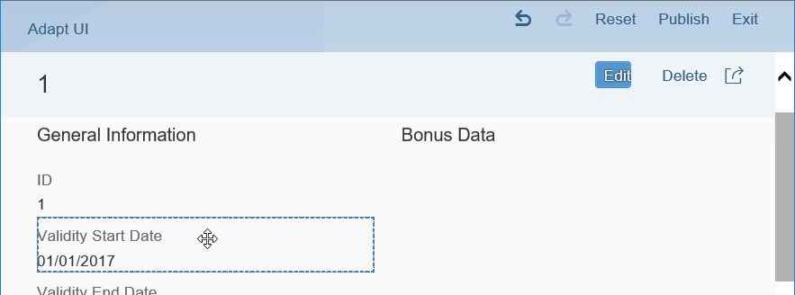
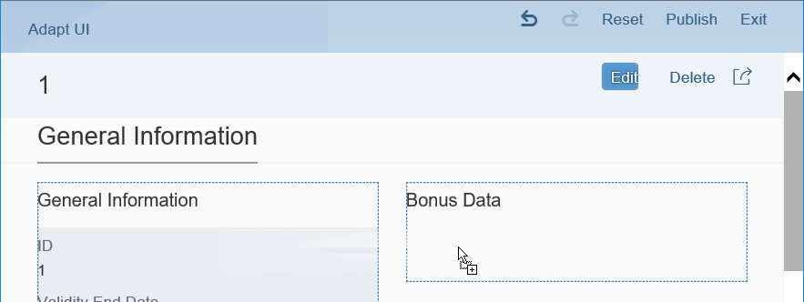

## Prerequisites  
- **Authorizations:** Your user needs a business role with business catalog **Extensibility** (ID: `SAP_CORE_BC_EXT`) in your **S/4HANA Cloud** system

## Details
### You will learn  

In the preceding tutorials you created a custom business object with a simple data structure and its persistence. Afterwards you generated an UI for this business object and exposed it as a Fiori Launchpad application.

As the generated User Interfaces only lists all fields of a business object node, adapting the UI might be necessary to improve usability of it.

>Before done **UI Generation** and here shown **UI Adaptation** are so called **In-App Extensibility** features done completely inside a S/4HANA system. They are key user functionality with limited possibilities. UI Adaptation has effect on all users in the system.
>
>Alternatively to UI Generation and Adaptation the more powerful **Side-By-Side Extensibility** via **SAP Cloud Platform** could be done to develop an UI with all SAPUI5 options (see tutorial group [Create Custom UI for S/4HANA Cloud](https://developers.sap.com/group.abap-custom-ui-with-webide.html)).

**Our Example**

A several tutorials spanning example will show extensibility along custom Bonus Management applications.

In the first parts a Manager wants to define business objects "Bonus Plan" for employees. A Bonus Plan is there to save employee specific rules for bonus entitlement.

### Additional Information
- **SAP S/4HANA Cloud Release** (tutorial's last update): 1808

[ACCORDION-BEGIN [Step 1: ](Open the UI to be adapted)]

Open the **Bonus Plans** application in Fiori Launchpad group **Extensibility**.

Press **Go** to get the list of all Bonus Plans. **Open** a bonus plan's detail view.

This is the screen that will be adapted.

[DONE]
[ACCORDION-END]

[ACCORDION-BEGIN [Step 2:](Switch to Adaptation mode)]

**Open User Settings** via the corresponding application's menu action

Open the adaptation mode via **Adapt UI**.

[DONE]
[ACCORDION-END]

[ACCORDION-BEGIN [Step 3:](Create an UI group)]

Editable UI elements can be recognized by getting a dashed border and the movement cursor when hovering over them.

By right clicking onto them you get options to adapt the UI. As these options are partly type dependent you might need to find the right element first to get the option you need.

**Hover** over the **General Information** area until it gets the dashed border and open the context menu via **Right Click**.

**Create Group** and name it "Bonus Data".

[DONE]
[ACCORDION-END]

[ACCORDION-BEGIN [Step 4:](Move UI elements)]

Editable fields can simply be dragged and dropped as well. **Drag** the Validity Start Date field.

**Drop** it to the Bonus Data group.

Repeat **Drag & Drop** into Bonus Data group for the fields:

- Validity End Date
- Target Amount
- Low Bonus Assignment Factor
- High Bonus Assignment Factor
- Low Bonus Percentage
- High Bonus Percentage
- Employee ID
- Employee Name

[DONE]
[ACCORDION-END]

[ACCORDION-BEGIN [Step 5:](Apply UI changes)]

**Publish** the UI adaptations.

Finally you only need to **Exit** adaptation mode to work with the new layout.

[DONE]
[ACCORDION-END]

[ACCORDION-BEGIN [Step 6: ](Test yourself)]

[VALIDATE_1]
[ACCORDION-END]
