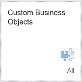
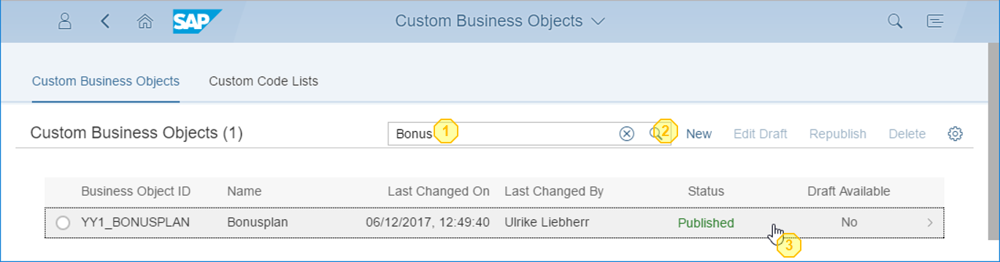
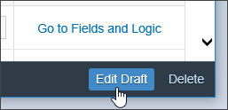
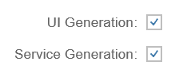
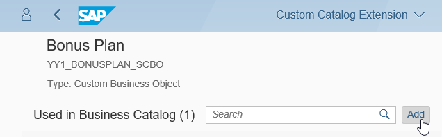
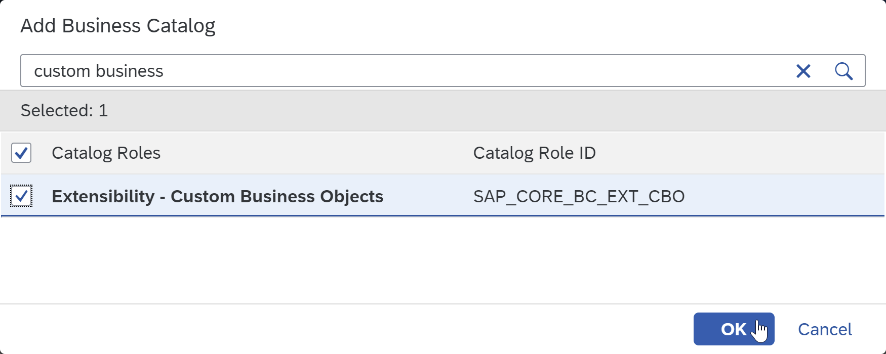
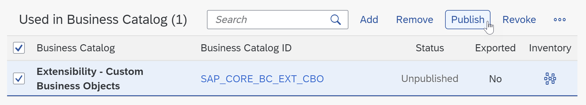
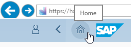
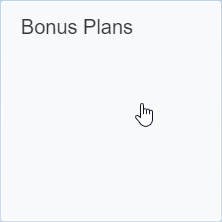
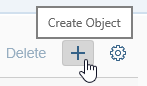

## Prerequisites  
 - **Proficiency:** Beginner
 - **Tutorials:** [Creating a Custom Business Object ](https://www.sap.com/developer/tutorials/abap-extensibility-cbo-create.html)
 - **Authorizations:** Your user needs a business role with business catalog **Extensibility** (ID: `SAP_CORE_BC_EXT`)

## Next Steps
  - [Implementing logic for a Custom Business Object](https://www.sap.com/developer/tutorials/abap-extensibility-cbo-logic.html)

## Details

### You will learn  

In the preceding tutorial you created a custom business object with a simple data structure and its persistence.
To be able to work with a business object you need a user interface. In this tutorial you will generate an User Interface.
With the use of Custom Catalog Extensions that UI is exposed as an application.
At the end you will have a running application that you can create, update and delete custom business object entities with already.

### Example

A several tutorials spanning example will show extensibility along custom Bonus Management applications.

In the first parts a Manager wants to define business objects "Bonus Plan" for employees. A Bonus Plan is there to save employee specific rules for bonus entitlement.

### Time to Complete
**15 Min**

---
[ACCORDION-BEGIN [Step 1: ](Start Editing Custom Business Object Bonus Plan)]

 **Start** the Custom Business Object's application by clicking its tile

**Search** for Custom Business Object "Bonus Plan" (1+2) and **Open** its details by clicking its list item in the search result list (3).

To be able to do changes to the lastly published version of the business object you need to start edit mode by executing the **Edit Draft** action.

[ACCORDION-END]

[ACCORDION-BEGIN [Step 2: ](Generate UI)]

**Check** the two boxes for UI Generation and Service Generation.

**Publish** the business object to trigger the generation of UI (Master and Detail) and OData Service.

[ACCORDION-END]

[ACCORDION-BEGIN [Step 3: ](Expose UI as Application)]

Now you make the UI available as SAP Fiori Launchpad application by assigning it to a Business Catalog which corresponds to a group in Launchpad.
From the Business Object's overview go to Custom Catalog Extension application by clicking the **Maintain Catalogs** action.

A new window will open.

Start adding a catalog with the **Add** action.

In the opening value help narrow down the result list by searching for `Extensibility`, select the Catalog with role ID `SAP_CORE_BC_EXT` and press **OK**.

**Select** the just added Catalog and **Publish** it.

This step takes some minutes, the screen refreshes automatically and once the status switches from unpublished to published, you can close this application's window and proceed.

[ACCORDION-END]

[ACCORDION-BEGIN [Step 4: ](Open Bonus Plan application)]

Back in the Custom Business Object application's window, go to the SAP Fiori Launchpad via **Home** action.

**Refresh** the Browser window with key **`F5`** for that the catalog extension becomes visible.
Now there is the Bonus Plan application's tile in the **Extensibility** group.

**Start** the application by clicking its tile.

[ACCORDION-END]

[ACCORDION-BEGIN [Step 5: ](Test Bonus Plan application)]

**Open** the Bonus Plan application.

**Create** an object.

**Enter** following data

| Field | Value |
| :------------- | :--------------------------- |
| ID | 1 |
| Validity Start Date | 01/01/2017 |
| Validity End Date | 31/12/2017 |
| Target Amount | 1000.00 EUR |
| Low Bonus Assignment Factor | 1 |
| High Bonus Assignment Factor | 3 |
| Employee ID | `<any>` |

Employee ID <any> shall be the one of a sales person that created sales orders with a Net Amount of more than 3000.00 EUR in 2017 and that are completed.

**Save** the Bonus Plan. The UI will automatically return from Bonus Plan Detail to Master, where you can see one entry in the list of bonus plans now.

[ACCORDION-END]
---
