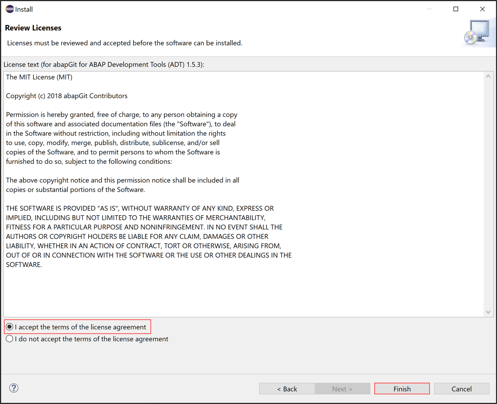

# Install ABAP Development Tools (ADT) and abapGit Plugin
<!-- description --> Install ABAP Development Tools (ADT) and abapGit plugin for ADT.

## You will learn
- How to install ADT
- How to install `abapGit` plugin

## Prerequisites
- Operating System:
      - Windows 10, or
      - Apple Mac OS X 10.14 or higher
- Microsoft VC Runtime:
      - For Windows OS: [Microsoft Visual C++ 2013 (x64)](https://support.microsoft.com/en-us/topic/the-latest-supported-visual-c-downloads-2647da03-1eea-4433-9aff-95f26a218cc0) for communication with the back-end system is required.
- Java Runtime:
      - ADT is validated and tested against OpenJDK and SapMachine JVMs (OpenJDK / [SapMachine](https://sap.github.io/SapMachine/)).
      - Recent Eclipse packages already include an  AdoptOpenJDK. Any other JRE found on the system is not used. If this is not desired, see note [3035242](https://launchpad.support.sap.com/#/notes/3035242) on how to remove the bundled JRE and use a custom one.

---

### Install ABAP Development Tools (ADT)

  1. Open the [Eclipse download page](https://www.eclipse.org/downloads/packages/) to download the corresponding Eclipse version.

      

  2. Click **Download**.

      

  3. Select **Show in folder** in your browser.

      

  4. Extract the **Eclipse zip** file with right-click.

      

  5. Open the **Eclipse-Java** folder.

      

  6. Open the **Eclipse** folder.

      

  7. Double-click **`eclipse.exe`** to run the application.

      

  8. Launch your workspace.

      

  9. Close both pages.

      

      

10. Select **Help** > **Install New Software**.

      

11. Enter the latest ADT URL **`https://tools.hana.ondemand.com/latest`** in the **Work with** section, press enter,  select **ABAP Development Tools** and click **Next >**.

      

12. Click **Next >**.

      

13. Accept the **license agreement** and click **Finish**.

      

14. Now ADT will be installed. Select **Install anyway**.

      

15. Click **Select All** and **Accept selected**.

      

16. Click **Restart Now**.

      

17. Now ADT is installed. Switch to the ABAP perspective. Therefore select **Window** > **Perspective** > **Other Perspective** > **Other**.

    

    Then select **ABAP** and click **Open**.

      

18. Check your result.

      

### Install abapGit plugin

>**HINT:** Step 2 is only mandatory for cloud users.

To transfer your ABAP development objects from on-premise SAP systems to an SAP BTP, ABAP Environment instance, you can use the `abapGit` plugin.

  1.  Open **Eclipse** and select **Help** > **Install New Software**.

      .

  2. Enter the `abapGit` URL **`https://eclipse.abapgit.org/updatesite/`** in the **Work with** section, press enter,  select **`abapGit` for ABAP Development Tools (ADT)** and click **Next >**.

      

  3. Click **Next >**.

      

  4. Accept the **license agreement** and click **Finish**.

      

  5. Now ADT will be installed. Select **Install anyway**.

      

  6. Click **Restart Now**.

      

  7. Now `abapGit` for ADT is installed.

      

>**HINT:** Following this tutorial you will be able to update the latest version of Eclipse and ADT when new releases are available.

### Test yourself

