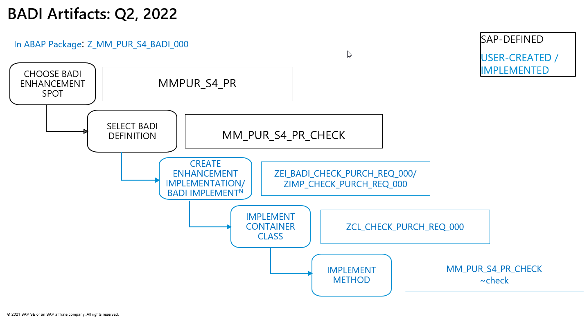
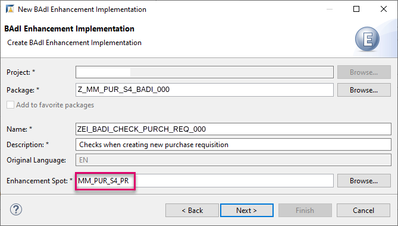
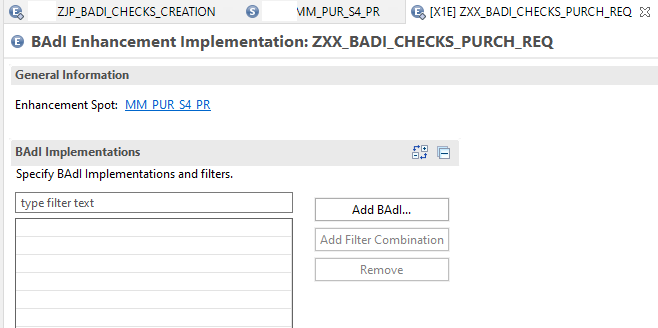
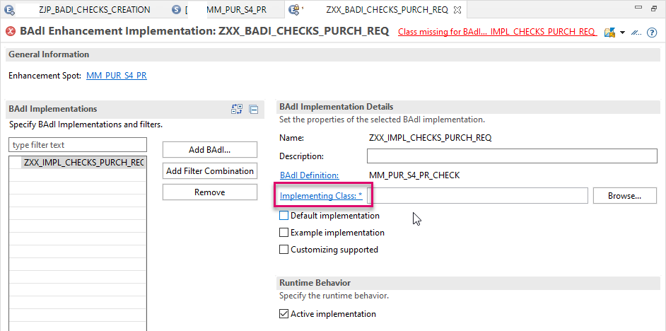
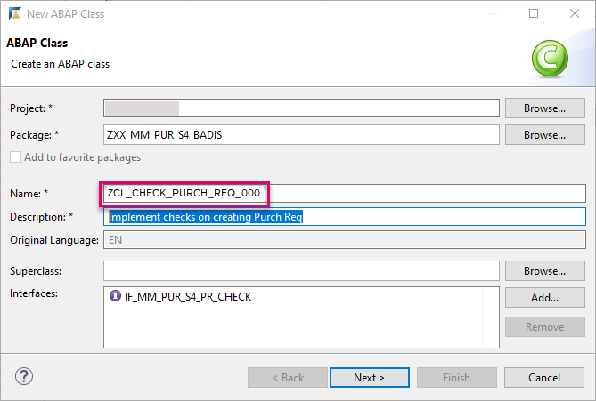

# Implement a Business Add-in (`BAdI`) To Check a Purchase Requisition
<!-- description --> Define and implement a developer extension (`BAdI`), which performs checks during creation of a purchase requisition item.

## Prerequisites 
- You have a license for SAP S/4HANA Cloud and have a developer user in this system
- You have installed [SAP ABAP Development Tools (ADT), latest version](https://tools.hana.ondemand.com/#abap), and have created an ABAP Cloud project for your SAP S/4HANA Cloud System in it
- You are familiar with the concept of extensions to the SAP standard and with `BAdIs` in particular. If not, see the **More Information** section at the end of this tutorial
- To test the `BAdI`: In SAP Fiori launchpad, you have the authorization for the app **Process Purchase Requisitions - Professional**, i.e. **`SAP_BR_PURCHASER`**


## You will learn
- How to log on to SAP S/4HANA Cloud ABAP Environment
- How to create an ABAP package
- How to find relevant existing `BAdI` enhancement spots for your line of business, in this case **Materials-Management-Purchasing**
- How to implement a `BAdI` that checks for the field quantity and delivery date during creation of purchase requisition item


## Intro
>The administrator receives an welcome e-mail after provisioning. This e-mail includes the system URL. By removing `/ui` you can log into the SAP S/4HANA Cloud ABAP Environment system. Further information can be found [Developer Extensibility: Connect to the ABAP System](https://help.sap.com/docs/SAP_S4HANA_CLOUD/6aa39f1ac05441e5a23f484f31e477e7/4b962c243a3342189f8af460cc444883.html?locale=en-US).

A **Business Add-In (`BAdI`)** an object-oriented enhancement option, a hook for an object plug-in. It enables you to implement enhancements to standard SAP applications without modifying the original code.

In these tutorials, SAP has already defined the `BAdI` enhancement spot, **`MM_PUR_S4_PR`** for the Fiori App **Manage Purchase Requisitions – Professional**, and the `BAdI` definition, **`MM_PUR_S4_PR_CHECK`**.

You then implement the `BAdI` in the SAP Fiori app as follows:
    1. For the `BAdI` definition **`MM_PUR_S4_PR_CHECK`**, you create a container, known as an **enhancement implementation** - here **`ZEI_BADI_CHECK_PURCH_REQ_000`**.
    2. You can then create one or more **`BAdI implementations`** - here **`ZIMP_CHECK_PURCH_REQ_000`**.
    3. For each **`BAdI implementation`** you create an **ABAP Class** - here **`ZCL_CHECK_PURCH_REQ_000`**.
    4. Within this class, you then create a **method** of the `BAdI`- here **`MM_PUR_S4_PR_CHECK~check`**.

<!-- border -->


> The advantage of this approach is that you can group several related **BAdI implementations** in one **enhancement implementation**.

<!-- border -->


## At runtime:
1. The user creates a purchase requisition.
2. The enhancement checks:
    - the quantity of items ordered is **10 or fewer**
    - the date is **180 days or fewer in advance**
3. If not, the application returns an error.

The application will look roughly like this:

<!-- border -->


<!-- border -->


Throughout this tutorial, objects name include a suffix, such as **`000`**. Always replace this with your group number or initials.

---


### Log on to SAP S/4HANA Cloud ABAP Environment

1. Open ADT, select **File** > **New** > **Other**.

    <!-- border -->
    

2. Search **ABAP Cloud Project**, select it and choose **Next >**.

    <!-- border -->
    

3. Select **SAP S/4HANA Cloud ABAP Environment**, enter the ABAP service instance URL and choose **Next**.

    <!-- border -->
    

4. To log on, choose **Open Logon Page in Browser**, then choose **Next**. (Alternatively, e.g. if you have an admin user and a developer user in the SAP BTP Cloud landscape, you may need to choose **Copy Logon URL...** .)

    <!-- border -->
    

    <!-- border -->
    

5. Check your ABAP service instance connection and choose **Finish**.

    <!-- border -->
    

Your project is available in the Project Explorer.

<!-- border -->


### Create package

First, create a package for your development objects.

1. Choose your project, then choose **New > ABAP Package** from the context menu.

    <!-- border -->
    

2. Enter the following.
    - **`Z_MM_PUR_S4_BADI_000`**
    - **First `BADI` for MM Purchasing**

3. Choose **Add to favorite packages**, then choose **Next**

    <!-- border -->
    

4. Choose **Create a new request**, enter a meaningful description, e.g. **Test `BADIs` MM-PURCHASING** then choose **Finish**.


### Choose enhancement spot

1. First make sure that the released APIs are displayed by application component: In your project, navigate to **Released Objects**.The tree should show the Released Objects sorted by Application Component.

    <!-- border -->
    

2. If not, choose **Configure Tree** from the context menu, then select **Application Component** from the left side ( **Available Tree Levels** ) and add it to the right side ( **Selected Tree Levels** ). Move it to the top. Then choose **Finish**.


    <!-- border -->
    
    
    <!-- border -->
    

3. In the tree, drill down to **MM-PUR-REQ > Enhancements > Enhancement Spots > `MM_PUR_S4_PR`** and open it by double-clicking.

    <!-- border -->
    

The `BAdI` enhancement spot appears in a new editor, showing you the available `BAdI` definitions (1).

To help you create your own enhancements, example classes are provided (2).

<!-- border -->
    


### Create enhancement implementation

Now that you have identified the correct enhancement spot, you need a container within this enhancement spot for your `BAdI` implementations. This is known as an enhancement implementation.

1. Select your package **`Z_MM_PUR_S4_BADI_000`** and choose **New > Other ABAP Object** from the context menu.

    <!-- border -->
    

2. Filter by `BAdI`, choose **`BAdI` Enhancement Implementation**, then choose **Next**.

3. Enter the following and choose **Next**.
    - Name: **`ZEI_BADI_CHECK_PURCH_REQ_000`**
    - Description: **Check date and quantity in Purchase Requisition**
    - Enhancement Spot: **`MM_PUR_S4_PR`**

    <!-- border -->
    

4. Choose the transport request, then choose **Finish**.

Your `BAdI` enhancement implementation appears in a new editor. It implements the enhancement spot **`MM_PUR_S4_PR`**.

<!-- border -->


> A complete searchable table of available `BAdIs` and the Fiori apps to which they pertain is available here:
SAP Help Portal: [Adaptation of App Behavior](https://help.sap.com/viewer/0e602d466b99490187fcbb30d1dc897c/2202.500/en-US/259a396e6bdb4d08b130049880a3920f.html)


### Add `BAdI` implementation

1. In the `BAdI` enhancement implementation, choose **Add `BAdI` implementation**.

2. Add the following, then choose **Next**:
    - `BAdI` Definition: **`MM_PUR_S4_PR_CHECK`** (Provided by SAP; add by clicking on **Browse**)
    - `BAdI` Implementation Name: **`ZIMP_CHECK_PURCH_REQ_000`**

    <!-- border -->
    

Ignore the error. You will fix this in the next step.


### Create implementing class

1. Choose **Implementing Class**.

    <!-- border -->
    

2. Add the following, then choose **Next**.
    - Name: **`ZCL_CHECK_PURCH_REQ_000`**
    - Description: **Implement checks on creating Purchase Requisition**
    - (Added automatically): Interfaces: **`IF_MM_PUR_S4_PR_CHECK`**

    <!-- border -->
    

3. Choose the transport request, then choose **Finish**.

    The class appears in a new editor with skeleton code.

    <!-- LATER border     -->
4. Format, save, and activate the class ( **`Shift+F1, Ctrl+S, Ctrl+F3`** ).

5. Go back to your `BAdI` implementation **`ZIMP_CHECK_PURCH_REQ_000`** and activate it too.

The error will disappear.


### Implement code

1. Add the following code to the method implementation **`if_mm_pur_s4_pr_check~check.`**.

    ```ABAP
    DATA ls_message TYPE mmpur_s_messages.
    **
    READ TABLE  purchaserequisitionitem_table  INTO DATA(ls_pur_req_itm) INDEX 1    .

    IF ls_pur_req_itm-orderedquantity > 10.
      ls_message-messageid = 'DUMMY'.
      ls_message-messagetype = 'E'.
      ls_message-messagenumber = '001'.
      ls_message-messagevariable1 = ' Quantity limit 10'.           "Place holder
      APPEND ls_message TO messages.

    ENDIF.

    IF ls_pur_req_itm-deliverydate - ( cl_abap_context_info=>get_system_date( ) ) > 180.
      ls_message-messageid = 'DUMMY'.
      ls_message-messagetype = 'E'.
      ls_message-messagenumber = '001'.
      ls_message-messagevariable1 = 'Delivery date limit 180 days '.           "Place holder
      APPEND ls_message TO messages.

    ENDIF.

    ```

2. Format, save, and activate ( **`Shift+F1, Ctrl+S, Ctrl+F3`** ) your code.

3. Check that yours is the implementation that will be called:

<!-- border -->


### Test `BAdI`

Now test that the checks are performed in the app.

1. In SAP Fiori launchpad, open the app **Manage Purchase Requisitions (Professional)**.

    <!-- border -->
    

2. Display the existing purchase requisitions by choosing **Go**, then choose **Create**.

    <!-- border -->
    

3. In the next screen, choose **Create** again, then choose **Material**.

    <!-- border -->
    

4. The Details screen appears. From the **Material** field, choose **Value Help**.

5. Then choose the material **RM122**, **Plant 1010**.

    <!-- border -->
    

6. The system fills some fields with default values. Now enter a wrong quantity, e.g. **20**, and date, e.g. **09.11.2021**.

    <!-- border -->
    

7. The system shows you 2 errors. To display the errors, select the red box at the bottom left.

    <!-- border -->
    

8. Enter correct values, choose **Apply**, then choose **Save**.

Your new order appears in the Overview List.
.

<!-- border -->


### Test yourself


---

### More information
- Start here: SAP blog post: [How to Extend SAP Standard Using ADT](https://blogs.sap.com/2020/08/05/how-to-extend-sap-standard-using-adt/)
- SAP Help Portal: ABAP Development User Guide: [Working with Business Add-Ins (`BAdIs`)](https://help.sap.com/viewer/5371047f1273405bb46725a417f95433/Cloud/en-US/04a1d9415efd4e4fbc58534c99c3a0d3.html)
- Concepts: SAP Help Portal: Enhancement Technologies: [Business Add-Ins (`BAdIs`)](https://help.sap.com/docs/SAP_NETWEAVER_750/46a2cfc13d25463b8b9a3d2a3c3ba0d9/8ff2e540f8648431e10000000a1550b0.html?locale=en-US)
- SAP Help Portal: Sourcing and Procurement: [Adaptation of App Behavior (Overview and List of Available `BAdIs`)](https://help.sap.com/docs/SAP_S4HANA_CLOUD/0e602d466b99490187fcbb30d1dc897c/259a396e6bdb4d08b130049880a3920f.html?locale=en-US)


---
