# Create Purchase Order and Purchase Contract
<!-- description --> Create a purchase contract via EML, then create a new purchase order with reference to the newly created purchase contract.

## Prerequisites  
- You have a license for SAP S/4HANA Cloud and have a developer user in it
- You have installed the latest [Eclipse with ADT](abap-install-adt).

## You will learn  
- How to create a purchase contract
- How to create a purchase order
- How to run ABAP classes


## Intro
>**HINT**: The administrator receives an welcome e-mail after provisioning. This e-mail includes the system URL. By removing `/ui` you can log into the SAP S/4HANA Cloud ABAP Environment system. Further information can be found [here](https://help.sap.com/docs/SAP_S4HANA_CLOUD/6aa39f1ac05441e5a23f484f31e477e7/4b962c243a3342189f8af460cc444883.html?locale=en-US&state=DRAFT).


---

### Create ABAP package


  1.  Logon to Eclipse. Select **ZLOCAL** > **New** > **ABAP Package**.

      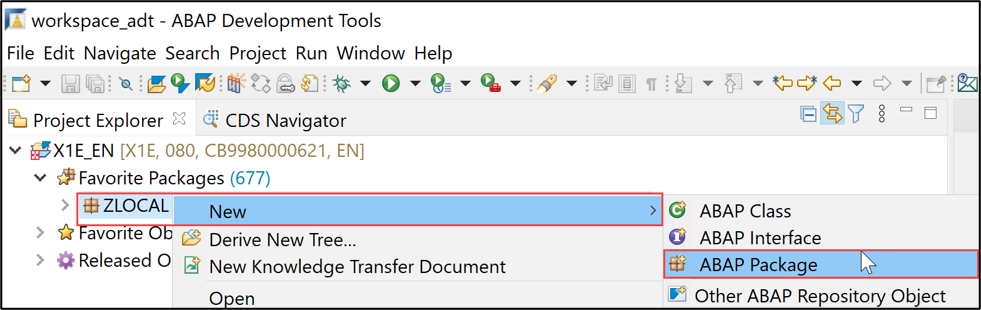

  2.  Create new ABAP package:
       - Name: `Z_PURCHASE_CONTRACT_XXX`
       - Description: Package for purchase contract
       - Check **Add to favorite packages**

      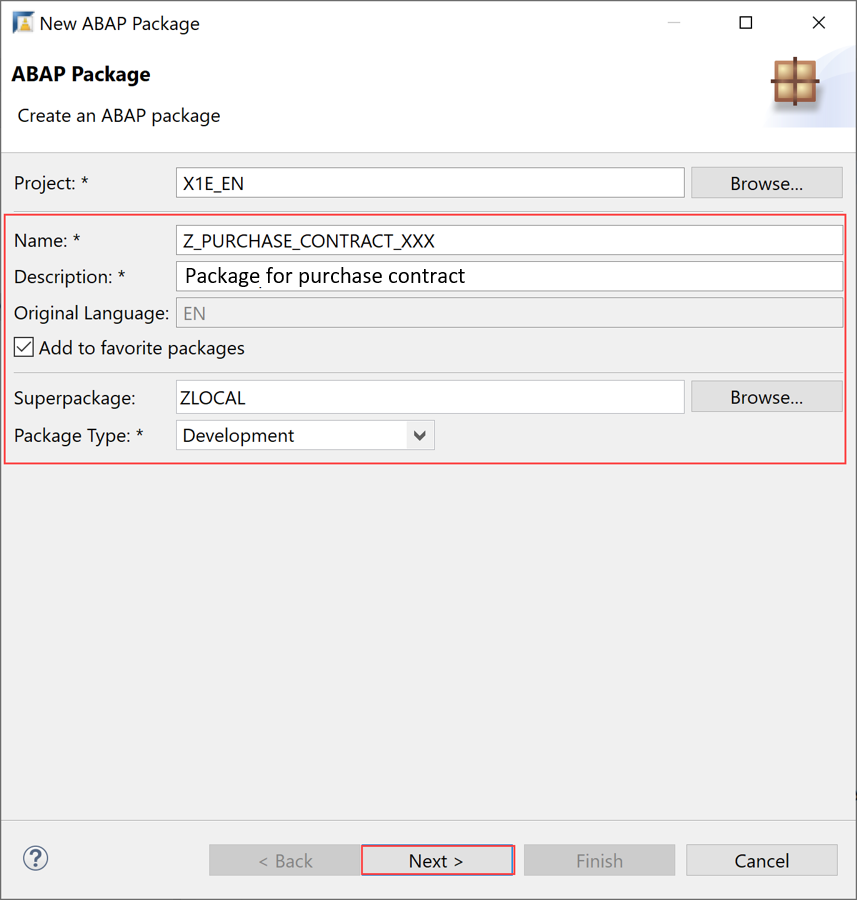

       Click **Next >**.

  3.  Create a new request:
      -  Request Description: TR12345

      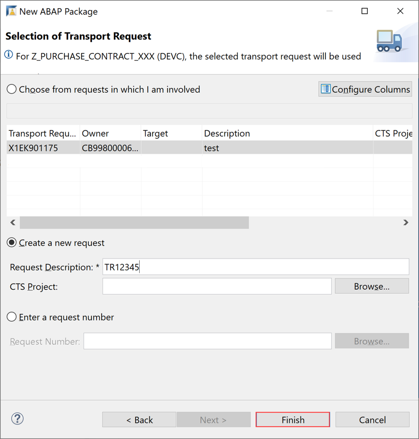

       Click **Finish**.


### Create purchase contract via EML


  1. Right-click your ABAP class `Z_CL_CREATE_PR_XXX` and select **New** > **ABAP Class**.

      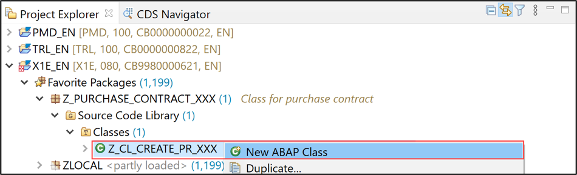

  2. Create new ABAP class:
     - Name: `Z_CL_CREATE_PC_XXX`
     - Description: Class for creating purchase contract

      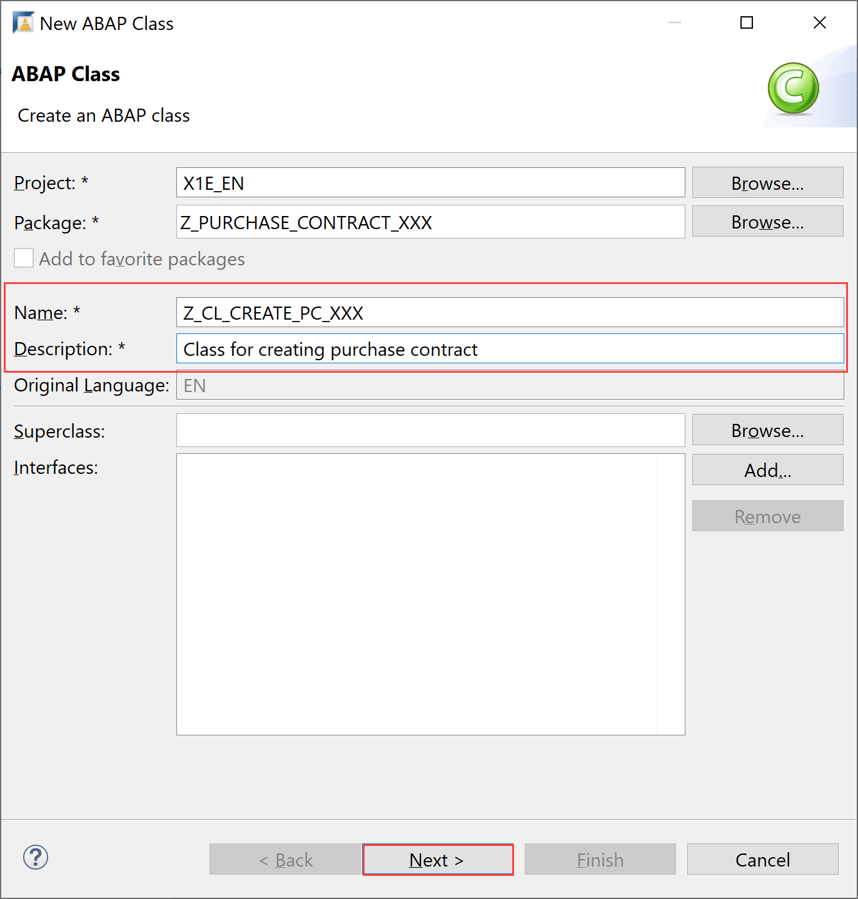

       Click **Next >**.

  3. Click **Finish**.

      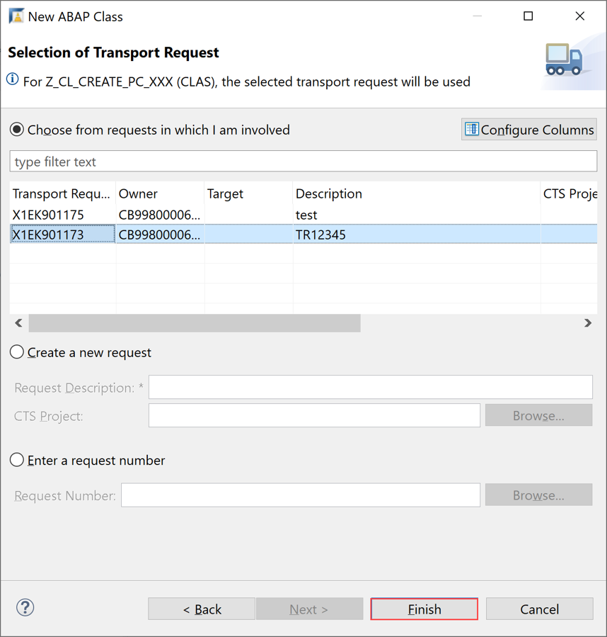

  4. Create purchase contract. Replace your code with following:

    ```ABAP
    CLASS z_cl_create_pc_xxx DEFINITION
      PUBLIC
      FINAL
      CREATE PUBLIC .

      PUBLIC SECTION.

        INTERFACES if_oo_adt_classrun .

      PROTECTED SECTION.
      PRIVATE SECTION.


    ENDCLASS.


    CLASS z_cl_create_pc_xxx IMPLEMENTATION.

      METHOD if_oo_adt_classrun~main.
    *  Create a new purchase contract via EML
        MODIFY ENTITIES OF I_PurchaseContractTP
                 ENTITY        PurchaseContract
                 CREATE FIELDS (
                                 CompanyCode
                                 PurchasingDocumentCategory
                                 PurchaseContractType
                                 PurchasingOrganization
                                 PurchasingGroup
                                 DocumentCurrency
                                 PaymentTerms
                                 CashDiscount1Days
                                 CashDiscount1Percent
                                 CashDiscount2Days
                                 CashDiscount2Percent
                                 Supplier
                                 ValidityStartDate
                                 ValidityEndDate )
                 WITH VALUE #( ( %cid                       = 'PC'
                                 CompanyCode                = '1010'
                                 PurchasingDocumentCategory = 'K'
                                 PurchaseContractType       = 'MK'
                                 PurchasingOrganization     = '1010'  "ZNML
                                 PurchasingGroup            = '001'
                                 DocumentCurrency           = 'EUR'
                                 Supplier                   = '0010300081' "'ASTRID2' )
                                 ValidityStartDate          = cl_abap_context_info=>get_system_date( )
                                 ValidityEndDate            = cl_abap_context_info=>get_system_date( ) + 2 ) )
                     CREATE BY \_PurchaseContractItem
                        SET FIELDS WITH VALUE #(
                                          ( %cid_ref  = 'PC'
                                            %target   = VALUE #(
                                                          (  %cid                           = 'PCI'
                                                             CompanyCode                    = '1010'
                                                             PurchasingDocumentItemCategory = '0'
                                                             PurchaseContractItemText       = 'Integration test PASS API'
                                                             MaterialGroup                  = 'L001'
                                                             Plant                          = '1010'
                                                             ContractNetPriceAmount         = 200
                                                             TargetQuantity                 = 1000
                                                             NetPriceQuantity               = 1
                                                             OrderPriceUnit                 = 'EA'
                                                             OrderQuantityUnit              = 'EA'
                                                             AccountAssignmentCategory      = 'U'
                                                             MultipleAcctAssgmtDistribution = '' " '' = Single, 1 = By Qty, 2 = By %, 3 = By Amount
                                                             OrdPriceUnitToOrderUnitDnmntr  = '1'
                                                             OrderPriceUnitToOrderUnitNmrtr = '1'
                                                             GoodsReceiptIsExpected         = 'X'
                                                             GoodsReceiptIsNonValuated      = ''
                                                             EvaldRcptSettlmtIsAllowed      = ''
                                                             InvoiceIsExpected              = 'X'
                                                             InvoiceIsGoodsReceiptBased     = 'X' ) ) ) )
                MAPPED DATA(ls_mapped)
                FAILED DATA(ls_failed)
                REPORTED DATA(ls_reported).

        IF ls_failed IS INITIAL.
          COMMIT ENTITIES BEGIN RESPONSE OF I_Purchasecontracttp FAILED DATA(lt_failed1) REPORTED DATA(lt_reported1).
          "Special processing for Late numbering to determine the generated document number.
          LOOP AT ls_mapped-purchasecontract ASSIGNING FIELD-SYMBOL(<fs_pr_mapped>).
            CONVERT KEY OF I_Purchasecontracttp FROM <fs_pr_mapped>-%pid TO DATA(ls_pr_key).
            <fs_pr_mapped>-purchasecontract = ls_pr_key-purchasecontract.
          ENDLOOP.
          COMMIT ENTITIES END.
          out->write( 'Purchase contract :'  && ls_pr_key-purchasecontract ).
        ELSE.
          out->write( `Failed` ).
        ENDIF.

    ************************    create new purchase order with reference to a existing/newly created purchase contract *********************************************
        TYPES: tt_purorder_items_create TYPE TABLE FOR CREATE i_purchaseordertp_2\_purchaseorderitem,
               ty_purorder_items_create TYPE LINE OF tt_purorder_items_create.
        TYPES: tt_item_account_assign_create TYPE TABLE FOR CREATE I_PurchaseOrderItemTP_2\_PurOrdAccountAssignment,
               ty_item_account_assign_create TYPE LINE OF tt_item_account_assign_create.

        DATA(lt_item) = VALUE tt_purorder_items_create( ( %cid_ref = 'PO'
                                                          %target  = VALUE #( ( %cid                = 'POI'
                                                                               plant                = '1010'
                                                                               orderquantity        = 1
                                                                               BaseUnit             = 'EA'
                                                                               purchaseorderitem    = '00010'
                                                                               AccountAssignmentCategory = 'K'
                                                                               PurchaseContract     = ls_pr_key-purchasecontract
                                                                               PurchasecontractItem = '00010'
                                                           %control = VALUE #( plant                = cl_abap_behv=>flag_changed
                                                                               orderquantity        = cl_abap_behv=>flag_changed
                                                                               purchaseorderitem    = cl_abap_behv=>flag_changed
                                                                               PurchaseContract     = cl_abap_behv=>flag_changed
                                                                               AccountAssignmentCategory = cl_abap_behv=>flag_changed
                                                                               PurchaseContractItem  = cl_abap_behv=>flag_changed ) ) ) ) ).
        " Account assignment
        DATA(lt_account_assignment) = VALUE tt_item_account_assign_create( ( %cid_ref = 'POI'
                                                                             PurchaseOrderItem = '00010'
                                                                             %target = VALUE #( ( %cid              = 'POA'
                                                                                                  PurchaseOrderItem = '00010'
                                                                                                  accountassignmentnumber = '01'
                                                                                                  CostCenter  = '0010101801'
                                                                                                  GLAccount   = '0051600000'
                                                                                                  Quantity    = '10.00'
                                                                             %control = VALUE #( accountassignmentnumber = cl_abap_behv=>flag_changed
                                                                                                 PurchaseOrderItem = cl_abap_behv=>flag_changed
                                                                                                 CostCenter = cl_abap_behv=>flag_changed
                                                                                                 GLAccount = cl_abap_behv=>flag_changed
                                                                                                 Quantity = cl_abap_behv=>flag_changed ) ) ) ) ).

        " Call the modify function
        MODIFY ENTITIES OF I_PurchaseOrderTP_2
          ENTITY purchaseorder
           CREATE FIELDS ( purchaseordertype
                           companycode
                           purchasingorganization
                           purchasinggroup
                           supplier               )
           WITH VALUE #( ( %cid                   = 'PO'
                           purchaseordertype      = 'NB'
                           companycode            = '1010'
                           purchasingorganization = '1010'
                           purchasinggroup        = '001'
                           supplier               = '0010300081'
                       ) )
          CREATE BY \_purchaseorderitem
          FROM lt_item
          ENTITY PurchaseOrderItem
           CREATE BY \_PurOrdAccountAssignment
           FROM lt_account_assignment
    *

          REPORTED DATA(ls_po_reported)
          FAILED   DATA(ls_po_failed)
          MAPPED   DATA(ls_po_mapped).

        " Check if process is not failed
        cl_abap_unit_assert=>assert_initial( ls_po_failed-purchaseorder ).
        cl_abap_unit_assert=>assert_initial( ls_po_reported-purchaseorder ).

    *    ls_mapped_root_late-%pre = VALUE #( %tmp = ls_mapped-purchaseorder[ 1 ]-%key ).
        COMMIT ENTITIES BEGIN RESPONSE OF I_PurchaseOrderTP_2 FAILED DATA(lt_po_res_failed) REPORTED DATA(lt_po_res_reported).
        "Special processing for Late numbering to determine the generated document number.
        LOOP AT ls_po_mapped-purchaseorder ASSIGNING FIELD-SYMBOL(<fs_po_mapped>).
          CONVERT KEY OF I_PurchaseOrderTP_2 FROM <fs_po_mapped>-%key TO DATA(ls_po_key).
          <fs_po_mapped>-PurchaseOrder = ls_po_key-PurchaseOrder.
        ENDLOOP.
        COMMIT ENTITIES END.
        out->write( 'Purchase order :' && ls_po_key-PurchaseOrder ).
      ENDMETHOD.


    ENDCLASS.
    ```

  5. Save and activate.

  6. Run your ABAP class. Therefore right-click your ABAP class `Z_CL_CREATE_PC_XXX`, select **Run As** > **ABAP Application (Console) F9** or press **F9**.

    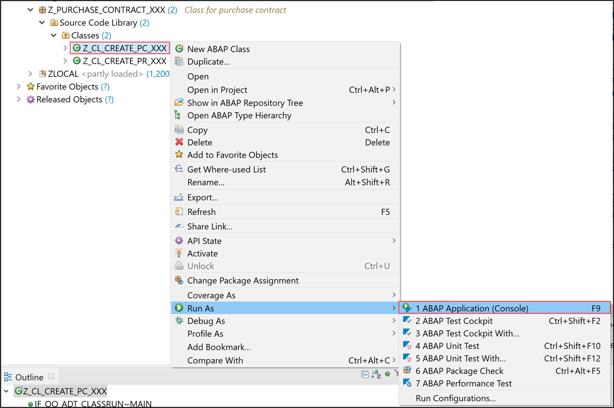

  7. Check your result.

    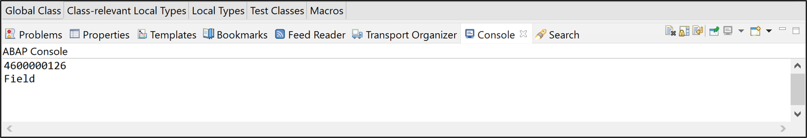


### Create purchase order with reference to the purchase contract via EML


  1. Right-click your package `Z_PURCHASE_CONTRACT_XXX` and select **New** > **ABAP Class**.

      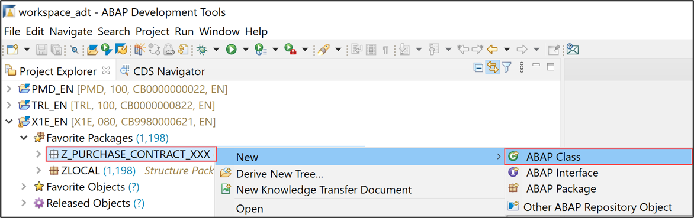

  2. Create new ABAP class:
     - Name: `Z_CL_CREATE_PR_XXX`
     - Description: Class for creating purchase requisition

      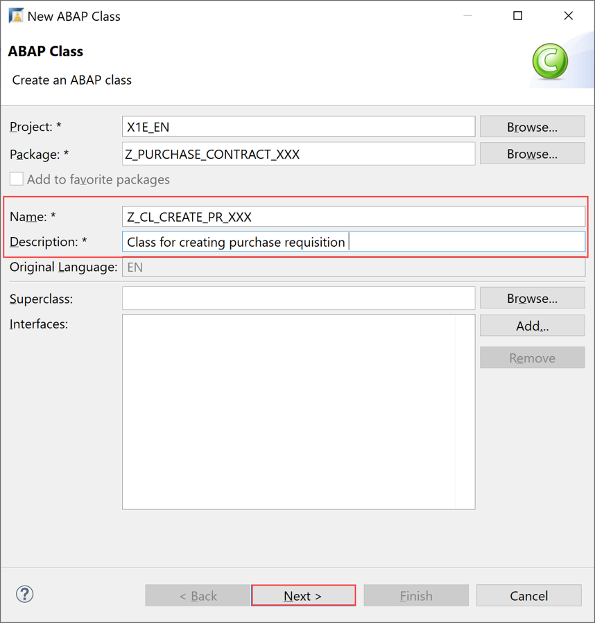

       Click **Next >**.

  3. Click **Finish**.

      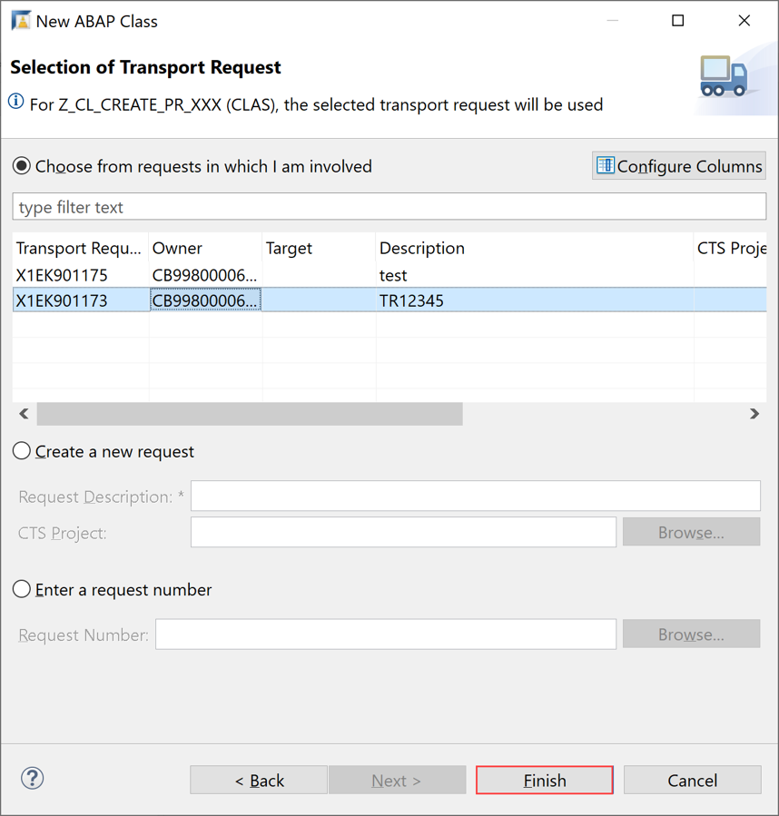

  4. Create a new purchase requisition. Therefore replace your code with following:

    ```ABAP
    CLASS z_cl_create_pr_xxx DEFINITION
      PUBLIC
      FINAL
      CREATE PUBLIC .

      PUBLIC SECTION.
        INTERFACES if_oo_adt_classrun.
      PROTECTED SECTION.
      PRIVATE SECTION.
    ENDCLASS.
    CLASS z_cl_create_pr_xxx IMPLEMENTATION.

      METHOD if_oo_adt_classrun~main.
    *   * Create a new PR and convert the created PR to PO

    *EML statement for deep create of PR
        MODIFY ENTITIES OF i_purchaserequisitiontp
        ENTITY purchaserequisition
           CREATE FIELDS ( purchaserequisitiontype )
           WITH VALUE #(  ( %cid                    = 'My%CID_1'
                            purchaserequisitiontype = 'NB' ) )

          CREATE BY \_purchaserequisitionitem
          FIELDS ( plant
                   purchaserequisitionitemtext
                   accountassignmentcategory
                   requestedquantity
                   baseunit
                   purchaserequisitionprice
                   purreqnitemcurrency
                   materialgroup
                   purchasinggroup
                   purchasingorganization
    *               MultipleAcctAssgmtDistribution
                       )
          WITH VALUE #(
                        (    %cid_ref = 'My%CID_1'
                             %target = VALUE #(
                                              (  %cid                        = 'My%ItemCID_1'
                                                 plant                       = '1010'
                                                 purchaserequisitionitemtext = 'created from PAAS API 23.6.2021 '
                                                 accountassignmentcategory   = 'K'
                                                 requestedquantity           = '10.00'
                                                 baseunit                    = 'EA'
                                                 purchaserequisitionprice    = '10.00'
                                                 purreqnitemcurrency         = 'EUR'
                                                 materialgroup               = 'L002'
                                                 purchasinggroup             = '001'
                                                 purchasingorganization      = '1010'
    *                                             MultipleAcctAssgmtDistribution = '1'
                                                 )
                                              )
                         )
                       )
    ENTITY purchaserequisitionitem

    CREATE BY \_purchasereqnacctassgmt
           FIELDS ( CostCenter
                    GLAccount
                    Quantity
                    BaseUnit )
           WITH VALUE #(
                          ( %cid_ref = 'My%ItemCID_1'
                            %target  = VALUE #( ( CostCenter  = '0010101101'
                                                  GLAccount   = '0010010000'
                                                  Quantity    = '10.00'
                                                  BaseUnit    = 'EA' )

    *                                            ( CostCenter  = 'SVC_AUNIT_'
    *                                              GLAccount   = '0000400000'
    *                                              Quantity    = '7.00'
    *                                              BaseUnit    = 'EA' )
                                                    ) ) )
    CREATE BY \_purchasereqnitemtext
          FIELDS ( plainlongtext )
          WITH VALUE #(
                        (    %cid_ref = 'My%ItemCID_1'
                             %target = VALUE #(
                                              (
                                                 textobjecttype              = 'B01'
                                                 language                    = 'E'
                                                 plainlongtext               = 'item text created from PAAS API'
                                                )
                                              (
                                                 textobjecttype              = 'B02'
                                                 language                    = 'E'
                                                 plainlongtext               = 'item2 text created from PAAS API'
                                                )

                                              )
                         )
                       )

        REPORTED DATA(ls_reported)
                 MAPPED DATA(ls_mapped)
                 FAILED DATA(ls_failed).


        COMMIT ENTITIES BEGIN RESPONSE OF i_purchaserequisitiontp FAILED DATA(lt_res_failed)
        REPORTED DATA(lt_res_reported1).
        "Special processing for Late numbering to determine the generated document number.
        LOOP AT ls_mapped-purchaserequisition ASSIGNING FIELD-SYMBOL(<fs_pr_mapped>).
          CONVERT KEY OF i_purchaserequisitiontp FROM <fs_pr_mapped>-%key TO DATA(ls_pr_key).
          <fs_pr_mapped>-purchaserequisition = ls_pr_key-purchaserequisition.
        ENDLOOP.
        LOOP AT ls_mapped-purchaserequisitionitem ASSIGNING FIELD-SYMBOL(<fs_pri_mapped>).
          CONVERT KEY OF  I_PurchaseReqnItemTP  FROM <fs_pri_mapped>-%key TO DATA(ls_pri_key).
          <fs_pri_mapped>-PurchaseRequisitionItem = ls_pri_key-PurchaseRequisitionItem.
        ENDLOOP.
        COMMIT ENTITIES END.
        out->write( ls_pr_key-PurchaseRequisition ).
        out->write( ls_pri_key-PurchaseRequisitionItem ).
    *    ------------------------------------------------------------------------------------------------------------------------
    *    convert created PR to PO
    *EML statement for  create of PO
    * -----------------------------------------------------------------------------------------------------------------------------
        TYPES: tt_purorder_items_create TYPE TABLE FOR CREATE i_purchaseordertp_2\_purchaseorderitem,
               ty_purorder_items_create TYPE LINE OF tt_purorder_items_create.
        DATA(lt_item) = VALUE tt_purorder_items_create( ( %cid_ref = 'PO'
                                   %target  = VALUE #( ( %cid               = 'POI'
                                                       purchaseorderitem    = '00010'
                                                       PurchaseRequisition  = ls_pr_key-PurchaseRequisition
                                                   PurchaseRequisitionItem =  ls_pri_key-PurchaseRequisitionItem

                                   %control = VALUE #(
                                                       purchaseorderitem    = cl_abap_behv=>flag_changed
                                                       purchaserequisition  = cl_abap_behv=>flag_changed
                                                       purchaserequisitionitem  = cl_abap_behv=>flag_changed
                                                       ) ) ) ) ).
        " Call the modify function
        MODIFY ENTITIES OF I_PurchaseOrderTP_2
          ENTITY purchaseorder
           CREATE FIELDS ( purchaseordertype
                           companycode
                           purchasingorganization
                           purchasinggroup
                           supplier
                         )
           WITH VALUE #( ( %cid                   = 'PO'
                           purchaseordertype      = 'NB'
                           companycode            = '1010'
                           purchasingorganization = '1010'
                           purchasinggroup        = '001'
                           supplier               = 'S1030001'
                       ) )
          CREATE BY \_purchaseorderitem
          FROM lt_item

          REPORTED DATA(ls_po_reported)
          FAILED   DATA(ls_po_failed)
          MAPPED   DATA(ls_po_mapped).

        " Check if process is not failed
        cl_abap_unit_assert=>assert_initial( ls_po_failed-purchaseorder ).
        cl_abap_unit_assert=>assert_initial( ls_po_reported-purchaseorder ).

    *    ls_mapped_root_late-%pre = VALUE #( %tmp = ls_mapped-purchaseorder[ 1 ]-%key ).
        COMMIT ENTITIES BEGIN RESPONSE OF I_PurchaseOrderTP_2 FAILED DATA(lt_po_res_failed) REPORTED DATA(lt_po_res_reported).
        "Special processing for Late numbering to determine the generated document number.
        LOOP AT ls_po_mapped-purchaseorder ASSIGNING FIELD-SYMBOL(<fs_po_mapped>).
          CONVERT KEY OF I_PurchaseOrderTP_2 FROM <fs_po_mapped>-%key TO DATA(ls_po_key).
          <fs_po_mapped>-PurchaseOrder = ls_po_key-PurchaseOrder.
        ENDLOOP.
        COMMIT ENTITIES END.
        out->write( ls_po_key-PurchaseOrder ).


    ****create/update scheduling agreement
     READ ENTITIES OF I_SchedgAgrmtHdrTP_2
                ENTITY PurchaseSchedulingAgreement ALL FIELDS WITH VALUE #( ( SchedulingAgreement =  '5500000040' ) )
                    RESULT DATA(sa_header).

        cl_abap_unit_assert=>assert_not_initial( sa_header ).

        DATA : lt_update_hdr TYPE TABLE FOR UPDATE I_SchedgAgrmtHdrTP_2\\PurchaseSchedulingAgreement,
               lt_create_hdr TYPE TABLE FOR create I_SchedgAgrmtHdrTP_2\\PurchaseSchedulingAgreement.

        APPEND INITIAL LINE TO lt_update_hdr ASSIGNING FIELD-SYMBOL(<ls_hdr>).
        <ls_hdr> = CORRESPONDING #( sa_header[ 1 ] ).
        <ls_hdr>-TargetAmount = 100.
        <ls_hdr>-%control-TargetAmount = if_abap_behv=>mk-on.
         APPEND INITIAL LINE TO lt_create_hdr ASSIGNING FIELD-SYMBOL(<ls_cr_hdr>).
        <ls_cr_hdr> = CORRESPONDING #( sa_header[ 1 ] ).
    clear sa_header[ 1 ]-SchedulingAgreement.
    lt_create_hdr[ 1 ] = CORRESPONDING #( sa_header[ 1 ] ).
    *clear lt_create_hdr[ 1 ]-SchedulingAgreement.
    lt_create_hdr[ 1 ]-%cid = 'SA'.
    lt_create_hdr[ 1 ]-CompanyCode = '1010'.
    lt_create_hdr[ 1 ]-%control-CompanyCode = if_abap_behv=>mk-on..
    lt_create_hdr[ 1 ]-PurchasingDocumentType = 'LP'.
    lt_create_hdr[ 1 ]-%control-PurchasingDocumentType = if_abap_behv=>mk-on..
    lt_create_hdr[ 1 ]-PurchasingOrganization = '1010'.
    lt_create_hdr[ 1 ]-%control-PurchasingOrganization = if_abap_behv=>mk-on..
    lt_create_hdr[ 1 ]-Purchasinggroup = '1010'.
    lt_create_hdr[ 1 ]-%control-Purchasinggroup = if_abap_behv=>mk-on..
    lt_create_hdr[ 1 ]-supplier = '0010300001'.
    lt_create_hdr[ 1 ]-%control-supplier = if_abap_behv=>mk-on..
    lt_create_hdr[ 1 ]-ValidityEndDate = '20211121'.
    lt_create_hdr[ 1 ]-%control-ValidityEndDate = if_abap_behv=>mk-on..
        MODIFY ENTITIES OF I_SchedgAgrmtHdrTP_2
             ENTITY PurchaseSchedulingAgreement creatE FROM lt_create_hdr

             REPORTED DATA(reported)
             FAILED DATA(failed).

        cl_abap_unit_assert=>assert_initial( failed ).
        COMMIT ENTITIES BEGIN RESPONSE OF I_SchedgAgrmtHdrTP_2
        FAILED DATA(sa_failed)
        REPORTED DATA(sa_reproted).

        COMMIT ENTITIES END.
      ENDMETHOD.

    ENDCLASS.
    ```

  5. Save and activate.


### Test yourself
