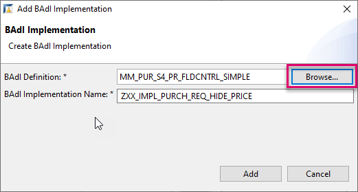

# Implement a Field Control Using a Business Add-in (`BAdI`)
<!-- description --> Hide Prices for a Specified User Using a Business Add-in (`BAdI`) for a Purchase Requisition

## Prerequisites
- You have a license for SAP S/4HANA Cloud and have a developer user in this system
- You have installed [SAP ABAP Development Tools (ADT), latest version](https://tools.hana.ondemand.com/#abap), and have created an ABAP Cloud project for your SAP S/4HANA Cloud System in it
- You are familiar with the concept of extensions to the SAP standard and with `BAdIs` in particular. If not, see the **More Information** section at the end of this tutorial

## You will learn
- How to logon to SAP S/4HANA Cloud ABAP Environment
- How to create an ABAP package
- How to find relevant existing `BAdI` enhancement spots for your line of business, in this case **Materials-Management-Purchasing**
- How to hide a field, **Price**, by changing the status of a field control


## Intro
>The administrator receives an welcome e-mail after provisioning. This e-mail includes the system URL. By removing `/ui` you can log into the SAP S/4HANA Cloud ABAP Environment system. Further information can be found [Developer Extensibility: Connect to the ABAP System](https://help.sap.com/docs/SAP_S4HANA_CLOUD/6aa39f1ac05441e5a23f484f31e477e7/4b962c243a3342189f8af460cc444883.html?locale=en-US).

A **Business Add-In (`BAdI`)** enables you to implement enhancements to standard SAP applications without modifying the original code.

In this case, the `BAdI` is implemented in the SAP Fiori app as follows:

1. Use an existing enhancement spot **`MM_PUR_S4_PR_FLDCNTRL_SIMPLE`**, with an existing `BADI` definition **`MM_PUR_S4_PR_FLDCNTRL_SIMPLE`**
2. Create a container ( **enhancement implementation** ) in the enhancement spot
3. Create a **`BADI` implementation** for the `BADI` definition.

<!-- border -->

Throughout this tutorial, objects name include a prefix, such as **`xx`** or suffix, such as **`XXX`**. Always replace this with your group number or initials.

---


### Log on to SAP S/4HANA Cloud ABAP Environment

1. Open ADT, select **File** > **New** > **Other**.

    

2. Search **ABAP Cloud Project**, select it and choose **Next >**.

    

3. Select **SAP S/4HANA Cloud ABAP Environment**, enter the ABAP service instance URL and choose **Next**.

    

4. To log on, choose **Open Logon Page in Browser**, then choose **Next**.

    
    .
    

6. Check your ABAP service instance connection and choose **Finish**.

    

Your project is available in the Project Explorer.


### Create package

First, create a package for your development objects, or use an existing package (for example, if you have already created a `BAdI`.)

1. Choose your project, then choose **New > ABAP Package** from the context menu.

    <!-- border -->

2. Enter the following.
    - **`Zxx_MM_PUR_S4_BADI`**
    - **`BADIs` for MM Purchasing**

3. Optional: Choose **Add to favorite packages**, then choose **Next**

    <!-- border -->

4. Choose **Create a new request**, enter a meaningful description, e.g. **Test `BADIs` MM-PURCHASING** then choose **Finish**.


### Choose enhancement spot

1. First make sure that the released APIs are displayed by application component: In your project, navigate to **Released Objects**. The tree should show the Released Objects sorted by Application Component.

    <!-- border -->

2. If not, choose **Configure Tree** from the context menu, then select **Application Component** from the left side ( **Available Tree Levels** ) and add it to the right side ( **Selected Tree Levels** ). Move it to the top. Then choose **Finish**.

    <!-- border -->
    .
    <!-- border -->

3. In your project, drill down to **Released Objects > MM-PUR-VM > Enhancements > Enhancement Spots > `MM_PUR_S4_PR_FLDCNTRL_SIMPLE`** and open it by double-clicking.

    <!-- border -->

The `BAdI` enhancement spot appears in a new editor, showing you the available `BAdI` definitions (1).

To help you create your own enhancements, example classes are provided (2).

<!-- border -->

> A complete searchable table of available `BAdIs` and the Fiori apps to which they pertain is available here:
SAP Help Portal: [Adaptation of App Behavior](https://help.sap.com/viewer/0e602d466b99490187fcbb30d1dc897c/2202.500/en-US/259a396e6bdb4d08b130049880a3920f.html)


### Create enhancement implementation

Next, you need a container within the enhancement spot for your `BADI` implementations. This is known as an enhancement implementation.

1. Select your package **`Zxx_MM_PUR_S4_BADI`** and choose **New > Other ABAP Object** from the context menu.

    <!-- border -->

2. Filter by `BAdI`, choose **`BAdI` Enhancement Implementation**, then choose **Next**.

3. Add the following and choose **Next**.
    - Name: **`Zxx_BADI_FIELD_CONTROL_PO`**
    - Description: **Field control: Change price to hidden**
    - Enhancement Spot: **`MM_PUR_S4_PR_FLDCNTRL_SIMPLE`**

      <!-- border -->

4. Choose the transport request, then choose **Finish**.

Your `BAdI` enhancement implementation appears in a new editor. It implements the enhancement spot **`MM_PUR_S4_PR_FLDCNTRL_SIMPLE`**.

  <!-- border -->


### Add `BAdI` Implementation

1. Choose **Add `BAdI`**.


    <!-- border -->

2. Add the following, then choose **Next**:
    - `BAdI` Definition: **`MM_PUR_S4_PR_FLDCNTRL_SIMPLE`** (Add by clicking on **Browse**)
    - `BAdI` Implementation Name: **`ZXX_BADI_FLDCONTROL_PO_IMPL`**

    <!-- border -->

Ignore the error. You will fix this in the next step.


### Create implementing class

1. Choose **Implementing Class**.

    <!-- border -->

2. Add the following, then choose **Next**.
    - Name: **`ZXX_CL_FLDCONTROL_PO`**
    - Description: **Implement hide price for given user**
    - Interfaces: **`IF_MM_PUR_S4_PR_FLDCNTRL`** (added automatically)

    <!-- border -->

3. Choose the transport request, then choose **Finish**.

    The class appears in a new editor with skeleton code.

    <!-- border -->

4. Format, save, and activate the class ( **`Shift+F1, Ctrl+S, Ctrl+F3`** ).

5. Go back to your `BAdI` implementation **`ZXX_BADI_FLDCONTROL_PO_IMPL`** and activate it too.

The error will disappear.


### Implement code

1. Add the following code to the method implementation **`if_mm_pur_s4_pr_fldcntrl~modify_fieldcontrols.`**

    ```ABAP
    * Disclaimer:
    * Any software coding or code lines / strings ("Code") provided are only examples
    * and are not intended for use in a productive system environment. The Code is only
    * intended to better explain and visualize the syntax and phrasing rules for certain
    * SAP coding. SAP does not warrant the correctness or completeness of the Code
    * provided herein and SAP shall not be liable for errors or damages cause by use of
    * the Code, except where such damages were caused by SAP with intent or with gross
    * negligence.
    *------------------------------------------------------------------------------------
    *   Value for FIELDSTATUS can be set to anyone of the following
    *   '-' Field is Hidden
    *   '*' Field is only Displayed, which means no entry is possible
    *   '+' Field is Mandatory, which means an entry must be made
    *   '.' Field is Optional, which means an entry may be made
    *------------------------------------------------------------------------------------

    **    Sample Code
    **price hidden when created user is 'CB9980000609'.
    *
        IF purchaserequisitionitem-createdbyuser  EQ 'CB9980000609'.
          READ TABLE fieldselection_table ASSIGNING <fs> WITH KEY field = 'PURCHASEREQUISITIONPRICE'.
          IF sy-subrc EQ 0.
            <fs>-fieldstatus = '-'.
          ENDIF.
        ENDIF.
    **
    **Alternative sample code 1:
    ** price hidden when requisitioner is a specific person
    **
    * enter in field purchase requisitioner = HIDEPRICE
    *    IF purchaserequisitionitem-purreqnrequestor  EQ 'HIDEPRICE'.
    *      READ TABLE fieldselection_table ASSIGNING <fs> WITH KEY field = 'PURCHASEREQUISITIONPRICE'.
    *      IF sy-subrc EQ 0.
    *        <fs>-fieldstatus = '-'.
    *      ENDIF.
    *    ENDIF.

    **
    **Alternative sample code 1:
    ** hide price for all users
    **
    * READ TABLE fieldselection_table ASSIGNING <fs> WITH KEY field = 'PURCHASEREQUISITIONPRICE'.
    *    IF sy-subrc EQ 0.
    *      <fs>-fieldstatus = '-'.
    *    ENDIF.


    ```

2. Format, save, and activate ( **`Shift+F1, Ctrl+S, Ctrl+F3`** ) your code.

Check that yours is the implementation that will be called:

<!-- border -->


### Test yourself


---

### More information
- Start here: SAP blog post: [How to Extend SAP Standard Using ADT](https://blogs.sap.com/2020/08/05/how-to-extend-sap-standard-using-adt/)
- SAP Help Portal: [Working with Business Add-Ins (`BAdIs`)](https://help.sap.com/viewer/5371047f1273405bb46725a417f95433/Cloud/en-US/04a1d9415efd4e4fbc58534c99c3a0d3.html)
- SAP Help Portal: Sourcing and Procurement: [Adaptation of App Behavior (Overview and List of Available `BAdIs`)](https://help.sap.com/docs/SAP_S4HANA_CLOUD/0e602d466b99490187fcbb30d1dc897c/259a396e6bdb4d08b130049880a3920f.html?locale=en-US)


---
