# Create a Custom RAP Business Object to Trigger Purchase Requisitions API
<!-- description --> Create a custom RAP business object to trigger purchase requisitions API with SAP S/4HANA Cloud ABAP Environment.

In the online shop, customers can order various items. Once an item is ordered, a new purchase requisition is created via purchase requisitions API.

[EML](https://help.sap.com/viewer/923180ddb98240829d935862025004d6/Cloud/en-US/af7782de6b9140e29a24eae607bf4138.html) can be used to trigger purchase requisitions API, which is released for cloud development.


## Prerequisites  
- You have a license for SAP S/4HANA Cloud and have a developer user in it
- You have installed the latest [Eclipse with ADT](abap-install-adt).
- Business Catalog `SAP_BR_PURCHASER` needs to be assign to your business user
- Use Starter Development Tenant in S/4HANA Cloud for the tutorial to have necessary sample data in place. See [3-System Landscape and Transport Management](https://help.sap.com/docs/SAP_S4HANA_CLOUD/a630d57fc5004c6383e7a81efee7a8bb/e022623ec1fc4d61abb398e411670200.html?state=DRAFT&version=2208.503).

## You will learn  
- How to logon to SAP S/4HANA Cloud ABAP Environment
- How to create an ABAP package
- How to create a database table
- How to create a CDS model and projection view
- How to create behavior definition & implementation
- How to create service definition & service binding
- How to run SAP Fiori Elements Preview

## Intro
In this tutorial, wherever XXX appears, use a number (e.g. 000).

---
### Logon to SAP S/4HANA Cloud ABAP Environment


  1. Open Eclipse, select **File** > **New** > **Other**.

      

  2. Search **ABAP Cloud Project**, select it and click **Next >**.

      

  3. Select **SAP S/4HANA Cloud ABAP Environment**, enter the ABAP service instance URL and click **Next >**.

      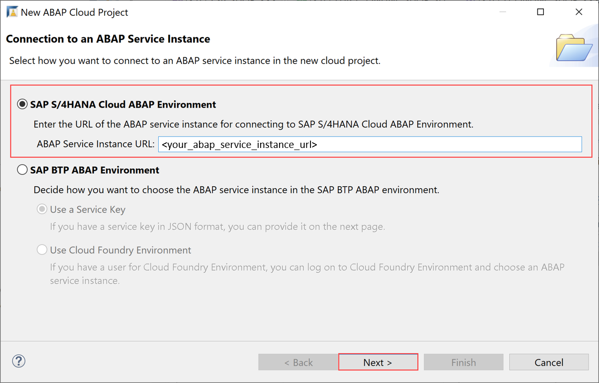

  4. Click **Open Logon Page in Browser** to log in.

      

      **HINT**: The administrator receives an welcome e-mail after provisioning. This e-mail includes the system URL. By removing `/ui` you can log into the SAP S/4HANA Cloud ABAP Environment system. Further information can be found [here](https://help.sap.com/docs/SAP_S4HANA_CLOUD/6aa39f1ac05441e5a23f484f31e477e7/4b962c243a3342189f8af460cc444883.html?locale=en-US&state=DRAFT).

  5. Click **Next >**.

      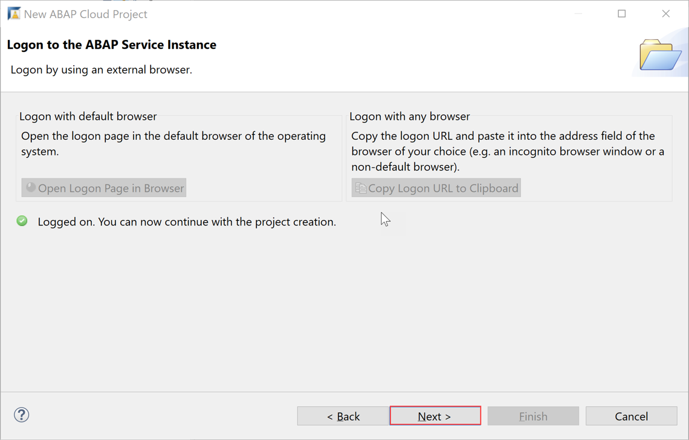

  6. Check your ABAP service instance connection and click **Finish**.

      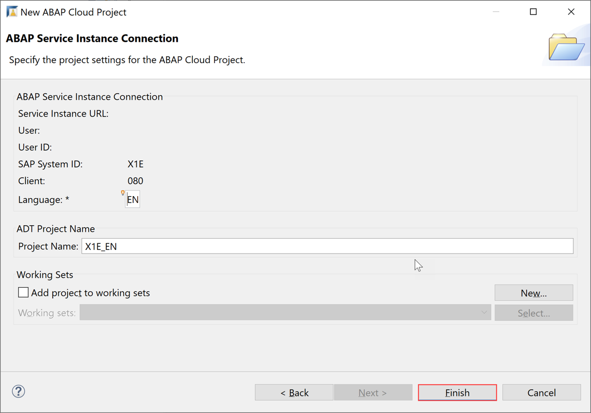

  7. Now your project will be available in the project explorer.

      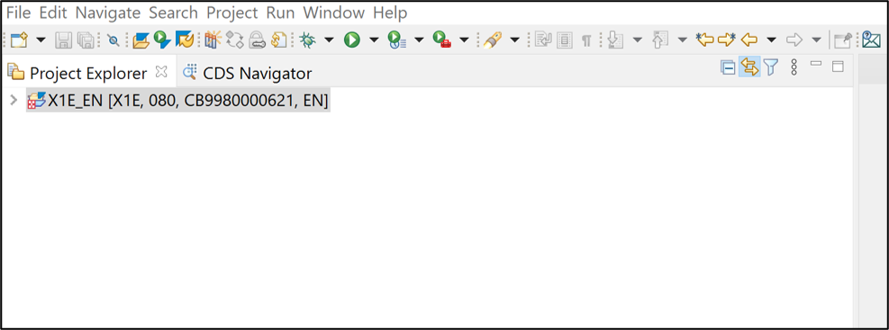


### Create ABAP package


  1.  Select **ZLOCAL** > **New** > **ABAP Package**.

      

  2.  Create new ABAP package:
       - Name: `Z_PURCHASE_REQ_XXX`
       - Description: Package XXX
       - Check **Add to favorite packages**

      

       Click **Next >**.

  3.  Create a new request:
      -  Request Description: TR12345

      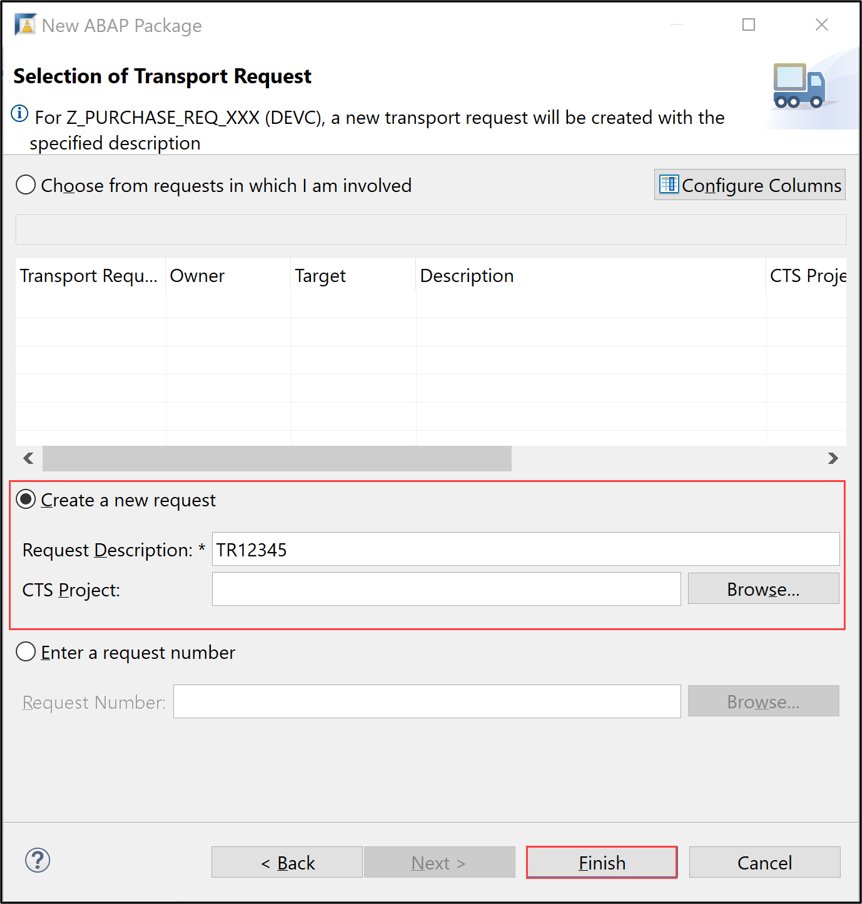

       Click **Finish**.


### Create database table


  1. Right-click your package `Z_PURCHASE_REQ_XXX` and select **New** > **Other ABAP Repository Object**.

      

  2. Search for **database table**, select it and click **Next >**.

      

  3. Create new database table:
     - Name: `ZONLINESHOP_XXX`
     - Description: Shop to purchase electronics

      

       Click **Next >**.

  4. Click **Finish**.

      

  5. Replace your code with following:

    ```ABAP
    @EndUserText.label : 'Shop to purchase electronics'
    @AbapCatalog.enhancement.category : #NOT_EXTENSIBLE
    @AbapCatalog.tableCategory : #TRANSPARENT
    @AbapCatalog.deliveryClass : #A
    @AbapCatalog.dataMaintenance : #RESTRICTED
    define table zonlineshop_xxx {
      key client     : abap.clnt not null;
      key order_uuid : sysuuid_x16 not null;
      order_id       : abap.char(10) not null;
      ordereditem    : abap.char(10) not null;
      deliverydate   : abap.dats;
      creationdate   : abap.dats;

    }
    ```

   6. Save and activate.

   7. Right-click your package `Z_PURCHASE_REQ_XXX` and select **New** > **Other ABAP Repository Object**.

       

   8. Search for **database table**, select it and click **Next >**.

       

   9. Create new database table:
      - Name: `ZSHOP_AS_XXX`
      - Description: Database table for additional save

       

       Click **Next >**.

  10. Click **Finish**.

       

  11. Replace your code with following:

    ```ABAP
    @EndUserText.label : 'Database table for additional save'
    @AbapCatalog.enhancement.category : #NOT_EXTENSIBLE
    @AbapCatalog.tableCategory : #TRANSPARENT
    @AbapCatalog.deliveryClass : #A
    @AbapCatalog.dataMaintenance : #RESTRICTED
    define table zshop_as_xxx {
      key client     : abap.clnt not null;
      key order_uuid : sysuuid_x16 not null;
      purchasereqn   : abap.string(256);
      purinforecord  : abap.string(256);
      purorder       : abap.string(256);

    }
    ```

  12. Save and activate.


### Create CDS data model


  1. Right-click your package `Z_PURCHASE_REQ_XXX` and select **New** > **Other ABAP Repository Object**.

      

  2. Search for **data definition**, select it and click **Next >**.

      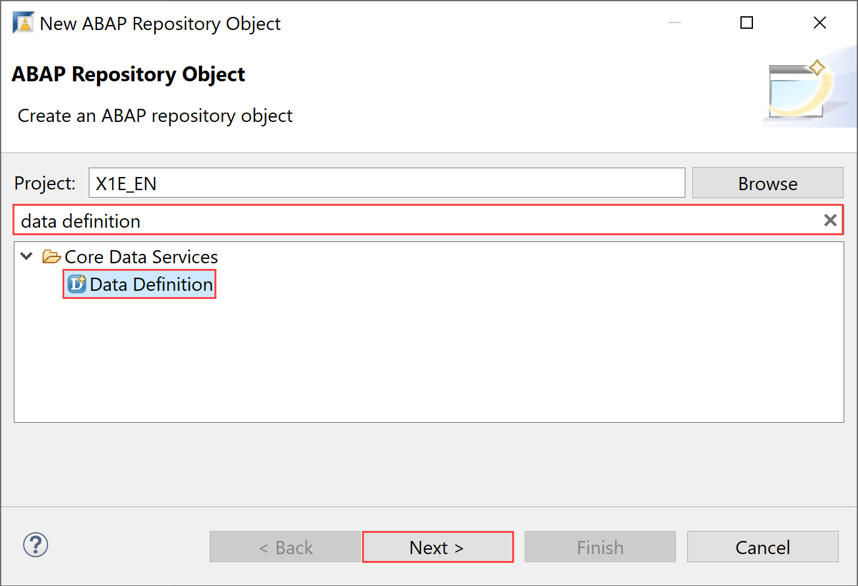

  3. Create new data definition:
     - Name: `ZI_ONLINE_SHOP_XXX`
     - Description: Data model for online shop

      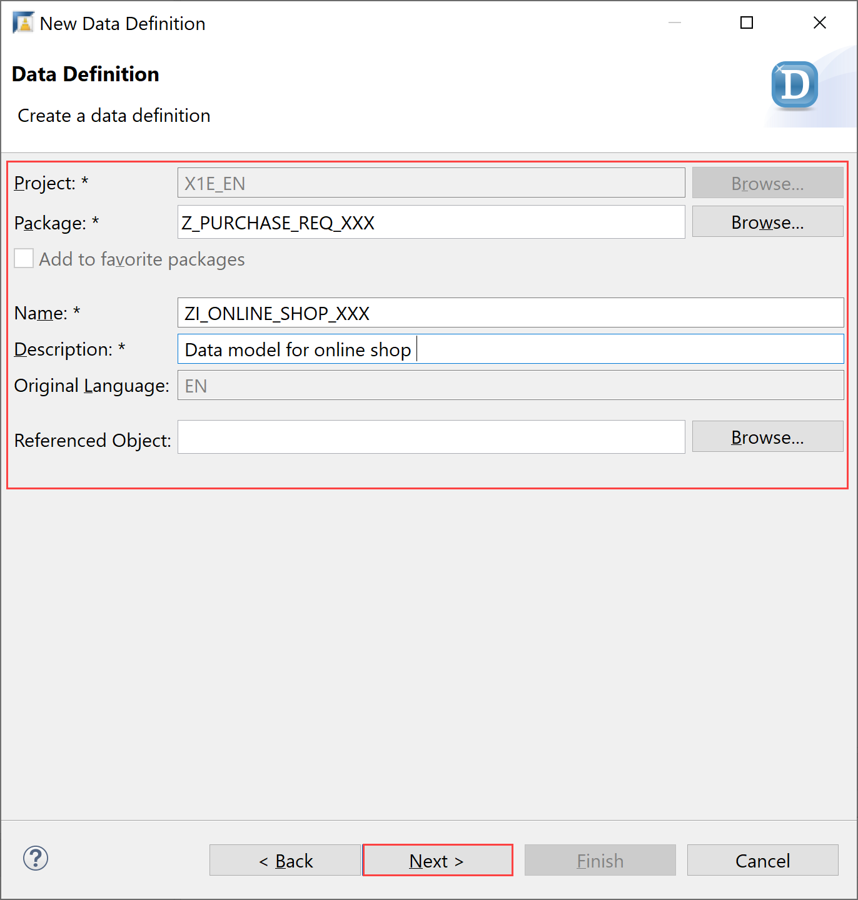

       Click **Next >**.

  4. Click **Finish**.

      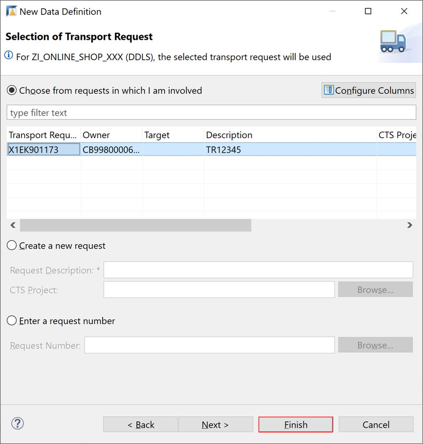

  5. Replace the code for your behavior `ZI_ONLINE_SHOP_XXX` with following:

    ```ABAP
    @EndUserText.label: 'Data model for online shop'
    @AccessControl.authorizationCheck: #CHECK
    define root view entity ZI_ONLINE_SHOP_XXX as select from zonlineshop_xxx {
      key order_uuid as Order_Uuid,
      order_id as Order_Id,
      ordereditem as Ordereditem,
      deliverydate as Deliverydate,
      creationdate as Creationdate  
    }
    ```

   6. Save and activate.


### Create projection view


  1. Right-click **Data Definitions** and select **New Data Definition**.

      

  2. Create new projection view:
     - Name: `ZC_ONLINE_SHOP_XXX`
     - Description: Projection view for online shop
     - Referenced Object: `ZI_ONLINE_SHOP_XXX`

      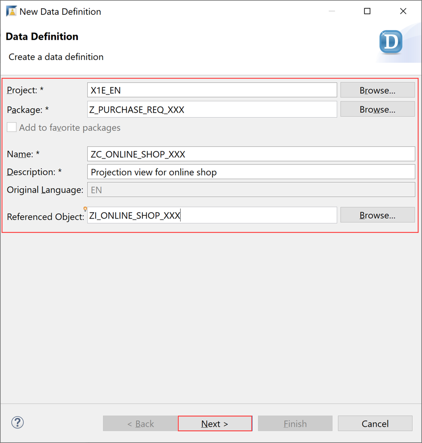

       Click **Next >**.

  3. Click **Finish**.

      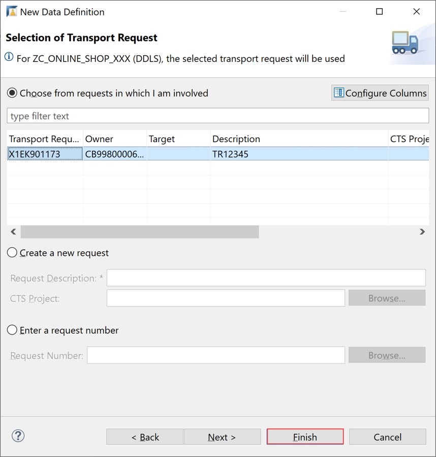

  4. Replace the code for your behavior `ZC_ONLINE_SHOP_XXX` with following:

    ```ABAP
    @EndUserText.label: 'shop projection'
    @AccessControl.authorizationCheck: #CHECK
    @Search.searchable: true
    @UI: { headerInfo: { typeName: 'Online Shop',
                        typeNamePlural: 'Online Shop',
                        title: { type: #STANDARD, label: 'Online Shop', value: 'order_id' } },

          presentationVariant: [{ sortOrder: [{ by: 'Creationdate',
                                                direction: #DESC }] }] }
    define root view entity ZC_ONLINE_SHOP_XXX
      as projection on ZI_ONLINE_SHOP_XXX
    {
          @UI.facet: [          { id:                  'Orders',
                                      purpose:         #STANDARD,
                                      type:            #IDENTIFICATION_REFERENCE,
                                      label:           'Order',
                                      position:        10 }      ]
      key Order_Uuid,
          @UI: { lineItem:       [ { position: 10,label: 'order id', importance: #HIGH } ],
                  identification: [ { position: 10, label: 'order id' } ] }
          @Search.defaultSearchElement: true
          Order_Id,
          @UI: { lineItem:       [ { position: 20,label: 'Ordered item', importance: #HIGH } ],
                  identification: [ { position: 20, label: 'Ordered item' } ] }
          @Search.defaultSearchElement: true
          Ordereditem,
          Deliverydate       as Deliverydate,
          @UI: { lineItem:       [ { position: 50,label: 'Creation date', importance: #HIGH },
                                  { type: #FOR_ACTION, dataAction: 'update_inforecord', label: 'Update IR' } ],
                identification: [ { position: 50, label: 'Creation date' } ] }
          Creationdate       as Creationdate
    }
    ```

   5. Save and activate.


### Create behavior definition for CDS data model


  1. Right-click your data definition `ZI_ONLINE_SHOP_XXX` and select **New Behavior Definition**.

      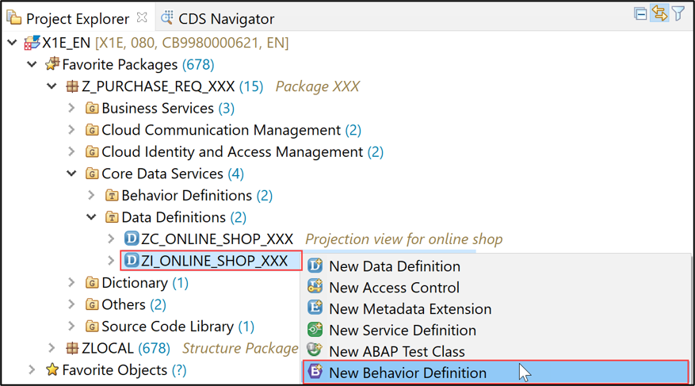

  2. Create new behavior definition:

      

       Click **Next >**.

  3. Click **Finish**.

      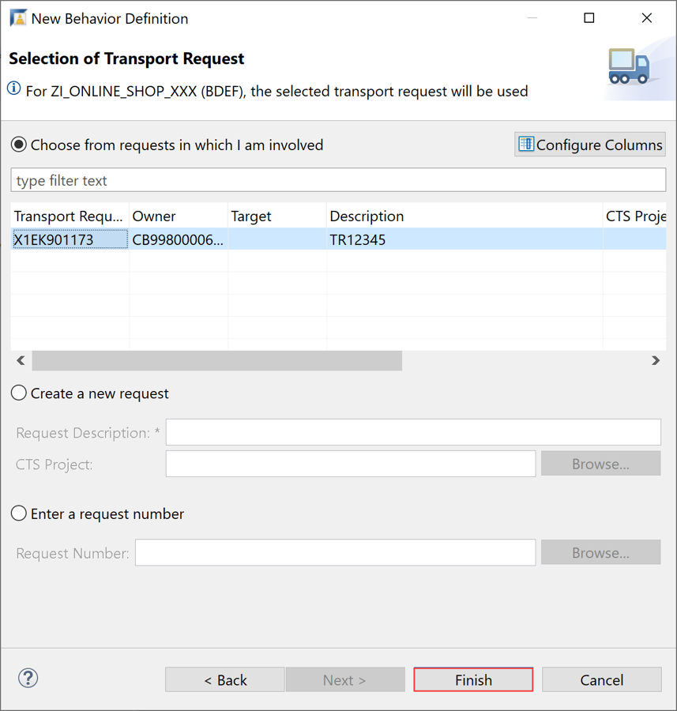

  4. Replace your code with following:

    ```ABAP
    managed implementation in class zbp_i_online_shop_xxx unique;

    define behavior for ZI_ONLINE_SHOP_XXX alias Online_Shop
    with additional save
    persistent table zonlineshop_xxx
    lock master
    authorization master ( instance )
    //etag master <field_name>
    {
      field ( numbering : managed, readonly ) order_Uuid;
      field ( mandatory ) Ordereditem;
      field ( readonly ) Creationdate, order_id;
      determination calculate_order_id on modify { create; }
      internal action create_pr;
      internal action set_inforecord;
      internal action update_inforecord;
      create;
      update;
      delete;
    }
    ```

   5. Save and activate.


### Create behavior definition for projection view


  1. Right-click your projection view `ZC_ONLINE_SHOP_XXX` and select **New Behavior Definition**.

      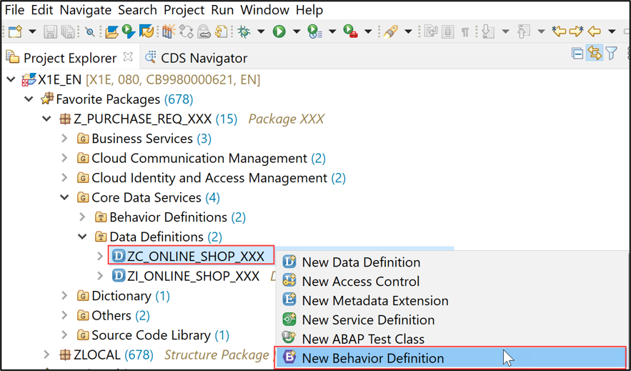

  2. Create new behavior definition:

      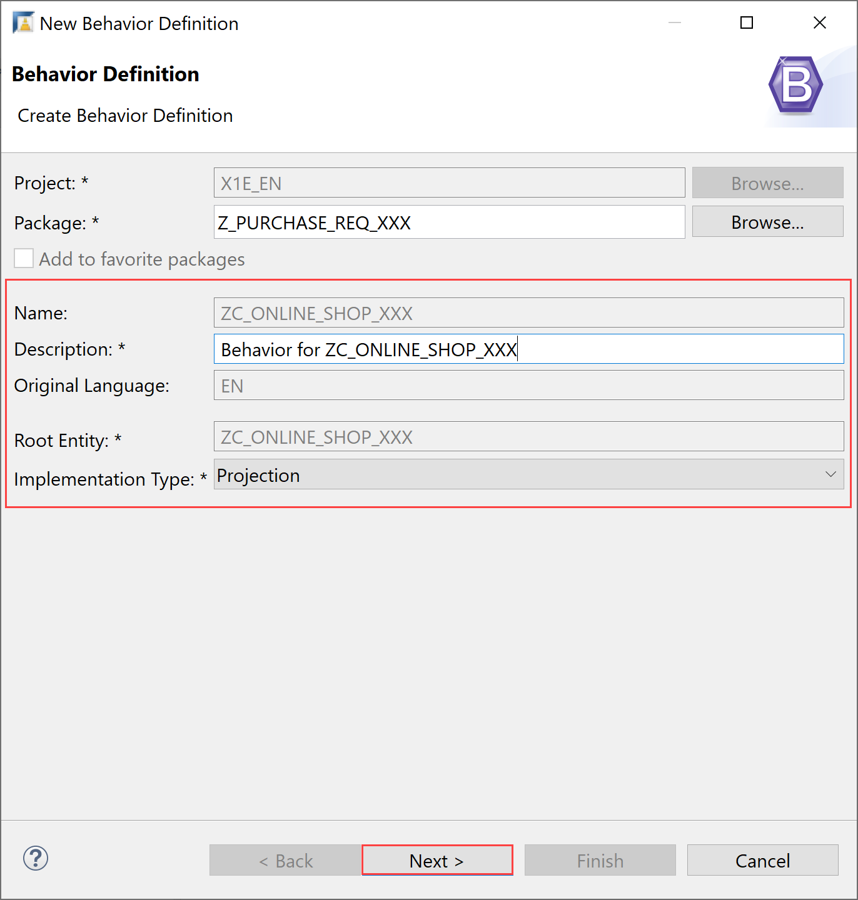

       Click **Next >**.

  3. Click **Finish**.

      

  4. Replace your code with following:

    ```ABAP
    projection;
    //strict; //Comment this line in to enable strict mode. The strict mode is prerequisite to be future proof regarding syntax and to be able to release your BO.

    define behavior for ZC_ONLINE_SHOP_XXX //alias <alias_name>
    {
      use create;
      use update;
      use delete;

    }
    ```

   5. Save and activate.


### Create behavior implementation


  1. In your behavior definition **`ZI_ONLINE_SHOP_XXX`** set the cursor before the implementation class `zbp_i_online_shop_xxx` and click **CTRL + 1**. Double-click on **Create behavior implementation class `zbp_i_online_shop_xxx`** to create your implementation class.

     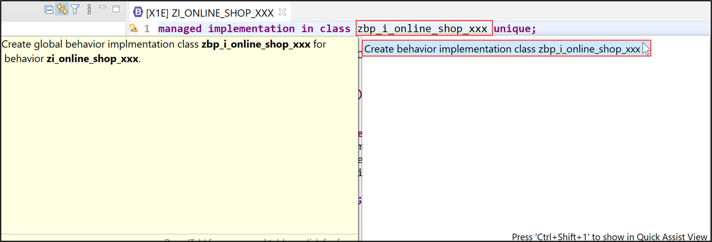


  2. Create new implementation class:

      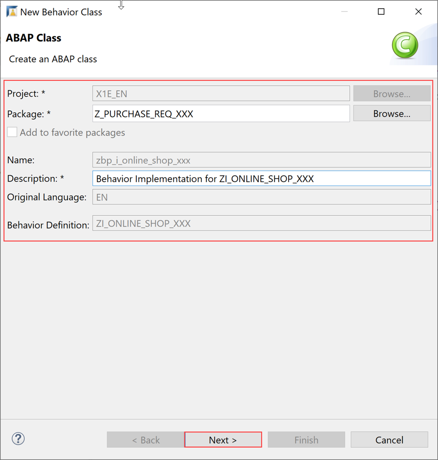

      Click **Next >**.

  3.  Click **Finish**.

      

  4. In your **Global Class**, replace your code with following:

    ```ABAP
    CLASS zbp_i_online_shop_xxx DEFINITION PUBLIC ABSTRACT FINAL FOR BEHAVIOR OF zi_online_shop_xxx.
    class-DATA cv_pr_mapped TYPE RESPONSE FOR MAPPED i_purchaserequisitiontp.
    ENDCLASS.

    CLASS zbp_i_online_shop_xxx IMPLEMENTATION.
    ENDCLASS.
    ```

  5. In your **Local Types**, replace your code with following:

    ```ABAP
    CLASS lsc_zbp_i_online_shop_xxx DEFINITION INHERITING FROM cl_abap_behavior_saver.

      PROTECTED SECTION.

        METHODS save_modified REDEFINITION.

    ENDCLASS.

    CLASS lsc_zbp_i_online_shop_xxx IMPLEMENTATION.

      METHOD save_modified.
        DATA : lt_online_shop_as TYPE STANDARD TABLE OF zshop_as_xxx,
              ls_online_shop_as TYPE                   zshop_as_xxx.
        IF zbp_i_online_shop_xxx=>cv_pr_mapped-purchaserequisition IS NOT INITIAL.
          LOOP AT zbp_i_online_shop_xxx=>cv_pr_mapped-purchaserequisition ASSIGNING FIELD-SYMBOL(<fs_pr_mapped>).
            CONVERT KEY OF i_purchaserequisitiontp FROM <fs_pr_mapped>-%pid TO DATA(ls_pr_key).
            <fs_pr_mapped>-purchaserequisition = ls_pr_key-purchaserequisition.
          ENDLOOP.
        ENDIF.


        IF create-online_shop IS NOT INITIAL.
          " Creates internal table with instance data
          lt_online_shop_as = CORRESPONDING #( create-online_shop ).
          lt_online_shop_as[ 1 ]-purchasereqn =  ls_pr_key-purchaserequisition .

          INSERT zshop_as_xxx FROM TABLE @lt_online_shop_as.
        ENDIF.
      ENDMETHOD.
    ENDCLASS.

    CLASS lhc_zbp_i_online_shop_xxx  DEFINITION INHERITING FROM cl_abap_behavior_handler.
      PRIVATE SECTION.

        METHODS get_instance_authorizations FOR INSTANCE AUTHORIZATION
          IMPORTING keys REQUEST requested_authorizations FOR  online_shop RESULT result.

        METHODS create_pr FOR MODIFY
          IMPORTING keys FOR ACTION online_shop~create_pr.

        METHODS update_inforecord FOR MODIFY
          IMPORTING keys FOR ACTION online_shop~update_inforecord.

        METHODS calculate_order_id FOR DETERMINE ON MODIFY
          IMPORTING keys FOR online_shop~calculate_order_id.


    ENDCLASS.

    CLASS lhc_zbp_i_online_shop_xxx  IMPLEMENTATION.

      METHOD get_instance_authorizations.
      ENDMETHOD.

      METHOD create_pr.
    **  if a new laptop is ordered, trigger a new purchase requisition
        IF keys IS NOT INITIAL.
          MODIFY ENTITIES OF i_purchaserequisitiontp
    ENTITY purchaserequisition
        CREATE FIELDS ( purchaserequisitiontype )
        WITH VALUE #(  ( %cid                    = 'My%CID_1'
                        purchaserequisitiontype = 'NB' ) )

      CREATE BY \_purchaserequisitionitem
      FIELDS ( plant
                purchaserequisitionitemtext
                accountassignmentcategory
                requestedquantity
                baseunit
                purchaserequisitionprice
                purreqnitemcurrency
                materialgroup
                purchasinggroup
                purchasingorganization
    *               MultipleAcctAssgmtDistribution
                    )
      WITH VALUE #(
                    (    %cid_ref = 'My%CID_1'
                          %target = VALUE #(
                                          (  %cid                            = 'My%ItemCID_1'
                                              plant                           = '1010'
                                              purchaserequisitionitemtext     = 'created from PAAS API XXX'
                                                accountassignmentcategory     = 'U'
                                              requestedquantity               = '8.00'
                                              baseunit                        = 'EA'
                                              purchaserequisitionprice        = '10.00'
                                              purreqnitemcurrency             = 'EUR'
                                              materialgroup                   = 'A001'
                                              purchasinggroup                 = '001'
                                              purchasingorganization          = '1010'

                                              )
                                          )
                      )
                    )
    ENTITY purchaserequisitionitem

    CREATE BY \_purchasereqnacctassgmt
        FIELDS ( CostCenter
                GLAccount
                Quantity
                BaseUnit )
        WITH VALUE #( (   %cid_ref = 'My%ItemCID_1'
                          %target  = VALUE #( ( %cid = 'MyTargetCID_1'
                                                CostCenter   = 'JMW-COST'
                                                GLAccount    = '0000400000' ) ) ) )
    CREATE BY \_purchasereqnitemtext
      FIELDS ( plainlongtext )
      WITH VALUE #(  (   %cid_ref = 'My%ItemCID_1'
                          %target  = VALUE #( (
                                              %cid = 'MyTargetCID_2'
                                              textobjecttype = 'B01'
                                              language       = 'E'
                                              plainlongtext  = 'item text created from PAAS API XXX'
                                            ) (
                                              %cid = 'MyTargetCID_3'
                                              textobjecttype = 'B02'
                                              language       = 'E'
                                              plainlongtext  = 'item2 text created from PAAS API XXX'
                                            ) )
                  )   )
              REPORTED DATA(ls_pr_reported)
              MAPPED DATA(ls_pr_mapped)
              FAILED DATA(ls_pr_failed).
          zbp_i_online_shop_xxx=>cv_pr_mapped = ls_pr_mapped.

        ENDIF.
      ENDMETHOD.


      METHOD update_inforecord.
        SELECT SINGLE * FROM i_purchasinginforecordtp  WHERE PurchasingInfoRecord = '5500000219' INTO @DATA(ls_data).
    *           update an existing info record
    *update remainder for nodays-no delivery remainder after half the timeperiod b/w delivery and creation date/system date
    *fi
        MODIFY ENTITIES OF i_purchasinginforecordtp
              ENTITY purchasinginforecord
              UPDATE SET FIELDS WITH
              VALUE #( ( %key-PurchasingInfoRecord = '5500000219'
                          Supplier                 = ls_data-supplier
                          MaterialGroup            = ls_data-MaterialGroup
                          SupplierMaterialGroup    = ls_data-SupplierMaterialGroup
                          NoDaysReminder1          = '12'
                          PurchasingInfoRecordDesc = 'noDays remainder updated'
                      ) )
                FAILED   DATA(ls_failed_update)
                REPORTED DATA(ls_reported_update)
                MAPPED   DATA(ls_mapped_update).

      ENDMETHOD.

      METHOD calculate_order_id.
        DATA:
          online_shops TYPE TABLE FOR UPDATE zi_online_shop_xxx,
          online_shop  TYPE STRUCTURE FOR UPDATE zi_online_shop_xxx.
    *      delete from zonlineshop_xxx UP TO 15 ROWS.
        SELECT MAX( order_id ) FROM zonlineshop_xxx INTO @DATA(max_order_id).
        READ ENTITIES OF zi_online_shop_xxx IN LOCAL MODE
          ENTITY zi_online_shop_xxx
            ALL FIELDS
              WITH CORRESPONDING #( keys )
              RESULT DATA(lt_online_shop_result)
          FAILED    DATA(lt_failed)
          REPORTED  DATA(lt_reported).
        DATA(today) = cl_abap_context_info=>get_system_date( ).

        LOOP AT lt_online_shop_result INTO DATA(online_shop_read).
          max_order_id += 1.

          online_shop               = CORRESPONDING #( online_shop_read ).
          online_shop-order_id      = max_order_id.
          online_shop-Creationdate  = today.
          online_shop-Deliverydate  = today + 10.
          APPEND online_shop TO online_shops.
        ENDLOOP.
        MODIFY ENTITIES OF zi_online_shop_xxx IN LOCAL MODE
      ENTITY zi_online_shop_xxx UPDATE SET FIELDS WITH online_shops
      MAPPED   DATA(ls_mapped_modify)
      FAILED   DATA(lt_failed_modify)
      REPORTED DATA(lt_reported_modify).

    **create purchase requisition

    * if a new laptop is ordered, trigger a new purchase requisition
        IF lt_failed_modify IS INITIAL.
          MODIFY ENTITIES OF zi_online_shop_xxx IN LOCAL MODE
          ENTITY Online_Shop EXECUTE create_pr FROM CORRESPONDING #( keys )
          FAILED DATA(lt_pr_failed)
          REPORTED DATA(lt_pr_reported).
        ENDIF.


      ENDMETHOD.
    *
    ENDCLASS.
    ```

   5. Save and activate.

    >**HINT:** The option **internal** can be set before the action name to only provide an action for the same BO. An internal action can only be accessed from the business logic inside the business object implementation such as from a determination or from another action.


### Open documentation


You have 2 options to open the documentation inside ADT.


> **Option 1**:

>  1. Open your ABAP class **`zbp_i_online_shop_xxx`**, search for `i_purchaserequisitiontp`, press CTRL and click on it.
      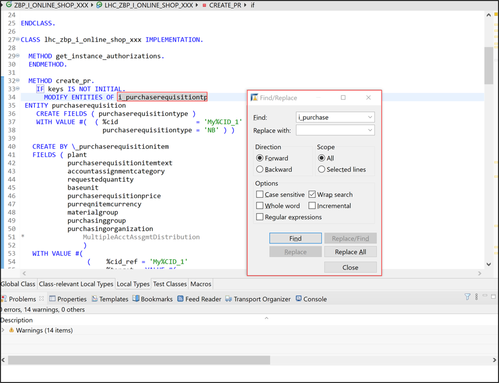
>  2. Now you are in the released object `i_purchaserequisitiontp`.
     Click **Open Documentation** to open it.
      
>  3. Now you are able to read the documentation.
      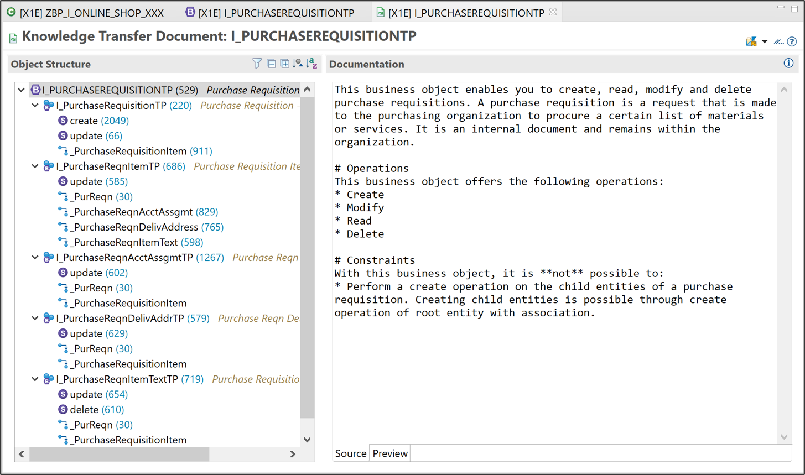

>   **HINT:** You can also open the Element Info by clicking `i_purchaserequisitiontp` and pressing **`F2`**.
>       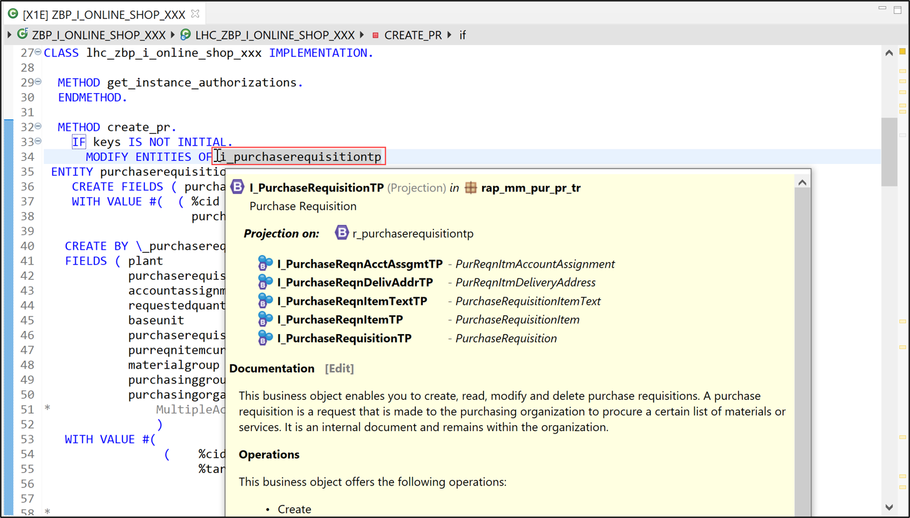

>    You can also switch to different layers inside the Element Info.
>       

> **Option 2**:

> 1. Go back to tab `i_purchaserequisitiontp`. You are now able to see the behavior definition folder of the released object `i_purchaserequisitiontp`  in the project explorer. Now navigate to the documentation `i_purchaserequisitiontp` and open it.
      
>**HINT**: You can also check the API State of released object and see its visibility by selecting the properties.
> 2. Now you can see the documentation.
      


### Create service definition


  1. Right-click your projection view `ZC_ONLINE_SHOP_XXX` and select **New Service Definition**.

      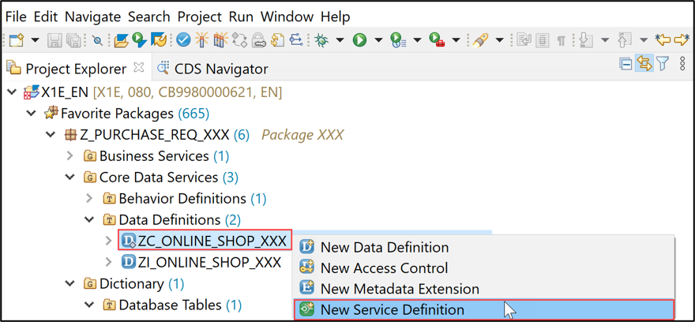

  2. Create new service definition:
     - Name: `ZSD_SHOP_XXX`
     - Description: Service definition for online shop

      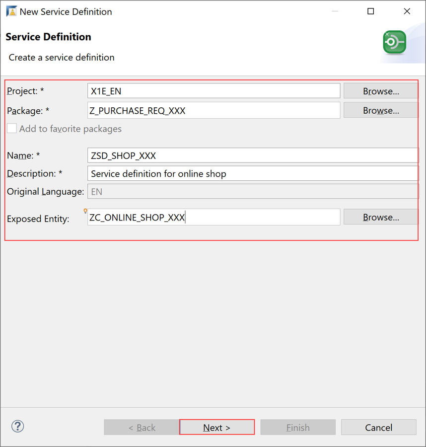

       Click **Next >**.

  3. Click **Finish**.

      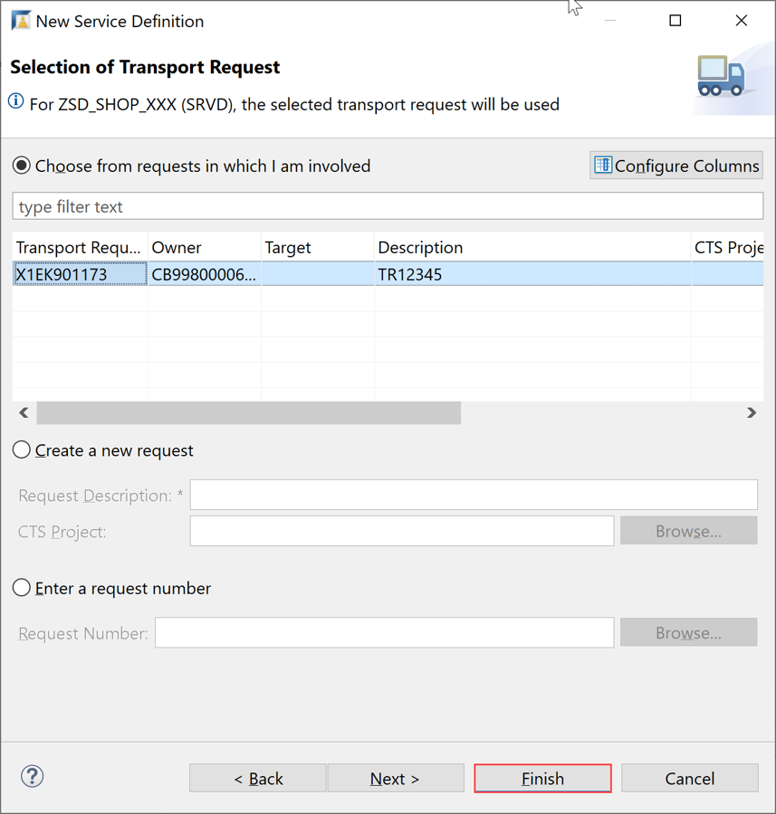

  4. Replace your code with following:

    ```ABAP
    @EndUserText.label: 'Service definition for online shop'
    define service ZSD_SHOP_XXX {
      expose ZC_ONLINE_SHOP_XXX as online_shop;
    }
    ```

   5. Save and activate.


### Create service binding


  1. Right-click your service binding `ZSD_SHOP_XXX` and select **New Service Binding**.

      

  2. Create new service binding:
     - Name: `ZSB_SHOP_XXX`
     - Description: Service binding for online shop
     - Binding Type: `OData V2 - UI`
     - Service Definition: `ZSD_SHOP_XXX`

      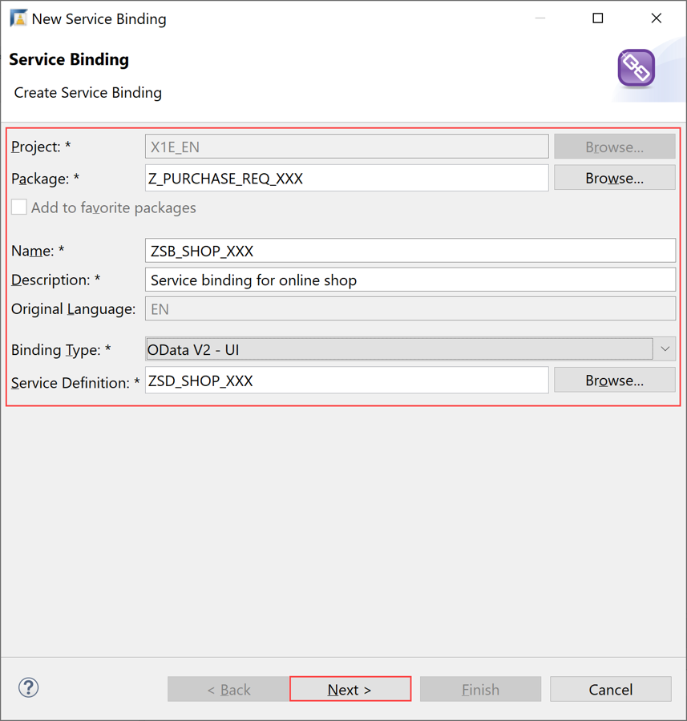

       Click **Next >**.

  3. Click **Finish**.

      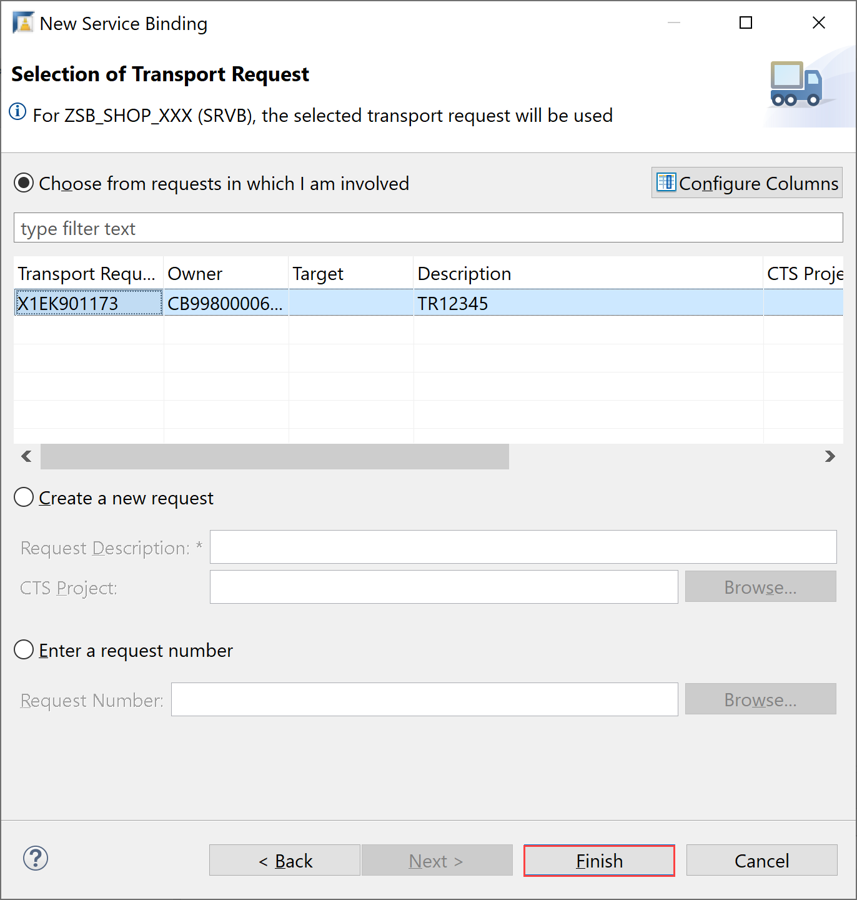

  4. Right-click your service binding `ZSB_SHOP_XXX` and select **Activate**.

      

   5. Click **Publish** to publish your service binding.

      


### Run SAP Fiori Elements preview


 1. Select `online_shop` in your service binding and click **Preview** to open SAP Fiori Elements preview.

    

 2. Click **Create** to create a new entry.

     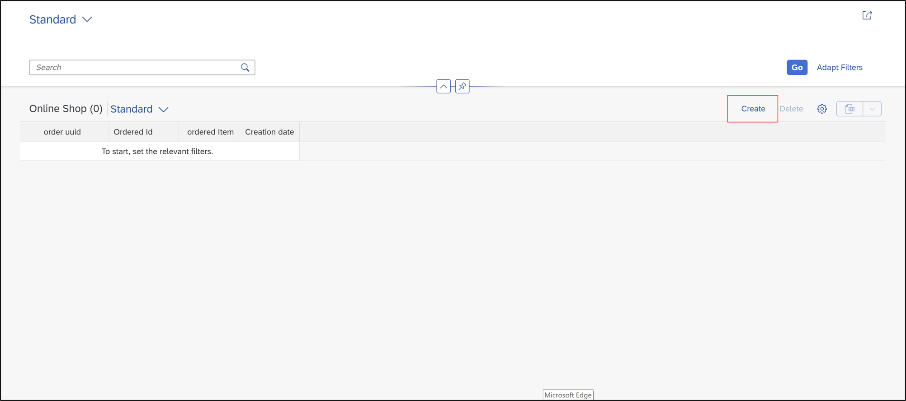

 3. Enter an id and click **Create**.

     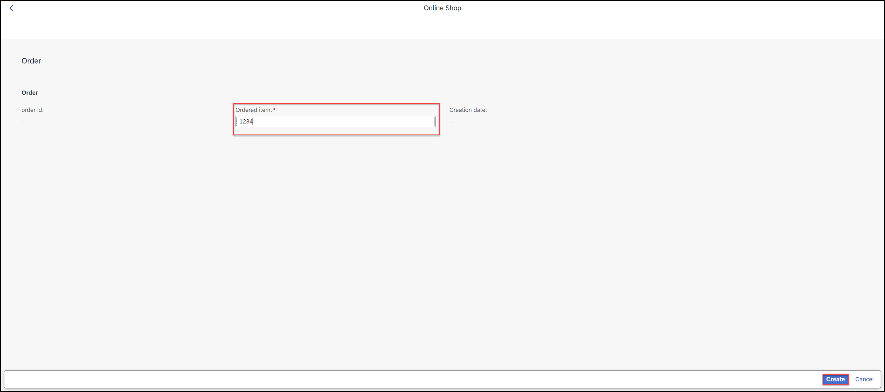

 4. Click **Create** again. And click **Close**

     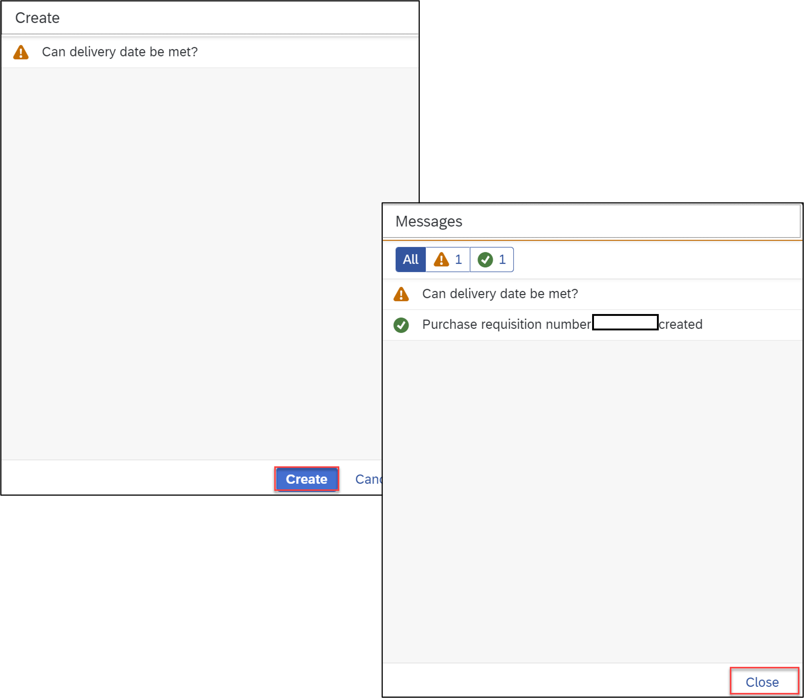

 4. Check your result.

     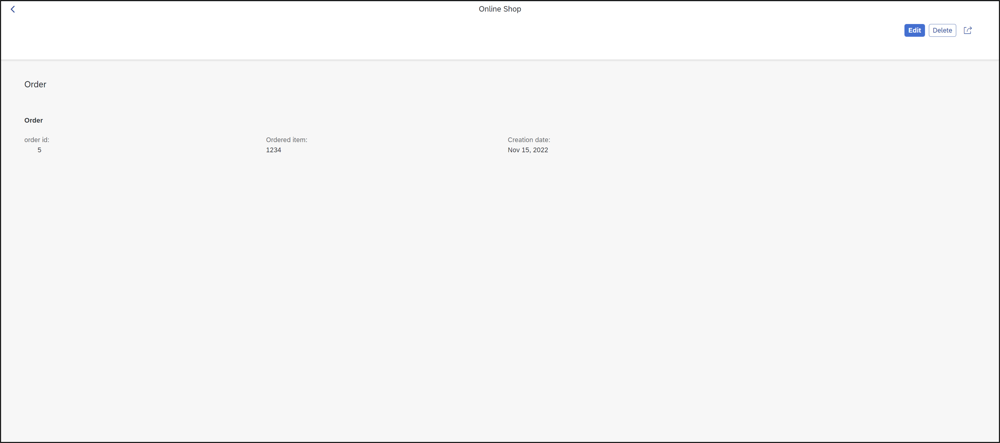


### Check purchase requisition


 1. In the Project Explorer, select your system and right click on **Properties**.

     

 1. Select **ABAP Development** and copy the system URL without `-api`, paste it in a browser and **log in**.

     

 2. Select the **Manage Purchase Requisitions** tile.

     

 3. Click **Go**.

     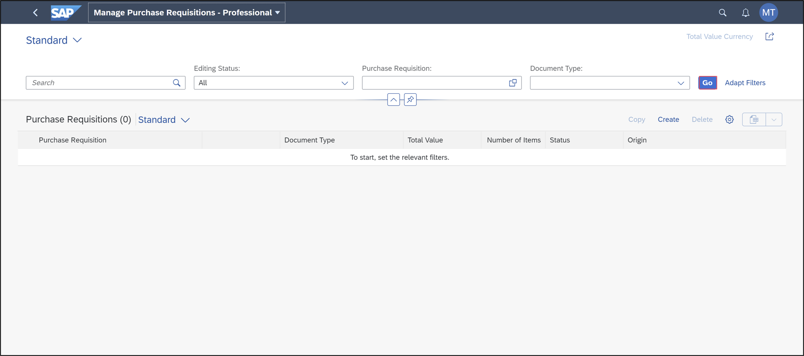

 4. Select your purchase requisition.

     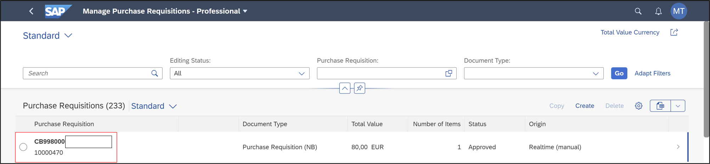

 5. Check your purchase requisition item and select it. Your ID should appear here instead of XXX.

     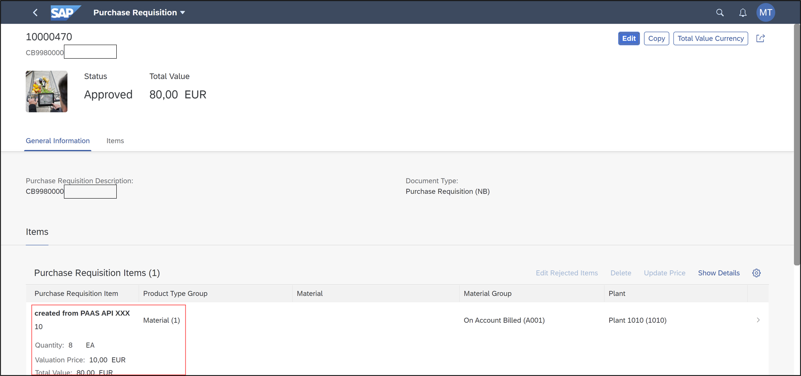

 6. Select **Notes** and check your item text. Your ID should appear here instead of XXX.
     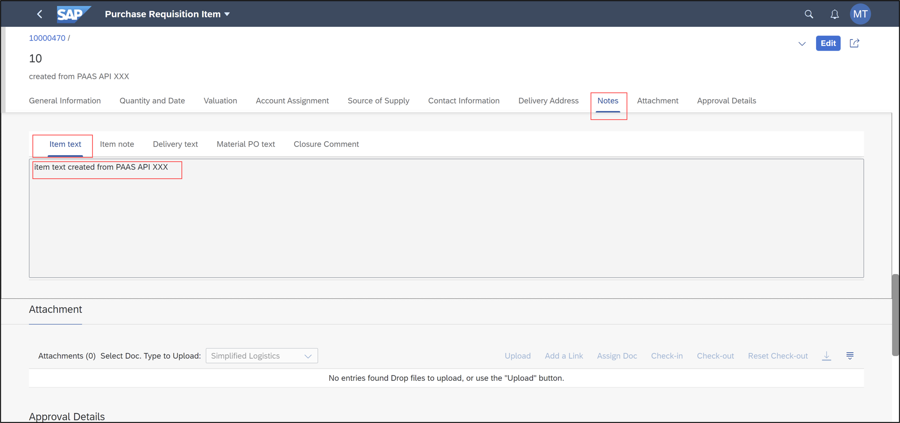

 7. Check your item note. Your ID should appear here instead of XXX.

     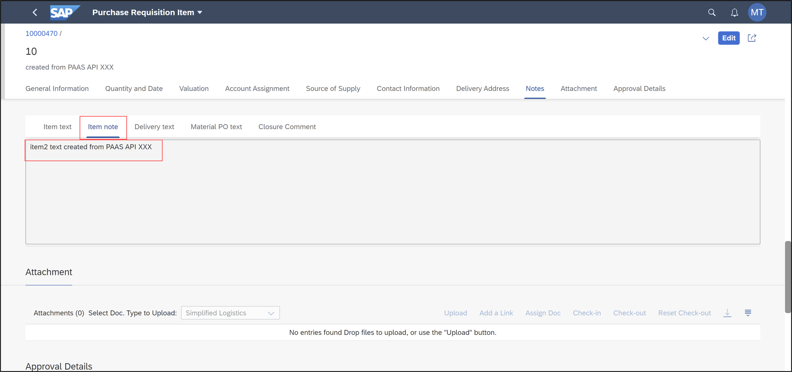


### Test yourself
