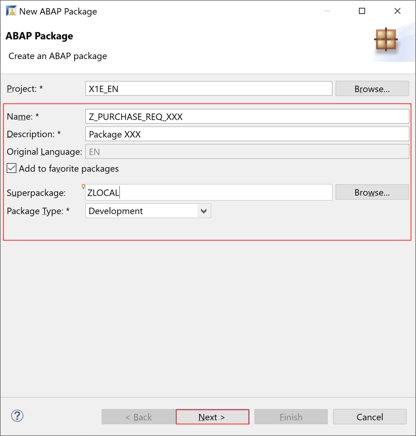
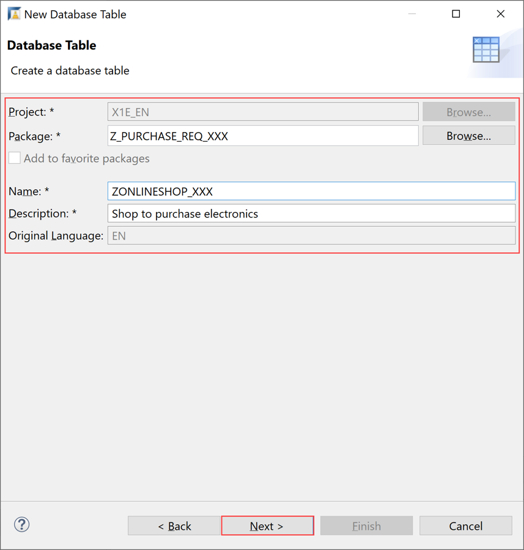
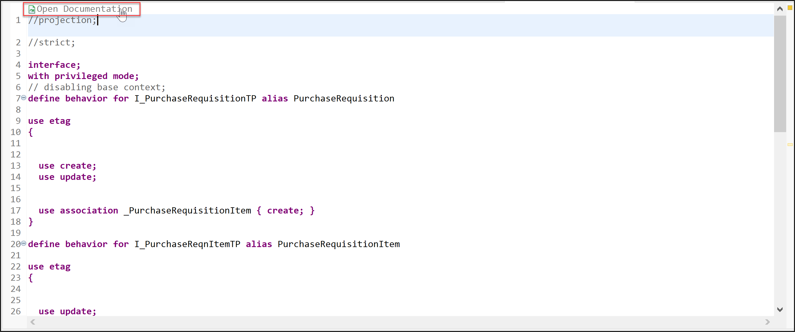
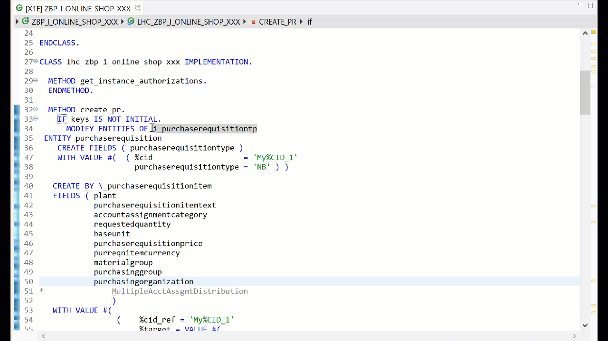
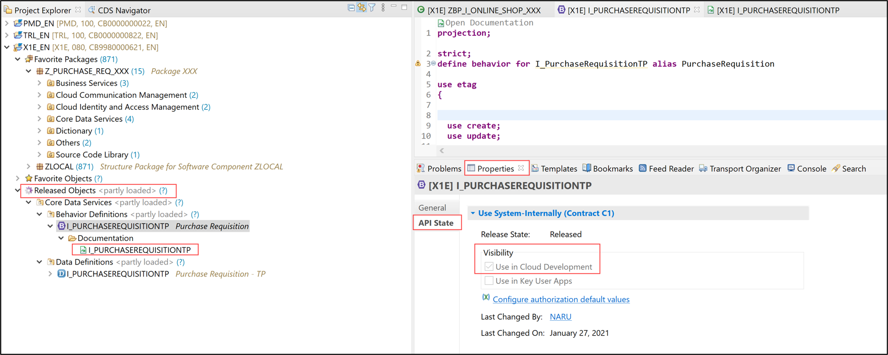
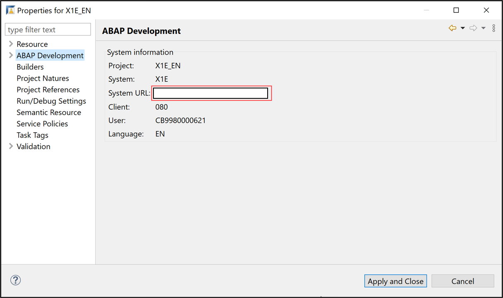
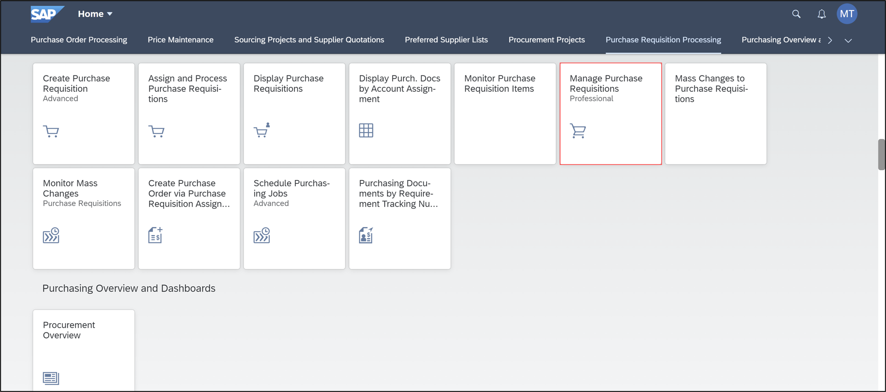

# Create a Custom RAP Business Object to Trigger Purchase Requisitions API
<!-- description --> Create a custom RAP business object to trigger purchase requisitions API with SAP S/4HANA Cloud ABAP Environment.

In the online shop, customers can order various items. Once an item is ordered, a new purchase requisition is created via purchase requisitions API.

[EML](https://help.sap.com/viewer/923180ddb98240829d935862025004d6/Cloud/en-US/af7782de6b9140e29a24eae607bf4138.html) can be used to trigger purchase requisitions API, which is released for cloud development.


## Prerequisites  
- You have a license for SAP S/4HANA Cloud and have a developer user in it
- You have installed the latest [Eclipse with ADT](abap-install-adt).
- Business role `SAP_BR_PURCHASER` needs to be assign to your business user
- Use Starter Development Tenant in S/4HANA Cloud for the tutorial to have necessary sample data in place. See [3-System Landscape and Transport Management](https://help.sap.com/docs/SAP_S4HANA_CLOUD/a630d57fc5004c6383e7a81efee7a8bb/e022623ec1fc4d61abb398e411670200.html?state=DRAFT&version=2208.503).

## You will learn  
- How to logon to SAP S/4HANA Cloud ABAP Environment
- How to create an ABAP package
- How to create a database table
- How to create a CDS model and projection view
- How to create behavior definition & implementation
- How to create service definition & service binding
- How to run SAP Fiori Elements Preview

## Intro
In this tutorial, wherever X/XXX/#/### appears, use a number (e.g. 000).

---
### Logon to SAP S/4HANA Cloud ABAP Environment


  1. Open Eclipse, select **File** > **New** > **Other**.

      

  2. Search **ABAP Cloud Project**, select it and click **Next >**.

      

  3. Select **SAP S/4HANA Cloud ABAP Environment**, enter the ABAP service instance URL and click **Next >**.

      

  4. Click **Open Logon Page in Browser** to log in.

      

    >The administrator receives an welcome e-mail after provisioning. This e-mail includes the system URL. By removing `/ui` you can log into the SAP S/4HANA Cloud ABAP Environment system. Further information can be found [here](https://help.sap.com/docs/SAP_S4HANA_CLOUD/6aa39f1ac05441e5a23f484f31e477e7/4b962c243a3342189f8af460cc444883.html?locale=en-US&state=DRAFT).

  5. Click **Next >**.

      

  6. Check your ABAP service instance connection and click **Finish**.

      

  7. Now your project will be available in the project explorer.

      


### Create ABAP package


  1.  Select **ZLOCAL** > **New** > **ABAP Package**.

      

  2.  Create new **ABAP package**:
       - Name: **`Z_PURCHASE_REQ_XXX`**
       - Description: Package XXX
       - Check **Add to favorite packages**

      

       Click **Next >**.

  3.  Create a new request:
      -  Request Description: TR12345

      

       Click **Finish**.


### Create database table

  1. Right-click your package `Z_PURCHASE_REQ_XXX` and select **New** > **Other ABAP Repository Object**.

      

  2. Search for **database table**, select it and click **Next >**.

      

  3. Create new database table:
     - Name: `ZAONLINESHOP_XXX `
     - Description: Shop to purchase electronics

      

       Click **Next >**.

  4. Click **Finish**.

      

  5. Replace your code with following:

    ```ABAP
    @EndUserText.label : 'Shop to purchase electronics'
    @AbapCatalog.enhancement.category : #EXTENSIBLE_ANY
    @AbapCatalog.tableCategory : #TRANSPARENT
    @AbapCatalog.deliveryClass : #A
    @AbapCatalog.dataMaintenance : #RESTRICTED
    define table zaonlineshop_xxx {

      key client            : abap.clnt not null;
      key order_uuid        : sysuuid_x16 not null;
      order_id              : abap.numc(8) not null;
      ordered_item          : abap.char(10) not null;
      @Semantics.amount.currencyCode : 'zaonlineshop_xxx.currency'
      price                 : abap.curr(11,2);
      @Semantics.amount.currencyCode : 'zaonlineshop_xxx.currency'
      total_price           : abap.curr(11,2);
      currency              : abap.cuky;
      order_quantity        : abap.numc(4);
      delivery_date         : abap.dats;
      overall_status        : abap.char(30);
      notes                 : abap.string(256);
      created_by            : abp_creation_user;
      created_at            : abp_creation_tstmpl;
      last_changed_by       : abp_lastchange_user;
      last_changed_at       : abp_lastchange_tstmpl;
      local_last_changed_at : abp_locinst_lastchange_tstmpl;
      purchase_requisition  : abap.char(10);
      pr_creation_date      : abap.dats;
    }
    ```

   6. Save and activate.


### Generate transactional UI services


  1. Right-click your database table `ZAONLINESHOP_XXX` and select **Generate ABAP Repository Objects**.

      

  2. Create new **ABAP repository object**:
     - Description: **Purchase Requisition XXX**
     - Generator: **ABAP RESTful Application Programming Model: UI Service**

      

       Click **Next >**.

  3. Maintain the required information on the **Configure Generator** dialog to provide the name of your data model and generate them.         
     
     For that, navigate through the wizard tree **(Business Objects, Data Model, etc...)**, maintain the artefact names provided in the table below, and press **Next >**.

     Verify the maintained entries and press **Next >** to confirm. The needed artifacts will be generated.

     **Please note**: Error Invalid XML format.   

     If you receive an error message **Invalid XML format of the response**, this may be due to a bug in version 1.26 of the ADT tools. An update of your ADT plugin to version 1.26.3 will fix this issue.

    | **RAP Layer**                          | **Artefacts**           | **Artefact Names**                                  |
    |----------------------------------------|-------------------------|-----------------------------------------------------|
    | **Business Object**                    |                         |                                                     |
    |                                        | **Data Model**          | Data Definition Name: **`ZR_ONLINESHOPTP_###`**     |
    |                                        |                         | Alias Name: **`OnlineShop`**                        |  
    |                                        | **Behavior**            | Implementation Class: **`ZBP_ONLINESHOPTP_###`**    |
    |                                        |                         | Draft Table Name: **`ZDONLINESHOP_###`**            |  
    | **Service Projection (BO Projection)** |                         | Name: **`ZC_ONLINESHOPTP_###`**                     |
    | **Business Services**                  |                         |                                                     |
    |                                        | **Service Definition**  | Name: **`ZUI_ONLINESHOP_###`**                      |
    |                                        | **Service Binding**     | Name: **`ZUI_ONLINESHOP_O4_###`**                   |
    |                                        |                         | Binding Type: **`OData V4 - UI`**                   |

                        

    Click **Next >**.

  5. Click **Finish**.

      


### Create structure

  1. Right-click **Dictionary** and select **New > Structure**.

      

  2. Create new **structure**:
     - Name: **`ZAONLINESHOP_X`**
     - Description: Structure XXX

      

       Click **Next >**.

  3. Click **Finish**.

      

  4. Replace the code for your structure `ZAONLINESHOP_X` with following:

    ```ABAP
    @EndUserText.label : 'Structure XXX'
    @AbapCatalog.enhancement.category : #NOT_EXTENSIBLE
    define structure zaonlineshop_x {

      order_id              : abap_boolean;
      ordered_item          : abap_boolean;
      price                 : abap_boolean;
      total_price           : abap_boolean;
      currency              : abap_boolean;
      order_quantity        : abap_boolean;
      delivery_date         : abap_boolean;
      overall_status        : abap_boolean;
      notes                 : abap_boolean;
      created_by            : abap_boolean;
      created_at            : abap_boolean;
      last_changed_by       : abap_boolean;
      last_changed_at       : abap_boolean;
      local_last_changed_at : abap_boolean;
      purchase_requisition  : abap_boolean;
      pr_creation_date      : abap_boolean;
    }
    ```
  
    >Please replace **`X`** and **`XXX`** with your ID. 

   5. Save and activate.


### Enhance behavior definition of data model


  1. Open your behavior definition **`ZR_ONLINESHOPTP_XXX`** to enhance it. Delete following line:
  
    ```ABAP
    persistent table zaonlineshop_xxx 
    ```

     

  2. Add the unmanaged save statement to your behavior definition:

    ```ABAP
    with unmanaged save
    ``` 

     
  
  3. Add the following statements to your behavior definition:

    ```ABAP
    ,
    PurchaseRequisition,
    PrCreationDate,
    DeliveryDate;
    ```

     

  4. Add the following statements to your behavior definition:

    ```ABAP
    update(features: instance) ;
    .
    .
    draft action(features: instance) Edit;
    ```

     

  5. Add the following statements to your behavior definition:

    ```ABAP
    draft determine action Prepare { validation checkOrderedQuantity;  validation checkDeliveryDate;}
        determination setInitialOrderValues on modify { create; }
        determination calculateTotalPrice on modify { create; field Price; } //ToDo: add side-effects with 2302
      validation checkOrderedQuantity on save { create; field OrderQuantity; }
      validation checkDeliveryDate on save { create; field DeliveryDate; }
      event sendPurchaseRequisitionDetails parameter zabs_purchaserequisition;

    action(features:instance) createPurchaseRequisitionItem  result [1] $self;
      mapping for ZAONLINESHOP_xxx control zaonlineshop_# corresponding
    ```
   
     

    >Please replace **`#`**, **`X`** and **`XXX`** with your ID. 

  6. Check your behavior definition:

    ```ABAP
    managed implementation in class ZBP_ONLINESHOPTP_XXX unique;
    strict ( 2 );
    with draft;

    define behavior for ZR_ONLINESHOPTP_XXX alias OnlineShop

    draft table ZDONLINESHOP_XXX
    etag master LocalLastChangedAt
    lock master total etag LastChangedAt
    authorization master( global )
    with unmanaged save
    {
      field ( readonly )
      OrderUUID,
      CreatedAt,
      CreatedBy,
      LastChangedAt,
      LastChangedBy,
      LocalLastChangedAt,
      PurchaseRequisition,
      PrCreationDate,
      DeliveryDate;

      field ( numbering : managed )
      OrderUUID;


      create;
      update(features: instance) ;
      delete;

      draft action(features: instance) Edit;
      draft action Activate;
      draft action Discard;
      draft action Resume;
      draft determine action Prepare { validation checkOrderedQuantity;  validation checkDeliveryDate;}
        determination setInitialOrderValues on modify { create; }
        determination calculateTotalPrice on modify { create; field Price; } //ToDo: add side-effects with 2302
      validation checkOrderedQuantity on save { create; field OrderQuantity; }
      validation checkDeliveryDate on save { create; field DeliveryDate; }
      event sendPurchaseRequisitionDetails parameter zabs_purchaserequisition;

    action(features:instance) createPurchaseRequisitionItem  result [1] $self;
      mapping for ZAONLINESHOP_XXX control zaonlineshop_# corresponding
      {
        OrderUUID = order_uuid;
        OrderID = order_id;
        OrderedItem = ordered_item;
        Price = price;
        TotalPrice = total_price;
        Currency = currency;
        OrderQuantity = order_quantity;
        DeliveryDate = delivery_date;
        OverallStatus = overall_status;
        Notes = notes;
        CreatedBy = created_by;
        CreatedAt = created_at;
        LastChangedBy = last_changed_by;
        LastChangedAt = last_changed_at;
        LocalLastChangedAt = local_last_changed_at;
        PurchaseRequisition = purchase_requisition;
        PrCreationDate = pr_creation_date;
      }
    }
    ```

   3. Save and activate. 

### Enhance behavior definition of projection view


  1. Open your behavior definition **`ZC_ONLINESHOPTP_XXX`** to enhance it. Add action `createPurchaseRequisitionItem` to your behavior definition.

    ```ABAP
    use action createPurchaseRequisitionItem;
    ```
    
    

  2. Check your behavior definition:

    ```ABAP
    projection;
    strict ( 2 );
    use draft;

    define behavior for ZC_ONLINESHOPTP_XXX alias OnlineShop
    use etag

    {
      use create;
      use update;
      use delete;

      use action Edit;
      use action Activate;
      use action Discard;
      use action Resume;
      use action Prepare;
      use action createPurchaseRequisitionItem;
    }
    ```

   3. Save and activate.


### Enhance metadata extension


  1. Open your metadata extension **`ZC_ONLINESHOPTP_XXX`** to enhance it. Add following annotation to `PurchaseRequisition`.

    ```ABAP
    ,
 
    { type: #FOR_ACTION, dataAction: 'createPurchaseRequisitionItem', label: 'Create purchase requisition item' } ] 
    @UI.identification: [ {
      position: 100 , 
      label: 'PurchaseRequisition'
    }]
    PurchaseRequisition;
    ```

    

  2. Check your metadata extension:

    ```ABAP
    @Metadata.layer: #CUSTOMER
    @UI: {
      headerInfo: {
        typeName: 'OnlineShop', 
        typeNamePlural: 'OnlineShops'
      }
    }

    annotate view ZC_ONLINESHOPTP_XXX with
    {
      @UI.facet: [ {
        id: 'idIdentification', 
        type: #IDENTIFICATION_REFERENCE, 
        label: 'OnlineShop', 
        position: 10 
      } ]
      @UI.hidden: true
      OrderUUID;
      
      @UI.lineItem: [ {
        position: 10 , 
        importance: #MEDIUM, 
        label: 'OrderID'
      } ]
      @UI.identification: [ {
        position: 10 , 
        label: 'OrderID'
      } ]
      OrderID;
      
      @UI.lineItem: [ {
        position: 20 , 
        importance: #MEDIUM, 
        label: 'OrderedItem'
      } ]
      @UI.identification: [ {
        position: 20 , 
        label: 'OrderedItem'
      } ]
      OrderedItem;
      
      @UI.lineItem: [ {
        position: 30 , 
        importance: #MEDIUM, 
        label: 'Price'
      } ]
      @UI.identification: [ {
        position: 30 , 
        label: 'Price'
      } ]
      Price;
      
      @UI.lineItem: [ {
        position: 40 , 
        importance: #MEDIUM, 
        label: 'TotalPrice'
      } ]
      @UI.identification: [ {
        position: 40 , 
        label: 'TotalPrice'
      } ]
      TotalPrice;
      
      @UI.lineItem: [ {
        position: 50 , 
        importance: #MEDIUM, 
        label: 'Currency'
      } ]
      @UI.identification: [ {
        position: 50 , 
        label: 'Currency'
      } ]
      Currency;
      
      @UI.lineItem: [ {
        position: 60 , 
        importance: #MEDIUM, 
        label: 'OrderQuantity'
      } ]
      @UI.identification: [ {
        position: 60 , 
        label: 'OrderQuantity'
      } ]
      OrderQuantity;
      
      @UI.lineItem: [ {
        position: 70 , 
        importance: #MEDIUM, 
        label: 'DeliveryDate'
      } ]
      @UI.identification: [ {
        position: 70 , 
        label: 'DeliveryDate'
      } ]
      DeliveryDate;
      
      @UI.lineItem: [ {
        position: 80 , 
        importance: #MEDIUM, 
        label: 'OverallStatus'
      } ]
      @UI.identification: [ {
        position: 80 , 
        label: 'OverallStatus'
      } ]
      OverallStatus;
      
      @UI.lineItem: [ {
        position: 90 , 
        importance: #MEDIUM, 
        label: 'Notes'
      } ]
      @UI.identification: [ {
        position: 90 , 
        label: 'Notes'
      } ]
      Notes;
      
      @UI.hidden: true
      LocalLastChangedAt;
      
      @UI.lineItem: [ {
        position: 100 , 
        importance: #MEDIUM, 
        label: 'PurchaseRequisition'
      },

      { type: #FOR_ACTION, dataAction: 'createPurchaseRequisitionItem', label: 'Create purchase requisition item' } ] 
      @UI.identification: [ {
        position: 100 , 
        label: 'PurchaseRequisition'
      }]
      PurchaseRequisition;
      
      @UI.lineItem: [ {
        position: 110 , 
        importance: #MEDIUM, 
        label: 'PrCreationDate'
      } ]
      @UI.identification: [ {
        position: 110 , 
        label: 'PrCreationDate'
      } ]
      PrCreationDate;
    }
    ```

   3. Save and activate.


### Open documentation


You have 2 options to open the documentation inside ADT.


> **Option 1**:

>  1. Open your ABAP class **`zbp_i_online_shop_xxx`**, search for `i_purchaserequisitiontp`, press CTRL and click on it.
      
>  2. Now you are in the released object `i_purchaserequisitiontp`.
     Click **Open Documentation** to open it.
      
>  3. Now you are able to read the documentation.
      

>     You can also open the Element Info by clicking `i_purchaserequisitiontp` and pressing **`F2`**.
>       

>     You can also switch to different layers inside the Element Info.
>       

> **Option 2**:

> 1. Go back to tab `i_purchaserequisitiontp`. You are now able to see the behavior definition folder of the released object `i_purchaserequisitiontp`  in the project explorer. Now navigate to the documentation `i_purchaserequisitiontp` and open it.
      
>      You can also check the API State of released object and see its visibility by selecting the properties.
> 2. Now you can see the documentation.
      

 
### Enhance behavior implementation

Please replace **`X`**, **`#`** and **`XXX`** with your ID. 

  1. In your **Global Class**, replace your code with following:

    ```ABAP
    class ZBP_ONLINESHOPTP_XXX DEFINITION PUBLIC ABSTRACT FINAL FOR BEHAVIOR OF zr_onlineshoptp_xxx.
    PUBLIC SECTION.
      CLASS-DATA mapped_purchase_requisition TYPE response for mapped i_purchaserequisitiontp.

    ENDCLASS.


    CLASS zbp_onlineshoptp_xxx IMPLEMENTATION.
    ENDCLASS.
    ```

  2. In your **Local Types**, replace your code with following:

    ```ABAP
    CLASS lhc_OnlineShop DEFINITION INHERITING FROM cl_abap_behavior_handler.
    PRIVATE SECTION.
        CONSTANTS:
          BEGIN OF is_draft,
            false TYPE abp_behv_flag VALUE '00', " active (not draft)
            true  TYPE abp_behv_flag VALUE '01', " draft
          END OF is_draft.
        CONSTANTS:
          BEGIN OF c_overall_status,
            new       TYPE string VALUE 'New / Composing',
    *        composing  TYPE string VALUE 'Composing...',
            submitted TYPE string VALUE 'Submitted / Approved',
            cancelled TYPE string VALUE 'Cancelled',
          END OF c_overall_status.
        METHODS: get_global_authorizations FOR GLOBAL AUTHORIZATION
          IMPORTING REQUEST requested_authorizations FOR OnlineShop RESULT result,
        createPruchaseRequisitionItem FOR MODIFY
          IMPORTING keys FOR ACTION OnlineShop~createPurchaseRequisitionItem RESULT result,
          get_instance_features FOR INSTANCE FEATURES
            IMPORTING keys REQUEST requested_features FOR onlineshop RESULT result,
                setInitialOrderValues FOR DETERMINE ON MODIFY
                      IMPORTING keys FOR OnlineShop~setInitialOrderValues,
                calculateTotalPrice FOR DETERMINE ON MODIFY
                      IMPORTING keys FOR OnlineShop~calculateTotalPrice.

                    METHODS checkDeliveryDate FOR VALIDATE ON SAVE
                      IMPORTING keys FOR OnlineShop~checkDeliveryDate.

                    METHODS checkOrderedQuantity FOR VALIDATE ON SAVE
                      IMPORTING keys FOR OnlineShop~checkOrderedQuantity.

    ENDCLASS.

    CLASS lhc_OnlineShop IMPLEMENTATION.

      METHOD get_global_authorizations.
      ENDMETHOD.

      METHOD createPruchaseRequisitionItem.
        DATA: purchase_requisitions      TYPE TABLE FOR CREATE I_PurchaserequisitionTP,
              purchase_requisition       TYPE STRUCTURE FOR CREATE I_PurchaserequisitionTP,
              purchase_requisition_items TYPE TABLE FOR CREATE i_purchaserequisitionTP\_PurchaseRequisitionItem,
              purchase_requisition_item  TYPE STRUCTURE FOR CREATE i_purchaserequisitiontp\\purchaserequisition\_purchaserequisitionitem,
              purchase_reqn_acct_assgmts TYPE TABLE FOR CREATE I_PurchaseReqnItemTP\_PurchaseReqnAcctAssgmt,
              purchase_reqn_acct_assgmt  TYPE STRUCTURE FOR CREATE I_PurchaseReqnItemTP\_PurchaseReqnAcctAssgmt,
              purchase_reqn_item_texts   TYPE TABLE FOR CREATE I_PurchaseReqnItemTP\_PurchaseReqnItemText,
              purchase_reqn_item_text    TYPE STRUCTURE FOR CREATE I_PurchaseReqnItemTP\_PurchaseReqnItemText,
              update_lines               TYPE TABLE FOR UPDATE zr_onlineshoptp_xxx\\OnlineShop,
              update_line                TYPE STRUCTURE FOR UPDATE zr_onlineshoptp_xxx\\OnlineShop,
              delivery_date              TYPE I_PurchaseReqnItemTP-DeliveryDate,
              requested_quantity         TYPE I_PurchaseReqnItemTP-RequestedQuantity.

    *    delivery_date = cl_abap_context_info=>get_system_date(  ) + 14.

        "read transfered order instances
        READ ENTITIES OF zr_onlineshoptp_xxx IN LOCAL MODE
          ENTITY OnlineShop
            ALL FIELDS WITH
            CORRESPONDING #( keys )
          RESULT DATA(OnlineOrders).

        DATA n TYPE i.

        LOOP AT OnlineOrders INTO DATA(OnlineOrder).
          n += 1.
          "purchase requisition
          purchase_requisition = VALUE #(  %cid                   = |My%CID_{ n }|
                                            purchaserequisitiontype  = 'NB'  ) .
          APPEND purchase_requisition TO purchase_requisitions.

          "purchase requisition item
          purchase_requisition_item = VALUE #(
                                            %cid_ref = |My%CID_{ n }|
                                            %target  = VALUE #(  (
                                                          %cid                         = |My%ItemCID_{ n }|
                                                          plant                        = '1010'  "Plant 01 (DE)
                                                          accountassignmentcategory    = 'U'  "unknown
    *                                                       PurchaseRequisitionItemText  =  . "retrieved automatically from maintained MaterialInfo
                                                          requestedquantity            = OnlineOrder-OrderQuantity
                                                          purchaserequisitionprice     = OnlineOrder-Price
                                                          purreqnitemcurrency          = OnlineOrder-Currency
                                                          Material                     = 'D001'
                                                          materialgroup                = 'A001'
                                                          purchasinggroup              = '001'
                                                          purchasingorganization       = '1010'
                                                          DeliveryDate                 = OnlineOrder-DeliveryDate   "delivery_date  "yyyy-mm-dd (at least 10 days)
                                                          CreatedByUser                = OnlineOrder-CreatedBy
                                                          ) ) ).
          APPEND purchase_requisition_item TO purchase_requisition_items.

          "purchase requisition account assignment
          purchase_reqn_acct_assgmt = VALUE #(
                                              %cid_ref = |My%ItemCID_{ n }|
                                              %target  = VALUE #( (
                                                            %cid       = |My%AccntCID_{ n }|
                                                            CostCenter = 'JMW-COST'
                                                            GLAccount  = '0000400000' ) ) ) .
          APPEND purchase_reqn_acct_assgmt TO purchase_reqn_acct_assgmts .

          "purchase requisition item text
          purchase_reqn_item_text    =  VALUE #(
                                              %cid_ref = |My%ItemCID_{ n }|
                                              %target  = VALUE #( (
                                                            %cid           = |My%TextCID_{ n }|
                                                            textobjecttype = 'B01'
                                                            language       = 'E'
                                                            plainlongtext  = OnlineOrder-Notes
                                                        )  )  ) .
          APPEND purchase_reqn_item_text TO purchase_reqn_item_texts.
        ENDLOOP.

        "EML deep create statement
        IF keys IS NOT INITIAL.
          "purchase reqn
          MODIFY ENTITIES OF i_purchaserequisitiontp
            ENTITY purchaserequisition
              CREATE FIELDS ( purchaserequisitiontype )
              WITH purchase_requisitions
            "purchase reqn item
            CREATE BY \_purchaserequisitionitem
              FIELDS ( plant
    *                   purchaserequisitionitemtext
                      accountassignmentcategory
                      requestedquantity
                      baseunit
                      purchaserequisitionprice
                      purreqnitemcurrency
                      Material
                      materialgroup
                      purchasinggroup
                      purchasingorganization
                      DeliveryDate
                    )
            WITH purchase_requisition_items
          "purchase reqn account assignment
          ENTITY purchaserequisitionitem
            CREATE BY \_purchasereqnacctassgmt
                FIELDS ( CostCenter
                        GLAccount
                        Quantity
                        BaseUnit )
                WITH purchase_reqn_acct_assgmts
            "purchase reqn item text
            CREATE BY \_purchasereqnitemtext
                FIELDS ( plainlongtext )
                WITH purchase_reqn_item_texts
          REPORTED DATA(reported_create_pr)
          MAPPED DATA(mapped_create_pr)
          FAILED DATA(failed_create_pr).
        ENDIF.
        "retrieve the generated
        zbp_onlineshoptp_xxx=>mapped_purchase_requisition-purchaserequisition = mapped_create_pr-purchaserequisition.

        "set a flag to check in the save sequence that purchase requisition has been created
        "the correct value for PurchaseRequisition has to be calculated in the save sequence using convert key
        LOOP AT keys INTO DATA(key).
          update_line-%tky           = key-%tky.
          update_line-OverallStatus  = c_overall_status-submitted. "'Submitted / Approved'.
          APPEND update_line TO update_lines.
        ENDLOOP.

        MODIFY ENTITIES OF zr_onlineshoptp_xxx IN LOCAL MODE
          ENTITY OnlineShop
            UPDATE
            FIELDS (  OverallStatus  )
            WITH update_lines
          REPORTED reported
          FAILED failed
          MAPPED mapped.

        IF failed IS INITIAL.
          "Read the changed data for action result
          READ ENTITIES OF zr_onlineshoptp_xxx IN LOCAL MODE
            ENTITY OnlineShop
              ALL FIELDS WITH
              CORRESPONDING #( keys )
            RESULT DATA(result_read).
          "return result entities
          result = VALUE #( FOR order_2 IN result_read ( %tky   = order_2-%tky
                                                        %param = order_2 ) ).
        ENDIF.
    endmethod.

    METHOD get_instance_features.
        " read relevant olineShop instance data
        READ ENTITIES OF zr_onlineshoptp_xxx IN LOCAL MODE
          ENTITY OnlineShop
            FIELDS ( OverallStatus )
            WITH CORRESPONDING #( keys )
          RESULT DATA(OnlineOrders)
          FAILED failed.

        "ToDo: dynamic feature control is currently not working for the action cancel order

        " evaluate condition, set operation state, and set result parameter
        " update and checkout shall not be allowed as soon as purchase requisition has been created
        result = VALUE #( FOR OnlineOrder IN OnlineOrders
                          ( %tky                   = OnlineOrder-%tky
                            %features-%action-createPurchaseRequisitionItem
                              = COND #( WHEN OnlineOrder-OverallStatus = c_overall_status-submitted THEN if_abap_behv=>fc-o-disabled
                                        WHEN OnlineOrder-%is_draft = is_draft-true THEN if_abap_behv=>fc-o-disabled
                                        WHEN OnlineOrder-OverallStatus = c_overall_status-cancelled THEN if_abap_behv=>fc-o-disabled
                                        ELSE if_abap_behv=>fc-o-enabled   )
                            %features-%update
                              = COND #( WHEN OnlineOrder-OverallStatus = c_overall_status-submitted  THEN if_abap_behv=>fc-o-disabled
                                        WHEN OnlineOrder-OverallStatus = c_overall_status-cancelled THEN if_abap_behv=>fc-o-disabled
                                        ELSE if_abap_behv=>fc-o-enabled   )
    *                         %features-%delete
    *                           = COND #( WHEN OnlineOrder-PurchaseRequisition IS NOT INITIAL THEN if_abap_behv=>fc-o-disabled
    *                                     WHEN OnlineOrder-OverallStatus = c_overall_status-cancelled THEN if_abap_behv=>fc-o-disabled
    *                                     ELSE if_abap_behv=>fc-o-enabled   )
                            %action-Edit
                              = COND #( WHEN OnlineOrder-OverallStatus = c_overall_status-submitted THEN if_abap_behv=>fc-o-disabled
                                        WHEN OnlineOrder-OverallStatus = c_overall_status-cancelled THEN if_abap_behv=>fc-o-disabled
                                        ELSE if_abap_behv=>fc-o-enabled   )

                            ) ).

      ENDMETHOD.
      METHOD setInitialOrderValues.
      DATA delivery_date TYPE I_PurchaseReqnItemTP-DeliveryDate.
        data(creation_date) = cl_abap_context_info=>get_system_date(  ).
        "set delivery date proposal
        delivery_date = cl_abap_context_info=>get_system_date(  ) + 14.
        "read transfered instances
        READ ENTITIES OF ZR_ONLINESHOPTP_XXX IN LOCAL MODE
          ENTITY OnlineShop
            FIELDS ( OrderID OverallStatus  DeliveryDate )
            WITH CORRESPONDING #( keys )
          RESULT DATA(OnlineOrders).

        "delete entries with assigned order ID
        DELETE OnlineOrders WHERE OrderID IS NOT INITIAL.
        CHECK OnlineOrders IS NOT INITIAL.

        " **Dummy logic to determine order IDs**
        " get max order ID from the relevant active and draft table entries
        SELECT MAX( order_id ) FROM zaonlineshop_xxx INTO @DATA(max_order_id). "active table
        SELECT SINGLE FROM zdonlineshop_xxx FIELDS MAX( orderid ) INTO @DATA(max_orderid_draft). "draft table
        IF max_orderid_draft > max_order_id.
          max_order_id = max_orderid_draft.
        ENDIF.

        "set initial values of new instances
        MODIFY ENTITIES OF ZR_ONLINESHOPTP_XXX IN LOCAL MODE
          ENTITY OnlineShop
            UPDATE FIELDS ( OrderID OverallStatus  DeliveryDate Price  )
            WITH VALUE #( FOR order IN OnlineOrders INDEX INTO i (
                              %tky          = order-%tky
                              OrderID       = max_order_id + i
                              OverallStatus = c_overall_status-new  "'New / Composing'
                              DeliveryDate  = delivery_date
                              CreatedAt     = creation_date
                            ) ).
      ENDMETHOD.

    METHOD checkOrderedQuantity.
        "read relevant order instance data
        READ ENTITIES OF zr_onlineshoptp_xxx IN LOCAL MODE
        ENTITY OnlineShop
        FIELDS ( OrderID OrderedItem OrderQuantity )
        WITH CORRESPONDING #( keys )
        RESULT DATA(OnlineOrders).

        "raise msg if 0 > qty <= 10
        LOOP AT OnlineOrders INTO DATA(OnlineOrder).
          APPEND VALUE #(  %tky           = OnlineOrder-%tky
                          %state_area    = 'VALIDATE_QUANTITY'
                        ) TO reported-onlineshop.

      IF OnlineOrder-OrderQuantity IS INITIAL OR OnlineOrder-OrderQuantity = ' '.
            APPEND VALUE #( %tky = OnlineOrder-%tky ) TO failed-onlineshop.
            APPEND VALUE #( %tky          = OnlineOrder-%tky
                            %state_area   = 'VALIDATE_QUANTITY'
                            %msg          = new_message_with_text(
                                    severity = if_abap_behv_message=>severity-error
                                    text     = 'Quantity cannot be empty' )
                            %element-orderquantity = if_abap_behv=>mk-on
                          ) TO reported-onlineshop.

          ELSEIF OnlineOrder-OrderQuantity > 10.
            APPEND VALUE #(  %tky = OnlineOrder-%tky ) TO failed-onlineshop.
            APPEND VALUE #(  %tky          = OnlineOrder-%tky
                            %state_area   = 'VALIDATE_QUANTITY'
                            %msg          = new_message_with_text(
                                    severity = if_abap_behv_message=>severity-error
                                    text     = 'Quantity should be below 10' )

                            %element-orderquantity  = if_abap_behv=>mk-on
                          ) TO reported-onlineshop.
          ENDIF.
        ENDLOOP.
      ENDMETHOD.

      METHOD calculateTotalPrice.
        DATA total_price TYPE zr_onlineshoptp_xxx-TotalPrice.

        " read transfered instances
        READ ENTITIES OF zr_onlineshoptp_xxx IN LOCAL MODE
          ENTITY OnlineShop
            FIELDS ( OrderID TotalPrice )
            WITH CORRESPONDING #( keys )
          RESULT DATA(OnlineOrders).

        LOOP AT OnlineOrders ASSIGNING FIELD-SYMBOL(<OnlineOrder>).
          " calculate total value
          <OnlineOrder>-TotalPrice = <OnlineOrder>-Price * <OnlineOrder>-OrderQuantity.
        ENDLOOP.

        "update instances
        MODIFY ENTITIES OF zr_onlineshoptp_xxx IN LOCAL MODE
          ENTITY OnlineShop
            UPDATE FIELDS ( TotalPrice )
            WITH VALUE #( FOR OnlineOrder IN OnlineOrders (
                              %tky       = OnlineOrder-%tky
                              TotalPrice = <OnlineOrder>-TotalPrice
                            ) ).
      ENDMETHOD.

      METHOD checkdeliverydate.
    *   " read transfered instances
        READ ENTITIES OF zr_onlineshoptp_xxx IN LOCAL MODE
          ENTITY OnlineShop
            FIELDS ( DeliveryDate )
            WITH CORRESPONDING #( keys )
          RESULT DATA(OnlineOrders).

        DATA(creation_date) = cl_abap_context_info=>get_system_date(  ).
        "raise msg if 0 > qty <= 10
        LOOP AT OnlineOrders INTO DATA(online_order).


          IF online_order-DeliveryDate IS INITIAL OR online_order-DeliveryDate = ' '.
            APPEND VALUE #( %tky = online_order-%tky ) TO failed-onlineshop.
            APPEND VALUE #( %tky         = online_order-%tky
                            %state_area   = 'VALIDATE_DELIVERYDATE'
                            %msg          = new_message_with_text(
                                    severity = if_abap_behv_message=>severity-error
                                    text     = 'Delivery Date cannot be initial' )
                          ) TO reported-onlineshop.

          ELSEIF  ( ( online_order-DeliveryDate ) - creation_date ) < 14.
            APPEND VALUE #(  %tky = online_order-%tky ) TO failed-onlineshop.
            APPEND VALUE #(  %tky          = online_order-%tky
                            %state_area   = 'VALIDATE_DELIVERYDATE'
                            %msg          = new_message_with_text(
                                    severity = if_abap_behv_message=>severity-error
                                    text     = 'Delivery Date should be atleast 14 days after the creation date'  )

                            %element-orderquantity  = if_abap_behv=>mk-on
                          ) TO reported-onlineshop.
          ENDIF.
        ENDLOOP.
      ENDMETHOD.

    ENDCLASS.

    CLASS lsc_ZR_ONLINESHOPTP_XXX DEFINITION INHERITING FROM cl_abap_behavior_saver.
    PROTECTED SECTION.

      METHODS save_modified REDEFINITION.

      METHODS cleanup_finalize REDEFINITION.

    ENDCLASS.

    CLASS lsc_ZR_ONLINESHOPTP_XXX IMPLEMENTATION.

    METHOD save_modified.
      DATA : lt_online_shop_as        TYPE STANDARD TABLE OF zaonlineshop_xxx,
            ls_online_shop_as        TYPE                   zaonlineshop_xxx,
            lt_online_shop_x_control TYPE STANDARD TABLE OF zaonlineshop_#.
      IF create-onlineshop IS NOT INITIAL.
        lt_online_shop_as = CORRESPONDING #( create-onlineshop MAPPING FROM ENTITY ).
        INSERT zaonlineshop_xxx FROM TABLE @lt_online_shop_as.
      ENDIF.
      IF update IS NOT INITIAL.
        CLEAR lt_online_shop_as.
        lt_online_shop_as = CORRESPONDING #( update-onlineshop MAPPING FROM ENTITY ).
        lt_online_shop_x_control = CORRESPONDING #( update-onlineshop MAPPING FROM ENTITY ).
        LOOP AT update-onlineshop  INTO DATA(onlineshop) WHERE OrderUUID IS NOT INITIAL.
    *           select * from zaonlineshop_xxx where order_uuid = @onlineshop-OrderUUID into @data(ls_onlineshop) .
    *                      lt_online_shop_as = CORRESPONDING #( create-onlineshop MAPPING FROM ENTITY ).

          MODIFY zaonlineshop_xxx FROM TABLE @lt_online_shop_as.
    *           ENDSELECT.
        ENDLOOP.
      ENDIF.
      IF zbp_onlineshoptp_xxx=>mapped_purchase_requisition IS NOT INITIAL AND update IS NOT INITIAL.
        LOOP AT zbp_onlineshoptp_xxx=>mapped_purchase_requisition-purchaserequisition ASSIGNING FIELD-SYMBOL(<fs_pr_mapped>).
          CONVERT KEY OF i_purchaserequisitiontp FROM <fs_pr_mapped>-%pid TO DATA(ls_pr_key).
          <fs_pr_mapped>-purchaserequisition = ls_pr_key-purchaserequisition.
    *        ZBP_ONLINESHOPTP_xxx=>cv_pr_pid = <fs_pr_mapped>-%pid.
        ENDLOOP.
        LOOP AT update-onlineshop INTO  DATA(ls_online_shop) WHERE %control-OverallStatus = if_abap_behv=>mk-on.
          " Creates internal table with instance data
          DATA(creation_date) = cl_abap_context_info=>get_system_date(  ).
    *      update zaonlineshop_xxx FROM  @( VALUE #(  purchase_requisition = ls_pr_key-purchaserequisition  pr_creation_date =  creation_date order_id = ls_online_shop-OrderID  ) ).
          update zaonlineshop_xxx SET purchase_requisition = @ls_pr_key-purchaserequisition, pr_creation_date = @creation_date WHERE order_uuid = @ls_online_shop-OrderUUID.
        ENDLOOP.
        if ls_pr_key-purchaserequisition is not initial.


          raise entity event zr_onlineshoptp_xxx~sendPurchaseRequisitionDetails
            from value #(
              for prdet in update-onlineshop (
                  purchase_requisition = ls_pr_key-purchaserequisition
                  created_by       = prdet-CreatedBy
                  created_at          = prdet-CreatedAt
    *              email  = prdet-Email
                )
              ).
        endif.
      ENDIF.
    loop at delete-onlineshop into data(onlineshop_delete) WHERE OrderUUID is not INITIAL.
    delete from zaonlineshop_xxx where order_uuid = @onlineshop_delete-OrderUUID.
    delete from zdonlineshop_xxx where orderuuid = @onlineshop_delete-OrderUUID.
    endloop.
    ENDMETHOD.

    METHOD cleanup_finalize.
    ENDMETHOD.

    ENDCLASS.
    ```

   3. Save and activate.

    >The option **internal** can be set before the action name to only provide an action for the same BO. An internal action can only be accessed from the business logic inside the business object implementation such as from a determination or from another action.

   4. Go back to your behavior definition `ZR_ONLINESHOPTP_XXX` and activate it again, if needed. 


### Publish service binding and run SAP Fiori Elements preview


  1. Open your service binding **`ZUI_ONLINESHOP_O4_XXX`** and click **Publish**.

     

  2. Select **`OnlineShop`** in your service binding and click **Preview** to open SAP Fiori Elements preview.

     

 2. Click **Create** to create a new entry.

     

 3. Fill in all mandatory fields like in the screenshot below and click **Create**.

     

 4. Your order is now created.

    

 5. Go back to the online shop overview page, select your order entry and click **Create purchase requisition item**.

     

 6. Now a purchase requisition item got created. Copy the purchase requisition item number for later use.

     


### Check purchase requisition


 1. In the Project Explorer, select your system and right click on **Properties**.

     

 1. Select **ABAP Development** and copy the system URL without `-api`, paste it in a browser and **log in**.

     

 2. Select the **Manage Purchase Requisitions** tile.

     

 3. Search for your purchase requisition id and select your purchase requisition. 

     

 4. Check the purchase requisition description. Your `CB-User ID` and your purchase requisition id should be listed here.

     


### Test yourself
  