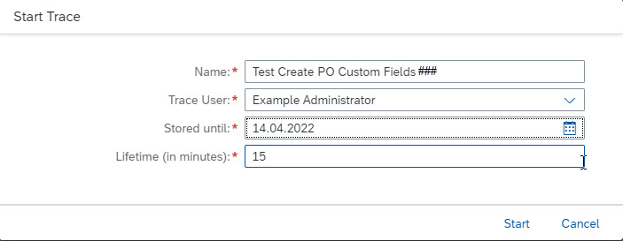

# Create Custom Logic Using Key User Extensibility and Perform Trace
<!-- description --> Create custom logic for an existing custom field in S/4HANA Cloud ABAP Environment, then check its parameters using the Custom Logic Tracing app

## Prerequisites
- You have a license for SAP S/4HANA Cloud
- You are familiar with Key User extensibility in SAP S/4HANA Cloud. If not, see the **More Information** section
- You are familiar with the app **Custom Logic Tracing**. If not, see the **More Information** section
- In SAP Fiori launchpad, you have the following authorizations:
    - **`SAP_BR_PURCHASER`** for the app **Create Purchase Order - Advanced**
    - **`SAP_BR_ADMINISTRATOR`** for **Custom Logic Tracing** and **Custom Logic**
- You have created a custom field using Key User extensibility **`yy1_zhdrprnt2_pdh_000`**
- In Custom Logic, you have created a `BAdI` implementation `YY1_FILLHEADERCUSTOMFIELDS_000` in the business context and `BAdI` definition **Modify Purchase Order Header (`MM_PUR_S4_PO_MODIFY_HEADER`)**


## You will learn
- How to create custom logic for an existing custom field in the app **Custom Fields**
- How to run a trace for the Fiori app **Create Purchase Order** in the app **Custom Logic Tracing**
- How to check the output value of this custom field using **Custom Logic Tracing**
- How to check the custom logic of this custom field, in **Custom Fields**

## Intro

>The administrator receives an welcome e-mail after provisioning. This e-mail includes the system URL. By removing `/ui` you can log into the SAP S/4HANA Cloud ABAP Environment system. Further information can be found [Developer Extensibility: Connect to the ABAP System](https://help.sap.com/docs/SAP_S4HANA_CLOUD/6aa39f1ac05441e5a23f484f31e477e7/4b962c243a3342189f8af460cc444883.html?locale=en-US).


Throughout this tutorial, the placeholder `###` or `000` is used. Always replace this with your initials or group number.
---

### Apply custom logic

1. Open the app **Custom Fields**.

    <!-- border -->

2. Change to the **Custom Logic** tab, search for the `BAdI` implementation **`YY1_FILLHEADERCUSTOMFIELD_000`**.

    <!-- border -->

3. Open the **Details** screen (by choosing the arrow on the right).

    <!-- border -->

You can now see the Published Logic and Draft Logic, if they exist, relevant to the custom field.

<!-- border -->


### Add custom logic

1. Comment out any existing code.

2. In the custom logic for the field **`yy1_zhdrprnt2_pdh_000`**, copy the following code.
This code will copy the content from a standard field, `purchaseorder-supplyingplant` into the custom field, **`yy1_zhdrprnt2_pdh_000`**, where `supplyingplant` is filled.

    ```ABAP
    IF purchaseorder-supplyingplant is not initial.
    purchaseorderchange-yy1_zhdrprnt2_pdh_000 = purchaseorder-supplyingplant.
    endif.

    ```

    <!-- border -->

3. Save and publish your custom code.

You are now ready to trace the effects of your custom code when a purchase order is created.


### Start trace

1. Open the app **Custom Logic Tracing** and choose **Start Trace**.

    <!-- border -->

2. Enter the following information, remembering to change the placeholder to your group number or initials:

    |  Field Name     | Value
    |  :------------- | :-------------
    |  Name           | **Test Create PO Custom Fields `000`**
    |  Trace User           | **Your user**
    |  Stored until    | *future date in the format `dd.mm.yyyy`*
    |  Lifetime          | **15**

    <!-- border -->


### Create purchase order

**IMPORTANT: While Trace is running**, create a purchase order as follows.

1. Open **Create Purchase Order - Advanced**.

    <!-- border -->

2. In the top header, change the Order Type to **Stock Transport Order** and the Supplying Plant to **1010**.

    <!-- border -->

3. Enter the **Supplying Plant**, **1010**    

    <!-- border -->

4. In the header section, go to the **Custom Fields** tab, check that the custom field **ZPOHDRPRINT2** now contains the value **1010**.

    <!-- border -->

5. On the **Org Data** tab, enter the following:

    |  Field Name     | Value
    |  :------------- | :-------------
    |  Purchase Organization           | **1010**
    |  Group    | **001**
    |  Company code          | **1010**

    > If you check the custom field **`YY1_ZHDRPRNT2_PDH_000`**, it is now filled with the same value as Supplying Plant, **1010**.

    <!-- border -->

6. In the **Item Overview** section, enter the following. Ignore any warnings.

    |  Field Name     | Value
    |  :------------- | :-------------
    |  Material           | **`Tg0501`**
    |  PO Quantity           | **1**
    |  Delivery Date     | *future date in the format `dd.mm.yyyy`*
    |  Plant           | **1010**

      <!-- border -->

    > The other fields - Material Group, Plant Storage Location - should be filled automatically.

    <!-- border -->

7. Choose **Save**.

    <!-- border -->


### Check trace

1. Choose **Finish trace**.

    <!-- border -->

2. Open the trace. In **Trace Hierarchy**, choose the last call of `BAdI` implementation `YY1_FILLHEADERCUSTOMFIELD_000`.
(This is necessary because the `BAdI` implementation is called several times.)
Then choose the parameter **Purchase Order**.

    <!-- border -->

3. Scroll right down to the field **`YY1_ZHDRPRNT2_PDH_000`**. Check that its value = **1010**.

    <!-- border -->


### Test yourself


### More information
- SAP Help Portal: [Business Add-Ins (`BAdIs`)](https://help.sap.com/docs/ABAP_PLATFORM_2021/46a2cfc13d25463b8b9a3d2a3c3ba0d9/8ff2e540f8648431e10000000a1550b0.html?locale=en-US)
- SAP Help Portal: ABAP Platform [App Implementation: Custom Logic Tracing](https://help.sap.com/docs/ABAP_PLATFORM_NEW/dd52b271fd064d84b4085a87209cb1bd/76099babb7c74f6d8c2ecdaf2c07fa14.html?locale=en-US)
- SAP Help Portal: Sourcing and Procurement: [Adaptation of App Behavior (Overview and List of Available `BAdIs`)](https://help.sap.com/docs/SAP_S4HANA_CLOUD/0e602d466b99490187fcbb30d1dc897c/259a396e6bdb4d08b130049880a3920f.html?locale=en-US)


---
