## Prerequisites 
- You have a license for SAP S/4HANA Cloud; have a developer user in this system and have created an ABAP Cloud Project <!--LINK TO TUT OR SIMILAR -->
- You have installed [SAP ABAP Development Tools (ADT), latest version](https://tools.hana.ondemand.com/#abap), and have created an ABAP Cloud project for your SAP S/4HANA Cloud System in it<!--LINK TO TUT OR SIMILAR-->
- You are familiar with the concept of extensions to the SAP standard and with `BAdIs` in `ADT` in particular. If not,  work through the **Tutorial**: [Implement a Business Add-in (`BAdI`) To Check a Purchase Requisition](tutorials/abap-s4hanacloud-procurement-purchasereq-checks). This tutorial also contains links to more information about `BAdIs`
- You have created a `BAdI` enhancement implementation **`ZEI_PR_ITEM`**.
(abap-s4hanacloud-procurement-purchasereq-checks), steps 1-4
- You have opened the Fiori app **Create Purchase Requisition**
- You are familiar with the concept of debugging ABAP in ADT. If not, see the links below
- You have assigned the following roles to your user: `SAP_BR_DEVELOPER`, `SAP_BR_PURCHASER`


## You will learn

- How to create and implement a simple `BAdI` 
- Analyze errors using ABAP Cross Trace
- How to inspect the `BAdI` implementing class in ABAP Debugger

Throughout this tutorial, objects name include a suffix, such as **`###`**. Always replace this with your group number or initials.

> The administrator receives an welcome e-mail after provisioning. This e-mail includes the system URL. By removing `/ui` you can log into the SAP S/4HANA Cloud ABAP Environment system. Further information can be found [Developer Extensibility: Connect to the ABAP System](https://help.sap.com/docs/SAP_S4HANA_CLOUD/6aa39f1ac05441e5a23f484f31e477e7/4b962c243a3342189f8af460cc444883.html?locale=en-US).


<!-- border -->
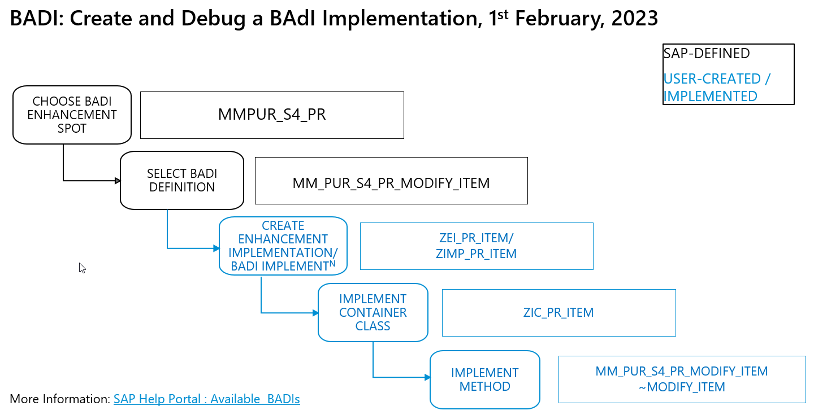

---


### Add `BAdI` implementation

1. Open an enhancement implementation **`ZEI_PR_ITEM`**.

2. Choose **Add `BAdI` implementation**

    <!-- border -->
    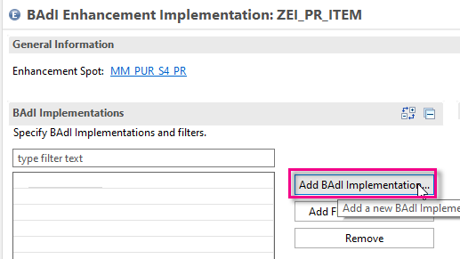


3. Add the following, then choose **Next**:
    - `BAdI` Definition: **`MM_PUR_S4_PR_MODIFY_ITEM`** *Modify Purchase Requisition Item* (Add by clicking on **Browse**) 
    - `BAdI` Implementation Name: **`ZIMP_PR_ITEM`**

        <!-- border -->
        [step1b-badi-impl-info](step1b-badi-impl-info.png)

Your `BAdI` implementation appears in a new editor.

<!-- border -->
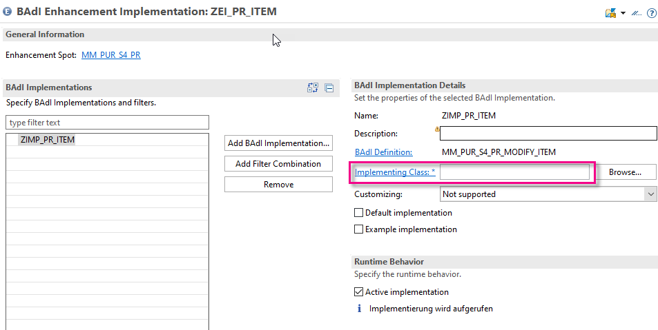

Ignore the error. You will fix this in the next step.


### Create implementing class

1. Choose **Implementing Class**.

2. Enter the following, then choose **Next**.
    - Name: **`ZIC_PR_ITEM`**
    - Description: **Modify PR Item for Debugger**
    - (Added automatically): Interfaces: **`if_mm_pur_s4_pr_modify_item`**

3. Choose the transport request, then choose **Finish**.

    The class appears in a new editor with skeleton code.

    ```ABAP
    CLASS ZIC_PR_ITEM DEFINITION
      PUBLIC
      FINAL
      CREATE PUBLIC .

      PUBLIC SECTION.

        INTERFACES if_badi_interface .
        INTERFACES if_mm_pur_s4_pr_modify_item .
      PROTECTED SECTION.
      PRIVATE SECTION.
    ENDCLASS

    ```

4. Format, save, and activate the class ( **`Shift+F1, Ctrl+S, Ctrl+F3`** ).

5. Go back to your `BAdI` implementation **`ZIMP_PR_ITEM`** and activate it too.

The error will disappear.


### Implement code

1. Add the following code to the method implementation **`if_mm_pur_s4_pr_modify_item~modify_item`**:

    The `BAdI` returns an warning message if the **`doc type`** is standard. Since this triggers the `BAdI` almost every time, this is useful for tracing and debugging purposes.

        ```ABAP
        CLASS ZIC_PR_ITEM IMPLEMENTATION.


          METHOD if_mm_pur_s4_pr_modify_item~modify_item.

            DATA: ls_message LIKE LINE OF messages.

            " If <very common scenario occurs>, display Warning
            IF purchaserequisition-PURCHASINGDOCUMENTTYPE EQ 'NB'.
              ls_message-messageid = 'SampleID'.             "Message ID
              ls_message-messagetype = 'W'.                   "Type of Message
              ls_message-messagenumber = '001'.               "Message Number
              ls_message-messagevariable1 = 'PH1'.           "Place holder
              APPEND ls_message TO messages.
            ENDIF.

          ENDMETHOD.
        ENDCLASS.

        ```

2. Format, save, and activate the class ( **`Shift+F1, Ctrl+S, Ctrl+F3`** ).

3. Check that yours is the implementation that will be called:

    <!-- border -->
    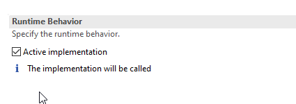


### Add ABAP Cross Trace in ADT
First you will add the relevant view to your ABAP perspective.

1. In ADT, search for the view **ABAP Cross Trace** using the magnifying glass; then add it by clicking it.

    <!-- border -->
    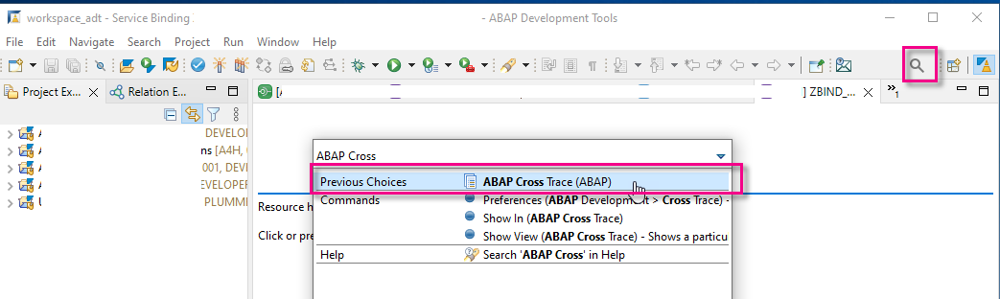

2. The view appears. Now you will create the trace configuration. Select your system and choose **Create Configuration...** from the context menu.
    <!-- border -->
    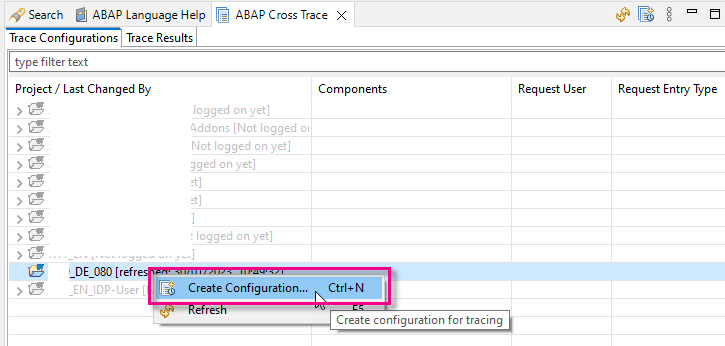

3. Enter the following information, then choose **OK**.

   
    |  Field Name             | Value
    |  :----------------------| :-------------
    |  Activate Trace | Yes
    | Deactivate at ... | 40
    | Description | Trace Purch Req - Modify Item
    | Component | *Choose **`ABAP-BAdIs > BAdI Calls`**; deselect all other traces.
    | Trace Level | (4) Verbose 

    <!-- border -->
    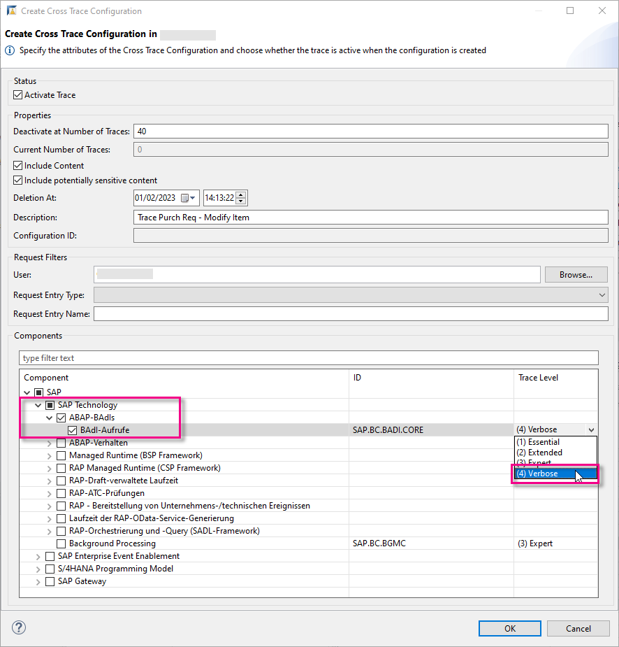

The active trace appears.

  <!-- border -->
  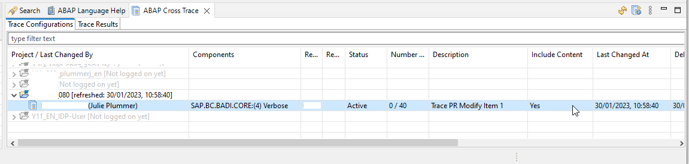


### Execute app
You will now execute the app while the trace is active.

1. In the app **Manage Purchase Requisitions - Professional**, choose an existing purchase requisition and navigate to the detail, then to the **Items** tab.

    <!-- border -->
    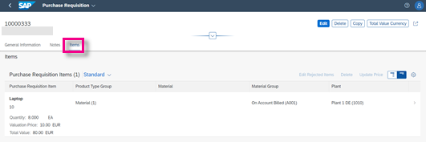

2. Choose **Edit**.

3. Trigger the `BAdI`, e.g. by changing the quantity; notice the message ID, **`BAdI`**.

    <!-- border -->   
    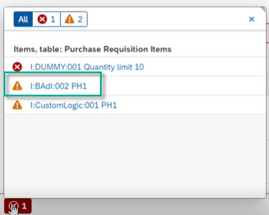


### Analyze BAdI call in ABAP Cross Trace
1. Back in ADT, deactivate the trace from the context menu, then choose **Refresh**.

    <!-- border -->
    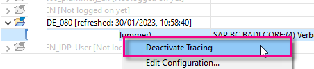

2. In the tab **Trace Results**, navigate through the trace records; filter by **`MODIFY_ITEM`**.

3. Note the relevant `BAdI` implementation class associated with **`IF_MM_PUR_S4_PR_MODIFY_ITEM~MODIFY_ITEM`** is **`ZIC_PR_ITEM`**; note the **`MESSAGEID = BAdI`**.

    <!-- border -->
    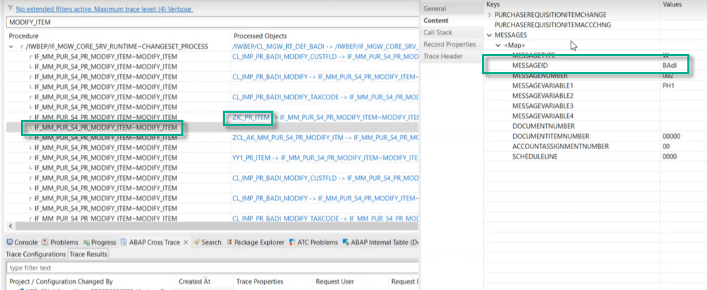

You can now edit this class in ADT.

<!-- border -->
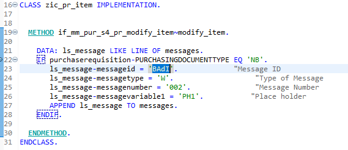


### Open ABAP Debugger

Now, you can check the developer extension (`BAdI`) using ABAP Debugger.

1. In the backend system, search for your implementing class **`ZIC_PR_ITEM`**.

    <!-- border -->
    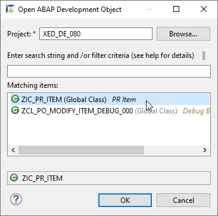

2. Set a breakpoint. 

    Position the cursor within the ruler (left bar) of the source editor at the line 
    `IF purchaserequisition-PURCHASINGDOCUMENTTYPE EQ 'NB'.`, then choose **Toggle Breakpoint** from the context menu.

    <!-- border -->
    

3. Go back to the **Manage Purchase Requisitions - Professional** app and create a new purchase requisition (PR).

    <!-- border -->
    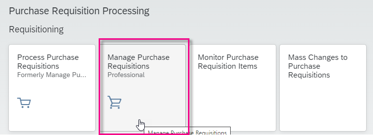

4. Now that the breakpoint is set, the system suggests you change to the **ABAP Debugger** perspective. Choose **Switch**.

    <!-- border -->
    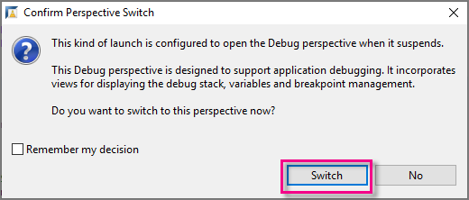

5. The perspective appears, showing: The call stack; your code; any breakpoint(s) you have set.

    <!-- border -->
    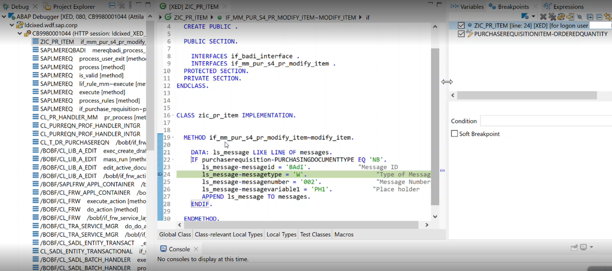

6. You can now step through the code as normal (using F5, F6, F7). When you are done, choose **Terminate (F8)** from the main toolbar. You will return to the **ABAP** perspective.

    <!-- border -->
    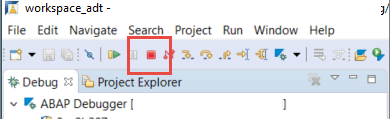   


### Set condition for breakpoint
Once set, this condition is evaluated at runtime whenever the source code position of the breakpoint is reached. If the condition is fulfilled (evaluates to true), the debugger will stop execution at the breakpoint. 

1. Place your cursor on your breakpoint and choose **Breakpoint Properties** from the context menu.

    <!-- border -->
    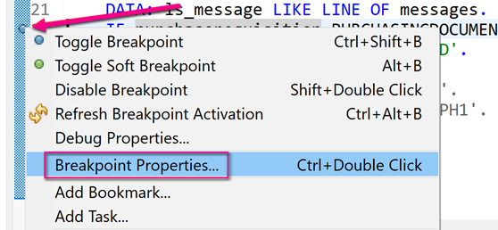

2. Add the condition `PURCHASEREQUISITIONITEM~ORDEREDQUANTITY=9`, then choose **Apply**.

    <!-- border -->
    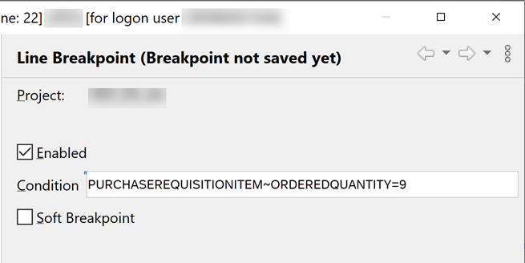

3. Again, run the app **Manage Purchase Requisitions - Professional**, create a new PR, switch to the Debugger when prompted.

The Debugger has stopped where the **`ORDEREDQUANTITY`** = 9.

<!-- border -->
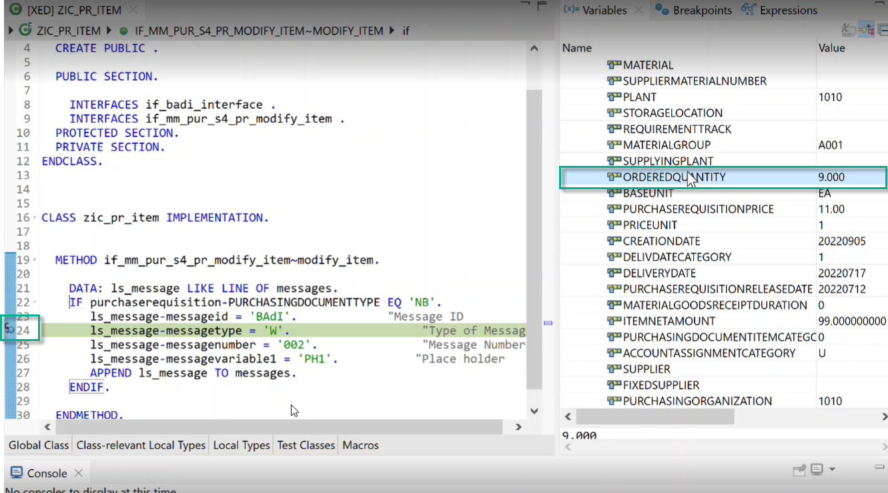


### Set `watchpoint`
Once a `watchpoint` is set, the Debugger stops as soon as the value of a watched variable has changed. Furthermore, you can specify conditions for `watchpoints.`

> You can only set a `watchpoint` for a variable **during** a running ABAP debug session.

1. In the class **`ZIC_PR_ITEM`**, position the cursor on the relevant field.

    <!-- border -->
    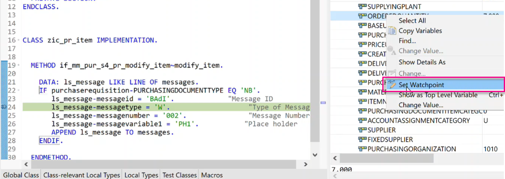

    <!-- border -->
    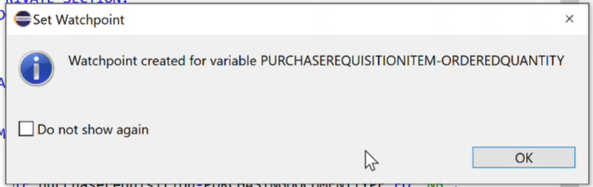

2. To set a condition for the `watchpoint`: open the **Breakpoints** view in the **Debugger** perspective, select the `watchpoint`, then enter a condition.

    <!-- border -->
    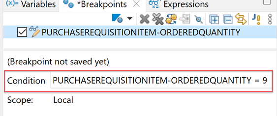

The ABAP Debugger stops as soon as the value of the variable is changed after a debug step **and** the specified condition for the `watchpoint` is fulfilled.   


### Test yourself


### More information
- SAP Help Portal: [SAP Cloud Platform Concepts: ABAP Debugger](https://help.sap.com/docs/BTP/5371047f1273405bb46725a417f95433/4ec365a66e391014adc9fffe4e204223.html)
- SAP Help Portal: [SAP Cloud Platform Tasks: Debugging ABAP Code in ADT](https://help.sap.com/docs/BTP/5371047f1273405bb46725a417f95433/4ec33a996e391014adc9fffe4e204223.html)
- You can also see a demo in this video: [Running ABAP Cross Trace with a `BAdI`](https://video.sap.com/media/t/1_4aps5ak1)

---
