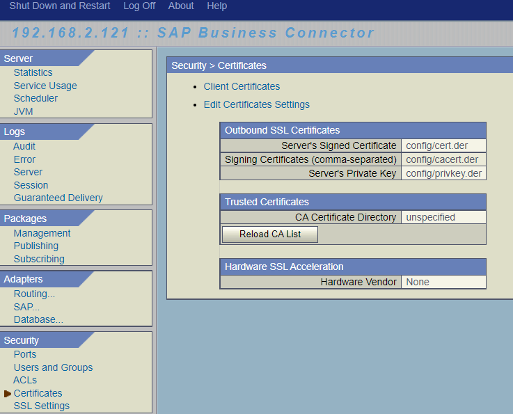

# Set Up the SAP Business Connector for On-Premise WebSocket RFC to Cloud
<!-- description --> Learn how to set up the SAP Business Connector to to connect an on-premise system prior to 1909 to cloud using WebSocket RFC.

## You will learn
- to set up the SAP BC for WebSocket RFC from on-premise to cloud systems.

## Intro
**Download**

The installer can be downloaded free of charge from the [SAP BC homepage](https://support.sap.com/sbc-download). (A one-time registration of the SAP customer ID is required.)

An installation guide and other documentation can be downloaded from the [SAP BC details page](https://support.sap.com/en/product/connectors/bc/details.html).

> If the on-premise ABAP System is an S/4HANA version 1909 or newer, the underlying ABAP platform can perform WebSocket RFC calls without any additional component. The business connector is not required in this case.

---

### Download SAP Business Connector

1. Go to the [SAP BC homepage](https://support.sap.com/sbc-download) and download the SAP BC server and developer version.
2. Install the SAP BC by running the setup file in administrator mode. We recommend to access the setup file from the console.

    > When installing the developer version, make sure to also install the Certificate Toolkit.

3. Install the latest core fix and service release. You can find them on the download page of the SAP BC. Follow the instructions of the installation guides. You can find them in the `ReadMe` text file in the download folder.

### Set up the certificate directory

1. Go to the `config` folder in the directory where SAP BC Server is installed. For example `C:\sapbc481\Server\config`.
2. Create a new folder with the name `trusted`.
3. Start SAP BC Server.
4. Go to **Security > Certificates**.
5. Choose **Edit Certificates Settings**.
  
6. Under **Trusted Certificates**, enter `config/trusted` in field **CA Certificate Directory**.
7. Choose **Save Changes**.

### Generate certificates

1. Start the Certificate Toolkit. You can find it in the SAP BC Developer directory. Here, go to `certkit/bin/ssltoolkit.bat`.
2. Select **Generate a Private Key** and choose **Next**.
    - Key size: `2048 (Bit)`
    - File name: `privkey.der`
    - Choose **Next**.
    - Optional: Enter a directory where the private key should be stored.
    - Under **Enter CSR file name**, enter `privkey.pem`.
    - Choose **Next** to generate the Certificate Signing Request.
3. Have the request signed by a certificate authority.
4. In the Certificate Toolkit, choose **Convert and Save Certificates for use with SAP Business Connector**.
    - Upload the CA's response and choose **Next**. Change the name of the CA's response to `cacert.der`
    - Certificate filename: `cert.der`
    - Choose **Next** to generate the certificate.

### Update certificate directory

Copy the private key, the CA's response, and the certificate to the `config` folder of the SAP BC server.

### Test yourself

### Set up WebSocket RFC from on-premise to cloud

[WebSocket RFC to Cloud Using SAP Business Connector](abap-websocket-rfc-bc)

---
