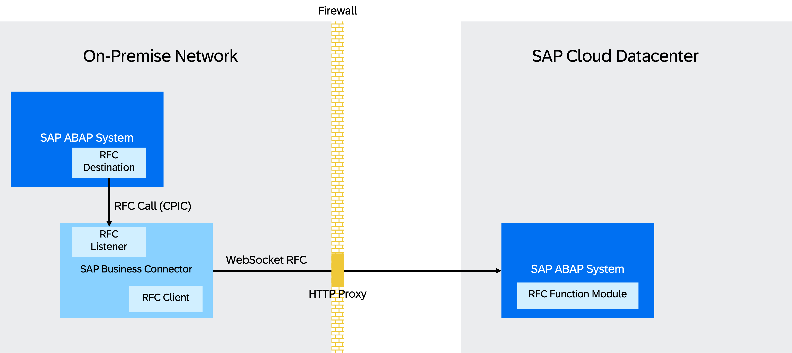

# WebSocket RFC to Cloud Using SAP Business Connector
<!-- description --> Learn how to connect an on-premise system prior to 1909 to cloud using WebSocket RFC.

## Prerequisites
 - Access to an SAP S/4 HANA system prior to version 1909
 - Access to the ABAP environment in a cloud system
 - Latest version of SAP Business Connector including all updates installed. To download SAP Business Connector, go to the [download page](https://support.sap.com/sbc-download). For more information about the installation and other documentation, go to the [details page](https://support.sap.com/en/product/connectors/bc/details.html).
 - You've created a private key, signing certificate, and signed certificate as described in the [certificate toolkit guide](https://support.sap.com/content/dam/support/en_us/library/ssp/products/connectors/bc/SBC_CertificateToolkitGuide_481.pdf).
 - We recommend completing the tutorial [Set Up the SAP Business Connector for On-Premise WebSocket RFC to Cloud](abap-setup-bc).

## You will learn
  - How to setup a WebSocket RFC connection from an on-premise system to a cloud system using SAP Business Connector.

## Intro
> In this tutorial, wherever **`XXX`** appears, use a number (e.g. **`000`**).

---

### Introduction

The following tutorial describes how to establish a connection between an on-premise ABAP system and a cloud-based ABAP system.

Technically, the connection works as follows:

1. The on-premise ABAP system makes an RFC request for an RFC destination of type **`T`**.
2. At this RFC destination, an SAP Business Connector (SAP BC) is registered. It receives the request, transforms it into a WebSocket/HTTPS-based request and forwards it to the cloud-based ABAP system.
3. The cloud-based ABAP system processes the request and returns the response back to the SAP BC.
4. The SAP BC transforms the response back to classic RFC protocol and returns it to the originating on-premise system.

  

SAP BC acts as a middleware between the classic CPIC-based RFC protocol and the WebSocket-based RFC protocol that can be `tunneled` through firewalls into the cloud without problems.

> If the on-premise ABAP System is an S/4HANA version 1909 or newer, the underlying ABAP platform can perform WebSocket RFC calls without any additional component. The business connector is not required in this case.

### Setting up the source system

In the source system, you need to setup an RFC destination of type **`T`** and allow SAP BC to register at this destination. The source system will later send all RFC calls, which are intended for the cloud system, to this RFC destination.

In the source system (the on-premise system), set up an RFC destination of type **`T`**.

1. Run transaction **`SM59`**.
2. Choose **create**.
    - Destination: **`MYDESTINATION_XXX`**
    - Connection Type: **T RFC connection to external program using TCP/IP**
3. (Optional): Enter a meaningful description.
4. On tab **Technical Settings**, make the following settings:
    - Activation Type: **Registered server program**
    - Program ID: **`CLOUD_SYSTEM_VIA_BC`**
    - Gateway Host: Hostname of one of the application servers of the on-premise system, which still has some free capacity.
    - Gateway Service: **`sapgwXX`**, where **`XX`** is the instance number of the on-premise system.
5. Go to tab **Unicode**.
    - Make sure that here **Unicode** is selected.
6. Save the destination.

 

### Allow SAP BC to register at the RFC destination

> If there is already a line like `P TP=* HOST=*`, you can skip this step.

1. Run transaction **`SMGW`**.
2. Choose **`Goto` > Expert Functions > External Security > Maintain ACL Files**.
3. Go to tab **`Reginfo File`**.
4. Choose **Insert Line > Standard**.
    - P/D (*): `P`
    - TP (*): `CLOUD_SYSTEM_VIA_BC`
    - Host: Host/IP where SAP BC will run, e.g. `10.87.64.3`

    > You can find out the IP in the command line. On Windows, enter `ipconfig`. On Mac or Linux, enter `ifconfig`. Copy the IPv4 Address.

    - Access: `internal`
    - Cancel: `local`
    - No: Leave this field unspecified.
    - Choose **Save**.
    - Save your settings globally.
    - Choose **`Goto` > Reread (global)**

> In releases older than 7.40 SP11, you have to change the `Reginfo` file manually. See [SAP Note 1989587](https://launchpad.support.sap.com/#/notes/1989587) for more information.

### Communication management in the target system

To provide a service in the cloud system, you must create the following entities:

- Communication user
- Communication system
- Communication arrangement

This procedure is the same as for other connection types. See [Overview of Communication Management](https://help.sap.com/docs/SAP_S4HANA_CLOUD/6aa39f1ac05441e5a23f484f31e477e7/5b8ff39ddb6741a29ddfcf587939e8f4.html?version=LATEST) for more information. In this tutorial, you don't need to create a communication scenario as we use the SAP-delivered scenario `SAP_COM_0636`. This scenario provides access to the following function modules:

- **`RFC_METADATA_GET`**
- **`RFC_FUNCTION_SEARCH`**
- **`RFC_GET_FUNCTION_INTERFACE`**
- **`DDIF_FIELDINFO_GET`**

However, you can also use your remote-enabled function module with a custom communication scenario. See [Develop a Remote-Enabled Function Module (RFM)](https://help.sap.com/docs/SAP_S4HANA_CLOUD/6aa39f1ac05441e5a23f484f31e477e7/abf7105063f345edad7588cf58d53118.html?version=LATEST) and [Communication Scenario](https://help.sap.com/docs/SAP_S4HANA_CLOUD/6aa39f1ac05441e5a23f484f31e477e7/7ea7276c89a644d9867bf0f8627aed67.html?version=LATEST) for more information.

### Create a communication user in the target system
1. Login to Fiori Launchpad in the target cloud system.
2. Choose **Communication Management > Maintain Communication Users**.
3. Choose **New**.
4. User Name: **`BC_USERXXX`**
5. Description: **`User for SAP BC`**
6. Password: **`PasswordForBC_USERXXX`**
7. Choose **Create**.

### Create a communication system
1. In Fiori Launchpad, choose **Communication Management > Communication Systems**.
2. Choose **New**.
    - System ID: **`MY_SYSTEMXXX`**
    - System Name: **`MY_SYSTEMXXX`**
3. Activate **Inbound Only**.
4. Under **Users for Inbound Communication**, choose **Add**.
    - Choose user **`BC_USERXXX`**.
    - Choose **OK**.
5. Save the communication system.

### Create a communication arrangement
1. In Fiori Launchpad, choose **Communication Management > Communication Arrangements**.
2. Choose **New**.
3. Search for communication scenario **`SAP_COM_0636`**.
4. Arrangement Name: **`MY_ARRANGEMENTXXX`**
5. Choose **Create**.
    - Communication System: **`MY_SYSTEMXXX`**
    - Copy the **API-URL**.
6. Save the communication arrangement.

### Define connection parameters for the cloud system in SAP BC

1. Start SAP BC.
2. Go to **Adapters > SAP**.
3. Choose **Add SAP Server**.
    - Name: **`Connection_to_Cloud`**
    - Connection Type: **`WebSocket Connection`**
    - Logon Type: **`User/Password`**
    - User: **`BC_USERXXX`**
    - Activate **Alias User**.
    - Password: **`PasswordForBC_USERXXX`**
    - Client: Client of the target cloud system (optional)
    - WebSocket Host: API-URL of the communication arrangement without the **`https://`** prefix

    > Including the `https://` prefix leads to an error when you test the connection.

    - WebSocket Port: **`443`**
    - Network: **WAN**
    - Choose **Save**.
    
    

4. Download the certificate of the target cloud system. We recommend using the browser's "show certificate" functionality. Most browsers provide information on the security status of the SSL/TLS connection, usually displayed as a small lock icon. Select this icon and save the CA root certificate to file. We recommend to use Chrome browser for this.

    

5. Add the cloud system's certificate to the trusted list in SAP BC.
    - Copy the certificate to the CA certificate directory of SAP BC. In this tutorial, the directory is in **`C:\sapbc481\Server\config\trust`**
    - Go to **Security > Certificates** and choose **Trusted Certificates > Reload CA List**.

    If your corporate firewall requires an HTTP proxy for outbound connections, you need to make this proxy known to the SAP BC. For this, go to **Settings > Proxy Servers > Secure Proxy (HTTPS)** and enter the host, port, and, if necessary, user information of your proxy server. Here, only basic proxy authentication can be configured.

6. Test the connection. Select the newly configured SAP server form the server list and choose **Test Connection**.

### Define connection parameters for the on-premise system in SAP BC

1. In SAP BC, choose **Adapters > SAP**.
2. Choose **Add SAP Server**.
    - Name: **`Connection_to_OP`**
    - Connection Type: **CPIC Connection**
    - Application Server: Hostname of your application server (= gateway host defined in your destination in *step 2*)
    - System Number: The instance number you used in *step 2*

      

    - Choose **Save**.
3. Go back to the **SAP Servers** list and choose **0** in the **Listeners** column of **`Connection_to_OP`** and choose **Add Listener**. This will create a so-called RFC Listener, which will connect to the RFC destination that we created in the on-premise system via transaction **`SM59`**.
    - Connection Type: **TCP/IP**
    - Program ID: **`CLOUD_SYSTEM_VIA_BC`**
    - Number of Threads: **5**
    - Gateway Host: Hostname of your application server (= gateway host defined in your destination in *step 2*). This field is filled automatically.
    - Gateway Service: The gateway service you used in *step 2*
    - Repository Server: **`Connection_to_Cloud`**

    Using the target cloud system as repository server has two advantages:

    - A function module must exist in the system, where it is to be executed. However, the same does not apply to the source system. Therefore, by letting SAP BC make the DDIC lookup in the cloud system, the on-premise system can call function modules of the cloud system, that do not exist in the on-premise system.

    - By using the cloud system for the DDIC lookups, the SAP BC does not need user credentials for the on-premise system.

    

    - Choose **Save**.
    - Start the listener. Choose the red button in column **Started?**.

### Define routing for function modules

Define what SAP BC shall do with the incoming RFC requests. In our case, we simply instruct SAP BC to send everything that it receives from the on-premise system to the target cloud system.

1. In SAP BC, choose **Adapters > Routing > Routing Rules**.
2. Under **Add Routing Rule**, enter the following:
    - Sender: Enter your the system ID of the on-premise system with the current client, for example **`YI3000`**.
    - Receiver: **`MYDESTINATION_XXX`**
    - Message Type: **`*`**

3. Choose **Add**.
    - Transport: **RFC**
    - Destination: **`Connection_to_Cloud`**
    - Choose **Save**.
    - Activate the rule by choosing **No** in column **Enabled?**.

    

### Test the connection

1. Run transaction **`SM59`**.
2. Choose your destination **`MYDESTINATION_XXX`**.
3. Choose **Connection Test**.

### Test yourself

