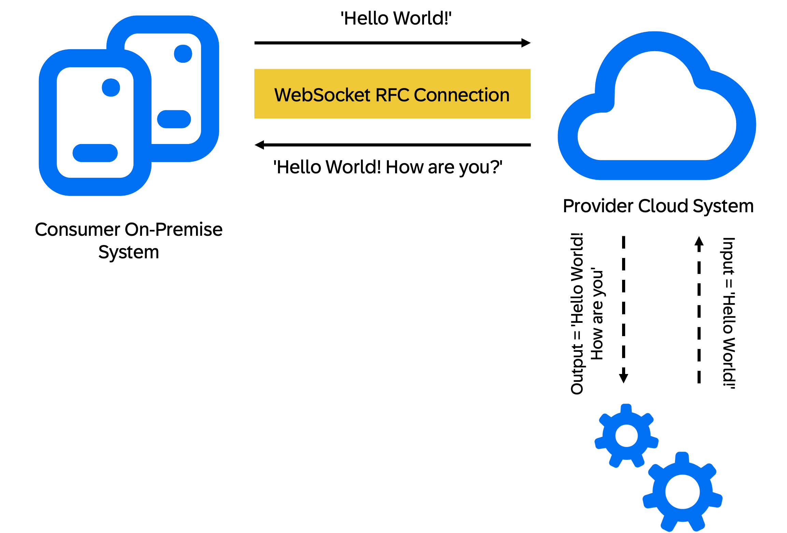

# WebSocket RFC to Cloud
<!-- description --> Learn how to establish a WebSocket RFC connection from an on-premise to a cloud system.

## You will learn
- how to connect an on-premise system to cloud using WebSocket RFC.


## Prerequisites
 - Access to an SAP S/4HANA system of at least version 1909
 - Access to the ABAP environment in a cloud system
 - Access to the communication management apps in SAP Fiori launchpad.
 - Latest version of ABAP Development Tools (ADT) installed with a project for each system.


> In this tutorial, wherever **`XXX`** appears, use a number (e.g. **`000`**).

---


## Intro

The following tutorial describes how to establish a connection between an on-premise ABAP system and a cloud-based ABAP system.

> If the on-premise ABAP System is an S/4HANA older than version 1909, the underlying ABAP platform can't perform WebSocket RFC calls. The SAP Business Connector is required in this case. See [WebSocket RFC to Cloud Using SAP Business Connector](https://developers.sap.com/tutorials/abap-websocket-rfc-bc.html) for more information.

### Setting up the provider system

First, you have to create a communication scenario based on a remote-enabled function module (RFM) in the provider cloud system. You can also use your own communication scenario and RFM, or use one of the SAP-delivered communication scenarios, for example `SAP_COM_0636`. For this tutorial, we will create a simple RFM that can receive a string, adds another string to it and returns the result to the sender.



### Create a remote-enabled function module
1. Launch ABAP development tools (ADT) in the provider cloud system.
2. Select the relevant package, open the context menu and choose **New > Other ABAP Repository Object > ABAP Function Group**
    - Name: **`Z_Function_Group_XXX`**
    - Description: **`Function Group for RFM`**
3. Save and activate the function group.
4. Select the newly created function group, open the context menu and choose **New > ABAP Function Module**.
    - Name: **`Z_RFM_XXX`**
    - Description: **`RFM for WebSocket RFC`**
5. Paste the following code.

    ```ABAP
        FUNCTION Z_RFM_XXX

          IMPORTING
            VALUE(input) TYPE string
          EXPORTING
            VALUE(output) TYPE string.
        
          output = input && ' How are you?'.

        ENDFUNCTION.

    ```

6. Save and activate the function module.

### Enable the function module for remote function call
1. In the project explorer, select the RFM.
2. Choose **File > Properties > Specific**.
    - Processing Type: **`RFC`**
    - RFC Scope: **`From any system`**
    - RFC Interface Contract: **`Any`**

      
3. Save and activate the RFM.

### Create and publish a communication scenario

1. In the relevant package, open the context menu and choose **New > Other ABAP Repository Object > Communication Scenario**.
    - Name: **`Z_WS_RFC_XXX`**
    - Description: **`Communication Scenario for WebSocket RFC`**
2. Go to tab **Inbound**.
3. In the section **Inbound Services**, choose **Add**.
4. In the field **Inbound Service ID**, enter the name of your RFM: **`Z_RFM_XXX_RFC`**. The **`_RFC`** is automatically added.
5. Make sure that in the field **Service Type**, the value **`RFC`** is specified.
6. Choose **Finish**.
7. Save the communication scenario.
8. Choose **Publish Locally**.

### Create a communication arrangement
1. In the provider system, log on to SAP Fiori launchpad.
2. Go to **Communication Management** and choose **Communication Arrangements**.
3. Choose **New**.
    - Scenario: **`Z_WS_RFC_XXX`**
    - Arrangement Name: **`Z_WS_RFC_ARRANGEMENT_XXX`**
4. Choose **Create**.
5. In the section **Common Data** in field **Communication System**, choose **New**.
    - System ID: **`Z_WS_RFC_SYSTEM_XXX`**
    - System Name: **`Z_WS_RFC_SYSTEM_XXX`**
6. Choose **Create**.
7. In the section **Technical Data**, activate **Inbound Only**.
8. Under **Users for Inbound Communication**, choose **Add**.
9. In the **New Inbound Communication User**, choose **New User**.
    - User Name: **`IB_RFC_XXX`**
    - Description: **`User for inbound WebSocket RFC`**
    - Password: **`Inbound_WebSocket_RFC_XXX`**
10. Choose **Create**. 
11. In the **New Inbound Communication User** window, choose **OK**.
12. Choose **Save**. You are redirected back to the communication arrangements screen.
13. Under **Inbound Communication**, make sure the new inbound communication user **`IB_RFC_XXX`** is entered.
14. Choose **Save**.
15. Copy the API-URL.
        

     


### Create a destination in the consumer system
Now that you have set up the provider cloud system, you have to create a destination in the consumer on-premise system. This destination allows you to connect to the provider system.

1. Log on to the consumer system in SAP Logon and run transaction **`SM59`**.
2. Choose **Create**.
    - Destination: **`Z_WSRFCDEST_XXX`**
    - Connection Type: **`W RFC connection to other ABAP system using WebSockets`**
3. On the tab **Technical Settings**, enter the following properties:
    - Host: The API URL you have copied in step *5.15.*  without the **`https://`** prefix.
    - Port: **`443`**  

      

    **Including the `https://` prefix leads to an error when you test the connection.**

4. On the tab **Logon & Security**, enter the following properties. Use the data of the inbound communication user from your communication system:
    - Explicit Client: **`by Hostname`**
    - by User/Password: activate **Alias User**
    - Alias User: **`IB_RFC_XXX`**
    - Password: **`Inbound_WebSocket_RFC_XXX`**

        
5. Choose **Save**.
6. Choose **Connection Test**. 

The connection test returns a ping result.

### Perform the WebSocket RFC call
1. Open ADT in the consumer on-premise system.
2. Select the relevant package, open the context menu and choose **New ABAP Class**.
    - Name: **`Z_WS_RFC_CALL_XXX`**
    - Description: **`WebSocket RFC Call`**
3. Paste the following code.

    ```ABAP

      CLASS z_ws_rfc_call_xxx DEFINITION
        PUBLIC
        FINAL
        CREATE PUBLIC .

        PUBLIC SECTION.

          INTERFACES if_oo_adt_classrun .
        PROTECTED SECTION.
        PRIVATE SECTION.
      ENDCLASS.

      CLASS z_ws_rfc_call_xxx IMPLEMENTATION.

        METHOD if_oo_adt_classrun~main.

          DATA lv_output TYPE string.
          DATA lv_input TYPE string VALUE 'Hello world!'.

          CALL FUNCTION 'Z_RFM_XXX' DESTINATION 'Z_WSRFCDEST_XXX'
            EXPORTING
              input  = lv_input
            IMPORTING
              output = lv_output.


          out->write( lv_output ).

        ENDMETHOD.
      ENDCLASS.

    ```

4. Save and activate the class.
5. Choose **Run > Run AS > ABAP Application (Console)**.

> You can use also a service consumption model for the RFC call. See [Generating Proxies for Remote Function Call (RFC)](https://help.sap.com/docs/ABAP_PLATFORM_NEW/c238d694b825421f940829321ffa326a/32812d950d3848359ce391dae477f201.html?version=LATEST) and [Enable RFC Communication in Your ABAP Code](https://help.sap.com/docs/ABAP_PLATFORM_NEW/b5670aaaa2364a29935f40b16499972d/bbbd14283e984d6aa7b05062f197ef5b.html?version=LATEST). You can download the required service metadata file from the communication arrangement in SAP Fiori launchpad.

### Result

You have sent a string (`Hello world!`) to the RFM in the provider system. The string is returned as `Hello world! How are you?` to the consumer system.

### Test yourself

